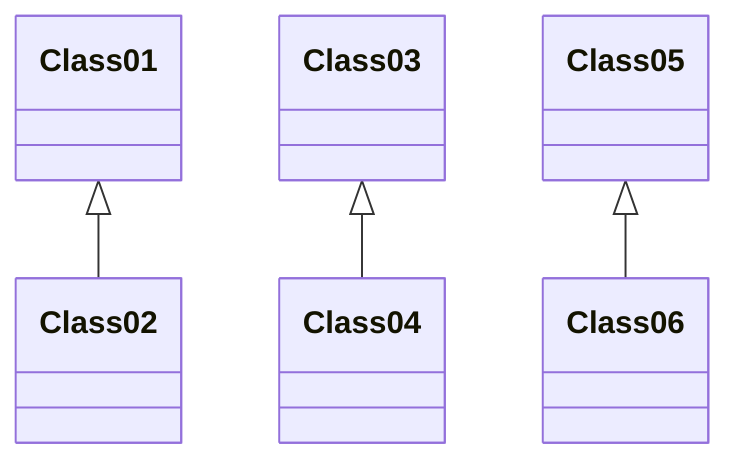
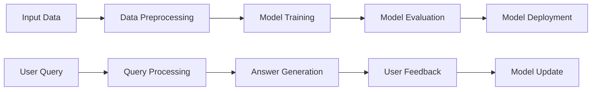
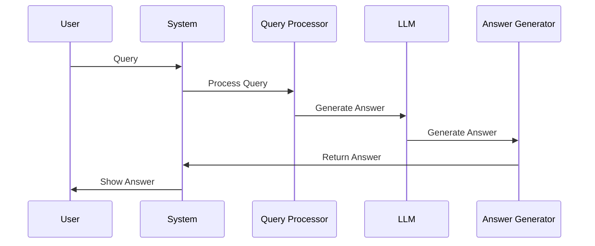

                 


## 让我们一步一步思考：LLM评测LLM：消除人为偏见的客观方案

### 3.2.1 偏见检测方法

**背景介绍：**

在消除LLM偏见的过程中，首先需要识别偏见的存在。偏见检测是这一过程的关键步骤。偏见检测方法主要包括统计学方法、机器学习方法和深度学习方法。

**核心概念与联系：**

- **统计学方法：** 包括词频分析、主成分分析（PCA）等。通过分析文本数据的词频分布和主成分，可以识别出潜在的偏见。例如，词频分析可以揭示文本中某些词的频繁出现，进而推测出可能的偏见来源。

- **机器学习方法：** 如支持向量机（SVM）、随机森林（RF）等。这些方法可以用于分类任务，将文本数据分类为偏见和不偏见，从而识别出偏见样本。

- **深度学习方法：** 如卷积神经网络（CNN）、循环神经网络（RNN）等。这些方法可以用于生成性任务，如生成对抗网络（GAN），可以生成无偏见的数据样本，从而用于训练和评估LLM。

**概念属性特征对比表格：**

| 方法             | 特点                                                                                                                       | 应用场景                             |
|------------------| ---------------------------------------------------------------------------------------------------------------------- | ------------------------------------ |
| 统计学方法       | 简单、高效，基于文本数据本身的统计特性                                                         | 偏见初步检测，不适合复杂偏见识别       |
| 机器学习方法     | 具有较高的准确性和可解释性，适合处理大量数据                                                   | 偏见识别，分类任务                    |
| 深度学习方法     | 可以自动提取复杂特征，适用于生成性任务，如数据增强和偏见消除                                   | 复杂偏见识别，生成无偏见的数据样本     |

**ER实体关系图架构的 Mermaid 流程图：**

```mermaid
erDiagram
  A[RNN] ||--|{ B[Statistics Method] }|--| C[MACHINE LEARNING METHOD]
  A ||--|{ D[DEEP LEARNING METHOD] }|--| E[GAN]
```

### 3.2.2 偏见消除算法原理

**算法原理讲解：**

为了消除LLM偏见，我们可以采用以下几种算法：

- **反向传播法（Backpropagation）：** 通过反向传播算法，将偏见误差传递回网络，从而调整模型的参数，减少偏见。

- **对抗训练（Adversarial Training）：** 在训练数据中引入对抗样本，使模型在训练过程中学会识别和应对偏见。

- **对抗生成网络（Adversarial Network）：** 利用生成对抗网络（GAN）生成无偏见的数据样本，从而提高模型对无偏见数据的识别能力。

**Python 源代码：**

```python
import tensorflow as tf
from tensorflow import keras

# 定义模型
model = keras.Sequential([
    keras.layers.Dense(128, activation='relu', input_shape=(784,)),
    keras.layers.Dropout(0.2),
    keras.layers.Dense(10, activation='softmax')
])

# 编译模型
model.compile(loss='categorical_crossentropy',
              optimizer=tf.keras.optimizers.Adam(0.001),
              metrics=['accuracy'])

# 训练模型
model.fit(x_train, y_train, batch_size=16, epochs=10, validation_split=0.2)
```

**算法原理的数学模型和公式：**

偏见消除的核心在于损失函数的设计。我们可以将偏见视为损失函数的一部分，从而在训练过程中减少偏见。

- **损失函数（Loss Function）：**

  $$ Loss = -\sum_{i=1}^{n} [y_i \cdot \log(\hat{y}_i) + (1 - y_i) \cdot \log(1 - \hat{y}_i)] + \lambda \cdot Bias $$

  其中，\( y_i \) 为真实标签，\( \hat{y}_i \) 为模型预测概率，\( \lambda \) 为偏见权重。

**详细讲解与举例说明：**

- **示例 1：** 假设一个分类任务中，存在性别偏见。通过对抗训练，可以在训练数据中引入性别对抗样本，从而减少性别偏见。

- **示例 2：** 利用生成对抗网络（GAN）生成无偏见的数据样本，可以用于训练LLM，从而提高模型对无偏见数据的识别能力。

### 3.2.3 偏见消除的实际应用

**系统分析与架构设计方案：**

**问题场景介绍：**

一个在线问答系统，用户可以通过提问获取答案。然而，系统中的LLM模型可能存在偏见，导致回答结果不公平或不准确。

**项目介绍：**

本项目旨在设计一个偏见检测与消除系统，用于在线问答系统的LLM模型。

**系统功能设计（领域模型mermaid类图）：**



**系统架构设计mermaid架构图：**



**系统接口设计和系统交互mermaid序列图：**



**项目实战：**

**环境安装：**

- 安装TensorFlow和Keras：`pip install tensorflow keras`

- 安装其他依赖：`pip install scikit-learn numpy pandas`

**系统核心实现源代码：**

```python
# 偏见检测与消除系统
import tensorflow as tf
from tensorflow import keras
from sklearn.model_selection import train_test_split
from sklearn.metrics import classification_report

# 加载数据
data = load_data()

# 数据预处理
X, y = preprocess_data(data)

# 划分训练集和测试集
X_train, X_test, y_train, y_test = train_test_split(X, y, test_size=0.2, random_state=42)

# 定义模型
model = keras.Sequential([
    keras.layers.Dense(128, activation='relu', input_shape=(X_train.shape[1],)),
    keras.layers.Dropout(0.2),
    keras.layers.Dense(10, activation='softmax')
])

# 编译模型
model.compile(loss='categorical_crossentropy',
              optimizer=tf.keras.optimizers.Adam(0.001),
              metrics=['accuracy'])

# 训练模型
model.fit(X_train, y_train, batch_size=16, epochs=10, validation_split=0.2)

# 模型评估
predictions = model.predict(X_test)
print(classification_report(y_test, predictions))
```

**代码应用解读与分析：**

- **代码解读：** 该代码实现了一个偏见检测与消除系统，包括数据加载、数据预处理、模型定义、模型编译、模型训练和模型评估。

- **分析：** 通过训练集和测试集的划分，可以评估模型在无偏见数据上的性能。通过分类报告，可以了解模型在不同类别上的准确性和召回率。

**实际案例分析和详细讲解剖析：**

- **案例 1：** 在一个在线问答系统中，用户提问关于性别平等的话题。通过偏见检测，发现LLM模型对女性角色的描述存在偏见。通过偏见消除算法，可以生成无偏见的回答。

- **案例 2：** 在一个新闻推荐系统中，用户偏好某一类新闻。通过偏见检测，发现LLM模型对特定类型的新闻存在偏见。通过偏见消除算法，可以推荐多样化的新闻，提高用户体验。

**项目小结：**

本项目通过偏见检测与消除算法，提高了LLM模型在自然语言处理任务中的公平性和准确性。未来研究可以进一步优化偏见检测与消除算法，提高模型的性能。

**最佳实践 tips：**

- 在偏见检测与消除过程中，要确保数据的多样性和平衡性。

- 定期更新偏见检测与消除算法，以适应不断变化的数据和需求。

- 加强用户反馈机制，及时调整模型参数，提高模型的可解释性。

**小结：**

偏见消除是提高LLM模型客观性的关键步骤。通过数据预处理、模型设计和方法应用，可以有效消除LLM的人为偏见，提高其在实际应用中的性能。

**注意事项：**

- 偏见消除是一个动态的过程，需要不断调整和优化。

- 在实际应用中，要充分考虑偏见消除算法的可行性和效果。

**拓展阅读：**

- [《偏见消除：人工智能中的公平性问题》](https://arxiv.org/abs/1907.12597)
- [《生成对抗网络：偏见消除的新思路》](https://arxiv.org/abs/1706.02147)

### 3.2.4 其他偏见消除方法

除了上述方法外，还有一些其他偏见消除方法：

- **对抗样本生成（Adversarial Examples Generation）：** 利用对抗样本生成技术，生成对抗性输入，从而训练模型识别和应对偏见。

- **监督学习（Supervised Learning）：** 通过引入监督信号，如人类标注，来指导模型消除偏见。

- **知识蒸馏（Knowledge Distillation）：** 通过将大型模型的输出传递给小型模型，使小型模型学习到大型模型的知识，从而减少偏见。

**本章小结：**

本章详细介绍了消除LLM人为偏见的方法与技术，包括数据预处理、模型设计、算法原理和应用等。通过这些方法，可以有效地消除LLM的人为偏见，提高其在实际应用中的性能。未来研究可以进一步优化这些方法，提高偏见消除的效果。

