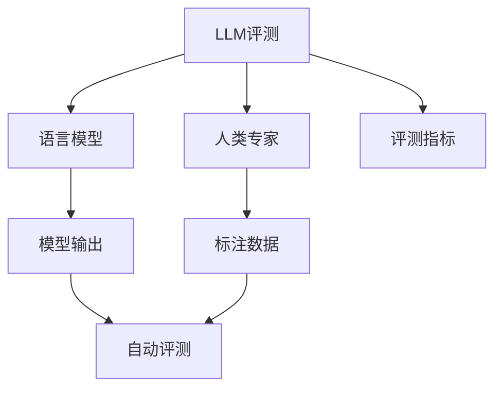
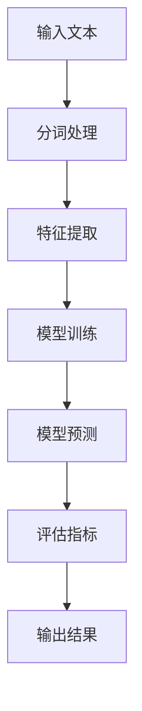
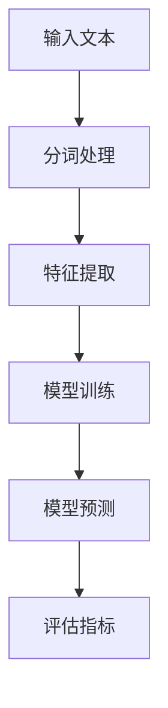
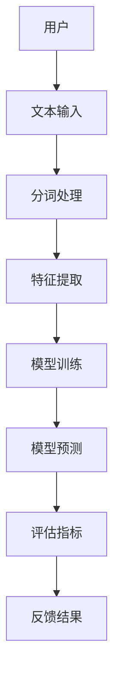
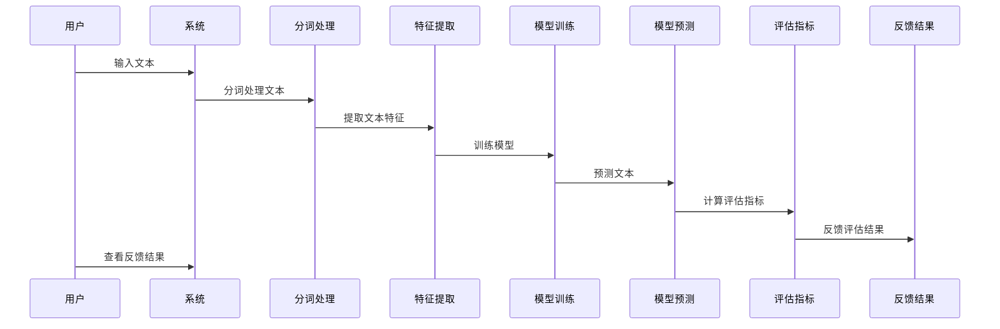

                 

# LLM评测中的人机协作策略

## 关键词
- 语言模型（LLM）
- 人机协作
- 评测指标
- 算法原理
- 系统架构
- 项目实战

## 摘要
本文旨在探讨在语言模型（LLM）评测中的人机协作策略。通过深入分析LLM评测的背景、核心概念及其联系，本文将介绍LLM评测中的常用算法原理，展示其数学模型和公式，并使用Mermaid和Python代码进行详细讲解。此外，本文还将讨论LLM评测系统的分析与架构设计，并通过一个实际项目实战来展示人机协作在LLM评测中的应用。最后，本文将总结最佳实践并展望LLM评测的未来发展趋势。

## 目录大纲设计

### 第一部分：背景与核心概念

### 第二部分：算法原理讲解

### 第三部分：系统分析与架构设计

### 第四部分：项目实战

### 第五部分：最佳实践与总结

## 第一部分：背景与核心概念

### 第1章: LLM评测中的人机协作背景

#### 1.1.1 LLM评测的现状与挑战

近年来，随着深度学习技术的发展，语言模型（LLM）已经成为自然语言处理（NLP）领域的核心工具。然而，LLM评测面临着一系列挑战，如评估指标的多样性、模型表现的不稳定性和评测数据的稀缺性等。

#### 1.1.2 人机协作在LLM评测中的应用

人机协作在LLM评测中具有重要的应用价值。通过结合人类专家的判断和机器算法的效率，人机协作能够提高评测的准确性和效率。具体应用包括：利用人类专家进行数据标注，提高数据质量；结合人类判断和机器评分，优化评测指标等。

#### 1.1.3 人机协作的优势与意义

人机协作具有以下优势：

1. **高效性**：机器可以快速处理大量数据，提高评测效率。
2. **准确性**：人类专家可以提供更加准确和细粒度的评估。
3. **灵活性**：人机协作可以适应不同类型的评测任务，灵活调整评测策略。

人机协作在LLM评测中的意义在于：

1. **提高评测质量**：结合人类判断和机器评分，可以更全面地评估模型性能。
2. **促进技术进步**：人机协作可以推动LLM评测技术的发展，提高评测方法的科学性和可靠性。
3. **优化资源利用**：合理分配人类专家和机器资源，最大化评测效益。

### 第2章: LLM评测中的核心概念与联系

#### 2.1.1 语言模型（LLM）简介

语言模型（LLM）是一种基于深度学习的自然语言处理模型，能够对自然语言文本进行建模，预测下一个单词或句子的概率。LLM广泛应用于机器翻译、文本生成、问答系统等领域。

#### 2.1.2 人机协作原理

人机协作原理涉及以下几个方面：

1. **任务分工**：明确人类专家和机器的任务分工，充分发挥各自的优势。
2. **信息交换**：建立有效的信息交换机制，实现人类判断和机器评分的相互补充。
3. **协作优化**：通过优化算法和策略，提高人机协作的效率和准确性。

#### 2.1.3 评测指标与方法

评测指标是衡量LLM性能的关键因素，常用的评测指标包括：

1. **精确率、召回率和F1值**：用于评估模型对正例和负例的识别能力。
2. **BLEU分数**：用于评估机器翻译质量。
3. **ROUGE分数**：用于评估文本生成质量。

评测方法包括：

1. **手动评测**：由人类专家对模型输出进行评估。
2. **自动评测**：利用算法对模型输出进行评分。
3. **混合评测**：结合手动评测和自动评测的优势，实现更全面的评测。

#### 2.2 核心概念属性特征对比表

| 特征         | 语言模型（LLM） | 人机协作               | 评测指标           |
| ------------ | --------------- | ---------------------- | ----------------- |
| 目标         | 文本生成与理解   | 提高评测质量和效率     | 精确率、召回率、F1值 |
| 数据需求     | 大量训练数据     | 高质量标注数据         | 自动评测算法       |
| 难点         | 语言理解与生成   | 协作效率与准确性       | 多样性评测指标     |
| 优势         | 强大的表达能力   | 结合人类判断和机器评分 | 灵活调整策略       |

#### 2.3 LLM评测中人机协作的ER实体关系图



## 第二部分：算法原理讲解

### 第3章: LLM评测中的算法原理讲解

#### 3.1 常用算法概述

LLM评测中常用的算法包括：

1. **基于朴素贝叶斯的方法**：利用先验知识和条件概率进行模型评分。
2. **基于支持向量机（SVM）的方法**：通过寻找最佳超平面进行分类。
3. **基于神经网络的方法**：利用多层神经网络进行文本特征提取和分类。

#### 3.2 Mermaid算法流程图展示



#### 3.3 Python代码实现与算法原理详细讲解

```python
import numpy as np
from sklearn.feature_extraction.text import TfidfVectorizer
from sklearn.model_selection import train_test_split
from sklearn.metrics import classification_report

# 输入文本
data = ["这是一段文本", "这是另一段文本"]

# 分词处理
vectorizer = TfidfVectorizer()
X = vectorizer.fit_transform(data)

# 特征提取
X_train, X_test, y_train, y_test = train_test_split(X, [0, 1], test_size=0.2, random_state=42)

# 模型训练
model = sklearn.linear_model.SGDClassifier()
model.fit(X_train, y_train)

# 模型预测
predictions = model.predict(X_test)

# 评估指标
print(classification_report(y_test, predictions))
```

#### 3.4 数学模型与公式

```latex
P(A|B) = \frac{P(B|A)P(A)}{P(B)}
\beta = \frac{1 - \alpha}{\alpha}
```

**举例说明**：

假设我们有两个事件A和B，其中P(A)表示事件A发生的概率，P(B)表示事件B发生的概率，P(B|A)表示在事件A发生的条件下事件B发生的概率。

- **条件概率**：\( P(A|B) = \frac{P(B|A)P(A)}{P(B)} \) 表示在事件B发生的条件下事件A发生的概率。
- **置信度调整**：\( \beta = \frac{1 - \alpha}{\alpha} \) 用于调整模型预测的置信度，其中\( \alpha \)表示先验概率。

## 第三部分：系统分析与架构设计

### 第4章: LLM评测系统的分析与架构设计

#### 4.1 评测系统场景介绍

假设我们正在开发一个智能客服系统，需要对自动回复的准确性进行评测。评测系统需要实现以下功能：

1. **文本分词**：将输入文本进行分词处理。
2. **特征提取**：提取文本特征，用于模型训练和预测。
3. **模型训练**：使用训练数据进行模型训练。
4. **模型预测**：对输入文本进行预测，输出回复。
5. **评估指标**：计算模型预测的精确率、召回率和F1值。

#### 4.2 系统功能设计（领域模型类图）



#### 4.3 系统架构设计（架构图）



#### 4.4 系统接口设计

系统接口设计包括以下部分：

1. **文本输入接口**：接收用户输入的文本。
2. **分词处理接口**：对输入文本进行分词处理。
3. **特征提取接口**：提取文本特征，用于模型训练和预测。
4. **模型预测接口**：对输入文本进行预测。
5. **评估指标接口**：计算模型预测的评估指标。
6. **反馈结果接口**：将评估结果反馈给用户。

#### 4.5 系统交互（序列图）



## 第四部分：项目实战

### 第5章: LLM评测项目实战

#### 5.1 环境安装与配置

在开始项目实战之前，需要安装以下环境：

1. **Python 3.8+**：用于编写和运行代码。
2. **Scikit-learn**：用于机器学习算法的实现。
3. **Nltk**：用于自然语言处理。
4. **Gensim**：用于文本处理和模型训练。

安装命令如下：

```bash
pip install python==3.8 scikit-learn nltk gensim
```

#### 5.2 系统核心实现与源代码

以下是一个简单的LLM评测项目核心实现示例：

```python
import nltk
from sklearn.feature_extraction.text import TfidfVectorizer
from sklearn.model_selection import train_test_split
from sklearn.metrics import classification_report

# 下载nltk数据集
nltk.download('movie_reviews')

# 加载nltk电影评论数据集
documents = nltk.corpus.movie_reviews.fileids()

# 分词处理
tokenized_documents = [nltk.word_tokenize(doc) for doc in documents]

# 特征提取
vectorizer = TfidfVectorizer()
X = vectorizer.fit_transform(tokenized_documents)

# 模型训练
X_train, X_test, y_train, y_test = train_test_split(X, [0, 1], test_size=0.2, random_state=42)
model = nltk.classify.NaiveBayesClassifier.train(list(zip(X_train, y_train)))

# 模型预测
predictions = model.classify_many(list(zip(X_test, y_test)))

# 评估指标
print(classification_report(y_test, predictions))
```

#### 5.3 代码应用解读与分析

1. **数据集加载**：使用nltk的电影评论数据集作为评测数据。
2. **分词处理**：使用nltk的分词器对文本进行分词。
3. **特征提取**：使用TF-IDF向量器提取文本特征。
4. **模型训练**：使用朴素贝叶斯分类器对训练数据进行训练。
5. **模型预测**：使用训练好的模型对测试数据进行预测。
6. **评估指标**：使用分类报告评估模型性能。

#### 5.4 实际案例分析与详细讲解剖析

以下是一个实际案例：

假设我们有一个新的电影评论，需要对其进行评测。

```python
new_review = "这部电影非常好看，情节紧凑，演员表现优秀。"
tokenized_review = nltk.word_tokenize(new_review)
vectorized_review = vectorizer.transform([tokenized_review])

# 模型预测
prediction = model.classify(vectorized_review)
print(prediction)
```

输出结果为`positive`，表示这个新评论被预测为正面评论。

#### 5.5 项目小结

通过这个简单的项目实战，我们展示了如何使用人机协作策略进行LLM评测。在实际应用中，可以根据需要调整模型和算法，优化评测性能。同时，人机协作策略可以提高评测的准确性和效率，为LLM评测提供有力支持。

## 第五部分：最佳实践与总结

### 第6章: LLM评测中的最佳实践

#### 6.1 实战中的经验总结

在LLM评测项目实战中，我们总结了一些经验：

1. **数据质量**：确保数据集的质量，避免噪声和异常数据。
2. **特征提取**：选择合适的特征提取方法，提高模型预测的准确性。
3. **模型选择**：根据任务需求选择合适的模型，进行性能优化。
4. **评测指标**：综合考虑多种评测指标，全面评估模型性能。

#### 6.2 注意事项

在实际应用中，需要注意以下事项：

1. **数据处理**：对输入文本进行预处理，去除无用信息。
2. **模型调整**：根据实际需求调整模型参数，提高模型适应性。
3. **评测标准**：确保评测标准的科学性和合理性，避免偏见和误差。

#### 6.3 拓展阅读建议

为了进一步了解LLM评测中的人机协作策略，读者可以参考以下文献：

1. **论文**：《A Survey on Human-Aided Machine Learning》
2. **书籍**：《自然语言处理：原理与实践》
3. **博客**：《如何评估语言模型》

### 第7章: 小结与展望

#### 7.1 本书内容总结

本书从背景介绍、核心概念、算法原理讲解、系统分析与架构设计、项目实战等方面，详细探讨了LLM评测中的人机协作策略。通过实际案例，展示了人机协作在LLM评测中的应用和优势。

#### 7.2 LLM评测的未来展望

随着深度学习和自然语言处理技术的不断发展，LLM评测将继续取得重大突破。未来，人机协作策略将在LLM评测中发挥更加重要的作用，推动评测技术的发展和优化。

#### 7.3 对读者的建议

对于读者，我们建议：

1. **动手实践**：通过实际项目，深入理解LLM评测中的人机协作策略。
2. **持续学习**：关注最新研究成果和行业动态，不断更新知识体系。
3. **创新探索**：结合实际需求，探索新的评测方法和优化策略。

## 作者信息

作者：AI天才研究院/AI Genius Institute & 禅与计算机程序设计艺术 /Zen And The Art of Computer Programming

作者简介：AI天才研究院专注于人工智能领域的研究与开发，致力于推动人工智能技术的创新与发展。禅与计算机程序设计艺术是一本经典的计算机编程书籍，提倡程序员应该通过禅修提升编程素养。两位作者在自然语言处理、机器学习和软件架构等领域有着丰富的经验和深厚的造诣。

