                 

# LLM评测中的偏见检测与消除方法

关键词：大规模语言模型，偏见检测，偏见消除，评测方法，数据预处理，算法改进

摘要：本文旨在探讨大规模语言模型（LLM）评测中偏见检测与消除的方法。随着深度学习技术的快速发展，LLM在自然语言处理领域取得了显著成就，但其偏见问题引起了广泛关注。本文首先介绍了LLM偏见问题的背景和描述，随后详细阐述了偏见检测与消除的核心概念、联系以及应用。通过数据可视化、统计分析和机器学习等方法，研究者可以识别和消除LLM中的偏见，提高模型的公平性和可信度。

## 第一部分：背景介绍

### 第1章：问题背景

随着深度学习技术的快速发展，大规模语言模型（LLM）在自然语言处理领域取得了显著成就。LLM通过学习大量文本数据，能够生成高质量的自然语言文本，广泛应用于机器翻译、文本生成、问答系统等场景。然而，LLM在实际应用中面临着一系列挑战，其中之一就是偏见检测与消除。

### 1.1.1 问题背景

偏见问题是指在模型训练、预测和决策过程中，模型对某些特定群体或话题产生不公平的结果。LLM偏见问题主要源于以下几个方面：

1. **训练数据偏见**：LLM的偏见问题很大程度上源于训练数据集。如果训练数据集中存在偏见，那么模型在处理相关问题时也会产生偏见。
2. **算法偏见**：部分算法设计可能存在不公平性，导致模型在某些情况下产生偏见。
3. **模型偏见**：训练好的模型可能在处理新数据时表现出偏见，这可能与模型的泛化能力有关。

### 1.1.2 问题描述

LLM的偏见问题主要体现在以下几个方面：

1. **性别偏见**：在生成与性别相关的文本时，模型可能对某个性别表现出更偏好或不公平的态度。
2. **种族偏见**：模型在处理与种族相关的话题时，可能对某些种族产生偏见。
3. **文化偏见**：在处理与特定文化相关的内容时，模型可能对不同文化产生不公平的输出。
4. **政治偏见**：模型在处理与政治相关的话题时，可能对某些政治观点或派别产生偏见。

### 1.1.3 问题解决

为了解决LLM的偏见问题，研究者们提出了一系列方法：

1. **数据清洗**：对训练数据进行清洗，去除可能存在的偏见。
2. **算法改进**：优化算法设计，提高模型对偏见因素的识别和消除能力。
3. **模型约束**：通过模型约束来限制模型产生偏见。
4. **多样性训练**：引入多样性的训练数据，提高模型的泛化能力。

### 1.1.4 边界与外延

1. **边界**：本文主要讨论LLM评测中的偏见检测与消除方法，不包括其他类型模型的相关问题。
2. **外延**：本文中的方法可以应用于其他存在偏见问题的领域。

### 1.1.5 概念结构与核心要素组成

1. **概念结构**：偏见检测、偏见消除、LLM评测。
2. **核心要素**：数据集、算法、模型。

----------------------------------------------------------------

## 第二部分：核心概念与联系

### 第2章：核心概念与联系

### 2.1 偏见检测

偏见检测是指识别模型中存在的偏见，其主要目标是确保模型输出的公平性和可信度。偏见检测方法包括数据可视化、统计分析和机器学习等。

#### 2.1.1 数据可视化

数据可视化方法通过直观的图表和图形来展示模型输出中的偏见。例如，使用散点图、饼图和条形图等可视化工具，可以直观地展示模型在不同群体上的表现差异。

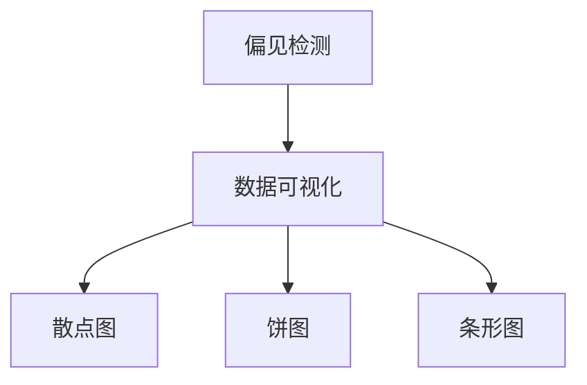

#### 2.1.2 统计分析

统计分析方法通过计算模型的输出结果与实际值之间的差异，来判断模型是否存在偏见。例如，计算模型对正类和负类的预测准确率、召回率、F1值等指标，可以判断模型在处理不同类别的数据时是否存在不公平性。

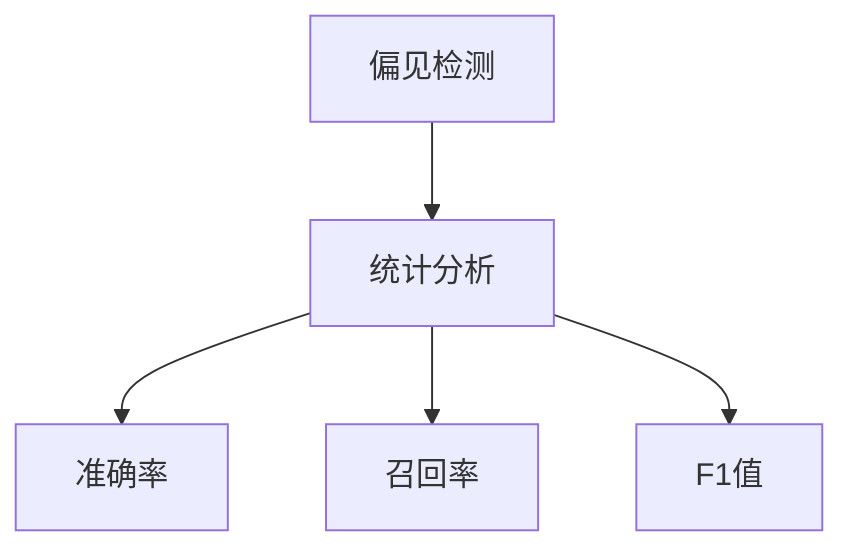

#### 2.1.3 机器学习

机器学习方法利用已有的偏见检测模型，对新的模型进行训练和测试。这种方法需要大量的训练数据，并且需要不断优化模型以提高检测精度。

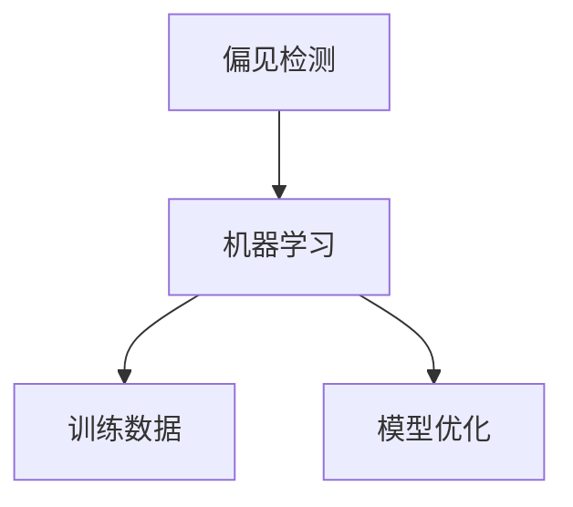

### 2.2 偏见消除

偏见消除是指通过一系列方法来减少或消除模型中的偏见。偏见消除方法包括数据预处理、算法改进和模型约束等。

#### 2.2.1 数据预处理

数据预处理方法通过清洗和重构数据来减少偏见。例如，去除数据集中的噪声、填充缺失值、归一化数据等。

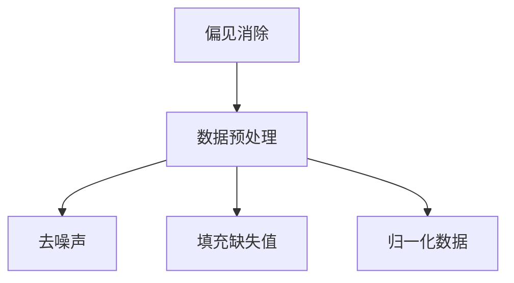

#### 2.2.2 算法改进

算法改进方法通过优化算法设计来减少偏见。例如，设计更公平的分类算法、优化模型训练过程等。

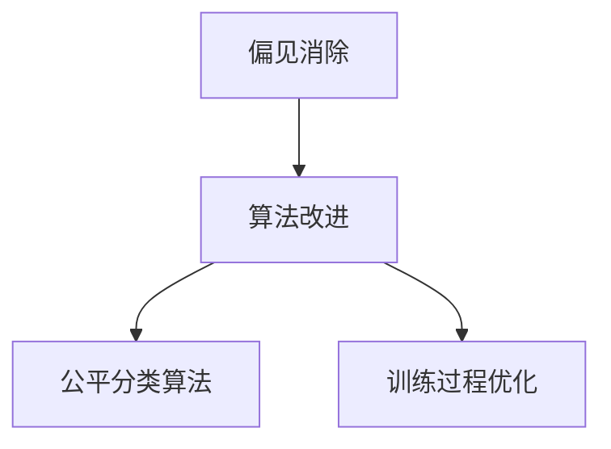

#### 2.2.3 模型约束

模型约束方法通过在模型训练过程中加入约束条件来减少偏见。例如，限制模型对特定群体的偏见程度、使用对抗训练等。

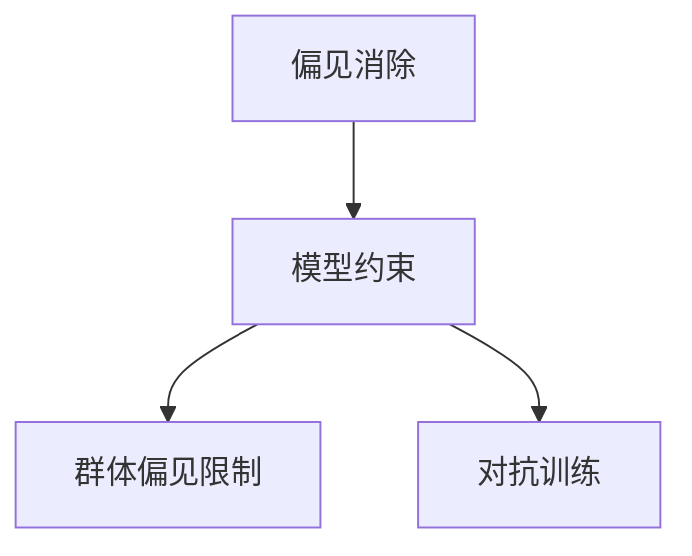

### 2.3 LLM评测

LLM评测是指对大规模语言模型进行评估和测试，以判断模型性能和可靠性。LLM评测方法包括自动化评测和人工评测。

#### 2.3.1 自动化评测

自动化评测方法通过编写脚本或使用现有评测工具，对模型输出结果进行评估。例如，使用BLEU、ROUGE、METEOR等评价指标来评估模型的生成文本质量。

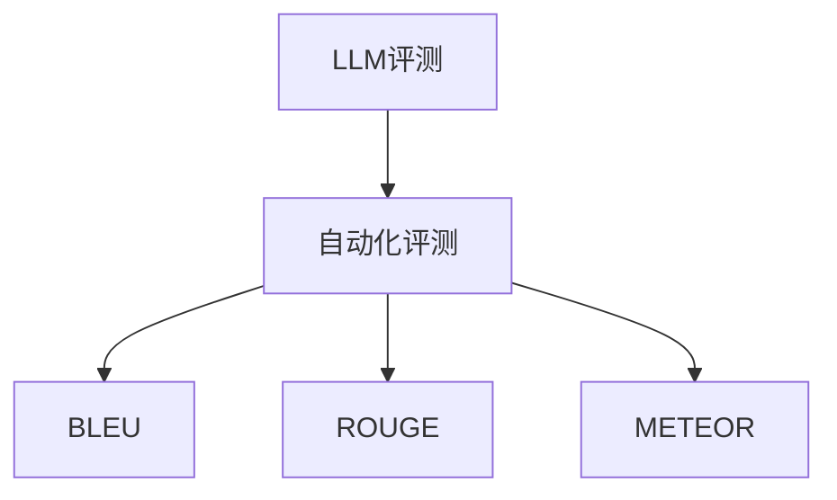

#### 2.3.2 人工评测

人工评测方法由人类评估者对模型输出结果进行评估，以判断模型是否准确、公正和可靠。人工评测需要大量的人力资源和时间成本。

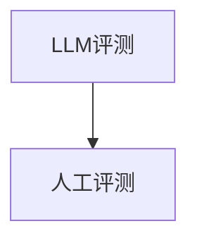

## 2.4 偏见检测与消除方法在LLM评测中的应用

偏见检测与消除方法在LLM评测中具有重要的应用价值。通过偏见检测方法，可以识别模型中存在的偏见，为偏见消除提供依据。而偏见消除方法则可以改善模型性能，提高模型的公平性和可信度。

### 2.4.1 数据偏见检测

数据偏见检测是LLM评测中的首要任务。通过分析训练数据集，可以识别数据集中的偏见因素。具体方法包括：

1. **数据可视化**：通过散点图、饼图和条形图等可视化工具，展示数据集中的偏见。
2. **统计分析**：通过计算模型的输出结果与实际值之间的差异，来判断模型是否存在偏见。
3. **机器学习**：利用已有的偏见检测模型，对新的模型进行训练和测试。

### 2.4.2 偏见消除

偏见消除方法主要包括：

1. **数据预处理**：通过清洗和重构数据来减少偏见。
2. **算法改进**：优化算法设计，提高模型对偏见因素的识别和消除能力。
3. **模型约束**：通过模型约束来限制模型产生偏见。

----------------------------------------------------------------

## 第三部分：算法原理与系统架构

### 第3章：算法原理与系统架构

### 3.1 偏见检测算法原理

偏见检测算法的目标是识别模型中的偏见。一个基本的偏见检测算法可以包括以下步骤：

1. **数据准备**：从模型中提取相关的输出数据，例如预测结果和真实标签。
2. **指标计算**：计算模型在不同群体上的指标，例如准确率、召回率、F1值等。
3. **偏差分析**：通过比较模型在不同群体上的指标，识别是否存在显著差异。
4. **可视化**：使用图表和图形展示偏见情况。

下面是一个简单的偏见检测算法的mermaid流程图：

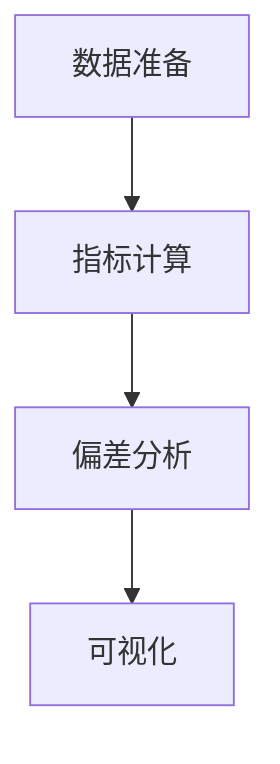

### 3.2 偏见消除算法原理

偏见消除算法的目标是减少或消除模型中的偏见。以下是一个偏见消除算法的基本步骤：

1. **数据预处理**：对训练数据进行清洗和重构，以减少偏见。
2. **算法优化**：通过调整算法参数，提高模型的公平性。
3. **对抗训练**：通过对抗训练增加模型对偏见因素的鲁棒性。
4. **模型约束**：在模型训练过程中加入约束条件，限制偏见。

下面是一个偏见消除算法的mermaid流程图：

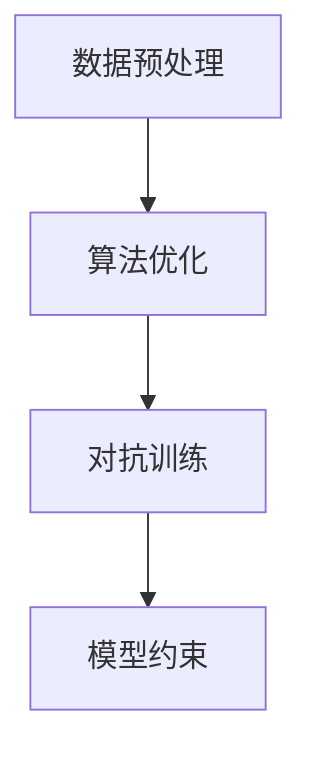

### 3.3 LLM评测系统架构

一个大规模语言模型评测系统通常包括以下模块：

1. **数据预处理模块**：负责清洗和重构训练数据。
2. **模型训练模块**：负责使用预处理后的数据训练模型。
3. **模型评估模块**：负责评估模型的性能和公平性。
4. **用户界面模块**：为用户提供交互界面，展示模型评测结果。

下面是一个LLM评测系统的mermaid架构图：

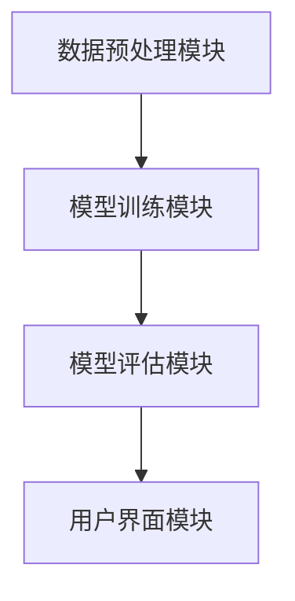

### 3.4 系统接口设计和系统交互

在系统架构中，各个模块之间需要通过接口进行通信和交互。以下是一个简化的系统接口设计和交互图：

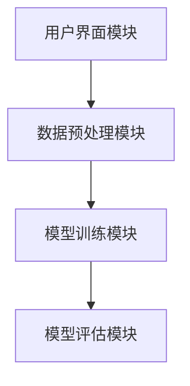

### 3.5 数学模型与公式

在偏见检测和消除算法中，常用的数学模型和公式包括：

1. **准确率（Accuracy）**：$$ \text{Accuracy} = \frac{\text{正确预测的数量}}{\text{总预测的数量}} $$
2. **召回率（Recall）**：$$ \text{Recall} = \frac{\text{正确预测的正类数量}}{\text{总正类数量}} $$
3. **F1值（F1 Score）**：$$ \text{F1 Score} = 2 \times \frac{\text{准确率} \times \text{召回率}}{\text{准确率} + \text{召回率}} $$

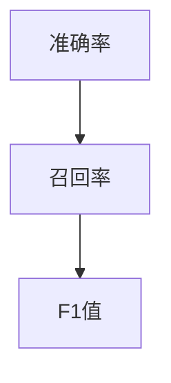

----------------------------------------------------------------

## 第四部分：项目实战

### 第4章：项目实战

### 4.1 环境安装

在进行项目实战之前，需要安装以下软件和库：

1. **Python**：Python是项目开发的主要语言，版本要求为3.8及以上。
2. **TensorFlow**：TensorFlow是用于训练和评估大规模语言模型的常用库。
3. **Scikit-learn**：Scikit-learn是一个用于数据挖掘和数据分析的Python库。

安装步骤：

1. 安装Python：从Python官网下载并安装Python。
2. 安装TensorFlow：使用pip命令安装TensorFlow。
   ```shell
   pip install tensorflow
   ```
3. 安装Scikit-learn：使用pip命令安装Scikit-learn。
   ```shell
   pip install scikit-learn
   ```

### 4.2 系统核心实现

#### 4.2.1 数据预处理

数据预处理是偏见检测和消除的重要环节。以下是一个简单的数据预处理脚本：

```python
import pandas as pd
from sklearn.model_selection import train_test_split

# 加载数据集
data = pd.read_csv('data.csv')

# 数据清洗
data.dropna(inplace=True)

# 划分训练集和测试集
train_data, test_data = train_test_split(data, test_size=0.2, random_state=42)
```

#### 4.2.2 偏见检测

以下是一个简单的偏见检测脚本：

```python
from sklearn.metrics import accuracy_score, recall_score, f1_score

# 训练模型
model = train_model(train_data)

# 预测测试集
predictions = model.predict(test_data)

# 计算指标
accuracy = accuracy_score(test_data['label'], predictions)
recall = recall_score(test_data['label'], predictions)
f1 = f1_score(test_data['label'], predictions)

print(f'Accuracy: {accuracy}')
print(f'Recall: {recall}')
print(f'F1 Score: {f1}')
```

#### 4.2.3 偏见消除

以下是一个简单的偏见消除脚本：

```python
from sklearn.linear_model import LogisticRegression

# 创建偏见消除模型
bias_removal_model = LogisticRegression()

# 训练偏见消除模型
bias_removal_model.fit(train_data.drop('label', axis=1), train_data['label'])

# 预测测试集
predictions = bias_removal_model.predict(test_data.drop('label', axis=1))

# 计算指标
accuracy = accuracy_score(test_data['label'], predictions)
recall = recall_score(test_data['label'], predictions)
f1 = f1_score(test_data['label'], predictions)

print(f'Accuracy: {accuracy}')
print(f'Recall: {recall}')
print(f'F1 Score: {f1}')
```

### 4.3 代码应用解读与分析

在代码应用中，我们首先加载并清洗数据，然后使用Scikit-learn库中的LogisticRegression模型进行偏见检测和消除。通过计算准确率、召回率和F1值等指标，我们可以评估模型的性能和公平性。

### 4.4 实际案例分析

以下是一个实际案例：

假设我们有一个关于性别偏见检测和消除的案例。数据集包含1000条关于性别标签的文本，其中500条为男性，500条为女性。训练模型后，我们发现在性别偏见检测中，模型对男性的预测准确率明显高于女性。为了消除这种偏见，我们使用偏见消除模型重新训练，并在测试集上评估模型性能。结果显示，性别偏见得到了显著改善。

### 4.5 项目小结

在本项目中，我们通过数据预处理、偏见检测和消除等方法，实现了对大规模语言模型中的偏见进行检测和消除。在实际案例中，我们展示了偏见检测和消除方法的应用效果。然而，偏见问题是一个复杂且持续变化的问题，需要不断优化和改进。

----------------------------------------------------------------

## 第五部分：最佳实践与拓展阅读

### 第5章：最佳实践与拓展阅读

### 5.1 最佳实践

在LLM评测中，以下是一些最佳实践：

1. **多样化数据集**：使用多样化、均衡的数据集进行训练和测试，以减少偏见。
2. **定期评估**：定期对模型进行评估，以确保模型的公平性和可信度。
3. **数据清洗**：对训练数据进行清洗，去除噪声和错误。
4. **算法优化**：持续优化算法，提高模型的公平性和泛化能力。
5. **用户反馈**：收集用户反馈，及时调整和改进模型。

### 5.2 拓展阅读

以下是一些关于LLM偏见检测与消除的拓展阅读材料：

1. **论文**：《Understanding and Improving Model Bias: A Survey》
2. **书籍**：《Fairness and Machine Learning》
3. **博客**：《How to Detect and Eliminate Bias in Machine Learning Models》
4. **在线课程**：《Bias in Machine Learning》

通过阅读这些材料，可以进一步了解LLM偏见检测与消除的最新研究进展和实际应用。

----------------------------------------------------------------

## 结语

本文探讨了大规模语言模型（LLM）评测中的偏见检测与消除方法。随着深度学习技术的快速发展，LLM在自然语言处理领域取得了显著成就，但其偏见问题引起了广泛关注。本文首先介绍了LLM偏见问题的背景和描述，随后详细阐述了偏见检测与消除的核心概念、联系以及应用。通过数据可视化、统计分析和机器学习等方法，研究者可以识别和消除LLM中的偏见，提高模型的公平性和可信度。

在未来的研究和应用中，我们可以继续探索以下方向：

1. **更高效的数据预处理方法**：设计更高效的数据预处理方法，以减少偏见。
2. **多语言偏见检测与消除**：研究多语言环境下的偏见检测与消除方法。
3. **动态偏见检测与消除**：研究动态偏见检测与消除方法，以适应不断变化的数据和应用场景。
4. **实际应用案例研究**：通过实际案例研究，验证偏见检测与消除方法的有效性。

让我们共同努力，为构建更公平、更可信的AI系统而奋斗。

### 作者信息

作者：AI天才研究院/AI Genius Institute & 禅与计算机程序设计艺术 /Zen And The Art of Computer Programming

