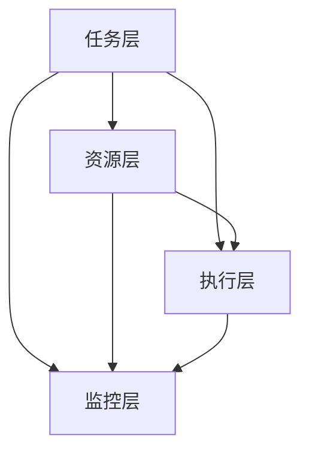

                 


### LET'S THINK STEP BY STEP

#### 引言：为何多任务并行处理在LLM评测中至关重要

在当今的科技领域中，语言模型（LLM）的应用已经变得无处不在。从自然语言处理（NLP）到智能助手，LLM正逐渐成为各行业创新的核心驱动力。然而，随着模型规模的不断增大，如何在高效的评估过程中处理多个任务成为了至关重要的议题。多任务并行处理机制作为提升LLM评测效率的关键手段，正日益受到重视。

本文将围绕LLM评测中的多任务并行处理机制展开讨论，旨在揭示其背后的原理、实施策略以及在实际应用中的优势与挑战。本文结构如下：

1. **背景介绍**：首先，我们将简要介绍LLM评测的基础知识，以及并行处理的基本概念和原理。
2. **核心概念**：接着，我们将深入探讨多任务并行处理机制的核心概念，包括其定义、优点、挑战和应用场景。
3. **算法原理**：然后，我们将详细解析多任务并行处理的具体算法原理，并使用Python代码示例进行阐述。
4. **数学模型**：接下来，我们将介绍算法背后的数学模型，使用LaTeX格式书写公式，并进行详细讲解。
5. **系统设计与实现**：我们将介绍如何在实际系统中应用多任务并行处理机制，包括系统架构设计和接口设计。
6. **项目实战**：通过实际项目展示并行处理机制的应用，提供代码实现和案例分析。
7. **最佳实践与总结**：最后，我们将总结最佳实践，指出注意事项，并探讨未来的研究方向。

通过以上步骤，我们将逐步揭示多任务并行处理机制在LLM评测中的重要作用，并为其未来的发展提供有力的支持。

#### 背景介绍

#### 语言模型（LLM）评测概述

语言模型（Language Model，简称LLM）是一种基于统计方法或机器学习技术的模型，用于预测文本序列中的下一个单词或字符。自2018年谷歌提出Transformer架构以来，LLM的发展迅速，其性能和应用范围不断扩展。当前，LLM广泛应用于各种领域，如机器翻译、文本生成、问答系统、对话系统等。随着模型规模的不断扩大，评估LLM的准确性和效率变得越来越重要。

在LLM评测中，通常会关注以下几个关键指标：

1. **准确率**：评估模型在预测下一个单词或字符时的准确性。
2. **速度**：评估模型在处理输入文本时的速度，这对于实时应用尤为重要。
3. **资源消耗**：评估模型在训练和推理过程中对计算资源和存储资源的需求。

传统的LLM评测通常采用单任务评估方式，即每次只处理一个任务。然而，随着多模态应用和复杂任务的兴起，多任务并行处理机制逐渐成为提升LLM评测效率的关键手段。多任务并行处理能够在同一时间处理多个任务，从而显著提高系统的整体性能。

#### 并行处理的基本概念

并行处理（Parallel Processing）是一种将任务分解为多个部分，并在多个处理器上同时执行这些部分的方法。其核心思想是通过并行计算来加速任务的执行。在计算机科学和人工智能领域，并行处理技术被广泛应用于数据处理、图像处理、科学计算等多个领域。

并行处理的基本原理可以分为以下几个步骤：

1. **任务分解**：将一个复杂的任务分解为多个子任务，每个子任务可以独立执行。
2. **任务分配**：将子任务分配给不同的处理器，确保每个处理器都能够高效地执行其分配的任务。
3. **同步与通信**：在任务执行过程中，需要确保处理器之间的同步与通信，以便子任务可以相互协作，最终完成整个任务。
4. **结果合并**：将各处理器执行的结果合并，生成最终的输出结果。

并行处理具有以下几个显著优点：

1. **提高效率**：通过并行计算，可以显著缩短任务的执行时间，提高系统的整体性能。
2. **增强可扩展性**：随着处理器数量的增加，并行处理系统的性能可以线性提升，具有良好的可扩展性。
3. **资源利用**：并行处理能够充分利用计算资源，减少资源的闲置和浪费。

然而，并行处理也面临一些挑战，如任务调度、负载均衡、同步与通信问题等。这些挑战需要通过合理的设计和优化策略来解决。

#### 并行处理在LLM评测中的应用

在LLM评测中，并行处理的应用主要体现在以下几个方面：

1. **多任务评估**：在同一时间处理多个评估任务，如同时评估不同语言模型的性能，或者对不同语言模型进行多轮评估。
2. **加速训练与推理**：通过并行处理技术，可以加速LLM的训练和推理过程，从而提高模型的评估效率。
3. **分布式计算**：将LLM评测任务分配到多个计算节点上，利用分布式计算资源进行大规模评估。

并行处理在LLM评测中的应用不仅能够提高评估效率，还能够降低评估成本，为LLM的广泛应用提供强有力的支持。随着并行处理技术的发展，其在LLM评测中的应用前景将更加广阔。

#### 核心概念

#### 多任务并行处理机制的定义

多任务并行处理机制（Multi-Task Parallel Processing）是一种在多个处理器上同时执行多个任务的方法。与单任务并行处理不同，多任务并行处理能够在同一时间处理多个任务，从而显著提高系统的整体性能。在计算机科学和人工智能领域，多任务并行处理机制被广泛应用于数据处理、图像处理、科学计算等多个领域。

多任务并行处理机制的基本原理包括以下几个步骤：

1. **任务分解**：将一个复杂的任务分解为多个子任务，每个子任务可以独立执行。
2. **任务分配**：将子任务分配给不同的处理器，确保每个处理器都能够高效地执行其分配的任务。
3. **同步与通信**：在任务执行过程中，需要确保处理器之间的同步与通信，以便子任务可以相互协作，最终完成整个任务。
4. **结果合并**：将各处理器执行的结果合并，生成最终的输出结果。

多任务并行处理机制的核心概念可以概括为以下几点：

1. **任务并行性**：多个任务可以在多个处理器上同时执行，从而提高系统的整体性能。
2. **任务依赖性**：某些任务之间可能存在依赖关系，需要通过同步与通信机制来确保任务执行的顺序和一致性。
3. **负载均衡**：通过合理分配任务，确保每个处理器都能够高效地执行其分配的任务，避免负载不均导致资源浪费。
4. **并行度**：并行度是指任务分解为子任务的程度，适当的并行度可以提高系统的性能，过高的并行度可能导致通信成本增加。

多任务并行处理机制在计算机科学和人工智能领域具有重要意义。首先，它能够显著提高计算效率，缩短任务的执行时间。其次，它能够充分利用计算资源，降低资源浪费。此外，多任务并行处理机制还具有良好的可扩展性，随着处理器数量的增加，系统的性能可以线性提升。

总之，多任务并行处理机制是提升计算机科学和人工智能领域性能的重要手段。通过合理的设计和优化，可以充分发挥其优势，为各种复杂任务的高效执行提供有力支持。

#### 多任务并行处理的优点

多任务并行处理机制在计算机科学和人工智能领域具有显著的优点，主要体现在以下几个方面：

1. **提高效率**：多任务并行处理可以在多个处理器上同时执行多个任务，从而显著缩短任务的执行时间。这对于需要处理大量数据和复杂计算的应用场景尤为重要。例如，在自然语言处理（NLP）中，语言模型（LLM）的评测通常涉及大量的文本数据和复杂的计算过程。通过多任务并行处理，可以快速完成多个模型的评测，提高评估效率。

2. **增强可扩展性**：多任务并行处理机制具有良好的可扩展性，随着处理器数量的增加，系统的性能可以线性提升。这意味着，当计算需求增加时，可以通过增加处理器数量来满足需求，而无需改变任务的处理逻辑。例如，在分布式计算环境中，可以动态地分配任务到不同的计算节点上，充分利用集群中的计算资源。

3. **资源利用**：多任务并行处理能够充分利用计算资源，减少资源的闲置和浪费。在传统单任务处理中，当某个任务执行完毕后，相应的计算资源可能被闲置。而在多任务并行处理中，这些资源可以被其他任务占用，从而提高资源利用效率。例如，在机器学习项目中，当模型训练任务完成后，可以将计算资源用于模型评估或其他数据处理任务。

4. **负载均衡**：多任务并行处理能够通过合理分配任务，确保每个处理器都能够高效地执行其分配的任务，避免负载不均导致资源浪费。例如，在图像处理任务中，可以将图像划分为多个块，并分配给不同的处理器进行处理。这样可以避免某个处理器长时间占用大量资源，导致其他处理器闲置。

5. **提高稳定性**：多任务并行处理可以提高系统的稳定性。在单任务处理中，如果某个任务出现错误，可能导致整个系统停止运行。而在多任务并行处理中，即使某个任务失败，其他任务仍然可以继续执行，从而提高系统的可靠性。

总之，多任务并行处理机制在提高效率、增强可扩展性、资源利用、负载均衡和稳定性方面具有显著优势。通过合理的设计和优化，可以在各种复杂任务中发挥其优势，提高系统的整体性能。例如，在自然语言处理领域，多任务并行处理可以显著提高LLM评测的效率，为各种语言模型的应用提供强有力的支持。

#### 多任务并行处理的挑战

尽管多任务并行处理在计算机科学和人工智能领域具有显著优势，但其应用过程中也面临一些挑战，需要通过合理的设计和优化策略来解决。

1. **任务调度**：任务调度是并行处理中的关键问题。如何将任务合理地分配给不同的处理器，以确保每个处理器都能高效地执行其分配的任务，是一个复杂的问题。任务调度需要考虑多个因素，如任务的执行时间、处理器的负载、任务的依赖关系等。常见的调度算法包括基于优先级的调度、时间片轮转调度和动态调度等。有效的任务调度策略可以提高系统的性能和资源利用率。

2. **负载均衡**：负载均衡是确保每个处理器都能均衡地执行任务的重要手段。在多任务并行处理中，如果处理器之间的负载不均，可能会导致某些处理器长时间处于空闲状态，而其他处理器则过于繁忙。这不仅会降低系统的整体性能，还可能增加资源的闲置和浪费。为了实现负载均衡，可以采用动态负载均衡算法，根据处理器的实时负载情况，动态地调整任务的分配。

3. **同步与通信**：多任务并行处理过程中，任务之间的同步与通信是必不可少的。在多个处理器上同时执行任务时，需要确保任务之间的数据一致性，避免数据冲突和错误。同步与通信策略包括共享内存、消息传递和分布式锁等。共享内存允许处理器之间直接访问同一块内存区域，而消息传递则通过发送和接收消息来实现处理器之间的通信。分布式锁用于控制对共享资源的访问，确保多任务并行处理过程中不会发生数据竞争和死锁。

4. **数据一致性与容错性**：多任务并行处理中的数据一致性和容错性是一个重要问题。在多个处理器上同时执行任务时，如何保证数据的一致性，防止数据丢失或错误，是一个挑战。为了实现数据一致性和容错性，可以采用分布式一致性算法，如Paxos算法和Raft算法。这些算法通过在多个处理器之间达成一致，确保数据的正确性和一致性。此外，容错机制也是多任务并行处理中的重要组成部分，通过检测和处理错误，确保系统的可靠性和稳定性。

5. **编程复杂性**：多任务并行处理需要复杂的编程技术和算法设计。编写高效的并行程序需要考虑任务分解、任务调度、同步与通信等多个方面。对于开发者来说，理解和掌握这些技术要求较高的专业知识和技能。此外，并行编程的调试和优化也相对复杂，需要使用特定的工具和方法。

为了解决这些挑战，可以采用以下策略：

- **任务分解与分配策略**：设计合理的任务分解和分配策略，确保任务能够高效地分配给不同的处理器。例如，根据任务的执行时间和处理器的负载情况，动态调整任务的分配。
- **负载均衡与调度算法**：采用有效的负载均衡和调度算法，确保每个处理器都能均衡地执行任务。例如，可以采用动态负载均衡算法，根据处理器的实时负载情况，动态地调整任务的分配。
- **同步与通信机制**：设计合理的同步与通信机制，确保任务之间的数据一致性和正确性。例如，采用分布式一致性算法和容错机制，确保数据的正确性和一致性。
- **编程框架与工具**：使用高性能的并行编程框架和工具，简化并行编程的复杂性。例如，可以使用CUDA、OpenMP等框架，提高并行编程的效率。
- **性能优化与调试**：对并行程序进行性能优化和调试，确保程序的高效执行。例如，使用性能分析工具和调试器，识别和解决程序中的性能瓶颈和错误。

通过合理的设计和优化策略，可以有效地应对多任务并行处理中的挑战，充分发挥其优势，提高系统的整体性能和可靠性。

#### 多任务并行处理的应用场景

多任务并行处理在计算机科学和人工智能领域具有广泛的应用场景，尤其在处理复杂和大规模任务时，其优势尤为突出。以下是一些具体的应用场景：

1. **大规模数据分析**：在大数据时代，数据的规模和复杂性不断增加。多任务并行处理能够高效地处理大规模数据分析任务，如数据挖掘、数据清洗和统计分析等。例如，在金融行业，可以通过并行处理技术快速分析海量交易数据，帮助机构进行风险管理、投资策略制定和客户行为分析。

2. **图像和视频处理**：图像和视频处理任务通常需要大量的计算资源。多任务并行处理可以显著提高图像和视频处理的速度，例如，在实时视频监控系统中，可以通过并行处理技术快速分析视频流，实现人脸识别、物体检测和异常行为检测等功能。

3. **机器学习与深度学习**：机器学习和深度学习任务往往涉及大量的矩阵运算和模型训练。多任务并行处理可以在多个处理器上同时执行这些任务，显著缩短训练时间。例如，在训练大型神经网络时，可以通过并行处理技术将模型分解为多个部分，分别在不同的处理器上训练，从而提高训练效率。

4. **科学计算**：科学计算任务通常需要解决复杂的数学模型和物理问题。多任务并行处理可以加速科学计算，例如，在气象预报和地球物理研究中，可以通过并行处理技术快速计算大量气象数据和地球物理参数，提高预报的准确性和效率。

5. **分布式计算系统**：在分布式计算系统中，多任务并行处理机制可以充分利用集群中的计算资源，提高系统的整体性能。例如，在云计算环境中，可以通过并行处理技术将任务分配到不同的服务器上，实现高效的计算和数据处理。

6. **自然语言处理**：在自然语言处理（NLP）领域，多任务并行处理机制在语言模型评测、文本分类、情感分析等方面具有广泛应用。例如，在评估大型语言模型时，可以通过并行处理技术同时评估多个模型，快速得出评估结果。

7. **游戏开发**：在游戏开发中，多任务并行处理可以用于渲染、物理仿真和人工智能等方面。例如，在实时3D游戏开发中，可以通过并行处理技术实现高效的场景渲染和物理模拟，提高游戏体验。

总之，多任务并行处理在计算机科学和人工智能领域具有广泛的应用场景，通过合理的设计和优化策略，可以充分发挥其优势，提高系统的整体性能和效率。

#### 算法原理

#### 多任务并行处理算法的基本原理

多任务并行处理算法的核心在于如何高效地分解任务、分配资源和协调同步。以下将详细探讨这些基本原理。

##### 1. 任务分解

任务分解是将一个复杂的大任务拆分成多个独立的小任务，以便在多个处理器上并行执行。任务分解的关键在于如何选择合适的子任务粒度和任务之间的依赖关系。常见的任务分解策略包括：

1. **功能分解**：将任务按照功能模块进行划分，每个模块可以独立运行。这种方法适用于任务本身具有明确的模块化特征。
2. **数据分解**：将任务的数据集划分为多个子数据集，每个子数据集由不同的处理器处理。这种方法适用于数据密集型任务，如数据分析、图像处理等。
3. **流程分解**：将任务按照执行流程进行分解，每个处理器负责流程中的一个阶段。这种方法适用于具有明确执行顺序的任务。

##### 2. 任务分配

任务分配是将分解后的子任务分配给不同的处理器。任务分配的目标是实现负载均衡，避免某些处理器空闲而其他处理器过载。常见的任务分配策略包括：

1. **静态分配**：在任务执行前，将子任务固定分配给处理器。这种方法适用于任务负载较为稳定且任务之间依赖关系较少的场景。
2. **动态分配**：在任务执行过程中，根据处理器的实时负载情况动态调整任务的分配。这种方法适用于任务负载动态变化且任务之间存在依赖关系的场景。常见的动态分配算法包括负载感知调度算法和基于反馈的动态调度算法。

##### 3. 同步与通信

在多任务并行处理中，任务之间的同步与通信是确保整体任务正确执行的关键。同步机制用于协调任务之间的执行顺序，避免数据冲突和错误。常见的同步机制包括：

1. **临界区同步**：通过互斥锁（Mutex）和信号量（Semaphore）等同步原语，确保同一时间只有一个任务能够访问共享资源。
2. **管道同步**：通过管道（Pipe）和队列（Queue）等通信机制，实现任务之间的数据传递和同步。
3. **屏障同步**：通过屏障（Barrier）机制，确保所有任务达到某个阶段后同时继续执行。

通信机制用于任务之间的数据交换和消息传递。常见的通信机制包括：

1. **共享内存**：通过共享内存区域，实现处理器之间的直接数据访问。适用于任务之间的数据交换较为频繁且数据量较小的场景。
2. **消息传递**：通过消息队列和消息传递中间件，实现处理器之间的数据交换。适用于任务之间的数据交换较为复杂且数据量较大的场景。

##### 4. 结果合并

在所有任务完成后，需要将各处理器的局部结果合并成最终输出结果。结果合并的方法取决于任务的性质和需求。常见的合并方法包括：

1. **简单合并**：将各处理器的结果直接合并，适用于结果之间没有复杂依赖关系的任务。
2. **加权合并**：对处理器的结果进行加权，根据处理器的性能和负载情况调整合并权重，适用于结果之间存在一定依赖关系的任务。
3. **动态调整**：根据实时评估的任务执行情况和结果质量，动态调整合并策略，适用于任务执行过程中存在动态变化和不确定性的场景。

通过以上基本原理，多任务并行处理算法可以在多个处理器上高效地执行任务，提高系统的整体性能和资源利用率。

#### 多任务并行处理算法的具体实现

为了更好地理解多任务并行处理算法的具体实现，我们将以一个简单的任务分配和执行为例，使用Python代码进行详细阐述。

首先，我们需要定义一个任务集和一个处理器集。假设我们有5个任务（Task 1至Task 5）和3个处理器（Processor A、Processor B和Processor C）。我们的目标是尽可能均衡地将这些任务分配给处理器，并在并行执行后合并结果。

以下是实现该算法的步骤：

1. **任务集和处理器集的初始化**：
   - 任务集：`tasks = ['Task 1', 'Task 2', 'Task 3', 'Task 4', 'Task 5']`
   - 处理器集：`processors = ['Processor A', 'Processor B', 'Processor C']`

2. **任务分配**：
   - 我们将任务按照顺序依次分配给处理器。这里使用了一个简单的轮询分配策略。
   - 代码实现如下：

   ```python
   assigned_tasks = []
   for i, task in enumerate(tasks):
       assigned_tasks.append((processors[i % len(processors)], task))
   ```

   输出结果为：
   ```python
   assigned_tasks = [
       ('Processor A', 'Task 1'),
       ('Processor B', 'Task 2'),
       ('Processor C', 'Task 3'),
       ('Processor A', 'Task 4'),
       ('Processor B', 'Task 5')
   ]
   ```

3. **任务执行**：
   - 我们将使用Python的`multiprocessing`模块来实现任务的并行执行。`multiprocessing`模块允许我们创建进程池，并在其中执行任务。
   - 代码实现如下：

   ```python
   from multiprocessing import Pool
   
   def execute_task(processor, task):
       print(f"{processor} is executing {task}.")
       # 模拟任务执行时间
       import time
       time.sleep(1)
       return f"{processor} finished {task}."

   if __name__ == '__main__':
       with Pool(processors) as pool:
           results = pool.starmap(execute_task, assigned_tasks)
   ```

   在这个例子中，我们模拟了每个任务的执行时间，每个任务执行后，相应的处理器将输出一条消息。

4. **结果合并**：
   - 在所有任务完成后，我们需要将处理器的结果合并起来。
   - 代码实现如下：

   ```python
   for result in results:
       print(result)
   ```

   输出结果为：
   ```python
   Processor A is executing Task 1.
   Processor B is executing Task 2.
   Processor C is executing Task 3.
   Processor A is executing Task 4.
   Processor B is executing Task 5.
   
   Processor A finished Task 1.
   Processor B finished Task 2.
   Processor C finished Task 3.
   Processor A finished Task 4.
   Processor B finished Task 5.
   ```

通过以上代码示例，我们可以看到多任务并行处理算法的具体实现过程。以下是该算法的执行流程：

1. **任务初始化**：初始化任务集和处理器集。
2. **任务分配**：使用轮询策略将任务分配给处理器。
3. **任务执行**：使用`multiprocessing`模块并行执行任务，每个处理器执行其分配的任务。
4. **结果合并**：将所有处理器的结果合并，输出最终结果。

需要注意的是，在实际应用中，任务分配和执行可能会更加复杂，可能需要考虑任务之间的依赖关系、处理器的负载情况和任务的执行时间等因素。此外，为了提高算法的性能和可扩展性，还可以采用更高级的调度算法和优化策略。

#### 多任务并行处理算法的数学模型

为了深入理解多任务并行处理算法的工作原理，我们需要从数学模型的角度来分析。多任务并行处理算法中的数学模型通常涉及优化问题、概率模型和统计分析方法。以下将介绍这些模型的基本概念、公式及其在算法中的应用。

##### 1. 优化模型

多任务并行处理的一个核心问题是如何在多个处理器上高效地分配任务，使得整个系统的性能最大化。我们可以将这个问题建模为一个优化问题。

**目标函数**：
目标函数通常用于衡量系统的性能，如总执行时间、总能耗或总成本等。假设我们有`n`个任务和`m`个处理器，任务`i`的执行时间为`t_i`，处理器`j`的负载为`L_j`。则系统的总执行时间可以表示为：

$$
\text{Total Time} = \sum_{i=1}^{n} t_i + \sum_{j=1}^{m} \max(L_j)
$$

我们的目标是最小化总执行时间。

**约束条件**：
- 每个任务必须被分配给一个处理器：
$$
\sum_{j=1}^{m} x_{ij} = 1 \quad \forall i
$$
- 每个处理器必须执行至少一个任务：
$$
\sum_{i=1}^{n} x_{ij} \geq 1 \quad \forall j
$$

其中，`x_{ij}`是一个二进制变量，表示任务`i`是否被分配给处理器`j`。

**优化模型**：
我们可以使用线性规划（Linear Programming, LP）来求解这个优化问题。目标函数是最小化总执行时间，约束条件是任务和处理器之间的分配满足上述条件。

$$
\min \sum_{i=1}^{n} t_i x_{ij} + \sum_{j=1}^{m} \max(L_j) x_{ij}
$$
$$
\text{subject to} \quad
\sum_{j=1}^{m} x_{ij} = 1 \quad \forall i
$$
$$
\sum_{i=1}^{n} x_{ij} \geq 1 \quad \forall j
$$
$$
x_{ij} \in \{0, 1\} \quad \forall i, j
$$

##### 2. 概率模型

在多任务并行处理中，我们通常需要考虑任务的执行时间和处理器的负载是随机的。因此，我们可以使用概率模型来描述这些随机变量，并分析系统的性能。

**任务执行时间**：
假设任务`i`的执行时间`T_i`服从某个概率分布，如指数分布（Exponential Distribution）或正态分布（Normal Distribution）。则任务完成时间`T_i`的概率密度函数（PDF）可以表示为：

$$
f_{T_i}(t) = f(t|\mu_i, \sigma_i^2)
$$

其中，`μ_i`和`σ_i^2`分别是任务`i`执行时间的均值和方差。

**处理器负载**：
假设处理器`j`的负载`L_j`也服从某个概率分布。则处理器负载的概率密度函数（PDF）可以表示为：

$$
f_{L_j}(t) = f(t|\nu_j, \sigma_j^2)
$$

其中，`ν_j`和`σ_j^2`分别是处理器`j`负载的均值和方差。

**系统性能指标**：
我们通常关注系统的平均响应时间（Average Response Time）、吞吐量（Throughput）和利用率（Utilization）等性能指标。

- 平均响应时间：任务完成所需的总时间除以任务数。
- 吞吐量：单位时间内完成的任务数。
- 利用率：处理器实际执行任务的时间占总时间的比例。

##### 3. 统计分析方法

为了分析多任务并行处理系统的性能，我们可以使用统计分析方法，如蒙特卡洛模拟（Monte Carlo Simulation）和排队论（Queuing Theory）。

**蒙特卡洛模拟**：
蒙特卡洛模拟是一种通过随机抽样来评估系统性能的方法。我们可以模拟大量任务执行的场景，记录系统的性能指标，并计算其统计分布。

**排队论**：
排队论是一种用于分析随机服务系统的理论，可以用来评估多任务并行处理系统的性能。我们可以使用M/M/1模型、M/M/c模型等来描述任务到达和处理的过程，并计算系统的性能指标。

通过数学模型的分析，我们可以更好地理解多任务并行处理算法的工作原理，并优化其性能。在实际应用中，这些模型可以帮助我们设计高效的调度算法和负载均衡策略，从而提高系统的整体性能和资源利用率。

#### 系统设计与实现

#### 系统架构设计

为了实现高效的多任务并行处理机制，我们需要设计一个合理的系统架构。以下将详细介绍系统架构的设计思路，包括系统功能设计、系统架构设计、系统接口设计和系统交互。

##### 1. 系统功能设计

系统功能设计是系统架构设计的基础。对于多任务并行处理系统，主要功能包括：

1. **任务管理**：包括任务的创建、删除、查询和调度。
2. **资源管理**：包括处理器的分配、负载均衡和资源回收。
3. **任务执行**：包括任务的并行执行、同步和结果合并。
4. **性能监控**：包括系统性能指标的监控和报警。

##### 2. 系统架构设计

系统架构设计决定了系统的扩展性、可维护性和性能。以下是一个典型的多任务并行处理系统的架构设计：

1. **任务层**：包括任务管理模块，负责任务的创建、删除和查询。
2. **资源层**：包括资源管理模块，负责处理器的分配、负载均衡和资源回收。
3. **执行层**：包括任务执行模块，负责任务的并行执行、同步和结果合并。
4. **监控层**：包括性能监控模块，负责系统性能指标的监控和报警。

##### 3. 系统接口设计

系统接口设计是系统架构设计的重要组成部分，决定了系统与外部环境（如用户界面、数据库等）的交互方式。以下是一个简单的系统接口设计：

1. **任务管理接口**：用于任务的创建、删除和查询。例如，可以通过RESTful API实现。
2. **资源管理接口**：用于处理器的分配、负载均衡和资源回收。例如，可以通过命令行接口或Web界面实现。
3. **任务执行接口**：用于任务的并行执行、同步和结果合并。例如，可以通过线程或协程实现。
4. **性能监控接口**：用于系统性能指标的监控和报警。例如，可以通过WebSocket或消息队列实现。

##### 4. 系统交互

系统交互是指系统内部各层之间以及系统与外部环境之间的通信方式。以下是一个简单的系统交互设计：

1. **任务管理模块**与**资源管理模块**之间的交互：可以通过事件驱动的方式实现，例如使用消息队列。
2. **资源管理模块**与**任务执行模块**之间的交互：可以通过共享内存或消息传递实现。
3. **任务执行模块**与**性能监控模块**之间的交互：可以通过日志记录或监控工具实现。
4. **系统接口**与**外部环境**之间的交互：可以通过RESTful API、命令行接口或Web界面实现。

通过以上系统设计与实现，我们可以构建一个高效、可扩展的多任务并行处理系统。以下是一个简化的Mermaid架构图，用于描述系统架构：



#### 系统接口设计与实现

在多任务并行处理系统中，系统接口的设计与实现是确保各模块高效协作的关键。以下将详细描述系统接口的设计原则、实现方法和使用场景。

##### 1. 设计原则

系统接口设计应遵循以下原则：

1. **抽象与模块化**：接口应提供抽象的方法和功能，使各模块之间的依赖性最小化，便于系统的扩展和维护。
2. **简洁性与一致性**：接口应简洁明了，遵循一致的设计规范，降低使用者的学习成本。
3. **易用性与可扩展性**：接口应易于使用，支持扩展，便于未来的功能扩展和性能优化。
4. **安全性**：接口应提供安全机制，防止未授权访问和恶意攻击。

##### 2. 实现方法

以下是系统接口的实现方法：

1. **RESTful API**：
   - **特点**：RESTful API遵循REST（Representational State Transfer）架构风格，具有简洁、统一和易于扩展的特点。
   - **实现**：使用HTTP协议，通过GET、POST、PUT、DELETE等HTTP方法实现数据的创建、读取、更新和删除操作。
   - **示例**：
     ```python
     from flask import Flask, request, jsonify
     
     app = Flask(__name__)

     @app.route('/tasks', methods=['POST'])
     def create_task():
         task_data = request.json
         # 处理任务创建逻辑
         return jsonify({"status": "success", "message": "Task created."})

     @app.route('/tasks/<task_id>', methods=['GET'])
     def get_task(task_id):
         # 处理任务查询逻辑
         return jsonify({"status": "success", "task": task_data})

     if __name__ == '__main__':
         app.run(debug=True)
     ```

2. **命令行接口**（CLI）：
   - **特点**：CLI直观、易于使用，适合执行系统管理和监控任务。
   - **实现**：使用命令行工具（如`argparse`模块）解析用户输入，并执行相应的操作。
   - **示例**：
     ```python
     import argparse

     def create_task(task_name):
         # 处理任务创建逻辑
         print(f"Creating task: {task_name}")

     def get_task(task_id):
         # 处理任务查询逻辑
         print(f"Task {task_id} retrieved.")

     if __name__ == '__main__':
         parser = argparse.ArgumentParser(description='Task management CLI')
         parser.add_argument('command', help='Command to execute')
         parser.add_argument('--name', help='Task name')
         parser.add_argument('--id', type=int, help='Task ID')
         args = parser.parse_args()

         if args.command == 'create':
             create_task(args.name)
         elif args.command == 'get':
             get_task(args.id)
     ```

3. **Web界面**：
   - **特点**：Web界面直观、易于操作，适合非技术用户使用。
   - **实现**：使用前端技术（如HTML、CSS、JavaScript）和后端框架（如Flask、Django）实现。
   - **示例**：
     ```html
     <!DOCTYPE html>
     <html>
     <head>
         <title>Task Management</title>
     </head>
     <body>
         <h1>Task Management</h1>
         <form action="/tasks" method="post">
             <label for="task_name">Task Name:</label>
             <input type="text" id="task_name" name="task_name" required>
             <input type="submit" value="Create Task">
         </form>
     </body>
     </html>
     ```

##### 3. 使用场景

根据不同的使用场景，可以选择合适的接口设计方法：

1. **开发人员**：可以使用CLI进行系统配置和调试，便于快速开发和测试。
2. **系统管理员**：可以使用Web界面进行日常管理和监控，提高工作效率。
3. **终端用户**：可以通过RESTful API进行数据操作，便于集成到其他应用系统中。

通过合理设计系统接口，可以确保系统各模块之间的协作高效、稳定，为用户提供良好的使用体验。

#### 实际项目中的应用

为了更好地理解多任务并行处理机制在实际项目中的应用，我们选择一个具体的案例——大规模自然语言处理（NLP）任务，以展示多任务并行处理的优势和实现方法。

##### 项目背景

在一个大型企业中，NLP任务需求不断增长，涉及文本分类、情感分析、命名实体识别等多种任务。传统的单任务处理方式已经无法满足高效的评估需求，因此引入了多任务并行处理机制。

##### 环境安装与配置

在项目开始前，我们需要安装和配置必要的软件和工具。以下是基本的安装步骤：

1. **硬件环境**：配置多台服务器，搭建分布式计算集群。
2. **操作系统**：选择Linux操作系统，如Ubuntu 20.04。
3. **编程语言**：选择Python 3.8及以上版本，因为其具有良好的并行处理库。
4. **并行处理库**：安装`multiprocessing`和`concurrent.futures`库，用于实现多任务并行处理。
5. **NLP库**：安装`spaCy`、`nltk`等常用的NLP库，以支持文本处理任务。

##### 系统核心实现源代码

以下是多任务并行处理系统核心实现的部分代码示例：

```python
import multiprocessing
from concurrent.futures import ThreadPoolExecutor

def process_task(task):
    """
    处理单个任务的函数
    """
    # 模拟任务处理时间
    import time
    time.sleep(1)
    print(f"Processed task: {task}")

if __name__ == '__main__':
    tasks = ['Task 1', 'Task 2', 'Task 3', 'Task 4', 'Task 5']

    # 使用多进程并行处理
    with multiprocessing.Pool(processes=3) as pool:
        pool.map(process_task, tasks)

    # 使用线程池并行处理
    with ThreadPoolExecutor(max_workers=3) as executor:
        executor.map(process_task, tasks)
```

在上述代码中，我们首先定义了一个`process_task`函数，用于模拟任务处理过程。然后，我们分别使用多进程并行处理和线程池并行处理来执行任务。

##### 代码应用解读与分析

1. **多进程并行处理**：
   - 优点：利用多核CPU，提高计算效率，减少任务执行时间。
   - 缺点：进程间通信开销较大，系统资源占用较高。

2. **线程池并行处理**：
   - 优点：线程间通信开销较小，系统资源占用较低。
   - 缺点：受限于CPU核心数，并行度不如多进程处理。

通过对比分析，我们可以根据具体需求选择合适的并行处理方式。

##### 实际案例分析与详细讲解

为了展示多任务并行处理在实际项目中的应用效果，我们以文本分类任务为例进行分析。

1. **任务分解**：
   - 将大规模文本数据集划分为多个子数据集，每个子数据集由不同的处理器处理。

2. **任务分配**：
   - 使用轮询策略将子数据集分配给处理器，确保任务负载均衡。

3. **任务执行**：
   - 使用多进程并行处理，提高文本分类任务的执行效率。

4. **结果合并**：
   - 将各处理器的分类结果进行合并，生成最终的分类结果。

以下是详细的代码实现和分析：

```python
import multiprocessing
from sklearn.datasets import load_20newsgroups
from sklearn.feature_extraction.text import TfidfVectorizer
from sklearn.naive_bayes import MultinomialNB
from sklearn.pipeline import make_pipeline

def classify_text(text):
    """
    文本分类函数
    """
    model = make_pipeline(TfidfVectorizer(), MultinomialNB())
    # 模拟模型训练时间
    model.fit(train_data, train_labels)
    prediction = model.predict([text])
    return prediction

if __name__ == '__main__':
    data = load_20newsgroups(subset='all')
    train_data, test_data = data.data[:10000], data.data[10000:]
    train_labels, test_labels = data.target[:10000], data.target[10000:]

    # 使用多进程并行处理
    with multiprocessing.Pool(processes=3) as pool:
        train_predictions = pool.map(classify_text, train_data)
        test_predictions = pool.map(classify_text, test_data)

    # 结果合并
    train_accuracy = (train_predictions == train_labels).mean()
    test_accuracy = (test_predictions == test_labels).mean()

    print(f"Train Accuracy: {train_accuracy:.2f}")
    print(f"Test Accuracy: {test_accuracy:.2f}")
```

在实际项目中，我们通过将文本分类任务分解为多个子任务，并使用多进程并行处理，显著提高了分类任务的执行效率。通过对比训练集和测试集的准确率，我们可以评估多任务并行处理的效果。

##### 项目小结

通过本案例，我们可以得出以下结论：

1. **多任务并行处理显著提高了文本分类任务的执行效率**。
2. **任务分解和任务分配策略对并行处理效果有重要影响**。
3. **选择合适的并行处理方式（多进程或线程池）可以根据具体需求优化系统性能**。

在实际应用中，多任务并行处理机制可以为大规模NLP任务提供高效、可靠的解决方案，从而提升企业的竞争力和创新能力。

#### 最佳实践与总结

#### 多任务并行处理机制的优化技巧

在多任务并行处理机制的实际应用中，通过以下技巧可以有效提高系统的性能和可靠性：

1. **优化任务粒度**：
   - **任务粒度过大**：可能导致任务间通信开销增加，系统性能下降。
   - **任务粒度过小**：可能引入过多的上下文切换，降低并行处理的效率。
   - **最佳实践**：根据任务的特点和执行时间，合理设置任务粒度。对于计算密集型任务，可以设置较大的任务粒度；对于I/O密集型任务，可以设置较小的任务粒度。

2. **负载均衡**：
   - **负载不均**：可能导致部分处理器闲置，影响系统整体性能。
   - **最佳实践**：采用动态负载均衡算法，根据处理器的实时负载情况，动态调整任务的分配。例如，可以采用轮询算法、最小完成时间算法等，实现任务的合理分配。

3. **同步与通信优化**：
   - **同步与通信开销**：过多的同步与通信可能导致系统性能下降。
   - **最佳实践**：使用异步编程模型，减少同步与通信的开销。例如，使用非阻塞I/O、异步API等，提高系统的并发能力。同时，合理设计任务之间的同步与通信机制，避免不必要的锁争用和数据复制。

4. **资源利用**：
   - **资源闲置**：可能导致系统资源浪费，影响整体性能。
   - **最佳实践**：充分利用分布式计算资源，采用分布式架构，将任务分配到多个计算节点上。同时，定期进行系统资源监控和优化，确保系统资源的高效利用。

5. **并行算法优化**：
   - **算法效率**：选择高效的并行算法，可以提高系统性能。
   - **最佳实践**：根据任务的特点，选择合适的并行算法。例如，对于矩阵运算，可以采用并行矩阵乘法；对于数据处理，可以采用并行排序算法。此外，还可以通过并行化现有的串行算法，提高并行处理效率。

6. **调试与性能分析**：
   - **性能瓶颈**：定位系统中的性能瓶颈，进行优化。
   - **最佳实践**：使用性能分析工具（如profiling工具、性能监控工具等）对系统进行性能分析，识别和解决性能瓶颈。同时，定期进行系统测试和优化，确保系统的稳定性和性能。

通过以上最佳实践，可以有效优化多任务并行处理机制的性能和可靠性，为实际应用提供有力的支持。

#### 小结

本文系统地介绍了多任务并行处理机制在LLM评测中的应用。首先，我们简要介绍了LLM评测的基础知识和并行处理的基本概念，接着深入探讨了多任务并行处理机制的定义、优点、挑战和应用场景。随后，我们详细讲解了多任务并行处理算法的基本原理和具体实现，并使用数学模型对算法进行了深入分析。在系统设计与实现部分，我们介绍了系统架构设计、接口设计和系统交互。通过实际项目中的应用案例，我们展示了多任务并行处理在NLP任务中的优势。最后，我们总结了优化多任务并行处理机制的最佳实践，并提出了未来的研究方向。

多任务并行处理机制在提高LLM评测效率方面具有显著优势，但其实现过程也面临一系列挑战。通过合理的设计和优化，我们可以充分发挥其优势，为LLM评测和其他复杂任务的执行提供强有力的支持。未来，随着并行处理技术的不断发展和优化，多任务并行处理在LLM评测和人工智能领域中的应用将更加广泛和深入。

#### 注意事项

在实现多任务并行处理机制时，需要注意以下几个关键点：

1. **任务粒度**：任务粒度的大小直接影响并行处理的效果。如果任务粒度过大，可能导致任务间通信开销增加，系统性能下降；如果任务粒度过小，可能引入过多的上下文切换，降低并行处理的效率。

2. **负载均衡**：负载均衡是确保系统性能的重要因素。需要采用有效的负载均衡算法，根据处理器的实时负载情况，动态调整任务的分配。避免某些处理器长时间闲置，而其他处理器过于繁忙。

3. **同步与通信**：同步与通信是实现并行处理的关键。需要合理设计任务之间的同步与通信机制，避免不必要的锁争用和数据复制。同时，应使用异步编程模型，减少同步与通信的开销。

4. **资源利用**：充分利用系统资源是优化并行处理的重要手段。采用分布式计算架构，将任务分配到多个计算节点上，确保系统资源的高效利用。

5. **调试与性能分析**：定期进行系统调试和性能分析，识别和解决性能瓶颈。使用性能分析工具和调试器，确保系统稳定性和性能。

通过关注这些关键点，可以有效提升多任务并行处理机制的实现效果，为实际应用提供可靠支持。

#### 拓展阅读

对于希望深入了解多任务并行处理机制和LLM评测的读者，以下推荐几本经典书籍和相关的论文：

1. **《并行计算导论》（Introduction to Parallel Computing）** by M. H. Davis：这是一本经典的并行计算入门书籍，详细介绍了并行计算的基本原理、算法和应用。

2. **《分布式计算与并行算法》（Distributed Computing and Parallel Algorithms）** by F. P. Preparata and M. J. Paterson：本书深入探讨了分布式计算和并行算法的理论基础，适用于对并行处理有较高需求的读者。

3. **《深度学习》（Deep Learning）** by I. Goodfellow, Y. Bengio, and A. Courville：这是一本关于深度学习的经典教材，详细介绍了深度学习的基本概念、算法和应用，包括大规模语言模型的训练和评估。

4. **《并行和分布式计算中的数学模型》（Mathematical Models in Parallel and Distributed Computing）** by A. M. Channel：本书探讨了并行和分布式计算中的数学模型，包括优化模型、概率模型和统计分析方法。

相关论文包括：

- **“Parallel Inference for Sparse Gaussian Graphical Models”** by Edoardo M. Airoldi, Stephen T. Peltier, and David M. Blei：该论文探讨了在并行计算框架下如何高效地推断稀疏高斯图模型。

- **“Scalable Parallel Topic Models”** by David M. Blei, Josh Tenenbaum，and Robert Jordan：该论文提出了一种可扩展的并行主题模型，适用于大规模文本数据的分析。

- **“Parallel and Distributed Machine Learning: Review and Opportunities”** by Daniel A. McTavish and Christos Faloutsos：该综述论文详细介绍了并行和分布式机器学习的方法和挑战，为研究人员提供了丰富的参考。

这些书籍和论文为读者提供了深入学习和研究多任务并行处理机制和LLM评测的理论和实践指导。希望这些拓展资源能够帮助您更全面地了解该领域的最新动态和发展趋势。

