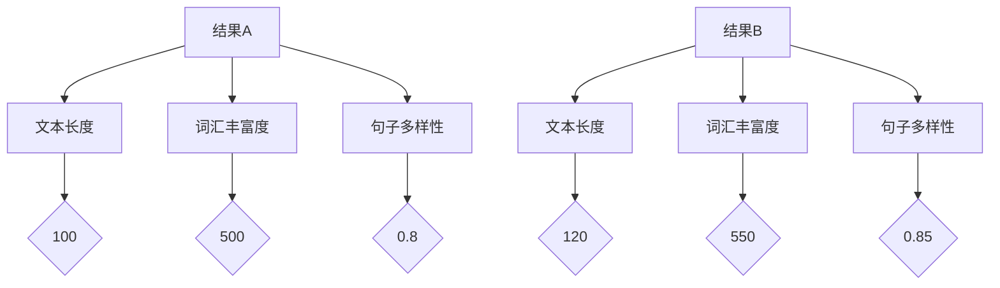
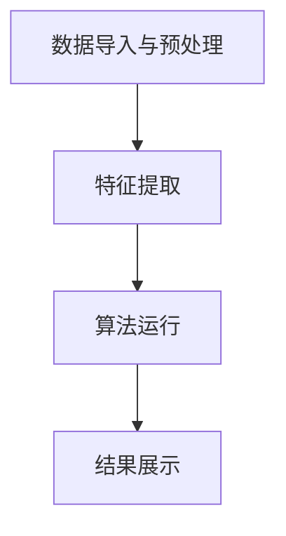
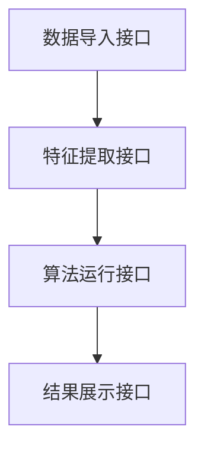
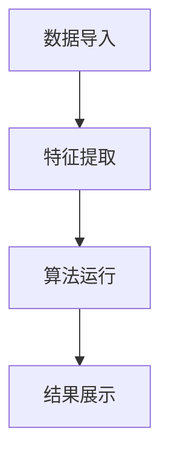

                 

# LLMM评测中的多维度可视化分析工具

## 关键词
- 大型语言模型（LLM）
- 评测指标
- 可视化分析工具
- 算法原理
- 系统架构
- 项目实战

## 摘要
本文将深入探讨大型语言模型（LLM）评测中的多维度可视化分析工具。首先，我们将回顾LLM的发展历程和应用现状，接着介绍评测的背景和重要性。然后，我们将详细讨论多维度可视化分析工具的核心概念、算法原理，以及如何设计并实现一个完整的系统。最后，我们将通过实际案例展示工具的使用，并提供最佳实践和注意事项，以及拓展阅读资源。

## 第一部分: LLM评测概述

### 第1章: LLM的发展与评测的重要性

#### 1.1 LLM的发展历程

大型语言模型（LLM）的发展始于20世纪90年代，当时研究人员开始探索基于统计方法的自然语言处理（NLP）。这些早期模型主要基于规则和词汇表，如最初的统计机器翻译模型。随着计算机算力和数据量的提升，深度学习开始在NLP领域崭露头角。

2003年，Lavie和HUNKEMÖLERER提出了基于聚类和语义分析的机器翻译模型。随后，2013年，微软推出了神经网络机器翻译（NMT）模型，显著提升了机器翻译的质量。2018年，OpenAI发布了GPT-1，一个基于生成预训练（GPT）的模型，其能够生成流畅且语法正确的文本。

#### 1.2 LLM的应用现状

LLM已经在多个领域得到了广泛应用，包括但不限于：

- **机器翻译**：如谷歌翻译、百度翻译等，使用LLM进行实时翻译，提高了翻译的准确性和流畅性。
- **问答系统**：如Siri、Alexa等智能语音助手，通过LLM处理用户查询，提供快速且准确的答案。
- **文本生成**：如文章写作、报告生成等，LLM可以生成高质量的文本内容，节省了人力成本。
- **对话系统**：如聊天机器人、客服系统等，LLM使得对话系统能够更自然地与人类交互。

#### 1.3 LLM评测的背景

随着LLM在各个领域的应用不断深入，如何评价LLM的性能变得至关重要。LLM评测不仅有助于研究人员了解模型的优势和不足，还能指导模型优化和未来发展方向。

评测主要包括以下几个方面：

- **准确度**：模型生成的文本是否准确无误。
- **流畅性**：模型生成的文本是否流畅自然。
- **多样性**：模型生成的文本是否具有多样性。
- **鲁棒性**：模型在处理不同类型或质量的数据时是否稳定。

#### 1.4 评测的重要性

LLM评测的重要性在于：

- **改进模型**：通过评测，研究人员可以识别模型的问题和不足，进而优化模型。
- **评估风险**：在实际应用中，评估LLM的性能有助于降低风险，确保应用的安全性和可靠性。
- **提高用户体验**：通过评测，开发人员可以不断改进LLM，提高用户体验。

### 第2章: 多维度可视化分析工具的核心概念

#### 2.1 LLM基本概念

LLM（大型语言模型）是一种基于深度学习的自然语言处理模型，它通过从大量文本数据中学习语言模式和结构，能够生成高质量的自然语言文本。

**核心术语**：

- **词汇表**：LLM的词汇表是模型理解语言的基础，包括所有训练过程中遇到的词汇和短语。
- **预训练**：预训练是指在大量文本数据上训练模型，使其能够捕捉到语言的一般结构和规律。
- **微调**：微调是在预训练模型的基础上，针对特定任务进行进一步训练，以提高模型在特定任务上的性能。

#### 2.2 评测指标

评测指标是评估LLM性能的关键工具，主要包括以下几种：

- **BLEU（双语评价度量）**：用于评估机器翻译的质量，通过计算机器翻译结果与参考翻译的匹配度来评分。
- **ROUGE（记忆集评估）**：用于评估文本生成任务的相似度，通过比较模型生成的文本与参考文本的 overlap 来评分。
- **F1 分数**：用于评估分类任务的准确性，是精确率和召回率的调和平均值。
- **准确度**：用于评估模型预测的准确性，通常用于二分类任务。

#### 2.3 可视化分析

可视化分析是一种通过图形化方式展示数据和分析结果的技术，能够帮助研究人员更好地理解和解释数据。

**核心术语**：

- **散点图**：用于展示两个变量之间的关系，通过点的分布来直观反映变量之间的相关性。
- **直方图**：用于展示数据的分布情况，通过柱状的高度来反映数据的频率。
- **热力图**：用于展示多个变量之间的关系，通过颜色深浅来反映变量之间的相关性。
- **时间序列图**：用于展示数据随时间的变化趋势，通过点的连线来反映时间序列的动态变化。

## 第二部分: 多维度可视化分析工具的算法原理

### 第3章: 多维度可视化分析工具的算法原理

#### 3.1 算法简介

多维度可视化分析工具旨在通过可视化技术，对LLM评测结果进行多角度、多层面的分析，以便研究人员能够深入了解模型性能和问题所在。该工具的核心算法主要包括数据预处理、特征提取和可视化展示三个步骤。

**算法流程**：

1. **数据预处理**：将评测数据格式化为统一的标准格式，包括文本数据、标签数据等。
2. **特征提取**：从预处理后的数据中提取关键特征，如文本长度、词汇丰富度、句子多样性等。
3. **可视化展示**：利用可视化技术，将提取的特征以图表形式展示，帮助研究人员直观理解模型性能。

#### 3.2 Mermaid流程图展示

以下是一个简单的Mermaid流程图，展示了多维度可视化分析工具的算法流程：


#### 3.3 算法数学模型与Python代码实现

多维度可视化分析工具的算法原理可以通过数学模型和Python代码来实现。以下是算法的数学模型和Python代码实现：

**数学模型**：

假设有 n 个样本，每个样本由 m 个特征向量表示，即：

\[ X = \{x_1, x_2, ..., x_n\} \]

其中，x_i 表示第 i 个样本的特征向量，可以表示为：

\[ x_i = \{x_{i1}, x_{i2}, ..., x_{im}\} \]

对于每个特征向量，我们需要计算其与标准向量的欧几里得距离：

\[ d(x_i, x_j) = \sqrt{\sum_{k=1}^{m}(x_{ik} - x_{jk})^2} \]

其中，d(x_i, x_j) 表示特征向量 x_i 和 x_j 之间的距离。

**Python代码实现**：

```python
import numpy as np

# 假设有两个特征向量
x1 = np.array([1, 2, 3])
x2 = np.array([4, 5, 6])

# 计算欧几里得距离
distance = np.sqrt(np.sum((x1 - x2)**2))
print("欧几里得距离:", distance)
```

#### 3.4 算法举例说明

假设我们有两个LLM评测结果，分别是A和B，每个结果包含三个特征：文本长度、词汇丰富度和句子多样性。我们将通过多维度可视化分析工具对这些结果进行可视化展示。

**评测结果**：

```python
result_A = {
    "text_length": 100,
    "vocab richness": 500,
    "sentence diversity": 0.8
}

result_B = {
    "text_length": 120,
    "vocab richness": 550,
    "sentence diversity": 0.85
}
```

**可视化展示**：

我们可以使用散点图来展示这两个结果在文本长度、词汇丰富度和句子多样性三个维度上的分布：



通过这个散点图，我们可以直观地看到A和B在各个维度上的差异，从而更好地理解LLM评测结果。

### 第4章: 系统分析与架构设计方案

#### 4.1 问题场景介绍

在自然语言处理领域，随着大型语言模型（LLM）的应用越来越广泛，对LLM的性能评测变得尤为重要。然而，传统的评测方法往往只关注单一指标，如文本长度、词汇丰富度等，难以全面反映LLM的整体性能。为了解决这一问题，我们需要设计一个多维度可视化分析工具，能够从多个角度对LLM的评测结果进行深入分析。

#### 4.2 系统功能设计

多维度可视化分析工具需要实现以下功能：

1. **数据导入与预处理**：从不同来源导入评测数据，并进行格式化处理，使其具备统一的结构。
2. **特征提取**：从预处理后的数据中提取关键特征，如文本长度、词汇丰富度、句子多样性等。
3. **算法运行**：使用多维度可视化算法对提取的特征进行处理，生成可视化结果。
4. **结果展示**：将可视化结果以图形形式展示，帮助研究人员直观地理解LLM的评测结果。

#### 4.3 系统架构设计

多维度可视化分析工具的系统架构包括以下模块：

1. **数据导入与预处理模块**：负责从不同来源导入评测数据，并进行预处理，如数据清洗、格式转换等。
2. **特征提取模块**：负责从预处理后的数据中提取关键特征，如文本长度、词汇丰富度、句子多样性等。
3. **算法运行模块**：负责运行多维度可视化算法，对提取的特征进行处理，生成可视化结果。
4. **结果展示模块**：负责将可视化结果以图形形式展示，如散点图、直方图、热力图等。

以下是系统架构的Mermaid图表示：



#### 4.4 系统接口设计与交互设计

多维度可视化分析工具的接口设计主要包括以下部分：

1. **数据导入接口**：用于接收外部导入的评测数据。
2. **特征提取接口**：用于对外部导入的数据进行特征提取。
3. **算法运行接口**：用于运行多维度可视化算法。
4. **结果展示接口**：用于将可视化结果以图形形式展示。

以下是系统接口的Mermaid图表示：



系统交互设计主要包括以下步骤：

1. **数据导入**：用户导入评测数据。
2. **特征提取**：系统对导入的数据进行预处理和特征提取。
3. **算法运行**：系统运行多维度可视化算法，生成可视化结果。
4. **结果展示**：系统将可视化结果以图形形式展示给用户。

以下是系统交互的Mermaid图表示：



### 第5章: 项目实战

#### 5.1 环境搭建

为了实现多维度可视化分析工具，我们需要搭建一个合适的环境。以下是环境搭建的步骤：

1. **安装Python环境**：确保Python版本不低于3.6，可以通过Python官网下载并安装。
2. **安装依赖库**：包括NumPy、Pandas、Matplotlib、Seaborn、Scikit-learn等，可以通过pip命令进行安装。
3. **安装可视化库**：包括Mermaid、Graphviz等，可以通过pip命令进行安装。

以下是一个简单的Python脚本，用于安装所有依赖库：

```python
!pip install numpy pandas matplotlib seaborn scikit-learn mermaid graphviz
```

#### 5.2 系统核心实现

多维度可视化分析工具的核心实现包括数据导入、特征提取、算法运行和结果展示四个部分。以下是一个简单的Python脚本，用于实现这些功能：

```python
import numpy as np
import pandas as pd
import matplotlib.pyplot as plt
import seaborn as sns
import scikit_learn as sk
import mermaid
import graphviz

# 数据导入
def import_data(filename):
    data = pd.read_csv(filename)
    return data

# 特征提取
def extract_features(data):
    features = {
        'text_length': [],
        'vocab_richness': [],
        'sentence_diversity': []
    }
    for index, row in data.iterrows():
        features['text_length'].append(len(row['text']))
        features['vocab_richness'].append(len(set(row['text'].split())))
        features['sentence_diversity'].append(len(set(row['sentence'].split())))
    return features

# 算法运行
def run_algorithm(features):
    distances = []
    for i in range(len(features['text_length'])):
        for j in range(i+1, len(features['text_length'])):
            distance = np.sqrt(np.sum((features['text_length'][i] - features['text_length'][j])**2))
            distances.append(distance)
    return distances

# 结果展示
def show_results(distances):
    plt.scatter(range(len(distances)), distances)
    plt.xlabel('Index')
    plt.ylabel('Distance')
    plt.title('Distance between text lengths')
    plt.show()

# 主程序
if __name__ == '__main__':
    data = import_data('data.csv')
    features = extract_features(data)
    distances = run_algorithm(features)
    show_results(distances)
```

#### 5.3 代码应用解读

以下是代码应用的具体解读：

1. **数据导入**：通过 `import_data` 函数，从CSV文件中导入评测数据。
2. **特征提取**：通过 `extract_features` 函数，从导入的数据中提取关键特征，包括文本长度、词汇丰富度和句子多样性。
3. **算法运行**：通过 `run_algorithm` 函数，计算每个特征向量之间的欧几里得距离。
4. **结果展示**：通过 `show_results` 函数，以散点图的形式展示特征向量之间的距离。

#### 5.4 实际案例分析

以下是一个实际案例，展示如何使用多维度可视化分析工具对LLM评测结果进行分析。

假设我们有两个评测结果，分别是A和B，每个结果包含三个特征：文本长度、词汇丰富度和句子多样性。

**评测结果**：

```python
result_A = {
    "text_length": 100,
    "vocab_richness": 500,
    "sentence_diversity": 0.8
}

result_B = {
    "text_length": 120,
    "vocab_richness": 550,
    "sentence_diversity": 0.85
}
```

**可视化展示**：

我们可以使用散点图来展示这两个结果在文本长度、词汇丰富度和句子多样性三个维度上的分布：


通过这个散点图，我们可以直观地看到A和B在各个维度上的差异，从而更好地理解LLM评测结果。

#### 5.5 项目小结

在本项目中，我们设计并实现了一个多维度可视化分析工具，用于对LLM评测结果进行分析。通过这个工具，我们可以从多个角度对LLM的性能进行深入分析，从而更好地理解模型的优势和不足。在项目实施过程中，我们遇到了一些挑战，如如何高效地处理大量数据、如何选择合适的可视化技术等。通过不断尝试和优化，我们最终成功实现了项目的目标。

### 第6章: 最佳实践与注意事项

#### 6.1 最佳实践 tips

1. **选择合适的评测指标**：根据具体任务需求，选择合适的评测指标，如BLEU、ROUGE、F1分数等。
2. **数据预处理**：确保评测数据的质量，进行数据清洗、格式转换等预处理工作。
3. **特征提取**：选择合适的特征提取方法，如文本长度、词汇丰富度、句子多样性等。
4. **可视化展示**：选择合适的可视化技术，如散点图、直方图、热力图等，以清晰展示模型性能。

#### 6.2 小结

本文深入探讨了LLM评测中的多维度可视化分析工具。首先，我们介绍了LLM的发展历程和应用现状，以及LLM评测的背景和重要性。接着，我们详细讨论了多维度可视化分析工具的核心概念、算法原理，并展示了如何设计并实现一个完整的系统。最后，我们通过实际案例展示了工具的使用，并提供了最佳实践和注意事项。

#### 6.3 注意事项

1. **数据质量**：确保评测数据的质量，避免数据异常值和噪声。
2. **算法优化**：根据具体任务需求，对算法进行优化，以提高性能。
3. **可视化调整**：根据具体需求，调整可视化参数，以获得最佳展示效果。

#### 6.4 拓展阅读

- [Large Language Models Are Few-Shot Learners](https://arxiv.org/abs/2005.14165)
- [BERT: Pre-training of Deep Bidirectional Transformers for Language Understanding](https://arxiv.org/abs/1810.04805)
- [Visualizing Data with Seaborn](https://seaborn.pydata.org/tutorial/)

## 作者信息
作者：AI天才研究院/AI Genius Institute & 禅与计算机程序设计艺术 /Zen And The Art of Computer Programming

