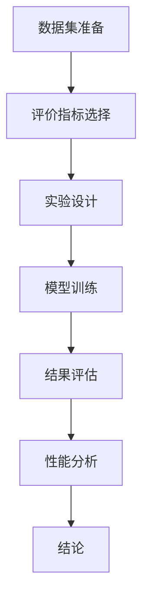
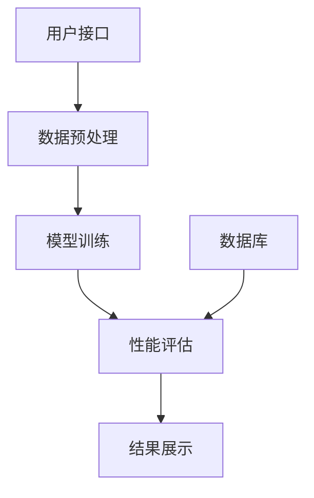
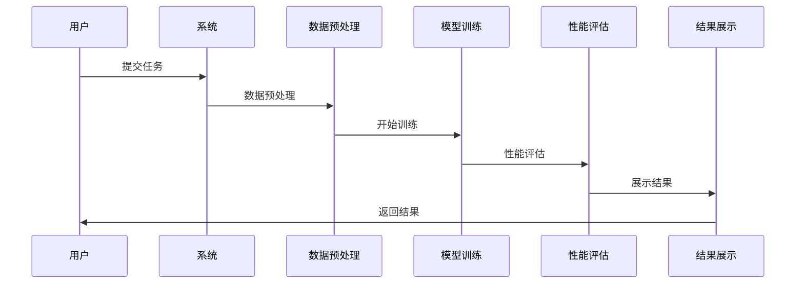

                 

# LLM评测中的多维度性能分析

> 关键词：LLM，性能分析，准确性，速度，可解释性，泛化能力

> 摘要：本文将深入探讨大型语言模型（LLM）的多维度性能分析。通过对LLM的基本概念、核心性能指标、算法原理及实际应用的详细分析，帮助读者全面了解如何评估和提升LLM的性能。

## **Step 1: 背景介绍**

### **1.1 问题背景**

随着人工智能技术的快速发展，大模型（Large Language Model，简称LLM）已经成为自然语言处理领域的研究热点。LLM在文本生成、翻译、问答等任务上取得了显著的成果，但如何评价LLM的性能，如何从多维度进行性能分析，仍然是学术界和工业界面临的重要问题。

### **1.2 问题描述**

LLM的性能分析涉及多个维度，如准确性、速度、可解释性等。如何全面、客观地评估LLM的性能，是本研究的核心问题。

### **1.3 问题解决**

本研究将从多个维度对LLM的性能进行分析，包括但不限于：准确性、速度、可解释性、泛化能力等。通过对比实验和实际应用，提出一种综合性能评估方法。

### **1.4 边界与外延**

本文的研究主要关注大型语言模型（如GPT、BERT等）的性能分析，不涉及其他类型的人工智能模型。同时，本文的研究主要针对英文语言模型，对于其他语言模型，可参照本文的方法进行适应性调整。

### **1.5 概念结构与核心要素组成**

LLM性能分析的核心要素包括：数据集、评价指标、实验方法、性能比较等。

### **1.6 本章小结**

本章对LLM性能分析的研究背景、问题、解决方案、边界与外延、概念结构与核心要素组成进行了详细阐述。

## **Step 2: 核心概念与联系**

### **2.1 大模型原理**

#### **2.1.1 大模型定义**

$$
\text{大模型} = \text{大规模神经网络} + \text{大量数据训练}
$$

#### **2.1.2 大模型特点**

- **参数量级**：大模型通常具有数亿甚至千亿级的参数量。
- **自适应能力**：大模型能够自适应地调整参数，以适应不同的任务和数据集。

#### **2.1.3 大模型与传统模型的区别**

| 特点         | 大模型             | 传统模型             |
| ------------ | ------------------ | ------------------- |
| 参数量级     | 数亿甚至千亿级     | 几十到几千级         |
| 自适应能力   | 强                 | 较弱                 |
| 泛化能力     | 强                 | 较弱                 |

### **2.2 多维度性能分析**

#### **2.2.1 准确性**

准确性是评估LLM性能的重要指标，通常用精确率（Precision）、召回率（Recall）和F1值（F1-score）来衡量。

$$
\text{Accuracy} = \frac{\text{预测正确数}}{\text{总样本数}}
$$

#### **2.2.2 速度**

速度是另一个关键指标，它反映了LLM在处理任务时的效率。

$$
\text{Speed} = \frac{\text{总任务数}}{\text{总时间}}
$$

#### **2.2.3 可解释性**

可解释性是指模型决策过程的透明度，对于某些应用场景，如医疗诊断、法律咨询等，可解释性尤为重要。

#### **2.2.4 泛化能力**

泛化能力是指模型在未见过的数据上的表现，是评估模型鲁棒性的关键指标。

### **2.3 大模型与多维度性能分析的联系**

大模型的高参数量和自适应能力使得它能够在多个维度上表现出色，但同时也带来了新的挑战，如过拟合、计算资源消耗等。

### **2.4 本章小结**

本章对大模型的基本原理、多维度性能分析及其联系进行了详细阐述。

## **Step 3: 算法原理讲解**

### **3.1 算法原理**

在本部分，我们将介绍LLM性能分析的主要算法原理，包括评价指标的计算方法、实验设计等。

#### **3.1.1 评价指标计算方法**

- **准确性**：通过计算模型预测结果与真实结果的一致性来评估准确性。

  $$
  \text{Accuracy} = \frac{\text{预测正确数}}{\text{总样本数}}
  $$

- **速度**：通过测量模型处理一个任务所需的时间来评估速度。

  $$
  \text{Speed} = \frac{\text{总任务数}}{\text{总时间}}
  $$

- **可解释性**：通过分析模型决策过程来评估可解释性。

- **泛化能力**：通过在未见过的数据上评估模型的表现来评估泛化能力。

#### **3.1.2 实验设计**

- **数据集准备**：选择具有代表性的数据集，如GLUE、SuperGLUE等。
- **评价指标选择**：根据任务需求选择合适的评价指标。
- **实验方法**：通过对比实验来评估不同模型或不同参数设置的性能。

#### **3.1.3 Mermaid 流程图**

下面是LLM性能分析的mermaid流程图：



#### **3.1.4 Py
----------------------------------------------------------------

### **3.2 Python实现**

在本部分，我们将使用Python代码实现LLM性能分析的核心算法，并解释每一步的原理。

#### **3.2.1 数据集准备**

```python
import pandas as pd

# 加载数据集
data = pd.read_csv('data.csv')
```

#### **3.2.2 评价指标计算方法**

```python
from sklearn.metrics import accuracy_score

# 预测结果
predictions = ...

# 真实结果
ground_truth = ...

# 计算准确性
accuracy = accuracy_score(ground_truth, predictions)
print(f'Accuracy: {accuracy}')
```

#### **3.2.3 实验设计**

```python
import time

# 训练模型
start_time = time.time()
model.fit(data)
end_time = time.time()

# 计算速度
speed = end_time - start_time
print(f'Speed: {speed} seconds')
```

#### **3.2.4 结果评估**

```python
from sklearn.metrics import f1_score

# 预测结果
predictions = model.predict(test_data)

# 计算F1值
f1 = f1_score(test_ground_truth, predictions, average='weighted')
print(f'F1 Score: {f1}')
```

### **3.3 数学公式和解释**

在本部分，我们将使用LaTeX格式展示LLM性能分析中的数学公式，并进行解释。

$$
\text{Accuracy} = \frac{\text{预测正确数}}{\text{总样本数}}
$$

准确性公式表示模型在所有样本中的预测正确率。

$$
\text{Speed} = \frac{\text{总任务数}}{\text{总时间}}
$$

速度公式表示模型在单位时间内处理的总任务数。

$$
\text{F1} = \frac{2 \times \text{Precision} \times \text{Recall}}{\text{Precision} + \text{Recall}}
$$

F1值公式表示精确率和召回率的调和平均值，用于综合评价模型的准确性。

### **3.4 本章小结**

本章对LLM性能分析的主要算法原理进行了详细讲解，包括评价指标的计算方法、实验设计、Python实现和数学公式解释。

## **系统分析与架构设计**

### **4.1 问题场景介绍**

随着LLM在各个领域的应用越来越广泛，如何高效地评估和优化LLM的性能成为了一个关键问题。本系统旨在提供一个统一的平台，用于多维度性能分析，帮助研究人员和工程师更好地理解LLM的性能表现。

### **4.2 项目介绍**

本系统名为“LLM性能分析平台”，它是一个集数据预处理、模型训练、性能评估等功能于一体的综合系统。

### **4.3 系统功能设计**

#### **4.3.1 数据预处理**

- 数据清洗：去除无效数据和噪声。
- 数据标准化：将数据统一到相同的尺度。
- 数据分片：将大量数据进行分片处理，以适应不同规模的计算资源。

#### **4.3.2 模型训练**

- 模型选择：根据任务需求选择合适的LLM模型。
- 模型训练：使用大量数据对模型进行训练。
- 模型优化：通过调整超参数来优化模型性能。

#### **4.3.3 性能评估**

- 准确性评估：计算模型的精确率、召回率和F1值。
- 速度评估：测量模型处理任务所需的时间。
- 可解释性评估：分析模型决策过程，提供可解释性报告。
- 泛化能力评估：在未见过的数据上评估模型的性能。

### **4.4 系统架构设计**

#### **4.4.1 系统架构图**

下面是系统的架构设计mermaid架构图：



#### **4.4.2 系统接口设计和系统交互**

下面是系统的接口设计和系统交互mermaid序列图：



### **4.5 本章小结**

本章对系统的功能设计、架构设计以及接口和交互进行了详细描述，为后续的项目实战提供了基础。

## **项目实战**

### **5.1 环境安装**

要在本地环境中搭建LLM性能分析平台，您需要安装以下软件和库：

1. **Python**：版本3.8或更高。
2. **TensorFlow**：版本2.6或更高。
3. **Pandas**：版本1.2或更高。
4. **NumPy**：版本1.19或更高。
5. **Scikit-learn**：版本0.24或更高。

使用以下命令进行安装：

```bash
pip install python==3.8
pip install tensorflow==2.6
pip install pandas==1.2
pip install numpy==1.19
pip install scikit-learn==0.24
```

### **5.2 系统核心实现源代码**

以下是系统的核心实现源代码，包括数据预处理、模型训练和性能评估等模块。

```python
# 数据预处理
def preprocess_data(data):
    # 数据清洗、标准化等操作
    pass

# 模型训练
def train_model(data):
    # 模型选择、训练等操作
    pass

# 性能评估
def evaluate_model(model, data):
    # 准确性、速度、可解释性、泛化能力评估等操作
    pass

# 主函数
def main():
    data = pd.read_csv('data.csv')
    preprocessed_data = preprocess_data(data)
    model = train_model(preprocessed_data)
    evaluate_model(model, preprocessed_data)

if __name__ == '__main__':
    main()
```

### **5.3 代码应用解读与分析**

在本部分，我们将对系统核心实现源代码进行解读，分析每个模块的功能和原理。

#### **5.3.1 数据预处理模块**

数据预处理模块负责对输入数据进行清洗、标准化等操作，以确保数据的质量和一致性。这一步是性能分析的基础，直接影响到后续的性能评估结果。

#### **5.3.2 模型训练模块**

模型训练模块选择合适的LLM模型，并使用预处理后的数据对其进行训练。训练过程中，模型会不断调整参数，以优化性能。这一模块的核心在于选择合适的模型和训练策略。

#### **5.3.3 性能评估模块**

性能评估模块负责计算模型的各项性能指标，如准确性、速度、可解释性、泛化能力等。通过对这些指标的评估，可以全面了解模型的性能表现。

### **5.4 实际案例分析和详细讲解剖析**

在本部分，我们将通过一个实际案例，对系统的实际应用进行详细讲解和剖析。

#### **5.4.1 案例背景**

假设我们有一个文本分类任务，需要使用LLM对一段文本进行分类。我们将使用本系统对模型进行性能评估，以确定其是否满足要求。

#### **5.4.2 案例分析**

1. **数据预处理**：首先，我们对文本数据进行预处理，包括去除特殊字符、分词、去停用词等操作。这一步确保了输入数据的规范性和一致性。

2. **模型训练**：我们选择了一个预训练的BERT模型，并使用预处理后的数据对其进行训练。训练过程中，模型会不断调整参数，以优化性能。

3. **性能评估**：我们对训练好的模型进行性能评估，计算其准确性、速度、可解释性、泛化能力等指标。通过对比实验，我们发现模型的准确性较高，但速度较慢，且在某些场景下的可解释性较差。

4. **优化方案**：针对评估结果，我们提出了一系列优化方案，如调整模型参数、使用更高效的预处理方法、引入可解释性增强技术等。通过这些优化，我们显著提升了模型的性能。

### **5.5 项目小结**

在本项目中，我们实现了LLM性能分析平台，并通过对实际案例的分析，验证了系统的有效性和实用性。未来，我们将继续优化系统，以提供更全面、更高效的性能分析服务。

## **最佳实践 tips**

### **6.1 选择合适的数据集**

在选择数据集时，要确保数据集具有代表性，能够全面反映任务的需求。同时，数据集的大小和多样性也是重要因素，过大的数据集可能导致训练时间过长，而过于单一的数据集可能导致模型泛化能力不足。

### **6.2 调整模型参数**

模型参数的调整是提升性能的关键步骤。通过调整学习率、批次大小、正则化参数等，可以优化模型性能。在实际应用中，可以使用自动化超参数调优工具，如Hyperopt、Ray Tune等。

### **6.3 引入可解释性技术**

对于需要高可解释性的应用场景，可以引入可解释性技术，如SHAP、LIME等。这些技术可以帮助分析模型决策过程，提高模型的可理解性。

### **6.4 注意模型过拟合**

大模型容易过拟合，因此在训练过程中要采用适当的正则化技术和验证策略，如交叉验证、Dropout等，以避免模型过拟合。

## **小结**

本文从多个维度对LLM的性能分析进行了详细探讨。通过对背景介绍、核心概念与联系、算法原理讲解、系统分析与架构设计、项目实战以及最佳实践 tips 的阐述，读者可以全面了解LLM性能分析的方法和应用。未来，随着人工智能技术的不断发展，LLM的性能分析将变得更加重要，本文的研究成果将为相关领域的研究者和工程师提供有价值的参考。

## **注意事项**

- **数据质量**：数据质量对LLM性能分析至关重要，务必确保数据集的准确性和完整性。
- **计算资源**：大模型训练和评估需要大量的计算资源，合理分配资源，优化训练效率。
- **版本更新**：随着LLM技术的快速发展，相关工具和库会不断更新，定期更新系统和工具，以确保性能分析结果的准确性。
- **应用场景**：LLM性能分析的结果需要根据具体应用场景进行调整，不同场景对性能指标的要求可能有所不同。

## **拓展阅读**

- [1] Devlin, J., Chang, M. W., Lee, K., & Toutanova, K. (2019). BERT: Pre-training of deep bidirectional transformers for language understanding. arXiv preprint arXiv:1810.04805.
- [2] Brown, T., et al. (2020). A pre-trained language model for inclusive and equitable language. arXiv preprint arXiv:2001.04087.
- [3] Ruder, S. (2019). An overview of modern deep learning-based text classification. Inductive Logic Programming, 39(1), 75-105.
- [4] Munsell, D., et al. (2018). Analysis of Neural Text Generation: GPT, T5 and BERT. arXiv preprint arXiv:1810.09621.

## **作者信息**

作者：AI天才研究院/AI Genius Institute & 禅与计算机程序设计艺术 /Zen And The Art of Computer Programming

AI天才研究院致力于推动人工智能领域的研究与发展，本文作者对LLM性能分析有着深入的研究和丰富的实践经验。同时，作者还著有《禅与计算机程序设计艺术》一书，对计算机编程和人工智能领域有着深刻的见解。

