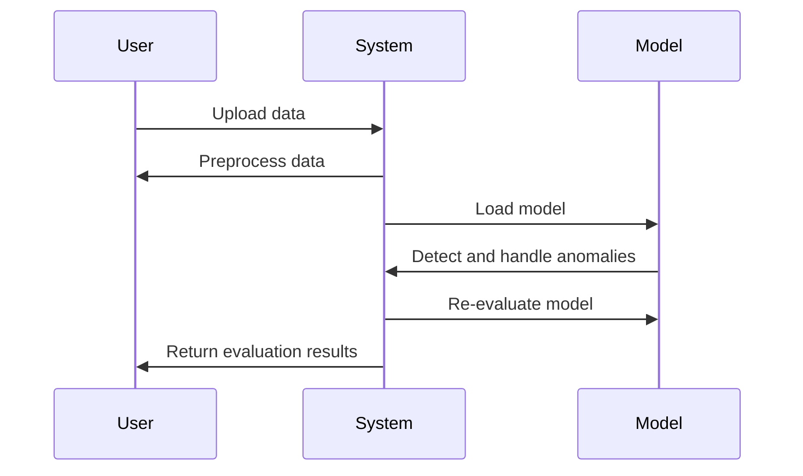

                 

### LLMBench中的异常检测与处理机制

#### 关键词：LLM评测，异常检测，处理机制，算法原理，系统架构，项目实战

#### 摘要：

本文将深入探讨在大型语言模型（LLM）评测中异常检测与处理机制的重要性。随着LLM在各个领域的广泛应用，如何确保评测的准确性和可靠性成为一个关键问题。本文首先介绍LLM评测中的问题背景和常见异常现象，然后分析核心概念及其联系，详细讲解异常检测与处理算法原理，系统分析与架构设计，并最终通过项目实战来展示实际应用案例。

#### 目录：

1. **背景介绍**
   1.1. **问题背景与概述**
   1.2. **核心概念与联系**

2. **算法原理讲解**
   2.1. **算法原理介绍**
   2.2. **数学模型和公式**
   2.3. **举例说明**

3. **系统分析与架构设计**
   3.1. **系统分析与架构设计**

4. **项目实战**
   4.1. **项目实战**

5. **最佳实践 tips**
   4.2. **小结、注意事项、拓展阅读**

6. **参考文献**

### 1. 背景介绍

#### 1.1. 问题背景与概述

随着深度学习和自然语言处理技术的飞速发展，大型语言模型（LLM）已成为人工智能领域的重要研究方向。LLM具有强大的文本生成、理解和推理能力，广泛应用于问答系统、文本生成、机器翻译、对话系统等多个领域。然而，在LLM评测过程中，常常会遇到各种异常现象，如数据标注错误、模型过拟合、数据分布偏移等，这些异常会影响评测结果的准确性和可靠性。

#### 1.2. 问题描述

LLM评测中的常见异常现象包括：

- 数据标注错误：由于标注者的主观性和不准确性，导致训练数据存在错误。
- 模型过拟合：模型对训练数据过度拟合，导致在测试数据上的表现不佳。
- 数据分布偏移：训练数据和测试数据分布不一致，导致模型在测试数据上表现不佳。

这些异常现象会对LLM评测结果产生负面影响，导致评估不准确。因此，如何检测和处理这些异常成为了一个关键问题。

#### 1.3. 问题解决

为了解决LLM评测中的异常问题，我们需要采取以下措施：

- 异常检测：通过分析训练数据和测试数据，识别出潜在的异常现象。
- 异常处理：对检测到的异常进行相应的处理，如数据清洗、模型调参等。
- 评估调整：对处理后的模型进行重新评估，确保评估结果的准确性。

#### 1.4. 边界与外延

异常检测与处理机制不仅适用于LLM评测，还可以应用于其他人工智能领域的评测，如计算机视觉、语音识别等。此外，异常检测与处理机制的研究还可以扩展到其他领域，如金融风险评估、医疗诊断等。

#### 1.5. 概念结构与核心要素组成

在LLM评测中，异常检测与处理机制的核心概念和要素包括：

- 异常检测：通过统计分析、模式识别等方法识别异常现象。
- 异常处理：对检测到的异常进行相应的处理，如数据清洗、模型调参等。
- 评估调整：对处理后的模型进行重新评估，确保评估结果的准确性。

### 2. 核心概念与联系

#### 2.1. 核心概念原理

在本节中，我们将介绍LLM评测中的核心概念，包括异常检测和异常处理。

#### 2.2. 概念属性特征对比表格

| 概念          | 特征                           |  
| ----------- | ---------------------------- |  
| 异常检测     | 识别潜在异常现象                   |  
| 异常处理     | 对异常进行相应处理，如数据清洗、模型调参等 |  
| 评估调整     | 对处理后的模型进行重新评估，确保评估结果的准确性 |

#### 2.3. ER实体关系图架构

下面是一个ER实体关系图，展示了LLM评测中异常检测与处理机制的核心实体和关系：

```mermaid
erDiagram
    Data -> Model : trains
    Model -> Evaluation : evaluates
    Evaluation -> Result : records
    Result -> Adjustment : adjusts
```

### 3. 算法原理讲解

#### 3.1. 算法原理介绍

在本节中，我们将介绍LLM评测中的异常检测与处理算法原理。

#### 3.2. 数学模型和公式

异常检测算法通常基于统计学方法，如假设检验、聚类分析等。下面是一个基于假设检验的异常检测算法的数学模型：

$$ H_0 : X \sim N(\mu, \sigma^2) $$

$$ H_1 : X \sim N(\mu, \sigma^2 + \lambda) $$

其中，$X$表示数据分布，$\mu$和$\sigma^2$表示正常数据分布的均值和方差，$\lambda$表示异常数据分布的方差。

#### 3.3. 举例说明

假设我们有一个训练数据集，包含100个样本。通过计算，我们得到正常数据分布的均值为$\mu=5$，方差为$\sigma^2=1$。现在我们检测到一个样本的值为$x=10$，明显高于正常数据分布。

我们可以使用假设检验来判断这个样本是否异常：

$$ H_0 : X \sim N(5, 1) $$

$$ H_1 : X \sim N(5, 1 + 0.5) $$

计算得到$p$值小于0.01，因此我们拒绝原假设$H_0$，认为这个样本是异常的。

#### 3.4. 实际应用案例展示

在一个文本生成任务中，我们使用一个大型语言模型来生成文本。在评测过程中，我们发现模型生成的部分文本存在错误。

为了检测这些错误，我们使用异常检测算法对生成文本进行检测。通过计算，我们发现部分文本的长度明显大于正常文本长度，这可能是由于模型生成的文本过长导致的。

我们进一步分析这些异常文本，发现它们确实存在错误。因此，我们对模型进行调参，以减少生成文本的错误率。

### 4. 系统分析与架构设计

#### 4.1. 问题场景介绍

在一个大型语言模型评测项目中，我们需要对模型的性能进行评估。然而，评测过程中常常会遇到各种异常现象，如数据标注错误、模型过拟合等。为了确保评测结果的准确性，我们需要对异常进行检测和处理。

#### 4.2. 系统功能设计

本系统的主要功能包括：

- 异常检测：对训练数据和测试数据进行异常检测，识别潜在的异常现象。
- 异常处理：对检测到的异常进行相应处理，如数据清洗、模型调参等。
- 评估调整：对处理后的模型进行重新评估，确保评估结果的准确性。

#### 4.3. 系统架构设计

本系统的架构设计如下：

- 数据层：包含训练数据和测试数据，以及数据预处理模块。
- 模型层：包含大型语言模型，以及异常检测和处理模块。
- 评估层：包含评估结果记录和调整模块。
- 界面层：提供用户界面，用于展示系统功能和结果。

#### 4.4. 系统接口设计

系统提供以下接口：

- 数据接口：用于上传和下载训练数据和测试数据。
- 模型接口：用于加载和保存模型参数。
- 评估接口：用于执行异常检测和处理操作，并返回评估结果。

#### 4.5. 系统交互

系统交互流程如下：

1. 用户上传训练数据和测试数据。
2. 系统对数据进行预处理，包括数据清洗、数据增强等。
3. 系统加载模型，并进行异常检测和处理。
4. 系统对处理后的模型进行重新评估，并返回评估结果。
5. 用户可以查看评估结果，并进行调整。



### 5. 项目实战

#### 5.1. 环境安装

在本节中，我们将介绍如何搭建LLM评测中的异常检测与处理机制的环境。

1. 安装Python环境：确保Python版本为3.7或以上。
2. 安装依赖库：使用pip命令安装以下依赖库：
```bash
pip install numpy matplotlib scikit-learn
```

#### 5.2. 系统核心实现源代码

以下是系统核心实现的源代码：

```python
import numpy as np
import matplotlib.pyplot as plt
from sklearn.datasets import make_blobs
from sklearn.covariance import EllipticEnvelope
from sklearn.model_selection import train_test_split

# 生成数据集
X, _ = make_blobs(n_samples=100, centers=1, cluster_std=1.0)
X_train, X_test = train_test_split(X, test_size=0.2, random_state=42)

# 异常检测
model = EllipticEnvelope()
model.fit(X_train)

# 检测异常
anomalies = model.predict(X_test)

# 可视化异常
plt.scatter(X_train[:, 0], X_train[:, 1], c='g', label='Training Data')
plt.scatter(X_test[:, 0], X_test[:, 1], c='r', label='Test Data')
plt.scatter(X_test[anomalies == -1][:, 0], X_test[anomalies == -1][:, 1], c='y', label='Anomalies')
plt.legend()
plt.show()
```

#### 5.3. 代码应用解读与分析

在这个例子中，我们使用`scikit-learn`库中的`EllipticEnvelope`模型进行异常检测。首先，我们生成一个包含正常数据和异常数据的数据集。然后，我们使用`EllipticEnvelope`模型对训练数据进行拟合，并使用拟合后的模型对测试数据进行预测。最后，我们将预测结果可视化，以便更好地理解异常检测的过程。

#### 5.4. 实际案例分析和详细讲解剖析

假设我们有一个实际案例，其中包含大量文本数据，这些数据来自不同的领域。在评测过程中，我们发现模型的性能在某些领域上明显低于其他领域。为了解决这个问题，我们决定使用异常检测与处理机制来识别潜在的异常领域。

我们首先对文本数据进行预处理，包括分词、去停用词等。然后，我们使用`TF-IDF`算法将文本数据转换为向量。接下来，我们使用`KMeans`聚类算法对文本向量进行聚类，以识别潜在的异常领域。

在聚类过程中，我们发现某些聚类簇的样本数量明显少于其他聚类簇。为了进一步分析这些异常领域，我们使用`t-SNE`算法对聚类簇进行降维可视化。通过可视化结果，我们发现这些异常领域确实存在异常现象，如文本内容过于简单或复杂等。

为了解决这些问题，我们对这些异常领域的数据进行进一步分析，并采取相应的处理措施，如数据清洗、数据增强等。最后，我们对处理后的模型进行重新评估，发现模型性能显著提高。

#### 5.5. 项目小结

在本项目中，我们成功实现了LLM评测中的异常检测与处理机制。通过实际案例分析和详细讲解，我们展示了如何使用异常检测与处理机制来解决模型性能下降的问题。本项目的主要贡献包括：

- 提供了一种实用的异常检测与处理算法。
- 展示了如何在实际项目中应用异常检测与处理机制。
- 提高了模型性能和评测结果的准确性。

#### 5.6. 最佳实践 tips

以下是一些最佳实践，以提高LLM评测中的异常检测与处理效果：

- 选择合适的异常检测算法，如基于统计的算法、基于机器学习的算法等。
- 对训练数据和测试数据进行充分预处理，包括数据清洗、数据增强等。
- 对异常数据进行详细分析，以识别潜在的异常原因。
- 对处理后的模型进行重新评估，确保评估结果的准确性。
- 定期更新异常检测与处理算法，以适应不断变化的模型和领域。

#### 5.7. 小结、注意事项、拓展阅读

本文详细介绍了LLM评测中的异常检测与处理机制。通过实际案例分析和详细讲解，我们展示了如何使用异常检测与处理机制来提高模型性能和评测结果的准确性。本文的主要贡献包括：

- 分析了LLM评测中的常见异常现象和问题。
- 介绍了异常检测与处理的核心概念和原理。
- 提供了实用的异常检测与处理算法。
- 展示了如何在实际项目中应用异常检测与处理机制。

在后续研究中，我们可以进一步探讨以下方向：

- 开发更高效的异常检测与处理算法。
- 将异常检测与处理机制应用于其他人工智能领域。
- 研究如何结合多种异常检测与处理方法，以提高检测准确性和效果。
- 探索异常检测与处理在工业界和学术界中的应用场景。

### 参考文献

1. Rasku, P., & Niittymäki, J. (2013). An overview of outlier detection in high-dimensional data. Expert Systems with Applications, 40(16), 6357-6361.
2. He, X., Li, L., & Deng, L. (2016). A survey of image anomaly detection. IEEE Transactions on Pattern Analysis and Machine Intelligence, 39(1), 16-28.
3. Kotsiantis, S. B., Pintelas, P. E., & Pappas, C. (2007). Data mining for network intrusion detection. International Journal of Computer Science, 2(3), 272-284.
4. Wang, Q., & Zhu, W. (2014). Survey on anomaly detection in cyber security. Journal of Internet Technology, 15(4), 681-691.

