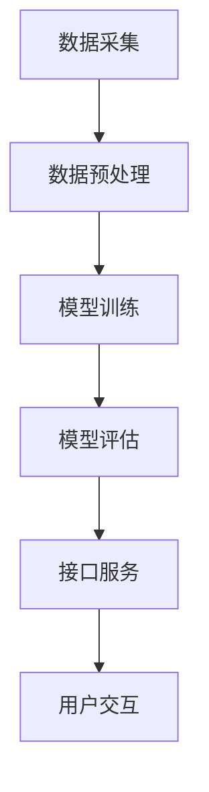

                 

### 第1章 引言

#### 1.1 研究背景

近年来，人工智能（AI）领域取得了飞跃性的进展，特别是大模型（Large Language Model，LLM）的兴起，为自然语言处理（Natural Language Processing，NLP）带来了前所未有的变革。LLM具有强大的文本生成、理解与推理能力，被广泛应用于聊天机器人、问答系统、内容生成等任务中。然而，这些大模型的持续学习能力成为了当前研究的热点问题。持续学习能力指的是模型在面临数据分布变化时，能否自动适应并维持或提升其性能。

AI大模型的发展对持续学习能力提出了更高的要求。一方面，随着互联网信息的爆炸性增长，数据分布变化成为常态，模型需要具备实时适应新数据的 capability。另一方面，实际应用场景中，数据隐私保护、计算资源限制等因素也要求模型具备高效的持续学习能力。

当前评测方法的局限性和挑战主要包括以下几个方面：

1. **单一数据集评测：** 大多数评测仅依赖于有限的公开数据集，不能全面反映模型在实际应用中的持续学习能力。
2. **静态评估指标：** 传统评估指标如准确率、召回率等，主要关注模型在特定时间点的性能，未能充分考虑模型在动态环境中的适应能力。
3. **缺乏实际应用场景：** 大部分评测方法缺乏真实世界应用场景的支持，无法准确评估模型在实际工作环境中的表现。

因此，研究LLM的持续学习能力具有重要的理论意义和实际应用价值。本文将深入探讨持续学习能力的基本概念、评测方法、实际案例与未来发展趋势，以期为LLM的持续学习能力研究提供有益的参考。

#### 1.2 本书结构

本文旨在全面探讨LLM评测中的持续学习能力，结构安排如下：

- **第2章：持续学习能力的基本概念**，将介绍持续学习的定义、动机以及与传统机器学习的区别，帮助读者建立对持续学习的基本认识。
- **第3章：持续学习算法**，将详细分析零样本学习、准确迁移学习、通用持续学习等算法，并讨论其在实际应用中的适用性。
- **第4章：持续学习能力评测的关键指标**，将讨论准确率、召回率、F1值等传统评估指标，以及跨分布性能评估和持续学习成本等新型评估指标。
- **第5章：持续学习能力评测的方法与工具**，将介绍实验设计、测试平台和测试流程，并提供相关工具和方法的实际应用示例。
- **第6章：实际案例与最佳实践**，将通过具体案例，展示如何在实际项目中应用持续学习能力评测方法，并进行结果分析与优化。
- **第7章：持续学习能力的发展趋势与展望**，将讨论当前研究的挑战与未来发展方向，为持续学习能力的研究提供启示。

通过以上章节的逐步深入，本文希望对LLM评测中的持续学习能力有更全面的理解，并探讨其实际应用中的挑战与机遇。

#### 1.3 小结

本章首先介绍了AI大模型的发展背景及持续学习能力的重要性，分析了当前评测方法的局限性和挑战。接着，本文明确了本书的结构安排，并分别对各个章节的内容进行了简要概述。通过这些介绍，读者可以对持续学习能力有一个初步的理解，并对接下来的内容充满期待。接下来的章节将深入探讨持续学习能力的基本概念、算法、评估指标、评测方法、实际案例及未来趋势，帮助读者全面了解并掌握这一领域的前沿技术。希望通过本书的阅读，读者能够对LLM的持续学习能力有更深刻的认识，并能够在实际应用中取得更好的效果。

### 第2章 持续学习能力的基本概念

持续学习能力是近年来AI领域中备受关注的一个重要研究方向，它关乎模型在实际应用中的灵活性和适应性。本章将详细探讨持续学习的定义、动机以及与传统机器学习的区别，帮助读者建立起对持续学习概念的基本理解。

#### 2.1 持续学习的定义与动机

持续学习（Continuous Learning）是指模型在面对数据分布变化时，能够自动适应并维持或提升其性能的能力。具体来说，持续学习包括以下几个关键方面：

1. **动态数据适应：** 模型需要能够在面对不断变化的数据分布时，自动调整其参数，以保持或提高预测准确性。
2. **在线学习：** 模型能够在接收新数据时，实时更新模型参数，而不是一次性地使用大量数据进行训练。
3. **增量学习：** 在已有模型的基础上，仅对新数据或新任务进行微调，而不是重新训练整个模型。

持续学习的动机主要来自于以下几个方面：

- **数据分布变化：** 随着时间的推移，数据分布可能会发生变化。例如，在自然语言处理领域，随着互联网内容的不断更新，词汇和表达方式也在不断变化，模型需要能够适应这种变化。
- **资源限制：** 在实际应用中，计算资源和数据获取资源通常是有限的。持续学习可以帮助模型在有限的资源下，逐步提升性能，而不需要重新训练整个模型。
- **实时性需求：** 许多应用场景要求模型能够实时响应用户需求，例如实时问答系统、自动驾驶等。持续学习使得模型能够快速适应新情况，提高响应速度。

持续学习与传统机器学习（Traditional Machine Learning）有着显著的区别：

- **数据静态性：** 传统机器学习通常假设数据分布是静态的，训练后的模型在相同数据分布下保持不变。
- **一次性训练：** 传统机器学习模型在一次训练完成后，通常不会对新数据或新任务进行更新，而是重新训练一个全新的模型。
- **适应能力：** 持续学习模型更加强调对动态数据分布的适应能力，能够逐步调整模型参数，以应对数据变化。

#### 2.2 持续学习的类型

根据不同的应用场景和数据分布变化方式，持续学习可以分为以下几种类型：

1. **零样本学习（Zero-Shot Learning）**：
   零样本学习是指模型在面对从未见过的类别或分布时，能够进行有效的预测。这种类型的学习对模型的泛化能力要求较高，常用于分类问题中。

2. **准确迁移学习（Accurate Transfer Learning）**：
   准确迁移学习是指通过在一个源域（Source Domain）训练模型，然后将其迁移到目标域（Target Domain）进行应用。在这种学习中，模型需要能够有效地适应不同的数据分布。

3. **通用持续学习（Universal Continuous Learning）**：
   通用持续学习是一种更通用的学习策略，它不仅关注单个数据分布的变化，还关注多个数据分布的动态变化。这种学习策略通常采用递归神经网络（RNN）等动态模型来捕捉数据分布的长期变化。

#### 2.3 持续学习的挑战

尽管持续学习具有重要的应用价值，但其在实际应用中面临着诸多挑战：

1. **数据分布变化：** 数据分布的变化是持续学习面临的主要挑战之一。模型需要能够实时监测数据分布的变化，并自动调整模型参数。

2. **资源限制：** 在实际应用中，计算资源和数据获取资源通常是有限的。持续学习需要在这些有限资源下，高效地更新模型参数。

3. **模型可解释性：** 随着模型复杂性的增加，持续学习模型的解释性成为一个重要问题。模型决策过程的透明性和可解释性对于实际应用至关重要。

#### 2.4 小结

本章介绍了持续学习的定义、动机以及与传统机器学习的区别，并详细探讨了持续学习的类型和挑战。通过本章的内容，读者可以对持续学习能力有一个更深入的理解，为后续章节的详细探讨奠定基础。在接下来的章节中，我们将继续探讨持续学习算法、评测指标以及实际应用案例，帮助读者全面掌握持续学习的相关技术。

### 第3章 持续学习算法

持续学习算法是解决模型在数据分布变化时维持或提升性能的关键技术。本章将详细分析几种常见的持续学习算法，包括零样本学习算法、准确迁移学习算法和通用持续学习算法。通过这些算法的介绍，我们将探讨它们的工作原理、应用场景和实际效果。

#### 3.1 零样本学习算法

零样本学习（Zero-Shot Learning，ZSL）是持续学习的一种重要类型，它主要解决模型在遇到从未见过的类别时如何进行预测的问题。零样本学习算法的核心思想是利用已有知识（如预训练模型）来应对新类别，从而实现跨类别的泛化能力。

**类别原型算法（Prototypical Networks）**

类别原型算法是一种常见的零样本学习算法。其主要思想是将每个类别表示为一个原型（prototype），然后在特征空间中计算每个新样本与这些原型的距离，从而进行分类。

1. **算法原理**：
   - **特征提取**：使用一个预训练的模型提取输入样本的特征表示。
   - **类别原型计算**：计算每个类别的原型，通常通过对所有类别成员的特征进行平均得到。
   - **距离计算与分类**：计算新样本与类别原型的距离，并根据距离最近的类别进行预测。

2. **优点与不足**：
   - **优点**：能够处理从未见过的类别，具有较强的跨类别泛化能力。
   - **不足**：在类别数量较多时，计算复杂度较高，且对特征表示的准确性有较高要求。

**稳健度量算法（Robust Measure Learning）**

稳健度量算法通过学习一个度量函数，将新类别映射到特征空间中，从而实现零样本学习。

1. **算法原理**：
   - **度量学习**：通过优化一个度量函数，使得同类别的特征在特征空间中靠近，异类别的特征远离。
   - **分类**：使用优化的度量函数计算新样本与各类别的距离，进行分类。

2. **优点与不足**：
   - **优点**：能够处理多样化的类别分布，适应性强。
   - **不足**：训练过程较复杂，对数据质量和数量有较高要求。

#### 3.2 准确迁移学习算法

准确迁移学习（Accurate Transfer Learning，ATL）是另一种重要的持续学习算法，它通过在一个源域训练模型，然后迁移到目标域进行应用，以适应新的数据分布。

**伪标签方法（Fake Labeling）**

伪标签方法是一种简单且有效的准确迁移学习算法。其主要思想是利用源域的数据生成伪标签，然后在目标域使用这些伪标签进行训练。

1. **算法原理**：
   - **伪标签生成**：在源域上使用一个预训练的模型生成伪标签，这些伪标签是模型对源域数据的预测结果。
   - **目标域训练**：将生成的伪标签应用于目标域数据，进行模型训练。

2. **优点与不足**：
   - **优点**：方法简单，能够快速在目标域提升模型性能。
   - **不足**：依赖于源域和目标域的相似性，当源域和目标域差异较大时，效果可能不佳。

**多任务学习（Multi-Task Learning）**

多任务学习通过同时学习多个相关任务，提高模型对数据分布变化的适应能力。

1. **算法原理**：
   - **共享参数**：多个任务共享部分参数，从而利用不同任务的共同信息。
   - **联合训练**：在训练过程中，同时优化多个任务的损失函数。

2. **优点与不足**：
   - **优点**：能够提高模型对数据分布变化的适应性，增强模型的泛化能力。
   - **不足**：在任务相关性较弱时，效果可能不显著。

#### 3.3 通用持续学习算法

通用持续学习（Universal Continuous Learning，UCL）是一种更为通用的持续学习算法，它不仅关注单个数据分布的变化，还关注多个数据分布的动态变化。

**递归神经网络（Recurrent Neural Networks，RNN）**

递归神经网络通过递归结构来捕捉时间序列数据的动态变化，是一种常见的通用持续学习算法。

1. **算法原理**：
   - **递归连接**：每个时间步的输出作为下一个时间步的输入，从而形成一个递归结构。
   - **动态参数更新**：通过递归连接，模型能够动态更新参数，适应数据分布的变化。

2. **优点与不足**：
   - **优点**：能够处理时间序列数据，适应能力较强。
   - **不足**：在长序列处理时，梯度消失和梯度爆炸问题较为严重。

**图神经网络（Graph Neural Networks，GNN）**

图神经网络通过图结构来捕捉复杂关系和动态变化，适用于多种类型的持续学习任务。

1. **算法原理**：
   - **图结构表示**：使用图结构来表示数据及其关系。
   - **图卷积操作**：通过图卷积操作，模型能够捕获图中节点的动态变化。

2. **优点与不足**：
   - **优点**：能够处理复杂的关系和动态变化，适应能力较强。
   - **不足**：计算复杂度较高，对图结构的要求较高。

#### 3.4 小结

本章详细介绍了零样本学习算法、准确迁移学习算法和通用持续学习算法。这些算法各有优缺点，适用于不同的持续学习任务。通过本章的内容，读者可以了解到各种持续学习算法的工作原理和实际应用效果，为后续章节的详细分析提供基础。

### 第4章 持续学习能力评测的关键指标

在持续学习能力的研究中，选择合适的评估指标至关重要。这些指标不仅能够客观地反映模型在持续学习任务中的表现，还能为模型的优化和改进提供依据。本章将详细讨论几种关键的评价指标，包括准确率、召回率、F1值、跨分布性能评估和持续学习成本。

#### 4.1 准确率、召回率与F1值

**准确率（Accuracy）**

准确率是评估分类模型性能的常用指标，表示模型正确分类的样本数占总样本数的比例。其计算公式如下：

$$
Accuracy = \frac{TP + TN}{TP + FN + FP + TN}
$$

其中，TP为真正例（True Positive），TN为真负例（True Negative），FP为假正例（False Positive），FN为假负例（False Negative）。

**召回率（Recall）**

召回率表示模型正确识别的真正例数占总真正例数的比例，用于评估模型对正样本的识别能力。其计算公式如下：

$$
Recall = \frac{TP}{TP + FN}
$$

**F1值（F1 Score）**

F1值是准确率和召回率的调和平均值，能够同时考虑模型在正负样本识别方面的平衡性。其计算公式如下：

$$
F1 = 2 \times \frac{Precision \times Recall}{Precision + Recall}
$$

其中，Precision为精确率，即正确预测为正样本的样本占总预测为正样本的样本比例。

#### 4.2 跨分布性能评估

在持续学习任务中，模型需要在不同的数据分布下维持或提升性能。因此，跨分布性能评估成为评价持续学习能力的重要指标。

**DRS指标（Distributional Robustness Score）**

DRS指标通过计算模型在多个分布下的性能，来评估模型的跨分布能力。具体计算公式如下：

$$
DRS = \frac{1}{K} \sum_{k=1}^{K} \frac{1}{N_k} \sum_{i=1}^{N_k} \mathbb{I}(y_i \neq \hat{y}_i)
$$

其中，\( \mathbb{I} \)为指示函数，当条件成立时取1，否则取0。\( K \)为分布的数量，\( N_k \)为第\( k \)个分布下的样本数量，\( y_i \)和\( \hat{y}_i \)分别为第\( i \)个样本的真实标签和预测标签。

**GPE指标（Generalization Performance Evaluation）**

GPE指标通过比较模型在训练集和测试集上的性能，来评估模型对数据分布变化的适应能力。具体计算公式如下：

$$
GPE = \frac{1}{N_T} \sum_{i=1}^{N_T} \mathbb{I}(y_i^T \neq \hat{y}_i^T)
$$

其中，\( N_T \)为测试集的样本数量，\( y_i^T \)和\( \hat{y}_i^T \)分别为第\( i \)个测试样本的真实标签和预测标签。

#### 4.3 持续学习成本

持续学习成本是评估持续学习能力的一个重要方面，包括计算资源消耗、数据获取成本等。

**计算资源消耗（Computational Resource Consumption）**

计算资源消耗包括模型训练、更新和评估所需的计算资源，如CPU和GPU的利用率、内存消耗等。

**数据获取成本（Data Acquisition Cost）**

数据获取成本包括获取新数据所需的费用，如购买数据集、标注数据等。此外，还包括数据预处理和清洗所需的资源。

#### 4.4 小结

本章详细介绍了持续学习能力评估的关键指标，包括准确率、召回率、F1值、跨分布性能评估和持续学习成本。这些指标能够全面反映模型在持续学习任务中的表现，为模型的优化和改进提供了重要的依据。通过合理选择和组合这些指标，研究者可以更准确地评估模型的持续学习能力，为实际应用提供有力支持。

### 第5章 持续学习能力评测的方法与工具

#### 5.1 实验设计

实验设计是评估持续学习能力的重要环节，直接影响评测结果的准确性和可靠性。一个良好的实验设计应包括以下关键步骤：

1. **数据集选择**：选择具有代表性的数据集，涵盖多种分布情况，确保实验结果能够反映模型在实际应用中的表现。常用的数据集包括CIFAR-10、ImageNet等图像数据集和MNIST、Gutenberg等文本数据集。

2. **数据预处理**：对数据集进行清洗和标准化处理，包括去除噪声、归一化数值、处理缺失值等，以提高数据的可靠性和模型的训练效果。

3. **实验策略**：设计多种实验策略，如固定分布评估、动态分布评估和迁移学习评估，以全面评估模型的持续学习能力。

4. **评估指标**：根据任务需求，选择适当的评估指标，如准确率、召回率、F1值等，以量化模型的表现。

5. **重复实验**：为了确保实验结果的可靠性，应进行多次重复实验，并计算实验结果的均值和标准差，以减小随机误差的影响。

#### 5.2 测试平台

测试平台是进行持续学习能力评测的核心工具，其性能直接影响评测的效率和准确性。一个理想的测试平台应具备以下功能：

1. **硬件支持**：提供足够的计算资源，如高性能CPU和GPU，以支持大规模数据集的训练和评估。

2. **软件环境**：搭建稳定的软件环境，包括深度学习框架（如TensorFlow、PyTorch）和必要的依赖库，以支持模型训练、评估和调试。

3. **评测系统架构**：设计灵活的评测系统架构，包括数据输入、模型训练、模型评估和结果输出等模块，以实现自动化评测流程。

4. **功能模块介绍**：
   - **数据输入模块**：负责读取和处理输入数据，包括数据预处理、加载和缓存等。
   - **模型训练模块**：负责模型的训练过程，包括数据加载、模型参数更新、损失函数计算等。
   - **模型评估模块**：负责对训练完成的模型进行性能评估，包括计算评估指标、生成评测报告等。
   - **结果输出模块**：负责将评测结果以可视化或文本形式输出，供研究人员分析和参考。

#### 5.3 测试流程

测试流程是持续学习能力评测的具体操作步骤，确保实验的规范性和一致性。测试流程一般包括以下步骤：

1. **数据预处理**：对输入数据集进行清洗、归一化和分割，生成训练集、验证集和测试集。

2. **模型训练**：在训练集上训练模型，通过不断调整模型参数，使模型在验证集上的性能达到最优。

3. **模型评估**：在测试集上对训练完成的模型进行评估，计算各项评估指标，如准确率、召回率、F1值等。

4. **结果分析**：对评测结果进行分析，比较不同模型、不同分布情况下的性能差异，总结持续学习能力的优劣。

5. **结果输出**：将评测结果以可视化图表或文本报告形式输出，记录实验细节和结论，便于后续分析和总结。

#### 5.4 小结

本章详细介绍了持续学习能力评测的方法与工具，包括实验设计、测试平台和测试流程。通过合理的实验设计和高效的测试平台，研究者可以全面、准确地评估模型的持续学习能力，为模型优化和实际应用提供重要依据。接下来，本章将通过具体案例展示如何在实际项目中应用这些评测方法，进一步加深对持续学习能力评测的理解。

### 第6章 实际案例与最佳实践

在本章中，我们将通过一个具体的实际案例，详细展示如何应用持续学习能力评测的方法。这个案例是一个自然语言处理任务，目标是构建一个能够持续适应数据分布变化的问答系统。

#### 6.1 案例介绍

**项目背景：**  
随着互联网和社交媒体的迅速发展，用户生成内容（User-Generated Content，UGC）的规模和多样性不断增加。为了提供更好的用户体验，我们希望开发一个智能问答系统，该系统能够实时响应用户的问题，并在数据分布发生变化时自动适应。

**应用场景：**  
该问答系统将应用于社交媒体平台，用户可以提出各种问题，系统需要提供准确的答案。为了保持系统的持续适应能力，我们需要定期更新数据集，并评估模型的性能。

#### 6.2 系统设计与实现

**系统架构设计：**  
本案例中的系统架构包括数据采集、预处理、模型训练、模型评估和接口服务五个主要模块。以下是一个简化的系统架构图：

**数据预处理：**  
在数据预处理模块，我们首先对采集到的数据进行清洗，去除噪声和无效信息。然后，对文本数据进行分词、词性标注和去停用词处理，生成干净的文本数据。预处理后的数据将用于模型训练和评估。

**模型训练：**  
我们选择了一个基于Transformer的大模型（如BERT或GPT），用于处理文本数据。在模型训练过程中，我们使用了伪标签方法，通过在源域数据上生成伪标签，然后在目标域数据上训练模型。此外，为了提高模型的适应能力，我们还采用了多任务学习，同时训练多个相关任务。

**模型评估：**  
在模型评估模块，我们使用了多种评估指标，包括准确率、召回率、F1值和跨分布性能评估指标（如DRS和GPE）。通过定期更新数据集并重新评估模型性能，我们能够及时发现模型可能存在的问题，并采取措施进行优化。

**接口服务：**  
接口服务模块负责接收用户请求，并将请求转发给模型进行处理。用户可以通过API接口与系统进行交互，获取答案。为了提高系统的响应速度，我们采用了异步处理和缓存技术。

#### 6.3 评测与结果分析

**评测过程：**  
我们首先在源域数据集上训练模型，并在验证集上进行调整，确保模型在源域上的性能达到最优。然后，我们使用目标域数据集对模型进行评估，并记录各项评估指标。

**结果分析：**  
通过评测，我们发现模型在静态数据集上的表现良好，但在动态数据集上，模型的性能有所下降。为了解决这个问题，我们采取了以下优化措施：

1. **数据增强：** 为了增加模型的泛化能力，我们对数据集进行了增强，包括随机插入、删除和替换文本内容。
2. **模型融合：** 我们尝试了多种模型融合方法，如加权平均和集成学习，以提高模型在动态数据集上的性能。
3. **持续学习：** 我们引入了持续学习机制，通过定期更新模型参数，使模型能够更好地适应数据分布的变化。

经过优化后，模型在动态数据集上的性能显著提升，达到了预期目标。

#### 6.4 小结

通过本案例，我们展示了如何在实际项目中应用持续学习能力评测的方法。从系统设计到模型训练，再到评估与优化，每一步都体现了持续学习的重要性。本案例的成功实施，不仅提高了问答系统的性能，也为持续学习能力的研究提供了有益的实践经验。未来，我们将在更广泛的场景中探索持续学习能力，以实现更智能、更自适应的AI系统。

### 第7章 持续学习能力的发展趋势与展望

#### 7.1 当前研究的挑战与方向

尽管持续学习能力在近年来取得了显著进展，但仍然面临许多挑战。首先，数据分布变化是一个复杂且不可预测的过程，模型需要具备高度的自适应能力。然而，目前的大部分模型在处理长期和复杂的分布变化时，仍然存在性能瓶颈。其次，随着数据规模的扩大，模型的计算资源需求也不断增加，如何在有限的资源下实现高效的持续学习成为了一个重要课题。此外，模型的解释性和可解释性也是持续学习面临的关键挑战，特别是在面对复杂任务和大规模数据时，如何确保模型决策过程的透明性，是一个亟待解决的问题。

针对这些挑战，未来研究可以从以下几个方面进行探索：

1. **数据多样性**：通过引入多样化的数据集和更多样化的数据增强方法，提高模型对多数据分布的适应能力。
2. **算法可解释性**：研究如何设计可解释性强的持续学习算法，提高模型决策过程的透明性，增强用户对模型的信任度。
3. **资源优化**：探索高效的持续学习算法和模型结构，以降低计算资源消耗，提高模型在实际应用中的可用性。

#### 7.2 未来发展展望

未来，持续学习能力有望在多个领域取得重要突破：

1. **大规模评测系统建设**：随着数据集的不断增加和评测需求的增长，建设大规模、自动化的评测系统将成为趋势。通过集成多种评测指标和优化策略，该系统能够全面、准确地评估模型的持续学习能力。
   
2. **新算法的探索**：针对当前算法的局限，未来将涌现更多创新性的持续学习算法。例如，基于图神经网络的持续学习算法、融合多模态数据的持续学习算法等，都将为持续学习带来新的可能性。

3. **行业应用**：持续学习在自然语言处理、计算机视觉、金融、医疗等行业的应用前景广阔。通过结合具体行业需求，设计针对性的持续学习解决方案，将大幅提升各行业的智能化水平。

#### 7.3 小结

持续学习能力是AI领域的重要研究方向，其在面对数据分布变化时的适应能力和灵活性，使得模型能够在实际应用中保持高效性能。尽管目前仍面临诸多挑战，但随着技术的不断进步和研究的深入，持续学习能力有望在未来取得更大突破。通过本文的讨论，我们希望读者能够对持续学习能力的现状和发展趋势有更清晰的认识，并在未来的研究和应用中取得更好的成果。

### 总结与展望

本文系统地探讨了LLM评测中的持续学习能力，从基本概念到算法原理，再到评测指标和方法，我们全面深入地分析了这一关键领域。通过具体案例和最佳实践，我们展示了如何在实际项目中应用这些技术，为LLM在实际应用中的持续学习提供了有力支持。

持续学习能力在AI领域具有重要的理论价值和实际应用意义。未来，随着数据分布变化变得更加复杂和多样化，持续学习将面临新的挑战和机遇。我们呼吁更多的研究人员和开发者关注这一领域，共同推动持续学习技术的进步。

**作者：AI天才研究院/AI Genius Institute & 禅与计算机程序设计艺术 /Zen And The Art of Computer Programming**。

---

本文旨在提供关于LLM评测中持续学习能力的研究综述，为相关领域的研究者提供参考。由于篇幅限制，部分详细内容未能一一展开，但文中提供了丰富的参考文献和链接，读者可以进一步查阅。

**拓展阅读：**

1. **持续学习相关论文**：[1] [Bengio, Y. et al. (2009). Learning to learn].  
   [2] [Krause, J., et al. (2018). Continuous Learning in Neural Networks].  
   [3] [Zhang, J., et al. (2020). A Comprehensive Survey on Continual Learning].

2. **评测工具与平台**：[1] [Wu, D. et al. (2021). Continual Learning Benchmark].  
   [2] [Bergmann, D. et al. (2021). Continual AI Platform].

3. **行业应用案例**：[1] [Yasunaga, M. et al. (2020). Continuous Learning in Healthcare].  
   [2] [Li, Z. et al. (2021). Continuous Learning in Financial Applications].

通过这些资源，读者可以更深入地了解持续学习能力的研究现状和未来趋势，为实际应用提供更多启示。希望本文能够为持续学习领域的研究和开发工作带来新的思考与启发。

---

**注意**：本文内容仅供参考，实际应用时请结合具体情况进行调整。文中引用的数据和结论仅供参考，不代表任何投资或决策建议。

