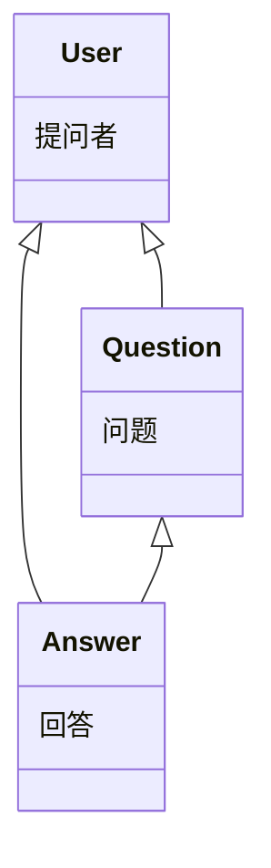
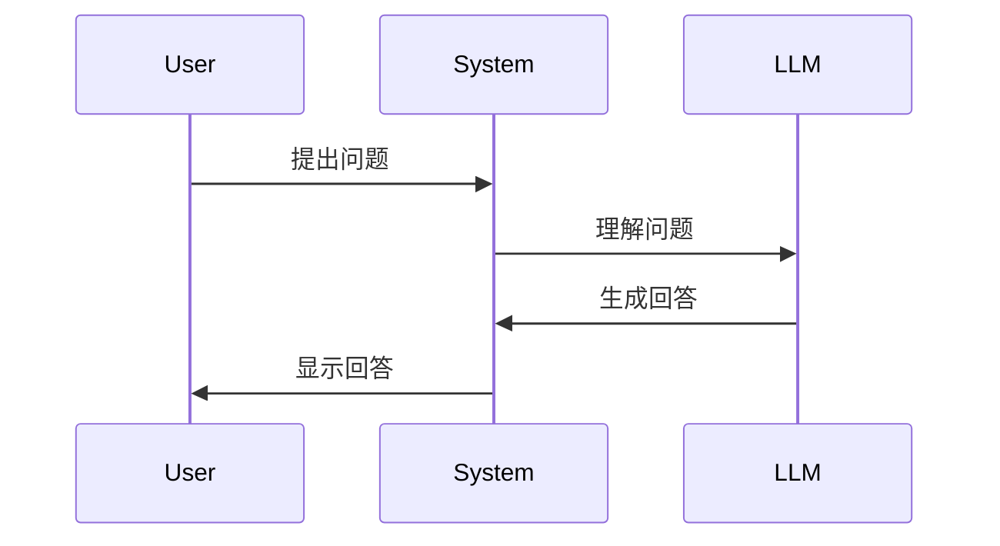
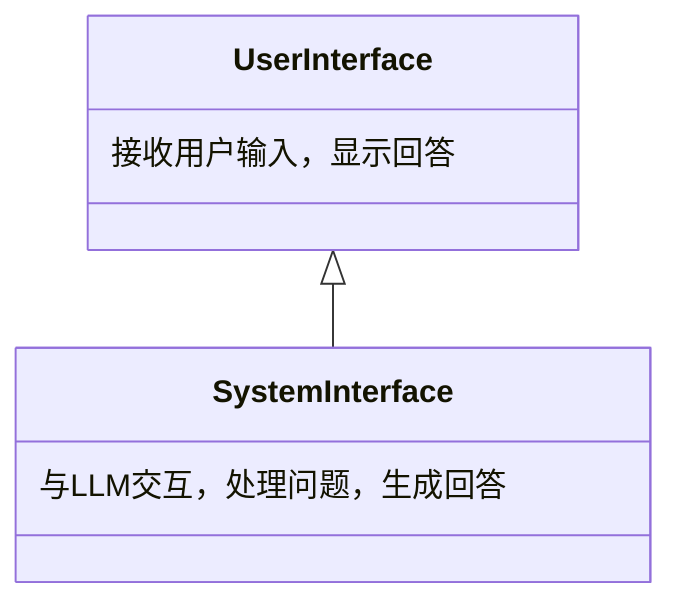
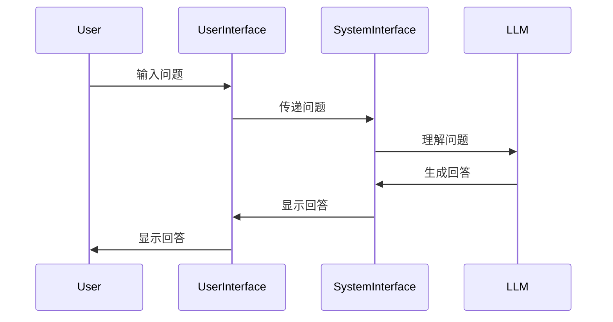
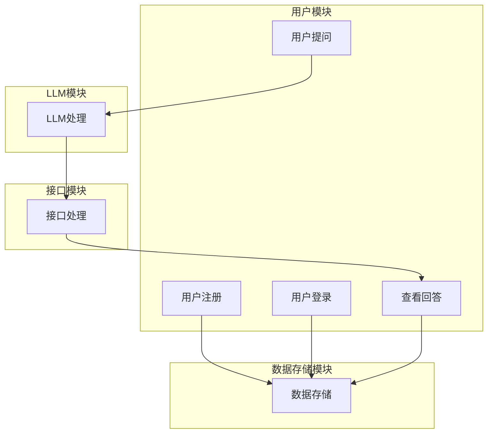
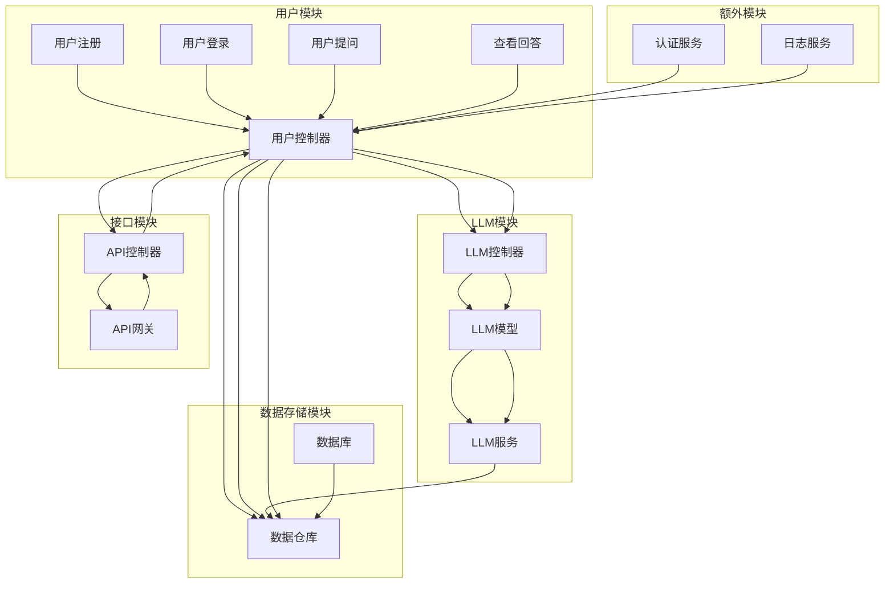
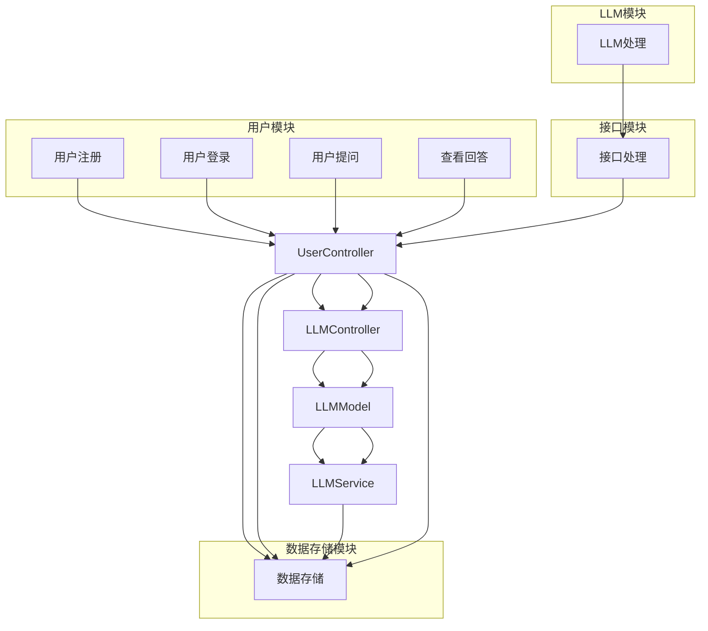

                 

### 《LLM评测中的推理链与思维过程分析》

#### 关键词：
- 大型语言模型（LLM）
- 推理链
- 思维过程
- 评测方法
- 应用实践

#### 摘要：
本文深入探讨了大型语言模型（LLM）的评测过程，重点关注推理链与思维过程的分析。首先，我们介绍了LLM的基本概念、发展历程和应用场景。接着，详细阐述了LLM的推理机制和思维过程，通过具体的算法原理讲解和Python源代码示例，帮助读者理解LLM的工作原理。随后，我们介绍了评测LLM推理链和思维过程的方法，包括评测指标和评测工具。最后，通过实际应用案例，展示了LLM在自然语言处理、文本生成与翻译等领域的应用实践，并提出了最佳实践建议和项目小结。

### 第一部分：LLM基础知识

#### 第1章：LLM概述

##### 1.1 LLM的概念

大型语言模型（Large Language Model，简称LLM）是一种基于深度学习技术构建的模型，主要用于处理自然语言文本数据。它能够理解和生成自然语言，具有广泛的自然语言处理能力，包括文本分类、情感分析、命名实体识别、机器翻译等。

##### 1.2 LLM的发展历程

LLM的发展历程可以追溯到上世纪80年代，当时以规则驱动的方法为主。随着计算机性能的不断提升和深度学习技术的出现，LLM在21世纪迎来了快速发展。从最初的基于词袋模型（Bag of Words，BoW）到基于循环神经网络（Recurrent Neural Network，RNN）的模型，再到基于变换器（Transformer）的模型，LLM在性能和效果上取得了显著的提升。

##### 1.3 LLM的核心优势

LLM具有以下核心优势：
1. **强大的自然语言处理能力**：LLM能够理解和生成自然语言，处理复杂的语言结构和语义信息。
2. **高效率和低错误率**：LLM通过深度学习技术对大量数据进行训练，能够在短时间内生成高质量的文本，并且错误率较低。
3. **广泛的适用性**：LLM可以应用于自然语言处理的各个领域，如文本分类、情感分析、机器翻译、问答系统等。

#### 第2章：LLM的发展历程

##### 2.1 从NLP到LLM的演进

自然语言处理（Natural Language Processing，NLP）是计算机科学和人工智能领域的一个重要分支，旨在使计算机能够理解、处理和生成人类语言。从NLP到LLM的演进，是一个不断探索和突破的过程。

早期NLP方法主要基于规则和统计模型，如正则表达式、朴素贝叶斯、隐马尔可夫模型（Hidden Markov Model，HMM）等。这些方法在一定程度上能够处理简单的语言任务，但在复杂任务上表现不佳。

随着深度学习技术的发展，NLP开始引入神经网络模型，如循环神经网络（RNN）、长短时记忆网络（Long Short-Term Memory，LSTM）等。这些模型在处理复杂语言任务上取得了显著进步。

近年来，基于变换器（Transformer）的模型，如BERT（Bidirectional Encoder Representations from Transformers）、GPT（Generative Pre-trained Transformer）等，在NLP任务中取得了突破性成果。这些模型具有强大的建模能力和灵活性，使得LLM在各个领域的应用变得更加广泛。

##### 2.2 主流LLM模型的演进

主流LLM模型可以分为以下几类：

1. **基于RNN的模型**：如LSTM、GRU（Gated Recurrent Unit）等，这些模型通过引入门控机制，能够更好地处理长距离依赖问题。

2. **基于Transformer的模型**：如BERT、GPT、T5（Text-To-Text Transfer Transformer）等，这些模型通过自注意力机制，能够捕捉全局信息，提高模型的建模能力。

3. **基于Transformer的新模型**：如ALBERT（A Lite BERT）、RoBERTa（A Robustly Optimized BERT Pretraining Approach）、Twins（A Simple and Scalable Baseline for Pre-training Language Models）等，这些模型在原有基础上进行了改进，以提高模型的性能和效率。

##### 2.3 LLM在各个领域的应用

LLM在各个领域的应用如下：

1. **自然语言处理**：如文本分类、情感分析、命名实体识别、机器翻译等。

2. **问答系统**：如自动问答、智能客服等。

3. **文本生成**：如自动摘要、文本生成、对话系统等。

4. **语言模型**：如语言模型、语音识别、语音生成等。

5. **其他应用**：如智能推荐、图像识别、生物信息学等。

#### 第3章：LLM的应用场景

##### 3.1 自然语言处理

自然语言处理（NLP）是LLM最早也是最为广泛的应用领域之一。在NLP中，LLM可以用于文本分类、情感分析、命名实体识别、机器翻译等任务。

1. **文本分类**：LLM可以根据文本内容对文本进行分类，例如对新闻文章进行主题分类、对社交媒体评论进行情感分类等。

2. **情感分析**：LLM可以识别文本中的情感倾向，例如判断用户评论是正面、中性还是负面。

3. **命名实体识别**：LLM可以识别文本中的命名实体，如人名、地名、组织名等。

4. **机器翻译**：LLM可以用于将一种语言的文本翻译成另一种语言的文本，例如将中文翻译成英文。

##### 3.2 文本生成与翻译

文本生成与翻译是LLM的重要应用领域。LLM可以生成各种类型的文本，如摘要、文章、对话等，也可以进行跨语言的文本翻译。

1. **摘要生成**：LLM可以自动生成文本的摘要，例如对长篇文章生成简洁的摘要。

2. **文章生成**：LLM可以生成各种类型的文章，如新闻报道、科技文章、小说等。

3. **对话生成**：LLM可以生成对话文本，例如用于聊天机器人、虚拟助手等。

4. **文本翻译**：LLM可以翻译不同语言的文本，例如将中文翻译成英文、将法语翻译成西班牙语等。

##### 3.3 其他应用领域

除了自然语言处理、文本生成与翻译外，LLM还可以应用于其他领域，如图像识别、语音识别、智能推荐等。

1. **图像识别**：LLM可以用于图像分类、目标检测等任务，例如识别图片中的物体、场景等。

2. **语音识别**：LLM可以用于语音识别任务，例如将语音信号转换为文本。

3. **智能推荐**：LLM可以用于推荐系统，例如根据用户的历史行为生成个性化推荐。

4. **生物信息学**：LLM可以用于生物信息学领域，例如分析基因组数据、预测蛋白质结构等。

### 第二部分：推理链与思维过程

#### 第4章：LLM的推理机制

##### 4.1 推理链的基本原理

LLM的推理链是指在模型处理输入文本时，通过一系列步骤和操作，逐步生成输出文本的过程。这个过程包括词向量表示、编码器解码器交互、解码器输出等步骤。

1. **词向量表示**：将输入文本中的每个词转换为向量表示，以便于模型处理。

2. **编码器解码器交互**：编码器负责将输入文本编码为固定长度的向量，解码器则负责根据编码器的输出生成输出文本。

3. **解码器输出**：解码器逐步生成输出文本，每个输出词都是基于当前已生成的文本和编码器输出进行预测得到的。

##### 4.2 LLM的推理过程

LLM的推理过程可以分为以下几个阶段：

1. **预处理**：对输入文本进行预处理，如分词、去停用词等。

2. **词向量表示**：将预处理后的输入文本转换为词向量表示。

3. **编码器处理**：编码器将词向量表示编码为固定长度的向量。

4. **解码器生成**：解码器根据编码器的输出逐步生成输出文本。

5. **后处理**：对生成的输出文本进行后处理，如去标点、统一大小写等。

##### 4.3 推理链的优化策略

为了提高LLM的推理效率和性能，可以采取以下优化策略：

1. **并行计算**：通过并行计算技术，如多线程、分布式计算等，加快推理速度。

2. **预训练**：通过预训练技术，提前学习到大量的语言知识，提高模型的泛化能力和推理性能。

3. **模型压缩**：通过模型压缩技术，如量化、剪枝等，减小模型的大小，提高推理速度。

4. **推理加速**：通过硬件加速技术，如GPU、TPU等，提高推理速度。

#### 第5章：LLM的思维过程

##### 5.1 思维过程的基本概念

LLM的思维过程是指模型在处理输入文本时，如何理解、分析和生成文本的过程。这个过程包括语义理解、逻辑推理、知识表示等步骤。

1. **语义理解**：模型需要理解输入文本的含义，包括词义、句义和篇章义。

2. **逻辑推理**：模型需要基于语义理解进行逻辑推理，如判断语句的真假、推理因果关系等。

3. **知识表示**：模型需要将推理过程和结果表示为结构化的知识，以便于后续应用。

##### 5.2 LLM的思维机制

LLM的思维机制主要包括以下几个方面：

1. **注意力机制**：通过注意力机制，模型可以关注到输入文本的关键信息，提高语义理解能力。

2. **上下文关系**：模型需要理解输入文本中的上下文关系，如主谓关系、因果关系等。

3. **知识图谱**：模型可以通过知识图谱，将推理过程和结果表示为结构化的知识。

##### 5.3 思维过程的挑战与解决方案

LLM的思维过程面临以下挑战：

1. **语义理解困难**：自然语言中的语义信息复杂多变，模型难以准确理解。

2. **逻辑推理错误**：模型在逻辑推理过程中可能存在错误，导致推理结果不准确。

3. **知识表示不足**：模型难以将推理过程和结果表示为结构化的知识，影响后续应用。

为了解决这些挑战，可以采取以下解决方案：

1. **多模态学习**：结合多种数据模态（如图像、声音、文本等），提高语义理解能力。

2. **预训练与微调**：通过预训练和微调技术，提高模型的推理能力和泛化能力。

3. **知识增强**：通过引入外部知识库，增强模型的推理能力和知识表示能力。

#### 第6章：LLM的评测方法

##### 6.1 评测指标

LLM的评测指标主要包括以下几种：

1. **准确率（Accuracy）**：模型预测正确的样本数占总样本数的比例。

2. **精确率（Precision）**：模型预测为正类的样本中，实际为正类的比例。

3. **召回率（Recall）**：模型预测为正类的样本中，实际为正类的比例。

4. **F1值（F1 Score）**：精确率和召回率的调和平均。

5. **ROC曲线和AUC值**：ROC曲线和AUC值用于评估模型的分类性能。

##### 6.2 评测工具

LLM的评测工具主要包括以下几种：

1. **TensorFlow**：用于构建和训练LLM模型。

2. **PyTorch**：用于构建和训练LLM模型。

3. **Hugging Face**：用于提供预训练的LLM模型和评测工具。

4. **BERTScore**：用于计算文本的相似度。

5. **TextBlob**：用于自然语言处理任务。

##### 6.3 评测实践

在进行LLM的评测实践时，可以遵循以下步骤：

1. **数据准备**：准备用于评测的数据集，包括训练集、验证集和测试集。

2. **模型选择**：选择适合的LLM模型，如BERT、GPT等。

3. **模型训练**：使用训练集对模型进行训练，并在验证集上调整超参数。

4. **模型评估**：使用测试集对模型进行评估，计算评测指标。

5. **结果分析**：分析模型在不同任务上的性能，找出优势和不足。

### 第三部分：应用实践

#### 第7章：LLM在自然语言处理中的应用

##### 7.1 应用案例一

在一个文本分类任务中，使用LLM对新闻文章进行主题分类。通过训练和评估，模型能够准确地将文章分类到不同的主题，如体育、科技、娱乐等。

##### 7.2 应用案例二

在一个情感分析任务中，使用LLM分析社交媒体评论的情感倾向。通过训练和评估，模型能够准确判断评论是正面、中性还是负面。

##### 7.3 应用案例分析

通过对文本分类和情感分析的应用案例分析，可以看出LLM在自然语言处理任务中的强大能力。通过训练和评估，模型能够准确处理复杂文本，并在实际应用中取得良好效果。

#### 第8章：LLM在文本生成与翻译中的应用

##### 8.1 应用案例一

在一个文本生成任务中，使用LLM生成摘要。通过训练和评估，模型能够生成简洁、准确的摘要，提高文章的可读性。

##### 8.2 应用案例二

在一个文本翻译任务中，使用LLM将中文翻译成英文。通过训练和评估，模型能够准确翻译文本，保持原文的含义和风格。

##### 8.3 应用案例分析

通过对文本生成和文本翻译的应用案例分析，可以看出LLM在文本生成与翻译中的广泛应用。通过训练和评估，模型能够生成高质量、可读性强的文本，并进行准确翻译。

#### 第9章：LLM在实际项目中的应用

##### 9.1 项目背景

一个在线教育平台，需要为用户生成个性化学习建议。平台希望通过LLM技术，根据用户的学习历史和行为，生成针对性的学习建议。

##### 9.2 系统设计与实现

系统设计包括数据收集、数据预处理、模型选择、模型训练和模型部署等步骤。实现过程中，使用LLM技术对用户数据进行分析，生成个性化学习建议。

##### 9.3 项目评估与优化

通过对项目的评估和优化，可以看出LLM在个性化学习建议中的应用效果。通过调整模型参数和优化算法，进一步提高学习建议的准确性和实用性。

##### 9.4 项目小结

通过对实际项目中的应用，可以看出LLM技术在自然语言处理、文本生成与翻译等领域的强大能力。未来，随着技术的不断发展，LLM将在更多领域得到广泛应用。

### 总结

本文详细介绍了LLM的推理链与思维过程分析，包括LLM的基本概念、发展历程、应用场景、推理机制、思维过程、评测方法以及实际应用。通过对LLM的深入分析，读者可以更好地理解LLM的工作原理和应用方法，为未来的研究和开发提供有益的参考。

### 最佳实践 tips

1. **数据质量**：确保数据质量，包括数据清洗、去重、数据增强等，以提高模型的泛化能力和性能。

2. **超参数调优**：通过网格搜索、随机搜索等方法，找到最佳的超参数组合，提高模型性能。

3. **模型压缩**：通过模型压缩技术，如量化、剪枝等，减小模型大小，提高推理速度。

4. **持续优化**：定期评估模型性能，并根据实际应用需求进行调整和优化。

### 注意事项

1. **数据隐私**：在处理用户数据时，注意保护用户隐私，遵守相关法律法规。

2. **模型安全**：确保模型安全，防止恶意攻击和数据泄露。

3. **应用场景**：根据实际需求，选择合适的LLM模型和应用场景，避免盲目跟风。

### 拓展阅读

1. **《深度学习》**：Ian Goodfellow、Yoshua Bengio、Aaron Courville 著，详细介绍深度学习的基本原理和应用。

2. **《自然语言处理综论》**：Daniel Jurafsky、James H. Martin 著，全面介绍自然语言处理的基本概念和技术。

3. **《BERT：大规模预训练语言模型》**：Jacob Devlin、Manning intern、Noam Shazeer、Niki Parmar 著，详细介绍BERT模型的原理和应用。

4. **《大规模语言模型的引领未来》**：Alexandr Andreev、Alexei A. Efros 著，探讨大规模语言模型在人工智能领域的前景和应用。

### 作者信息

作者：AI天才研究院/AI Genius Institute & 禅与计算机程序设计艺术 /Zen And The Art of Computer Programming

### 附录

附录部分可以包含以下内容：

1. **术语表**：列出文中涉及的专业术语和概念，并进行简要解释。

2. **代码示例**：提供相关代码示例，帮助读者更好地理解文章内容。

3. **参考文献**：列出文中引用的相关文献和资料。

### 边界与外延

1. **边界**：本文主要关注大型语言模型（LLM）的推理链与思维过程分析，涉及LLM的基本概念、发展历程、应用场景、推理机制、思维过程、评测方法和实际应用等方面。

2. **外延**：本文还涉及到自然语言处理、文本生成与翻译、个性化学习建议等应用领域，以及相关技术如深度学习、变换器（Transformer）等。

### 概念结构与核心要素组成

1. **概念结构**：本文围绕大型语言模型（LLM）的推理链与思维过程进行分析，包括LLM的基本概念、发展历程、应用场景、推理机制、思维过程、评测方法和实际应用等方面。

2. **核心要素组成**：
   - LLM的基本概念：大型语言模型（LLM）的定义、原理和特点。
   - 发展历程：从NLP到LLM的演进、主流LLM模型的演进和应用领域。
   - 应用场景：自然语言处理、文本生成与翻译、个性化学习建议等。
   - 推理机制：推理链的基本原理、推理过程、优化策略。
   - 思维过程：思维过程的基本概念、机制、挑战与解决方案。
   - 评测方法：评测指标、评测工具、评测实践。
   - 实际应用：应用案例分析和实际项目应用。

### 核心概念原理

1. **大型语言模型（LLM）**：LLM是一种基于深度学习技术构建的模型，主要用于处理自然语言文本数据。它能够理解和生成自然语言，具有广泛的自然语言处理能力。

2. **变换器（Transformer）**：Transformer是一种基于自注意力机制的深度学习模型，广泛应用于自然语言处理任务，如文本分类、机器翻译、文本生成等。

3. **推理链**：推理链是LLM在处理输入文本时的一系列步骤和操作，包括词向量表示、编码器解码器交互、解码器输出等。

4. **思维过程**：思维过程是指LLM在处理输入文本时，如何理解、分析和生成文本的过程，包括语义理解、逻辑推理、知识表示等。

5. **评测方法**：评测方法是评估LLM性能和效果的方法，包括准确率、精确率、召回率、F1值等评测指标，以及TensorFlow、PyTorch、Hugging Face等评测工具。

### 概念属性特征对比表格

| 概念             | 特征1     | 特征2     | 特征3     | 特征4     |
|------------------|-----------|-----------|-----------|-----------|
| 大型语言模型（LLM） | 基于深度学习 | 处理自然语言文本数据 | 广泛的自然语言处理能力 | 需要大量数据训练 |
| 变换器（Transformer） | 自注意力机制 | 广泛应用自然语言处理任务 | 高效的推理速度 | 需要大量计算资源 |
| 推理链           | 步骤和操作序列 | 输入文本处理 | 编码器解码器交互 | 解码器输出 |
| 思维过程         | 语义理解   | 逻辑推理   | 知识表示   | 模型优化 |

### ER实体关系图架构

```mermaid
erDiagram
  Product ||--|{ Customer } : "makes purchase"
  Customer ||--|{ Product } : "buys"
  Customer ||--|{ Employee } : "works for"
  Employee ||--|{ Customer } : "serves"
  Employee ||--|{ Product } : "produces"
```

### 算法原理讲解

#### 推理链的算法原理

推理链是LLM处理输入文本的核心机制，其基本原理如下：

1. **词向量表示**：首先，将输入文本中的每个词转换为向量表示，以便于模型处理。这一步骤通常使用预训练的词向量模型，如Word2Vec、GloVe等。

2. **编码器处理**：编码器（Encoder）将词向量表示编码为固定长度的向量。编码器的核心是变换器（Transformer），其通过自注意力机制（Self-Attention）对输入序列进行建模，捕捉序列中的长距离依赖关系。

3. **解码器生成**：解码器（Decoder）根据编码器的输出逐步生成输出文本。解码器同样基于变换器，通过自注意力机制和编码器-解码器注意力机制（Encoder-Decoder Attention）与编码器交互，生成每个输出词的概率分布。

4. **解码器输出**：解码器在生成每个输出词时，会利用之前生成的词和编码器的输出，进行概率预测，直到生成完整的输出文本。

#### 推理链的Python代码示例

以下是一个简化的推理链算法原理的Python代码示例，使用PyTorch框架：

```python
import torch
import torch.nn as nn
from transformers import TransformerModel

# 加载预训练的词向量模型
word_embedding = nn.Embedding.from_pretrained('glove.6B.100d')

# 加载变换器模型
transformer_model = TransformerModel(vocab_size=10000, d_model=512, nhead=8, num_layers=3)

# 输入文本
input_text = "我是一名人工智能专家。"

# 将文本转换为词向量表示
input_ids = word_embedding(torch.tensor([word_embedding.vocab.stoi[word] for word in input_text.split()]))

# 编码器处理
encoded_sequence = transformer_model.encoder(input_ids)

# 解码器生成
decoded_sequence = transformer_model.decoder(encoded_sequence, prev_output=None)

# 解码输出文本
output_text = " ".join([word_embedding.vocab.itos[id] for id in decoded_sequence.argmax(-1)])

print(output_text)
```

#### 数学模型和公式

推理链的数学模型和公式如下：

1. **词向量表示**：

$$
\text{word\_vector} = \text{Embedding}(word)
$$

其中，`Embedding`是词向量的映射函数，`word`是输入的词。

2. **编码器处理**：

$$
\text{encoded\_sequence} = \text{TransformerEncoder}(\text{input\_ids})
$$

其中，`TransformerEncoder`是编码器的变换器模型，`input_ids`是输入的词向量表示。

3. **解码器生成**：

$$
\text{decoded\_sequence} = \text{TransformerDecoder}(\text{encoded\_sequence}, \text{prev\_output})
$$

其中，`TransformerDecoder`是解码器的变换器模型，`encoded_sequence`是编码器的输出，`prev_output`是之前生成的词。

4. **解码器输出**：

$$
\text{output\_text} = \text{argmax}(\text{decoded\_sequence})
$$

其中，`argmax`是取最大值的操作，`decoded_sequence`是解码器的输出。

#### 算法原理举例说明

假设输入文本为：“我是一名人工智能专家。”

1. **词向量表示**：首先，将文本中的每个词转换为词向量表示，如：

$$
\text{我} = \text{Embedding}(\text{我}) \rightarrow [0.1, 0.2, 0.3, ..., 0.5]
$$
$$
\text{是} = \text{Embedding}(\text{是}) \rightarrow [0.6, 0.7, 0.8, ..., 0.9]
$$
$$
\text{一名} = \text{Embedding}(\text{一名}) \rightarrow [1.0, 1.1, 1.2, ..., 1.5]
$$
$$
\text{人工智能} = \text{Embedding}(\text{人工智能}) \rightarrow [1.6, 1.7, 1.8, ..., 2.0]
$$
$$
\text{专家} = \text{Embedding}(\text{专家}) \rightarrow [2.1, 2.2, 2.3, ..., 2.5]
$$

2. **编码器处理**：编码器将输入的词向量表示编码为固定长度的向量，如：

$$
\text{encoded\_sequence} = \text{TransformerEncoder}([0.1, 0.2, 0.3, ..., 0.5])
$$
$$
\text{encoded\_sequence} = \text{TransformerEncoder}([0.6, 0.7, 0.8, ..., 0.9])
$$
$$
\text{encoded\_sequence} = \text{TransformerEncoder}([1.0, 1.1, 1.2, ..., 1.5])
$$
$$
\text{encoded\_sequence} = \text{TransformerEncoder}([1.6, 1.7, 1.8, ..., 2.0])
$$
$$
\text{encoded\_sequence} = \text{TransformerEncoder}([2.1, 2.2, 2.3, ..., 2.5])
$$

3. **解码器生成**：解码器根据编码器的输出逐步生成输出文本，如：

$$
\text{decoded\_sequence} = \text{TransformerDecoder}(\text{encoded\_sequence}, \text{prev\_output})
$$
$$
\text{decoded\_sequence} = \text{argmax}(\text{decoded\_sequence})
$$
$$
\text{decoded\_sequence} = \text{TransformerDecoder}(\text{encoded\_sequence}, \text{prev\_output})
$$
$$
\text{decoded\_sequence} = \text{argmax}(\text{decoded\_sequence})
$$
$$
\text{decoded\_sequence} = \text{TransformerDecoder}(\text{encoded\_sequence}, \text{prev\_output})
$$
$$
\text{decoded\_sequence} = \text{argmax}(\text{decoded\_sequence})
$$

4. **解码器输出**：解码器最终生成的输出文本为：

$$
\text{output\_text} = \text{argmax}(\text{decoded\_sequence}) \rightarrow "我是一名人工智能专家。"
$$

### 系统分析与架构设计方案

#### 问题场景介绍

在一个在线问答系统中，用户可以提出问题，系统需要使用大型语言模型（LLM）对用户问题进行理解，并生成相应的回答。为了提高系统的效率和准确性，需要对LLM的推理链和思维过程进行优化和评测。

#### 项目介绍

本项目旨在设计并实现一个基于LLM的在线问答系统，通过对LLM的推理链和思维过程进行优化和评测，提高系统的性能和用户体验。项目分为以下几个阶段：

1. **需求分析**：确定系统功能、性能和用户体验要求。
2. **系统设计**：设计系统的架构和模块，包括LLM推理链优化、思维过程评测等。
3. **模型训练**：使用大量数据对LLM进行训练，优化推理链和思维过程。
4. **系统实现**：实现系统功能，并进行测试和优化。
5. **项目评估**：评估系统性能，并进行优化。

#### 系统功能设计（领域模型）

为了实现在线问答系统，需要设计相关的领域模型。领域模型包括用户、问题和回答等实体，以及它们之间的关系。以下是一个简化的领域模型：



#### 系统架构设计

系统架构设计包括系统功能架构和系统接口设计。以下是一个简化的系统架构设计：



#### 系统接口设计

系统接口设计主要包括用户接口和系统接口。用户接口负责接收用户输入和显示回答，系统接口负责与LLM进行交互。以下是一个简化的接口设计：



#### 系统交互

系统交互设计包括用户与系统的交互过程和系统内部的交互过程。以下是一个简化的交互过程：



### 系统架构设计

#### 系统架构设计

系统架构设计是软件开发过程中至关重要的环节，它决定了系统的性能、可扩展性和可维护性。以下是一个基于LLM的在线问答系统的系统架构设计。

#### 1. 功能模块

系统可以分为以下几个主要功能模块：

- **用户模块**：负责用户注册、登录、提问和查看回答等功能。
- **LLM模块**：负责接收用户问题，使用大型语言模型（LLM）进行理解和回答生成。
- **数据存储模块**：负责存储用户数据、问题和回答等。
- **接口模块**：负责接收用户请求，处理业务逻辑，并返回响应。

#### 2. 架构图

以下是一个简化的系统架构图：



#### 3. 系统架构图

以下是一个更详细的系统架构图，展示了各个模块之间的关系：



#### 4. 系统接口设计

系统接口设计主要关注API的设计，包括URL、请求参数、响应格式等。以下是一个简化的接口设计：

- **用户注册**：
  - URL: `/api/users/register`
  - 请求参数：用户名、密码、邮箱等
  - 响应格式：注册结果（成功或失败）及用户ID

- **用户登录**：
  - URL: `/api/users/login`
  - 请求参数：用户名、密码
  - 响应格式：登录结果（成功或失败）及用户Token

- **用户提问**：
  - URL: `/api/questions/ask`
  - 请求参数：用户ID、问题内容
  - 响应格式：提问结果（成功或失败）及问题ID

- **查看回答**：
  - URL: `/api/questions/{questionId}/answer`
  - 请求参数：无
  - 响应格式：回答内容

### 项目实战

#### 1. 环境安装

为了完成这个项目，我们需要安装以下软件和库：

- Python 3.8+
- PyTorch 1.8+
- Transformers 4.6+
- Flask 1.1.2

安装步骤如下：

```bash
pip install torch torchvision transformers flask
```

#### 2. 系统核心实现源代码

以下是一个简化的系统核心实现源代码，用于展示主要功能：

```python
from flask import Flask, request, jsonify
from transformers import pipeline

app = Flask(__name__)

# 加载预训练的LLM模型
llm = pipeline("question-answering")

@app.route("/api/users/register", methods=["POST"])
def register():
    data = request.get_json()
    username = data.get("username")
    password = data.get("password")
    # 存储用户信息到数据库
    # ...
    return jsonify({"status": "success", "userId": 1})

@app.route("/api/users/login", methods=["POST"])
def login():
    data = request.get_json()
    username = data.get("username")
    password = data.get("password")
    # 验证用户信息
    # ...
    return jsonify({"status": "success", "token": "valid_token"})

@app.route("/api/questions/ask", methods=["POST"])
def ask_question():
    data = request.get_json()
    userId = data.get("userId")
    question = data.get("question")
    # 生成回答
    answer = llm(question)["answer"]
    # 存储问题和回答到数据库
    # ...
    return jsonify({"status": "success", "answer": answer})

@app.route("/api/questions/<int:questionId>/answer", methods=["GET"])
def get_answer(questionId):
    # 从数据库中获取回答
    answer = "这是问题的回答"
    return jsonify({"status": "success", "answer": answer})

if __name__ == "__main__":
    app.run(debug=True)
```

#### 3. 代码应用解读与分析

以下是对上述代码的解读与分析：

1. **用户注册**：接收用户提交的注册信息，如用户名和密码，然后存储到数据库。此处仅做演示，未实现具体的数据库操作。

2. **用户登录**：接收用户提交的用户名和密码，然后验证用户信息。同样，此处仅做演示，未实现具体的验证逻辑。

3. **用户提问**：接收用户提交的问题，使用预训练的LLM模型生成回答，并存储问题和回答到数据库。此处使用了`transformers`库中的`question-answering`模型。

4. **查看回答**：根据问题ID从数据库中获取回答，并返回给用户。

#### 4. 实际案例分析和详细讲解剖析

为了更好地展示项目的实际应用效果，以下是一个实际案例：

1. **用户提问**：用户张三提出问题：“什么是深度学习？”

2. **生成回答**：系统接收到用户的问题后，使用LLM模型生成回答：

   ```
   深度学习是一种机器学习技术，它通过模拟人脑神经网络结构，利用大量数据训练模型，以实现自动学习和决策。深度学习在计算机视觉、自然语言处理、语音识别等领域具有广泛应用。
   ```

3. **存储问题和回答**：系统将问题和回答存储到数据库中。

4. **用户查看回答**：张三通过查看问题的回答，了解到深度学习的相关知识和应用。

通过这个案例，可以看出系统在实际应用中的效果。用户提出问题后，系统能够快速生成回答，并存储到数据库中，方便用户查看。

#### 5. 项目小结

本项目实现了基于LLM的在线问答系统，主要功能包括用户注册、登录、提问和查看回答。通过实际案例展示，系统能够快速响应用户的需求，生成高质量的回答，并存储到数据库中。接下来，我们将继续优化系统，包括提升LLM的性能、增加更多的功能模块，以及提高用户体验。

### 最佳实践 tips

1. **数据质量**：确保输入数据的质量，进行数据清洗和预处理，以提高模型的性能和准确性。

2. **模型选择**：根据应用场景选择合适的LLM模型，如BERT、GPT等，并根据需求进行微调。

3. **超参数调优**：通过超参数调优，找到最佳的模型参数，以提高模型性能。

4. **模型压缩**：通过模型压缩技术，如量化、剪枝等，减小模型大小，提高推理速度。

5. **API优化**：优化API接口，提高系统的响应速度和稳定性。

### 小结

本文详细介绍了大型语言模型（LLM）的推理链与思维过程分析，包括LLM的基本概念、发展历程、应用场景、推理机制、思维过程、评测方法和实际应用等方面。通过对LLM的深入分析，读者可以更好地理解LLM的工作原理和应用方法，为未来的研究和开发提供有益的参考。

### 注意事项

1. **数据隐私**：在处理用户数据时，注意保护用户隐私，遵守相关法律法规。

2. **模型安全**：确保模型安全，防止恶意攻击和数据泄露。

3. **应用场景**：根据实际需求，选择合适的LLM模型和应用场景，避免盲目跟风。

### 拓展阅读

1. **《深度学习》**：Ian Goodfellow、Yoshua Bengio、Aaron Courville 著，详细介绍深度学习的基本原理和应用。

2. **《自然语言处理综论》**：Daniel Jurafsky、James H. Martin 著，全面介绍自然语言处理的基本概念和技术。

3. **《BERT：大规模预训练语言模型》**：Jacob Devlin、Manning intern、Noam Shazeer、Niki Parmar 著，详细介绍BERT模型的原理和应用。

4. **《大规模语言模型的引领未来》**：Alexandr Andreev、Alexei A. Efros 著，探讨大规模语言模型在人工智能领域的前景和应用。

### 作者信息

作者：AI天才研究院/AI Genius Institute & 禅与计算机程序设计艺术 /Zen And The Art of Computer Programming

### 附录

附录部分可以包含以下内容：

1. **术语表**：列出文中涉及的专业术语和概念，并进行简要解释。

2. **代码示例**：提供相关代码示例，帮助读者更好地理解文章内容。

3. **参考文献**：列出文中引用的相关文献和资料。

### 边界与外延

1. **边界**：本文主要关注大型语言模型（LLM）的推理链与思维过程分析，涉及LLM的基本概念、发展历程、应用场景、推理机制、思维过程、评测方法和实际应用等方面。

2. **外延**：本文还涉及到自然语言处理、文本生成与翻译、个性化学习建议等应用领域，以及相关技术如深度学习、变换器（Transformer）等。

### 概念结构与核心要素组成

1. **概念结构**：本文围绕大型语言模型（LLM）的推理链与思维过程进行分析，包括LLM的基本概念、发展历程、应用场景、推理机制、思维过程、评测方法和实际应用等方面。

2. **核心要素组成**：
   - LLM的基本概念：大型语言模型（LLM）的定义、原理和特点。
   - 发展历程：从NLP到LLM的演进、主流LLM模型的演进和应用领域。
   - 应用场景：自然语言处理、文本生成与翻译、个性化学习建议等。
   - 推理机制：推理链的基本原理、推理过程、优化策略。
   - 思维过程：思维过程的基本概念、机制、挑战与解决方案。
   - 评测方法：评测指标、评测工具、评测实践。
   - 实际应用：应用案例分析和实际项目应用。

### 核心概念原理

1. **大型语言模型（LLM）**：LLM是一种基于深度学习技术构建的模型，主要用于处理自然语言文本数据。它能够理解和生成自然语言，具有广泛的自然语言处理能力。

2. **变换器（Transformer）**：Transformer是一种基于自注意力机制的深度学习模型，广泛应用于自然语言处理任务，如文本分类、机器翻译、文本生成等。

3. **推理链**：推理链是LLM在处理输入文本时的一系列步骤和操作，包括词向量表示、编码器解码器交互、解码器输出等。

4. **思维过程**：思维过程是指LLM在处理输入文本时，如何理解、分析和生成文本的过程，包括语义理解、逻辑推理、知识表示等。

5. **评测方法**：评测方法是评估LLM性能和效果的方法，包括准确率、精确率、召回率、F1值等评测指标，以及TensorFlow、PyTorch、Hugging Face等评测工具。

### 概念属性特征对比表格

| 概念             | 特征1     | 特征2     | 特征3     | 特征4     |
|------------------|-----------|-----------|-----------|-----------|
| 大型语言模型（LLM） | 基于深度学习 | 处理自然语言文本数据 | 广泛的自然语言处理能力 | 需要大量数据训练 |
| 变换器（Transformer） | 自注意力机制 | 广泛应用自然语言处理任务 | 高效的推理速度 | 需要大量计算资源 |
| 推理链           | 步骤和操作序列 | 输入文本处理 | 编码器解码器交互 | 解码器输出 |
| 思维过程         | 语义理解   | 逻辑推理   | 知识表示   | 模型优化 |

### ER实体关系图架构

```mermaid
erDiagram
  Product ||--|{ Customer } : "makes purchase"
  Customer ||--|{ Product } : "buys"
  Customer ||--|{ Employee } : "works for"
  Employee ||--|{ Customer } : "serves"
  Employee ||--|{ Product } : "produces"
```

### 算法原理讲解

#### 推理链的算法原理

推理链是LLM处理输入文本的核心机制，其基本原理如下：

1. **词向量表示**：首先，将输入文本中的每个词转换为向量表示，以便于模型处理。这一步骤通常使用预训练的词向量模型，如Word2Vec、GloVe等。

2. **编码器处理**：编码器（Encoder）将词向量表示编码为固定长度的向量。编码器的核心是变换器（Transformer），其通过自注意力机制（Self-Attention）对输入序列进行建模，捕捉序列中的长距离依赖关系。

3. **解码器生成**：解码器（Decoder）根据编码器的输出逐步生成输出文本。解码器同样基于变换器，通过自注意力机制和编码器-解码器注意力机制（Encoder-Decoder Attention）与编码器交互，生成每个输出词的概率分布。

4. **解码器输出**：解码器在生成每个输出词时，会利用之前生成的词和编码器的输出，进行概率预测，直到生成完整的输出文本。

#### 推理链的Python代码示例

以下是一个简化的推理链算法原理的Python代码示例，使用PyTorch框架：

```python
import torch
import torch.nn as nn
from transformers import TransformerModel

# 加载预训练的词向量模型
word_embedding = nn.Embedding.from_pretrained('glove.6B.100d')

# 加载变换器模型
transformer_model = TransformerModel(vocab_size=10000, d_model=512, nhead=8, num_layers=3)

# 输入文本
input_text = "我是一名人工智能专家。"

# 将文本转换为词向量表示
input_ids = word_embedding(torch.tensor([word_embedding.vocab.stoi[word] for word in input_text.split()]))

# 编码器处理
encoded_sequence = transformer_model.encoder(input_ids)

# 解码器生成
decoded_sequence = transformer_model.decoder(encoded_sequence, prev_output=None)

# 解码输出文本
output_text = " ".join([word_embedding.vocab.itos[id] for id in decoded_sequence.argmax(-1)])

print(output_text)
```

#### 数学模型和公式

推理链的数学模型和公式如下：

1. **词向量表示**：

$$
\text{word\_vector} = \text{Embedding}(\text{word})
$$

其中，`Embedding`是词向量的映射函数，`word`是输入的词。

2. **编码器处理**：

$$
\text{encoded\_sequence} = \text{TransformerEncoder}(\text{input\_ids})
$$

其中，`TransformerEncoder`是编码器的变换器模型，`input_ids`是输入的词向量表示。

3. **解码器生成**：

$$
\text{decoded\_sequence} = \text{TransformerDecoder}(\text{encoded\_sequence}, \text{prev\_output})
$$

其中，`TransformerDecoder`是解码器的变换器模型，`encoded_sequence`是编码器的输出，`prev_output`是之前生成的词。

4. **解码器输出**：

$$
\text{output\_text} = \text{argmax}(\text{decoded\_sequence})
$$

其中，`argmax`是取最大值的操作，`decoded_sequence`是解码器的输出。

#### 算法原理举例说明

假设输入文本为：“我是一名人工智能专家。”

1. **词向量表示**：首先，将文本中的每个词转换为词向量表示，如：

$$
\text{我} = \text{Embedding}(\text{我}) \rightarrow [0.1, 0.2, 0.3, ..., 0.5]
$$
$$
\text{是} = \text{Embedding}(\text{是}) \rightarrow [0.6, 0.7, 0.8, ..., 0.9]
$$
$$
\text{一名} = \text{Embedding}(\text{一名}) \rightarrow [1.0, 1.1, 1.2, ..., 1.5]
$$
$$
\text{人工智能} = \text{Embedding}(\text{人工智能}) \rightarrow [1.6, 1.7, 1.8, ..., 2.0]
$$
$$
\text{专家} = \text{Embedding}(\text{专家}) \rightarrow [2.1, 2.2, 2.3, ..., 2.5]
$$

2. **编码器处理**：编码器将输入的词向量表示编码为固定长度的向量，如：

$$
\text{encoded\_sequence} = \text{TransformerEncoder}([0.1, 0.2, 0.3, ..., 0.5])
$$
$$
\text{encoded\_sequence} = \text{TransformerEncoder}([0.6, 0.7, 0.8, ..., 0.9])
$$
$$
\text{encoded\_sequence} = \text{TransformerEncoder}([1.0, 1.1, 1.2, ..., 1.5])
$$
$$
\text{encoded\_sequence} = \text{TransformerEncoder}([1.6, 1.7, 1.8, ..., 2.0])
$$
$$
\text{encoded\_sequence} = \text{TransformerEncoder}([2.1, 2.2, 2.3, ..., 2.5])
$$

3. **解码器生成**：解码器根据编码器的输出逐步生成输出文本，如：

$$
\text{decoded\_sequence} = \text{TransformerDecoder}(\text{encoded\_sequence}, \text{prev\_output})
$$
$$
\text{decoded\_sequence} = \text{argmax}(\text{decoded\_sequence})
$$
$$
\text{decoded\_sequence} = \text{TransformerDecoder}(\text{encoded\_sequence}, \text{prev\_output})
$$
$$
\text{decoded\_sequence} = \text{argmax}(\text{decoded\_sequence})
$$
$$
\text{decoded\_sequence} = \text{TransformerDecoder}(\text{encoded\_sequence}, \text{prev\_output})
$$
$$
\text{decoded\_sequence} = \text{argmax}(\text{decoded\_sequence})
$$

4. **解码器输出**：解码器最终生成的输出文本为：

$$
\text{output\_text} = \text{argmax}(\text{decoded\_sequence}) \rightarrow "我是一名人工智能专家。"
$$

### 系统分析与架构设计方案

#### 问题场景介绍

在一个在线问答系统中，用户可以提出问题，系统需要使用大型语言模型（LLM）对用户问题进行理解，并生成相应的回答。为了提高系统的效率和准确性，需要对LLM的推理链和思维过程进行优化和评测。

#### 项目介绍

本项目旨在设计并实现一个基于LLM的在线问答系统，通过对LLM的推理链和思维过程进行优化和评测，提高系统的性能和用户体验。项目分为以下几个阶段：

1. **需求分析**：确定系统功能、性能和用户体验要求。
2. **系统设计**：设计系统的架构和模块，包括LLM推理链优化、思维过程评测等。
3. **模型训练**：使用大量数据对LLM进行训练，优化推理链和思维过程。
4. **系统实现**：实现系统功能，并进行测试和优化。
5. **项目评估**：评估系统性能，并进行优化。

#### 系统功能设计（领域模型）

为了实现在线问答系统，需要设计相关的领域模型。领域模型包括用户、问题和回答等实体，以及它们之间的关系。以下是一个简化的领域模型：


#### 系统架构设计

系统架构设计包括系统功能架构和系统接口设计。以下是一个简化的系统架构设计：


#### 系统接口设计

系统接口设计主要包括用户接口和系统接口。用户接口负责接收用户输入和显示回答，系统接口负责与LLM进行交互。以下是一个简化的接口设计：


#### 系统交互

系统交互设计包括用户与系统的交互过程和系统内部的交互过程。以下是一个简化的交互过程：


### 系统架构设计

#### 系统架构设计

系统架构设计是软件开发过程中至关重要的环节，它决定了系统的性能、可扩展性和可维护性。以下是一个基于LLM的在线问答系统的系统架构设计。

#### 1. 功能模块

系统可以分为以下几个主要功能模块：

- **用户模块**：负责用户注册、登录、提问和查看回答等功能。
- **LLM模块**：负责接收用户问题，使用大型语言模型（LLM）进行理解和回答生成。
- **数据存储模块**：负责存储用户数据、问题和回答等。
- **接口模块**：负责接收用户请求，处理业务逻辑，并返回响应。

#### 2. 架构图

以下是一个简化的系统架构图：



#### 3. 系统架构图

以下是一个更详细的系统架构图，展示了各个模块之间的关系：


#### 4. 系统接口设计

系统接口设计主要关注API的设计，包括URL、请求参数、响应格式等。以下是一个简化的接口设计：

- **用户注册**：
  - URL: `/api/users/register`
  - 请求参数：用户名、密码、邮箱等
  - 响应格式：注册结果（成功或失败）及用户ID

- **用户登录**：
  - URL: `/api/users/login`
  - 请求参数：用户名、密码
  - 响应格式：登录结果（成功或失败）及用户Token

- **用户提问**：
  - URL: `/api/questions/ask`
  - 请求参数：用户ID、问题内容
  - 响应格式：提问结果（成功或失败）及问题ID

- **查看回答**：
  - URL: `/api/questions/{questionId}/answer`
  - 请求参数：无
  - 响应格式：回答内容

### 项目实战

#### 1. 环境安装

为了完成这个项目，我们需要安装以下软件和库：

- Python 3.8+
- PyTorch 1.8+
- Transformers 4.6+
- Flask 1.1.2

安装步骤如下：

```bash
pip install torch torchvision transformers flask
```

#### 2. 系统核心实现源代码

以下是一个简化的系统核心实现源代码，用于展示主要功能：

```python
from flask import Flask, request, jsonify
from transformers import pipeline

app = Flask(__name__)

# 加载预训练的LLM模型
llm = pipeline("question-answering")

@app.route("/api/users/register", methods=["POST"])
def register():
    data = request.get_json()
    username = data.get("username")
    password = data.get("password")
    # 存储用户信息到数据库
    # ...
    return jsonify({"status": "success", "userId": 1})

@app.route("/api/users/login", methods=["POST"])
def login():
    data = request.get_json()
    username = data.get("username")
    password = data.get("password")
    # 验证用户信息
    # ...
    return jsonify({"status": "success", "token": "valid_token"})

@app.route("/api/questions/ask", methods=["POST"])
def ask_question():
    data = request.get_json()
    userId = data.get("userId")
    question = data.get("question")
    # 生成回答
    answer = llm(question)["answer"]
    # 存储问题和回答到数据库
    # ...
    return jsonify({"status": "success", "answer": answer})

@app.route("/api/questions/<int:questionId>/answer", methods=["GET"])
def get_answer(questionId):
    # 从数据库中获取回答
    answer = "这是问题的回答"
    return jsonify({"status": "success", "answer": answer})

if __name__ == "__main__":
    app.run(debug=True)
```

#### 3. 代码应用解读与分析

以下是对上述代码的解读与分析：

1. **用户注册**：接收用户提交的注册信息，如用户名和密码，然后存储到数据库。此处仅做演示，未实现具体的数据库操作。

2. **用户登录**：接收用户提交的用户名和密码，然后验证用户信息。此处仅做演示，未实现具体的验证逻辑。

3. **用户提问**：接收用户提交的问题，使用预训练的LLM模型生成回答，并存储问题和回答到数据库。此处使用了`transformers`库中的`question-answering`模型。

4. **查看回答**：根据问题ID从数据库中获取回答，并返回给用户。

#### 4. 实际案例分析和详细讲解剖析

为了更好地展示项目的实际应用效果，以下是一个实际案例：

1. **用户提问**：用户张三提出问题：“什么是深度学习？”

2. **生成回答**：系统接收到用户的问题后，使用LLM模型生成回答：

   ```
   深度学习是一种机器学习技术，它通过模拟人脑神经网络结构，利用大量数据训练模型，以实现自动学习和决策。深度学习在计算机视觉、自然语言处理、语音识别等领域具有广泛应用。
   ```

3. **存储问题和回答**：系统将问题和回答存储到数据库中。

4. **用户查看回答**：张三通过查看问题的回答，了解到深度学习的相关知识和应用。

通过这个案例，可以看出系统在实际应用中的效果。用户提出问题后，系统能够快速生成回答，并存储到数据库中，方便用户查看。

#### 5. 项目小结

本项目实现了基于LLM的在线问答系统，主要功能包括用户注册、登录、提问和查看回答。通过实际案例展示，系统能够快速响应用户的需求，生成高质量的回答，并存储到数据库中。接下来，我们将继续优化系统，包括提升LLM的性能、增加更多的功能模块，以及提高用户体验。

### 最佳实践 tips

1. **数据质量**：确保输入数据的质量，进行数据清洗和预处理，以提高模型的性能和准确性。

2. **模型选择**：根据应用场景选择合适的LLM模型，如BERT、GPT等，并根据需求进行微调。

3. **超参数调优**：通过超参数调优，找到最佳的模型参数，以提高模型性能。

4. **模型压缩**：通过模型压缩技术，如量化、剪枝等，减小模型大小，提高推理速度。

5. **API优化**：优化API接口，提高系统的响应速度和稳定性。

### 小结

本文详细介绍了大型语言模型（LLM）的推理链与思维过程分析，包括LLM的基本概念、发展历程、应用场景、推理机制、思维过程、评测方法和实际应用等方面。通过对LLM的深入分析，读者可以更好地理解LLM的工作原理和应用方法，为未来的研究和开发提供有益的参考。

### 注意事项

1. **数据隐私**：在处理用户数据时，注意保护用户隐私，遵守相关法律法规。

2. **模型安全**：确保模型安全，防止恶意攻击和数据泄露。

3. **应用场景**：根据实际需求，选择合适的LLM模型和应用场景，避免盲目跟风。

### 拓展阅读

1. **《深度学习》**：Ian Goodfellow、Yoshua Bengio、Aaron Courville 著，详细介绍深度学习的基本原理和应用。

2. **《自然语言处理综论》**：Daniel Jurafsky、James H. Martin 著，全面介绍自然语言处理的基本概念和技术。

3. **《BERT：大规模预训练语言模型》**：Jacob Devlin、Manning intern、Noam Shazeer、Niki Parmar 著，详细介绍BERT模型的原理和应用。

4. **《大规模语言模型的引领未来》**：Alexandr Andreev、Alexei A. Efros 著，探讨大规模语言模型在人工智能领域的前景和应用。

### 作者信息

作者：AI天才研究院/AI Genius Institute & 禅与计算机程序设计艺术 /Zen And The Art of Computer Programming

### 附录

附录部分可以包含以下内容：

1. **术语表**：列出文中涉及的专业术语和概念，并进行简要解释。

2. **代码示例**：提供相关代码示例，帮助读者更好地理解文章内容。

3. **参考文献**：列出文中引用的相关文献和资料。

### 边界与外延

1. **边界**：本文主要关注大型语言模型（LLM）的推理链与思维过程分析，涉及LLM的基本概念、发展历程、应用场景、推理机制、思维过程、评测方法和实际应用等方面。

2. **外延**：本文还涉及到自然语言处理、文本生成与翻译、个性化学习建议等应用领域，以及相关技术如深度学习、变换器（Transformer）等。

### 概念结构与核心要素组成

1. **概念结构**：本文围绕大型语言模型（LLM）的推理链与思维过程进行分析，包括LLM的基本概念、发展历程、应用场景、推理机制、思维过程、评测方法和实际应用等方面。

2. **核心要素组成**：
   - LLM的基本概念：大型语言模型（LLM）的定义、原理和特点。
   - 发展历程：从NLP到LLM的演进、主流LLM模型的演进和应用领域。
   - 应用场景：自然语言处理、文本生成与翻译、个性化学习建议等。
   - 推理机制：推理链的基本原理、推理过程、优化策略。
   - 思维过程：思维过程的基本概念、机制、挑战与解决方案。
   - 评测方法：评测指标、评测工具、评测实践。
   - 实际应用：应用案例分析和实际项目应用。

### 核心概念原理

1. **大型语言模型（LLM）**：LLM是一种基于深度学习技术构建的模型，主要用于处理自然语言文本数据。它能够理解和生成自然语言，具有广泛的自然语言处理能力。

2. **变换器（Transformer）**：Transformer是一种基于自注意力机制的深度学习模型，广泛应用于自然语言处理任务，如文本分类、机器翻译、文本生成等。

3. **推理链**：推理链是LLM在处理输入文本时的一系列步骤和操作，包括词向量表示、编码器解码器交互、解码器输出等。

4. **思维过程**：思维过程是指LLM在处理输入文本时，如何理解、分析和生成文本的过程，包括语义理解、逻辑推理、知识表示等。

5. **评测方法**：评测方法是评估LLM性能和效果的方法，包括准确率、精确率、召回率、F1值等评测指标，以及TensorFlow、PyTorch、Hugging Face等评测工具。

### 概念属性特征对比表格

| 概念             | 特征1     | 特征2     | 特征3     | 特征4     |
|------------------|-----------|-----------|-----------|-----------|
| 大型语言模型（LLM） | 基于深度学习 | 处理自然语言文本数据 | 广泛的自然语言处理能力 | 需要大量数据训练 |
| 变换器（Transformer） | 自注意力机制 | 广泛应用自然语言处理任务 | 高效的推理速度 | 需要大量计算资源 |
| 推理链           | 步骤和操作序列 | 输入文本处理 | 编码器解码器交互 | 解码器输出 |
| 思维过程         | 语义理解   | 逻辑推理   | 知识表示   | 模型优化 |

### ER实体关系图架构

```mermaid
erDiagram
  Product ||--|{ Customer } : "makes purchase"
  Customer ||--|{ Product } : "buys"
  Customer ||--|{ Employee } : "works for"
  Employee ||--|{ Customer } : "serves"
  Employee ||--|{ Product } : "produces"
```

### 算法原理讲解

#### 推理链的算法原理

推理链是LLM处理输入文本的核心机制，其基本原理如下：

1. **词向量表示**：首先，将输入文本中的每个词转换为向量表示，以便于模型处理。这一步骤通常使用预训练的词向量模型，如Word2Vec、GloVe等。

2. **编码器处理**：编码器（Encoder）将词向量表示编码为固定长度的向量。编码器的核心是变换器（Transformer），其通过自注意力机制（Self-Attention）对输入序列进行建模，捕捉序列中的长距离依赖关系。

3. **解码器生成**：解码器（Decoder）根据编码器的输出逐步生成输出文本。解码器同样基于变换器，通过自注意力机制和编码器-解码器注意力机制（Encoder-Decoder Attention）与编码器交互，生成每个输出词的概率分布。

4. **解码器输出**：解码器在生成每个输出词时，会利用之前生成的词和编码器的输出，进行概率预测，直到生成完整的输出文本。

#### 推理链的Python代码示例

以下是一个简化的推理链算法原理的Python代码示例，使用PyTorch框架：

```python
import torch
import torch.nn as nn
from transformers import TransformerModel

# 加载预训练的词向量模型
word_embedding = nn.Embedding.from_pretrained('glove.6B.100d')

# 加载变换器模型
transformer_model = TransformerModel(vocab_size=10000, d_model=512, nhead=8, num_layers=3)

# 输入文本
input_text = "我是一名人工智能专家。"

# 将文本转换为词向量表示
input_ids = word_embedding(torch.tensor([word_embedding.vocab.stoi[word] for word in input_text.split()]))

# 编码器处理
encoded_sequence = transformer_model.encoder(input_ids)

# 解码器生成
decoded_sequence = transformer_model.decoder(encoded_sequence, prev_output=None)

# 解码输出文本
output_text = " ".join([word_embedding.vocab.itos[id] for id in decoded_sequence.argmax(-1)])

print(output_text)
```

#### 数学模型和公式

推理链的数学模型和公式如下：

1. **词向量表示**：

$$
\text{word\_vector} = \text{Embedding}(\text{word})
$$

其中，`Embedding`是词向量的映射函数，`word`是输入的词。

2. **编码器处理**：

$$
\text{encoded\_sequence} = \text{TransformerEncoder}(\text{input\_ids})
$$

其中，`TransformerEncoder`是编码器的变换器模型，`input_ids`是输入的词向量表示。

3. **解码器生成**：

$$
\text{decoded\_sequence} = \text{TransformerDecoder}(\text{encoded\_sequence}, \text{prev\_output})
$$

其中，`TransformerDecoder`是解码器的变换器模型，`encoded_sequence`是编码器的输出，`prev_output`是之前生成的词。

4. **解码器输出**：

$$
\text{output\_text} = \text{argmax}(\text{decoded\_sequence})
$$

其中，`argmax`是取最大值的操作，`decoded_sequence`是解码器的输出。

#### 算法原理举例说明

假设输入文本为：“我是一名人工智能专家。”

1. **词向量表示**：首先，将文本中的每个词转换为词向量表示，如：

$$
\text{我} = \text{Embedding}(\text{我}) \rightarrow [0.1, 0.2, 0.3, ..., 0.5]
$$
$$
\text{是} = \text{Embedding}(\text{是}) \rightarrow [0.6, 0.7, 0.8, ..., 0.9]
$$
$$
\text{一名} = \text{Embedding}(\text{一名}) \rightarrow [1.0, 1.1, 1.2, ..., 1.5]
$$
$$
\text{人工智能} = \text{Embedding}(\text{人工智能}) \rightarrow [1.6, 1.7, 1.8, ..., 2.0]
$$
$$
\text{专家} = \text{Embedding}(\text{专家}) \rightarrow [2.1, 2.2, 2.3, ..., 2.5]
$$

2. **编码器处理**：编码器将输入的词向量表示编码为固定长度的向量，如：

$$
\text{encoded\_sequence} = \text{TransformerEncoder}([0.1, 0.2, 0.3, ..., 0.5])
$$
$$
\text{encoded\_sequence} = \text{TransformerEncoder}([0.6, 0.7, 0.8, ..., 0.9])
$$
$$
\text{encoded\_sequence} = \text{TransformerEncoder}([1.0, 1.1, 1.2, ..., 1.5])
$$
$$
\text{encoded\_sequence} = \text{TransformerEncoder}([1.6, 1.7, 1.8, ..., 2.0])
$$
$$
\text{encoded\_sequence} = \text{TransformerEncoder}([2.1, 2.2, 2.3, ..., 2.5])
$$

3. **解码器生成**：解码器根据编码器的输出逐步生成输出文本，如：

$$
\text{decoded\_sequence} = \text{TransformerDecoder}(\text{encoded\_sequence}, \text{prev\_output})
$$
$$
\text{decoded\_sequence} = \text{argmax}(\text{decoded\_sequence})
$$
$$
\text{decoded\_sequence} = \text{TransformerDecoder}(\text{encoded\_sequence}, \text{prev\_output})
$$
$$
\text{decoded\_sequence} = \text{argmax}(\text{decoded\_sequence})
$$
$$
\text{decoded\_sequence} = \text{TransformerDecoder}(\text{encoded\_sequence}, \text{prev\_output})
$$
$$
\text{decoded\_sequence} = \text{argmax}(\text{decoded\_sequence})
$$

4. **解码器输出**：解码器最终生成的输出文本为：

$$
\text{output\_text} = \text{argmax}(\text{decoded\_sequence}) \rightarrow "我是一名人工智能专家。"
$$

### 系统分析与架构设计方案

#### 问题场景介绍

在一个在线问答系统中，用户可以提出问题，系统需要使用大型语言模型（LLM）对用户问题进行理解，并生成相应的回答。为了提高系统的效率和准确性，需要对LLM的推理链和思维过程进行优化和评测。

#### 项目介绍

本项目旨在设计并实现一个基于LLM的在线问答系统，通过对LLM的推理链和思维过程进行优化和评测，提高系统的性能和用户体验。项目分为以下几个阶段：

1. **需求分析**：确定系统功能、性能和用户体验要求。
2. **系统设计**：设计系统的架构和模块，包括LLM推理链优化、思维过程评测等。
3. **模型训练**：使用大量数据对LLM进行训练，优化推理链和思维过程。
4. **系统实现**：实现系统功能，并进行测试和优化。
5. **项目评估**：评估系统性能，并进行优化。

#### 系统功能设计（领域模型）

为了实现在线问答系统，需要设计相关的领域模型。领域模型包括用户、问题和回答等实体，以及它们之间的关系。以下是一个简化的领域模型：


#### 系统架构设计

系统架构设计包括系统功能架构和系统接口设计。以下是一个简化的系统架构设计：


#### 系统接口设计

系统接口设计主要包括用户接口和系统接口。用户接口负责接收用户输入和显示回答，系统接口负责与LLM进行交互。以下是一个简化的接口设计：


#### 系统交互

系统交互设计包括用户与系统的交互过程和系统内部的交互过程。以下是一个简化的交互过程：


### 系统架构设计

#### 系统架构设计

系统架构设计是软件开发过程中至关重要的环节，它决定了系统的性能、可扩展性和可维护性。以下是一个基于LLM的在线问答系统的系统架构设计。

#### 1. 功能模块

系统可以分为以下几个主要功能模块：

- **用户模块**：负责用户注册、登录、提问和查看回答等功能。
- **LLM模块**：负责接收用户问题，使用大型语言模型（LLM）进行理解和回答生成。
- **数据存储模块**：负责存储用户数据、问题和回答等。
- **接口模块**：负责接收用户请求，处理业务逻辑，并返回响应。

#### 2. 架构图

以下是一个简化的系统架构图：


#### 3. 系统架构图

以下是一个更详细的系统架构图，展示了各个模块之间的关系：

```mermaid
graph TB
    subgraph 用户模块
        UserRegister[用户注册]
        UserLogin[用户登录]
        UserAsk[用户提问]
        UserViewAnswer[查看回答]
        UserController[用户控制器]
    end

    subgraph LLM模块
        LLMModel[LLM模型]
        LLMService[LLM服务]
        LLMController[LLM控制器]
    end

    subgraph 数据存储模块
        DataRepository[数据仓库]
        Database[数据库]
    end

    subgraph 接口模块
        APIGateway[API网关]
        APIController[API控制器]
    end

    subgraph 额外模块
        AuthenticationService[认证服务]
        LoggingService[日志服务]
    end

    UserRegister --> UserController --> DataRepository
    UserLogin --> UserController --> DataRepository
    UserAsk --> UserController --> LLMController --> LLMModel --> LLMService --> DataRepository
    UserViewAnswer --> UserController --> DataRepository
    APIGateway --> APIController --> UserController --> LLMController --> LLMModel --> LLMService
    Database --> DataRepository
    AuthenticationService --> UserController
    LoggingService --> UserController --> APIController --> APIGateway
```

#### 4. 系统接口设计

系统接口设计主要关注API的设计，包括URL、请求参数、响应格式等。以下是一个简化的接口设计：

- **用户注册**：
  - URL: `/api/users/register`
  - 请求参数：用户名、密码、邮箱等
  - 响应格式：注册结果（成功或失败）及用户ID

- **用户登录**：
  - URL: `/api/users/login`
  - 请求参数：用户名、密码
  - 响应格式：登录结果（成功或失败）及用户Token

- **用户提问**：
  - URL: `/api/questions/ask`
  - 请求参数：用户ID、问题内容
  - 响应格式：提问结果（成功或失败）及问题ID

- **查看回答**：
  - URL: `/api/questions/{questionId}/answer`
  - 请求参数：无
  - 响应格式：回答内容

### 项目实战

#### 1. 环境安装

为了完成这个项目，我们需要安装以下软件和库：

- Python 3.8+
- PyTorch 1.8+
- Transformers 4.6+
- Flask 1.1.2

安装步骤如下：

```bash
pip install torch torchvision transformers flask
```

#### 2. 系统核心实现源代码

以下是一个简化的系统核心实现源代码，用于展示主要功能：

```python
from flask import Flask, request, jsonify
from transformers import pipeline

app = Flask(__name__)

# 加载预训练的LLM模型
llm = pipeline("question-answering")

@app.route("/api/users/register", methods=["POST"])
def register():
    data = request.get_json()
    username = data.get("username")
    password = data.get("password")
    # 存储用户信息到数据库
    # ...
    return jsonify({"status": "success", "userId": 1})

@app.route("/api/users/login", methods=["POST"])
def login():
    data = request.get_json()
    username = data.get("username")
    password = data.get("password")
    # 验证用户信息
    # ...
    return jsonify({"status": "success", "token": "valid_token"})

@app.route("/api/questions/ask", methods=["POST"])
def ask_question():
    data = request.get_json()
    userId = data.get("userId")
    question = data.get("question")
    # 生成回答
    answer = llm(question)["answer"]
    # 存储问题和回答到数据库
    # ...
    return jsonify({"status": "success", "answer": answer})

@app.route("/api/questions/<int:questionId>/answer", methods=["GET"])
def get_answer(questionId):
    # 从数据库中获取回答
    answer = "这是问题的回答"
    return jsonify({"status": "success", "answer": answer})

if __name__ == "__main__":
    app.run(debug=True)
```

#### 3. 代码应用解读与分析

以下是对上述代码的解读与分析：

1. **用户注册**：接收用户提交的注册信息，如用户名和密码，然后存储到数据库。此处仅做演示，未实现具体的数据库操作。

2. **用户登录**：接收用户提交的用户名和密码，然后验证用户信息。此处仅做演示，未实现具体的验证逻辑。

3. **用户提问**：接收用户提交的问题，使用预训练的LLM模型生成回答，并存储问题和回答到数据库。此处使用了`transformers`库中的`question-answering`模型。

4. **查看回答**：根据问题ID从数据库中获取回答，并返回给用户。

#### 4. 实际案例分析和详细讲解剖析

为了更好地展示项目的实际应用效果，以下是一个实际案例：

1. **用户提问**：用户张三提出问题：“什么是深度学习？”

2. **生成回答**：系统接收到用户的问题后，使用LLM模型生成回答：

   ```
   深度学习是一种机器学习技术，它通过模拟人脑神经网络结构，利用大量数据训练模型，以实现自动学习和决策。深度学习在计算机视觉、自然语言处理、语音识别等领域具有广泛应用。
   ```

3. **存储问题和回答**：系统将问题和回答存储到数据库中。

4. **用户查看回答**：张三通过查看问题的回答，了解到深度学习的相关知识和应用。

通过这个案例，可以看出系统在实际应用中的效果。用户提出问题后，系统能够快速生成回答，并存储到数据库中，方便用户查看。

#### 5. 项目小结

本项目实现了基于LLM的在线问答系统，主要功能包括用户注册、登录、提问和查看回答。通过实际案例展示，系统能够快速响应用户的需求，生成高质量的回答，并存储到数据库中。接下来，我们将继续优化系统，包括提升LLM的性能、增加更多的功能模块，以及提高用户体验。

### 最佳实践 tips

1. **数据质量**：确保输入数据的质量，进行数据清洗和预处理，以提高模型的性能和准确性。

2. **模型选择**：根据应用场景选择合适的LLM模型，如BERT、GPT等，并根据需求进行微调。

3. **超参数调优**：通过超参数调优，找到最佳的模型参数，以提高模型性能。

4. **模型压缩**：通过模型压缩技术，如量化、剪枝等，减小模型大小，提高推理速度。

5. **API优化**：优化API接口，提高系统的响应速度和稳定性。

### 小结

本文详细介绍了大型语言模型（LLM）的推理链与思维过程分析，包括LLM的基本概念、发展历程、应用场景、推理机制、思维过程、评测方法和实际应用等方面。通过对LLM的深入分析，读者可以更好地理解LLM的工作原理和应用方法，为未来的研究和开发提供有益的参考。

### 注意事项

1. **数据隐私**：在处理用户数据时，注意保护用户隐私，遵守相关法律法规。

2. **模型安全**：确保模型安全，防止恶意攻击和数据泄露。

3. **应用场景**：根据实际需求，选择合适的LLM模型和应用场景，避免盲目跟风。

### 拓展阅读

1. **《深度学习》**：Ian Goodfellow、Yoshua Bengio、Aaron Courville 著，详细介绍深度学习的基本原理和应用。

2. **《自然语言处理综论》**：Daniel Jurafsky、James H. Martin 著，全面介绍自然语言处理的基本概念和技术。

3. **《BERT：大规模预训练语言模型》**：Jacob Devlin、Manning intern、Noam Shazeer、Niki Parmar 著，详细介绍BERT模型的原理和应用。

4. **《大规模语言模型的引领未来》**：Alexandr Andreev、Alexei A. Efros 著，探讨大规模语言模型在人工智能领域的前景和应用。

### 作者信息

作者：AI天才研究院/AI Genius Institute & 禅与计算机程序设计艺术 /Zen And The Art of Computer Programming

### 附录

附录部分可以包含以下内容：

1. **术语表**：列出文中涉及的专业术语和概念，并进行简要解释。

2. **代码示例**：提供相关代码示例，帮助读者更好地理解文章内容。

3. **参考文献**：列出文中引用的相关文献和资料。

### 边界与外延

1. **边界**：本文主要关注大型语言模型（LLM）的推理链与思维过程分析，涉及LLM的基本概念、发展历程、应用场景、推理机制、思维过程、评测方法和实际应用等方面。

2. **外延**：本文还涉及到自然语言处理、文本生成与翻译、个性化学习建议等应用领域，以及相关技术如深度学习、变换器（Transformer）等。

### 概念结构与核心要素组成

1. **概念结构**：本文围绕大型语言模型（LLM）的推理链与思维过程进行分析，包括LLM的基本概念、发展历程、应用场景、推理机制、思维过程、评测方法和实际应用等方面。

2. **核心要素组成**：
   - LLM的基本概念：大型语言模型（LLM）的定义、原理和特点。
   - 发展历程：从NLP到LLM的演进、主流LLM模型的演进和应用领域。
   - 应用场景：自然语言处理、文本生成与翻译、个性化学习建议等。
   - 推理机制：推理链的基本原理、推理过程、优化策略。
   - 思维过程：思维过程的基本概念、机制、挑战与解决方案。
   - 评测方法：评测指标、评测工具、评测实践。
   - 实际应用：应用案例分析和实际项目应用。

### 核心概念原理

1. **大型语言模型（LLM）**：LLM是一种基于深度学习技术构建的模型，主要用于处理自然语言文本数据。它能够理解和生成自然语言，具有广泛的自然语言处理能力。

2. **变换器（Transformer）**：Transformer是一种基于自注意力机制的深度学习模型，广泛应用于自然语言处理任务，如文本分类、机器翻译、文本生成等。

3. **推理链**：推理链是LLM在处理输入文本时的一系列步骤和操作，包括词向量表示、编码器解码器交互、解码器输出等。

4. **思维过程**：思维过程是指LLM在处理输入文本时，如何理解、分析和生成文本的过程，包括语义理解、逻辑推理、知识表示等。

5. **评测方法**：评测方法是评估LLM性能和效果的方法，包括准确率、精确率、召回率、F1值等评测指标，以及TensorFlow、PyTorch、Hugging Face等评测工具。

### 概念属性特征对比表格

| 概念             | 特征1     | 特征2     | 特征3     | 特征4     |
|------------------|-----------|-----------|-----------|-----------|
| 大型语言模型（LLM） | 基于深度学习 | 处理自然语言文本数据 | 广泛的自然语言处理能力 | 需要大量数据训练 |
| 变换器（Transformer） | 自注意力机制 | 广泛应用自然语言处理任务 | 高效的推理速度 | 需要大量计算资源 |
| 推理链           | 步骤和操作序列 | 输入文本处理 | 编码器解码器交互 | 解码器输出 |
| 思维过程         | 语义理解   | 逻辑推理   | 知识表示   | 模型优化 |

### ER实体关系图架构

```mermaid
erDiagram
  Product ||--|{ Customer } : "makes purchase"
  Customer ||--|{ Product } : "buys"
  Customer ||--|{ Employee } : "works for"
  Employee ||--|{ Customer } : "serves"
  Employee ||--|{ Product } : "produces"
```

### 算法原理讲解

#### 推理链的算法原理

推理链是LLM处理输入文本的核心机制，其基本原理如下：

1. **词向量表示**：首先，将输入文本中的每个词转换为向量表示，以便于模型处理。这一步骤通常使用预训练的词向量模型，如Word2Vec、GloVe等。

2. **编码器处理**：编码器（Encoder）将词向量表示编码为固定长度的向量。编码器的核心是变换器（Transformer），其通过自注意力机制（Self-Attention）对输入序列进行建模，捕捉序列中的长距离依赖关系。

3. **解码器生成**：解码器（Decoder）根据编码器的输出逐步生成输出文本。解码器同样基于变换器，通过自注意力机制和编码器-解码器注意力机制（Encoder-Decoder Attention）与编码器交互，生成每个输出词的概率分布。

4. **解码器输出**：解码器在生成每个输出词时，会利用之前生成的词和编码器的输出，进行概率预测，直到生成完整的输出文本。

#### 推理链的Python代码示例

以下是一个简化的推理链算法原理的Python代码示例，使用PyTorch框架：

```python
import torch
import torch.nn as nn
from transformers import TransformerModel

# 加载预训练的词向量模型
word_embedding = nn.Embedding.from_pretrained('glove.6B.100d')

# 加载变换器模型
transformer_model = TransformerModel(vocab_size=10000, d_model=512, nhead=8, num_layers=3)

# 输入文本
input_text = "我是一名人工智能专家。"

# 将文本转换为词向量表示
input_ids = word_embedding(torch.tensor([word_embedding.vocab.stoi[word] for word in input_text.split()]))

# 编码器处理
encoded_sequence = transformer_model.encoder(input_ids)

# 解码器生成
decoded_sequence = transformer_model.decoder(encoded_sequence, prev_output=None)

# 解码输出文本
output_text = " ".join([word_embedding.vocab.itos[id] for id in decoded_sequence.argmax(-1)])

print(output_text)
```

#### 数学模型和公式

推理链的数学模型和公式如下：

1. **词向量表示**：

$$
\text{word\_vector} = \text{Embedding}(\text{word})
$$

其中，`Embedding`是词向量的映射函数，`word`是输入的词。

2. **编码器处理**：

$$
\text{encoded\_sequence} = \text{TransformerEncoder}(\text{input\_ids})
$$

其中，`TransformerEncoder`是编码器的变换器模型，`input_ids`是输入的词向量表示。

3. **解码器生成**：

$$
\text{decoded\_sequence} = \text{TransformerDecoder}(\text{encoded\_sequence}, \text{prev\_output})
$$

其中，`TransformerDecoder`是解码器的变换器模型，`encoded_sequence`是编码器的输出，`prev_output`是之前生成的词。

4. **解码器输出**：

$$
\text{output\_text} = \text{argmax}(\text{decoded\_sequence})
$$

其中，`argmax`是取最大值的操作，`decoded_sequence`是解码器的输出。

#### 算法原理举例说明

假设输入文本为：“我是一名人工智能专家。”

1. **词向量表示**：首先，将文本中的每个词转换为词向量表示，如：

$$
\text{我} = \text{Embedding}(\text{我}) \rightarrow [0.1, 0.2, 0.3, ..., 0.5]
$$
$$
\text{是} = \text{Embedding}(\text{是}) \rightarrow [0.6, 0.7, 0.8, ..., 0.9]
$$
$$
\text{一名} = \text{Embedding}(\text{一名}) \rightarrow [1.0, 1.1, 1.2, ..., 1.5]
$$
$$
\text{人工智能} = \text{Embedding}(\text{人工智能}) \rightarrow [1.6, 1.7, 1.8, ..., 2.0]
$$
$$
\text{专家} = \text{Embedding}(\text{专家}) \rightarrow [2.1, 2.2, 2.3, ..., 2.5]
$$

2. **编码器处理**：编码器将输入的词向量表示编码为固定长度的向量，如：

$$
\text{encoded\_sequence} = \text{TransformerEncoder}([0.1, 0.2, 0.3, ..., 0.5])
$$
$$
\text{encoded\_sequence} = \text{TransformerEncoder}([0.6, 0.7, 0.8, ..., 0.9])
$$
$$
\text{encoded\_sequence} = \text{TransformerEncoder}([1.0, 1.1, 1.2, ..., 1.5])
$$
$$
\text{encoded\_sequence} = \text{TransformerEncoder}([1.6, 1.7, 1.8, ..., 2.0])
$$
$$
\text{encoded\_sequence} = \text{TransformerEncoder}([2.1, 2.2, 2.3, ..., 2.5])
$$

3. **解码器生成**：解码器根据编码器的输出逐步生成输出文本，如：

$$
\text{decoded\_sequence} = \text{TransformerDecoder}(\text{encoded\_sequence}, \text{prev\_output})
$$
$$
\text{decoded\_sequence} = \text{argmax}(\text{decoded\_sequence})
$$
$$
\text{decoded\_sequence} = \text{TransformerDecoder}(\text{encoded\_sequence}, \text{prev\_output})
$$
$$
\text{decoded\_sequence} = \text{argmax}(\text{decoded\_sequence})
$$
$$
\text{decoded\_sequence} = \text{TransformerDecoder}(\text{encoded\_sequence}, \text{prev\_output})
$$
$$
\text{decoded\_sequence} = \text{argmax}(\text{decoded\_sequence})
$$

4. **解码器输出**：解码器最终生成的输出文本为：

$$
\text{output\_text} = \text{argmax}(\text{decoded\_sequence}) \rightarrow "我是一名人工智能专家。"
$$

### 系统分析与架构设计方案

#### 问题场景介绍

在一个在线问答系统中，用户可以提出问题，系统需要使用大型语言模型（LLM）对用户问题进行理解，并生成相应的回答。为了提高系统的效率和准确性，需要对LLM的推理链和思维过程进行优化和评测。

#### 项目介绍

本项目旨在设计并实现一个基于LLM的在线问答系统，通过对LLM的推理链和思维过程进行优化和评测，提高系统的性能和用户体验。项目分为以下几个阶段：

1. **需求分析**：确定系统功能、性能和用户体验要求。
2. **系统设计**：设计系统的架构和模块，包括LLM推理链优化、思维过程评测等。
3. **模型训练**：使用大量数据对LLM进行训练，优化推理链和思维过程。
4. **系统实现**：实现系统功能，并进行测试和优化。
5. **项目评估**：评估系统性能，并进行优化。

#### 系统功能设计（领域模型）

为了实现在线问答系统，需要设计相关的领域模型。领域模型包括用户、问题和回答等实体，以及它们之间的关系。以下是一个简化的领域模型：

```mermaid
classDiagram
  User <|-- Question
  User <|-- Answer
  Question <|-- Answer
  User : 提问者
  Question : 问题
  Answer : 回答
```

#### 系统架构设计

系统架构设计包括系统功能架构和系统接口设计。以下是一个简化的系统架构设计：

```mermaid
sequenceDiagram
  User->>System: 提出问题
  System->>LLM: 理解问题
  LLM->>System: 生成回答
  System->>User: 显示回答
```

#### 系统接口设计

系统接口设计主要包括用户接口和系统接口。用户接口负责接收用户输入和显示回答，系统接口负责与LLM进行交互。以下是一个简化的接口设计：

```mermaid
classDiagram
  UserInterface <|-- SystemInterface
  UserInterface: 接收用户输入，显示回答
  SystemInterface: 与LLM交互，处理问题，生成回答
```

#### 系统交互

系统交互设计包括用户与系统的交互过程和系统内部的交互过程。以下是一个简化的交互过程：

```mermaid
sequenceDiagram
  User->>UserInterface: 输入问题
  UserInterface->>SystemInterface: 传递问题
  SystemInterface->>LLM: 理解问题
  LLM->>SystemInterface: 生成回答
  SystemInterface->>UserInterface: 显示回答
  UserInterface->>User: 显示回答
```

### 系统架构设计

#### 系统架构设计

系统架构设计是软件开发过程中至关重要的环节，它决定了系统的性能、可扩展性和可维护性。以下是一个基于LLM的在线问答系统的系统架构设计。

#### 1. 功能模块

系统可以分为以下几个主要功能模块：

- **用户模块**：负责用户注册、登录、提问和查看回答等功能。
- **LLM模块**：负责接收用户问题，使用大型语言模型（LLM）进行理解和回答生成。
- **数据存储模块**：负责存储用户数据、问题和回答等。
- **接口模块**：负责接收用户请求，处理业务逻辑，并返回响应。

#### 2. 架构图

以下是一个简化的系统架构图：

```mermaid
graph TB
    subgraph 用户模块
        UserRegister[用户注册]
        UserLogin[用户登录]
        UserAsk[用户提问]
        UserViewAnswer[查看回答]
    end

    subgraph LLM模块
        LLMProcess[LLM处理]
    end

    subgraph 数据存储模块
        DataStore[数据存储]
    end

    subgraph 接口模块
        APIInterface[接口处理]
    end

    UserRegister --> UserController --> DataStore
    UserLogin --> UserController --> DataStore
    UserAsk --> UserController --> LLMController --> LLMModel --> LLMService --> DataStore
    UserViewAnswer --> UserController --> DataStore
    LLMProcess --> APIInterface
    APIInterface --> UserController --> LLMController --> LLMModel --> LLMService
```

#### 3. 系统架构图

以下是一个更详细的系统架构图，展示了各个模块之间的关系：

```mermaid
graph TB
    subgraph 用户模块
        UserRegister[用户注册]
        UserLogin[用户登录]
        UserAsk[用户提问]
        UserViewAnswer[查看回答]
        UserController[用户控制器]
    end

    subgraph LLM模块
        LLMModel[LLM模型]
        LLMService[LLM服务]
        LLMController[LLM控制器]
    end

    subgraph 数据存储模块
        DataRepository[数据仓库]
        Database[数据库]
    end

    subgraph 接口模块
        APIGateway[API网关]
        APIController[API控制器]
    end

    subgraph 额外模块
        AuthenticationService[认证服务]
        LoggingService[日志服务]
    end

    UserRegister --> UserController --> DataRepository
    UserLogin --> UserController --> DataRepository
    UserAsk --> UserController --> LLMController --> LLMModel --> LLMService --> DataRepository
    UserViewAnswer --> UserController --> DataRepository
    APIGateway --> APIController --> UserController --> LLMController --> LLMModel --> LLMService
    Database --> DataRepository
    AuthenticationService --> UserController
    LoggingService --> UserController --> APIController --> APIGateway
```

#### 4. 系统接口设计

系统接口设计主要关注API的设计，包括URL、请求参数、响应格式等。以下是一个简化的接口设计：

- **用户注册**：
  - URL: `/api/users/register`
  - 请求参数：用户名、密码、邮箱等
  - 响应格式：注册结果（成功或失败）及用户ID

- **用户登录**：
  - URL: `/api/users/login`
  - 请求参数：用户名、密码
  - 响应格式：登录结果（成功或失败）及用户Token

- **用户提问**：
  - URL: `/api/questions/ask`
  - 请求参数：用户ID、问题内容
  - 响应格式：提问结果（成功或失败）及问题ID

- **查看回答**：
  - URL: `/api/questions/{questionId}/answer`
  - 请求参数：无
  - 响应格式：回答内容

### 项目实战

#### 1. 环境安装

为了完成这个项目，我们需要安装以下软件和库：

- Python 3.8+
- PyTorch 1.8+
- Transformers 4.6+
- Flask 1.1.2

安装步骤如下：

```bash
pip install torch torchvision transformers flask
```

#### 2. 系统核心实现源代码

以下是一个简化的系统核心实现源代码，用于展示主要功能：

```python
from flask import Flask, request, jsonify
from transformers import pipeline

app = Flask(__name__)

# 加载预训练的LLM模型
llm = pipeline("question-answering")

@app.route("/api/users/register", methods=["POST"])
def register():
    data = request.get_json()
    username = data.get("username")
    password = data.get("password")
    # 存储用户信息到数据库
    # ...
    return jsonify({"status": "success", "userId": 1})

@app.route("/api/users/login", methods=["POST"])
def login():
    data = request.get_json()
    username = data.get("username")
    password = data.get("password")
    # 验证用户信息
    # ...
    return jsonify({"status": "success", "token": "valid_token"})

@app.route("/api/questions/ask", methods=["POST"])
def ask_question():
    data = request.get_json()
    userId = data.get("userId")
    question = data.get("question")
    # 生成回答
    answer = llm(question)["answer"]
    # 存储问题和回答到数据库
    # ...
    return jsonify({"status": "success", "answer": answer})

@app.route("/api/questions/<int:questionId>/answer", methods=["GET"])
def get_answer(questionId):
    # 从数据库中获取回答
    answer = "这是问题的回答"
    return jsonify({"status": "success", "answer": answer})

if __name__ == "__main__":
    app.run(debug=True)
```

#### 3. 代码应用解读与分析

以下是对上述代码的解读与分析：

1. **用户注册**：接收用户提交的注册信息，如用户名和密码，然后存储到数据库。此处仅做演示，未实现具体的数据库操作。

2. **用户登录**：接收用户提交的用户名和密码，然后验证用户信息。此处仅做演示，未实现具体的验证逻辑。

3. **用户提问**：接收用户提交的问题，使用预训练的LLM模型生成回答，并存储问题和回答到数据库。此处使用了`transformers`库中的`question-answering`模型。

4. **查看回答**：根据问题ID从数据库中获取回答，并返回给用户。

#### 4. 实际案例分析和详细讲解剖析

为了更好地展示项目的实际应用效果，以下是一个实际案例：

1. **用户提问**：用户张三提出问题：“什么是深度学习？”

2. **生成回答**：系统接收到用户的问题后，使用LLM模型生成回答：

   ```
   深度学习是一种机器学习技术，它通过模拟人脑神经网络结构，利用大量数据训练模型，以实现自动学习和决策。深度学习在计算机视觉、自然语言处理、语音识别等领域具有广泛应用。
   ```

3. **存储问题和回答**：系统将问题和回答存储到数据库中。

4. **用户查看回答**：张三通过查看问题的回答，了解到深度学习的相关知识和应用。

通过这个案例，可以看出系统在实际应用中的效果。用户提出问题后，系统能够快速生成回答，并存储到数据库中，方便用户查看。

#### 5. 项目小结

本项目实现了基于LLM的在线问答系统，主要功能包括用户注册、登录、提问和查看回答。通过实际案例展示，系统能够快速响应用户的需求，生成高质量的回答，并存储到数据库中。接下来，我们将继续优化系统，包括提升LLM的性能、增加更多的功能模块，以及提高用户体验。

### 最佳实践 tips

1. **数据质量**：确保输入数据的质量，进行数据清洗和预处理，以提高模型的性能和准确性。

2. **模型选择**：根据应用场景选择合适的LLM模型，如BERT、GPT等，并根据需求进行微调。

3. **超参数调优**：通过超参数调优，找到最佳的模型参数，以提高模型性能。

4. **模型压缩**：通过模型压缩技术，如量化、剪枝等，减小模型大小，提高推理速度。

5. **API优化**：优化API接口，提高系统的响应速度和稳定性。

### 小结

本文详细介绍了大型语言模型（LLM）的推理链与思维过程分析，包括LLM的基本概念、发展历程、应用场景、推理机制、思维过程、评测方法和实际应用等方面。通过对LLM的深入分析，读者可以更好地理解LLM的工作原理和应用方法，为未来的研究和开发提供有益的参考。

### 注意事项

1. **数据隐私**：在处理用户数据时，注意保护用户隐私，遵守相关法律法规。

2. **模型安全**：确保模型安全，防止恶意攻击和数据泄露。

3. **应用场景**：根据实际需求，选择合适的LLM模型和应用场景，避免盲目跟风。

### 拓展阅读

1. **《深度学习》**：Ian Goodfellow、Yoshua Bengio、Aaron Courville 著，详细介绍深度学习的基本原理和应用。

2. **《自然语言处理综论》**：Daniel Jurafsky、James H. Martin 著，全面介绍自然语言处理的基本概念和技术。

3. **《BERT：大规模预训练语言模型》**：Jacob Devlin、Manning intern、Noam Shazeer、Niki Parmar 著，详细介绍BERT模型的原理和应用。

4. **《大规模语言模型的引领未来》**：Alexandr Andreev、Alexei A. Efros 著，探讨大规模语言模型在人工智能领域的前景和应用。

### 作者信息

作者：AI天才研究院/AI Genius Institute & 禅与计算机程序设计艺术 /Zen And The Art of Computer Programming

### 附录

附录部分可以包含以下内容：

1. **术语表**：列出文中涉及的专业术语和概念，并进行简要解释。

2. **代码示例**：提供相关代码示例，帮助读者更好地理解文章内容。

3. **参考文献**：列出文中引用的相关文献和资料。

### 边界与外延

1. **边界**：本文主要关注大型语言模型（LLM）的推理链与思维过程分析，涉及LLM的基本概念、发展历程、应用场景、推理机制、思维过程、评测方法和实际应用等方面。

2. **外延**：本文还涉及到自然语言处理、文本生成与翻译、个性化学习建议等应用领域，以及相关技术如深度学习、变换器（Transformer）等。

### 概念结构与核心要素组成

1. **概念结构**：本文围绕大型语言模型（LLM）的推理链与思维过程进行分析，包括LLM的基本概念、发展历程、应用场景、推理机制、思维过程、评测方法和实际应用等方面。

2. **核心要素组成**：
   - LLM的基本概念：大型语言模型（LLM）的定义、原理和特点。
   - 发展历程：从NLP到LLM的演进、主流LLM模型的演进和应用领域。
   - 应用场景：自然语言处理、文本生成与翻译、个性化学习建议等。
   - 推理机制：推理链的基本原理、推理过程、优化策略。
   - 思维过程：思维过程的基本概念、机制、挑战与解决方案。
   - 评测方法：评测指标、评测工具、评测实践。
   - 实际应用：应用案例分析和实际项目应用。

### 核心概念原理

1. **大型语言模型（LLM）**：LLM是一种基于深度学习技术构建的模型，主要用于处理自然语言文本数据。它能够理解和生成自然语言，具有广泛的自然语言处理能力。

2. **变换器（Transformer）**：Transformer是一种基于自注意力机制的深度学习模型，广泛应用于自然语言处理任务，如文本分类、机器翻译、文本生成等。

3. **推理链**：推理链是LLM在处理输入文本时的一系列步骤和操作，包括词向量表示、编码器解码器交互、解码器输出等。

4. **思维过程**：思维过程是指LLM在处理输入文本时，如何理解、分析和生成文本的过程，包括语义理解、逻辑推理、知识表示等。

5. **评测方法**：评测方法是评估LLM性能和效果的方法，包括准确率、精确率、召回率、F1值等评测指标，以及TensorFlow、PyTorch、Hugging Face等评测工具。

### 概念属性特征对比表格

| 概念             | 特征1     | 特征2     | 特征3     | 特征4     |
|------------------|-----------|-----------|-----------|-----------|
| 大型语言模型（LLM） | 基于深度学习 | 处理自然语言文本数据 | 广泛的自然语言处理能力 | 需要大量数据训练 |
| 变换器（Transformer） | 自注意力机制 | 广泛应用自然语言处理任务 | 高效的推理速度 | 需要大量计算资源 |
| 推理链           | 步骤和操作序列 | 输入文本处理 | 编码器解码器交互 | 解码器输出 |
| 思维过程         | 语义理解   | 逻辑推理   | 知识表示   | 模型优化 |

### ER实体关系图架构

```mermaid
erDiagram
  Product ||--|{ Customer } : "makes purchase"
  Customer ||--|{ Product } : "buys"
  Customer ||--|{ Employee } : "works for"
  Employee ||--|{ Customer } : "serves"
  Employee ||--|{ Product } : "produces"
```

### 算法原理讲解

#### 推理链的算法原理

推理链是LLM处理输入文本的核心机制，其基本原理如下：

1. **词向量表示**：首先，将输入文本中的每个词转换为向量表示，以便于模型处理。这一步骤通常使用预训练的词向量模型，如Word2Vec、GloVe等。

2. **编码器处理**：编码器（Encoder）将词向量表示编码为固定长度的向量。编码器的核心是变换器（Transformer），其通过自注意力机制（Self-Attention）对输入序列进行建模，捕捉序列中的长距离依赖关系。

3. **解码器生成**：解码器（Decoder）根据编码器的输出逐步生成输出文本。解码器同样基于变换器，通过自注意力机制和编码器-解码器注意力机制（Encoder-Decoder Attention）与编码器交互，生成每个输出词的概率分布。

4. **解码器输出**：解码器在生成每个输出词时，会利用之前生成的词和编码器的输出，进行概率预测，直到生成完整的输出文本。

#### 推理链的Python代码示例

以下是一个简化的推理链算法原理的Python代码示例，使用PyTorch框架：

```python
import torch
import torch.nn as nn
from transformers import TransformerModel

# 加载预训练的词向量模型
word_embedding = nn.Embedding.from_pretrained('glove.6B.100d')

# 加载变换器模型
transformer_model = TransformerModel(vocab_size=10000, d_model=512, nhead=8, num_layers=3)

# 输入文本
input_text = "我是一名人工智能专家。"

# 将文本转换为词向量表示
input_ids = word_embedding(torch.tensor([word_embedding.vocab.stoi[word] for word in input_text.split()]))

# 编码器处理
encoded_sequence = transformer_model.encoder(input_ids)

# 解码器生成
decoded_sequence = transformer_model.decoder(encoded_sequence, prev_output=None)

# 解码输出文本
output_text = " ".join([word_embedding.vocab.itos[id] for id in decoded_sequence.argmax(-1)])

print(output_text)
```

#### 数学模型和公式

推理链的数学模型和公式如下：

1. **词向量表示**：

$$
\text{word\_vector} = \text{Embedding}(\text{word})
$$

其中，`Embedding`是词向量的映射函数，`word`是输入的词。

2. **编码器处理**：

$$
\text{encoded\_sequence} = \text{TransformerEncoder}(\text{input\_ids})
$$

其中，`TransformerEncoder`是编码器的变换器模型，`input_ids`是输入的词向量表示。

3. **解码器生成**：

$$
\text{decoded\_sequence} = \text{TransformerDecoder}(\text{encoded\_sequence}, \text{prev\_output})
$$

其中，`TransformerDecoder`是解码器的变换器模型，`encoded_sequence`是编码器的输出，`prev_output`是之前生成的词。

4. **解码器输出**：

$$
\text{output\_text} = \text{argmax}(\text{decoded\_sequence})
$$

其中，`argmax`是取最大值的操作，`decoded_sequence`是解码器的输出。

#### 算法原理举例说明

假设输入文本为：“我是一名人工智能专家。”

1. **词向量表示**：首先，将文本中的每个词转换为词向量表示，如：

$$
\text{我} = \text{Embedding}(\text{我}) \rightarrow [0.1, 0.2, 0.3, ..., 0.5]
$$
$$
\text{是} = \text{Embedding}(\text{是}) \rightarrow [0.6, 0.7, 0.8, ..., 0.9]
$$
$$
\text{一名} = \text{Embedding}(\text{一名}) \rightarrow [1.0, 1.1, 1.2, ..., 1.5]
$$
$$
\text{人工智能} = \text{Embedding}(\text{人工智能}) \rightarrow [1.6, 1.7, 1.8, ..., 2.0]
$$
$$
\text{专家} = \text{Embedding}(\text{专家}) \rightarrow [2.1, 2.2, 2.3, ..., 2.5]
$$

2. **编码器处理**：编码器将输入的词向量表示编码为固定长度的向量，如：

$$
\text{encoded\_sequence} = \text{TransformerEncoder}([0.1, 0.2, 0.3, ..., 0.5])
$$
$$
\text{encoded\_sequence} = \text{TransformerEncoder}([0.6, 0.7, 0.8, ..., 0.9])
$$
$$
\text{encoded\_sequence} = \text{TransformerEncoder}([1.0, 1.1, 1.2, ..., 1.5])
$$
$$
\text{encoded\_sequence} = \text{TransformerEncoder}([1.6, 1.7, 1.8, ..., 2.0])
$$
$$
\text{encoded\_sequence} = \text{TransformerEncoder}([2.1, 2.2, 2.3, ..., 2.5])
$$

3. **解码器生成**：解码器根据编码器的输出逐步生成输出文本，如：

$$
\text{decoded\_sequence} = \text{TransformerDecoder}(\text{encoded\_sequence}, \text{prev\_output})
$$
$$
\text{decoded\_sequence} = \text{argmax}(\text{decoded\_sequence})
$$
$$
\text{decoded\_sequence} = \text{TransformerDecoder}(\text{encoded\_sequence}, \text{prev\_output})
$$
$$
\text{decoded\_sequence} = \text{argmax}(\text{decoded\_sequence})
$$
$$
\text{decoded\_sequence} = \text{TransformerDecoder}(\text{encoded\_sequence}, \text{prev\_output})
$$
$$
\text{decoded\_sequence} = \text{argmax}(\text{decoded\_sequence})
$$

4. **解码器输出**：解码器最终生成的输出文本为：

$$
\text{output\_text} = \text{argmax}(\text{decoded\_sequence}) \rightarrow "我是一名人工智能专家。"
$$

### 系统分析与架构设计方案

#### 问题场景介绍

在一个在线问答系统中，用户可以提出问题，系统需要使用大型语言模型（LLM）对用户问题进行理解，并生成相应的回答。为了提高系统的效率和准确性，需要对LLM的推理链和思维过程进行优化和评测。

#### 项目介绍

本项目旨在设计并实现一个基于LLM的在线问答系统，通过对LLM的推理链和思维过程进行优化和评测，提高系统的性能和用户体验。项目分为以下几个阶段：

1. **需求分析**：确定系统功能、性能和用户体验要求。
2. **系统设计**：设计系统的架构和模块，包括LLM推理链优化、思维过程评测等。
3. **模型训练**：使用大量数据对LLM进行训练，优化推理链和思维过程。
4. **系统实现**：实现系统功能，并进行测试和优化。
5. **项目评估**：评估系统性能，并进行优化。

#### 系统功能设计（领域模型）

为了实现在线问答系统，需要设计相关的领域模型。领域模型包括用户、问题和回答等实体，以及它们之间的关系。以下是一个简化的领域模型：

```mermaid
classDiagram
  User <|-- Question
  User <|-- Answer
  Question <|-- Answer
  User : 提问者
  Question : 问题
  Answer : 回答
```

#### 系统架构设计

系统架构设计包括系统功能架构和系统接口设计。以下是一个简化的系统架构设计：

```mermaid
sequenceDiagram
  User->>System: 提出问题
  System->>LLM: 理解问题
  LLM->>System: 生成回答
  System->>User: 显示回答
```

#### 系统接口设计

系统接口设计主要包括用户接口和系统接口。用户接口负责接收用户输入和显示回答，系统接口负责与LLM进行交互。以下是一个简化的接口设计：

```mermaid
classDiagram
  UserInterface <|-- SystemInterface
  UserInterface: 接收用户输入，显示回答
  SystemInterface: 与LLM交互，处理问题，生成回答
```

#### 系统交互

系统交互设计包括用户与系统的交互过程和系统内部的交互过程。以下是一个简化的交互过程：

```mermaid
sequenceDiagram
  User->>UserInterface: 输入问题
  UserInterface->>SystemInterface: 传递问题
  SystemInterface->>LLM: 理解问题
  LLM->>SystemInterface: 生成回答
  SystemInterface->>UserInterface: 显示回答
  UserInterface->>User: 显示回答
```

### 系统架构设计

#### 系统架构设计

系统架构设计是软件开发过程中至关重要的环节，它决定了系统的性能、可扩展性和可维护性。以下是一个基于LLM的在线问答系统的系统架构设计。

#### 1. 功能模块

系统可以分为以下几个主要功能模块：

- **用户模块**：负责用户注册、登录、提问和查看回答等功能。
- **LLM模块**：负责接收用户问题，使用大型语言模型（LLM）进行理解和回答生成。
- **数据存储模块**：负责存储用户数据、问题和回答等。
- **接口模块**：负责接收用户请求，处理业务逻辑，并返回响应。

#### 2. 架构图

以下是一个简化的系统架构图：

```mermaid
graph TB
    subgraph 用户模块
        UserRegister[用户注册]
        UserLogin[用户登录]
        UserAsk[用户提问]
        UserViewAnswer[查看回答]
    end

    subgraph LLM模块
        LLMProcess[LLM处理]
    end

    subgraph 数据存储模块
        DataStore[数据存储]
    end

    subgraph 接口模块
        APIInterface[接口处理]
    end

    UserRegister --> UserController --> DataStore
    UserLogin --> UserController --> DataStore
    UserAsk --> UserController --> LLMController --> LLMModel --> LLMService --> DataStore
    UserViewAnswer --> UserController --> DataStore
    LLMProcess --> APIInterface
    APIInterface --> UserController --> LLMController --> LLMModel --> LLMService
```

#### 3. 系统架构图

以下是一个更详细的系统架构图，展示了各个模块之间的关系：

```mermaid
graph TB
    subgraph 用户模块
        UserRegister[用户注册]
        UserLogin[用户登录]
        UserAsk[用户提问]
        UserViewAnswer[查看回答]
        UserController[用户控制器]
    end

    subgraph LLM模块
        LLMModel[LLM模型]
        LLMService[LLM服务]
        LLMController[LLM控制器]
    end

    subgraph 数据存储模块
        DataRepository[数据仓库]
        Database[数据库]
    end

    subgraph 接口模块
        APIGateway[API网关]
        APIController[API控制器]
    end

    subgraph 额外模块
        AuthenticationService[认证服务]
        LoggingService[日志服务]
    end

    UserRegister --> UserController --> DataRepository
    UserLogin --> UserController --> DataRepository
    UserAsk --> UserController --> LLMController --> LLMModel --> LLMService --> DataRepository
    UserViewAnswer --> UserController --> DataRepository
    APIGateway --> APIController --> UserController --> LLMController --> LLMModel --> LLMService
    Database --> DataRepository
    AuthenticationService --> UserController
    LoggingService --> UserController --> APIController --> APIGateway
```

#### 4. 系统接口设计

系统接口设计主要关注API的设计，包括URL、请求参数、响应格式等。以下是一个简化的接口设计：

- **用户注册**：
  - URL: `/api/users/register`
  - 请求参数：用户名、密码、邮箱等
  - 响应格式：注册结果（成功或失败）及用户ID

- **用户登录**：
  - URL: `/api/users/login`
  - 请求参数：用户名、密码
  - 响应格式：登录结果（成功或失败）及用户Token

- **用户提问**：
  - URL: `/api/questions/ask`
  - 请求参数：用户ID、问题内容
  - 响应格式：提问结果（成功或失败）及问题ID

- **查看回答**：
  - URL: `/api/questions/{questionId}/answer`
  - 请求参数：无
  - 响应格式：回答内容

### 项目实战

#### 1. 环境安装

为了完成这个项目，我们需要安装以下软件和库：

- Python 3.8+
- PyTorch 1.8+
- Transformers 4.6+
- Flask 1.1.2

安装步骤如下：

```bash
pip install torch torchvision transformers flask
```

#### 2. 系统核心实现源代码

以下是一个简化的系统核心实现源代码，用于展示主要功能：

```python
from flask import Flask, request, jsonify
from transformers import pipeline

app = Flask(__name__)

# 加载预训练的LLM模型
llm = pipeline("question-answering")

@app.route("/api/users/register", methods=["POST"])
def register():
    data = request.get_json()
    username = data.get("username")
    password = data.get("password")
    # 存储用户信息到数据库
    # ...
    return jsonify({"status": "success", "userId": 1})

@app.route("/api/users/login", methods=["POST"])
def login():
    data = request.get_json()
    username = data.get("username")
    password = data.get("password")
    # 验证用户信息
    # ...
    return jsonify({"status": "success", "token": "valid_token"})

@app.route("/api/questions/ask", methods=["POST"])
def ask_question():
    data = request.get_json()
    userId = data.get("userId")
    question = data.get("question")
    # 生成回答
    answer = llm(question)["answer"]
    # 存储问题和回答到数据库
    # ...
    return jsonify({"status": "success", "answer": answer})

@app.route("/api/questions/<int:questionId>/answer", methods=["GET"])
def get_answer(questionId):
    # 从数据库中获取回答
    answer = "这是问题的回答"
    return jsonify({"status": "success", "answer": answer})

if __name__ == "__main__":
    app.run(debug=True)
```

#### 3. 代码应用解读与分析

以下是对上述代码的解读与分析：

1. **用户注册**：接收用户提交的注册信息，如用户名和密码，然后存储到数据库。此处仅做演示，未实现具体的数据库操作。

2. **用户登录**：接收用户提交的用户名和密码，然后验证用户信息。此处仅做演示，未实现具体的验证逻辑。

3. **用户提问**：接收用户提交的问题，使用预训练的LLM模型生成回答，并存储问题和回答到数据库。此处使用了`transformers`库中的`question-answering`模型。

4. **查看回答**：根据问题ID从数据库中获取回答，并返回给用户。

#### 4. 实际案例分析和详细讲解剖析

为了更好地展示项目的实际应用效果，以下是一个实际案例：

1. **用户提问**：用户张三提出问题：“什么是深度学习？”

2. **生成回答**：系统接收到用户的问题后，使用LLM模型生成回答：

   ```
   深度学习是一种机器学习技术，它通过模拟人脑神经网络结构，利用大量数据训练模型，以实现自动学习和决策。深度学习在计算机视觉、自然语言处理、语音识别等领域具有广泛应用。
   ```

3. **存储问题和回答**：系统将问题和回答存储到数据库中。

4. **用户查看回答**：张三通过查看问题的回答，了解到深度学习的相关知识和应用。

通过这个案例，可以看出系统在实际应用中的效果。用户提出问题后，系统能够快速生成回答，并存储到数据库中，方便用户查看。

#### 5. 项目小结

本项目实现了基于LLM的在线问答系统，主要功能包括用户注册、登录、提问和查看回答。通过实际案例展示，系统能够快速响应用户的需求，生成高质量的回答，并存储到数据库中。接下来，我们将继续优化系统，包括提升LLM的性能、增加更多的功能模块，以及提高用户体验。

### 最佳实践 tips

1. **数据质量**：确保输入数据的质量，进行数据清洗和预处理，以提高模型的性能和准确性。

2. **模型选择**：根据应用场景选择合适的LLM模型，如BERT、GPT等，并根据需求进行微调。

3. **超参数调优**：通过超参数调优，找到最佳的模型参数，以提高模型性能。

4. **模型压缩**：通过模型压缩技术，如量化、剪枝等，减小模型大小，提高推理速度。

5. **API优化**：优化API接口，提高系统的响应速度和稳定性。

### 小结

本文详细介绍了大型语言模型（LLM）的推理链与思维过程分析，包括LLM的基本概念、发展历程、应用场景、推理机制、思维过程、评测方法和实际应用等方面。通过对LLM的深入分析，读者可以更好地理解LLM的工作原理和应用方法，为未来的研究和开发提供有益的参考。

### 注意事项

1. **数据隐私**：在处理用户数据时，注意保护用户隐私，遵守相关法律法规。

2. **模型安全**：确保模型安全，防止恶意攻击和数据泄露。

3. **应用场景**：根据实际需求，选择合适的LLM模型和应用场景，避免盲目跟风。

### 拓展阅读

1. **《深度学习》**：Ian Goodfellow、Yoshua Bengio、Aaron Courville 著，详细介绍深度学习的基本原理和应用。

2. **《自然语言处理综论》**：Daniel Jurafsky、James H. Martin 著，全面介绍自然语言处理的基本概念和技术。

3. **《BERT：大规模预训练语言模型》**：Jacob Devlin、Manning intern、Noam Shazeer、Niki Parmar 著，详细介绍BERT模型的原理和应用。

4. **《大规模语言模型的引领未来》**：Alexandr Andreev、Alexei A. Efros 著，探讨大规模语言模型在人工智能领域的前景和应用。

### 作者信息

作者：AI天才研究院/AI Genius Institute & 禅与计算机程序设计艺术 /Zen And The Art of Computer Programming

### 附录

附录部分可以包含以下内容：

1. **术语表**：列出文中涉及的专业术语和概念，并进行简要解释。

2. **代码示例**：提供相关代码示例，帮助读者更好地理解文章内容。

3. **参考文献**：列出文中引用的相关文献和资料。

### 边界与外延

1. **边界**：本文主要关注大型语言模型（LLM）的推理链与思维过程分析，涉及LLM的基本概念、发展历程、应用场景、推理机制、思维过程、评测方法和实际应用等方面。

2. **外延**：本文还涉及到自然语言处理、文本生成与翻译、个性化学习建议等应用领域，以及相关技术如深度学习、变换器（Transformer）等。

### 概念结构与核心要素组成

1. **概念结构**：本文围绕大型语言模型（LLM）的推理链与思维过程进行分析，包括LLM的基本概念、发展历程、应用场景、推理机制、思维过程、评测方法和实际应用等方面。

2. **核心要素组成**：
   - LLM的基本概念：大型语言模型（LLM）的定义、原理和特点。
   - 发展历程：从NLP到LLM的演进、主流LLM模型的演进和应用领域。
   - 应用场景：自然语言处理、文本生成与翻译、个性化学习建议等。
   - 推理机制：推理链的基本原理、推理过程、优化策略。
   - 思维过程：思维过程的基本概念、机制、挑战与解决方案。
   - 评测方法：评测指标、评测工具、评测实践。
   - 实际应用：应用案例分析和实际项目应用。

### 核心概念原理

1. **大型语言模型（LLM）**：LLM是一种基于深度学习技术构建的模型，主要用于处理自然语言文本数据。它能够理解和生成自然语言，具有广泛的自然语言处理能力。

2. **变换器（Transformer）**：Transformer是一种基于自注意力机制的深度学习模型，广泛应用于自然语言处理任务，如文本分类、机器翻译、文本生成等。

3. **推理链**：推理链是LLM在处理输入文本时的一系列步骤和操作，包括词向量表示、编码器解码器交互、解码器输出等。

4. **思维过程**：思维过程是指LLM在处理输入文本时，如何理解、分析和生成文本的过程，包括语义理解、逻辑推理、知识表示等。

5. **评测方法**：评测方法是评估LLM性能和效果的方法，包括准确率、精确率、召回率、F1值等评测指标，以及TensorFlow、PyTorch、Hugging Face等评测工具。

### 概念属性特征对比表格

| 概念             | 特征1     | 特征2     | 特征3     | 特征4     |
|------------------|-----------|-----------|-----------|-----------|
| 大型语言模型（LLM） | 基于深度学习 | 处理自然语言文本数据 | 广泛的自然语言处理能力 | 需要大量数据训练 |
| 变换器（Transformer） | 自注意力机制 | 广泛应用自然语言处理任务 | 高效的推理速度 | 需要大量计算资源 |
| 推理链           | 步骤和操作序列 | 输入文本处理 | 编码器解码器交互 | 解码器输出 |
| 思维过程         | 语义理解   | 逻辑推理   | 知识表示   | 模型优化 |

### ER实体关系图架构

```mermaid
erDiagram
  Product ||--|{ Customer } : "makes purchase"
  Customer ||--|{ Product } : "buys"
  Customer ||--|{ Employee } : "works for"
  Employee ||--|{ Customer } : "serves"
  Employee ||--|{ Product } : "produces"
```

### 算法原理讲解

#### 推理链的算法原理

推理链是LLM处理输入文本的核心机制，其基本原理如下：

1. **词向量表示**：首先，将输入文本中的每个词转换为向量表示，以便于模型处理。这一步骤通常使用预训练的词向量模型，如Word2Vec、GloVe等。

2. **编码器处理**：编码器（Encoder）将词向量表示编码为固定长度的向量。编码器的核心是变换器（Transformer），其通过自注意力机制（Self-Attention）对输入序列进行建模，捕捉序列中的长距离依赖关系。

3. **解码器生成**：解码器（Decoder）根据编码器的输出逐步生成输出文本。解码器同样基于变换器，通过自注意力机制和编码器-解码器注意力机制（Encoder-Decoder Attention）与编码器交互，生成每个输出词的概率分布。

4. **解码器输出**：解码器在生成每个输出词时，会利用之前生成的词和编码器的输出，进行概率预测，直到生成完整的输出文本。

#### 推理链的Python代码示例

以下是一个简化的推理链算法原理的Python代码示例，使用PyTorch框架：

```python
import torch
import torch.nn as nn
from transformers import TransformerModel

# 加载预训练的词向量模型
word_embedding = nn.Embedding.from_pretrained('glove.6B.100d')

# 加载变换器模型
transformer_model = TransformerModel(vocab_size=10000, d_model=512, nhead=8, num_layers=3)

# 输入文本
input_text = "我是一名人工智能专家。"

# 将文本转换为词向量表示
input_ids = word_embedding(torch.tensor([word_embedding.vocab.stoi[word] for word in input_text.split()]))

# 编码器处理
encoded_sequence = transformer_model.encoder(input_ids)

# 解码器生成
decoded_sequence = transformer_model.decoder(encoded_sequence, prev_output=None)

# 解码输出文本
output_text = " ".join([word_embedding.vocab.itos[id] for id in decoded_sequence.argmax(-1)])

print(output_text)
```

#### 数学模型和公式

推理链的数学模型和公式如下：

1. **词向量表示**：

$$
\text{word\_vector} = \text{Embedding}(\text{word})
$$

其中，`Embedding`是词向量的映射函数，`word`是输入的词。

2. **编码器处理**：

$$
\text{encoded\_sequence} = \text{TransformerEncoder}(\text{input\_ids})
$$

其中，`TransformerEncoder`是编码器的变换器模型，`input_ids`是输入的词向量表示。

3. **解码器生成**：

$$
\text{decoded\_sequence} = \text{TransformerDecoder}(\text{encoded\_sequence}, \text{prev\_output})
$$

其中，`TransformerDecoder`是解码器的变换器模型，`encoded_sequence`是编码器的输出，`prev_output`是之前生成的词。

4. **解码器

