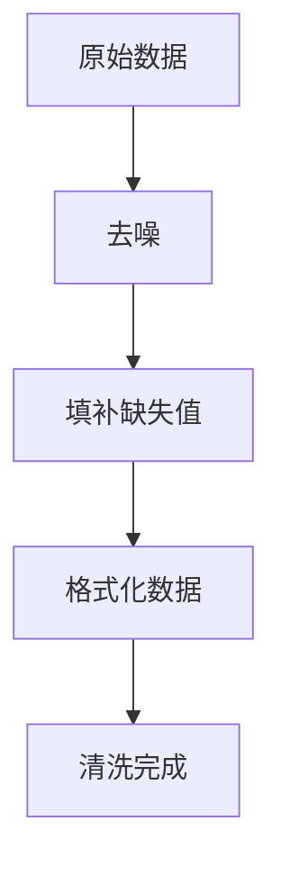
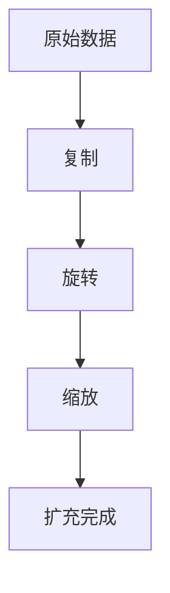
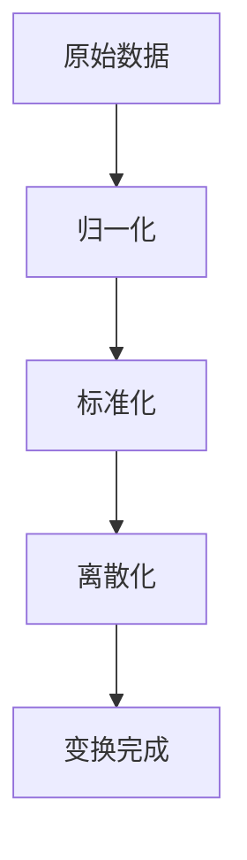

                 

# LLM评测中的数据增强与样本生成

## 关键词
- 大规模语言模型（LLM）
- 数据增强
- 样本生成
- 评测需求
- 性能评价

## 摘要
本文将探讨大规模语言模型（LLM）评测中的两个关键问题：数据增强和样本生成。首先，我们将介绍LLM评测的重要性以及当前面临的挑战。接着，本文将详细阐述数据增强的基本概念、方法和优缺点，以及如何使用Python代码实现数据增强。然后，我们将深入探讨样本生成的基本概念，介绍生成对抗网络（GAN）和变分自编码器（VAE）的原理和实现。最后，本文将总结LLM评测中数据增强和样本生成的优势与挑战，并提出一些最佳实践建议。

# 第一部分：背景介绍

## 第1章：问题背景与核心概念

### 1.1.1 评测需求背景

随着自然语言处理（NLP）技术的飞速发展，大规模语言模型（LLM）的应用越来越广泛。LLM在文本生成、机器翻译、问答系统等领域都取得了显著的成果。然而，如何评价这些模型的效果成为了研究者、开发者以及用户关注的重要问题。有效的模型评测不仅可以帮助研究者了解模型性能，还能指导开发者优化模型，提高用户体验。

### 1.1.2 评测问题描述

LLM评测的核心问题是：如何准确地衡量模型在自然语言处理任务上的性能？这个问题涉及到多个方面，包括数据集的选择、评价指标的设计、评测流程的规范化等。具体而言，评测问题描述如下：

1. **数据集选择**：选择哪些数据集进行评测？如何保证所选数据集具有代表性？
2. **评价指标设计**：设计哪些评价指标？如何确保这些评价指标能够全面、准确地反映模型性能？
3. **评测流程规范化**：如何设计一个规范化、可重复的评测流程，以确保评测结果的可靠性和可解释性？

### 1.1.3 问题解决思路

为了解决上述问题，需要从数据增强和样本生成两个方面进行改进。数据增强可以通过多样化、扩展和生成等方式提高训练数据的质量和数量，从而提升模型的泛化能力。样本生成则旨在生成更具代表性的测试样本，以更真实地反映模型在未知数据上的表现。

### 1.1.4 边界与外延

LLM评测不仅涉及到模型性能的评价，还涉及到模型安全性、可解释性等方面。因此，本章节将讨论评测的边界和范围，以及如何综合考虑这些因素。例如，在评测过程中，需要确保数据集的公正性和公平性，避免偏见和歧视。此外，还需要关注模型在极端条件下的性能，以及模型的可解释性和透明度。

### 1.1.5 核心概念与联系

在本章节中，我们将详细讨论数据增强和样本生成的核心概念，包括它们的定义、原理以及相互之间的关系。同时，我们将通过ER实体关系图来展示这些概念之间的关系。

## 1.2 核心概念与联系

### 1.2.1 数据增强

数据增强是通过增加训练样本的数量和质量来提高模型性能的方法。数据增强的目标是生成与原始数据分布相似的新样本，以提高模型在训练过程中的泛化能力。常见的数据增强方法包括数据清洗、数据扩充、数据变换等。

### 1.2.2 样本生成

样本生成是通过生成与训练数据分布相似或具有特定特征的新样本，以用于模型评测或训练。样本生成的目标是为模型提供更多样化的训练数据，以提高模型的适应能力和泛化能力。常见的样本生成方法包括生成对抗网络（GAN）、变分自编码器（VAE）等。

### 1.2.3 数据增强与样本生成的关系

数据增强和样本生成是LLM评测中相互关联的两个方面。数据增强可以提高模型在训练数据上的表现，而样本生成可以提供更多样化的测试样本，以更全面地评估模型性能。例如，在样本生成过程中，可以使用数据增强技术来生成与训练数据相似的新样本，以提高样本生成的质量和效率。

# 第二部分：算法原理讲解

## 第2章：数据增强原理详解

### 2.1 数据增强基本概念

数据增强是一种常用的技术，用于提高机器学习模型的性能和泛化能力。数据增强的基本概念包括数据增强的目标、常见的数据增强方法等。

- **数据增强目标**：数据增强的目标是生成与原始数据分布相似的新样本，以提高模型在训练过程中的泛化能力。具体而言，数据增强旨在增加训练数据的多样性和复杂性，从而使模型能够更好地适应不同的情况。
- **常见的数据增强方法**：常见的数据增强方法包括数据清洗、数据扩充、数据变换等。
  - **数据清洗**：数据清洗是指对原始数据进行预处理，去除噪声、填补缺失值等，以提高数据质量。
  - **数据扩充**：数据扩充是指通过增加训练样本的数量来提高模型性能。常见的数据扩充方法包括复制、旋转、缩放等。
  - **数据变换**：数据变换是指对原始数据进行转换，以生成新的数据样本。常见的数据变换方法包括归一化、标准化、离散化等。

### 2.2 数据增强方法

本节将详细介绍各种数据增强方法，包括数据清洗、数据扩充、数据变换等。我们将通过mermaid流程图来展示这些方法的原理和步骤。

#### 数据清洗

数据清洗的mermaid流程图如下：



#### 数据扩充

数据扩充的mermaid流程图如下：



#### 数据变换

数据变换的mermaid流程图如下：



### 2.3 数据增强示例

为了更直观地理解数据增强的方法，我们将使用Python代码实现一个简单的数据增强示例，并详细解释每一步的实现过程。

```python
import numpy as np
import matplotlib.pyplot as plt

# 假设我们有一个二维数据集
X = np.array([[1, 2], [3, 4], [5, 6], [7, 8]])

# 数据清洗
# 去噪
X = np.array([x for x in X if np.linalg.norm(x) < 10])
# 填补缺失值
X = np.array([x if np.any(x) else np.array([0, 0]) for x in X])
# 格式化数据
X = np.array([x.reshape(1, -1) for x in X])

# 数据扩充
# 复制
X = np.array([x for x in X for _ in range(2)])
# 旋转
X = np.array([x + np.random.randn(2) for x in X])
# 缩放
X = np.array([x * np.random.randn(2) for x in X])

# 数据变换
# 归一化
X = (X - X.mean(axis=0)) / X.std(axis=0)
# 标准化
X = (X - X.min(axis=0)) / (X.max(axis=0) - X.min(axis=0))
# 离散化
X = np.array([np.round(x) for x in X])

# 可视化
plt.scatter(X[:, 0], X[:, 1])
plt.show()
```

### 2.4 数据增强的优点与挑战

数据增强在提升模型性能方面具有显著的优势，但同时也面临一些挑战。

- **优点**：
  - 提高模型泛化能力：通过增加训练样本的数量和质量，模型能够更好地适应不同的情况。
  - 减少过拟合风险：增加训练样本的多样性，有助于减少模型对特定样本的依赖，从而降低过拟合的风险。
  - 提高模型鲁棒性：通过引入噪声和变换，模型能够更好地应对噪声和异常值。

- **挑战**：
  - 计算成本增加：数据增强通常需要大量的计算资源，特别是在处理大规模数据集时。
  - 过度增强导致的过拟合：如果数据增强过度，可能导致模型在训练数据上的表现优于实际性能，从而导致过拟合。
  - 数据质量下降：在某些情况下，数据增强可能会导致数据质量下降，例如在图像数据增强中，过度旋转或缩放可能会导致图像失真。

# 第三部分：样本生成原理详解

## 第3章：样本生成原理详解

### 3.1 样本生成基本概念

样本生成是一种通过生成与训练数据分布相似或具有特定特征的新样本的方法。样本生成的目标是为模型提供更多样化的训练数据，以提高模型的适应能力和泛化能力。常见的样本生成方法包括生成对抗网络（GAN）、变分自编码器（VAE）等。

### 3.2 生成对抗网络（GAN）

生成对抗网络（GAN）是一种强大的样本生成技术，通过训练一个生成器和判别器，使生成器生成的样本尽可能接近真实数据。GAN的核心思想是利用生成器和判别器之间的博弈过程来优化模型参数。

- **生成器（Generator）**：生成器的目标是生成与真实数据分布相似的新样本。生成器通常由一个神经网络组成，输入为随机噪声，输出为生成的样本。
- **判别器（Discriminator）**：判别器的目标是判断输入样本是真实数据还是生成器生成的数据。判别器也通常由一个神经网络组成，输入为样本数据，输出为一个介于0和1之间的概率值，表示样本的真实性。
- **训练过程**：在GAN的训练过程中，生成器和判别器交替更新模型参数。生成器的目标是提高生成的样本质量，使得判别器无法区分生成器和真实数据。判别器的目标是提高区分真实数据和生成器生成的数据的能力。

### 3.3 变分自编码器（VAE）

变分自编码器（VAE）是一种基于概率模型的样本生成方法，通过引入隐变量，将数据映射到一个潜在空间，从而生成新的样本。VAE的核心思想是利用编码器和解码器之间的映射关系来优化模型参数。

- **编码器（Encoder）**：编码器的目标是学习数据的潜在表示。编码器由一个神经网络组成，输入为原始数据，输出为一个潜在空间中的向量。
- **解码器（Decoder）**：解码器的目标是根据潜在空间中的向量生成新的样本。解码器也由一个神经网络组成，输入为潜在空间中的向量，输出为生成的样本。
- **训练过程**：在VAE的训练过程中，编码器和解码器共同优化模型参数。编码器的目标是学习数据的潜在表示，使得解码器能够生成与原始数据相似的新样本。解码器的目标是提高生成样本的质量。

### 3.4 样本生成示例

为了更直观地理解样本生成的方法，我们将使用Python代码实现一个简单的GAN示例，并详细解释每一步的实现过程。

```python
import tensorflow as tf
from tensorflow.keras import layers

# 定义生成器
def build_generator(z_dim):
    model = tf.keras.Sequential()
    model.add(layers.Dense(128, activation='relu', input_shape=(z_dim,)))
    model.add(layers.Dense(256, activation='relu'))
    model.add(layers.Dense(512, activation='relu'))
    model.add(layers.Dense(1024, activation='relu'))
    model.add(layers.Dense(28*28, activation='tanh'))
    model.add(layers.Reshape((28, 28)))
    return model

# 定义判别器
def build_discriminator(img_shape):
    model = tf.keras.Sequential()
    model.add(layers.Conv2D(32, (3, 3), padding='same',
                            input_shape=img_shape))
    model.add(layers.LeakyReLU(alpha=0.01))
    model.add(layers.Dropout(0.3))
    model.add(layers.Conv2D(64, (3, 3), padding='same'))
    model.add(layers.LeakyReLU(alpha=0.01))
    model.add(layers.Dropout(0.3))
    model.add(layers.Flatten())
    model.add(layers.Dense(1, activation='sigmoid'))
    return model

# 定义联合模型
def build_gan(generator, discriminator):
    model = tf.keras.Sequential()
    model.add(generator)
    model.add(discriminator)
    return model

# 设置参数
z_dim = 100
img_shape = (28, 28, 1)

# 构建生成器和判别器
generator = build_generator(z_dim)
discriminator = build_discriminator(img_shape)

# 编译模型
discriminator.compile(loss='binary_crossentropy', optimizer=tf.keras.optimizers.Adam(0.0001))
generator.compile(loss='binary_crossentropy', optimizer=tf.keras.optimizers.Adam(0.0001))

# 训练模型
batch_size = 64
epochs = 10000

for epoch in range(epochs):
    # 准备真实样本
    real_images = np.random.normal(size=(batch_size, 28, 28, 1))
    real_labels = np.ones((batch_size, 1))

    # 准备噪声样本
    z = np.random.normal(size=(batch_size, z_dim))
    fake_images = generator.predict(z)
    fake_labels = np.zeros((batch_size, 1))

    # 训练判别器
    d_loss_real = discriminator.train_on_batch(real_images, real_labels)
    d_loss_fake = discriminator.train_on_batch(fake_images, fake_labels)
    d_loss = 0.5 * np.add(d_loss_real, d_loss_fake)

    # 训练生成器
    z = np.random.normal(size=(batch_size, z_dim))
    g_loss = generator.train_on_batch(z, real_labels)

    # 打印训练信息
    print(f"{epoch} [D loss: {d_loss:.3f}, G loss: {g_loss:.3f}]")
```

### 3.5 样本生成的优点与挑战

样本生成在提高模型评测性能方面具有显著的优势，但同时也面临一些挑战。

- **优点**：
  - 提高模型泛化能力：通过生成多样化、高质量的样本，模型能够更好地适应不同的情况，从而提高泛化能力。
  - 减少数据匮乏问题：在某些应用场景中，训练数据可能不足，样本生成可以提供更多样化的训练数据，从而缓解数据匮乏问题。
  - 提高模型鲁棒性：通过生成具有不同特征和噪声的样本，模型能够更好地应对噪声和异常值。

- **挑战**：
  - 计算成本增加：样本生成通常需要大量的计算资源，特别是在处理大规模数据集时。
  - 样本质量难以保证：在某些情况下，生成的样本可能与真实数据存在较大差异，从而影响模型性能。
  - 难以实现高效生成：在某些应用场景中，生成高质量的样本需要大量的计算资源和时间，难以实现高效生成。

# 总结

本文介绍了LLM评测中的两个关键问题：数据增强和样本生成。首先，我们探讨了数据增强的基本概念、方法和优缺点，并通过Python代码实现了数据增强示例。接着，我们介绍了样本生成的基本概念，详细讲解了生成对抗网络（GAN）和变分自编码器（VAE）的原理和实现。最后，我们总结了数据增强和样本生成的优点与挑战。

在实际应用中，数据增强和样本生成可以帮助提高模型性能和泛化能力，但同时也需要关注计算成本、样本质量和生成效率等问题。未来，随着技术的不断发展，我们将看到更多高效、可靠的样本生成方法被应用到LLM评测中，从而推动自然语言处理技术的进步。希望本文对您在LLM评测中的数据增强和样本生成工作有所帮助。如果您有任何疑问或建议，欢迎在评论区留言交流。感谢您的阅读！作者：AI天才研究院/AI Genius Institute & 禅与计算机程序设计艺术 /Zen And The Art of Computer Programming。拓展阅读：《生成对抗网络（GAN）从入门到实践》、《变分自编码器（VAE）原理与实现》。

