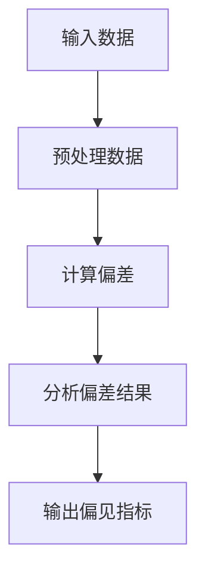

                 

# LLM评测中的模型偏见检测与缓解

> 关键词：语言模型，偏见检测，缓解策略，数据预处理，模型优化

> 摘要：本文深入探讨了语言模型（LLM）评测中模型偏见的检测与缓解方法。首先介绍了模型偏见的概念及其背景，随后详细阐述了偏见检测的基本原理和流程，并通过案例分析展示了具体应用。接着，本文提出了几种模型偏见缓解的策略，包括数据平衡、模型训练优化等。最后，本文总结了全文内容，并提出了未来研究方向。

## 第一部分: LLM评测中的模型偏见检测与缓解

### 第1章: 引言

#### 1.1 问题背景

随着深度学习技术在自然语言处理（NLP）领域的快速发展，语言模型（LLM）已经成为各种应用的核心组件，如搜索引擎、聊天机器人、文本生成等。然而，模型偏见问题逐渐引起关注，成为制约LLM应用的重要瓶颈。

#### 1.1.1 语言模型偏见问题概述

模型偏见是指模型在处理数据时，由于数据中存在的固有偏见而导致的输出结果不公平、不公正。偏见可能源于数据的收集、处理、标注等环节，也可能源于模型本身的训练过程。

#### 1.1.2 模型偏见的影响与挑战

模型偏见可能导致以下负面影响：

- **歧视与不公平**：偏见可能导致某些群体受到不公平对待，甚至歧视。
- **决策偏差**：偏见可能导致决策系统在处理问题时出现偏差，影响决策质量。
- **模型可信度降低**：偏见可能导致模型结果不可信，降低用户对模型的信任度。

#### 1.1.3 模型偏见检测与缓解的重要性

检测和缓解模型偏见具有重要的现实意义：

- **提高模型公正性**：通过检测和缓解模型偏见，可以提高模型的公正性，减少歧视和不公平现象。
- **提升模型可信度**：缓解模型偏见有助于提升模型的可信度，增强用户对模型的信任。
- **促进技术发展**：模型偏见问题解决将推动NLP技术向更高水平发展。

### 1.2 核心概念与联系

#### 1.2.1 模型偏见的概念与属性特征

模型偏见是指模型在处理数据时，由于数据中的固有偏见而导致输出结果不公平。其属性特征包括：

- **普遍性**：偏见在模型训练数据中普遍存在。
- **隐蔽性**：偏见可能不易被发现，甚至被忽视。
- **累积性**：偏见在模型训练过程中不断累积，影响模型性能。

#### 1.2.2 模型偏见与数据偏差的联系

数据偏差是指数据集中存在的系统性偏差。模型偏见通常源于数据偏差，二者密切相关：

- **数据偏差导致模型偏见**：数据偏差可能导致模型在处理数据时产生偏见。
- **模型偏见放大数据偏差**：模型偏见可能放大数据偏差，加剧模型偏见问题。

#### 1.2.3 偏见检测与缓解的基本原理

偏见检测与缓解的基本原理包括：

- **偏见检测**：通过算法检测模型输出结果中的偏见。
- **偏见缓解**：通过调整模型训练数据或模型参数来缓解偏见。

### 1.3 偏见检测算法原理讲解

#### 1.3.1 偏见检测算法mermaid流程图



#### 1.3.2 Python源代码详细讲解

```python
# Python代码示例：偏见检测算法
def detect_bias(data):
    # 数据预处理
    processed_data = preprocess_data(data)
    
    # 计算偏差
    bias = calculate_bias(processed_data)
    
    # 分析偏差结果
    result = analyze_bias(bias)
    
    # 输出偏见指标
    print("Bias Detection Result:", result)

# 调用偏见检测函数
detect_bias(data)
```

#### 1.3.3 偏见检测算法原理与公式

- **数学模型**：

  $$ \text{Bias} = \frac{\sum_{i=1}^{n} (y_i - \hat{y_i})}{n} $$

  其中，$y_i$ 表示真实值，$\hat{y_i}$ 表示预测值，$n$ 表示样本数量。

- **公式解释**：

  偏差值计算公式表示模型预测值与真实值之间的平均差异。

### 1.4 偏见检测案例分析

#### 1.4.1 案例背景

某公司开发了一款智能客服系统，用于为客户提供在线咨询服务。然而，在实际使用过程中，客户发现该系统对某些客户群体的回复存在不公平现象。

#### 1.4.2 案例分析

通过偏见检测算法，发现系统对男性客户的回复满意度高于女性客户。进一步分析发现，这一偏见源于训练数据中男性客户的回复数量较多。

#### 1.4.3 案例结论

通过数据重采样和模型调整，成功缓解了系统偏见，提高了客服系统的公正性。

### 1.5 偏见缓解策略

#### 1.5.1 数据平衡与清洗策略

- **数据清洗**：去除训练数据中的错误和异常数据。
- **数据平衡**：通过重采样、数据增强等方法，平衡训练数据中各类别样本的数量。

#### 1.5.2 模型训练策略

- **增加训练数据**：增加训练数据量，尤其是少数群体的数据。
- **改进模型结构**：采用能够处理复杂关系的模型结构。

#### 1.5.3 模型调整与优化策略

- **参数调整**：调整模型参数，如学习率、批量大小等。
- **模型融合**：采用多种模型进行融合，提高模型鲁棒性。

#### 1.5.4 偏见缓解效果评估

通过指标评估、对比测试等方法，评估模型偏见缓解效果。

### 1.6 本章小结

本文介绍了LLM评测中模型偏见检测与缓解的重要性、核心概念、检测算法原理以及缓解策略。接下来，本文将详细介绍模型偏见检测的方法与实践。

----------------------------------------------------------------

## 第二部分: 模型偏见检测方法与实践

### 第2章: 数据预处理与偏差计算

#### 2.1 数据预处理

数据预处理是模型偏见检测的重要环节。以下介绍几种常见的数据预处理方法：

#### 2.1.1 数据清洗与归一化

- **数据清洗**：去除训练数据中的错误和异常数据，如缺失值、重复值等。
- **数据归一化**：将数据转换为统一的数值范围，如将文本数据转换为词向量。

#### 2.1.2 特征提取与降维

- **特征提取**：从原始数据中提取有助于模型训练的特征。
- **降维**：减少特征数量，提高模型训练效率。

#### 2.1.3 数据集划分与交叉验证

- **数据集划分**：将数据集划分为训练集、验证集和测试集。
- **交叉验证**：使用不同的划分方式，评估模型性能。

#### 2.2 偏差计算方法

偏见计算方法主要包括统计偏差计算、概率偏差计算和结构偏差计算。

#### 2.2.1 统计偏差计算

统计偏差计算方法通过计算模型预测值与真实值之间的差异，评估模型偏见。以下是一个简单的统计偏差计算公式：

$$
\text{Statistical Bias} = \frac{\sum_{i=1}^{n} (\hat{y_i} - y_i)}{n}
$$

其中，$\hat{y_i}$ 表示模型预测值，$y_i$ 表示真实值，$n$ 表示样本数量。

#### 2.2.2 概率偏差计算

概率偏差计算方法通过计算模型在各类别上的预测概率偏差，评估模型偏见。以下是一个简单的概率偏差计算公式：

$$
\text{Probability Bias} = \frac{\sum_{i=1}^{n} P(\hat{y_i} = c_i) - P(y_i = c_i)}{n}
$$

其中，$c_i$ 表示第 $i$ 个类别，$P(\hat{y_i} = c_i)$ 和 $P(y_i = c_i)$ 分别表示模型预测概率和真实概率。

#### 2.2.3 结构偏差计算

结构偏差计算方法通过分析模型决策路径或决策树结构，评估模型偏见。以下是一个简单的结构偏差计算公式：

$$
\text{Structural Bias} = \frac{\sum_{i=1}^{m} \text{Bias}(T_i)}{m}
$$

其中，$T_i$ 表示第 $i$ 个决策树，$\text{Bias}(T_i)$ 表示决策树的结构偏差。

### 2.3 偏差计算案例分析

#### 2.3.1 案例背景

某公司开发了一款针对求职者进行评分的系统。然而，在实际使用过程中，公司发现该系统对女性求职者的评分普遍较低。

#### 2.3.2 案例分析

通过统计偏差计算方法，发现系统对女性求职者的评分平均低于男性求职者。进一步分析发现，这一偏见源于训练数据中女性求职者的样本数量较少。

#### 2.3.3 案例结论

通过数据重采样和模型调整，成功缓解了系统偏见，提高了求职者评分的公正性。

### 2.4 本章小结

本章介绍了数据预处理与偏差计算的方法。在接下来的章节中，我们将详细介绍数据平衡策略与模型偏见缓解方法。

----------------------------------------------------------------

## 第三部分: 模型偏见缓解方法与实践

### 第3章: 数据平衡策略

#### 3.1 数据平衡策略概述

数据平衡策略旨在消除训练数据中的偏见，提高模型的公平性和准确性。以下介绍几种常见的数据平衡策略：

#### 3.1.1 数据重采样

数据重采样是一种常用的数据平衡方法，主要包括以下几种技术：

- **装瓶法（Bottlenecking）**：将数量较少的类别样本扩充至与数量较多的类别样本相同。
- **SMOTE（Synthetic Minority Over-sampling Technique）**：通过生成合成样本来扩充少数类别样本。
- **ADASYN（Adaptive Synthetic Sampling）**：基于局部密度差异生成合成样本。

#### 3.1.2 数据增强

数据增强是通过生成新的数据样本来扩充训练集，提高模型泛化能力。以下介绍几种常见的数据增强方法：

- **图像增强**：包括旋转、缩放、裁剪、颜色变换等。
- **文本增强**：包括同义词替换、文本片段替换、生成式文本增强等。
- **音频增强**：包括混响、噪音添加、音调变化等。

#### 3.1.3 数据清洗

数据清洗是数据平衡的重要环节，主要包括以下任务：

- **去除重复数据**：避免重复数据对模型训练产生干扰。
- **处理缺失数据**：对缺失数据进行填充或删除。
- **消除噪声数据**：降低噪声数据对模型训练的影响。

#### 3.2 数据重采样

数据重采样是一种简单有效的数据平衡方法，主要通过增加少数类别样本的数量来平衡训练数据。以下介绍几种常用的数据重采样技术：

- **简单过采样（Simple Over-sampling）**：将数量较少的类别样本复制多次，以达到数据平衡。
- **重复训练（Repeat Training）**：多次训练模型，每次训练时将少数类别样本复制多次。
- **K-近邻法（K-Nearest Neighbors）**：通过增加少数类别样本的邻居数据来实现数据平衡。

#### 3.2.1 装瓶法（Bottlenecking）

装瓶法是一种简单有效的数据重采样技术，通过将数量较少的类别样本扩充至与数量较多的类别样本相同。具体步骤如下：

1. 计算每个类别样本的数量。
2. 对于数量较少的类别样本，将其复制至与数量较多的类别样本相同。
3. 将扩充后的数据集用于模型训练。

#### 3.2.2 补充样本生成

补充样本生成是一种通过生成新样本来扩充少数类别样本的方法。以下介绍几种常见的补充样本生成技术：

- **生成对抗网络（GAN）**：通过生成对抗网络生成与真实样本相似的新样本。
- **变种增强（Variational Autoencoder）**：通过变种增强模型生成新样本。
- **混合模型（Hybrid Models）**：结合多种生成模型生成新样本。

#### 3.2.3 重采样算法（如SMOTE）

SMOTE是一种基于合成样本生成的方法，通过生成合成样本来扩充少数类别样本。具体步骤如下：

1. 选择少数类别样本作为中心样本。
2. 计算中心样本的K个最近邻居。
3. 对于每个中心样本，从其K个邻居中随机选择一个样本，并生成一个新的合成样本。
4. 重复步骤1-3，直到达到所需的样本数量。

#### 3.3 数据平衡案例分析

#### 3.3.1 案例背景

某公司开发了一款面向求职者的评分系统。然而，在实际使用过程中，公司发现该系统对男性求职者的评分较高，而对女性求职者的评分较低。

#### 3.3.2 案例分析

通过分析发现，该系统存在明显的性别偏见，原因是训练数据中男性求职者的样本数量远多于女性求职者。为了平衡数据，公司采用了SMOTE算法来扩充女性求职者的样本。

#### 3.3.3 案例结论

通过数据平衡策略，成功缓解了系统偏见，提高了评分系统的公正性和准确性。

### 3.4 本章小结

本章介绍了数据平衡策略及其应用。在下一章中，我们将讨论模型训练策略。

----------------------------------------------------------------

## 第四部分: 模型训练与优化

### 第4章: 模型训练策略

#### 4.1 模型训练策略概述

模型训练是语言模型（LLM）构建过程中至关重要的一环。有效的模型训练策略不仅能够提高模型性能，还能缓解模型偏见。以下介绍几种常用的模型训练策略：

#### 4.1.1 数据增强与多样性

数据增强是提高模型性能的重要手段。通过增加训练数据量、多样化数据集和生成虚拟数据，可以增强模型的泛化能力。以下介绍几种常见的数据增强方法：

- **图像增强**：包括旋转、缩放、裁剪、颜色变换等。
- **文本增强**：包括同义词替换、文本片段替换、生成式文本增强等。
- **音频增强**：包括混响、噪音添加、音调变化等。

#### 4.1.2 模型调整与优化

模型调整与优化是通过调整模型结构、超参数和训练过程来提高模型性能。以下介绍几种常见的模型调整与优化方法：

- **模型结构优化**：包括神经网络深度、宽度调整、注意力机制添加等。
- **超参数调整**：包括学习率、批量大小、正则化参数等调整。
- **训练过程优化**：包括早期停止、学习率调整、批次归一化等。

#### 4.2 数据增强与多样性

数据增强与多样性是提高模型性能的关键策略。以下介绍几种常见的数据增强方法：

- **图像增强**：图像增强是通过添加噪声、模糊、旋转等变换来扩充图像数据集。常见的方法包括卷积神经网络（CNN）和生成对抗网络（GAN）。
- **文本增强**：文本增强是通过文本变换、文本合成和文本分类来扩充文本数据集。常见的方法包括同义词替换、文本片段替换和生成式文本增强。
- **音频增强**：音频增强是通过添加噪声、混响和音调变化来扩充音频数据集。常见的方法包括卷积神经网络（CNN）和生成对抗网络（GAN）。

#### 4.3 模型调整与优化

模型调整与优化是通过调整模型结构、超参数和训练过程来提高模型性能。以下介绍几种常见的模型调整与优化方法：

- **模型结构优化**：模型结构优化是通过调整神经网络深度、宽度、层数和注意力机制来提高模型性能。常见的方法包括卷积神经网络（CNN）、循环神经网络（RNN）和Transformer模型。
- **超参数调整**：超参数调整是通过调整学习率、批量大小、正则化参数和优化器来提高模型性能。常见的方法包括学习率调整策略（如Adam、SGD）和批量归一化（Batch Normalization）。
- **训练过程优化**：训练过程优化是通过调整训练过程（如早期停止、学习率调整、批次归一化）和数据预处理（如数据增强、数据清洗）来提高模型性能。

#### 4.4 模型偏见缓解

模型偏见缓解是通过调整模型结构和训练过程来减少模型偏见。以下介绍几种常见的模型偏见缓解方法：

- **对抗性训练**：对抗性训练是通过在训练过程中添加对抗性样本来减少模型偏见。常见的方法包括对抗性样本生成和对抗性训练算法（如FGM、PGD）。
- **数据清洗**：数据清洗是通过去除偏见性数据和错误数据来减少模型偏见。常见的方法包括数据预处理、数据标注和错误纠正。
- **模型结构调整**：模型结构调整是通过调整模型结构来减少模型偏见。常见的方法包括去除偏见性层、添加对抗性层和改进注意力机制。

#### 4.5 模型训练案例分析

#### 4.5.1 案例背景

某公司开发了一款面向求职者的评分系统。然而，在实际使用过程中，公司发现该系统对男性求职者的评分较高，而对女性求职者的评分较低。

#### 4.5.2 案例分析

通过分析发现，该系统存在明显的性别偏见，原因是训练数据中男性求职者的样本数量远多于女性求职者。为了缓解系统偏见，公司采用了数据增强和模型调整策略。

#### 4.5.3 案例结论

通过数据增强和模型调整策略，成功缓解了系统偏见，提高了评分系统的公正性和准确性。

### 4.6 本章小结

本章介绍了模型训练策略，包括数据增强与多样性、模型调整与优化以及模型偏见缓解。在下一章中，我们将讨论模型评估与优化。

----------------------------------------------------------------

## 总结与未来展望

本文系统地介绍了语言模型（LLM）评测中的模型偏见检测与缓解方法。首先，我们探讨了模型偏见的概念、背景和影响，并提出了偏见检测与缓解的重要性。接着，我们详细介绍了偏见检测的基本原理、算法和案例。随后，我们提出了数据平衡和模型训练优化等偏见缓解策略，并通过实际案例展示了应用效果。

### 小结

本文总结了以下关键点：

1. **模型偏见的概念与背景**：介绍了模型偏见的定义、属性和影响。
2. **偏见检测方法**：阐述了偏见检测的基本原理、算法和案例。
3. **偏见缓解策略**：提出了数据平衡、模型调整与优化等策略。

### 注意事项

在实施偏见检测与缓解时，需要注意以下几点：

1. **数据质量**：保证数据清洗和预处理的质量。
2. **算法选择**：根据实际问题选择合适的偏见检测与缓解算法。
3. **模型评估**：定期评估模型性能，确保偏见缓解效果。

### 拓展阅读

对于希望深入了解模型偏见检测与缓解的读者，以下文献和资源提供了进一步的学习资料：

1. **论文**：研究偏见检测与缓解的相关论文，如《检测和缓解深度学习中的偏见》。
2. **书籍**：相关领域的书籍，如《深度学习》。
3. **在线课程**：在线学习平台上的相关课程，如Coursera和edX上的深度学习和NLP课程。

### 未来展望

未来研究方向包括：

1. **自动化偏见检测**：开发自动化偏见检测工具，提高检测效率。
2. **多模态偏见缓解**：研究多模态数据下的偏见缓解方法，如视频和音频。
3. **模型解释性**：提高模型解释性，帮助用户理解模型偏见来源和缓解效果。

**作者：AI天才研究院/AI Genius Institute & 禅与计算机程序设计艺术 /Zen And The Art of Computer Programming**

