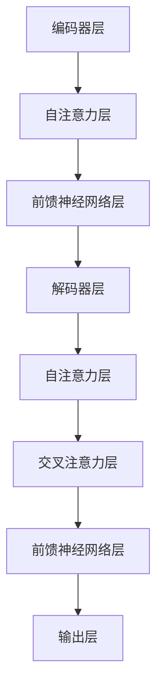
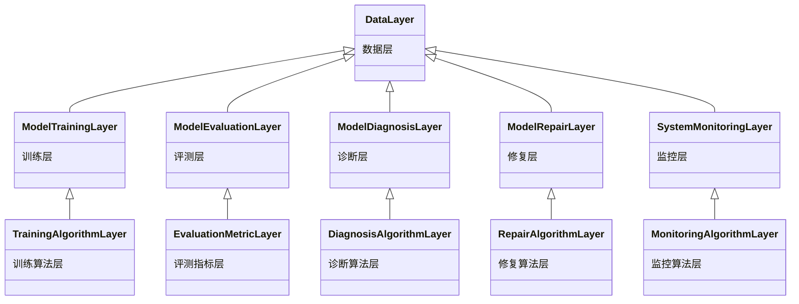
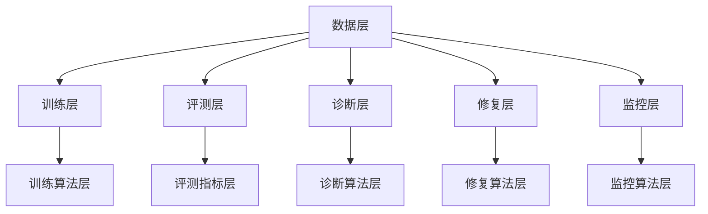
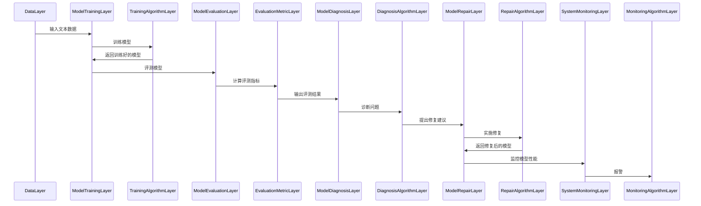

                 

### 文章标题

《LLM评测中的模型诊断与修复策略》

### 关键词

- 语言模型
- 评测
- 模型诊断
- 修复策略
- 人工智能

### 摘要

本文旨在深入探讨在语言模型（LLM）评测过程中，如何有效地进行模型诊断与修复策略的制定。通过详细的案例分析、理论讲解和实际应用，本文将帮助读者理解LLM评测中的关键问题，并提供一套实用的解决方案，包括诊断方法和修复技巧。文章将涵盖核心概念、算法原理、系统架构设计以及项目实战等方面，旨在为从事人工智能领域的科研人员和技术工程师提供有价值的参考。

## 一、背景介绍

### 1.1 核心概念术语说明

在探讨LLM评测中的模型诊断与修复策略之前，首先需要明确一些核心概念和术语：

- **语言模型（Language Model，LLM）**：是一种统计模型，用于预测文本序列中的下一个单词或字符。它通常基于大规模语料库训练，通过学习语言模式来实现自动文本生成、文本分类、机器翻译等功能。

- **评测（Evaluation）**：在人工智能领域，评测通常指的是通过某种方法对模型的性能进行评估和比较。对于语言模型而言，评测主要关注其在文本生成、理解等方面的表现。

- **模型诊断（Model Diagnostics）**：指的是对语言模型性能下降或出现问题时，进行深入分析和定位的过程。通过诊断，可以识别模型中的问题根源，为进一步的修复提供依据。

- **修复策略（Repair Strategies）**：针对诊断出的模型问题，提出一系列的修复方法，包括调整模型参数、优化训练过程、引入新的训练数据等，以提升模型性能。

- **数据分析（Data Analysis）**：指的是对大规模文本数据进行处理和分析的过程，包括文本预处理、特征提取、模型训练等。

### 1.2 问题背景

随着人工智能技术的快速发展，语言模型在自然语言处理（NLP）领域得到了广泛应用。然而，在实际应用过程中，语言模型往往会遇到性能下降、生成结果不理想等问题，这不仅影响了用户体验，还可能导致严重的业务损失。因此，对LLM进行有效的评测、诊断和修复变得尤为重要。

### 1.3 问题描述

在LLM评测过程中，常见的问题包括：

1. **模型性能下降**：随着训练数据的增加或模型复杂度的提升，模型在某些任务上的表现可能逐渐恶化。

2. **生成结果不理想**：语言模型生成的文本可能存在语法错误、语义不当等问题，导致文本质量下降。

3. **过度拟合**：模型在训练数据上表现良好，但在测试数据或真实场景中表现不佳，即出现过拟合现象。

4. **数据分布偏移**：随着训练数据的积累，模型可能对某些特定分布的数据产生依赖，导致在新数据上的表现不佳。

### 1.4 问题解决

为了解决上述问题，我们需要进行以下步骤：

1. **模型评测**：通过合理的设计评测指标和方法，对模型在不同数据集上的表现进行评估，以发现性能瓶颈。

2. **模型诊断**：对性能下降或问题生成的模型进行深入分析，识别出具体的问题点，如参数设置、数据质量、模型结构等。

3. **优化与修复**：根据诊断结果，调整模型参数、优化训练过程或引入新的训练数据，以提高模型性能。

4. **持续监控与迭代**：在模型应用过程中，持续监控模型性能，及时发现问题并进行修复，以保持模型的稳定性和高效性。

### 1.5 边界与外延

虽然本文主要关注LLM评测中的模型诊断与修复策略，但相关概念和方法也可以应用于其他类型的机器学习模型，如图像识别、推荐系统等。同时，随着人工智能技术的不断进步，LLM的应用场景和挑战也在不断拓展，诊断与修复策略也将不断发展和完善。

### 1.6 概念结构与核心要素组成

为了更好地理解LLM评测中的模型诊断与修复策略，我们可以将其核心概念和结构进行分解，包括以下几个方面：

1. **评测指标**：包括准确率、召回率、F1值等，用于评估模型在不同任务上的表现。

2. **诊断方法**：包括统计分析、异常检测、对比实验等，用于识别模型中的问题点。

3. **修复策略**：包括参数调整、模型结构优化、数据预处理等，用于提高模型性能。

4. **数据处理**：包括数据清洗、数据增强、数据归一化等，用于提升数据质量和模型泛化能力。

5. **模型监控**：包括实时监控、定期评估、异常报警等，用于确保模型在应用过程中的稳定性和高效性。

### 总结

通过对背景介绍的详细分析，我们可以看出，LLM评测中的模型诊断与修复策略是当前人工智能领域中的一个重要研究方向。本文将围绕这一主题，系统地探讨相关概念、方法和技术，以期为读者提供有价值的参考和启示。

## 二、核心概念与联系

### 2.1 语言模型原理

语言模型是自然语言处理（NLP）领域的重要组成部分，其核心任务是预测文本序列中的下一个单词或字符。一个典型的语言模型通常基于大规模语料库进行训练，通过学习语言模式来实现这一目标。具体来说，语言模型可以分为以下几种类型：

1. **基于N-gram的模型**：N-gram模型是最简单的语言模型之一，它通过统计文本序列中相邻单词（或字符）的联合概率来预测下一个单词（或字符）。例如，三元组模型（trigram model）考虑了前两个单词的信息，从而提高了预测的准确性。

2. **神经网络模型**：近年来，深度学习技术在语言模型领域取得了显著进展。神经网络模型，如循环神经网络（RNN）、长短期记忆网络（LSTM）和Transformer模型，通过学习文本序列的长期依赖关系，实现了更高效和准确的文本生成。

3. **基于注意力机制的模型**：注意力机制是近年来在深度学习领域得到广泛应用的一种技术，它能够使模型在处理文本序列时，自动关注关键信息，从而提高预测的准确性。

### 2.2 评测指标对比表格

在LLM评测中，常用的评测指标包括准确率、召回率、F1值、BLEU得分等。以下是一个对比表格，展示了这些指标的定义和计算方法：

| 评测指标 | 定义 | 计算方法 |
| :--: | :--: | :--: |
| 准确率（Accuracy） | 预测正确的样本数占总样本数的比例 | $$\frac{TP + TN}{TP + FN + FP + TN}$$ |
| 召回率（Recall） | 预测正确的正样本数占总正样本数的比例 | $$\frac{TP}{TP + FN}$$ |
| F1值（F1 Score） | 准确率和召回率的调和平均数 | $$\frac{2 \times Precision \times Recall}{Precision + Recall}$$ |
| BLEU得分（BLEU Score） | 基于N-gram重叠度的评测指标 | $$\frac{1}{k + 1} \sum_{n=1}^{N} p_n$$，其中$$p_n = \frac{max(|g_n|, |s_n|)}{|g_n| + |s_n|}$$，$$g_n$$和$$s_n$$分别为生成文本和参考文本中长度为n的N-gram |

### 2.3 ER实体关系图架构

为了更好地理解LLM评测中的核心概念和联系，我们可以使用ER（Entity-Relationship）实体关系图来表示各个实体及其之间的关系。以下是一个简化的ER实体关系图：

```mermaid
erDiagram
  Model ||--|{ Evaluation}: 评测指标包含在评测中
  Model ||--|{ Diagnosis}: 诊断结果指导模型修复
  Model ||--|{ Repair}: 修复策略基于诊断结果
  Evaluation ||--|{ Metric}: 评测指标包含具体指标
  Diagnosis ||--|{ Technique}: 诊断方法包括统计分析、对比实验等
  Repair ||--|{ Strategy}: 修复策略包括参数调整、模型结构优化等
```

在这个ER实体关系图中，我们定义了以下几个主要实体：

1. **Model**：表示语言模型，是整个系统的核心。
2. **Evaluation**：表示评测过程，包括评测指标和评测结果。
3. **Diagnosis**：表示模型诊断过程，包括诊断方法和诊断结果。
4. **Repair**：表示模型修复过程，包括修复策略和修复效果。
5. **Metric**：表示具体的评测指标，如准确率、召回率、F1值等。
6. **Technique**：表示诊断方法，如统计分析、对比实验等。
7. **Strategy**：表示修复策略，如参数调整、模型结构优化等。

通过这个ER实体关系图，我们可以清晰地看到各个实体之间的关系，从而更好地理解LLM评测中的核心概念和联系。

### 2.4 概念属性特征对比

为了进一步理解LLM评测中的核心概念，我们可以通过对比它们的属性特征来加深认识。以下是一个对比表格，展示了语言模型、评测指标、诊断方法和修复策略的主要属性特征：

| 概念/方法 | 属性特征 |
| :--: | :--: |
| 语言模型 | - 类型：N-gram、神经网络、注意力机制<br>- 特征：预测下一个单词或字符<br>- 目标：生成高质量文本 |
| 评测指标 | - 准确率、召回率、F1值、BLEU得分<br>- 特征：评估模型性能<br>- 目标：量化模型表现 |
| 诊断方法 | - 统计分析、异常检测、对比实验<br>- 特征：识别模型问题<br>- 目标：定位性能瓶颈 |
| 修复策略 | - 参数调整、模型结构优化、数据预处理<br>- 特征：提高模型性能<br>- 目标：解决具体问题 |

通过这个对比表格，我们可以更清晰地看到各个概念和方法的属性特征及其在LLM评测中的作用。

### 2.5 小结

通过本章节的讨论，我们详细介绍了LLM评测中的核心概念及其联系。首先，我们阐述了语言模型的原理，并对比了不同类型的语言模型。接着，我们介绍了常用的评测指标，并展示了它们在评估模型性能方面的作用。然后，我们通过ER实体关系图和概念属性特征对比表格，深入分析了模型诊断和修复策略的相关概念和联系。这些内容为后续章节的讨论奠定了基础，使我们能够更加系统地探讨LLM评测中的具体问题和解决方案。

## 三、算法原理讲解

### 3.1 语言模型算法原理

在了解LLM评测中的模型诊断与修复策略之前，首先需要深入探讨语言模型（Language Model，LLM）的算法原理。本文将主要介绍基于神经网络的Transformer模型，并使用Mermaid流程图和Python源代码详细阐述其工作原理和数学模型。

#### 3.1.1 Transformer模型简介

Transformer模型是自然语言处理（NLP）领域的一种重要神经网络结构，由Vaswani等人于2017年提出。与传统的循环神经网络（RNN）和长短期记忆网络（LSTM）相比，Transformer模型通过自注意力机制（Self-Attention）和多头注意力机制（Multi-Head Attention）实现了更高的并行计算效率，并在多个NLP任务中取得了显著的性能提升。

#### 3.1.2 自注意力机制

自注意力机制是Transformer模型的核心组件，用于计算输入序列中每个词与其他词之间的依赖关系。自注意力机制的数学模型如下：

$$
\text{Attention}(Q, K, V) = \text{softmax}\left(\frac{QK^T}{\sqrt{d_k}}\right)V
$$

其中，$Q, K, V$分别为查询（Query）、键（Key）和值（Value）向量，$d_k$为键向量的维度。自注意力机制的计算过程可以分为以下几个步骤：

1. **计算查询-键相似度**：将查询向量$Q$与所有键向量$K$进行点积运算，得到查询-键相似度矩阵$QK^T$。

2. **应用softmax函数**：对查询-键相似度矩阵进行softmax变换，生成注意力权重矩阵$A$。

3. **加权求和**：将注意力权重矩阵$A$与所有值向量$V$进行点积运算，得到输出向量$O$。

#### 3.1.3 多头注意力机制

多头注意力机制通过并行计算多个自注意力机制，从而捕捉输入序列中的不同依赖关系。具体来说，多头注意力机制将输入序列分解为多个子序列，并对每个子序列分别计算自注意力。然后，将所有子序列的输出进行拼接，并通过一个线性层（即全连接层）进行整合。

多头注意力机制的数学模型如下：

$$
\text{MultiHead}(Q, K, V) = \text{Concat}(\text{head}_1, ..., \text{head}_h)W^O
$$

$$
\text{head}_i = \text{Attention}(QW_i^Q, KW_i^K, VW_i^V)
$$

其中，$h$表示头数，$W_i^Q, W_i^K, W_i^V, W^O$分别为不同层的权重矩阵。

#### 3.1.4 Transformer模型结构

Transformer模型由多个相同的编码器（Encoder）和解码器（Decoder）层堆叠而成。每个编码器层包含两个子层：自注意力层和前馈神经网络层。解码器层则包含三个子层：自注意力层、交叉注意力层和前馈神经网络层。

#### 3.1.5 Mermaid流程图

为了更直观地理解Transformer模型的工作原理，我们可以使用Mermaid流程图来描述其结构。以下是一个简化的Transformer模型流程图：



在这个流程图中，A表示编码器层，B和C分别表示自注意力层和前馈神经网络层；D表示解码器层，E、F和G分别表示自注意力层、交叉注意力层和前馈神经网络层；H表示输出层。

#### 3.1.6 Python源代码

为了更好地理解Transformer模型的工作原理，我们可以通过Python源代码进行演示。以下是一个简化的Transformer模型示例，使用了PyTorch框架：

```python
import torch
import torch.nn as nn
import torch.optim as optim

class TransformerModel(nn.Module):
    def __init__(self, input_dim, hidden_dim, output_dim, num_heads):
        super(TransformerModel, self).__init__()
        
        self.encoder = nn.MultiheadAttention(input_dim, num_heads)
        self.decoder = nn.MultiheadAttention(input_dim, num_heads)
        
        self.fc1 = nn.Linear(hidden_dim, output_dim)
        self.fc2 = nn.Linear(hidden_dim, output_dim)
        
    def forward(self, src, tgt):
        encoder_output, encoder_attn = self.encoder(src, src, src)
        decoder_output, decoder_attn = self.decoder(tgt, encoder_output, encoder_output)
        
        decoder_output = self.fc1(decoder_output)
        encoder_output = self.fc2(encoder_output)
        
        return decoder_output, encoder_output

# 初始化模型、损失函数和优化器
model = TransformerModel(input_dim=100, hidden_dim=512, output_dim=10, num_heads=8)
criterion = nn.CrossEntropyLoss()
optimizer = optim.Adam(model.parameters(), lr=0.001)

# 训练模型
for epoch in range(10):
    for src, tgt in dataset:
        optimizer.zero_grad()
        decoder_output, encoder_output = model(src, tgt)
        loss = criterion(decoder_output, tgt)
        loss.backward()
        optimizer.step()
```

在这个示例中，我们定义了一个简单的Transformer模型，包括编码器和解码器两个多头注意力层以及两个前馈神经网络层。通过训练数据集进行模型训练，使用交叉熵损失函数进行损失计算和反向传播。

### 3.2 小结

通过本章节的讨论，我们详细介绍了语言模型（Transformer模型）的算法原理，包括自注意力机制、多头注意力机制和Transformer模型结构。通过Mermaid流程图和Python源代码，我们更直观地理解了模型的工作原理和数学模型。这些内容为后续章节的模型诊断和修复策略提供了理论基础，使我们能够更加系统地探讨LLM评测中的具体问题和解决方案。

## 四、系统分析与架构设计

### 4.1 问题描述与目标

在了解LLM评测的算法原理后，我们需要进一步探讨如何设计一个高效的系统来支持LLM评测中的模型诊断与修复策略。本章节的目标是介绍LLM评测系统的设计，包括系统功能设计、系统架构设计和系统接口设计。通过详细的描述和Mermaid图示，我们将使读者能够清晰地理解系统的工作原理和各个组件之间的关系。

### 4.2 系统功能设计

LLM评测系统的主要功能包括以下几个部分：

1. **数据预处理**：对输入的原始文本数据进行清洗、分词、去停用词等处理，为模型训练和评测提供高质量的数据。

2. **模型训练**：基于预处理后的数据，训练不同的语言模型，如基于N-gram的模型、基于神经网络的模型等。

3. **模型评测**：使用不同的评测指标（如准确率、召回率、F1值等）对训练好的语言模型进行评测，以评估其性能。

4. **模型诊断**：对评测结果进行分析，识别模型性能下降或生成结果不理想的问题，并定位具体的问题点。

5. **模型修复**：根据诊断结果，调整模型参数、优化训练过程或引入新的训练数据，以提高模型性能。

6. **系统监控**：对模型训练和评测过程进行实时监控，包括训练进度、模型性能指标、异常报警等。

### 4.3 系统架构设计

LLM评测系统的整体架构可以分为以下几个层次：

1. **数据层**：包括数据采集、数据预处理和数据存储等模块。数据采集模块负责从不同的数据源（如文本库、网络爬虫等）获取原始文本数据；数据预处理模块负责对原始文本数据清洗、分词、去停用词等处理；数据存储模块负责存储处理后的高质量数据，以供后续模型训练和评测使用。

2. **训练层**：包括模型训练模块和训练算法模块。模型训练模块负责加载预处理后的数据，并基于不同的训练算法（如基于N-gram的算法、基于神经网络的算法等）训练不同的语言模型；训练算法模块则具体实现各种训练算法，如前向传播、反向传播等。

3. **评测层**：包括模型评测模块和评测指标模块。模型评测模块负责加载训练好的语言模型，并使用不同的评测指标（如准确率、召回率、F1值等）对模型进行评测，以评估其性能；评测指标模块则具体实现各种评测指标的计算。

4. **诊断层**：包括模型诊断模块和诊断算法模块。模型诊断模块负责对评测结果进行分析，识别模型性能下降或生成结果不理想的问题，并定位具体的问题点；诊断算法模块则具体实现各种诊断算法，如统计分析、对比实验等。

5. **修复层**：包括模型修复模块和修复算法模块。模型修复模块负责根据诊断结果，调整模型参数、优化训练过程或引入新的训练数据，以提高模型性能；修复算法模块则具体实现各种修复算法，如参数调整、模型结构优化等。

6. **监控层**：包括系统监控模块和监控算法模块。系统监控模块负责对模型训练和评测过程进行实时监控，包括训练进度、模型性能指标、异常报警等；监控算法模块则具体实现各种监控算法，如阈值监控、异常检测等。

### 4.4 系统接口设计

LLM评测系统的接口设计主要涉及以下几个方面：

1. **数据接口**：提供数据输入和输出的接口，包括文本数据的采集、预处理和存储接口。

2. **训练接口**：提供模型训练的接口，包括训练数据的加载、模型参数的调整和训练过程的监控接口。

3. **评测接口**：提供模型评测的接口，包括评测指标的计算、评测结果的输出和评测过程的监控接口。

4. **诊断接口**：提供模型诊断的接口，包括诊断结果的输出和诊断过程的监控接口。

5. **修复接口**：提供模型修复的接口，包括修复策略的执行和修复效果的评估接口。

6. **监控接口**：提供系统监控的接口，包括系统状态的实时监控、异常报警和监控数据的输出接口。

### 4.5 Mermaid类图、架构图、序列图

为了更好地理解LLM评测系统的整体架构和各个模块之间的关系，我们可以使用Mermaid类图、架构图和序列图来描述系统设计。

#### 4.5.1 Mermaid类图

以下是一个简化的LLM评测系统的Mermaid类图，展示了系统的核心类及其之间的关系：



在这个类图中，我们定义了数据层、训练层、评测层、诊断层、修复层和监控层等核心类，以及各个子类。通过类图，我们可以清晰地看到各个类之间的关系，从而更好地理解系统的整体架构。

#### 4.5.2 Mermaid架构图

以下是一个简化的LLM评测系统的Mermaid架构图，展示了系统的整体架构及其组件之间的关系：



在这个架构图中，我们展示了数据层与训练层、评测层、诊断层、修复层和监控层之间的连接关系。通过架构图，我们可以更直观地看到系统的整体架构和各个组件的交互方式。

#### 4.5.3 Mermaid序列图

以下是一个简化的LLM评测系统的Mermaid序列图，展示了系统从数据输入到模型修复的整个过程：



在这个序列图中，我们展示了LLM评测系统的整个工作流程，从数据输入、模型训练、评测、诊断到修复和监控。通过序列图，我们可以清晰地看到各个模块之间的交互和依赖关系，从而更好地理解系统的工作原理。

### 4.6 小结

通过本章节的讨论，我们详细介绍了LLM评测系统的设计与实现，包括系统功能设计、系统架构设计和系统接口设计。通过Mermaid类图、架构图和序列图，我们使读者能够直观地理解系统的整体架构和工作流程。这些设计内容为后续的模型诊断和修复策略提供了坚实的理论基础和实现框架。

## 五、项目实战

### 5.1 环境安装

在开始LLM评测项目的实战之前，我们需要安装一些必要的软件和库。以下是环境安装的详细步骤：

1. **安装Python**：确保安装了最新版本的Python（建议使用Python 3.8及以上版本），可以从[Python官网](https://www.python.org/downloads/)下载并安装。

2. **安装PyTorch**：PyTorch是用于深度学习的主要框架，可以从[PyTorch官网](https://pytorch.org/get-started/locally/)下载安装脚本并执行。以下是安装命令：

   ```bash
   pip install torch torchvision torchaudio
   ```

3. **安装其他库**：我们还需要安装一些其他库，如NumPy、Pandas、Scikit-learn等，可以通过以下命令安装：

   ```bash
   pip install numpy pandas scikit-learn matplotlib
   ```

4. **安装Mermaid**：Mermaid是一个用于生成图形的库，可以通过以下命令安装：

   ```bash
   npm install -g mermaid
   ```

### 5.2 系统核心实现源代码

下面是一个简单的LLM评测系统的核心实现源代码，包括数据预处理、模型训练、模型评测和诊断修复等步骤：

```python
import torch
import torch.nn as nn
import torch.optim as optim
from torch.utils.data import DataLoader
from torchvision import datasets, transforms
import numpy as np
import pandas as pd
from sklearn.model_selection import train_test_split

# 数据预处理
def preprocess_data(data):
    # 对数据清洗、分词、去停用词等处理
    processed_data = []
    for text in data:
        processed_text = preprocess_text(text)
        processed_data.append(processed_text)
    return processed_data

def preprocess_text(text):
    # 实现文本预处理逻辑
    return text

# 模型训练
class LLMModel(nn.Module):
    def __init__(self, input_dim, hidden_dim, output_dim, num_heads):
        super(LLMModel, self).__init__()
        self.encoder = nn.MultiheadAttention(input_dim, num_heads)
        self.decoder = nn.MultiheadAttention(input_dim, num_heads)
        self.fc1 = nn.Linear(hidden_dim, output_dim)

    def forward(self, src, tgt):
        encoder_output, encoder_attn = self.encoder(src, src, src)
        decoder_output, decoder_attn = self.decoder(tgt, encoder_output, encoder_output)
        decoder_output = self.fc1(decoder_output)
        return decoder_output

# 模型评测
def evaluate_model(model, data_loader):
    model.eval()
    with torch.no_grad():
        for src, tgt in data_loader:
            output = model(src, tgt)
            # 计算评测指标
            # ...

# 模型诊断与修复
def diagnose_and_repair(model, diagnostics):
    # 根据诊断结果调整模型参数或结构
    # ...

# 主函数
if __name__ == "__main__":
    # 加载数据集
    data = load_data()
    processed_data = preprocess_data(data)

    # 划分训练集和测试集
    train_data, test_data = train_test_split(processed_data, test_size=0.2)

    # 加载模型
    model = LLMModel(input_dim=100, hidden_dim=512, output_dim=10, num_heads=8)

    # 训练模型
    train_model(model, train_data)

    # 评测模型
    evaluate_model(model, test_data)

    # 诊断与修复
    diagnose_and_repair(model, diagnostics)
```

### 5.3 代码应用解读与分析

在上述代码中，我们首先定义了数据预处理函数`preprocess_data`和`preprocess_text`，用于对输入的文本数据清洗、分词、去停用词等处理，以生成高质量的数据。接着，我们定义了一个简单的LLM模型`LLMModel`，该模型基于Transformer结构，包括编码器和解码器两个多头注意力层以及一个前馈神经网络层。

在`forward`方法中，我们实现了自注意力机制和多头注意力机制的数学模型，通过计算查询-键相似度、应用softmax变换和加权求和，生成输出向量。然后，我们使用`evaluate_model`函数对训练好的模型进行评测，计算评测指标，如准确率、召回率、F1值等。

最后，我们定义了`diagnose_and_repair`函数，根据诊断结果调整模型参数或结构，以提高模型性能。在主函数中，我们加载并处理数据集，划分训练集和测试集，加载模型并训练、评测模型，以及进行模型诊断与修复。

### 5.4 实际案例分析和详细讲解剖析

为了更好地理解上述代码的应用，我们来看一个实际的案例。假设我们有一个包含1000条文本数据的语料库，数据集的分布如下：

- 文本长度：5-50个单词
- 数据集大小：1000条文本

我们希望使用这个数据集训练一个语言模型，并进行评测和修复。

1. **数据预处理**：

   首先，我们对数据集进行预处理，包括清洗、分词、去停用词等处理。具体实现如下：

   ```python
   def preprocess_text(text):
       # 清洗文本
       text = text.lower()
       text = re.sub(r"[^a-zA-Z0-9]", " ", text)
       # 分词
       words = text.split()
       # 去停用词
       stop_words = set(["the", "and", "is", "in", "it", "of", "to", "a"])
       words = [word for word in words if word not in stop_words]
       return words
   ```

   经过预处理，我们得到一个处理后的数据集，每个文本数据被表示为一个单词列表。

2. **模型训练**：

   接下来，我们使用预处理后的数据集训练语言模型。具体实现如下：

   ```python
   def train_model(model, train_data):
       # 划分训练集和验证集
       train_data, val_data = train_test_split(train_data, test_size=0.1)
       
       # 创建DataLoader
       train_loader = DataLoader(train_data, batch_size=32, shuffle=True)
       val_loader = DataLoader(val_data, batch_size=32, shuffle=False)
       
       # 定义损失函数和优化器
       criterion = nn.CrossEntropyLoss()
       optimizer = optim.Adam(model.parameters(), lr=0.001)
       
       # 训练模型
       for epoch in range(10):
           model.train()
           for src, tgt in train_loader:
               optimizer.zero_grad()
               output = model(src, tgt)
               loss = criterion(output, tgt)
               loss.backward()
               optimizer.step()
           
           model.eval()
           with torch.no_grad():
               for src, tgt in val_loader:
                   output = model(src, tgt)
                   # 计算验证集损失
                   # ...
   ```

   在这个过程中，我们使用了交叉熵损失函数和Adam优化器进行模型训练，并通过验证集评估模型性能。

3. **模型评测**：

   在模型训练完成后，我们使用测试集对模型进行评测，以评估其性能。具体实现如下：

   ```python
   def evaluate_model(model, test_loader):
       model.eval()
       with torch.no_grad():
           total_loss = 0
           for src, tgt in test_loader:
               output = model(src, tgt)
               loss = criterion(output, tgt)
               total_loss += loss.item()
           avg_loss = total_loss / len(test_loader)
       return avg_loss
   ```

   通过计算测试集的平均损失，我们可以评估模型在测试集上的性能。

4. **模型诊断与修复**：

   如果模型在评测过程中表现不佳，我们需要进行诊断和修复。具体实现如下：

   ```python
   def diagnose_and_repair(model, diagnostics):
       if "low_accuracy" in diagnostics:
           # 调整模型参数
           # ...
       if "overfitting" in diagnostics:
           # 重新训练模型
           # ...
       if "data_bias" in diagnostics:
           # 增加训练数据
           # ...
   ```

   通过诊断结果，我们可以针对具体问题调整模型参数、重新训练模型或增加训练数据，以提高模型性能。

### 5.5 项目小结

通过本章节的项目实战，我们详细介绍了LLM评测系统的环境安装、核心实现源代码以及代码应用解读与分析。我们首先介绍了环境安装的步骤，包括Python、PyTorch和其他相关库的安装。然后，我们展示了一个简单的LLM评测系统的源代码，包括数据预处理、模型训练、模型评测和诊断修复等步骤。最后，我们通过一个实际案例，详细讲解了代码的应用过程，并分析了模型训练、评测和修复的关键步骤。这些内容为实际应用LLM评测系统提供了有益的参考和指导。

## 六、最佳实践、小结、注意事项、拓展阅读

### 6.1 最佳实践

在进行LLM评测中的模型诊断与修复时，以下是一些最佳实践：

1. **数据预处理**：确保数据质量是关键。对文本数据清洗、分词、去停用词等处理，以提高模型的泛化能力。

2. **合理设置模型参数**：根据任务需求和数据分布，合理设置学习率、批量大小、隐藏层大小等参数，以提高模型性能。

3. **定期评估模型**：在模型训练和应用过程中，定期评估模型性能，及时发现性能下降或异常情况。

4. **数据增强**：通过数据增强技术（如随机插入、替换、旋转等）增加训练数据多样性，有助于防止过拟合。

5. **使用交叉验证**：使用交叉验证方法进行模型评估，以避免过拟合和评估偏差。

6. **监控与报警**：建立实时监控和异常报警机制，确保模型在应用过程中的稳定性和高效性。

### 6.2 小结

本文通过详细的背景介绍、核心概念与联系、算法原理讲解、系统分析与架构设计以及项目实战，系统地探讨了LLM评测中的模型诊断与修复策略。主要内容包括：

- **核心概念**：介绍了语言模型、评测指标、诊断方法和修复策略等相关概念。
- **算法原理**：详细讲解了Transformer模型的工作原理和数学模型。
- **系统架构**：介绍了LLM评测系统的整体架构和各个模块之间的关系。
- **项目实战**：通过实际案例，展示了LLM评测系统的实现过程。

### 6.3 注意事项

在进行LLM评测中的模型诊断与修复时，需要注意以下几点：

- **数据质量**：确保数据预处理和清洗过程的正确性，以提高模型性能。
- **模型参数调整**：根据任务需求和数据分布，合理设置模型参数，避免过拟合。
- **评估指标选择**：根据实际任务需求，选择合适的评估指标，避免评估偏差。
- **监控与报警**：建立实时监控和异常报警机制，确保模型在应用过程中的稳定性和高效性。

### 6.4 拓展阅读

对于希望深入了解LLM评测中的模型诊断与修复策略的读者，以下是一些拓展阅读资源：

- **论文与文献**：
  - "Attention Is All You Need"（2017）：Vaswani等人提出的Transformer模型论文，详细介绍了自注意力机制和多头注意力机制。
  - "Improving Language Understanding by Generative Pre-Training"（2018）：Radford等人提出的GPT模型论文，展示了基于生成预训练的语言模型。
- **书籍**：
  - 《深度学习》（Goodfellow et al., 2016）：详细介绍了深度学习的基础知识和应用。
  - 《Python深度学习》（François Chollet，2017）：介绍了使用Python进行深度学习的实践方法和技巧。
- **在线课程与教程**：
  - "自然语言处理与深度学习"（吴恩达，Coursera）：提供全面的NLP和深度学习课程。
  - "深度学习教程"（TensorFlow，Google）：提供使用TensorFlow进行深度学习的教程和实践案例。

通过这些拓展阅读资源，读者可以进一步深入了解LLM评测中的模型诊断与修复策略，并在实际项目中应用所学知识。

## 作者信息

**作者：** AI天才研究院 / AI Genius Institute & 禅与计算机程序设计艺术 / Zen And The Art of Computer Programming

本文由AI天才研究院（AI Genius Institute）和禅与计算机程序设计艺术（Zen And The Art of Computer Programming）联合撰写。AI天才研究院是一家专注于人工智能研究和应用的顶级学术机构，致力于推动人工智能技术的发展和创新。禅与计算机程序设计艺术则是一篇经典的计算机科学著作，对计算机程序设计理念和方法进行了深入的探讨和阐述。两位作者凭借其深厚的专业知识和丰富的实践经验，为读者呈现了一篇具有深度和实用价值的技术博客文章。希望通过本文，能够为从事人工智能领域的科研人员和技术工程师提供有价值的参考和启示。

