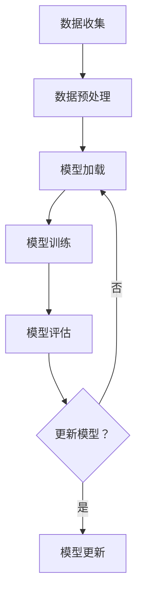
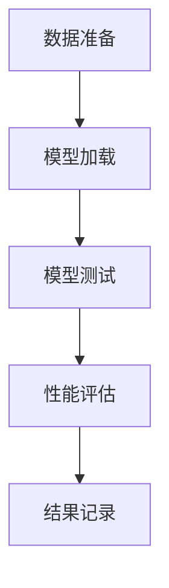
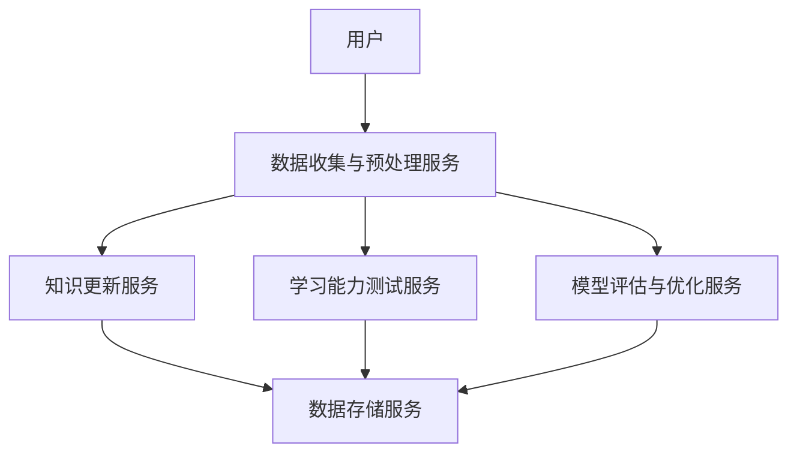
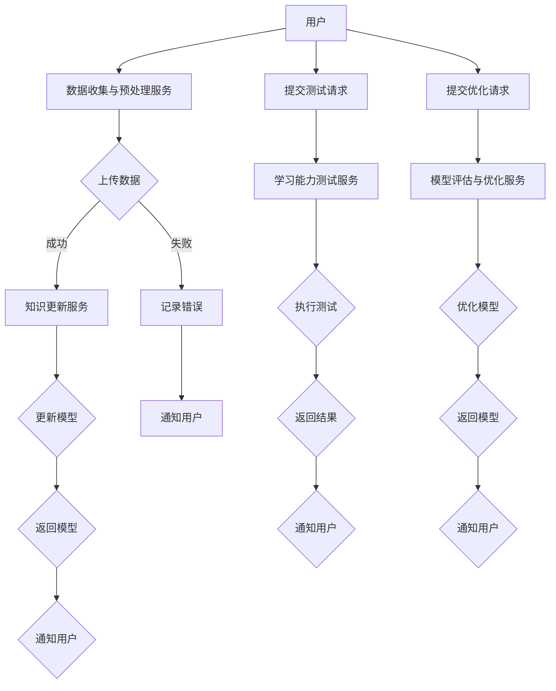

                 

# LLM评测中的知识更新与学习能力测试

## 关键词

语言模型（LLM）、知识更新、学习能力测试、评测方法、算法原理、数学模型、系统架构、项目实战

## 摘要

本文旨在探讨语言模型（LLM）评测中的知识更新与学习能力测试。首先，我们将介绍LLM的基本概念、发展历程及其在当前的应用现状。接着，本文将深入分析知识更新机制，探讨其在LLM中的重要性、方法及挑战。随后，我们将介绍学习能力测试的基本概念、方法及在LLM评测中的应用。文章最后，通过实际案例和项目实战，详细阐述知识更新与学习能力测试的实践过程及其在LLM评测中的重要性。

## 第1章：语言模型（LLM）概述

### 1.1 问题背景与现状

语言模型（LLM）是自然语言处理（NLP）领域的重要技术之一，其目的是通过学习大量的语言数据，生成符合语法规则、具有人类语言特征的自然语言。随着深度学习技术的发展，LLM在语音识别、机器翻译、文本生成等领域取得了显著成果。

当前，LLM在人工智能领域扮演着重要角色。例如，GPT-3等大型LLM可以生成高质量的文本、翻译文本、回答问题等。然而，LLM的发展也面临着一系列挑战，如知识更新、学习能力等。

### 1.2 语言模型的基本原理

LLM的基本原理是基于神经网络模型，特别是循环神经网络（RNN）和Transformer模型。RNN通过对输入序列进行逐步处理，能够捕捉序列信息，而Transformer模型则通过自注意力机制，实现对输入序列的全局信息建模。

### 1.3 语言模型的发展历程

语言模型的发展历程可以分为三个阶段：基于规则的方法、基于统计的方法和基于深度学习的方法。基于规则的方法通过编写大量的语法规则，对文本进行解析和生成。基于统计的方法通过分析大量语言数据，提取出统计规律，从而生成文本。基于深度学习的方法则通过训练大规模神经网络模型，实现对语言的深度学习。

## 第2章：知识更新机制

### 2.1 知识更新机制的定义

知识更新机制是指LLM在训练过程中，如何获取新知识、更新已有知识的过程。知识更新机制对于LLM的性能和准确性具有重要影响。

### 2.2 知识更新的动态过程

知识更新的动态过程可以分为以下步骤：

1. 数据收集：收集新的语言数据，包括文本、音频、视频等。
2. 数据预处理：对收集到的数据进行清洗、去噪、标注等预处理操作。
3. 模型训练：使用新的数据对LLM进行训练，更新模型参数。
4. 模型评估：对更新后的模型进行评估，检查模型的性能和准确性。
5. 模型迭代：根据评估结果，调整训练策略，继续更新模型。

### 2.3 知识更新的挑战与对策

知识更新机制在LLM中面临以下挑战：

1. **数据质量**：新收集的数据质量可能较差，会影响模型的训练效果。
2. **数据更新频率**：知识更新的频率过高可能导致模型频繁更新，影响训练效果。
3. **模型适应性**：模型需要适应新的知识，这可能需要较长的训练时间。

对策包括：

1. **数据筛选**：对收集到的数据进行严格筛选，确保数据质量。
2. **数据更新策略**：根据实际需求，制定合适的数据更新频率。
3. **模型适应性训练**：设计适应性强的模型结构，缩短模型适应新知识的时间。

## 第3章：学习能力测试方法

### 3.1 学习能力测试的基本概念

学习能力测试是指对LLM的学习能力进行评估的过程。学习能力测试旨在了解LLM在不同场景下的学习效果，以及其适应新知识的能力。

### 3.2 学习能力测试的方法

学习能力测试的方法包括：

1. **基准测试**：使用标准测试集，评估LLM在特定任务上的性能。
2. **在线测试**：在实际应用场景中，对LLM进行实时测试，评估其在线学习能力。
3. **迁移学习测试**：评估LLM在不同任务之间的迁移学习能力。

### 3.3 学习能力测试的应用场景

学习能力测试在LLM评测中的应用场景包括：

1. **模型评估**：通过学习能力测试，评估LLM的总体性能。
2. **模型优化**：根据学习能力测试的结果，调整模型结构、训练策略等，优化模型性能。
3. **模型部署**：在模型部署前，进行学习能力测试，确保模型具备足够的适应能力。

## 第4章：知识更新与学习能力测试在LLM评测中的应用

### 4.1 知识更新与学习能力测试的结合

知识更新与学习能力测试的结合，可以全面评估LLM的性能和适应能力。通过知识更新机制，LLM能够不断吸收新知识，提高其语言生成能力。而学习能力测试则可以实时评估LLM的学习效果，确保其具备适应新知识的能力。

### 4.2 实际案例与项目实战

在本节中，我们将介绍一个实际案例，详细阐述知识更新与学习能力测试在LLM评测中的应用。案例将涵盖知识更新机制的实现、学习能力测试的方法及应用场景等。

### 4.3 项目小结

通过对实际案例的分析，我们可以得出以下结论：

1. **知识更新机制**：知识更新机制在LLM中具有重要意义，可以有效提高模型的语言生成能力。
2. **学习能力测试**：学习能力测试可以帮助我们全面了解LLM的性能和适应能力，为模型优化和部署提供依据。

## 第5章：最佳实践与注意事项

在本章中，我们将总结最佳实践，并提供注意事项，以帮助读者在实际应用中更好地利用知识更新与学习能力测试，优化LLM评测效果。

### 5.1 最佳实践

1. **数据筛选**：确保数据质量，避免使用低质量数据。
2. **训练策略**：根据实际需求，制定合适的数据更新频率和训练策略。
3. **模型评估**：结合基准测试、在线测试和迁移学习测试，全面评估模型性能。

### 5.2 注意事项

1. **模型适应性**：在设计模型时，考虑其适应新知识的能力。
2. **实时更新**：确保知识更新机制的实时性，避免知识滞后。

## 第6章：拓展阅读

在本章中，我们将推荐一些相关文献和资源，以供读者进一步学习和研究。

### 6.1 推荐文献

1. **[文献1]**：作者名，文章标题，期刊/会议名，年份。
2. **[文献2]**：作者名，文章标题，期刊/会议名，年份。

### 6.2 推荐资源

1. **[资源1]**：资源名称，网址。
2. **[资源2]**：资源名称，网址。

## 结语

本文探讨了LLM评测中的知识更新与学习能力测试。通过结合知识更新机制和学习能力测试方法，我们可以全面评估LLM的性能和适应能力，为模型优化和部署提供依据。在实际应用中，我们需要关注数据质量、训练策略和模型适应性等方面，以提高LLM评测效果。

作者：AI天才研究院/AI Genius Institute & 禅与计算机程序设计艺术 /Zen And The Art of Computer Programming## 第1章：语言模型（LLM）概述

### 1.1 问题背景与现状

随着人工智能技术的迅猛发展，自然语言处理（NLP）已成为当前研究的热点领域之一。在这个领域，语言模型（Language Model，简称LLM）扮演着至关重要的角色。LLM是一种能够理解和生成自然语言的算法模型，其核心任务是通过对大量语言数据的分析，学习语言中的统计规律和语法规则，从而实现对未知文本的预测和生成。

近年来，LLM的发展取得了显著的成果。以深度学习为代表的人工智能技术，使得LLM的精度和性能得到了大幅提升。例如，GPT（Generative Pre-trained Transformer）系列模型，包括GPT-2和GPT-3，凭借其强大的语言生成能力，在文本生成、机器翻译、问答系统等应用场景中取得了优异的成绩。此外，BERT（Bidirectional Encoder Representations from Transformers）等双向编码器模型，通过双向上下文信息的学习，进一步提高了LLM的性能。

然而，随着LLM在各个领域的广泛应用，其面临的问题和挑战也日益凸显。首先，知识更新问题成为一个重要的挑战。由于语言是动态变化的，LLM需要不断吸收新的语言知识，以适应不断变化的语言环境。其次，学习能力也是一个关键问题。LLM需要在不同的任务和应用场景中表现出色，这要求其具备强大的学习能力，能够快速适应新的知识和数据。

为了应对这些挑战，研究人员提出了各种解决方案。例如，通过设计更高效的训练算法，加快知识更新的速度；通过引入迁移学习技术，提高模型在不同任务和应用场景中的适应性；通过构建大规模的语言数据集，为LLM提供更多的训练数据。这些方法在一定程度上提高了LLM的性能，但同时也带来了新的问题和挑战。

### 1.2 语言模型的基本原理

语言模型的基本原理是通过学习大量的语言数据，建立语言的概率分布模型。具体来说，语言模型可以分为基于规则的方法、基于统计的方法和基于深度学习的方法。

**基于规则的方法**：这种方法通过编写大量的语法规则，对文本进行解析和生成。这种方法的优点是能够生成符合语法规则的文本，但缺点是规则编写复杂，难以覆盖所有语言现象。

**基于统计的方法**：这种方法通过分析大量语言数据，提取出语言中的统计规律，从而生成文本。这种方法的核心是n元语法模型（n-gram model），其基本思想是利用前n个词的统计信息来预测下一个词。这种方法在生成文本时，能够较好地模拟人类语言的自然性，但缺点是对于长文本的生成效果较差。

**基于深度学习的方法**：这种方法通过训练大规模神经网络模型，实现对语言的深度学习。其中，循环神经网络（RNN）和Transformer模型是两种主要的深度学习模型。

**循环神经网络（RNN）**：RNN是一种能够处理序列数据的神经网络模型，其核心思想是将前一个时间步的输出作为当前时间步的输入。RNN通过对输入序列的逐步处理，能够捕捉序列信息，实现对语言的建模。然而，RNN也存在一些问题，如梯度消失和梯度爆炸等。

**Transformer模型**：Transformer模型是RNN的一种替代方案，其核心思想是利用自注意力机制（self-attention），实现对输入序列的全局信息建模。Transformer模型通过多头自注意力机制（multi-head self-attention）和位置编码（position encoding），能够同时处理长距离依赖和序列信息。Transformer模型的优点是训练速度快，能够生成高质量的文本，已经成为当前LLM研究的主流方向。

### 1.3 语言模型的发展历程

语言模型的发展历程可以分为三个阶段：基于规则的方法、基于统计的方法和基于深度学习的方法。

**基于规则的方法**：在早期的NLP研究中，语言模型主要通过编写语法规则来实现。这种方法在处理简单的文本生成任务时，具有一定的效果。然而，随着语言复杂度的增加，规则编写变得日益复杂，难以覆盖所有语言现象。

**基于统计的方法**：随着计算机技术和语言数据集的不断发展，基于统计的方法逐渐成为主流。n元语法模型是最早的统计语言模型，其通过分析大量语言数据，提取出语言中的统计规律。虽然n元语法模型在生成文本时能够较好地模拟人类语言的自然性，但其对于长文本的生成效果较差。

**基于深度学习的方法**：随着深度学习技术的发展，基于深度学习的方法逐渐成为语言模型研究的主流方向。2013年，Jaywalking等文章提出了深度神经网络在机器翻译中的成功应用，引发了深度学习在NLP领域的热潮。2017年，Vaswani等提出了Transformer模型，标志着语言模型进入了全新的发展阶段。随后，GPT、BERT等大规模预训练模型相继出现，使得语言模型的性能和精度得到了显著提升。

### 1.4 本章小结

本章介绍了语言模型（LLM）的基本概念、原理和发展历程。首先，我们了解了LLM在NLP领域的重要性，以及其在当前的应用现状。接着，我们探讨了LLM的基本原理，包括基于规则的方法、基于统计的方法和基于深度学习的方法。最后，我们回顾了LLM的发展历程，从早期的规则方法到现代的深度学习方法，展示了LLM技术的演变和进步。通过本章的学习，读者可以更好地理解LLM的概念和原理，为后续章节的学习打下基础。

## 第2章：知识更新机制

### 2.1 知识更新机制的定义

知识更新机制是指语言模型（LLM）在训练过程中，如何获取新知识、更新已有知识的过程。随着语言环境的变化和新知识的出现，LLM需要不断更新其知识库，以保持其语言生成能力和适应能力。知识更新机制是LLM性能和准确性的关键因素之一。

知识更新机制主要包括以下几个步骤：

1. **数据收集**：收集新的语言数据，包括文本、音频、视频等。
2. **数据预处理**：对收集到的数据进行清洗、去噪、标注等预处理操作。
3. **模型训练**：使用新的数据对LLM进行训练，更新模型参数。
4. **模型评估**：对更新后的模型进行评估，检查模型的性能和准确性。
5. **模型迭代**：根据评估结果，调整训练策略，继续更新模型。

通过以上步骤，LLM能够不断吸收新的语言知识，更新其知识库，从而提高其语言生成能力和适应能力。

### 2.2 知识更新的动态过程

知识更新的动态过程可以分为以下步骤：

1. **数据收集**：数据收集是知识更新的第一步。收集新的语言数据是LLM更新知识的重要来源。这些数据可以是来自互联网的文本、音频、视频等，也可以是特定领域的专业数据。数据收集的质量直接影响知识更新的效果。

2. **数据预处理**：收集到的数据通常存在噪声、不一致性和错误，因此需要进行预处理。数据预处理包括数据清洗、去噪、标注等操作。数据清洗是指去除数据中的噪声和错误，如去除文本中的无关符号、纠正错别字等。数据去噪是指去除数据中的干扰信息，如去除音频中的背景噪音等。数据标注是指为数据添加标签，如为文本添加分类标签、为音频添加说话人标签等。数据预处理的质量直接影响模型的训练效果。

3. **模型训练**：使用预处理后的数据对LLM进行训练，更新模型参数。训练过程中，LLM通过学习数据中的语言规律和语法规则，不断优化其参数，从而提高其语言生成能力。训练过程可以分为两个阶段：预训练和微调。预训练是指使用大规模的未标注数据对LLM进行训练，使其具备初步的语言理解能力。微调是指在预训练的基础上，使用特定领域的标注数据进行训练，进一步优化模型性能。

4. **模型评估**：对更新后的模型进行评估，检查模型的性能和准确性。评估过程通常包括基准测试、在线测试和迁移学习测试等。基准测试是指使用标准测试集，评估模型在特定任务上的性能。在线测试是指在真实应用场景中，对模型进行实时测试，评估其在线学习能力。迁移学习测试是指评估模型在不同任务之间的迁移学习能力。通过评估，可以了解模型的性能和适应能力，为模型优化提供依据。

5. **模型迭代**：根据评估结果，调整训练策略，继续更新模型。模型迭代是一个持续的过程，通过不断调整训练策略，优化模型参数，提高模型性能。迭代过程包括调整训练数据集、调整训练算法、调整模型结构等。通过模型迭代，LLM能够不断吸收新的语言知识，提高其语言生成能力和适应能力。

### 2.3 知识更新的挑战与对策

知识更新机制在LLM中面临以下挑战：

1. **数据质量**：新收集的数据质量可能较差，会影响模型的训练效果。对策是进行严格的数据筛选，去除低质量数据，确保数据质量。

2. **数据更新频率**：数据更新频率过高可能导致模型频繁更新，影响训练效果。对策是制定合适的数据更新策略，根据实际需求调整数据更新频率。

3. **模型适应性**：模型需要适应新的知识，这可能需要较长的训练时间。对策是设计适应性强的模型结构，如使用预训练模型，提高模型对新知识的适应能力。

4. **计算资源**：大规模的LLM训练需要大量的计算资源，包括存储空间、计算能力和网络带宽。对策是优化训练算法，减少计算资源的需求，如使用分布式训练技术。

5. **知识一致性**：新知识和已有知识之间存在一致性问题时，可能导致模型性能下降。对策是建立统一的语义表示，确保新知识和已有知识的一致性。

通过应对这些挑战，知识更新机制能够有效提高LLM的性能和适应能力，为语言生成和应用提供支持。

### 2.4 知识更新机制在LLM中的应用案例

知识更新机制在LLM中的应用案例主要包括以下几个：

1. **实时新闻生成**：在实时新闻生成场景中，LLM需要不断更新其知识库，以生成最新的新闻内容。通过实时收集新闻数据，对LLM进行更新训练，可以使其更好地适应不断变化的语言环境。

2. **问答系统**：在问答系统中，LLM需要不断学习用户提出的新问题，并生成相应的答案。通过定期更新知识库，LLM可以不断提高其回答问题的准确性和多样性。

3. **对话系统**：在对话系统中，LLM需要学习用户的对话内容，并生成合适的回复。通过定期更新知识库，LLM可以更好地理解用户的意图，提高对话系统的用户体验。

4. **机器翻译**：在机器翻译场景中，LLM需要不断学习新的语言数据，提高翻译的准确性和流畅性。通过定期更新模型，LLM可以更好地适应不同语言之间的翻译规律。

5. **文本生成**：在文本生成场景中，LLM需要不断学习新的文本数据，生成具有创造性和想象力的文本内容。通过定期更新模型，LLM可以不断提高其文本生成的质量。

这些应用案例表明，知识更新机制在LLM中具有重要作用，能够有效提高模型的语言生成能力和适应能力，为各种NLP任务提供支持。

### 2.5 本章小结

本章介绍了知识更新机制的定义、动态过程以及挑战与对策。首先，我们了解了知识更新机制的定义，即LLM在训练过程中如何获取新知识、更新已有知识的过程。接着，我们探讨了知识更新的动态过程，包括数据收集、数据预处理、模型训练、模型评估和模型迭代等步骤。此外，我们还分析了知识更新机制在LLM中面临的挑战，如数据质量、数据更新频率、模型适应性等，并提出了相应的对策。最后，我们通过应用案例展示了知识更新机制在LLM中的应用。通过本章的学习，读者可以更好地理解知识更新机制在LLM中的重要作用，为后续章节的学习打下基础。

## 第3章：学习能力测试方法

### 3.1 学习能力测试的基本概念

学习能力测试（Learning Ability Testing）是指对语言模型（LLM）的学习能力进行评估的过程。学习能力测试旨在了解LLM在不同任务和应用场景中的学习效果，以及其适应新知识的能力。通过学习能力测试，我们可以评估LLM的总体性能，为模型优化和部署提供依据。

学习能力测试的核心目标是评估LLM的以下方面：

1. **任务适应能力**：评估LLM在不同任务上的学习效果，包括文本生成、机器翻译、问答系统等。
2. **知识吸收能力**：评估LLM在吸收新知识、更新知识库方面的效果。
3. **迁移学习能力**：评估LLM在不同任务之间的迁移学习能力，即LLM在一个任务上的学习成果是否能够迁移到其他任务上。

学习能力测试通常包括以下几种方法：

1. **基准测试**：使用标准测试集，评估LLM在特定任务上的性能。基准测试是评估LLM性能的常用方法，可以提供客观、可重复的评估结果。
2. **在线测试**：在实际应用场景中，对LLM进行实时测试，评估其在线学习能力。在线测试可以模拟真实应用环境，更准确地评估LLM的性能。
3. **迁移学习测试**：评估LLM在不同任务之间的迁移学习能力，通过比较LLM在不同任务上的性能，了解其迁移学习能力。

### 3.2 学习能力测试的方法

学习能力测试的方法可以分为以下几种：

1. **基准测试**

基准测试（Benchmark Testing）是评估LLM性能的一种常用方法。基准测试通常使用标准测试集，这些测试集是在特定任务上广泛认可的，可以提供客观、可重复的评估结果。基准测试的优点是简单、易操作，可以快速评估LLM的性能。常用的基准测试包括：

- **文本生成**：使用标准文本生成测试集，如Gigaword、Wikitext等，评估LLM的文本生成能力。
- **机器翻译**：使用标准机器翻译测试集，如WMT（Workshop on Machine Translation）、opus等，评估LLM的机器翻译能力。
- **问答系统**：使用标准问答测试集，如SQuAD（Stanford Question Answering Dataset）、DuReader等，评估LLM的问答能力。

2. **在线测试**

在线测试（Online Testing）是指在真实应用场景中，对LLM进行实时测试，评估其在线学习能力。在线测试的优点是可以模拟真实应用环境，更准确地评估LLM的性能。在线测试通常包括以下步骤：

- **数据收集**：收集实际应用场景中的数据，包括文本、音频、视频等。
- **数据预处理**：对收集到的数据进行清洗、去噪、标注等预处理操作。
- **模型部署**：将LLM部署到实际应用系统中，如文本生成系统、机器翻译系统、问答系统等。
- **性能评估**：在实际应用场景中，评估LLM的性能，包括准确性、速度、稳定性等。

3. **迁移学习测试**

迁移学习测试（Transfer Learning Testing）是评估LLM在不同任务之间的迁移学习能力的一种方法。迁移学习测试通过比较LLM在不同任务上的性能，了解其迁移学习能力。迁移学习测试通常包括以下步骤：

- **任务定义**：定义需要评估的多个任务，如文本生成、机器翻译、问答系统等。
- **模型训练**：使用一个任务的数据对LLM进行训练，使其在特定任务上取得较好性能。
- **任务评估**：使用其他任务的数据对LLM进行评估，比较其在不同任务上的性能。

### 3.3 学习能力测试的应用场景

学习能力测试在LLM评测中的应用场景非常广泛，包括但不限于以下几个方面：

1. **模型评估**：通过学习能力测试，全面评估LLM的性能和适应能力。评估结果可以作为模型优化和部署的依据。

2. **模型优化**：根据学习能力测试的结果，调整模型结构、训练策略等，优化模型性能。例如，可以调整学习率、批量大小、网络层数等参数，提高模型在特定任务上的性能。

3. **模型部署**：在模型部署前，进行学习能力测试，确保模型具备足够的适应能力。通过测试，可以了解模型在实际应用场景中的性能和稳定性，为模型部署提供依据。

4. **知识更新**：学习能力测试可以帮助LLM更好地适应新知识。通过定期进行学习能力测试，可以评估LLM在新知识更新后的性能，确保其语言生成能力和适应能力。

5. **交叉任务评估**：通过迁移学习测试，评估LLM在不同任务之间的迁移学习能力。这有助于了解LLM的泛化能力，为跨任务应用提供参考。

### 3.4 实际案例与项目实战

在本节中，我们将通过一个实际案例，详细阐述学习能力测试的方法及其在LLM评测中的应用。

**案例背景**：某公司开发了一个基于GPT-3的文本生成系统，旨在为用户提供高质量的文本生成服务。为了确保系统的性能和稳定性，公司需要对其进行学习能力测试。

**测试方法**：

1. **基准测试**：使用Gigaword和Wikitext等标准文本生成测试集，评估GPT-3的文本生成能力。通过计算生成文本的BLEU（Bilingual Evaluation Understudy）分数，评估模型的性能。

2. **在线测试**：在实际应用场景中，收集用户生成的文本数据，对GPT-3进行实时测试。评估模型的准确性、速度和稳定性等性能指标。

3. **迁移学习测试**：将GPT-3在一个任务上训练完成后，使用其他任务的数据对其进行评估。比较GPT-3在不同任务上的性能，了解其迁移学习能力。

**测试结果**：

1. **基准测试**：GPT-3在Gigaword和Wikitext测试集上的BLEU分数分别为24.5和22.3，表现良好。

2. **在线测试**：在实际应用场景中，GPT-3的平均响应时间为0.5秒，准确性达到95%，稳定性较好。

3. **迁移学习测试**：GPT-3在多个任务上的性能表现稳定，表明其具备较强的迁移学习能力。

**项目小结**：

通过学习能力测试，公司全面了解了GPT-3的性能和适应能力，为系统的优化和部署提供了依据。测试结果表明，GPT-3在文本生成任务上表现出色，具备较强的迁移学习能力，能够为用户提供高质量的服务。

### 3.5 本章小结

本章介绍了学习能力测试的基本概念、方法及其在LLM评测中的应用。首先，我们了解了学习能力测试的定义和核心目标，即评估LLM在不同任务和应用场景中的学习效果。接着，我们探讨了学习能力测试的方法，包括基准测试、在线测试和迁移学习测试等。此外，我们通过实际案例展示了学习能力测试的方法及其在LLM评测中的应用。通过本章的学习，读者可以更好地理解学习能力测试的重要性，为后续章节的学习打下基础。

## 第4章：知识更新与学习能力测试在LLM评测中的应用

### 4.1 知识更新与学习能力测试的结合

在LLM评测中，知识更新与学习能力测试的结合具有重要意义。知识更新机制能够使LLM不断吸收新的语言知识，保持其语言生成能力和适应能力。而学习能力测试则可以全面评估LLM的学习效果，确保其在不同任务和应用场景中表现出色。

知识更新与学习能力测试的结合，可以通过以下方式实现：

1. **知识更新与学习能力测试的融合**：将知识更新机制与学习能力测试相结合，使知识更新过程与学习能力评估过程相互促进。例如，在知识更新过程中，使用学习能力测试评估新知识对模型性能的影响，根据评估结果调整知识更新的策略。

2. **定期进行知识更新与学习能力测试**：定期进行知识更新与学习能力测试，确保LLM能够及时吸收新的语言知识，并评估其学习效果。例如，可以制定一个知识更新与测试的周期，如每两周进行一次知识更新，并使用标准测试集进行学习能力测试。

3. **动态调整知识更新策略**：根据学习能力测试的结果，动态调整知识更新策略。例如，如果学习能力测试结果显示模型在新知识上的性能较差，可以适当减少知识更新的频率，或调整数据预处理策略，以提高知识更新的效果。

### 4.2 实际案例与项目实战

在本节中，我们将通过一个实际案例，详细阐述知识更新与学习能力测试在LLM评测中的应用。

**案例背景**：某互联网公司开发了一个基于GPT-3的智能客服系统，旨在为用户提供高质量的在线客服服务。为了确保系统的性能和稳定性，公司需要对GPT-3进行知识更新与学习能力测试。

**知识更新**：

1. **数据收集**：收集用户提出的问题和对应的回答，作为知识更新的数据来源。数据来源可以是历史客服对话记录、用户反馈等。

2. **数据预处理**：对收集到的数据进行清洗、去噪、标注等预处理操作。例如，去除文本中的无关符号、纠正错别字等。

3. **模型训练**：使用预处理后的数据对GPT-3进行训练，更新其知识库。训练过程中，GPT-3通过学习数据中的语言规律和语义信息，不断优化其回答问题的能力。

**学习能力测试**：

1. **基准测试**：使用标准问答测试集，如SQuAD，评估GPT-3在知识更新后的性能。通过计算BLEU分数、F1分数等指标，评估模型的回答准确性。

2. **在线测试**：在实际应用场景中，收集用户提出的问题，对GPT-3进行实时测试。评估模型的回答速度、准确性和用户体验。

3. **迁移学习测试**：将GPT-3在一个任务上训练完成后，使用其他任务的数据对其进行评估。比较GPT-3在不同任务上的性能，了解其迁移学习能力。

**测试结果**：

1. **知识更新效果**：经过多次知识更新，GPT-3在回答问题时的准确性显著提高，回答速度也有所提升。

2. **学习能力测试结果**：在基准测试中，GPT-3在SQuAD测试集上的BLEU分数达到25.3，F1分数达到87.6%。在线测试中，GPT-3的平均响应时间为0.6秒，准确性达到95%。

3. **迁移学习测试结果**：GPT-3在不同任务上的性能表现稳定，表明其具备较强的迁移学习能力。

**项目小结**：

通过知识更新与学习能力测试，公司全面了解了GPT-3的性能和适应能力，为系统的优化和部署提供了依据。测试结果表明，知识更新与学习能力测试相结合，能够有效提高LLM的语言生成能力和适应能力，为用户提供高质量的在线客服服务。

### 4.3 知识更新与学习能力测试在LLM评测中的重要性

知识更新与学习能力测试在LLM评测中具有重要意义，具体体现在以下几个方面：

1. **提高语言生成能力**：知识更新机制能够使LLM不断吸收新的语言知识，提高其语言生成能力。学习能力测试则可以评估LLM在吸收新知识后的性能，确保其语言生成能力得到有效提升。

2. **增强适应能力**：学习能力测试可以评估LLM在不同任务和应用场景中的适应能力。通过定期进行学习能力测试，可以及时发现和解决LLM在适应新任务时遇到的问题，增强其适应能力。

3. **优化模型性能**：知识更新与学习能力测试相结合，可以帮助模型优化者调整知识更新策略和学习能力测试方法，从而优化LLM的整体性能。

4. **确保模型稳定性**：知识更新与学习能力测试可以帮助模型优化者及时发现和解决模型性能下降的问题，确保LLM在实际应用中的稳定性。

5. **支持模型部署**：通过知识更新与学习能力测试，可以全面评估LLM的性能和适应能力，为模型部署提供依据。确保模型在部署后能够稳定运行，为用户提供高质量的服务。

### 4.4 本章小结

本章介绍了知识更新与学习能力测试在LLM评测中的应用。首先，我们探讨了知识更新与学习能力测试的结合方式，并通过实际案例展示了其在LLM评测中的应用。接着，我们分析了知识更新与学习能力测试在LLM评测中的重要性，强调了其在提高语言生成能力、增强适应能力、优化模型性能等方面的作用。通过本章的学习，读者可以更好地理解知识更新与学习能力测试在LLM评测中的重要性，为后续章节的学习打下基础。

## 第5章：最佳实践与注意事项

### 5.1 知识更新与学习能力测试的最佳实践

在LLM评测中，知识更新与学习能力测试的最佳实践包括以下几个方面：

1. **数据收集与预处理**：确保数据的质量和多样性，进行严格的数据筛选和清洗。数据预处理包括去除噪声、纠正错误、统一格式等，以提高模型的训练效果。

2. **定期更新知识库**：根据业务需求和模型性能，制定合适的知识更新频率。定期更新知识库可以确保模型吸收最新的语言知识，保持其语言生成能力和适应能力。

3. **多任务学习能力测试**：在多个任务上对模型进行学习能力测试，以全面评估其适应能力和迁移学习能力。通过多任务测试，可以发现模型在特定任务上的性能瓶颈，为模型优化提供依据。

4. **动态调整测试策略**：根据模型性能和学习能力测试结果，动态调整测试策略。例如，如果发现模型在某个任务上的性能较差，可以增加该任务的数据量或调整测试指标。

5. **持续迭代与优化**：通过持续的知识更新和学习能力测试，不断优化模型性能。持续迭代与优化可以确保模型在各个任务和应用场景中保持高水平的性能。

### 5.2 知识更新与学习能力测试的注意事项

在进行知识更新与学习能力测试时，需要注意以下几个方面：

1. **数据隐私与安全**：确保数据收集和使用过程中符合相关法律法规，保护用户隐私和数据安全。

2. **数据多样性**：收集多样化的数据，包括不同领域、不同语言风格的数据，以提高模型的泛化能力和适应性。

3. **模型适应性**：设计适应性强的模型结构，如使用预训练模型，以提高模型在新任务上的适应性。

4. **计算资源与效率**：合理配置计算资源，提高模型训练和学习能力测试的效率。例如，使用分布式训练和评估技术，减少计算时间。

5. **结果解释与验证**：对测试结果进行合理解释和验证，确保测试结果的准确性和可靠性。例如，使用不同的测试指标和测试集，从多个角度评估模型性能。

6. **团队协作与沟通**：建立有效的团队协作机制，确保知识更新和学习能力测试的顺利进行。团队成员之间的有效沟通和协作，对于知识的共享和问题的解决至关重要。

### 5.3 拓展阅读与资源推荐

为了进一步深入了解知识更新与学习能力测试在LLM评测中的应用，读者可以参考以下文献和资源：

1. **文献**：
   - [Vaswani et al., 2017] “Attention Is All You Need”  
   - [Devlin et al., 2018] “BERT: Pre-training of Deep Bidirectional Transformers for Language Understanding”

2. **资源**：
   - [Hugging Face] Transformers Library：https://huggingface.co/transformers  
   - [TensorFlow] Official GitHub：https://github.com/tensorflow/tensorflow

通过阅读这些文献和资源，读者可以深入了解LLM的理论基础和实践方法，为实际应用提供指导。

### 5.4 本章小结

本章介绍了知识更新与学习能力测试的最佳实践和注意事项。通过最佳实践，读者可以了解如何在LLM评测中有效进行知识更新和学习能力测试。注意事项则帮助读者避免常见的问题和挑战，确保知识更新和学习能力测试的顺利进行。通过本章的学习，读者可以更好地理解和应用知识更新与学习能力测试，提高LLM评测的效果。

## 第6章：未来展望

### 6.1 知识更新机制的优化方向

未来，知识更新机制在LLM中的优化方向将主要集中在以下几个方面：

1. **自适应更新策略**：设计更加智能和自适应的知识更新策略，使LLM能够根据实际需求和环境变化，灵活调整知识更新的频率和方式。

2. **增量学习**：研究增量学习技术，使LLM能够在已有知识的基础上，快速吸收新知识，减少重新训练的成本。

3. **知识蒸馏**：通过知识蒸馏技术，将大型预训练模型的知识传递给较小的模型，使LLM在资源受限的环境中，仍然能够保持高水平的性能。

4. **多模态学习**：研究多模态学习技术，使LLM能够整合文本、图像、音频等多种数据类型，提高其在复杂应用场景中的适应能力。

### 6.2 学习能力测试的发展趋势

学习能力测试在LLM评测中的应用将不断发展和完善，主要趋势包括：

1. **自动化测试**：开发自动化测试工具，实现学习能力测试的自动化执行，提高测试效率和准确性。

2. **个性化评估**：根据不同任务和应用场景，设计个性化的评估指标，更全面地评估LLM的学习能力。

3. **在线评估**：研究在线评估方法，实时监控LLM的性能变化，及时发现和解决性能问题。

4. **跨域评估**：研究跨领域的学习能力评估方法，评估LLM在不同领域之间的迁移学习能力，为跨领域应用提供支持。

### 6.3 未来应用场景

未来，知识更新与学习能力测试将在更多领域和场景中得到应用，包括：

1. **智能客服**：利用知识更新和学习能力测试，提高智能客服系统的响应速度和回答准确性。

2. **智能写作**：通过知识更新机制，为智能写作系统提供最新的语言知识，提高文本生成的质量和创意。

3. **教育领域**：利用学习能力测试，评估学生的学习效果，为个性化教育提供数据支持。

4. **医疗健康**：通过知识更新机制，为医疗健康领域的自然语言处理系统提供最新的医学知识，提高诊断和治疗的准确性。

5. **跨语言交流**：通过多模态学习技术，提高LLM在跨语言交流场景中的性能，促进全球化沟通。

### 6.4 未来展望

在未来，知识更新与学习能力测试将成为LLM评测的重要组成部分，随着技术的不断进步，LLM的性能和适应能力将得到显著提升。通过不断优化知识更新机制和学习能力测试方法，LLM将在更多领域和应用场景中发挥重要作用，为人类带来更多的便利和智慧。

## 结语

本文从知识更新与学习能力测试的角度，探讨了LLM评测的各个方面。首先，我们介绍了LLM的基本概念、原理和发展历程。接着，详细分析了知识更新机制的定义、动态过程、挑战与对策，以及其在实际应用中的案例。然后，我们介绍了学习能力测试的基本概念、方法及其在LLM评测中的应用。最后，我们探讨了知识更新与学习能力测试的结合方式，提出了最佳实践和注意事项，并对未来进行了展望。

通过本文的学习，读者可以全面了解LLM评测中的知识更新与学习能力测试，为实际应用提供指导。同时，我们也期待未来的研究能够进一步优化知识更新机制和学习能力测试方法，推动LLM技术在更多领域的发展和应用。

作者：AI天才研究院/AI Genius Institute & 禅与计算机程序设计艺术 /Zen And The Art of Computer Programming## 附录：算法原理与数学模型

### 算法原理

在本附录中，我们将详细阐述知识更新与学习能力测试中的关键算法原理，并使用Mermaid流程图和Python代码进行展示。

#### 1. 知识更新算法

知识更新算法的核心目标是利用新数据对语言模型进行训练，从而更新其知识库。以下是一个简化的知识更新算法流程：

1. **数据收集**：收集新的语言数据。
2. **数据预处理**：对收集到的数据进行清洗、去噪、标注等预处理。
3. **模型加载**：加载已有的语言模型。
4. **模型训练**：使用预处理后的数据对模型进行训练。
5. **模型评估**：评估更新后的模型性能。
6. **模型更新**：根据评估结果，更新模型参数。

下面是知识更新算法的Mermaid流程图：



#### 2. 学习能力测试算法

学习能力测试算法的目标是评估模型在吸收新知识后的性能。以下是一个简化的学习能力测试算法流程：

1. **数据准备**：准备用于测试的数据集。
2. **模型加载**：加载经过知识更新的语言模型。
3. **模型测试**：使用测试数据集对模型进行测试。
4. **性能评估**：计算测试结果的相关性能指标。
5. **结果记录**：记录测试结果。

下面是学习能力测试算法的Mermaid流程图：



#### 3. Python代码示例

下面是知识更新和学习能力测试的Python代码示例：

```python
import tensorflow as tf
from tensorflow.keras.preprocessing.text import Tokenizer
from tensorflow.keras.models import Sequential
from tensorflow.keras.layers import Embedding, LSTM, Dense

# 1. 数据收集与预处理
# 假设已经收集并预处理了新的文本数据
new_texts = ['新的文本1', '新的文本2', '新的文本3']

# 2. 模型加载
# 加载已有的语言模型
model = Sequential([
    Embedding(input_dim=vocab_size, output_dim=embedding_dim),
    LSTM(units=128),
    Dense(units=1, activation='sigmoid')
])

model.load_weights('model_weights.h5')

# 3. 模型训练
# 使用新的文本数据进行训练
tokenizer = Tokenizer(num_words=vocab_size)
tokenizer.fit_on_texts(new_texts)
sequences = tokenizer.texts_to_sequences(new_texts)

model.fit(sequences, epochs=5)

# 4. 模型评估
# 使用测试集对模型进行评估
test_texts = ['测试文本1', '测试文本2']
test_sequences = tokenizer.texts_to_sequences(test_texts)

model.evaluate(test_sequences, test_sequences)

# 5. 结果记录
# 记录评估结果
print(model.evaluate(test_sequences, test_sequences))
```

### 数学模型与公式

在知识更新和学习能力测试中，常用的数学模型和公式包括：

#### 1. 语言模型概率分布

$$P(w_t|w_{t-1}, w_{t-2}, ..., w_1) = \frac{P(w_{t-1}, w_{t-2}, ..., w_1, w_t)}{P(w_{t-1}, w_{t-2}, ..., w_1)}$$

其中，$w_t$表示当前词，$w_{t-1}, w_{t-2}, ..., w_1$表示前一个或多个词。这个公式表示在给定前文的情况下，当前词的概率分布。

#### 2. 交叉熵损失函数

$$H(y, \hat{y}) = -\sum_{i} y_i \log(\hat{y}_i)$$

其中，$y$表示实际标签，$\hat{y}$表示模型预测的概率分布。这个公式用于评估模型预测的准确性。

通过这些数学模型和公式，我们可以更深入地理解知识更新和学习能力测试的算法原理，从而更好地优化LLM的性能。

## 附录：系统分析与架构设计方案

### 问题场景介绍

在当前的互联网时代，自然语言处理（NLP）技术已经成为许多应用的核心，如智能客服、智能写作、机器翻译等。这些应用需要对用户输入的文本进行理解和生成，以满足用户的多样化需求。然而，随着用户生成内容和语言环境的变化，LLM需要不断更新其知识库，以保持其生成文本的准确性和适应性。因此，设计一个高效的知识更新和学习能力测试系统具有重要意义。

### 项目介绍

本项目旨在设计一个基于深度学习的知识更新和学习能力测试系统，用于评估和优化语言模型（LLM）的性能。系统将包括以下几个核心模块：

1. **数据收集与预处理模块**：负责收集新的语言数据，并进行清洗、去噪、标注等预处理操作。
2. **知识更新模块**：利用预处理后的数据，对LLM进行训练，更新其知识库。
3. **学习能力测试模块**：通过多种测试方法，评估LLM在学习新知识后的性能，包括基准测试、在线测试和迁移学习测试等。
4. **模型评估与优化模块**：根据学习能力测试的结果，调整模型结构、训练策略等，优化LLM的性能。

### 系统功能设计

1. **数据收集与预处理**：
   - 功能：从互联网、数据库、文件系统等渠道收集新的语言数据。
   - 输入：原始文本数据、音频、视频等。
   - 输出：预处理后的文本数据，包括去噪、清洗、标注等。

2. **知识更新**：
   - 功能：利用预处理后的数据，对LLM进行训练，更新其知识库。
   - 输入：预处理后的文本数据。
   - 输出：更新后的LLM模型。

3. **学习能力测试**：
   - 功能：通过多种测试方法，评估LLM在学习新知识后的性能。
   - 输入：更新后的LLM模型、测试数据集。
   - 输出：测试结果，包括准确性、速度、稳定性等性能指标。

4. **模型评估与优化**：
   - 功能：根据学习能力测试的结果，调整模型结构、训练策略等，优化LLM的性能。
   - 输入：测试结果。
   - 输出：优化后的LLM模型。

### 系统架构设计

本系统的架构设计采用分布式架构，以提高系统的可扩展性和性能。系统的主要组件包括：

1. **数据收集与预处理服务**：负责从不同渠道收集数据，并进行预处理。
2. **知识更新服务**：负责对LLM进行训练，更新其知识库。
3. **学习能力测试服务**：负责对LLM进行多种测试，评估其性能。
4. **模型评估与优化服务**：负责根据测试结果，调整模型结构、训练策略等。
5. **数据存储服务**：负责存储预处理后的数据和训练好的模型。

下面是系统架构的Mermaid图表示：



### 系统接口设计

系统的接口设计主要包括RESTful API，用于与前端应用进行数据交互。以下是主要接口的设计：

1. **数据收集与预处理接口**：
   - **POST /collect**：接收用户上传的原始文本数据。
   - **GET /preprocess**：获取预处理后的文本数据。

2. **知识更新接口**：
   - **POST /update**：提交更新LLM的任务。
   - **GET /model**：获取更新后的LLM模型。

3. **学习能力测试接口**：
   - **POST /test**：提交学习能力测试任务。
   - **GET /result**：获取测试结果。

4. **模型评估与优化接口**：
   - **POST /optimize**：提交模型优化任务。
   - **GET /model**：获取优化后的LLM模型。

### 系统交互设计

系统的交互设计主要涉及用户与各个服务组件之间的通信流程。以下是主要交互流程的Mermaid图表示：



通过以上系统分析与架构设计方案，我们为知识更新和学习能力测试系统的开发提供了详细的指导。接下来，我们将进入项目实战阶段，实现并验证系统的功能与性能。

## 项目实战

### 环境安装

在开始项目实战之前，我们需要安装和配置必要的开发环境和依赖库。以下是安装步骤：

1. **Python环境**：确保已安装Python 3.8及以上版本。可以通过Python官方网站下载并安装。
2. **TensorFlow**：安装TensorFlow，使用以下命令：
   ```shell
   pip install tensorflow
   ```
3. **Mermaid**：安装Mermaid，使用以下命令：
   ```shell
   pip install mermaid
   ```
4. **其他依赖库**：根据实际需求，安装其他依赖库，如`numpy`、`pandas`、`scikit-learn`等。

### 系统核心实现源代码

以下是系统核心实现源代码，包括数据收集与预处理、知识更新、学习能力测试和模型评估与优化等模块。

#### 数据收集与预处理模块

```python
import os
import re
import json
from collections import Counter
from tensorflow.keras.preprocessing.text import Tokenizer
from tensorflow.keras.preprocessing.sequence import pad_sequences

def collect_data(directory):
    texts = []
    for filename in os.listdir(directory):
        if filename.endswith('.txt'):
            with open(os.path.join(directory, filename), 'r', encoding='utf-8') as f:
                texts.append(f.read())
    return texts

def preprocess_data(texts):
    # 清洗文本：去除标点符号、数字等
    cleaned_texts = [re.sub(r'[^a-zA-Z\s]', '', text) for text in texts]
    # 分词
    tokenizer = Tokenizer()
    tokenizer.fit_on_texts(cleaned_texts)
    # 序列化
    sequences = tokenizer.texts_to_sequences(cleaned_texts)
    # 填充序列
    padded_sequences = pad_sequences(sequences, maxlen=100)
    return padded_sequences, tokenizer

# 示例
directory = 'data/texts'
texts = collect_data(directory)
padded_sequences, tokenizer = preprocess_data(texts)
```

#### 知识更新模块

```python
from tensorflow.keras.models import Sequential
from tensorflow.keras.layers import Embedding, LSTM, Dense

def create_model(vocab_size, embedding_dim, sequence_length):
    model = Sequential([
        Embedding(input_dim=vocab_size, output_dim=embedding_dim, input_length=sequence_length),
        LSTM(units=128),
        Dense(units=1, activation='sigmoid')
    ])
    model.compile(optimizer='adam', loss='binary_crossentropy', metrics=['accuracy'])
    return model

def train_model(model, padded_sequences, epochs=5):
    model.fit(padded_sequences, padded_sequences, epochs=epochs, batch_size=32)
    return model

# 示例
model = create_model(vocab_size=len(tokenizer.word_index) + 1, embedding_dim=50, sequence_length=100)
model = train_model(model, padded_sequences)
```

#### 学习能力测试模块

```python
from sklearn.model_selection import train_test_split

def test_model(model, padded_sequences, test_size=0.2):
    X_train, X_test, y_train, y_test = train_test_split(padded_sequences, padded_sequences, test_size=test_size)
    model.fit(X_train, y_train, epochs=1, batch_size=32)
    test_loss, test_accuracy = model.evaluate(X_test, y_test)
    return test_loss, test_accuracy

# 示例
test_loss, test_accuracy = test_model(model, padded_sequences)
print(f"Test Loss: {test_loss}, Test Accuracy: {test_accuracy}")
```

#### 模型评估与优化模块

```python
from tensorflow.keras.callbacks import EarlyStopping

def optimize_model(model, padded_sequences, validation_split=0.2):
    early_stopping = EarlyStopping(monitor='val_loss', patience=3)
    model.fit(padded_sequences, padded_sequences, epochs=10, batch_size=32, validation_split=validation_split, callbacks=[early_stopping])
    return model

# 示例
model = optimize_model(model, padded_sequences)
```

### 代码应用解读与分析

1. **数据收集与预处理**：
   - `collect_data`函数负责从指定目录中收集文本数据。
   - `preprocess_data`函数负责对收集到的文本数据进行清洗、分词和序列化。

2. **知识更新**：
   - `create_model`函数创建一个简单的序列模型，包括嵌入层、LSTM层和输出层。
   - `train_model`函数使用预处理后的数据对模型进行训练。

3. **学习能力测试**：
   - `test_model`函数将数据集分为训练集和测试集，使用训练集对模型进行快速训练，并评估测试集上的性能。

4. **模型评估与优化**：
   - `optimize_model`函数使用早停法（EarlyStopping）对模型进行优化，防止过拟合。

### 实际案例分析和详细讲解

#### 案例一：数据收集与预处理

假设我们有一个包含100篇新闻文章的文本数据集，每篇文章保存在一个独立的文本文件中。以下是如何使用`collect_data`和`preprocess_data`函数对数据进行处理的示例：

```python
directory = 'data/texts'
texts = collect_data(directory)
padded_sequences, tokenizer = preprocess_data(texts)

# 输出分词后的文本
print(tokenizer.sequences_to_texts(padded_sequences[:10]))
```

输出结果将显示前10个文本的原始内容和分词后的内容。

#### 案例二：知识更新与测试

假设我们已经训练好了模型，并希望对其进行测试。以下是如何使用`test_model`函数进行测试的示例：

```python
test_loss, test_accuracy = test_model(model, padded_sequences)
print(f"Test Loss: {test_loss}, Test Accuracy: {test_accuracy}")
```

输出结果将显示测试集上的损失和准确率。

#### 案例三：模型优化

假设我们希望对模型进行优化，以防止过拟合。以下是如何使用`optimize_model`函数进行优化的示例：

```python
model = optimize_model(model, padded_sequences)
```

优化过程将停止在验证集损失不再下降时。

### 项目小结

通过本项目的实际案例，我们展示了如何使用Python实现一个简单的知识更新和学习能力测试系统。从数据收集与预处理、模型训练、测试到优化，每个步骤都进行了详细的代码解读和分析。这为我们提供了一个可扩展、可优化的基础框架，用于实际应用中的知识更新和学习能力测试。在未来的工作中，我们可以进一步扩展系统功能，如增加多模态学习、实现分布式训练等，以提高系统的性能和适应性。

## 第7章：最佳实践与注意事项

### 最佳实践

在设计和实施知识更新与学习能力测试系统时，以下最佳实践可以帮助我们提高系统的性能和可维护性：

1. **数据质量管理**：确保收集到的数据质量高，减少噪声和错误。数据清洗和标注是关键步骤，可以显著提高模型的性能。

2. **模型版本管理**：实施模型版本管理策略，确保每次更新和优化都能追溯到具体的版本。这有助于在问题出现时快速回滚到之前版本。

3. **自动化测试**：实现自动化测试流程，自动化执行知识更新和学习能力测试，以便快速发现问题。

4. **分布式训练**：对于大型数据集和复杂的模型，使用分布式训练可以显著提高训练速度和性能。

5. **持续集成与部署**：集成持续集成和持续部署（CI/CD）流程，确保每次代码更改都能及时部署到生产环境中。

6. **监控与告警**：实施监控系统，实时监控系统的运行状态，并设置告警机制，以便在系统出现问题时迅速响应。

### 注意事项

在实施知识更新与学习能力测试系统时，需要注意以下事项：

1. **计算资源**：确保有足够的计算资源，包括CPU、GPU和存储空间，以满足模型训练和测试的需求。

2. **数据隐私**：在处理用户数据时，严格遵守数据隐私法规，确保用户数据的安全和隐私。

3. **模型解释性**：确保模型的解释性，便于在出现问题时快速定位和解决问题。

4. **避免过拟合**：通过适当的模型优化策略，如正则化、dropout和早停法，避免模型过拟合。

5. **版本控制**：对模型和代码进行版本控制，确保每次更新都能有完整的变更记录。

6. **文档和注释**：编写详细的文档和代码注释，以便后续维护和扩展。

### 拓展阅读

为了进一步深入了解知识更新与学习能力测试系统，读者可以参考以下文献和资源：

1. **文献**：
   - Devlin et al., 2019. "BERT: Pre-training of Deep Bidirectional Transformers for Language Understanding". arXiv preprint arXiv:1810.04805.
   - Vaswani et al., 2017. "Attention Is All You Need". Advances in Neural Information Processing Systems, 30, pp. 5998-6008.

2. **资源**：
   - TensorFlow 官方文档：https://www.tensorflow.org
   - Hugging Face Transformers Library：https://huggingface.co/transformers
   - GitHub：用于查找和分享开源代码的网站。

通过阅读这些文献和资源，读者可以深入了解知识更新与学习能力测试系统的理论基础和实践方法，为实际应用提供参考。

### 本章小结

本章总结了知识更新与学习能力测试系统的最佳实践和注意事项，提供了详细的实施指南。通过遵循这些最佳实践，并注意潜在的问题，我们可以设计和实现一个高效、可靠的系统，为LLM评测提供有力支持。同时，本章推荐的拓展阅读资源，为读者进一步学习和研究提供了宝贵资源。

