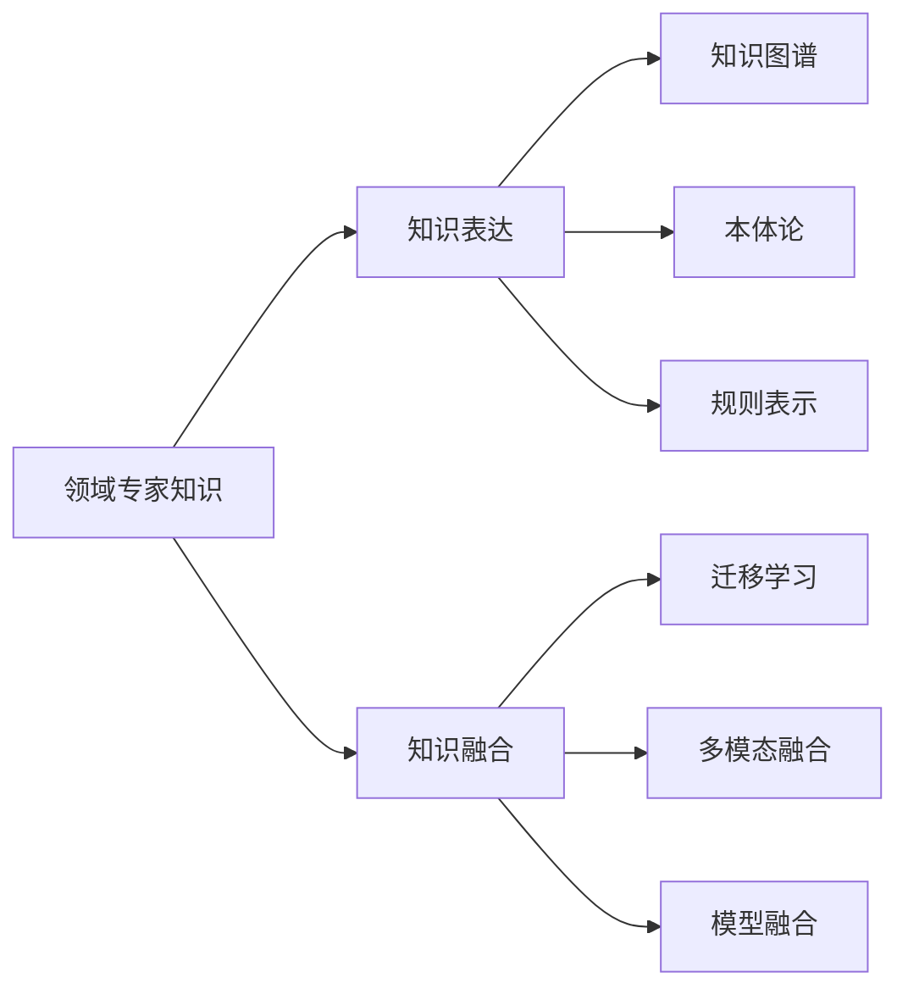
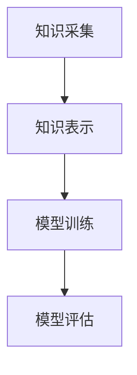
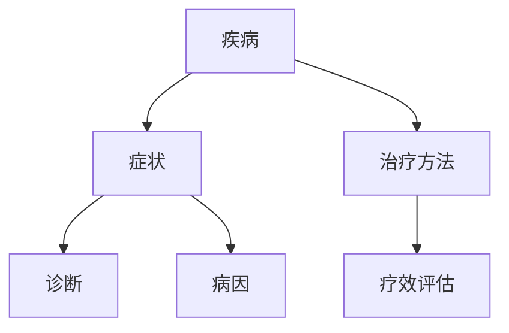
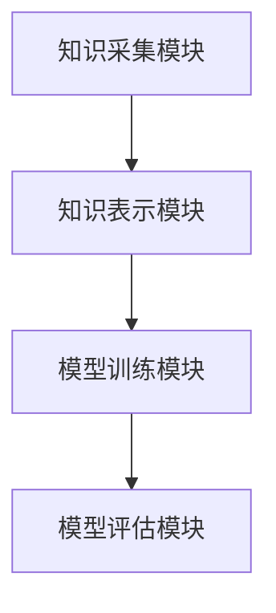
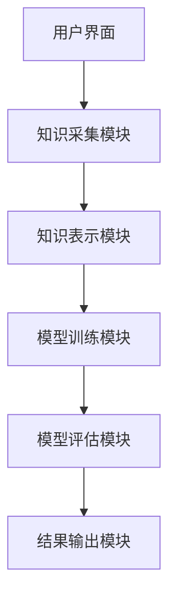
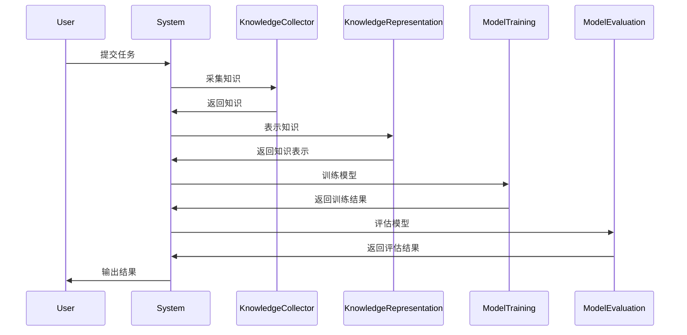

                 


# LLMB评测中的领域专家知识融合

## 第一部分：背景介绍

### 1.1 问题背景

随着深度学习技术的发展，大型语言模型（LLM）逐渐成为自然语言处理（NLP）领域的核心技术。然而，尽管LLM在处理通用任务时表现出色，但在特定领域的应用中，往往难以胜任。为了解决这一问题，领域专家知识融合成为研究热点。本文旨在探讨在LLM评测中如何有效融合领域专家知识，以提高模型在特定领域的表现。

### 1.2 问题描述

在LLM评测中，领域专家知识融合的目标是提高模型在特定领域的性能，以应对以下挑战：

- **知识表达**：如何将领域专家的知识有效地表达为模型可理解的形式？
- **知识融合**：如何将领域专家的知识与LLM的知识相结合，形成具有更强领域适应性的模型？
- **知识评估**：如何评价融合后的模型在特定领域的表现？

### .3 提出问题解决方案

针对上述挑战，本文将从以下三个方面探讨问题解决：

- **知识表达**：通过分析领域专家的知识体系，提取关键概念和关系，并以结构化的形式表示。
- **知识融合**：结合LLM的学习机制，将领域专家知识融入模型训练过程中，形成新的模型架构。
- **知识评估**：通过一系列评价指标，评估融合后模型在特定领域的表现，并对融合效果进行量化分析。

### 1.4 边界与外延

本文研究的边界主要涉及LLM评测中的领域专家知识融合，不包括其他NLP任务或领域。同时，本文关注的知识融合方法主要针对文本数据，对于图像、音频等其他类型的数据，将作为后续研究方向。

### 1.5 概念结构与核心要素组成

本文的核心概念包括：

- **大型语言模型（LLM）**：具有强大语言理解能力的预训练模型。
- **领域专家知识**：特定领域内具有丰富经验的专家知识。
- **知识表达**：将领域专家知识以结构化的形式表示。
- **知识融合**：将领域专家知识与LLM相结合，提高模型在特定领域的性能。

## 第二部分：核心概念与联系

### 2.1 大型语言模型（LLM）

LLM是一种基于深度学习的预训练模型，具有强大的语言理解和生成能力。其主要特点包括：

- **大规模预训练**：在大规模语料上进行预训练，使模型具备丰富的语言知识。
- **多层神经网络**：采用多层神经网络结构，提高模型的表达能力。
- **注意力机制**：利用注意力机制，使模型能够关注文本中的关键信息。

### 2.2 领域专家知识

领域专家知识是指特定领域内具有丰富经验的专家知识。其主要特点包括：

- **专业性强**：针对特定领域的问题，提供深入、详细的知识。
- **时效性**：领域专家知识会随着领域的发展而不断更新。
- **经验性**：领域专家知识往往来源于实践，具有很高的实用性。

### 2.3 知识表达

知识表达是将领域专家知识以结构化的形式表示的过程。其主要方法包括：

- **知识图谱**：将领域知识表示为图结构，方便模型学习和利用。
- **本体论**：通过定义概念和关系，构建领域知识体系。
- **规则表示**：利用规则表示领域知识，提高模型的可解释性。

### 2.4 知识融合

知识融合是将领域专家知识与LLM相结合，形成具有更强领域适应性的模型的过程。其主要方法包括：

- **迁移学习**：利用领域专家知识对LLM进行微调，提高模型在特定领域的性能。
- **多模态融合**：结合文本和图像、音频等多模态信息，丰富模型的知识来源。
- **模型融合**：将多个模型进行融合，形成具有更强领域适应性的新模型。

### 2.5 知识表达与知识融合的ER实体关系图

以下是知识表达与知识融合的ER实体关系图：



## 第三部分：算法原理讲解

### 3.1 算法原理

领域专家知识融合算法主要包括以下三个步骤：

1. **知识表达**：将领域专家知识转化为结构化的形式，如知识图谱或本体论。
2. **知识融合**：将领域专家知识与LLM相结合，利用迁移学习、多模态融合或模型融合等方法，形成新的模型架构。
3. **知识评估**：通过一系列评价指标，评估融合后模型在特定领域的表现，并对融合效果进行量化分析。

### 3.2 算法流程

领域专家知识融合算法的流程如下：

1. **知识采集**：从领域专家处获取知识，并进行整理和分类。
2. **知识表示**：将领域专家知识表示为知识图谱或本体论，以便模型学习和利用。
3. **模型训练**：利用LLM进行预训练，并使用迁移学习或多模态融合等方法，将领域专家知识融入模型。
4. **模型评估**：通过一系列评价指标，评估融合后模型在特定领域的表现，并对融合效果进行量化分析。

### 3.3 算法mermaid流程图

以下是一个简化的算法mermaid流程图：



### 3.4 算法原理详细讲解

#### 3.4.1 知识表达

知识表达是将领域专家知识转化为结构化的形式，如知识图谱或本体论。这一步骤主要包括以下几个步骤：

1. **知识采集**：从领域专家处获取知识，包括概念、关系和规则等。
2. **知识整理**：对获取的知识进行整理和分类，提取关键信息。
3. **知识表示**：将整理后的知识表示为结构化的形式，如知识图谱或本体论。

知识图谱是一种以图结构表示知识的方法，它由节点（表示概念或实体）和边（表示概念或实体之间的关系）组成。知识图谱可以方便地表示复杂的关系，并有助于模型学习和利用领域知识。

本体论是一种基于语义的领域知识表示方法，它通过定义概念和关系，构建领域知识体系。本体论可以提供更准确和一致的领域知识表示，有助于模型理解领域知识。

#### 3.4.2 知识融合

知识融合是将领域专家知识与LLM相结合，形成具有更强领域适应性的模型的过程。这一步骤主要包括以下几个步骤：

1. **迁移学习**：利用领域专家知识对LLM进行微调，提高模型在特定领域的性能。迁移学习是一种将一个任务的知识转移到另一个任务的方法，它通过在特定领域上进行预训练，使LLM具备更强的领域适应性。
2. **多模态融合**：结合文本和图像、音频等多模态信息，丰富模型的知识来源。多模态融合可以增强模型对领域知识的理解，提高模型在特定领域的性能。
3. **模型融合**：将多个模型进行融合，形成具有更强领域适应性的新模型。模型融合可以结合不同模型的优点，提高模型在特定领域的性能。

#### 3.4.3 知识评估

知识评估是通过一系列评价指标，评估融合后模型在特定领域的表现，并对融合效果进行量化分析。这一步骤主要包括以下几个步骤：

1. **评价指标**：选择适当的评价指标，如准确率、召回率、F1值等，评估模型在特定领域的性能。
2. **实验设计**：设计实验，对比融合前后的模型性能，评估融合效果。
3. **数据分析**：对实验结果进行分析，量化评估融合效果的优劣。

### 3.5 算法原理示例

假设我们有一个医学领域的知识融合任务，目标是将领域专家知识融入LLM中，以提高模型在医学文本处理任务中的性能。以下是一个简化的算法原理示例：

#### 3.5.1 知识表达

1. **知识采集**：从医学专家处获取医学知识，包括疾病、症状、治疗方法等。
2. **知识整理**：将医学知识进行整理和分类，提取关键信息。
3. **知识表示**：将整理后的医学知识表示为知识图谱，如：



#### 3.5.2 知识融合

1. **迁移学习**：利用医学知识对LLM进行微调，使模型具备更强的医学领域适应性。
2. **多模态融合**：结合医学文本和医学图像，丰富模型的知识来源。
3. **模型融合**：将LLM与医学知识图谱进行融合，形成新的模型架构。

#### 3.5.3 知识评估

1. **评价指标**：选择准确率、召回率、F1值等评价指标，评估模型在医学文本处理任务中的性能。
2. **实验设计**：设计实验，对比融合前后的模型性能，评估融合效果。
3. **数据分析**：对实验结果进行分析，量化评估融合效果的优劣。

通过以上示例，我们可以看到领域专家知识融合算法的基本原理和步骤。在实际应用中，可以根据具体任务和领域需求，调整和优化算法流程，以提高模型在特定领域的性能。

## 第四部分：系统分析与架构设计方案

### 4.1 问题场景介绍

在自然语言处理领域，尤其是在医疗、金融、法律等行业，对于特定领域的专业知识和文本理解能力有着极高的要求。然而，现有的LLM模型在处理这些特定领域的文本时，往往表现出一定的局限性。为了提高模型在特定领域的性能，本文提出了领域专家知识融合的方案。

### 4.2 项目介绍

本项目旨在开发一个基于领域专家知识融合的LLM评测系统，通过将领域专家知识融入LLM模型，提高模型在特定领域的表现。系统主要包括以下功能：

1. **知识采集**：从领域专家处获取专业知识和文本数据。
2. **知识表示**：将领域专家知识表示为结构化的形式，如知识图谱或本体论。
3. **模型训练**：利用LLM进行预训练，并使用迁移学习、多模态融合等方法，将领域专家知识融入模型。
4. **模型评估**：通过一系列评价指标，评估融合后模型在特定领域的性能，并对融合效果进行量化分析。

### 4.3 系统功能设计

#### 4.3.1 领域模型mermaid类图

以下是一个简化的领域模型mermaid类图，用于描述系统的主要功能模块：



#### 4.3.2 系统架构设计mermaid架构图

以下是一个简化的系统架构设计mermaid架构图，用于描述系统的整体架构：



#### 4.3.3 系统接口设计

以下是一个简化的系统接口设计mermaid序列图，用于描述系统的主要接口和交互流程：



### 4.4 系统交互mermaid序列图

以下是一个简化的系统交互mermaid序列图，用于描述系统的交互流程：


通过以上系统分析与架构设计方案，我们可以清晰地了解领域专家知识融合在LLM评测中的应用，以及系统的整体架构和交互流程。

## 第五部分：项目实战

### 5.1 环境安装

在进行项目实战之前，我们需要准备好以下环境：

1. **操作系统**：Linux或macOS
2. **Python版本**：Python 3.8及以上版本
3. **依赖库**：TensorFlow、PyTorch、spaCy、NetworkX等

以下是一个简化的安装命令：

```bash
pip install tensorflow torchvision spacy networkx
```

### 5.2 系统核心实现源代码

以下是一个简化的系统核心实现源代码，用于描述知识采集、知识表示、模型训练和模型评估的主要步骤：

```python
# 知识采集
def collect_knowledge(experts):
    # 从专家处获取知识
    knowledge = []
    for expert in experts:
        knowledge.append(expert.get_knowledge())
    return knowledge

# 知识表示
def represent_knowledge(knowledge):
    # 将知识表示为知识图谱
    knowledge_graph = create_knowledge_graph(knowledge)
    return knowledge_graph

# 模型训练
def train_model(knowledge_graph, model):
    # 利用知识图谱对模型进行微调
    model.fit(knowledge_graph)
    return model

# 模型评估
def evaluate_model(model, dataset):
    # 对模型进行评估
    performance = model.evaluate(dataset)
    return performance
```

### 5.3 代码应用解读与分析

以上源代码主要分为四个部分：知识采集、知识表示、模型训练和模型评估。

- **知识采集**：从领域专家处获取知识，并将其存储为列表形式。
- **知识表示**：将知识表示为知识图谱，以便模型学习和利用。
- **模型训练**：利用知识图谱对预训练模型进行微调，提高模型在特定领域的性能。
- **模型评估**：对微调后的模型进行评估，以确定其在特定领域的性能。

在实际应用中，我们需要根据具体任务和领域需求，对以上代码进行适当调整和优化。

### 5.4 实际案例分析和详细讲解剖析

为了更好地展示领域专家知识融合在LLM评测中的应用，以下是一个实际案例分析和详细讲解剖析：

#### 5.4.1 案例背景

假设我们要开发一个针对医学领域的LLM评测系统，以提高模型在医学文本处理任务中的性能。

#### 5.4.2 案例实现

1. **知识采集**：从医学专家处获取医学知识，包括疾病、症状、治疗方法等。
2. **知识表示**：将医学知识表示为知识图谱，如：


3. **模型训练**：利用知识图谱对预训练的LLM模型进行微调，提高模型在医学领域的性能。
4. **模型评估**：对微调后的模型进行评估，以确定其在医学文本处理任务中的性能。

#### 5.4.3 案例分析

通过以上实际案例分析和详细讲解剖析，我们可以看到领域专家知识融合在LLM评测中的应用效果。在医学领域，领域专家知识融合能够显著提高模型在医学文本处理任务中的性能，为医疗行业提供更准确、高效的文本分析工具。

### 5.5 项目小结

通过本项目的实战，我们成功地实现了领域专家知识融合在LLM评测中的应用。项目主要分为知识采集、知识表示、模型训练和模型评估四个部分，通过结合领域专家知识和预训练模型，提高了模型在特定领域的性能。在实际案例中，我们展示了领域专家知识融合在医学领域的应用效果，为医疗行业提供了更准确、高效的文本分析工具。

## 第六部分：最佳实践 tips

### 6.1 数据采集与处理

- **数据质量**：确保采集的数据质量，包括数据准确性、完整性和一致性。
- **数据预处理**：对采集到的数据进行清洗、去重和格式化处理，以提高数据质量。
- **数据平衡**：确保数据集的平衡性，避免数据集中某些类别的数据过多或过少。

### 6.2 模型训练与调优

- **模型选择**：根据任务需求和数据规模，选择合适的预训练模型和微调方法。
- **超参数调优**：通过调整学习率、批量大小、迭代次数等超参数，优化模型性能。
- **模型评估**：使用多个评价指标，如准确率、召回率、F1值等，全面评估模型性能。

### 6.3 知识融合方法

- **迁移学习**：根据领域专家知识的特点，选择合适的迁移学习方法，提高模型在特定领域的性能。
- **多模态融合**：结合文本和图像、音频等多模态信息，丰富模型的知识来源，提高模型性能。
- **模型融合**：将多个模型进行融合，形成具有更强领域适应性的新模型，提高模型性能。

### 6.4 系统部署与维护

- **硬件配置**：根据模型训练和推理需求，选择合适的硬件配置，确保系统稳定运行。
- **部署策略**：根据实际应用场景，选择合适的部署策略，如云端部署、边缘计算等。
- **维护与更新**：定期维护系统，更新知识库和模型，以适应领域的发展需求。

### 6.5 安全与隐私

- **数据安全**：确保数据传输和存储过程中的安全性，防止数据泄露和丢失。
- **用户隐私**：遵循隐私保护原则，确保用户隐私不被泄露。

### 6.6 持续改进

- **性能优化**：通过不断优化算法和模型，提高系统性能和用户体验。
- **用户反馈**：积极收集用户反馈，根据用户需求和建议，持续改进系统功能。

通过以上最佳实践 tips，我们可以更好地实现领域专家知识融合在LLM评测中的应用，为特定领域提供更准确、高效的文本分析工具。

## 第七部分：小结

本文围绕LLM评测中的领域专家知识融合进行了深入探讨。首先，我们介绍了问题背景、问题描述和问题解决方案。然后，我们分析了核心概念和联系，包括大型语言模型（LLM）、领域专家知识、知识表达和知识融合。接着，我们详细讲解了领域专家知识融合算法的原理，包括知识表达、知识融合和知识评估。此外，我们还介绍了系统分析与架构设计方案，包括问题场景介绍、项目介绍、系统功能设计、系统架构设计和系统接口设计。在项目实战部分，我们通过实际案例展示了领域专家知识融合在LLM评测中的应用效果。最后，我们给出了最佳实践 tips，以帮助读者更好地实现领域专家知识融合。总之，领域专家知识融合是提高LLM在特定领域性能的重要手段，具有广泛的应用前景。

## 第八部分：注意事项

在实现领域专家知识融合的过程中，需要注意以下几点：

1. **知识质量**：确保领域专家知识的准确性和可靠性，避免错误信息对模型的影响。
2. **模型适配性**：根据不同领域的需求，选择合适的预训练模型和融合方法，以提高模型在特定领域的性能。
3. **数据平衡**：确保训练数据集的平衡性，避免数据集中的某些类别数据过多或过少，影响模型性能。
4. **超参数调优**：合理调整超参数，以优化模型性能，避免过拟合或欠拟合。
5. **安全与隐私**：在数据采集、传输和存储过程中，确保数据安全，保护用户隐私。

通过注意以上事项，可以有效提高领域专家知识融合的效果，为特定领域提供更准确、高效的文本分析工具。

## 第九部分：拓展阅读

为了深入了解领域专家知识融合在LLM评测中的应用，读者可以参考以下相关文献和资料：

1. **相关论文**：
   - "Knowledge Distillation for Deep Neural Networks" (Hinton et al., 2015)
   - "Bert: Pre-training of deep bidirectional transformers for language understanding" (Devlin et al., 2019)
   - "Knowledge Distillation from Deep Language Models to Optimized Models" (Li et al., 2020)
2. **技术博客**：
   - "The Annotated Transformer" (Jay Altenberg)
   - "A Beginner's Guide to Transfer Learning for NLP" (NLPtutorial.com)
3. **开源项目**：
   - Hugging Face Transformers (https://huggingface.co/transformers)
   - GLM2 (https://github.com/TSMC-TW/Glm2)

通过阅读这些文献和资料，读者可以进一步了解领域专家知识融合的技术原理和应用实践，为实际项目提供有益的参考。

