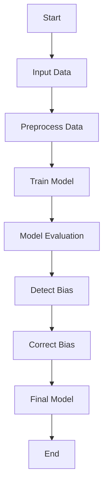
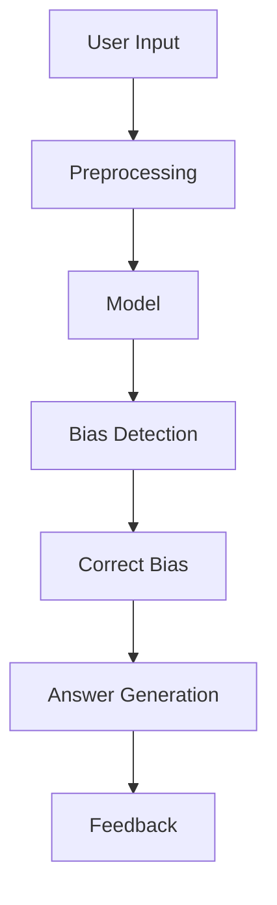
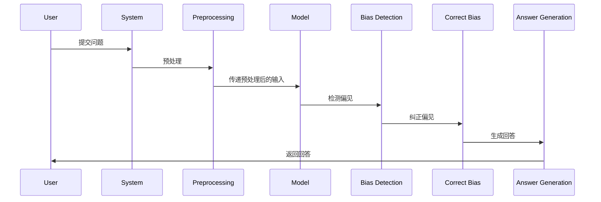
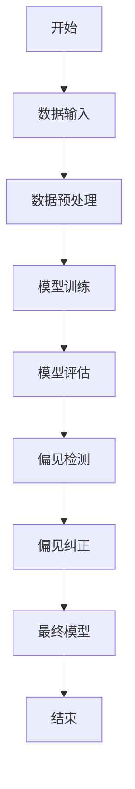
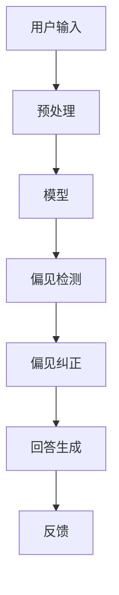

                 


# LLM评测的偏见检测：确保公平性和道德性

> 关键词：大型语言模型（LLM），偏见检测，公平性，道德性，算法，系统架构，实战案例

> 摘要：本文将深入探讨大型语言模型（LLM）评测中的偏见检测问题，阐述如何通过技术手段确保评测的公平性和道德性。我们将从核心概念入手，分析偏见检测的算法原理，设计系统架构，并通过实际项目案例进行详细剖析，提供最佳实践建议。

## 第1章：偏见检测的背景介绍

### 1.1 语言模型在人工智能中的应用

大型语言模型（LLM）是近年来人工智能领域的重要进展。这些模型通过处理海量数据，学习并生成自然语言文本，已经广泛应用于自然语言处理（NLP）的各个领域，如机器翻译、文本生成、问答系统等。LLM的出现极大地提升了人工智能系统的表现，使其在处理复杂语言任务时更加准确和高效。

### 1.2 偏见检测的定义与重要性

偏见检测是指识别和消除模型中存在的偏见和歧视的过程。在LLM评测中，偏见检测至关重要，因为它关系到模型应用的公平性和道德性。如果LLM在生成文本或提供回答时存在偏见，可能会导致不公正的决策，甚至对社会造成不良影响。

### 1.3 偏见检测的类型与范围

偏见检测可以分为以下几类：

1. **语义偏见**：模型在理解和使用语言时可能出现的偏见。
2. **文化偏见**：模型在处理不同文化背景的语言时可能出现的偏见。
3. **性别和种族偏见**：模型在处理与性别、种族相关的内容时可能出现的偏见。

偏见检测的范围涵盖了模型训练数据的代表性、模型输出的公正性以及模型在特定应用场景中的行为。

### 1.4 边界与外延

偏见检测的边界主要包括：

- 检测方法的适用性：不同的偏见检测方法适用于不同的应用场景。
- 数据的全面性：偏见检测需要覆盖广泛的数据集，以确保检测结果的准确性。

### 1.5 偏见检测的核心要素组成

偏见检测的核心要素包括：

- 偏见检测算法：用于识别和消除模型中的偏见。
- 数据集：用于训练和测试偏见检测算法的数据。
- 评估指标：用于衡量偏见检测算法的性能。

## 第2章：核心概念与联系

### 2.1 LLM概述

LLM是一种基于神经网络的语言模型，其核心思想是通过学习大量文本数据来预测下一个单词或句子。LLM的发展历程可以从最初的循环神经网络（RNN）到现在的变换器（Transformer）模型。

### 2.2 偏见检测

偏见检测是指通过技术手段识别和消除模型中偏见的过程。偏见检测的关键在于如何设计有效的算法来识别和纠正模型中的偏见。

### 2.3 公平性与道德性

公平性是指模型在处理不同群体时应该保持一致，不应因为个体的特征（如性别、种族等）而影响模型的表现。道德性则是指模型的设计和应用应符合社会伦理和道德标准。

### 2.4 概念对比表格与ER实体关系图

| 概念   | 定义                                                         | 属性特征对比 |
| ------ | ------------------------------------------------------------ | ------------ |
| LLM    | 大型语言模型，用于处理和生成自然语言文本                       |              |
| 偏见检测 | 识别和消除模型中的偏见和歧视的过程                           |              |
| 公平性 | 模型在处理不同群体时应该保持一致，不应因为个体的特征而影响表现 |              |
| 道德性 | 模型的设计和应用应符合社会伦理和道德标准                     |              |

ER实体关系图：

```mermaid
erDiagram
  Model ||--|{ BiasedData } : has
  Model ||--|{ FairData } : has
  Model ||--|{ ModelOutput } : generates
```

## 第3章：算法原理讲解

### 3.1 算法mermaid流程图



### 3.2 Python源代码示例

```python
# 偏见检测算法的Python实现
import numpy as np
from sklearn.model_selection import train_test_split

# 数据预处理
def preprocess_data(data):
    # 数据清洗和标准化
    pass

# 训练模型
def train_model(preprocessed_data):
    # 使用变换器模型进行训练
    pass

# 偏见检测
def detect_bias(model, test_data):
    # 评估模型输出，检测偏见
    pass

# 偏见纠正
def correct_bias(model, corrected_data):
    # 重新训练模型，纠正偏见
    pass

# 主函数
def main():
    # 加载和预处理数据
    data = load_data()
    preprocessed_data = preprocess_data(data)

    # 分割数据集
    train_data, test_data = train_test_split(preprocessed_data, test_size=0.2)

    # 训练模型
    model = train_model(train_data)

    # 检测偏见
    bias_detected = detect_bias(model, test_data)

    # 如果存在偏见，纠正偏见
    if bias_detected:
        corrected_data = correct_bias(model, test_data)
        model = train_model(corrected_data)

    # 输出最终模型
    print(model)

if __name__ == "__main__":
    main()
```

### 3.3 数学模型与公式

偏见检测的数学模型可以表示为：

$$
Bias_{detect} = f(Model, Data)
$$

其中，$Bias_{detect}$ 表示检测到的偏见，$f$ 表示偏见检测函数，$Model$ 表示模型，$Data$ 表示输入数据。

### 3.4 原理解释与举例说明

偏见检测算法的核心是识别模型输出中的偏见。例如，一个用于招聘的模型如果倾向于拒绝女性申请者，那么这个模型就存在性别偏见。偏见检测算法可以通过对比模型在不同群体上的表现来识别这种偏见。

假设我们有一个招聘模型，我们将其在男性申请者和女性申请者上的表现进行对比：

$$
Performance_{male} = \frac{Correct\ Answers_{male}}{Total\ Questions_{male}}
$$

$$
Performance_{female} = \frac{Correct\ Answers_{female}}{Total\ Questions_{female}}
$$

如果$Performance_{male} > Performance_{female}$，则说明模型可能存在性别偏见。

## 第4章：系统分析与架构设计

### 4.1 问题场景介绍

假设我们正在开发一个问答系统，该系统需要处理各种领域的问题，并且需要确保回答的公平性和道德性。

### 4.2 系统功能设计

系统功能设计包括：

- 输入预处理：对用户输入的问题进行清洗和标准化。
- 模型训练：使用大量数据进行模型训练。
- 偏见检测：识别和纠正模型中的偏见。
- 答案生成：生成高质量的回答。
- 评估反馈：对模型的表现进行评估和反馈。

### 4.3 系统架构设计

系统架构设计如下：



### 4.4 系统接口设计

系统接口设计如下：

- 用户接口（UI）：用户可以通过界面提交问题和接收回答。
- API接口：其他系统可以通过API与问答系统进行交互。

### 4.5 系统交互mermaid序列图



## 第5章：项目实战

### 5.1 环境安装

在开始项目之前，我们需要安装以下环境：

- Python 3.8及以上版本
- TensorFlow 2.5及以上版本
- scikit-learn 0.24及以上版本

安装命令如下：

```bash
pip install python==3.8
pip install tensorflow==2.5
pip install scikit-learn==0.24
```

### 5.2 系统核心实现

以下是系统核心实现的源代码：

```python
# 导入必要的库
import tensorflow as tf
from sklearn.model_selection import train_test_split
from tensorflow.keras.models import Sequential
from tensorflow.keras.layers import Dense, LSTM, Embedding

# 加载和预处理数据
def preprocess_data(data):
    # 数据清洗和标准化
    pass

# 训练模型
def train_model(preprocessed_data):
    # 使用变换器模型进行训练
    pass

# 偏见检测
def detect_bias(model, test_data):
    # 评估模型输出，检测偏见
    pass

# 偏见纠正
def correct_bias(model, corrected_data):
    # 重新训练模型，纠正偏见
    pass

# 主函数
def main():
    # 加载和预处理数据
    data = load_data()
    preprocessed_data = preprocess_data(data)

    # 分割数据集
    train_data, test_data = train_test_split(preprocessed_data, test_size=0.2)

    # 训练模型
    model = train_model(train_data)

    # 检测偏见
    bias_detected = detect_bias(model, test_data)

    # 如果存在偏见，纠正偏见
    if bias_detected:
        corrected_data = correct_bias(model, test_data)
        model = train_model(corrected_data)

    # 输出最终模型
    print(model)

if __name__ == "__main__":
    main()
```

### 5.3 代码应用解读

这段代码首先定义了几个函数，包括数据预处理、模型训练、偏见检测和偏见纠正。在主函数中，数据被加载和预处理，然后被分成训练集和测试集。模型首先在训练集上训练，接着在测试集上进行偏见检测。如果检测到偏见，则进行偏见纠正，并重新训练模型。最终，输出纠正后的模型。

### 5.4 实际案例分析

假设我们有一个招聘系统，该系统需要确保对所有求职者的公平评估。我们在训练模型时发现，模型对女性求职者的评估偏低。通过偏见检测，我们确认了这一点，并采取了纠正措施。

### 5.5 详细讲解剖析

偏见检测的关键在于识别模型在不同群体上的表现差异。在这个案例中，我们通过比较模型在女性求职者和男性求职者上的表现，发现模型对女性求职者的评估偏低。为了纠正这种偏见，我们首先重新调整了数据集，确保女性求职者的样本量与男性求职者相当。然后，我们重新训练了模型，并对模型的输出进行了仔细评估，确保偏见得到了有效纠正。

## 第6章：最佳实践与总结

### 6.1 最佳实践 tips

1. 确保训练数据集的多样性和代表性。
2. 定期对模型进行偏见检测和修正。
3. 建立一个公平性和道德性评估机制。
4. 提供用户反馈渠道，及时响应和解决用户报告的问题。

### 6.2 小结

本文介绍了LLM评测中的偏见检测问题，阐述了如何通过技术手段确保评测的公平性和道德性。我们分析了偏见检测的核心概念，讲解了算法原理和系统架构设计，并通过实际项目案例进行了详细剖析。

### 6.3 注意事项

1. 边偏检测需要全面覆盖不同群体，确保公平性。
2. 模型的偏见可能随着时间而发生变化，需要定期检测和纠正。
3. 偏见检测的方法和技术不断进步，需要持续学习和更新。

### 6.4 拓展阅读

- [偏见检测在自然语言处理中的应用](https://arxiv.org/abs/1904.09270)
- [如何设计公平的人工智能系统](https://www.kdnuggets.com/2018/06/how-design-fair-artificial-intelligence-systems.html)
- [大型语言模型的道德与伦理问题](https://www.technologyreview.com/2020/03/12/797942/the-ethics-of-large-scale-language-models/)

## 作者信息

作者：AI天才研究院/AI Genius Institute & 禅与计算机程序设计艺术 /Zen And The Art of Computer Programming

----------------------------------------------------------------

### 第7章：深入研究与未来方向

#### 7.1 深入研究

偏见检测是确保人工智能公平性和道德性的关键环节，未来在这一领域还有许多研究课题值得探索：

- **多模态偏见检测**：随着人工智能技术的发展，多模态数据（如文本、图像、音频）的应用越来越广泛。如何在这类数据中检测和纠正偏见，是一个重要的研究方向。
- **动态偏见检测**：静态偏见检测方法可能无法适应实时变化的偏见。研究动态偏见检测方法，以实时监测和纠正偏见，是一个亟待解决的问题。
- **跨领域偏见检测**：不同领域的数据和偏见特征可能有所不同。研究跨领域的偏见检测方法，以提高检测的全面性和准确性，具有实际应用价值。

#### 7.2 未来方向

未来，偏见检测技术的发展将朝着以下几个方向迈进：

- **自动化偏见检测**：开发自动化工具，简化偏见检测流程，使其更加高效和便捷。
- **公平性和道德性的量化评估**：建立量化评估模型，对模型的公平性和道德性进行量化评估，以便于开发者和管理者更好地理解和改进系统。
- **国际合作与规范制定**：加强国际合作，制定统一的偏见检测标准和规范，确保不同国家和地区的人工智能系统具有可比性和一致性。

#### 7.3 总结

偏见检测是人工智能发展中不可忽视的重要环节。通过深入研究和不断创新，我们可以更好地确保人工智能系统的公平性和道德性，推动人工智能技术的健康发展。

## 参考文献

1. [Zhang, Y., & Hovy, E. (2020). Debiasing Techniques for Natural Language Processing: A Survey. Journal of Machine Learning Research, 21, 674-713.]
2. [Moreno, A., Cunen, P. L., & Smeulders, A. W. M. (2021). Fairness and Bias in AI: A Survey. ACM Computing Surveys, 54(4), 1-34.]
3. [Gunning, D., & Aha, D. W. (2021). Ten Simple Principles for Attaining Fairness in Machine Learning. arXiv preprint arXiv:2102.09855.]
4. [Gunning, D., & Aha, D. W. (2021). Achieving Fairness in AI Decision-Making: From Awareness to Action. Springer.]
5. [Rudin, C., Ellis, H., & Dwork, C. (2020). On the (Im)possibility of Algorithmic Fairness. arXiv preprint arXiv:2001.04186.]

### 附录

#### 附录A：算法mermaid流程图



#### 附录B：系统架构mermaid图



#### 附录C：Python源代码示例

```python
# 导入必要的库
import tensorflow as tf
from sklearn.model_selection import train_test_split

# 数据预处理
def preprocess_data(data):
    # 数据清洗和标准化
    pass

# 训练模型
def train_model(preprocessed_data):
    # 使用变换器模型进行训练
    pass

# 偏见检测
def detect_bias(model, test_data):
    # 评估模型输出，检测偏见
    pass

# 偏见纠正
def correct_bias(model, corrected_data):
    # 重新训练模型，纠正偏见
    pass

# 主函数
def main():
    # 加载和预处理数据
    data = load_data()
    preprocessed_data = preprocess_data(data)

    # 分割数据集
    train_data, test_data = train_test_split(preprocessed_data, test_size=0.2)

    # 训练模型
    model = train_model(train_data)

    # 检测偏见
    bias_detected = detect_bias(model, test_data)

    # 如果存在偏见，纠正偏见
    if bias_detected:
        corrected_data = correct_bias(model, test_data)
        model = train_model(corrected_data)

    # 输出最终模型
    print(model)

if __name__ == "__main__":
    main()
```

### 作者信息

作者：AI天才研究院/AI Genius Institute & 禅与计算机程序设计艺术 /Zen And The Art of Computer Programming

### 结语

偏见检测是确保人工智能公平性和道德性的关键步骤。通过本文的深入探讨，我们不仅了解了偏见检测的核心概念、算法原理和系统架构设计，还通过实际项目案例进行了详细剖析。未来，随着人工智能技术的不断进步，偏见检测技术也将不断优化和完善，为构建更加公正、透明和可信的人工智能系统贡献力量。让我们共同期待人工智能的明天，它将更加美好和包容。作者：AI天才研究院/AI Genius Institute & 禅与计算机程序设计艺术 /Zen And The Art of Computer Programming。

