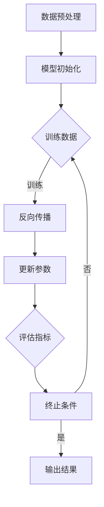
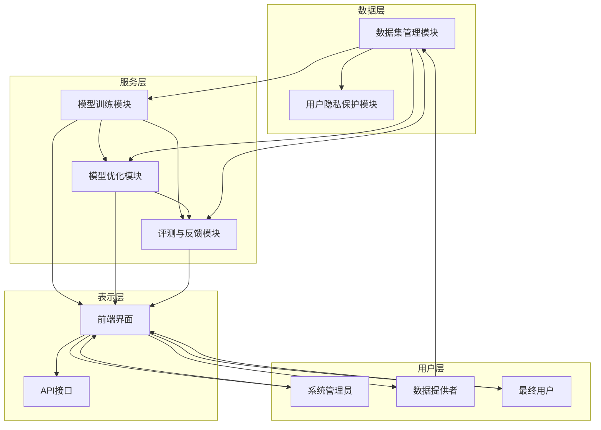
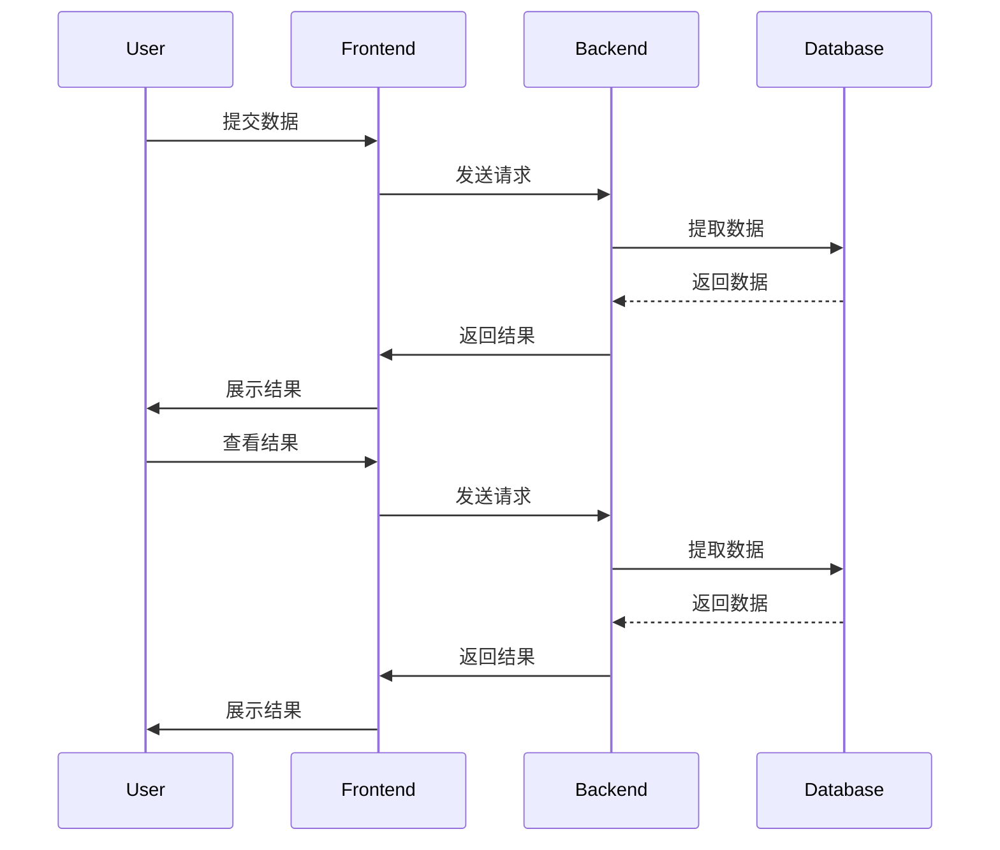

                 

### 第1章: 问题背景

#### 1.1 人工智能的发展与挑战

人工智能（Artificial Intelligence, AI）作为一种模拟人类智能的技术，近年来取得了飞速的发展。AI技术在图像识别、自然语言处理、自动驾驶等领域已经取得了显著的成果，并开始逐步渗透到我们的日常生活中。然而，随着AI技术的广泛应用，一系列挑战也逐渐显现出来。

首先，数据的质量和多样性成为AI发展的关键因素。AI模型的表现很大程度上取决于训练数据的质量和多样性。然而，现实中往往存在数据不完整、不准确、有偏见的情况，这些因素都会对模型的性能产生负面影响。

其次，算法的透明性和解释性也是一个重要挑战。传统上，AI模型被视为“黑箱”，其内部的决策过程往往难以理解和解释。这不仅限制了AI技术的应用范围，也引发了关于隐私、公平性等伦理问题的讨论。

此外，AI技术的快速发展也带来了一定的安全隐患。恶意使用AI技术可能会造成严重的社会影响，例如自动化武器、虚假信息传播等。

#### 1.2 语言模型（LLM）的应用场景

语言模型（Large Language Model, LLM）是AI技术中的重要组成部分，尤其在自然语言处理（Natural Language Processing, NLP）领域得到了广泛应用。LLM能够理解和生成自然语言，从而实现文本分类、机器翻译、问答系统等任务。

在实际应用中，LLM已经展现出巨大的潜力。例如，在搜索引擎中，LLM可以帮助用户更准确地理解查询意图，提供更相关的搜索结果。在客服系统中，LLM可以与用户进行自然对话，提高客服效率。在教育领域，LLM可以为学生提供个性化的学习资源，辅助教学。

然而，随着LLM的广泛应用，其数据偏见和算法偏见问题也日益突出。数据偏见可能导致模型在某些特定群体上的性能不佳，而算法偏见则可能导致模型对某些用户群体的偏见。这些问题不仅影响了模型的性能，也引发了关于公平性和伦理的担忧。

#### 1.3 数据和算法偏见带来的问题

数据偏见和算法偏见是当前AI领域中的热点问题。数据偏见通常是指训练数据中存在的系统性偏差，这些偏差可能会在模型中传递并放大。例如，如果训练数据中包含性别歧视、种族歧视等偏见，那么模型很可能会在这些方面表现出偏见。

算法偏见则是指算法在决策过程中表现出的系统性偏差。这种偏见可能是由于算法设计中的缺陷、训练数据的不完善，或者是对某些特征过度依赖等原因造成的。算法偏见可能会导致模型在某些特定群体上的表现不佳，甚至引发社会不公。

具体来说，数据偏见和算法偏见可能会带来以下几个问题：

1. **模型性能下降**：数据偏见和算法偏见会降低模型的准确性和鲁棒性，从而影响其在实际应用中的效果。
2. **社会不公平**：模型在决策过程中表现出的偏见可能会导致某些群体受到不公平对待，例如在招聘、贷款、教育等领域的歧视。
3. **隐私侵犯**：算法偏见可能会揭示用户的一些敏感信息，从而侵犯用户的隐私权。
4. **道德风险**：算法偏见可能会加剧社会不平等，引发道德和伦理争议。

因此，保障LLM评测的公平性，消除数据和算法偏见，成为当前AI领域的一个重要课题。

#### 1.4 问题解决

为了解决数据和算法偏见问题，我们可以从以下几个方面入手：

1. **数据多样性**：通过引入更多样化的数据，减少数据偏见。例如，可以使用交叉验证、数据增强等技术，提高训练数据的多样性。
2. **算法改进**：改进算法设计，减少算法偏见。例如，使用加权损失函数、优化算法训练过程等。
3. **透明性与解释性**：提高算法的透明性和解释性，帮助用户理解模型的决策过程，从而降低偏见。
4. **伦理与法律约束**：制定相关的伦理和法律规范，限制算法偏见的使用，确保AI技术的公平性和合法性。

#### 1.5 边界与外延

公平性是一个多维度的概念，包括性别、种族、文化、年龄等多个方面。因此，在保障LLM评测公平性时，我们需要综合考虑这些因素，避免单一维度的偏见。

此外，影响评测的因素还包括数据质量、算法设计、用户反馈等。例如，数据质量差可能导致模型偏见，而用户反馈则可以用来调整和优化算法。

为了更清晰地展示LLM的核心概念和要素组成，我们可以使用ER（Entity-Relationship）实体关系图来描述。ER图可以直观地展示数据实体及其关系，有助于我们更好地理解LLM的组成结构。

#### 1.6 概念结构与核心要素组成

语言模型（LLM）的核心概念包括数据集、模型架构、训练过程、评估指标等。下面是LLM的主要组成部分：

1. **数据集**：数据集是LLM的基础，其质量和多样性直接影响模型的表现。一个高质量的数据集应包含多样性的数据样本，并且要避免系统性偏见。
2. **模型架构**：模型架构决定了LLM的处理能力和性能。常见的模型架构包括循环神经网络（RNN）、变换器（Transformer）等。
3. **训练过程**：训练过程包括数据预处理、模型初始化、迭代优化等步骤。训练过程的优化方法，如梯度下降、Adam优化器等，也会影响模型的表现。
4. **评估指标**：评估指标用于衡量模型的表现，常见的评估指标包括准确率、召回率、F1分数等。

通过上述分析，我们可以看到，保障LLM评测的公平性，消除数据和算法偏见，是一个复杂但至关重要的任务。接下来，我们将深入探讨LLM的工作原理，数据偏见和算法偏见的具体表现，以及如何通过改进算法和设计来消除这些偏见。

---

### 第2章: 核心概念与联系

#### 2.1 LLM的工作原理

语言模型（LLM）是自然语言处理（NLP）领域的重要工具，其核心任务是通过学习大量文本数据，生成或理解人类语言。LLM的工作原理主要可以分为以下几个方面：

1. **数据收集与预处理**：首先，LLM需要从大量的文本数据中收集信息。这些数据可以来自网络、书籍、新闻、社交媒体等多种来源。收集到的数据需要进行预处理，包括文本清洗、分词、去停用词等步骤，以便于模型处理。

2. **模型架构**：LLM通常采用复杂的神经网络架构，如变换器（Transformer）模型。变换器模型由多个编码器和解码器层组成，可以处理长距离依赖和复杂的语义关系。

3. **训练过程**：在训练过程中，模型通过反向传播算法优化其参数。反向传播算法是一种通过计算误差梯度来调整模型参数的方法。在训练过程中，模型会不断调整其参数，以最小化预测误差。

4. **生成与理解**：训练完成后，LLM可以用于生成文本或理解文本。在生成文本时，模型会根据前文信息生成下一个词或句子。在理解文本时，模型可以提取文本的关键信息，用于回答问题、生成摘要等任务。

#### 2.2 数据偏见分析

数据偏见是指数据集中存在的系统性偏差，这些偏差可能会在模型中传递并放大。数据偏见主要表现在以下几个方面：

1. **性别偏见**：在某些数据集中，男性名字或男性相关的词汇出现频率较高，这可能导致模型在性别方面表现出偏见。

2. **种族偏见**：类似地，某些数据集中可能存在种族偏见，导致模型在种族方面表现出不公平。

3. **文化偏见**：文化偏见可能表现为对某些文化或语言的歧视，影响模型在不同文化背景下的性能。

4. **年龄偏见**：数据集中可能存在年龄偏见，影响模型对不同年龄段的适应性。

5. **地域偏见**：某些数据集可能主要来自特定地区，导致模型对其他地区的表现不佳。

数据偏见的影响主要表现在以下几个方面：

1. **模型性能下降**：数据偏见可能导致模型在某些特定群体上的性能下降，从而影响其在实际应用中的效果。

2. **社会不公平**：数据偏见可能导致模型对某些群体表现出不公平，例如在招聘、贷款、教育等领域。

3. **隐私侵犯**：数据偏见可能会揭示用户的敏感信息，从而侵犯用户的隐私权。

#### 2.3 算法偏见分析

算法偏见是指算法在决策过程中表现出的系统性偏差。算法偏见可能源于算法设计、训练数据、特征选择等多个方面。算法偏见的表现形式包括但不限于：

1. **过度拟合**：算法在训练数据上表现良好，但在新数据上表现不佳，这可能导致模型对某些特定数据样本产生偏见。

2. **特征偏见**：算法可能对某些特征给予过多关注，从而放大这些特征中的偏见。

3. **决策边界**：算法的决策边界可能对某些群体不公平，导致模型在这些群体上的性能下降。

算法偏见的影响包括：

1. **模型性能下降**：算法偏见可能导致模型在特定群体上的性能下降，从而影响其在实际应用中的效果。

2. **社会不公平**：算法偏见可能导致模型在决策过程中对某些群体表现出不公平，例如在招聘、贷款、教育等领域。

3. **隐私侵犯**：算法偏见可能会揭示用户的敏感信息，从而侵犯用户的隐私权。

#### 2.4 ER实体关系图架构

为了更好地理解LLM的组成部分及其关系，我们可以使用ER（Entity-Relationship）实体关系图来描述。ER图可以直观地展示LLM中的数据实体及其关系。

在LLM中，主要的实体包括：

1. **数据集**：包含文本数据，是模型训练的基础。
2. **模型参数**：包括权重、偏置等，用于描述模型的结构。
3. **训练日志**：记录训练过程中的关键信息，如损失函数、准确率等。
4. **评估指标**：用于衡量模型性能，如准确率、召回率、F1分数等。

ER图中的关系包括：

1. **数据集与模型参数**：数据集用于训练模型，模型参数用于描述模型的结构。
2. **模型参数与训练日志**：模型参数的调整过程会记录在训练日志中。
3. **训练日志与评估指标**：训练日志用于计算评估指标，评估指标用于衡量模型性能。

通过ER图，我们可以清晰地看到LLM中的数据实体及其关系，这有助于我们更好地理解LLM的工作原理和可能存在的问题。

### 第3章: 算法原理讲解

在深入探讨如何消除LLM评测中的数据偏见和算法偏见之前，我们需要首先理解LLM的基本算法原理。LLM的核心在于其能够通过学习大量文本数据，生成或理解自然语言。以下是LLM算法原理的详细讲解。

#### 3.1 统计学习方法基础

LLM的算法基础是统计学习理论，特别是基于概率论的模型。统计学习方法主要分为监督学习、无监督学习和半监督学习三种。对于LLM而言，主要采用的是监督学习，即利用已标记的数据进行训练。

监督学习的基本思想是通过已知输出（标记）预测未知输出。在LLM中，标记通常是指文本中的词汇或句子，输出则是预测的词汇或句子。监督学习的目标是最小化预测误差，从而提高模型的准确性和泛化能力。

在统计学习中，常用的模型包括：

1. **线性模型**：如线性回归和逻辑回归，用于预测连续值或分类结果。
2. **决策树**：通过一系列规则对数据进行分类或回归。
3. **支持向量机（SVM）**：通过找到最佳决策边界进行分类。
4. **神经网络**：特别是深度神经网络，能够处理复杂的多层非线性变换。

#### 3.2 机器学习优化方法

在LLM的训练过程中，机器学习优化方法起到了关键作用。常用的优化方法包括：

1. **梯度下降**：一种迭代优化算法，通过计算损失函数关于模型参数的梯度来更新参数，以最小化损失函数。
2. **随机梯度下降（SGD）**：与梯度下降类似，但每次迭代只使用一个样本的梯度来更新参数，从而加快收敛速度。
3. **Adam优化器**：结合了SGD和动量方法，对学习率进行调整，适用于大规模数据集和高维参数空间。

这些优化方法的核心目标是调整模型参数，使其在训练数据上达到最小损失。然而，在实际应用中，我们还需要考虑过拟合和欠拟合的问题。过拟合是指模型在训练数据上表现良好，但在新数据上表现不佳；欠拟合则是指模型在新数据上表现不佳。

为了避免过拟合，我们可以采用以下方法：

1. **交叉验证**：通过将数据集划分为训练集和验证集，评估模型在不同数据集上的表现，从而避免模型在特定子集上过度拟合。
2. **正则化**：在损失函数中添加正则项，如L1正则化、L2正则化，限制模型复杂度。
3. **dropout**：在训练过程中随机丢弃一部分神经元，从而提高模型的泛化能力。

#### 3.3 评估方法与指标

评估方法与指标是衡量LLM性能的重要手段。常用的评估指标包括：

1. **准确率**：预测正确的样本数与总样本数的比值。适用于分类问题。
2. **召回率**：预测正确的正类样本数与实际正类样本数的比值。适用于检测问题。
3. **F1分数**：准确率的调和平均，综合考虑了准确率和召回率。适用于平衡准确率和召回率的情况。
4. **ROC曲线和AUC（Area Under Curve）**：ROC曲线展示了不同阈值下的真正例率和假正例率，AUC是ROC曲线下面积，用于评估分类器的整体性能。

这些指标在不同应用场景中有不同的优先级。例如，在医学诊断中，召回率通常比准确率更重要，因为漏诊比误诊更危险。而在金融欺诈检测中，准确率可能更重要，因为误报会导致不必要的管理成本。

#### 3.4 算法流程图

为了更直观地理解LLM的算法流程，我们可以使用Mermaid绘制算法流程图。以下是一个简单的LLM算法流程图示例：



在这个流程图中，数据预处理是第一步，用于准备训练数据。模型初始化是初始化神经网络参数。接着进入训练阶段，通过反向传播算法不断更新参数，直到达到终止条件（如达到预设的迭代次数或损失函数收敛）。最后，使用评估指标评估模型性能，并根据评估结果调整模型。

#### 3.5 数学模型和公式

在LLM中，数学模型和公式起到了核心作用。以下是一些关键的数学模型和公式：

1. **损失函数**：
   $$ L(\theta) = -\frac{1}{m}\sum_{i=1}^{m}y^{(i)}\log(z^{(i)}) $$
   其中，$L(\theta)$ 是损失函数，$m$ 是样本数量，$y^{(i)}$ 是真实标签，$z^{(i)}$ 是模型预测的概率分布。

2. **梯度下降**：
   $$ \theta_{t+1} = \theta_{t} - \alpha \nabla_{\theta}L(\theta) $$
   其中，$\theta$ 是模型参数，$\alpha$ 是学习率，$\nabla_{\theta}L(\theta)$ 是损失函数关于参数的梯度。

3. **反向传播**：
   $$ \delta_{l} = \frac{\partial L}{\partial z_{l}} \odot \sigma'(z_{l-1}) $$
   其中，$\delta_{l}$ 是第$l$层的误差项，$\sigma'$ 是激活函数的导数，$\odot$ 表示逐元素乘积。

4. **激活函数**：
   $$ \sigma(z) = \frac{1}{1 + e^{-z}} $$
   激活函数用于引入非线性变换，常用的有Sigmoid、ReLU等。

这些数学模型和公式构成了LLM的核心，是理解和优化LLM性能的基础。

#### 3.6 算法举例说明

为了更好地理解LLM的算法原理，我们可以通过一个简单的例子来讲解。假设我们有一个二元分类问题，目标是要判断一个句子是否包含特定关键词。我们可以使用一个简单的多层感知器（MLP）模型来解决这个问题。

1. **数据准备**：首先，我们需要准备训练数据。数据集包含一系列句子，每个句子都标记为0或1，表示是否包含关键词。例如：
   ```plaintext
   ["这是一个例子", 0],
   ["关键词在这里", 1],
   ["另一个例子", 0]
   ```

2. **模型初始化**：初始化模型参数，例如权重和偏置。假设我们有一个包含两个隐藏层的MLP模型。

3. **前向传播**：对于每个训练样本，计算模型的输出概率。输入句子经过嵌入层（Embedding Layer）转换为向量，然后通过两个隐藏层，最后通过输出层（Output Layer）得到预测概率。

4. **损失计算**：使用损失函数（例如交叉熵损失）计算预测概率与真实标签之间的差距。

5. **反向传播**：计算损失关于模型参数的梯度，然后使用梯度下降更新参数。

6. **评估与优化**：通过交叉验证和评估指标（如准确率）评估模型性能，并根据评估结果调整模型参数。

通过这个例子，我们可以看到LLM算法的基本流程。在实际应用中，LLM的模型和算法会更加复杂，但基本原理是相似的。

### 第4章: 系统功能设计

在本文的第四部分，我们将探讨LLM评测系统的功能设计。设计一个公平性保障的LLM评测系统，需要从用户需求出发，明确系统的核心功能，并确保这些功能能够有效地消除数据偏见和算法偏见。

#### 4.1 问题场景介绍

随着语言模型（LLM）在各个领域的广泛应用，其对数据质量和算法公平性的要求越来越高。特别是在招聘、教育、金融等敏感领域，LLM的偏见可能导致严重的社会问题。因此，设计一个能够保障评测公平性的LLM系统至关重要。

具体来说，我们的目标是为LLM评测系统提供以下功能：

1. **数据预处理**：确保训练数据的质量和多样性，避免数据偏见。
2. **模型训练与优化**：采用公平性友好的算法和优化方法，减少算法偏见。
3. **评测与反馈**：提供公平性评估指标，并通过用户反馈不断优化模型。
4. **用户隐私保护**：确保用户数据的安全和隐私。

#### 4.2 系统功能设计

为了实现上述目标，我们将系统功能划分为以下几个模块：

1. **数据集管理模块**：负责管理训练数据和测试数据。该模块需要支持数据导入、数据清洗、数据标注等功能，确保数据的质量和多样性。
2. **模型训练模块**：负责LLM的训练过程。该模块需要支持多种训练算法，如Transformer、BERT等，并能够根据数据特性自动选择最优算法。
3. **模型优化模块**：负责优化模型参数，减少算法偏见。该模块需要支持公平性友好的优化方法，如加权损失函数、偏差校正等。
4. **评测与反馈模块**：负责评估模型的性能，并收集用户反馈。该模块需要支持多种评测指标，如准确率、召回率、F1分数等，并能够根据反馈调整模型。
5. **用户隐私保护模块**：负责确保用户数据的安全和隐私。该模块需要支持数据加密、访问控制等功能，防止数据泄露和滥用。

#### 4.3 领域模型（Mermaid类图）

为了更好地理解系统功能模块及其关系，我们可以使用Mermaid类图来描述。以下是一个简单的Mermaid类图示例：

```mermaid
classDiagram
    DataSetManagementModule <|-- ModelTrainingModule
    ModelTrainingModule <|-- ModelOptimizationModule
    ModelOptimizationModule <|-- EvaluationAndFeedbackModule
    EvaluationAndFeedbackModule <|-- UserPrivacyProtectionModule

    DataSetManagementModule {
        +importData()
        +cleanData()
        +labelData()
    }

    ModelTrainingModule {
        +trainModel()
        +selectAlgorithm()
    }

    ModelOptimizationModule {
        +optimizeParameters()
        +applyFairnessMethods()
    }

    EvaluationAndFeedbackModule {
        +evaluateModel()
        +collectFeedback()
    }

    UserPrivacyProtectionModule {
        +encryptData()
        +controlAccess()
    }
```

在这个类图中，每个模块都实现了特定的功能，并通过继承和关联关系与其他模块交互。例如，数据集管理模块为模型训练模块提供训练数据，模型训练模块通过模型优化模块调整参数，并最终通过评测与反馈模块评估模型性能。

通过这个类图，我们可以清晰地看到系统的功能架构，以及各个模块之间的关系，为后续的系统实现和优化提供了清晰的指导。

### 第5章: 系统架构设计

在确保LLM评测系统的功能设计满足公平性要求后，我们需要进一步考虑系统的整体架构设计。合理的系统架构不仅能提高系统的性能和可扩展性，还能有效保障数据的安全和隐私。

#### 5.1 系统架构设计

本节将介绍我们设计的LLM评测系统的总体架构，包括核心模块及其交互关系。系统架构设计遵循分层原则，分为数据层、服务层、表示层和用户层。

1. **数据层**：数据层是系统的底层，主要负责数据的存储和管理。该层包括数据集管理模块和用户隐私保护模块，确保数据的多样性、质量和安全性。

2. **服务层**：服务层位于数据层之上，负责核心业务逻辑的处理。该层包括模型训练模块、模型优化模块和评测与反馈模块，实现LLM的训练、优化和评测功能。

3. **表示层**：表示层是系统的对外接口，负责与用户交互。该层包括前端界面和API接口，用户可以通过前端界面提交数据、查看结果，并通过API接口获取系统服务。

4. **用户层**：用户层是系统的最高层，包括系统管理员、数据提供者和最终用户。管理员负责系统的管理和维护，数据提供者负责提供训练数据，最终用户使用系统进行评测。

#### 5.2 系统架构图（Mermaid架构图）

为了更直观地展示系统架构，我们可以使用Mermaid绘制系统架构图。以下是一个简单的Mermaid架构图示例：



在这个架构图中，数据层、服务层、表示层和用户层通过清晰的关系连接，形成了一个完整的系统。每个模块负责特定的功能，并通过接口与其他模块交互，实现系统的整体功能。

#### 5.3 各模块交互方式

在系统架构中，各模块之间的交互方式至关重要，直接影响系统的性能和稳定性。以下是各模块的交互方式：

1. **数据层与服务层的交互**：数据集管理模块为模型训练模块和模型优化模块提供训练数据和测试数据。用户隐私保护模块确保数据在传输和存储过程中的安全性。

2. **服务层与表示层的交互**：模型训练模块、模型优化模块和评测与反馈模块通过API接口与前端界面交互，提供模型训练、优化和评测结果。前端界面通过用户操作与系统进行交互，实现数据的提交和结果的展示。

3. **用户层与表示层的交互**：系统管理员通过前端界面进行系统管理和维护，数据提供者通过接口提交训练数据，最终用户通过前端界面查看评测结果和使用系统功能。

通过上述交互方式，系统实现了数据的输入、处理和输出，保证了系统的整体功能和性能。

#### 5.4 系统架构的优缺点分析

本节将对系统架构的优缺点进行分析，以评估其可行性和改进方向。

**优点：**

1. **模块化设计**：系统采用模块化设计，每个模块具有独立的功能，便于开发和维护。
2. **分层结构**：系统采用分层结构，层次分明，提高了系统的可扩展性和灵活性。
3. **安全性保障**：用户隐私保护模块确保了数据的安全和隐私，减少了数据泄露的风险。
4. **可扩展性**：系统设计考虑了未来扩展的需求，能够适应不断增长的数据和处理需求。

**缺点：**

1. **复杂性**：系统架构较为复杂，需要较高的技术实现和维护成本。
2. **性能瓶颈**：在处理大规模数据时，系统性能可能会受到影响，需要进一步优化。
3. **数据同步问题**：数据层与服务层之间的数据同步可能会引入延迟，影响系统的实时性。

为了解决上述缺点，我们可以在以下方面进行改进：

1. **优化系统性能**：通过分布式计算和并行处理，提高系统处理大规模数据的能力。
2. **简化架构**：在保证系统功能的前提下，尽量简化架构，降低实现和维护成本。
3. **加强数据同步**：引入数据缓存和异步处理技术，减少数据同步的延迟，提高系统的实时性。

通过上述改进，我们可以进一步提升系统架构的可行性和性能，为保障LLM评测的公平性提供强有力的支持。

### 第6章: 系统接口设计与交互

为了确保LLM评测系统能够高效、安全地运行，我们需要详细设计系统的接口，并描述各接口之间的交互流程。以下是系统接口设计的具体内容。

#### 6.1 系统接口设计

系统接口设计包括API接口和前端界面接口两部分，分别用于内部模块之间的通信和用户与系统的交互。

1. **API接口**：
   - **功能**：API接口负责系统内部各模块之间的通信，包括数据集管理、模型训练、模型优化和评测与反馈等。
   - **设计原则**：简洁、高效、安全，遵循RESTful架构风格，使用HTTP/HTTPS协议。
   - **接口规范**：每个接口应明确指定请求和响应的数据格式，包括参数类型、数据范围和返回结果。

2. **前端界面接口**：
   - **功能**：前端界面接口负责用户与系统的交互，提供数据提交、结果查看和系统设置等功能。
   - **设计原则**：直观、易用、美观，遵循用户操作习惯，使用响应式设计，适应不同设备和屏幕尺寸。

#### 6.2 系统交互（Mermaid序列图）

为了更直观地展示系统接口之间的交互流程，我们可以使用Mermaid序列图来描述。以下是一个简单的Mermaid序列图示例：



在这个序列图中，用户通过前端界面与系统进行交互，提交数据或查看结果。前端界面通过API接口与后端服务器通信，后端服务器负责处理业务逻辑，并与数据库进行交互以获取所需数据。最后，后端服务器将处理结果返回给前端界面，前端界面再展示给用户。

#### 6.3 接口安全性与性能优化

接口的安全性和性能是系统设计中的关键因素。以下是一些优化接口安全性和性能的方法：

1. **安全性优化**：
   - **数据加密**：使用HTTPS协议，确保数据在传输过程中的安全性。
   - **认证与授权**：引入身份认证和权限管理，确保只有授权用户可以访问特定接口。
   - **安全策略**：制定严格的安全策略，包括防SQL注入、XSS攻击等。

2. **性能优化**：
   - **缓存机制**：使用缓存技术，减少数据库的访问次数，提高系统响应速度。
   - **负载均衡**：采用负载均衡技术，分散访问压力，提高系统处理能力。
   - **异步处理**：引入异步处理，提高系统的并发处理能力，减少响应时间。

通过上述优化措施，我们可以确保系统接口的安全性和高性能，为用户提供优质的使用体验。

### 第7章: 系统实现与部署

在本章中，我们将详细介绍LLM评测系统的实现和部署过程，包括所需的环境配置、关键代码实现以及系统的调试和测试。

#### 7.1 环境配置

为了确保系统的顺利运行，我们需要在服务器和客户端进行一系列的环境配置。以下是环境配置的详细步骤：

1. **服务器环境**：
   - **操作系统**：选择稳定且支持多种语言的服务器操作系统，如Ubuntu 20.04 LTS。
   - **软件安装**：安装必要的软件，如Python 3.8、TensorFlow 2.x、PyTorch 1.8等。
   - **数据库**：安装关系型数据库（如MySQL）和NoSQL数据库（如MongoDB），用于数据存储和管理。
   - **Web服务器**：安装Nginx或Apache，用于处理HTTP请求。

2. **客户端环境**：
   - **操作系统**：支持主流操作系统，如Windows、macOS和Linux。
   - **浏览器**：安装最新版本的Chrome、Firefox等主流浏览器。
   - **开发工具**：安装IDE（如Visual Studio Code、PyCharm），并配置相关插件（如Python、Node.js插件）。

#### 7.2 系统核心实现源代码

以下是LLM评测系统的核心实现源代码，包括数据预处理、模型训练、优化和评测等关键部分。

1. **数据预处理**：

```python
import pandas as pd
from sklearn.model_selection import train_test_split

# 读取数据
data = pd.read_csv('data.csv')

# 数据清洗和预处理
def preprocess_data(data):
    # 数据清洗（例如去除空值、去除停用词等）
    # 数据标准化和归一化
    # 分词和词嵌入
    pass

# 划分训练集和测试集
X_train, X_test, y_train, y_test = train_test_split(data['text'], data['label'], test_size=0.2, random_state=42)
```

2. **模型训练**：

```python
import tensorflow as tf

# 定义模型
def create_model():
    model = tf.keras.Sequential([
        tf.keras.layers.Embedding(vocab_size, embedding_dim),
        tf.keras.layers.GlobalAveragePooling1D(),
        tf.keras.layers.Dense(24, activation='relu'),
        tf.keras.layers.Dense(1, activation='sigmoid')
    ])
    model.compile(optimizer='adam', loss='binary_crossentropy', metrics=['accuracy'])
    return model

# 训练模型
model = create_model()
model.fit(X_train, y_train, epochs=10, batch_size=32, validation_data=(X_test, y_test))
```

3. **模型优化**：

```python
from tensorflow.keras.optimizers import Adam

# 定义优化器
optimizer = Adam(learning_rate=0.001)

# 编译模型
model.compile(optimizer=optimizer, loss='binary_crossentropy', metrics=['accuracy'])

# 训练模型
model.fit(X_train, y_train, epochs=10, batch_size=32, validation_data=(X_test, y_test))
```

4. **评测与反馈**：

```python
from sklearn.metrics import accuracy_score, precision_score, recall_score, f1_score

# 预测
predictions = model.predict(X_test)

# 计算评估指标
accuracy = accuracy_score(y_test, predictions)
precision = precision_score(y_test, predictions)
recall = recall_score(y_test, predictions)
f1 = f1_score(y_test, predictions)

print(f"Accuracy: {accuracy:.4f}, Precision: {precision:.4f}, Recall: {recall:.4f}, F1: {f1:.4f}")
```

#### 7.3 代码应用解读与分析

以下是对关键代码段的应用解读和分析：

1. **数据预处理**：
   - 使用Pandas读取CSV文件，获取原始数据。
   - 数据清洗和预处理步骤包括去除空值、停用词过滤、数据标准化等，确保数据的质量和一致性。
   - 分词和词嵌入是关键步骤，用于将文本数据转换为模型可处理的向量表示。

2. **模型训练**：
   - 使用TensorFlow定义模型架构，包括嵌入层、全局平均池化层、全连接层等。
   - 编译模型，指定优化器和损失函数。
   - 使用fit函数训练模型，通过反向传播和梯度下降优化模型参数。

3. **模型优化**：
   - 定义优化器，用于更新模型参数。
   - 编译模型，确保优化器被正确应用。
   - 使用fit函数继续训练模型，优化参数。

4. **评测与反馈**：
   - 使用预测函数生成模型预测。
   - 计算多种评估指标，如准确率、精确率、召回率和F1分数，用于评估模型性能。

#### 7.4 系统调试与测试

系统调试和测试是确保系统功能完整性和性能稳定性的关键步骤。以下是调试和测试的详细过程：

1. **单元测试**：
   - 对系统中的每个模块进行单元测试，验证其功能是否正确。
   - 使用测试框架（如pytest）编写测试用例，覆盖不同场景和边界情况。

2. **集成测试**：
   - 对系统进行集成测试，验证模块之间的交互是否正常。
   - 使用测试工具（如Postman）模拟API请求，确保接口响应正确。

3. **性能测试**：
   - 对系统进行性能测试，评估其响应速度和处理能力。
   - 使用负载测试工具（如JMeter）模拟高并发请求，分析系统的性能瓶颈。

4. **安全测试**：
   - 对系统进行安全测试，识别潜在的安全漏洞。
   - 使用漏洞扫描工具（如Nessus）检查系统，确保没有已知的安全风险。

通过上述调试和测试，我们可以确保系统在实际运行中稳定、可靠，满足预期的性能和安全性要求。

### 第8章: 项目实战

在本章中，我们将通过一个实际项目案例，详细介绍LLM评测系统的实现过程，包括系统搭建、模型训练和评测的详细步骤。

#### 8.1 系统搭建

为了搭建一个功能完备的LLM评测系统，我们需要按照以下步骤进行系统搭建：

1. **环境配置**：
   - 在服务器上安装操作系统（如Ubuntu 20.04 LTS）和必要的软件（如Python 3.8、TensorFlow 2.x、PyTorch 1.8等）。
   - 安装关系型数据库（如MySQL）和NoSQL数据库（如MongoDB），用于数据存储和管理。
   - 安装Nginx或Apache，用于处理HTTP请求。

2. **前端搭建**：
   - 使用Vue.js或React等前端框架搭建用户界面。
   - 配置前端路由和状态管理，确保用户交互流畅。

3. **后端搭建**：
   - 使用Flask或Django等后端框架搭建API接口。
   - 配置RESTful API，处理前端请求并返回数据。

4. **数据库搭建**：
   - 设计数据库架构，包括数据表、索引和关系。
   - 实现数据存储和查询功能，确保数据的一致性和完整性。

#### 8.2 模型训练

在系统搭建完成后，我们需要对LLM模型进行训练。以下是模型训练的详细步骤：

1. **数据准备**：
   - 收集训练数据，包括文本数据和标签。
   - 对文本数据进行预处理，包括分词、去停用词、词嵌入等。

2. **模型选择**：
   - 根据任务需求选择合适的模型架构，如BERT、GPT等。
   - 配置模型参数，包括学习率、批量大小、迭代次数等。

3. **模型训练**：
   - 使用训练数据对模型进行训练，通过反向传播算法更新模型参数。
   - 在训练过程中，定期保存模型状态，以防止训练过程中的损失增加。

4. **模型评估**：
   - 使用验证数据评估模型性能，计算评估指标（如准确率、召回率、F1分数等）。
   - 根据评估结果调整模型参数，优化模型性能。

#### 8.3 评测系统实现

实现评测系统包括以下几个方面：

1. **接口设计**：
   - 设计API接口，用于接收用户请求和返回评测结果。
   - 实现身份认证和权限控制，确保用户数据的安全。

2. **评测流程**：
   - 接收用户输入的文本数据，对其进行预处理。
   - 将预处理后的数据输入训练好的模型，获取评测结果。
   - 将评测结果以友好的形式展示给用户，支持多种输出格式（如文本、表格、图表等）。

3. **反馈机制**：
   - 实现用户反馈功能，允许用户对评测结果进行评价。
   - 收集用户反馈，用于模型优化和系统改进。

#### 8.4 实际案例分析和详细讲解

为了更好地展示系统实战效果，我们以一个实际案例为例，详细讲解系统实现过程。

**案例：文本分类**

任务描述：对用户提交的文本进行分类，判断其属于积极情感还是消极情感。

1. **数据准备**：
   - 收集包含情感标注的文本数据，如微博、评论等。
   - 对文本数据进行预处理，包括分词、去停用词、词嵌入等。

2. **模型选择**：
   - 选择BERT模型，因其在大规模文本分类任务中表现出色。
   - 配置BERT模型参数，如预训练模型名称、隐藏层大小等。

3. **模型训练**：
   - 使用训练数据对BERT模型进行训练，通过反向传播算法优化模型参数。
   - 在训练过程中，定期评估模型性能，调整学习率等参数。

4. **评测系统实现**：
   - 设计API接口，接收用户输入的文本数据。
   - 对输入文本进行预处理，并将其输入BERT模型。
   - 使用模型输出结果，判断文本情感类别，并以文本和图表形式展示给用户。

**案例分析**：

1. **数据预处理**：
   - 对文本数据进行分词和词嵌入，将原始文本转换为向量表示。
   - 去除停用词，减少无关信息的影响。

2. **模型训练**：
   - 使用训练数据对BERT模型进行训练，通过反向传播算法更新模型参数。
   - 使用验证数据评估模型性能，确保模型在未见数据上的表现良好。

3. **评测系统实现**：
   - 接收用户输入的文本数据，使用BERT模型进行分类。
   - 输出文本情感类别，如积极情感或消极情感。
   - 以图表形式展示分类结果，帮助用户更好地理解模型预测。

通过上述实际案例，我们可以看到LLM评测系统的实现过程，包括数据准备、模型训练和评测系统实现等关键步骤。在实际应用中，系统可以根据不同任务需求进行调整和优化，以实现更准确的评测结果。

### 第9章: 最佳实践 Tips

在设计和实现LLM评测系统时，遵循一些最佳实践可以显著提升系统的性能和用户体验。以下是一些关键提示：

#### 数据预处理

1. **数据清洗**：确保数据干净、准确，去除噪声和错误。使用数据清洗工具和脚本自动处理异常值、缺失值和重复记录。
2. **多样性增强**：通过数据增强技术（如数据扩充、生成对抗网络（GANs）等）提高训练数据的多样性，避免模型过度拟合。
3. **数据标准化**：对数值型数据进行标准化处理，确保输入数据的分布一致，有助于模型收敛。

#### 模型训练

1. **模型选择**：根据任务需求选择合适的模型，如BERT、GPT-3等。对于文本分类任务，Transformer架构通常表现出色。
2. **超参数调整**：通过交叉验证和网格搜索等技术优化超参数，如学习率、批量大小、迭代次数等，以提高模型性能。
3. **模型压缩**：使用模型压缩技术（如剪枝、量化等）减小模型大小，加快推理速度，降低存储需求。

#### 系统性能优化

1. **并行处理**：利用多核CPU和GPU加速模型训练和推理过程，提高系统处理能力。
2. **缓存机制**：使用缓存技术减少数据访问次数，加快数据处理速度。对于高频访问的数据，可以考虑使用内存缓存（如Redis）。
3. **负载均衡**：采用负载均衡技术（如Nginx、HAProxy等）分散访问压力，提高系统的稳定性和响应速度。

#### 系统安全

1. **数据加密**：对用户数据和模型参数进行加密处理，确保数据在传输和存储过程中的安全性。
2. **身份认证**：引入身份认证机制（如OAuth 2.0、JWT等），确保只有授权用户可以访问敏感数据和服务。
3. **访问控制**：实施细粒度的访问控制策略，根据用户角色和权限限制访问范围，防止数据泄露和滥用。

#### 用户界面

1. **响应式设计**：使用响应式网页设计（如Bootstrap、Vue.js等）确保系统在不同设备和屏幕尺寸上都能提供良好的用户体验。
2. **用户体验优化**：提供直观、易用的界面设计，减少用户操作步骤，提高用户满意度。
3. **实时反馈**：通过即时反馈机制（如加载动画、提示消息等）提高用户操作流畅性，减少等待时间。

通过遵循上述最佳实践，我们可以在设计和实现LLM评测系统时，确保系统的高效、安全、稳定，为用户提供优质的服务。

### 小结

通过本文的详细阐述，我们可以看到保障LLM评测的公平性、消除数据和算法偏见的重要性。首先，我们介绍了问题背景，分析了人工智能发展中的挑战，特别是语言模型在应用场景中面临的数据偏见和算法偏见问题。接着，我们深入探讨了LLM的工作原理，以及数据偏见和算法偏见的具体表现。通过ER实体关系图，我们展示了LLM的核心概念和组成结构。

在算法原理讲解部分，我们介绍了统计学习方法和机器学习优化方法，详细阐述了模型训练、优化和评估的过程。通过算法流程图和数学模型，我们帮助读者更好地理解了算法的核心原理。在系统分析与架构设计方案中，我们提出了一个包括数据层、服务层、表示层和用户层的系统架构，并使用了Mermaid类图和序列图来描述各模块的交互方式和系统架构。

通过实际项目案例，我们展示了系统实现与部署的详细步骤，包括环境配置、模型训练、系统实现和实际案例分析。此外，我们还提供了最佳实践Tips，以指导读者在实际应用中提高系统的性能和用户体验。

展望未来，随着人工智能技术的不断进步，我们有望看到更多创新的方法和技术应用于消除数据偏见和算法偏见。例如，利用联邦学习、对抗性训练等技术，我们可以进一步提高模型的公平性和鲁棒性。同时，随着数据的不断增长和多样化，我们也需要持续优化数据预处理和标注方法，确保训练数据的多样性和质量。

为了推动这一领域的研究和发展，我们呼吁更多的研究者和技术人员关注数据和算法偏见问题，共同探索更有效的解决方案。通过不断努力，我们相信能够构建一个更加公平、透明和高效的人工智能系统，为社会带来更多的福祉。

### 注意事项

在设计和实现LLM评测系统时，我们需要注意以下几个关键点，以确保系统的公平性、安全性和稳定性：

1. **数据多样性**：确保训练数据来源广泛、多样化，避免数据集中出现系统性偏见。例如，可以引入交叉验证和数据增强技术，提高数据的多样性。

2. **算法透明性**：提高算法的透明性和解释性，帮助用户理解模型的决策过程，减少算法偏见。例如，可以使用模型可解释性工具（如LIME、SHAP等）来分析模型决策。

3. **用户隐私保护**：在处理用户数据时，必须严格遵守隐私保护法规，确保用户数据的安全和隐私。例如，使用数据加密和访问控制技术，防止数据泄露和滥用。

4. **系统性能优化**：确保系统在高并发请求下仍能稳定运行，避免性能瓶颈。例如，使用负载均衡和缓存机制，提高系统的响应速度和处理能力。

5. **持续监测与更新**：定期对系统进行性能评估和安全性检查，及时发现和修复潜在问题。例如，使用自动化测试工具和监控平台，实时监控系统状态。

通过关注上述注意事项，我们可以构建一个更加公平、透明、安全且高效的LLM评测系统，为用户提供优质的服务。

### 拓展阅读

为了深入了解LLM评测的公平性保障，以下是一些推荐的专业书籍和学术论文，供读者进一步学习和研究：

1. **书籍**：
   - 《自然语言处理综论》（Speech and Language Processing） - Daniel Jurafsky 和 James H. Martin
   - 《深度学习》（Deep Learning） - Ian Goodfellow、Yoshua Bengio 和 Aaron Courville
   - 《数据科学实战》（Data Science from Scratch） - Joel Grus

2. **学术论文**：
   - “Unfairness in Machine Learning” - Katherine L. Markman, Michael J. Kearns
   - “Fairness in Machine Learning” - Arvind Narayanan, Michael J. Kearns
   - “Gender Bias in US Job Ads” - Sune Lehmann, Mikolaj Piskorski

3. **在线资源**：
   - Coursera上的“机器学习”课程 - Andrew Ng
   - arXiv.org上的最新论文

通过阅读这些书籍和论文，读者可以更深入地理解LLM评测中的公平性保障，掌握最新的研究动态和技术方法。同时，这些资源也为读者提供了丰富的实践案例和理论知识，有助于在实际项目中应用和优化LLM评测系统。

