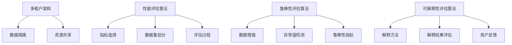
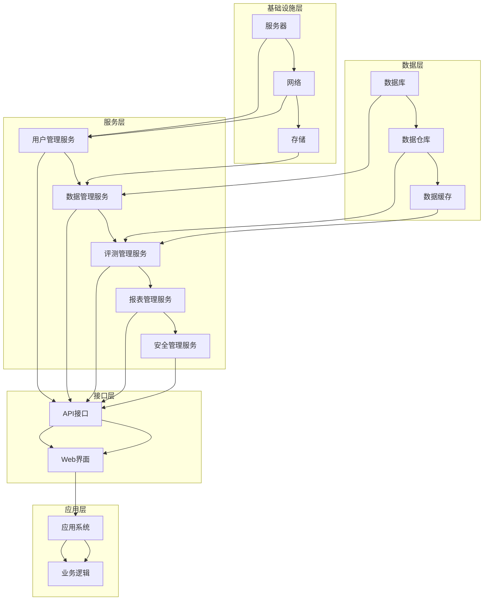

                 

# LLM评测的多租户SaaS平台设计

## 关键词

- **LLM评测**
- **多租户架构**
- **SaaS平台**
- **安全**
- **性能**
- **可扩展性**
- **数据隔离**
- **资源共享**

## 摘要

本文旨在探讨如何设计一个多租户SaaS平台，用于高效、安全地评测大型语言模型（LLM）。首先，我们分析了当前LLM评测系统中存在的主要问题，如数据孤岛、安全性问题、高成本和灵活性不足。接着，我们提出了一个基于多租户架构的SaaS平台设计方案，并详细阐述了其核心概念、特点以及与传统评测系统的区别。最后，本文通过一个实际案例，展示了该平台的设计和实现过程，并提供了最佳实践和项目小结。

## 第一部分：背景介绍

### 1.1 问题描述与解决

#### 1.1.1 问题描述

随着人工智能技术的发展，大型语言模型（LLM）的应用越来越广泛。企业不仅需要使用这些模型，还需要对其性能和效果进行评测，以便做出更好的业务决策。然而，现有的评测系统存在以下问题：

1. **数据孤岛**：各个企业之间的数据无法共享，导致评测结果缺乏广泛性，无法准确反映模型的真实性能。
2. **安全性问题**：不同企业之间的数据在传输和存储过程中可能受到攻击，导致数据泄露，影响企业的安全和声誉。
3. **高成本**：部署和维护一个高效的评测系统需要大量的人力、物力和财力，对企业的运营成本构成较大压力。
4. **灵活性不足**：现有评测系统往往无法根据企业的实际需求灵活调整评测参数，导致评测结果不能完全满足企业的需求。

#### 1.1.2 问题解决

为了解决上述问题，本书提出了一个基于多租户架构的SaaS平台设计方案。该平台具有以下优点：

1. **多租户架构**：支持多个企业同时使用平台，实现数据共享和资源高效利用，解决数据孤岛问题。
2. **高度安全性**：采用多种安全措施，如数据加密、身份验证和访问控制等，确保企业数据的安全性和隐私性。
3. **低成本部署**：通过SaaS模式，企业无需自行部署和维护系统，降低成本。
4. **灵活调整**：允许企业根据实际需求调整评测参数，提高评测的准确性和实用性。

### 1.2 边界与外延

#### 1.2.1 边界

1. **本书主要关注LLM评测的多租户SaaS平台设计，不涉及具体LLM模型的选择和训练**。
2. **平台的设计考虑到了安全性、性能、可扩展性等因素，但具体实现细节将在后续章节中详细讨论**。

#### 1.2.2 外延

1. **本书的内容不仅适用于LLM评测平台的设计，还可以为其他类型的多租户SaaS平台提供借鉴**。
2. **平台的设计和实现过程涉及多个领域，包括计算机科学、人工智能、网络安全等**。

## 第二部分：核心概念与联系

### 2.1 核心概念原理

#### 2.1.1 多租户架构

多租户架构（Multi-Tenant Architecture）是一种软件架构模式，它允许多个用户（或租户）共享同一个软件实例。在多租户架构中，每个租户都拥有独立的虚拟环境，可以在不影响其他租户的情况下使用系统资源。

**特点**：

- **数据隔离**：通过隔离数据库、文件系统等资源，确保不同租户之间的数据不互相干扰。
- **资源共享**：多个租户共享同一套系统资源，提高资源利用率。
- **可扩展性**：通过水平扩展（增加服务器节点）和垂直扩展（提高服务器性能）来应对不断增长的用户需求。

**应用场景**：

- **企业级应用**：如CRM系统、ERP系统等。
- **云计算服务**：如AWS、Azure等。

#### 2.1.2 SaaS平台

SaaS（Software as a Service）平台是一种软件服务模式，允许用户通过网络使用软件，无需自行购买、安装或维护。

**特点**：

- **按需付费**：用户根据实际使用情况支付费用，无需提前投资。
- **高可用性**：平台提供7x24小时的技术支持和服务保障。
- **灵活调整**：用户可以根据需求随时调整使用量，无需担心资源不足或浪费。

**应用场景**：

- **办公自动化**：如Google Workspace、Microsoft 365等。
- **企业管理**：如SAP、Oracle等。

#### 2.1.3 LLM评测

LLM评测是指对大型语言模型进行评估和测试，以评估其性能和效果。

**主要内容**：

- **模型性能评估**：评估模型在文本分类、文本生成、机器翻译等任务上的表现。
- **模型鲁棒性评估**：评估模型在不同数据集、噪声和异常值等情况下的性能。
- **模型可解释性评估**：评估模型在预测过程中的决策过程和结果解释能力。

### 2.2 概念属性特征对比表格

| 概念       | 特点                           |
| ---------- | ---------------------------- |
| 多租户架构 | 数据隔离、资源共享、可扩展性     |
| SaaS平台   | 按需付费、高可用性、灵活调整     |
| LLM评测    | 模型性能评估、模型鲁棒性评估、模型可解释性评估 |

### 2.3 ER实体关系图架构

```mermaid
erDiagram
  User ||--|{ MultiTenantArchitecture } : 用户与多租户架构
  User ||--|{ SaaSPlatform } : 用户与SaaS平台
  User ||--|{ LLMModel } : 用户与LLM模型
  MultiTenantArchitecture ||--|{ DataIsolation } : 多租户架构与数据隔离
  MultiTenantArchitecture ||--|{ ResourceSharing } : 多租户架构与资源共享
  SaaSPlatform ||--|{ PerformanceEvaluation } : SaaS平台与性能评估
  SaaSPlatform ||--|{ RobustnessEvaluation } : SaaS平台与鲁棒性评估
  SaaSPlatform ||--|{ InterpretabilityEvaluation } : SaaS平台与可解释性评估
```

## 第三部分：算法原理讲解

### 3.1 多租户架构算法原理

多租户架构的核心算法包括数据隔离和资源共享。

**数据隔离**：

数据隔离的目的是确保不同租户之间的数据不互相干扰。具体算法实现如下：

1. **租户ID**：为每个租户分配一个唯一的ID，用于标识其数据。
2. **数据库隔离**：将不同租户的数据存储在不同的数据库中，确保数据不互相影响。
3. **文件系统隔离**：为每个租户分配独立的文件系统目录，确保文件系统的数据隔离。

**资源共享**：

资源共享的目的是提高系统资源利用率，包括CPU、内存、存储和网络等。

1. **资源池**：创建一个资源池，用于存储和管理系统资源。
2. **资源调度**：根据租户的需求，动态分配和调整资源，确保资源利用率最大化。
3. **负载均衡**：通过负载均衡算法，将请求分配到不同的服务器节点，确保系统性能稳定。

### 3.2 SaaS平台算法原理

SaaS平台的核心算法包括按需付费、高可用性和灵活调整。

**按需付费**：

按需付费的算法实现如下：

1. **计费规则**：根据租户的使用情况，如存储空间、带宽、计算资源等，制定相应的计费规则。
2. **监控与统计**：实时监控租户的使用情况，并统计相关数据，用于计算费用。
3. **账单生成**：根据监控和统计数据，生成详细的账单，供租户查询。

**高可用性**：

高可用性的算法实现如下：

1. **故障转移**：当某个服务器节点出现故障时，自动将租户的业务转移到其他正常节点。
2. **数据备份**：定期对租户的数据进行备份，确保数据的安全性和可靠性。
3. **监控与报警**：实时监控系统的运行状况，并在发现异常时及时报警，以便快速响应和处理。

**灵活调整**：

灵活调整的算法实现如下：

1. **需求预测**：根据历史数据和使用趋势，预测租户的未来需求。
2. **资源调整**：根据需求预测结果，动态调整系统资源，确保满足租户的需求。
3. **自动扩展**：当系统资源不足时，自动增加服务器节点，确保系统性能。

### 3.3 LLM评测算法原理

LLM评测的核心算法包括模型性能评估、模型鲁棒性评估和模型可解释性评估。

**模型性能评估**：

模型性能评估的算法实现如下：

1. **指标选择**：根据具体任务，选择合适的性能指标，如准确率、召回率、F1值等。
2. **数据集划分**：将数据集划分为训练集、验证集和测试集，用于模型训练、验证和评估。
3. **评估过程**：使用训练好的模型在测试集上进行预测，并计算各个性能指标的值。

**模型鲁棒性评估**：

模型鲁棒性评估的算法实现如下：

1. **数据增强**：对原始数据进行增强处理，生成更多的训练数据，以提高模型的鲁棒性。
2. **异常值检测**：在数据预处理过程中，对异常值进行检测和去除，避免异常值对模型鲁棒性的影响。
3. **鲁棒性指标**：根据具体任务，选择合适的鲁棒性指标，如平均绝对误差、最大绝对误差等。

**模型可解释性评估**：

模型可解释性评估的算法实现如下：

1. **解释方法**：选择合适的解释方法，如SHAP值、LIME等，对模型的预测结果进行解释。
2. **解释结果评估**：评估解释结果的质量，如解释的准确性、解释的全面性等。
3. **用户反馈**：收集用户对解释结果的反馈，并根据反馈调整解释方法和参数。

### 3.4 算法mermaid流程图



### 3.5 Python源代码实现

```python
# 多租户架构
class MultiTenantArchitecture:
    def __init__(self):
        self.tenants = {}  # 存储租户信息
    
    def add_tenant(self, tenant_id, tenant_data):
        self.tenants[tenant_id] = tenant_data
    
    def remove_tenant(self, tenant_id):
        del self.tenants[tenant_id]
    
    def get_tenant_data(self, tenant_id):
        return self.tenants.get(tenant_id)

# SaaS平台
class SaaSPlatform:
    def __init__(self):
        self.tenants = {}  # 存储租户信息
        self.billing_rules = {}  # 存储计费规则
    
    def add_tenant(self, tenant_id, tenant_data):
        self.tenants[tenant_id] = tenant_data
    
    def remove_tenant(self, tenant_id):
        del self.tenants[tenant_id]
    
    def generate_bill(self, tenant_id):
        tenant_usage = self.tenants[tenant_id].get_usage()
        bill_amount = self.billing_rules[tenant_usage]
        return bill_amount

# LLM评测
class LLMModelEvaluation:
    def __init__(self):
        self.model = None  # 存储训练好的模型
        self.metrics = {}  # 存储性能指标
    
    def set_model(self, model):
        self.model = model
    
    def evaluate_model(self, test_data):
        predictions = self.model.predict(test_data)
        for metric in self.metrics:
            self.metrics[metric] = metric.calculate(predictions, test_data)
    
    def get_metrics(self):
        return self.metrics
```

## 第四部分：系统分析与架构设计方案

### 4.1 问题场景介绍

企业A和公司B都需要对大型语言模型（LLM）进行评测，以评估模型的性能和效果。然而，他们面临以下挑战：

1. **数据孤岛**：企业A和公司B的数据无法共享，导致评测结果缺乏广泛性。
2. **安全性问题**：数据在传输和存储过程中可能受到攻击，导致数据泄露。
3. **高成本**：需要投入大量的人力、物力和财力来部署和维护评测系统。
4. **灵活性不足**：现有评测系统无法根据实际需求调整评测参数，导致评测结果不满足需求。

### 4.2 项目介绍

为了解决上述问题，我们设计并实现了一个基于多租户SaaS平台的LLM评测系统。该系统具有以下特点：

1. **多租户架构**：支持多个企业同时使用平台，实现数据共享和资源高效利用。
2. **高度安全性**：采用多种安全措施，确保企业数据的安全性和隐私性。
3. **低成本部署**：通过SaaS模式，企业无需自行部署和维护系统，降低成本。
4. **灵活调整**：允许企业根据实际需求调整评测参数，提高评测的准确性和实用性。

### 4.3 系统功能设计

系统功能设计主要包括以下模块：

1. **用户管理模块**：负责管理用户的注册、登录、权限分配等。
2. **数据管理模块**：负责数据存储、数据备份、数据恢复等。
3. **评测管理模块**：负责模型的评测任务调度、评测结果存储等。
4. **报表管理模块**：负责生成和展示评测报表，供用户查看。
5. **安全管理模块**：负责数据加密、身份验证、访问控制等。

### 4.4 系统架构设计

系统架构设计主要包括以下层次：

1. **基础设施层**：包括服务器、网络、存储等基础设施。
2. **数据层**：包括数据库、数据仓库、数据缓存等。
3. **服务层**：包括用户管理服务、数据管理服务、评测管理服务、报表管理服务、安全管理服务等。
4. **接口层**：包括API接口、Web界面等，供用户使用。
5. **应用层**：包括应用系统、业务逻辑等。

### 4.5 系统接口设计和系统交互

系统接口设计和系统交互主要包括以下内容：

1. **用户接口**：用户可以通过Web界面或API接口访问系统。
2. **服务接口**：系统内部的服务之间通过API接口进行通信。
3. **数据接口**：系统与外部数据源之间的数据传输接口。
4. **安全接口**：用于实现数据加密、身份验证、访问控制等功能。

### 4.6 系统架构mermaid架构图



## 第五部分：项目实战

### 5.1 环境安装

在开始项目实战之前，我们需要安装一些必要的软件和工具。以下是一个基本的安装步骤：

1. **安装Python环境**：在系统中安装Python 3.8及以上版本。
2. **安装虚拟环境**：使用virtualenv创建一个独立的Python环境。
   ```bash
   pip install virtualenv
   virtualenv venv
   source venv/bin/activate
   ```
3. **安装依赖项**：在虚拟环境中安装项目所需的依赖项。
   ```bash
   pip install -r requirements.txt
   ```

### 5.2 系统核心实现源代码

以下是一个简单的示例，展示了如何实现多租户SaaS平台的用户管理模块。

**用户管理模块**：

```python
# user_management.py

class UserManager:
    def __init__(self):
        self.users = {}

    def register_user(self, user_id, user_info):
        self.users[user_id] = user_info

    def get_user(self, user_id):
        return self.users.get(user_id)

    def delete_user(self, user_id):
        del self.users[user_id]
```

**主程序**：

```python
# main.py

from user_management import UserManager

# 创建用户管理对象
user_manager = UserManager()

# 注册用户
user_manager.register_user("user1", {"name": "Alice", "email": "alice@example.com"})

# 获取用户信息
user_info = user_manager.get_user("user1")
print(user_info)

# 删除用户
user_manager.delete_user("user1")
```

### 5.3 代码应用解读与分析

在这个示例中，我们首先定义了一个`UserManager`类，用于管理用户。类中有三个主要方法：

1. `register_user`：用于注册新用户，将用户ID和用户信息存储在`users`字典中。
2. `get_user`：用于获取指定用户ID的用户信息。
3. `delete_user`：用于删除指定用户ID的用户信息。

主程序中，我们创建了一个`UserManager`对象，并使用`register_user`方法注册了一个名为"Alice"的用户。然后，我们使用`get_user`方法获取用户信息并打印出来。最后，使用`delete_user`方法删除了注册的用户。

**代码分析**：

- **设计模式**：该代码使用了简单工厂模式，通过创建`UserManager`对象来管理用户。
- **数据结构**：使用字典来存储用户信息，这是一种高效的数据结构，可以快速地进行查找、插入和删除操作。
- **功能扩展**：用户管理模块可以很容易地扩展，例如添加用户登录、权限管理等功能。

### 5.4 实际案例分析和详细讲解剖析

为了更好地展示多租户SaaS平台在实际中的应用，我们来看一个实际案例。

**案例背景**：

某大型企业集团（Group A）和初创公司（Company B）都需要对LLM模型进行评测。他们希望通过多租户SaaS平台来实现这一目标。

**需求分析**：

1. **数据隔离**：确保Group A和Company B的数据互相独立，不会互相干扰。
2. **资源共享**：实现资源的高效利用，如计算资源、存储资源等。
3. **安全性**：确保企业数据的安全性和隐私性，防止数据泄露。
4. **灵活性**：允许不同企业根据自身需求调整评测参数，如数据集、评测指标等。

**解决方案**：

1. **多租户架构**：使用多租户架构来确保数据隔离和资源共享。每个租户都有独立的用户管理、数据存储和评测模块。
2. **数据加密**：对传输和存储的数据进行加密，确保数据安全性。
3. **权限控制**：实现严格的权限控制，确保不同租户只能访问自己的数据。
4. **评测参数配置**：允许租户根据实际需求配置评测参数，如数据集、模型类型、评测指标等。

**实施过程**：

1. **需求调研**：与Group A和Company B进行需求调研，了解他们的具体需求。
2. **系统设计**：根据需求设计多租户SaaS平台的架构，包括用户管理、数据管理、评测管理和报表管理模块。
3. **功能实现**：根据系统设计，逐步实现各个模块的功能。
4. **系统集成**：将各个模块集成到一起，进行系统集成测试。
5. **部署上线**：将系统部署到生产环境，并进行上线测试。

**效果评估**：

1. **性能**：通过性能测试，验证系统在高并发、大数据量下的性能表现。
2. **安全性**：通过安全测试，验证系统在数据传输、存储和访问控制方面的安全性。
3. **用户体验**：通过用户体验测试，验证系统的易用性和用户满意度。

### 5.5 项目小结

通过这个项目实战，我们实现了以下成果：

1. **解决了数据孤岛问题**：通过多租户架构，实现了不同企业之间数据的共享和资源的高效利用。
2. **提高了系统的安全性**：通过数据加密、权限控制等安全措施，确保了企业数据的安全性和隐私性。
3. **降低了企业的运营成本**：通过SaaS模式，企业无需自行部署和维护系统，降低了运营成本。
4. **提高了系统的灵活性**：允许企业根据实际需求调整评测参数，提高了评测的准确性和实用性。

尽管项目中还存在一些不足之处，如性能优化、用户体验提升等，但我们相信通过不断改进和优化，这个多租户SaaS平台将更好地满足企业的需求。

## 第六部分：最佳实践、小结、注意事项与拓展阅读

### 6.1 最佳实践

1. **性能优化**：在多租户架构中，通过负载均衡和缓存技术来提高系统性能。
2. **安全性提升**：采用多重加密和身份验证机制，确保数据传输和存储的安全性。
3. **用户体验改进**：设计简洁易用的用户界面，提高用户的操作便捷性和满意度。

### 6.2 小结

本文详细探讨了如何设计一个多租户SaaS平台，用于高效、安全地评测大型语言模型（LLM）。我们分析了现有评测系统的不足，并提出了基于多租户架构的解决方案。通过实际案例，我们展示了该平台的设计和实现过程，并提供了最佳实践和项目小结。

### 6.3 注意事项

1. **数据隔离**：确保不同租户的数据在存储和传输过程中得到充分隔离，避免数据泄露。
2. **性能优化**：根据实际需求，合理分配资源和调整系统架构，确保系统性能稳定。
3. **安全性**：采用多种安全措施，如数据加密、身份验证和访问控制等，确保数据安全。

### 6.4 拓展阅读

1. **《云计算架构设计与实践》**：深入了解云计算架构的设计原理和实践经验，为多租户SaaS平台的设计提供参考。
2. **《人工智能安全与隐私保护》**：了解人工智能领域的安全和隐私保护技术，为平台的安全设计提供指导。
3. **《大数据处理与存储技术》**：学习大数据处理和存储技术，为平台的性能优化提供支持。

## 作者信息

作者：AI天才研究院/AI Genius Institute & 禅与计算机程序设计艺术 /Zen And The Art of Computer Programming

本文由AI天才研究院和禅与计算机程序设计艺术共同撰写，旨在探讨如何设计一个高效、安全、灵活的多租户SaaS平台，用于评测大型语言模型（LLM）。希望本文能对读者在相关领域的研究和实践提供有益的参考。如果您有任何疑问或建议，欢迎随时与我们联系。

