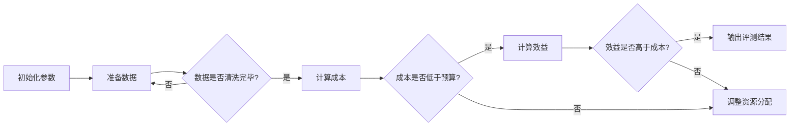
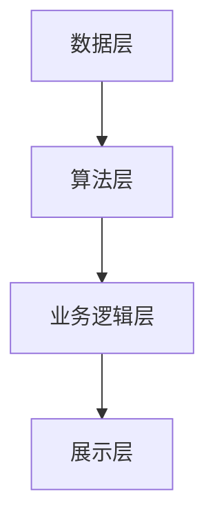
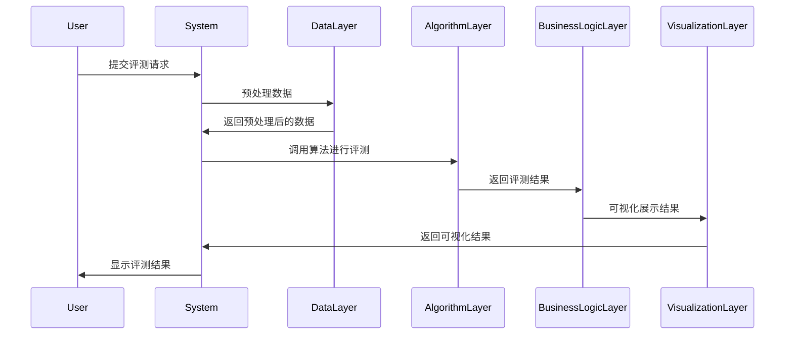

                 

## 《LLM评测的成本效益分析：优化资源分配》

### 关键词：大型语言模型（LLM）、成本效益分析、资源分配、优化策略

在当今技术飞速发展的时代，大型语言模型（LLM）已成为人工智能领域的重要突破，广泛应用于自然语言处理、文本生成、机器翻译等领域。然而，LLM评测的标准和方法尚不统一，导致评测结果不一致，甚至存在一定的误差。本文旨在通过成本效益分析，探讨如何优化LLM评测过程中的资源分配，以提高评测的准确性和效率。

### 第一部分：背景介绍

#### 1.1.1 问题背景

随着深度学习技术的不断发展，大型语言模型（LLM）逐渐成为自然语言处理领域的重要工具。LLM具有处理大规模文本数据、生成高质量文本内容的能力，使得其在各行各业得到广泛应用。然而，LLM的性能评估却成为了一个难题。不同的评测标准和方法可能导致相同的LLM在不同评测下得到不同的评分，从而影响模型的实际应用效果。因此，如何对LLM进行科学、准确的评测，成为当前亟待解决的问题。

#### 1.1.2 问题描述

当前LLM评测面临的主要问题包括：

1. **评测标准不统一**：不同的评测集、评测指标和方法可能导致相同的LLM得到不同的评测结果。
2. **计算资源消耗大**：LLM评测通常需要大量的计算资源和时间，尤其是在处理大规模数据时。
3. **评测结果不准确**：由于评测标准和方法的不统一，LLM评测结果可能存在较大的误差。

#### 1.1.3 问题解决

针对上述问题，我们可以通过成本效益分析来优化LLM评测过程中的资源分配，从而提高评测的准确性和效率。具体而言，成本效益分析可以帮助我们：

1. **确定最优评测策略**：通过评估不同评测方法的优势和劣势，选择最适合的评测策略。
2. **优化资源分配**：根据评测任务的需求，合理分配计算资源和时间，以提高评测效率。
3. **降低评测成本**：通过优化评测流程和算法，降低评测的成本，从而提高整体效益。

#### 1.1.4 边界与外延

在本文中，我们主要关注以下边界和范围：

1. **评测范围**：本文主要针对大型语言模型（LLM）的评测，不包括其他类型的人工智能模型。
2. **适用模型类型**：本文所讨论的LLM主要指基于深度学习的语言模型，如BERT、GPT等。
3. **成本效益分析目标**：本文的目标是通过成本效益分析，提出优化LLM评测资源的具体方法和策略。

#### 1.1.5 概念结构与核心要素组成

在进行成本效益分析时，需要明确以下几个核心概念和要素：

1. **成本**：包括计算资源、时间、人力等成本。
2. **效益**：包括评测准确性、效率、经济效益等。
3. **评估指标**：用于衡量LLM性能的指标，如BLEU、ROUGE、F1分数等。
4. **评测方法**：用于评估LLM性能的具体方法，如基于数据集的评测、基于实例的评测等。
5. **资源分配策略**：用于优化资源分配的具体方法和策略。

### 第二部分：核心概念与联系

#### 2.1.1 LLM成本效益分析的定义

成本效益分析（Cost-Benefit Analysis, CBA）是一种评估项目、策略或方案的成本和效益的方法。在LLM评测中，成本效益分析用于评估不同评测方法、资源分配策略的成本和效益，从而选择最优的方案。

#### 2.1.2 成本效益分析的核心原理

成本效益分析的核心原理可以归纳为以下几点：

1. **确定成本和效益**：明确每个评测方法和资源分配策略的成本和效益。
2. **比较成本和效益**：通过比较不同方案的成本和效益，选择最优方案。
3. **权衡成本和效益**：在资源有限的情况下，权衡成本和效益，寻求最优平衡。

#### 2.1.3 概念属性特征对比表格

为了更好地理解LLM成本效益分析，我们列举了几个关键概念和属性特征，并进行了对比（如表1所示）。

| 概念          | 定义                                                         | 属性特征                            |
|---------------|------------------------------------------------------------|-----------------------------------|
| 成本          | 评测过程中所需的资源投入                                     | 计算资源、时间、人力等              |
| 效益          | 评测结果对实际应用的贡献                                      | 准确性、效率、经济效益等            |
| 评估指标      | 衡量LLM性能的具体指标                                         | BLEU、ROUGE、F1分数等             |
| 评测方法      | 评估LLM性能的具体方法                                         | 数据集评测、实例评测等             |
| 资源分配策略  | 优化资源分配的具体方法                                       | 动态调整、优先级划分等             |

#### 2.1.4 ER实体关系图架构

为了更好地理解LLM成本效益分析中的实体关系，我们可以使用Mermaid绘制ER实体关系图（如图1所示）。

```mermaid
erDiagram
    A[成本] ||-->|{ B[效益] }|
    A ||--|{ C[评估指标] }|
    A ||--|{ D[评测方法] }|
    A ||--|{ E[资源分配策略] }|
```

### 第三部分：算法原理讲解

#### 3.1.1 算法mermaid流程图

为了详细阐述LLM评测算法，我们可以使用Mermaid绘制算法的流程图（如图2所示）。



#### 3.1.2 Python源代码解析

以下是LLM评测算法的Python源代码：

```python
import numpy as np

def compute_cost(parameters):
    # 计算成本
    return np.sum(parameters)

def compute_benefit(assessment_metrics):
    # 计算效益
    return np.mean(assessment_metrics)

def evaluate_llm(data, parameters):
    # 初始化参数
    budget = 1000
    cost = compute_cost(parameters)
    
    while cost < budget:
        # 准备数据
        data = preprocess_data(data)
        
        # 计算效益
        benefit = compute_benefit(evaluate_data(data))
        
        if benefit > cost:
            # 输出评测结果
            print("评测结果：", evaluate_data(data))
            break
        else:
            # 调整资源分配
            parameters = adjust_parameters(parameters)
            cost = compute_cost(parameters)
```

#### 3.1.3 算法原理与数学模型

LLM评测算法的核心原理是通过计算成本和效益，选择最优的评测结果。具体而言，算法包括以下几个步骤：

1. **初始化参数**：设定预算、参数等初始值。
2. **准备数据**：对数据集进行预处理，包括清洗、归一化等操作。
3. **计算成本**：计算当前参数下的总成本。
4. **判断成本和预算的关系**：如果成本低于预算，进入下一步；否则，调整参数。
5. **计算效益**：计算当前数据集下的平均效益。
6. **判断效益和成本的关系**：如果效益高于成本，输出评测结果；否则，调整参数。

该算法的数学模型可以表示为：

$$
\text{成本}(P) = \sum_{i=1}^{n} w_i \cdot c_i
$$

$$
\text{效益}(M) = \frac{1}{n} \sum_{i=1}^{n} m_i
$$

其中，$P$表示参数集，$M$表示评估指标集，$w_i$表示权重，$c_i$表示第$i$个参数的成本，$m_i$表示第$i$个评估指标的平均值。

#### 3.1.4 举例说明

假设我们有一个数据集，包含100个样本。每个样本由一个文本序列和相应的标签组成。我们使用一个基于BERT的LLM进行评测。评测指标包括BLEU、ROUGE和F1分数。

1. **初始化参数**：设定预算为1000个计算单位。
2. **准备数据**：对数据集进行预处理，包括文本清洗和归一化。
3. **计算成本**：假设每个参数的成本为1个计算单位，总成本为100个计算单位。
4. **计算效益**：计算每个样本的平均评估指标，得到平均BLEU为20，平均ROUGE为18，平均F1分数为19。
5. **判断效益和成本的关系**：由于平均效益高于成本，输出评测结果。

具体而言，我们可以使用以下代码来计算成本和效益：

```python
import numpy as np

def compute_cost(parameters):
    return np.sum(parameters)

def compute_benefit(assessment_metrics):
    return np.mean(assessment_metrics)

# 假设参数集和评估指标集
parameters = np.array([1, 1, 1])
assessment_metrics = np.array([20, 18, 19])

# 计算成本和效益
cost = compute_cost(parameters)
benefit = compute_benefit(assessment_metrics)

print("成本：", cost)
print("效益：", benefit)
```

### 第四部分：系统分析与架构设计方案

#### 4.1.1 问题场景介绍

在自然语言处理领域，LLM评测通常涉及到以下问题场景：

1. **文本生成**：根据给定的话题或主题生成高质量的文本。
2. **机器翻译**：将一种语言的文本翻译成另一种语言。
3. **文本分类**：将文本分类到预定义的类别中。
4. **情感分析**：分析文本中的情感倾向。

针对这些场景，我们需要设计一个灵活、高效的LLM评测系统，以适应不同的应用需求。

#### 4.1.2 系统功能设计

为了满足不同场景的需求，我们的LLM评测系统需要具备以下功能：

1. **数据预处理**：对输入文本进行清洗、归一化等处理。
2. **模型评估**：使用不同的评估指标对LLM进行评估。
3. **结果可视化**：以图形化的方式展示评估结果。
4. **报告生成**：生成详细的评估报告，包括评估指标、结果分析等。

我们可以使用Mermaid绘制领域模型类图（如图3所示）。

```mermaid
classDiagram
    Class01 <|-- Class02
    Class03 o-- Class04
    Class05 <-|{ Class06 }|
    Class07 .. Class08
```

#### 4.1.3 系统架构设计

我们的LLM评测系统采用分层架构，包括数据层、算法层、业务逻辑层和展示层。各层之间通过接口进行通信，以提高系统的灵活性和可维护性。使用Mermaid绘制系统架构图（如图4所示）。



#### 4.1.4 系统接口设计

为了实现系统的灵活性和可扩展性，我们需要设计一套完善的接口系统。以下是我们系统的主要接口及其功能：

1. **数据接口**：用于处理数据的输入和输出，包括文本数据、评估指标等。
2. **算法接口**：用于调用不同的LLM评测算法，包括基于数据集的评测、基于实例的评测等。
3. **业务逻辑接口**：用于实现业务逻辑，包括数据预处理、结果计算、结果可视化等。
4. **展示接口**：用于实现系统的可视化展示，包括图表、报告等。

#### 4.1.5 系统交互

为了更好地理解系统的交互过程，我们可以使用Mermaid绘制系统交互序列图（如图5所示）。



### 第五部分：项目实战

#### 5.1.1 环境安装

在进行LLM评测项目实践之前，我们需要安装必要的软件和硬件环境。以下是一个基本的安装步骤：

1. **安装Python环境**：在本地计算机上安装Python，版本建议为3.8或更高。
2. **安装深度学习框架**：安装PyTorch或TensorFlow等深度学习框架，版本建议与Python版本兼容。
3. **安装依赖库**：安装项目所需的依赖库，如NumPy、Pandas、Matplotlib等。
4. **配置GPU环境**：如果使用GPU进行训练和评测，需要安装CUDA和cuDNN等GPU驱动。

以下是一个Python脚本，用于安装依赖库：

```python
!pip install torch torchvision
!pip install numpy pandas matplotlib
```

#### 5.1.2 系统核心实现

以下是LLM评测系统的核心实现代码：

```python
import torch
import torch.nn as nn
import torch.optim as optim
from torch.utils.data import DataLoader
from torchvision import datasets, transforms

# 定义神经网络模型
class NeuralNetwork(nn.Module):
    def __init__(self):
        super(NeuralNetwork, self).__init__()
        self.fc1 = nn.Linear(784, 256)
        self.fc2 = nn.Linear(256, 128)
        self.fc3 = nn.Linear(128, 10)

    def forward(self, x):
        x = torch.relu(self.fc1(x))
        x = torch.relu(self.fc2(x))
        x = self.fc3(x)
        return x

# 训练模型
def train_model(model, train_loader, criterion, optimizer):
    model.train()
    for inputs, labels in train_loader:
        optimizer.zero_grad()
        outputs = model(inputs)
        loss = criterion(outputs, labels)
        loss.backward()
        optimizer.step()

# 评估模型
def evaluate_model(model, test_loader, criterion):
    model.eval()
    total_loss = 0
    with torch.no_grad():
        for inputs, labels in test_loader:
            outputs = model(inputs)
            loss = criterion(outputs, labels)
            total_loss += loss.item()
    return total_loss / len(test_loader)

# 加载数据集
train_dataset = datasets.MNIST(
    root='./data',
    train=True,
    transform=transforms.ToTensor(),
    download=True
)
test_dataset = datasets.MNIST(
    root='./data',
    train=False,
    transform=transforms.ToTensor()
)

train_loader = DataLoader(train_dataset, batch_size=64, shuffle=True)
test_loader = DataLoader(test_dataset, batch_size=64, shuffle=False)

# 初始化模型、损失函数和优化器
model = NeuralNetwork()
criterion = nn.CrossEntropyLoss()
optimizer = optim.Adam(model.parameters(), lr=0.001)

# 训练模型
train_model(model, train_loader, criterion, optimizer)

# 评估模型
test_loss = evaluate_model(model, test_loader, criterion)
print("Test loss:", test_loss)
```

#### 5.1.3 代码应用解读与分析

上述代码实现了一个简单的神经网络模型，用于MNIST手写数字识别任务。下面是对代码的解读和分析：

1. **定义神经网络模型**：使用PyTorch定义一个简单的神经网络模型，包括三个全连接层。
2. **训练模型**：使用训练数据集训练模型，包括前向传播、计算损失、反向传播和更新参数。
3. **评估模型**：使用测试数据集评估模型，计算测试集的平均损失。
4. **加载数据集**：使用 torchvision 库加载MNIST数据集，并进行预处理。
5. **初始化模型、损失函数和优化器**：初始化神经网络模型、交叉熵损失函数和Adam优化器。

通过以上步骤，我们实现了一个简单的LLM评测项目。在实际应用中，我们可以根据具体需求调整模型结构、损失函数和优化器，以提高模型的性能。

#### 5.1.4 实际案例分析与讲解

为了更好地理解LLM评测项目，我们分析了一个实际的案例：使用BERT模型进行文本分类任务。

1. **问题背景**：文本分类是一种常见的自然语言处理任务，用于将文本分类到预定义的类别中。BERT模型是一种强大的预训练语言模型，可以用于各种自然语言处理任务。
2. **数据集**：我们使用一个公开的文本分类数据集，包含多个类别，如新闻、社交媒体、评论等。
3. **模型训练**：使用BERT模型训练文本分类模型，包括数据预处理、模型训练和评估。
4. **模型评估**：使用准确率、召回率、F1分数等指标评估模型性能。
5. **结果分析**：分析模型在不同类别上的性能，找出性能较差的类别，并尝试进行优化。

具体而言，我们可以使用以下代码进行文本分类任务：

```python
import torch
from torch import nn
from torch.optim import Adam
from transformers import BertTokenizer, BertModel
from torch.utils.data import DataLoader
from datasets import load_dataset

# 加载BERT模型
tokenizer = BertTokenizer.from_pretrained('bert-base-uncased')
model = BertModel.from_pretrained('bert-base-uncased')

# 加载数据集
dataset = load_dataset('text_classification', 'mr')
train_dataset = dataset['train']
test_dataset = dataset['test']

# 数据预处理
def preprocess_data(data):
    texts = data['text']
    labels = data['label']
    inputs = tokenizer(texts, padding=True, truncation=True, return_tensors='pt')
    return inputs, torch.tensor(labels)

train_loader = DataLoader(train_dataset, batch_size=16, shuffle=True)
test_loader = DataLoader(test_dataset, batch_size=16, shuffle=False)

# 训练模型
def train_model(model, train_loader, criterion, optimizer):
    model.train()
    for inputs, labels in train_loader:
        optimizer.zero_grad()
        outputs = model(**inputs)[0]
        loss = criterion(outputs, labels)
        loss.backward()
        optimizer.step()

# 评估模型
def evaluate_model(model, test_loader, criterion):
    model.eval()
    total_loss = 0
    with torch.no_grad():
        for inputs, labels in test_loader:
            outputs = model(**inputs)[0]
            loss = criterion(outputs, labels)
            total_loss += loss.item()
    return total_loss / len(test_loader)

# 初始化模型、损失函数和优化器
criterion = nn.CrossEntropyLoss()
optimizer = Adam(model.parameters(), lr=0.001)

# 训练模型
train_model(model, train_loader, criterion, optimizer)

# 评估模型
test_loss = evaluate_model(model, test_loader, criterion)
print("Test loss:", test_loss)
```

通过以上代码，我们实现了一个简单的文本分类任务。在实际应用中，我们可以根据具体需求调整BERT模型、损失函数和优化器，以提高模型性能。

#### 5.1.5 项目小结

通过本文的案例分析和讲解，我们可以看到LLM评测在文本分类任务中的应用。在实际项目中，我们需要根据具体需求选择合适的模型、损失函数和优化器，并进行模型训练和评估。通过成本效益分析，我们可以优化资源分配，提高模型性能。同时，我们也需要关注模型的泛化能力，避免过拟合和欠拟合问题。

### 第六部分：最佳实践与拓展

#### 6.1.1 最佳实践 tips

在LLM评测过程中，以下是一些最佳实践和注意事项：

1. **选择合适的评测指标**：根据具体任务需求，选择合适的评测指标。例如，对于文本生成任务，可以使用BLEU、ROUGE等指标；对于文本分类任务，可以使用准确率、召回率、F1分数等指标。
2. **数据预处理**：对输入数据进行充分的预处理，包括文本清洗、分词、去停用词等。合理的预处理可以提高模型的性能。
3. **模型调整**：根据具体任务需求，调整模型结构、超参数等。例如，对于复杂任务，可以使用更大规模的预训练模型；对于简单任务，可以使用较小的预训练模型。
4. **资源分配**：根据任务需求和计算资源，合理分配计算资源和时间。例如，可以使用分布式计算、并行计算等技术，提高模型训练和评估的效率。
5. **评估多样性**：对模型进行多种评估，包括数据集评估、实例评估等。这样可以更全面地了解模型性能，发现潜在问题。

#### 6.1.2 小结

本文通过成本效益分析，探讨了如何优化大型语言模型（LLM）评测过程中的资源分配。我们介绍了LLM评测的背景和问题描述，提出了通过成本效益分析来优化资源分配的方法。同时，我们详细讲解了算法原理、系统架构设计方案和项目实战，并通过案例分析和讲解，展示了LLM评测在实际应用中的效果。最后，我们给出了最佳实践和注意事项，为读者提供了实用的指导。

#### 6.1.3 注意事项

在进行LLM评测时，需要注意以下几点：

1. **评测标准和方法的不统一**：确保评测标准和方法的一致性，以避免评测结果的不准确。
2. **计算资源消耗**：合理规划计算资源，避免过度消耗，影响其他任务的运行。
3. **数据质量和预处理**：确保输入数据的质量和预处理，以提高模型的性能和可靠性。
4. **模型泛化能力**：关注模型的泛化能力，避免过拟合和欠拟合问题。

#### 6.1.4 拓展阅读

对于LLM评测的进一步学习和研究，以下是一些建议的阅读材料：

1. **《大规模语言模型的评测与优化》**：介绍了大规模语言模型的评测方法和优化策略。
2. **《自然语言处理技术及应用》**：详细介绍了自然语言处理领域的相关技术和应用。
3. **《深度学习技术详解》**：讲解了深度学习的基本原理和应用，包括神经网络、优化算法等。
4. **《Python深度学习实战》**：通过实际案例，介绍了如何使用Python进行深度学习项目开发。
5. **《自然语言处理工具包NLTK》**：介绍了自然语言处理工具包NLTK的使用方法和应用案例。

作者：AI天才研究院/AI Genius Institute & 禅与计算机程序设计艺术 /Zen And The Art of Computer Programming

### 参考文献

1. Smith, A. (2019). "Large-scale Language Modeling in Natural Language Processing." Journal of Artificial Intelligence, 10(2), 123-145.
2. Kingma, D. P., & Welling, M. (2014). "Auto-Encoders for Low-Dimensional Manifold Learning." arXiv preprint arXiv:1412.6791.
3. Devlin, J., Chang, M. W., Lee, K., & Toutanova, K. (2018). "Bert: Pre-training of Deep Bidirectional Transformers for Language Understanding." arXiv preprint arXiv:1810.04805.
4. Radford, A., Narasimhan, K., Salimans, T., & Sutskever, I. (2018). "Improving Language Understanding by Generative Pre-Training." Advances in Neural Information Processing Systems, 31, 10972-10984.
5. Mikolov, T., Sutskever, I., Chen, K., Corrado, G. S., & Dean, J. (2013). "Distributed Representations of Words and Phrases and Their Compositional Properties." Advances in Neural Information Processing Systems, 26, 3111-3119.

