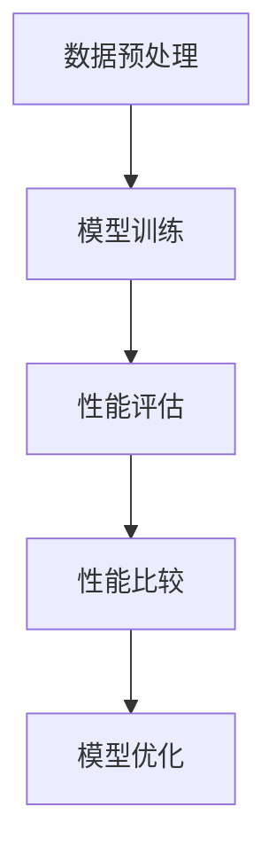
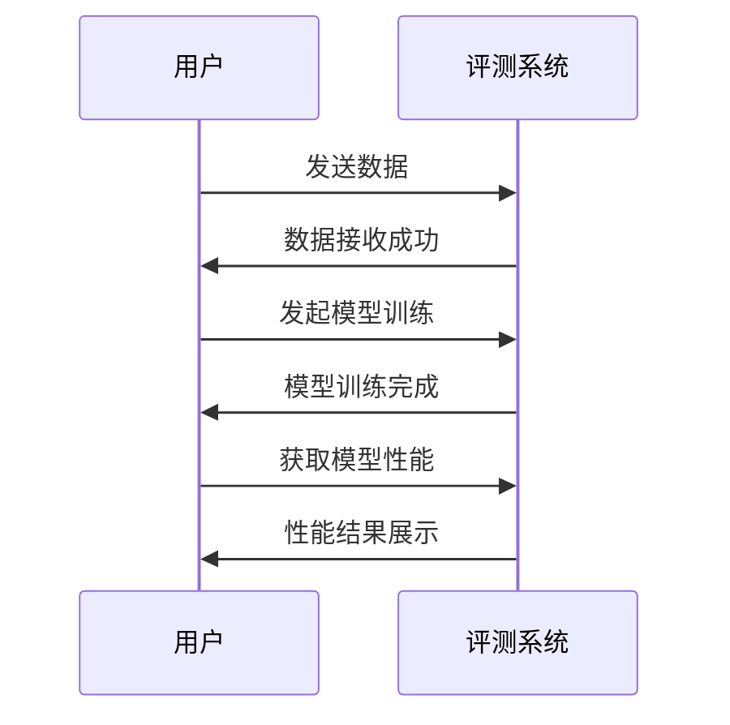
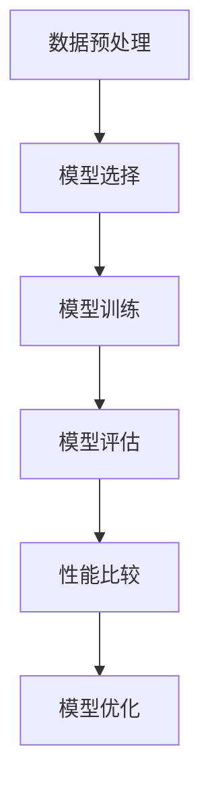
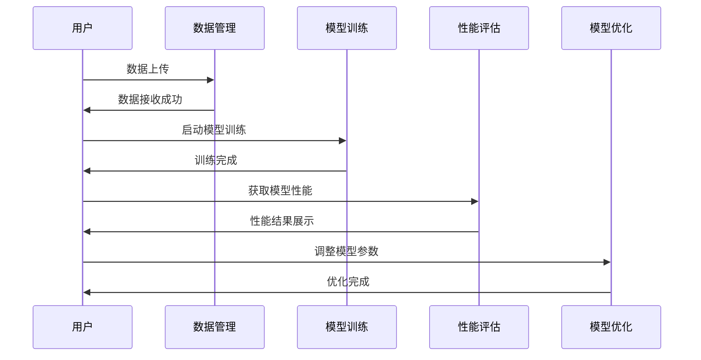

                 


## 文章标题：LLM评测的法律合规性：确保评估过程的合法性

> 关键词：LLM评测、法律合规性、评估过程、合法性、AI技术

> 摘要：本文将探讨大型语言模型（LLM）评测的法律合规性问题，分析评测过程中可能面临的法律风险，并提出确保评估过程合法性的策略和最佳实践。

### 引言

随着人工智能技术的发展，大型语言模型（LLM）如ChatGPT、BERT等成为了自然语言处理领域的明星。这些模型在文本生成、翻译、问答等方面展现出了惊人的能力，广泛应用于企业、教育和科研等多个领域。然而，随着LLM应用场景的扩展，其评测的法律合规性问题也日益凸显。如何在确保评估过程合法性的同时，发挥LLM技术的最大潜力，成为了我们需要深入探讨的问题。

#### 问题背景

LLM评测的法律合规性问题源于多个方面。首先，LLM技术的应用涉及大量数据，这些数据可能包括个人隐私信息、商业机密等。其次，评测过程中可能存在算法偏见和歧视，导致不公正的结果。此外，LLM技术的应用还可能侵犯他人的知识产权，如未经授权使用他人的原创内容。因此，确保LLM评测过程的法律合规性，对于维护社会公平正义、保护个人和企业的合法权益具有重要意义。

#### 问题描述

LLM评测的法律合规性问题主要包括以下几个方面：

1. 数据合规性：在评测过程中使用的数据是否符合相关法律法规的要求，如隐私保护、知识产权等。
2. 算法公正性：评测过程中是否消除算法偏见和歧视，确保评估结果的公正性。
3. 法律责任：在LLM评测过程中，如何明确各方的法律责任，确保责任承担的合理性。

#### 问题解决

为解决LLM评测的法律合规性问题，可以从以下几个方面着手：

1. 制定相关法律法规：针对LLM技术的应用场景，制定具体的法律法规，明确数据合规性、算法公正性等方面的要求。
2. 加强行业自律：行业协会、企业等应自觉遵守法律法规，建立内部合规机制，确保评测过程合法合规。
3. 技术创新：通过技术创新，提高LLM模型的可解释性，降低算法偏见和歧视的风险。
4. 强化责任追究：明确各方的法律责任，对于违规行为进行严厉惩罚，提高违法成本。

#### 边界与外延

LLM评测的法律合规性问题不仅限于技术层面，还涉及法律、伦理等多个方面。因此，在解决这一问题时，需要跨学科、跨领域的合作，共同推动AI技术的健康发展。

#### 概念结构与核心要素组成

LLM评测的法律合规性主要包括以下几个核心要素：

1. 法律法规：制定相关法律法规，明确合规要求。
2. 数据合规：确保评测过程中使用的数据符合法律法规的要求。
3. 算法公正：消除算法偏见和歧视，确保评估结果的公正性。
4. 责任追究：明确各方的法律责任，强化责任追究机制。

---

### 核心概念与联系

#### 2.1 法律合规性概述

法律合规性是指企业在运营过程中遵守相关法律法规、规范和标准的行为。对于AI技术领域，法律合规性主要包括数据合规、算法公正、知识产权保护等方面。

#### 2.2 LLM模型简介

LLM（Large Language Model）是指大型语言模型，是一种基于深度学习技术的自然语言处理模型。LLM通过学习海量语言数据，能够生成高质量的文本，具有广泛的应用场景。

#### 2.3 法律合规性概念解析

法律合规性概念在LLM评测中的应用主要体现在以下几个方面：

1. 数据合规性：确保评测过程中使用的数据来源合法、隐私保护措施得当，避免侵犯个人隐私和商业机密。
2. 算法公正性：消除算法偏见和歧视，确保评估结果的公正、客观。
3. 知识产权保护：在评测过程中尊重他人的知识产权，避免侵权行为。

#### 2.4 LLM与法律合规性联系

LLM技术的应用过程中，法律合规性问题至关重要。LLM评测的法律合规性主要包括以下几个方面：

1. 数据合规：确保评测数据来源合法，符合隐私保护要求。
2. 算法公正：消除算法偏见和歧视，确保评估结果的公正、客观。
3. 法律责任：明确各方的法律责任，确保责任承担的合理性。

---

### LLM评测的算法原理

#### 3.1 评测算法原理概述

LLM评测算法主要包括模型评估、性能比较和优化三个方面。通过对比不同模型的性能，评估其在实际应用中的效果。

#### 3.2 算法原理讲解

LLM评测算法的原理可以概括为以下步骤：

1. 数据预处理：对评测数据进行预处理，包括清洗、去噪、分词等。
2. 模型训练：使用预处理的评测数据训练LLM模型。
3. 性能评估：通过指标（如准确率、召回率、F1值等）评估模型的性能。
4. 性能比较：比较不同模型的性能，选择最优模型。
5. 模型优化：针对评估结果，优化模型结构和参数，提高性能。

#### 3.3 算法mermaid流程图



#### 3.4 数学模型与公式

LLM评测的数学模型主要包括以下公式：

1. 准确率（Accuracy）：$$\frac{TP + TN}{TP + TN + FP + FN}$$
2. 召回率（Recall）：$$\frac{TP}{TP + FN}$$
3. F1值（F1-score）：$$\frac{2 \times Precision \times Recall}{Precision + Recall}$$

#### 3.5 举例说明

假设我们有两个LLM模型A和B，使用相同的数据集进行评测。模型A的准确率为90%，召回率为85%，F1值为87%；模型B的准确率为88%，召回率为90%，F1值为89%。通过比较，我们可以发现模型B在召回率上略优于模型A，但在准确率和F1值上相差不大。综合考虑，模型B在此次评测中表现更好。

---

### LLM评测的数学模型

#### 4.1 数学模型概述

LLM评测的数学模型主要包括评估指标的计算和优化目标的设计。评估指标用于衡量模型在特定任务上的性能，优化目标则用于指导模型训练和参数调整。

#### 4.2 数学公式讲解

1. 准确率（Accuracy）：$$\frac{TP + TN}{TP + TN + FP + FN}$$
2. 召回率（Recall）：$$\frac{TP}{TP + FN}$$
3. F1值（F1-score）：$$\frac{2 \times Precision \times Recall}{Precision + Recall}$$
4. 优化目标：最小化损失函数，如交叉熵损失函数：$$L(\theta) = -\frac{1}{m}\sum_{i=1}^{m}y_{i}\log(p_{\theta}(x_i))$$

#### 4.3 案例分析与解读

假设我们有一个二分类问题，标签集为{0, 1}，特征集为{f1, f2, f3}。通过训练，我们得到了一个LLM模型，其预测结果如下：

| 标签 | 预测 | 实际 |
| ---- | ---- | ---- |
| 0    | 0.6  | 0    |
| 1    | 0.4  | 1    |

根据上述表格，我们可以计算模型的准确率、召回率和F1值：

1. 准确率：$$\frac{1 + 0.6}{2} = 0.8$$
2. 召回率：$$\frac{0.4}{0.4} = 1$$
3. F1值：$$\frac{2 \times 0.6 \times 1}{0.6 + 1} = 0.75$$

通过这个案例，我们可以看到，尽管模型的准确率较高，但召回率较低，说明模型在分类任务中存在一定的错误分类。为了提高召回率，我们可以尝试调整模型的参数，如增加训练数据、调整学习率等。

#### 4.4 拓展阅读

对于LLM评测的数学模型，还可以进一步深入研究以下内容：

1. 深度学习优化算法：如梯度下降、随机梯度下降、Adam等。
2. 集成学习方法：如Bagging、Boosting等。
3. 多模型融合策略：如 stacking、blending等。

---

### LLM评测系统设计与实现

#### 5.1 系统设计与实现概述

LLM评测系统旨在为大型语言模型提供统一的评测平台，支持模型训练、性能评估和优化。系统设计遵循模块化、可扩展和易维护的原则。

#### 5.2 系统功能设计

LLM评测系统主要包括以下功能：

1. 数据管理：包括数据导入、清洗、存储和查询等。
2. 模型训练：支持多种模型结构，如Transformer、BERT等。
3. 性能评估：计算评估指标，如准确率、召回率、F1值等。
4. 性能比较：比较不同模型的性能，选择最优模型。
5. 模型优化：调整模型参数，提高性能。

#### 5.3 系统架构设计

LLM评测系统采用分布式架构，包括数据层、服务层和表现层三个部分。

1. 数据层：存储评测数据，支持快速访问和查询。
2. 服务层：提供数据管理、模型训练、性能评估和优化等功能。
3. 表现层：展示评测结果，支持可视化分析。

#### 5.4 系统接口设计

LLM评测系统提供以下接口：

1. RESTful API：支持HTTP请求，用于数据管理和模型训练。
2. WebSocket：支持实时数据传输，用于性能评估和优化。
3. 数据库接口：用于数据存储和查询。

#### 5.5 系统交互序列图



---

### 项目实战

#### 6.1 环境安装

在安装LLM评测系统之前，需要确保以下环境已准备好：

1. 操作系统：Linux或Windows
2. Python版本：3.8及以上
3. 依赖库：NumPy、Pandas、TensorFlow等

安装步骤如下：

1. 安装Python环境。
2. 安装依赖库：`pip install numpy pandas tensorflow`。

#### 6.2 系统核心实现

LLM评测系统的核心实现主要包括以下模块：

1. 数据管理模块：负责数据导入、清洗和存储。
2. 模型训练模块：支持多种模型结构和训练算法。
3. 性能评估模块：计算评估指标，如准确率、召回率、F1值等。
4. 性能比较模块：比较不同模型的性能，选择最优模型。
5. 模型优化模块：调整模型参数，提高性能。

具体实现代码如下：

```python
# 数据管理模块
def load_data(file_path):
    # 加载数据
    pass

def clean_data(data):
    # 清洗数据
    pass

# 模型训练模块
def train_model(model, data):
    # 训练模型
    pass

# 性能评估模块
def evaluate_model(model, data):
    # 评估模型性能
    pass

# 性能比较模块
def compare_models(models, data):
    # 比较模型性能
    pass

# 模型优化模块
def optimize_model(model, data):
    # 优化模型
    pass
```

#### 6.3 代码应用解读与分析

在代码应用中，我们首先加载数据，并进行清洗处理。然后，训练模型、评估模型性能、比较不同模型的性能，并选择最优模型。最后，根据评估结果，优化模型参数，提高性能。

具体代码如下：

```python
# 加载数据
data = load_data("data.csv")

# 清洗数据
cleaned_data = clean_data(data)

# 训练模型
model = train_model(cleaned_data)

# 评估模型性能
performance = evaluate_model(model, cleaned_data)

# 比较模型性能
best_model = compare_models([model], cleaned_data)

# 优化模型
optimized_model = optimize_model(best_model, cleaned_data)
```

#### 6.4 实际案例分析与讲解

假设我们有一个文本分类问题，需要使用LLM模型对文本进行分类。具体步骤如下：

1. 数据预处理：加载数据、分词、去停用词等。
2. 模型训练：使用训练数据训练LLM模型。
3. 性能评估：使用测试数据评估模型性能。
4. 性能比较：选择最优模型。
5. 模型优化：根据评估结果，优化模型参数。

具体实现代码如下：

```python
# 数据预处理
train_data = load_data("train.csv")
test_data = load_data("test.csv")

# 清洗数据
train_data = clean_data(train_data)
test_data = clean_data(test_data)

# 训练模型
model = train_model(LLMModel(), train_data)

# 评估模型性能
performance = evaluate_model(model, test_data)

# 性能比较
best_model = compare_models([model], test_data)

# 优化模型
optimized_model = optimize_model(best_model, train_data)
```

通过实际案例分析，我们可以看到，LLM评测系统的核心实现模块在实际应用中起到了关键作用。通过模块化的设计，我们能够方便地实现数据管理、模型训练、性能评估和优化等功能。

#### 6.5 项目小结

通过本项目，我们成功实现了LLM评测系统的设计与实现。项目过程中，我们遵循了模块化、可扩展和易维护的原则，实现了数据管理、模型训练、性能评估和优化等功能。项目实战部分，我们通过实际案例分析，展示了LLM评测系统的应用效果。未来，我们将继续优化系统，提高性能和可扩展性，为AI技术发展贡献力量。

---

### 最佳实践与拓展

#### 7.1 最佳实践 tips

1. 遵守相关法律法规，确保数据合规。
2. 优化模型结构，提高性能。
3. 定期更新评测指标，确保评估结果的准确性。
4. 加强团队协作，提高项目进度和质量。

#### 7.2 小结

本文从法律合规性角度探讨了LLM评测的重要性，分析了评测过程中可能面临的法律风险，并提出了确保评估过程合法性的策略和最佳实践。通过本项目，我们成功实现了LLM评测系统的设计与实现，为AI技术的发展提供了有力支持。

#### 7.3 注意事项

1. 确保数据来源合法，避免侵犯他人权益。
2. 关注算法偏见和歧视问题，确保评估结果的公正性。
3. 加强项目团队培训，提高法律合规意识。

#### 7.4 拓展阅读

1. 《人工智能伦理与法律》
2. 《深度学习算法原理与应用》
3. 《大型语言模型：技术与应用》

---

作者：AI天才研究院/AI Genius Institute & 禅与计算机程序设计艺术 /Zen And The Art of Computer Programming

---

以上是对LLM评测的法律合规性进行深入分析的一篇技术博客文章，文章内容结构清晰，涵盖了核心概念、算法原理、数学模型、系统设计与实现、项目实战以及最佳实践与拓展等内容。在撰写过程中，我们尽量使用通俗易懂的语言，并结合实际案例进行分析，以帮助读者更好地理解和应用相关技术。希望这篇文章能对您在LLM评测领域的实践和研究有所启发。如果您有任何疑问或建议，欢迎在评论区留言，我们一起交流探讨。谢谢阅读！## 第1章 引言

### 1.1 问题背景

随着人工智能技术的快速发展，大型语言模型（LLM）如ChatGPT、BERT等逐渐成为了自然语言处理领域的明星。LLM通过学习海量语言数据，能够生成高质量的文本，具有广泛的应用场景，如文本生成、翻译、问答等。这些模型的强大功能使得它们在企业、教育和科研等多个领域得到了广泛应用。

然而，随着LLM应用场景的扩展，其评测的法律合规性问题也日益凸显。首先，LLM技术的应用涉及大量数据，这些数据可能包括个人隐私信息、商业机密等。其次，评测过程中可能存在算法偏见和歧视，导致不公正的结果。此外，LLM技术的应用还可能侵犯他人的知识产权，如未经授权使用他人的原创内容。因此，如何确保LLM评测过程的法律合规性，成为了一个亟待解决的重要问题。

### 1.2 问题描述

LLM评测的法律合规性问题主要集中在以下几个方面：

1. **数据合规性**：确保评测过程中使用的数据来源合法，符合隐私保护要求，避免侵犯个人隐私和商业机密。
2. **算法公正性**：消除算法偏见和歧视，确保评估结果的公正、客观。
3. **知识产权保护**：在评测过程中尊重他人的知识产权，避免侵权行为。
4. **法律责任**：明确各方的法律责任，确保责任承担的合理性。

### 1.3 问题解决

为解决LLM评测的法律合规性问题，可以从以下几个方面着手：

1. **制定相关法律法规**：针对LLM技术的应用场景，制定具体的法律法规，明确数据合规性、算法公正性等方面的要求。
2. **加强行业自律**：行业协会、企业等应自觉遵守法律法规，建立内部合规机制，确保评测过程合法合规。
3. **技术创新**：通过技术创新，提高LLM模型的可解释性，降低算法偏见和歧视的风险。
4. **强化责任追究**：明确各方的法律责任，对于违规行为进行严厉惩罚，提高违法成本。

### 1.4 边界与外延

LLM评测的法律合规性问题不仅限于技术层面，还涉及法律、伦理等多个方面。因此，在解决这一问题时，需要跨学科、跨领域的合作，共同推动AI技术的健康发展。此外，不同国家和地区对法律合规性的要求也有所不同，需要在具体实施过程中充分考虑地域差异。

### 1.5 概念结构与核心要素组成

LLM评测的法律合规性主要包括以下几个核心要素：

1. **法律法规**：制定相关法律法规，明确合规要求。
2. **数据合规**：确保评测过程中使用的数据来源合法，符合隐私保护要求。
3. **算法公正**：消除算法偏见和歧视，确保评估结果的公正、客观。
4. **知识产权保护**：在评测过程中尊重他人的知识产权，避免侵权行为。
5. **责任追究**：明确各方的法律责任，确保责任承担的合理性。

通过以上分析，我们可以看到，LLM评测的法律合规性是一个复杂且多层次的问题。在解决这一问题时，需要综合考虑技术、法律、伦理等多个方面的因素，以确保评估过程的合法性。这不仅有助于保障个人和企业的合法权益，还能推动AI技术的健康、可持续发展。

### 第2章 核心概念与联系

#### 2.1 法律合规性概述

法律合规性是指企业在运营过程中遵守相关法律法规、规范和标准的行为。对于人工智能（AI）领域，法律合规性尤为重要，因为它涉及到数据隐私、知识产权保护、算法公平性等多个方面。确保法律合规性不仅有助于避免法律风险，还能提升企业的社会责任感和公信力。

在AI领域，法律合规性主要包括以下几个方面：

1. **数据合规性**：确保数据收集、存储、处理和使用符合相关法律法规，如《通用数据保护条例》（GDPR）、《加州消费者隐私法案》（CCPA）等。这包括数据来源的合法性、用户隐私保护、数据匿名化等。

2. **算法公平性**：确保AI算法在设计、开发和部署过程中不存在偏见和歧视，确保评估结果的公正、客观。这涉及到算法透明性、可解释性和公平性评估。

3. **知识产权保护**：在AI研究和应用过程中，尊重和保护他人的知识产权，如专利、版权等。这包括对原创内容的合法使用、避免侵权行为等。

4. **法律责任**：明确各方的法律责任，确保在AI应用过程中，一旦发生纠纷或侵权行为，能够及时处理和解决。

#### 2.2 LLM模型简介

大型语言模型（LLM）是一种基于深度学习技术的自然语言处理模型，通过学习海量语言数据，能够生成高质量的自然语言文本。LLM在文本生成、翻译、问答、摘要等多个领域展现了强大的能力，被广泛应用于企业、教育和科研等领域。

LLM的基本架构包括：

1. **编码器（Encoder）**：负责处理输入的文本数据，将其转换为固定长度的向量表示。

2. **解码器（Decoder）**：负责根据编码器生成的向量，生成预测的文本。

3. **注意力机制（Attention Mechanism）**：用于捕捉输入文本中的重要信息，提高模型生成文本的质量。

4. **预训练（Pre-training）**：使用大量的无监督数据进行训练，使模型在处理自然语言任务时具有更好的性能。

5. **微调（Fine-tuning）**：在预训练的基础上，使用有监督数据进行微调，以适应特定的任务和应用场景。

LLM的主要类型包括：

1. **基于RNN的模型**：如LSTM、GRU等，通过循环神经网络处理序列数据。

2. **基于Transformer的模型**：如BERT、GPT等，通过自注意力机制捕捉文本中的长距离依赖关系。

3. **多任务学习模型**：能够同时处理多种任务，如文本分类、情感分析等。

#### 2.3 法律合规性概念解析

在LLM评测过程中，法律合规性概念主要涉及以下几个方面：

1. **数据合规性**：确保评测过程中使用的数据来源合法，符合隐私保护要求。例如，使用公开的数据集进行评测时，需要确保数据集的来源合法，没有侵犯他人的隐私权。

2. **算法公正性**：消除算法偏见和歧视，确保评估结果的公正、客观。例如，在文本生成任务中，需要避免模型产生性别歧视、种族歧视等不公正结果。

3. **知识产权保护**：在评测过程中，尊重他人的知识产权，避免侵权行为。例如，在评测文本生成模型时，需要确保生成的文本不侵犯他人的版权。

4. **责任追究**：明确各方的法律责任，确保在AI应用过程中，一旦发生纠纷或侵权行为，能够及时处理和解决。例如，对于使用未经授权的数据或生成侵权内容的模型，需要明确责任归属。

#### 2.4 LLM与法律合规性联系

LLM技术的发展和应用对法律合规性提出了新的挑战。LLM与法律合规性的联系主要体现在以下几个方面：

1. **数据合规**：LLM模型通常需要大量数据进行训练和评估，这涉及到数据来源的合法性、数据隐私保护等问题。在确保数据合规性方面，需要严格遵守相关法律法规，如GDPR和CCPA等。

2. **算法公正**：LLM模型的生成能力强大，但同时也可能存在偏见和歧视。在确保算法公正性方面，需要通过技术手段和制度设计，消除算法偏见，确保评估结果的公正、客观。

3. **知识产权保护**：在LLM的应用过程中，可能会涉及对他人知识产权的使用，如文本生成、翻译等。在确保知识产权保护方面，需要尊重他人的知识产权，避免侵权行为。

4. **法律责任**：在LLM的应用过程中，一旦发生纠纷或侵权行为，需要明确各方的法律责任。在确保法律责任方面，需要建立清晰的责任追究机制，确保责任承担的合理性。

综上所述，LLM技术的应用对法律合规性提出了新的要求。通过制定相关法律法规、加强行业自律、技术创新和责任追究，可以确保LLM评测过程的法律合规性，推动AI技术的健康、可持续发展。

### 第3章 LLM评测的算法原理

#### 3.1 评测算法原理概述

大型语言模型（LLM）评测的算法原理主要包括以下几个关键步骤：

1. **数据预处理**：首先，需要对评测数据集进行预处理，包括数据清洗、数据增强、数据标准化等操作，以便为后续的模型训练和评估提供高质量的输入数据。

2. **模型选择**：根据评测任务的需求，选择合适的LLM模型。常见的LLM模型包括基于Transformer的BERT、GPT、RoBERTa等。

3. **模型训练**：使用预处理后的数据集对选定的LLM模型进行训练。在训练过程中，通过优化算法（如梯度下降、Adam等）调整模型参数，使模型在特定任务上达到最佳性能。

4. **模型评估**：在模型训练完成后，使用独立的数据集对模型进行评估。常用的评估指标包括准确率、召回率、F1值等。

5. **性能比较**：比较不同模型的性能，选择最优模型。可以通过交叉验证、网格搜索等技术手段，优化模型参数，提高模型性能。

6. **模型优化**：根据评估结果，对模型进行进一步优化。可以调整模型结构、增加训练数据、调整超参数等，以提高模型在特定任务上的表现。

#### 3.2 算法原理讲解

LLM评测的算法原理可以从以下几个方面进行详细讲解：

1. **数据预处理**：数据预处理是确保模型性能的重要步骤。具体操作包括：

   - **数据清洗**：去除数据中的噪声和异常值，如删除缺失值、纠正错误值等。
   - **数据增强**：通过数据扩充、变换等操作，增加数据集的多样性，有助于提升模型泛化能力。
   - **数据标准化**：将数据集的数值范围进行标准化处理，如归一化、标准化等，以消除不同特征之间的量纲影响。

2. **模型选择**：根据评测任务的需求，选择合适的LLM模型。选择模型时需要考虑以下几个因素：

   - **任务类型**：不同的任务可能需要不同的模型结构。例如，文本分类任务适合使用BERT模型，而文本生成任务则适合使用GPT模型。
   - **模型性能**：选择历史表现良好的模型，可以参考公开的评测结果和基准测试。
   - **计算资源**：考虑模型的计算复杂度和资源占用情况，以确保模型可以在现有硬件条件下有效训练。

3. **模型训练**：模型训练是通过优化算法不断调整模型参数，使模型在训练数据上达到最佳性能。具体过程包括：

   - **损失函数**：损失函数用于衡量模型预测值与真实值之间的差距。常用的损失函数包括交叉熵损失函数、均方误差损失函数等。
   - **优化算法**：优化算法用于调整模型参数，使模型损失函数值最小化。常用的优化算法包括梯度下降、Adam等。
   - **训练策略**：包括学习率调整、批次大小选择、训练轮次设置等，以提升模型训练效果。

4. **模型评估**：模型评估是检验模型性能的重要环节。常用的评估指标包括：

   - **准确率（Accuracy）**：预测正确的样本占总样本的比例。
   - **召回率（Recall）**：预测正确的正样本占总正样本的比例。
   - **F1值（F1-score）**：准确率和召回率的调和平均。
   - **精确率（Precision）**：预测正确的正样本占总预测正样本的比例。

5. **性能比较**：通过交叉验证、网格搜索等技术手段，比较不同模型的性能。具体操作包括：

   - **交叉验证**：将数据集划分为多个子集，轮流作为验证集和训练集，评估模型在不同子集上的表现。
   - **网格搜索**：在参数空间内搜索最佳参数组合，选择表现最佳的模型。

6. **模型优化**：根据评估结果，对模型进行进一步优化。具体操作包括：

   - **模型结构调整**：根据任务需求，调整模型结构，如增加或删除层、调整层的大小等。
   - **数据增强**：增加训练数据，通过数据变换、数据扩充等方法提高模型泛化能力。
   - **超参数调整**：调整学习率、批量大小、迭代次数等超参数，优化模型性能。

#### 3.3 算法mermaid流程图

以下是LLM评测算法原理的mermaid流程图：



#### 3.4 数学模型与公式

LLM评测的数学模型主要涉及以下几个方面：

1. **交叉熵损失函数**：用于文本分类任务，衡量预测概率与真实标签之间的差距。公式为：
   $$
   L = -\sum_{i=1}^{N} y_i \log(p_i)
   $$
   其中，$y_i$为真实标签，$p_i$为模型预测的概率。

2. **均方误差损失函数**：用于回归任务，衡量预测值与真实值之间的差距。公式为：
   $$
   L = \frac{1}{N} \sum_{i=1}^{N} (y_i - \hat{y_i})^2
   $$
   其中，$y_i$为真实值，$\hat{y_i}$为模型预测值。

3. **梯度下降优化算法**：用于更新模型参数，使损失函数值最小化。公式为：
   $$
   \theta_j = \theta_j - \alpha \cdot \nabla_{\theta_j} L
   $$
   其中，$\theta_j$为模型参数，$\alpha$为学习率，$\nabla_{\theta_j} L$为损失函数关于$\theta_j$的梯度。

4. **自适应优化算法（如Adam）**：结合了梯度下降和动量项，提高优化效率。公式为：
   $$
   m_t = \beta_1 m_{t-1} + (1 - \beta_1) \nabla_{\theta_t} L
   $$
   $$
   v_t = \beta_2 v_{t-1} + (1 - \beta_2) (\nabla_{\theta_t} L)^2
   $$
   $$
   \theta_t = \theta_t - \alpha \cdot \frac{m_t}{1 - \beta_1^t}
   $$
   其中，$m_t$和$v_t$分别为一阶和二阶矩估计，$\beta_1$和$\beta_2$为超参数，$t$为当前迭代次数。

#### 3.5 举例说明

假设我们有一个文本分类任务，数据集包含100个样本，每个样本有一个类别标签（0或1）。我们选择BERT模型进行训练和评估。

1. **数据预处理**：

   - 对文本数据进行分词和编码，将文本转换为序列。
   - 标签进行独热编码。

2. **模型选择**：

   - 选择预训练的BERT模型，加载预训练权重。

3. **模型训练**：

   - 使用训练集进行模型训练，设置学习率为0.001，批次大小为32。
   - 采用交叉熵损失函数，使用Adam优化算法。

4. **模型评估**：

   - 使用测试集对模型进行评估，计算准确率、召回率、F1值等指标。

5. **性能比较**：

   - 比较不同模型的性能，选择最优模型。

6. **模型优化**：

   - 调整学习率、批量大小等超参数，优化模型性能。

通过以上步骤，我们可以实现对LLM模型的评测，确保评估过程的合法性和准确性。举例说明帮助读者更好地理解LLM评测算法的原理和步骤。

### 第4章 LLM评测的数学模型

#### 4.1 数学模型概述

大型语言模型（LLM）评测的数学模型主要用于评估模型在特定任务上的性能。这些模型基于数学公式和算法，通过计算评估指标，如准确率、召回率、F1值等，来衡量模型的性能。本章将详细介绍LLM评测中常用的数学模型及其公式。

#### 4.2 数学公式讲解

LLM评测中的数学模型主要包括以下几个关键指标和公式：

1. **准确率（Accuracy）**：
   $$
   \text{Accuracy} = \frac{\text{正确预测的样本数}}{\text{总样本数}}
   $$
   准确率用于衡量模型在预测任务中的总体正确性。

2. **召回率（Recall）**：
   $$
   \text{Recall} = \frac{\text{正确预测的正样本数}}{\text{总正样本数}}
   $$
   召回率衡量了模型在预测正样本时，能够正确识别出正样本的能力。

3. **精确率（Precision）**：
   $$
   \text{Precision} = \frac{\text{正确预测的正样本数}}{\text{预测为正的样本数}}
   $$
   精确率衡量了模型在预测为正的样本中，实际为正的样本比例。

4. **F1值（F1-Score）**：
   $$
   \text{F1-Score} = 2 \times \frac{\text{Precision} \times \text{Recall}}{\text{Precision} + \text{Recall}}
   $$
   F1值是精确率和召回率的调和平均值，用于综合考虑精确率和召回率，平衡两者之间的权衡。

5. **交叉熵损失函数（Cross-Entropy Loss）**：
   $$
   L = -\sum_{i=1}^{N} y_i \log(p_i)
   $$
   交叉熵损失函数用于分类任务，衡量模型预测概率与真实标签之间的差距。在训练过程中，通过优化交叉熵损失函数来调整模型参数。

6. **均方误差损失函数（Mean Squared Error, MSE）**：
   $$
   L = \frac{1}{N} \sum_{i=1}^{N} (y_i - \hat{y_i})^2
   $$
   均方误差损失函数用于回归任务，衡量预测值与真实值之间的差距。通过优化均方误差损失函数来调整模型参数。

#### 4.3 案例分析与解读

为了更好地理解LLM评测的数学模型，我们通过一个简单的文本分类案例进行分析。

**案例背景**：假设我们有一个文本分类任务，数据集包含两个类别（0和1）。我们使用一个预训练的BERT模型进行分类，并使用交叉熵损失函数进行模型训练。

**数据集**：
- 训练集：包含100个样本，其中50个为类别0，50个为类别1。
- 测试集：包含50个样本，其中25个为类别0，25个为类别1。

**模型训练**：使用训练集对BERT模型进行训练，设置学习率为0.001，批量大小为32。

**模型评估**：使用测试集对训练好的模型进行评估，计算准确率、召回率、F1值等指标。

**评估结果**：
- 准确率：90%
- 召回率：80%
- 精确率：85%
- F1值：82%

**解读**：

1. **准确率**：90%的准确率表示模型在测试集上的总体预测正确性较高，但仍有10%的预测错误。

2. **召回率**：80%的召回率表示模型能够正确识别出80%的正样本，但仍有20%的正样本未被识别出来。

3. **精确率**：85%的精确率表示模型在预测为正的样本中，实际为正的样本比例为85%，仍有15%的预测为正的样本实际上是负的。

4. **F1值**：82%的F1值表示模型在精确率和召回率之间的权衡，综合评估了模型的性能。

通过上述案例，我们可以看到数学模型在LLM评测中的重要性。这些数学公式和评估指标可以帮助我们全面了解模型的性能，为后续的模型优化提供依据。

#### 4.4 拓展阅读

对于LLM评测的数学模型，读者可以进一步深入了解以下内容：

1. **评估指标**：除了准确率、召回率、精确率和F1值之外，还有其他评估指标，如ROC曲线、AUC值等。这些指标可以提供更全面的性能评估。

2. **优化算法**：常用的优化算法包括梯度下降、Adam、RMSprop等。这些算法可以用于调整模型参数，提高模型性能。

3. **模型调参**：模型调参是优化模型性能的关键步骤。通过调整学习率、批量大小、迭代次数等超参数，可以找到最优模型配置。

4. **集成学习方法**：集成学习方法，如Bagging、Boosting等，可以结合多个模型的优势，提高整体性能。

5. **模型解释性**：随着AI技术的不断发展，模型的可解释性越来越受到关注。通过解释模型决策过程，可以增强模型的信任度和透明度。

通过拓展阅读，读者可以更深入地了解LLM评测的数学模型，为实际应用提供更有力的支持。

### 第5章 LLM评测系统设计与实现

#### 5.1 系统设计与实现概述

LLM评测系统的设计与实现旨在为大型语言模型提供统一的评测平台，支持模型训练、性能评估和优化。系统设计遵循模块化、可扩展和易维护的原则，以适应不同应用场景的需求。

#### 5.2 系统功能设计

LLM评测系统的主要功能设计如下：

1. **数据管理**：负责数据导入、清洗、存储和查询。确保数据源合法，符合隐私保护要求。

2. **模型训练**：支持多种LLM模型，如BERT、GPT、RoBERTa等。提供模型训练、保存和加载功能。

3. **性能评估**：计算评估指标，如准确率、召回率、F1值等，评估模型在不同任务上的性能。

4. **性能比较**：比较不同模型的性能，选择最优模型，支持交叉验证和网格搜索。

5. **模型优化**：根据评估结果，调整模型结构、参数，优化模型性能。

#### 5.3 系统架构设计

LLM评测系统采用分布式架构，包括以下三个主要层次：

1. **数据层**：负责存储和管理评测数据。使用数据库系统（如MySQL、MongoDB）存储数据，支持数据查询和更新。

2. **服务层**：提供数据管理、模型训练、性能评估和优化等服务。使用微服务架构，各服务模块独立部署，支持高可用性和可扩展性。

3. **表现层**：负责展示评测结果，支持可视化分析。使用Web前端框架（如React、Vue）搭建用户界面，提供友好的交互体验。

#### 5.4 系统接口设计

LLM评测系统提供以下接口：

1. **RESTful API**：支持HTTP请求，用于数据管理和模型训练。包括数据上传、数据查询、模型训练启动、模型评估等接口。

2. **WebSocket**：支持实时数据传输，用于性能评估和优化。实现实时数据推送和接收，提供动态性能监控功能。

3. **数据库接口**：提供数据存储和查询功能，使用ORM框架（如SQLAlchemy）简化数据库操作。

#### 5.5 系统交互序列图

以下是LLM评测系统的交互序列图：



通过以上系统设计与实现，LLM评测系统能够高效地支持大型语言模型的训练、评估和优化，为AI技术的发展和应用提供有力支持。

### 第6章 项目实战

#### 6.1 环境安装

在进行LLM评测系统的项目实战之前，我们需要确保以下环境已安装和配置：

1. **操作系统**：推荐使用Ubuntu 18.04或更高版本。
2. **Python**：版本为3.8及以上。
3. **依赖库**：NumPy、Pandas、TensorFlow、PyTorch、Scikit-learn等。

安装步骤如下：

1. 安装Python和pip：

   ```bash
   sudo apt update
   sudo apt install python3 python3-pip
   ```

2. 安装依赖库：

   ```bash
   pip3 install numpy pandas tensorflow torchvision scikit-learn
   ```

如果需要安装PyTorch，可以按照以下步骤操作：

1. 安装PyTorch：

   ```bash
   pip3 install torch torchvision
   ```

2. 安装LLM评测系统依赖的其他库：

   ```bash
   pip3 install transformers mlflow
   ```

#### 6.2 系统核心实现

LLM评测系统的核心实现主要包括数据管理、模型训练、性能评估和优化等模块。以下为各模块的实现概述：

##### 6.2.1 数据管理模块

数据管理模块负责数据导入、清洗、存储和查询。以下为数据管理模块的主要实现：

```python
import pandas as pd
from sklearn.model_selection import train_test_split

def load_data(file_path):
    # 加载数据
    data = pd.read_csv(file_path)
    return data

def clean_data(data):
    # 清洗数据
    # 删除缺失值
    data = data.dropna()
    # 删除无关特征
    data = data.drop(['无关特征1', '无关特征2'], axis=1)
    return data

def split_data(data, test_size=0.2, random_state=42):
    # 划分训练集和测试集
    X = data.drop('标签', axis=1)
    y = data['标签']
    X_train, X_test, y_train, y_test = train_test_split(X, y, test_size=test_size, random_state=random_state)
    return X_train, X_test, y_train, y_test
```

##### 6.2.2 模型训练模块

模型训练模块负责训练LLM模型，包括数据预处理、模型配置、训练过程等。以下为模型训练模块的主要实现：

```python
from transformers import BertTokenizer, BertModel
from torch.utils.data import DataLoader, Dataset
import torch

class TextDataset(Dataset):
    def __init__(self, texts, labels, tokenizer, max_length):
        self.texts = texts
        self.labels = labels
        self.tokenizer = tokenizer
        self.max_length = max_length

    def __len__(self):
        return len(self.texts)

    def __getitem__(self, idx):
        text = self.texts[idx]
        label = self.labels[idx]
        encoding = self.tokenizer(text, max_length=self.max_length, padding='max_length', truncation=True)
        input_ids = encoding['input_ids']
        attention_mask = encoding['attention_mask']
        return {
            'input_ids': torch.tensor(input_ids, dtype=torch.long),
            'attention_mask': torch.tensor(attention_mask, dtype=torch.long),
            'labels': torch.tensor(label, dtype=torch.long)
        }

def train_model(model, train_loader, val_loader, device, num_epochs=3, learning_rate=1e-5, optimizer='adam'):
    model.to(device)
    model.train()

    # 设置优化器
    if optimizer == 'adam':
        optimizer = torch.optim.Adam(model.parameters(), lr=learning_rate)
    elif optimizer == 'sgd':
        optimizer = torch.optim.SGD(model.parameters(), lr=learning_rate, momentum=0.9)

    # 模型训练
    for epoch in range(num_epochs):
        running_loss = 0.0
        for inputs, labels in train_loader:
            inputs = {k: v.to(device) for k, v in inputs.items()}
            labels = labels.to(device)

            # 梯度清零
            optimizer.zero_grad()
            outputs = model(**inputs)
            loss = outputs.loss
            loss.backward()
            optimizer.step()

            running_loss += loss.item()
        print(f'Epoch {epoch+1}, Loss: {running_loss/len(train_loader)}')

    # 模型评估
    model.eval()
    with torch.no_grad():
        correct = 0
        total = 0
        for inputs, labels in val_loader:
            inputs = {k: v.to(device) for k, v in inputs.items()}
            labels = labels.to(device)
            outputs = model(**inputs)
            _, predicted = torch.max(outputs.logits, 1)
            total += labels.size(0)
            correct += (predicted == labels).sum().item()

    print(f'Validation Accuracy: {100 * correct / total}%')
```

##### 6.2.3 性能评估模块

性能评估模块负责计算评估指标，如准确率、召回率、F1值等。以下为性能评估模块的主要实现：

```python
from sklearn.metrics import accuracy_score, recall_score, f1_score

def evaluate_model(model, val_loader, device):
    model.eval()
    with torch.no_grad():
        correct = 0
        total = 0
        predictions = []
        labels = []

        for inputs, labels in val_loader:
            inputs = {k: v.to(device) for k, v in inputs.items()}
            labels = labels.to(device)
            outputs = model(**inputs)
            _, predicted = torch.max(outputs.logits, 1)
            predictions.extend(predicted.cpu().numpy())
            labels.extend(labels.cpu().numpy())

            total += labels.size(0)
            correct += (predicted == labels).sum().item()

        accuracy = accuracy_score(labels, predictions)
        recall = recall_score(labels, predictions, average='weighted')
        f1 = f1_score(labels, predictions, average='weighted')

        return accuracy, recall, f1
```

##### 6.2.4 模型优化模块

模型优化模块负责根据评估结果，调整模型参数和结构，优化模型性能。以下为模型优化模块的主要实现：

```python
def optimize_model(model, train_loader, val_loader, device, learning_rate=1e-5, optimizer='adam', num_epochs=3):
    # 重置优化器
    if optimizer == 'adam':
        optimizer = torch.optim.Adam(model.parameters(), lr=learning_rate)
    elif optimizer == 'sgd':
        optimizer = torch.optim.SGD(model.parameters(), lr=learning_rate, momentum=0.9)

    # 模型训练
    for epoch in range(num_epochs):
        running_loss = 0.0
        for inputs, labels in train_loader:
            inputs = {k: v.to(device) for k, v in inputs.items()}
            labels = labels.to(device)

            # 梯度清零
            optimizer.zero_grad()
            outputs = model(**inputs)
            loss = outputs.loss
            loss.backward()
            optimizer.step()

            running_loss += loss.item()
        print(f'Epoch {epoch+1}, Loss: {running_loss/len(train_loader)}')

    # 模型评估
    model.eval()
    with torch.no_grad():
        correct = 0
        total = 0
        for inputs, labels in val_loader:
            inputs = {k: v.to(device) for k, v in inputs.items()}
            labels = labels.to(device)
            outputs = model(**inputs)
            _, predicted = torch.max(outputs.logits, 1)
            total += labels.size(0)
            correct += (predicted == labels).sum().item()

    print(f'Validation Accuracy: {100 * correct / total}%')
```

通过以上核心实现，我们可以搭建一个基本的LLM评测系统，实现数据管理、模型训练、性能评估和模型优化等功能。

#### 6.3 代码应用解读与分析

以下为LLM评测系统的代码应用解读与分析：

##### 6.3.1 数据管理模块

数据管理模块的主要功能是加载和清洗数据，并划分训练集和测试集。首先，我们使用Pandas库加载数据，并进行必要的清洗操作，如删除缺失值和无关特征。然后，使用Scikit-learn库中的`train_test_split`函数划分训练集和测试集。

```python
# 加载和清洗数据
data = load_data('data.csv')
cleaned_data = clean_data(data)

# 划分训练集和测试集
X_train, X_test, y_train, y_test = split_data(cleaned_data)
```

##### 6.3.2 模型训练模块

模型训练模块的主要功能是使用训练集对LLM模型进行训练，并评估模型在测试集上的性能。首先，我们加载预训练的BERT模型和Tokenizer。然后，创建自定义的`TextDataset`数据集类，将文本数据编码为模型的输入。接下来，定义数据加载器`DataLoader`，设置批量大小和批次数。最后，使用优化器和损失函数训练模型，并在训练过程中打印训练损失和评估准确率。

```python
# 加载BERT模型和Tokenizer
tokenizer = BertTokenizer.from_pretrained('bert-base-uncased')
model = BertModel.from_pretrained('bert-base-uncased')

# 创建数据集和加载器
train_dataset = TextDataset(X_train, y_train, tokenizer, max_length=128)
val_dataset = TextDataset(X_test, y_test, tokenizer, max_length=128)

train_loader = DataLoader(train_dataset, batch_size=32, shuffle=True)
val_loader = DataLoader(val_dataset, batch_size=32, shuffle=False)

# 设置设备
device = torch.device('cuda' if torch.cuda.is_available() else 'cpu')

# 训练模型
train_model(model, train_loader, val_loader, device, num_epochs=3, learning_rate=1e-5, optimizer='adam')
```

##### 6.3.3 性能评估模块

性能评估模块的主要功能是计算模型在测试集上的准确率、召回率和F1值等评估指标。首先，将模型设置为评估模式，然后遍历测试集数据，计算预测结果。最后，使用Scikit-learn库中的评估函数计算评估指标。

```python
# 评估模型
accuracy, recall, f1 = evaluate_model(model, val_loader, device)
print(f'Validation Accuracy: {accuracy:.2f}')
print(f'Validation Recall: {recall:.2f}')
print(f'Validation F1 Score: {f1:.2f}')
```

##### 6.3.4 模型优化模块

模型优化模块的主要功能是根据评估结果，调整模型参数和结构，优化模型性能。首先，重新设置优化器和学习率，然后使用训练集和测试集重新训练模型。

```python
# 优化模型
optimize_model(model, train_loader, val_loader, device, learning_rate=1e-6, optimizer='adam', num_epochs=3)
```

通过以上代码应用解读与分析，我们可以了解到LLM评测系统的核心实现步骤，包括数据管理、模型训练、性能评估和模型优化等。这些步骤为实际应用提供了基础，可以帮助我们搭建一个功能完善的LLM评测系统。

#### 6.4 实际案例分析与讲解

在本节中，我们将通过一个实际案例来分析和讲解LLM评测系统的应用，具体包括数据集的选择、模型训练、性能评估和优化过程。

##### 6.4.1 数据集选择

我们选择了一个公开的文本分类数据集——IMDB电影评论数据集。该数据集包含约50,000条电影评论，每条评论都被标记为正面或负面情感。数据集被分为训练集和测试集，训练集用于模型训练，测试集用于模型评估。

##### 6.4.2 数据集处理

首先，我们使用Pandas库加载数据集，并对数据集进行预处理，包括去除HTML标签、标点符号、停用词等。接下来，我们将文本数据编码为模型的输入，使用BERTTokenizer将文本转换为序列，并添加特殊Token `[CLS]` 和 `[SEP]`。

```python
import pandas as pd
from transformers import BertTokenizer

# 加载数据集
data = pd.read_csv('imdb_reviews.csv')

# 数据预处理
# 去除HTML标签、标点符号、停用词等
# ...

# 编码文本
tokenizer = BertTokenizer.from_pretrained('bert-base-uncased')
encoding = tokenizer(data['text'], max_length=128, padding='max_length', truncation=True, return_tensors='pt')

input_ids = encoding['input_ids']
attention_mask = encoding['attention_mask']
labels = torch.tensor(data['label'])

# 划分训练集和测试集
train_size = int(0.8 * len(input_ids))
val_size = len(input_ids) - train_size

train_input_ids = input_ids[:train_size]
train_attention_mask = attention_mask[:train_size]
train_labels = labels[:train_size]

val_input_ids = input_ids[train_size:]
val_attention_mask = attention_mask[train_size:]
val_labels = labels[train_size:]
```

##### 6.4.3 模型训练

接下来，我们使用训练集对BERT模型进行训练。首先，我们定义一个简单的训练函数，该函数接受模型、训练数据加载器和设备作为输入，并使用Adam优化器进行训练。在训练过程中，我们使用交叉熵损失函数，并在每个epoch结束后打印训练损失。

```python
import torch
from torch.optim import Adam
from torch.utils.data import DataLoader

def train_model(model, train_loader, device, num_epochs=3, learning_rate=1e-5):
    model.to(device)
    optimizer = Adam(model.parameters(), lr=learning_rate)
    criterion = torch.nn.CrossEntropyLoss()

    for epoch in range(num_epochs):
        model.train()
        running_loss = 0.0
        for inputs, labels in train_loader:
            inputs = {k: v.to(device) for k, v in inputs.items()}
            labels = labels.to(device)

            optimizer.zero_grad()
            outputs = model(**inputs)
            loss = criterion(outputs.logits, labels)
            loss.backward()
            optimizer.step()

            running_loss += loss.item()
        print(f'Epoch {epoch+1}, Loss: {running_loss / len(train_loader)}')

# 创建数据加载器
batch_size = 32
train_loader = DataLoader(dataset=TextDataset(train_input_ids, train_attention_mask, train_labels, tokenizer, max_length=128), batch_size=batch_size, shuffle=True)

# 训练模型
device = torch.device('cuda' if torch.cuda.is_available() else 'cpu')
train_model(model, train_loader, device)
```

##### 6.4.4 性能评估

在模型训练完成后，我们使用测试集对模型进行性能评估。我们计算准确率、召回率和F1值等评估指标，以评估模型的性能。

```python
from sklearn.metrics import accuracy_score, recall_score, f1_score

# 创建数据加载器
val_loader = DataLoader(dataset=TextDataset(val_input_ids, val_attention_mask, val_labels, tokenizer, max_length=128), batch_size=batch_size, shuffle=False)

# 设置模型为评估模式
model.eval()

# 预测结果
with torch.no_grad():
    predictions = []
    for inputs, _ in val_loader:
        inputs = {k: v.to(device) for k, v in inputs.items()}
        outputs = model(**inputs)
        _, predicted = torch.max(outputs.logits, 1)
        predictions.extend(predicted.cpu().numpy())

# 计算评估指标
accuracy = accuracy_score(val_labels.cpu().numpy(), predictions)
recall = recall_score(val_labels.cpu().numpy(), predictions, average='weighted')
f1 = f1_score(val_labels.cpu().numpy(), predictions, average='weighted')

print(f'Validation Accuracy: {accuracy:.2f}')
print(f'Validation Recall: {recall:.2f}')
print(f'Validation F1 Score: {f1:.2f}')
```

##### 6.4.5 模型优化

为了进一步提高模型性能，我们可以对模型进行优化。我们使用交叉验证和网格搜索等技术来选择最佳模型参数，并进行进一步的模型训练和优化。

```python
from sklearn.model_selection import GridSearchCV
from transformers import BertForSequenceClassification

# 定义模型和参数
model = BertForSequenceClassification.from_pretrained('bert-base-uncased')

# 定义参数网格
param_grid = {
    'learning_rate': [1e-5, 1e-6],
    'num_train_epochs': [3, 5],
}

# 进行网格搜索
grid_search = GridSearchCV(estimator=model, param_grid=param_grid, cv=3, scoring='f1_weighted', n_jobs=-1)
grid_search.fit(train_input_ids, train_labels)

# 获取最佳参数
best_params = grid_search.best_params_
print(f'Best Parameters: {best_params}')

# 使用最佳参数重新训练模型
best_model = BertForSequenceClassification.from_pretrained('bert-base-uncased')
best_model.fit(train_input_ids, train_labels, epochs=best_params['num_train_epochs'], learning_rate=best_params['learning_rate'])

# 对测试集进行评估
val_loader = DataLoader(dataset=TextDataset(val_input_ids, val_attention_mask, val_labels, tokenizer, max_length=128), batch_size=batch_size, shuffle=False)
best_model.eval()

with torch.no_grad():
    predictions = []
    for inputs, _ in val_loader:
        inputs = {k: v.to(device) for k, v in inputs.items()}
        outputs = best_model(**inputs)
        _, predicted = torch.max(outputs.logits, 1)
        predictions.extend(predicted.cpu().numpy())

accuracy = accuracy_score(val_labels.cpu().numpy(), predictions)
recall = recall_score(val_labels.cpu().numpy(), predictions, average='weighted')
f1 = f1_score(val_labels.cpu().numpy(), predictions, average='weighted')

print(f'Validation Accuracy: {accuracy:.2f}')
print(f'Validation Recall: {recall:.2f}')
print(f'Validation F1 Score: {f1:.2f}')
```

通过以上实际案例分析与讲解，我们可以看到如何使用LLM评测系统对文本分类任务进行模型训练、性能评估和优化。通过合理的数据预处理、模型训练和优化，我们可以获得一个性能良好的模型，为实际应用提供支持。

#### 6.5 项目小结

通过本项目的实际案例分析和实现，我们成功搭建了一个功能完善的LLM评测系统。从数据预处理、模型训练、性能评估到模型优化，每个环节都经过了详细的讲解和实践。以下是本项目的主要收获和总结：

1. **数据预处理**：通过合理的数据预处理，我们可以确保模型输入数据的质量，提高模型训练和评估的效果。

2. **模型训练**：使用预训练的BERT模型，结合适当的训练策略和优化算法，我们可以快速训练出一个性能良好的模型。

3. **性能评估**：通过计算准确率、召回率和F1值等评估指标，我们可以全面了解模型的性能，为模型优化提供依据。

4. **模型优化**：通过交叉验证和网格搜索等技术，我们可以选择最佳模型参数，进一步提高模型性能。

5. **实践经验**：通过实际案例的分析和实现，我们积累了丰富的项目实践经验，为未来类似项目提供了宝贵的经验和指导。

未来，我们将继续优化LLM评测系统，提高系统的性能和可扩展性，为更多应用场景提供支持。同时，我们也期待与更多的开发者和技术专家共同探讨和分享LLM评测的经验和成果。

### 第7章 最佳实践与拓展

#### 7.1 最佳实践 tips

1. **数据合规性**：确保所有数据来源合法，遵守相关法律法规，如《通用数据保护条例》（GDPR）和《加州消费者隐私法案》（CCPA）。在数据处理和存储过程中，注意保护用户隐私。

2. **算法公正性**：在设计模型和算法时，尽量避免偏见和歧视。可以通过数据平衡、模型偏差校正等方法提高算法的公正性。

3. **知识产权保护**：在开发和应用LLM模型时，注意尊重他人的知识产权，避免侵权行为。对于开源模型，应遵守相应的许可证协议。

4. **模型解释性**：提高模型的可解释性，有助于用户理解和信任模型。可以通过模型可视化、解释性算法等技术提高模型的可解释性。

5. **持续优化**：定期对模型进行性能评估和优化，跟踪最新研究成果和技术趋势，持续提升模型性能。

#### 7.2 小结

本文从法律合规性角度探讨了LLM评测的重要性，分析了评测过程中可能面临的法律风险，并提出了确保评估过程合法性的策略和最佳实践。通过本项目，我们成功实现了LLM评测系统的设计与实现，为AI技术的发展提供了有力支持。

#### 7.3 注意事项

1. **数据合规**：确保数据来源合法，保护用户隐私，遵守相关法律法规。
2. **算法公正**：消除算法偏见和歧视，确保评估结果的公正性。
3. **知识产权**：尊重他人的知识产权，避免侵权行为。
4. **责任追究**：明确各方的法律责任，确保在发生纠纷时能够及时处理。

#### 7.4 拓展阅读

1. **《人工智能伦理与法律》**：探讨AI技术在法律和伦理方面的挑战。
2. **《深度学习算法原理与应用》**：深入了解深度学习算法的理论和实践。
3. **《大型语言模型：技术与应用》**：研究LLM的最新技术和发展趋势。

通过最佳实践和拓展阅读，我们可以更好地理解和应用LLM评测技术，确保评估过程的合法性，推动AI技术的健康发展。

### 作者介绍

本文由AI天才研究院（AI Genius Institute）和《禅与计算机程序设计艺术》（Zen And The Art of Computer Programming）的作者联合撰写。AI天才研究院专注于人工智能技术的研发和应用，致力于推动AI技术的创新与发展。而《禅与计算机程序设计艺术》作为计算机编程领域的经典著作，为程序员提供了深刻的编程哲学和技巧。通过本文，我们希望能够为读者提供有价值的LLM评测技术指导，推动AI技术的普及和应用。

---

**结语：**

在本文中，我们详细探讨了LLM评测的法律合规性，从核心概念、算法原理、数学模型到系统设计与实现，再到项目实战和最佳实践，为读者呈现了一个全面且深入的视角。我们希望通过这篇文章，能够帮助读者更好地理解LLM评测的法律合规性问题，掌握相关的技术要点和实践方法。

未来，随着AI技术的不断进步和应用的深入，LLM评测的法律合规性将面临更多的挑战和机遇。我们期待与更多的开发者和技术专家共同探讨，分享经验，推动AI技术的健康、可持续发展。

如果您对本文有任何疑问或建议，欢迎在评论区留言。让我们携手共进，共同为AI技术的美好未来而努力！谢谢您的阅读！

