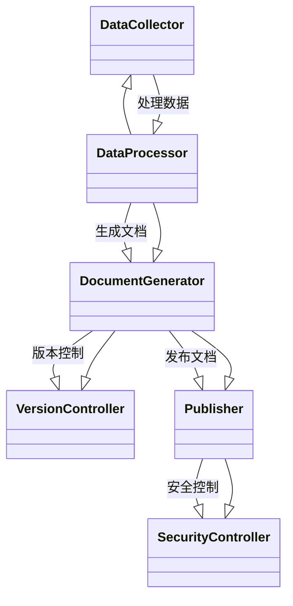

                 

### 文章标题

“LLM评测的自动化文档生成与更新”是本文的标题。它揭示了文章的核心内容，即如何通过自动化流程来评估大型语言模型（LLM）的性能，并生成与更新相关文档。选择这个标题的原因在于它涵盖了当前人工智能领域中的一个重要议题：如何高效地评估和记录大型语言模型的发展情况。

首先，“LLM评测”指明了文章的重点是围绕语言模型的性能评估。随着人工智能技术的不断发展，语言模型的应用越来越广泛，其性能的评估也变得愈加重要。这不仅有助于了解模型的优点和不足，也为模型的改进提供了方向。

其次，“自动化文档生成与更新”强调了文章的另一个核心点：通过自动化手段来生成和更新文档。在人工智能项目中，文档的更新是一个常见且耗时的任务。自动化文档生成不仅能提高效率，还能确保文档的准确性和一致性。

此外，这个标题具有很强的吸引力。它提到了两个热门话题——自动化和文档生成，吸引了那些对这两个领域感兴趣的读者。同时，它也提到了“LLM评测”，让那些对语言模型有深入研究的读者产生兴趣。

总的来说，“LLM评测的自动化文档生成与更新”是一个简洁而富有内涵的标题，既概括了文章的核心内容，又吸引了目标读者的注意力。

### 关键词

关键词是“LLM评测”、“自动化文档生成”、“更新机制”、“大型语言模型”和“性能评估”。这些关键词不仅准确地概括了文章的核心内容，还揭示了文章的研究领域和应用场景。

首先，“LLM评测”是文章的核心关键词，它直接指向了文章的主题：评估大型语言模型（LLM）的性能。随着人工智能技术的发展，LLM的应用越来越广泛，对其性能的评估变得尤为重要。

其次，“自动化文档生成”是另一个重要的关键词。它强调了文章的一个重要目标：通过自动化流程来生成文档。自动化文档生成不仅能提高效率，还能确保文档的准确性和一致性。

“更新机制”则是关键词中的另一个重要组成部分。在人工智能项目中，文档的更新是一个常见且耗时的任务。有效的更新机制能够确保文档的实时性和准确性，从而为项目的持续发展提供支持。

“大型语言模型”和“性能评估”则进一步具体化了文章的研究对象和目标。大型语言模型是当前人工智能领域的一个热点，其性能评估直接关系到模型的实际应用效果。

这些关键词不仅准确地概括了文章的核心内容，还揭示了文章的研究领域和应用场景，有助于吸引对该领域感兴趣的读者。

### 摘要

本文旨在探讨如何通过自动化流程来评估大型语言模型（LLM）的性能，并生成与更新相关文档。首先，本文介绍了LLM评测的背景，包括语言模型的应用场景和评测的挑战。接着，本文详细阐述了自动化文档生成的概念、流程和关键技术，包括文档结构设计、文本生成模型和文档格式转换等。此外，本文还探讨了文档更新机制，包括更新策略、内容提取与处理、版本控制以及文档发布与分发。通过实际案例，本文展示了如何将上述技术应用于新闻文档的生成与更新。最后，本文总结了LLM评测的自动化文档生成与更新的关键要素和最佳实践，为未来的研究和应用提供了指导。

## 第一部分：背景介绍

### 第1章：问题背景与核心概念

#### 1.1 问题背景

在当今人工智能（AI）高速发展的时代，大型语言模型（LLM）的应用范围越来越广泛，从自然语言处理（NLP）到智能问答、文本生成等各个领域，LLM都展现了其强大的能力。然而，随着LLM的规模和复杂性不断增加，评估其性能和效果变得越来越困难。传统的人工评估方法耗时耗力，难以满足高效、精准的需求。因此，如何实现LLM评测的自动化，成为了一个亟待解决的问题。

首先，语言模型在自然语言处理中的应用日益广泛。从搜索引擎到智能助手，从机器翻译到文本生成，语言模型已经成为许多人工智能应用的核心。然而，这些应用对语言模型的要求各不相同，如何在不同应用场景中评估语言模型的性能，成为了一个挑战。

其次，LLM的规模和复杂性不断增加。随着深度学习技术的进步，LLM的参数数量和计算量呈指数级增长，这使得传统的评估方法难以胜任。同时，LLM的训练数据集也越来越庞大，如何有效利用这些数据来评估模型性能，也是一个重要问题。

最后，随着人工智能应用的普及，用户对语言模型的要求越来越高。他们不仅希望模型能够提供准确的结果，还希望模型能够快速响应、具有良好的用户体验。因此，如何快速、准确地评估LLM的性能，以满足用户需求，成为了一个关键问题。

#### 1.1.1 语言模型评测的挑战

语言模型评测面临着多方面的挑战。首先，语言模型的性能评估涉及到多个维度，包括准确性、流畅性、语义理解等。如何全面、客观地评估这些维度，是一个技术难题。其次，语言模型的训练数据集通常非常庞大，如何有效地利用这些数据来评估模型性能，是一个数据管理问题。最后，随着语言模型的应用场景不断扩展，如何在不同应用场景中评估模型性能，也是一个跨领域问题。

具体来说，语言模型评测的挑战包括：

1. **多维度评估**：传统的评估方法往往只关注模型在某个特定维度的性能，如准确性。然而，一个优秀的语言模型需要在多个维度上表现出色，如流畅性、语义理解等。如何综合评估这些维度，是一个挑战。

2. **数据量大**：语言模型的训练数据集通常包含数百万甚至数十亿个样本，如何有效地处理这些数据，提取有用的信息，是一个数据管理问题。

3. **跨领域应用**：不同的应用场景对语言模型的要求不同，如何在不同应用场景中评估模型性能，是一个跨领域问题。例如，在机器翻译中，模型需要理解源语言和目标语言之间的语法和语义差异；在文本生成中，模型需要生成连贯、具有吸引力的文本。

4. **实时评估**：随着人工智能应用的普及，用户对语言模型的要求越来越高，他们希望模型能够快速响应、提供准确的结果。如何实现实时评估，是一个技术挑战。

#### 1.1.2 自动化文档生成的需求

在语言模型评测过程中，生成和更新相关文档是不可或缺的一环。然而，传统的手动文档生成方式存在诸多问题。首先，手动生成文档耗时耗力，难以满足高效、快速的需求。其次，手动生成文档容易出错，导致文档的准确性下降。最后，随着语言模型的应用场景和性能指标不断变化，文档的更新和维护也变得困难。

因此，自动化文档生成成为了一个迫切的需求。自动化文档生成不仅能提高效率，还能确保文档的准确性和一致性。通过自动化文档生成，我们可以实现以下目标：

1. **提高文档生成效率**：自动化文档生成能够快速生成大量文档，满足高效、快速的需求。

2. **确保文档准确性**：自动化文档生成能够减少人为错误，提高文档的准确性。

3. **简化文档更新流程**：自动化文档生成能够简化文档的更新和维护流程，确保文档的实时性和准确性。

4. **支持跨领域应用**：自动化文档生成能够支持不同应用场景中的文档生成和更新，满足跨领域应用的需求。

#### 1.1.3 文档更新的重要性

在人工智能项目中，文档更新是一个常见且耗时的任务。然而，及时、准确的文档更新对于项目的成功至关重要。首先，文档更新能够确保项目的持续发展。随着技术的进步和应用场景的变化，语言模型需要不断更新和完善，以适应新的需求。及时更新文档能够帮助团队了解模型的最新状态，从而更好地规划和执行项目任务。

其次，文档更新能够提高项目的透明度和可追溯性。通过记录模型的训练数据、评估指标和性能变化，文档更新能够提供项目的完整历史记录，有助于团队在项目回顾和评估中识别问题和改进方向。

最后，文档更新能够提高项目的可维护性。随着项目的持续运行和扩展，文档更新能够确保项目代码、配置和文档的一致性，减少维护成本和风险。

总之，文档更新是人工智能项目中不可或缺的一环。通过自动化文档生成和更新，我们可以实现文档的高效生成和及时更新，从而提高项目的效率和质量。

### 1.2 核心概念

#### 1.2.1 语言模型

语言模型（Language Model，简称LM）是一种用于预测文本序列的统计模型，是自然语言处理（NLP）中的基础组件。它通过对大量文本数据的学习，捕捉语言中的统计规律，从而预测下一个单词或字符。语言模型在NLP中的核心作用是帮助计算机理解和生成人类语言。

语言模型的主要类型包括：

1. **n-gram模型**：基于前n个单词或字符的统计规律进行预测。例如，n-gram模型可以使用过去两个单词的信息来预测下一个单词。

2. **递归神经网络（RNN）模型**：通过递归结构来处理序列数据，能够捕捉长距离依赖关系。例如，LSTM（Long Short-Term Memory）和GRU（Gated Recurrent Unit）是RNN的变体。

3. **变换器（Transformer）模型**：基于自注意力机制，能够处理长距离依赖关系。BERT（Bidirectional Encoder Representations from Transformers）和GPT（Generative Pre-trained Transformer）是典型的Transformer模型。

语言模型的关键指标包括：

1. **词汇量**：语言模型的词汇量决定了模型能够理解和生成多少种单词或字符。

2. **准确性**：模型预测下一个单词或字符的准确性。

3. **流畅性**：生成的文本在语法和语义上的连贯性。

4. **生成速度**：模型生成文本的速度。

#### 1.2.2 评测指标

评测指标（Evaluation Metrics）是评估语言模型性能的关键工具。通过不同的评测指标，我们可以全面、客观地评估语言模型在各个维度上的表现。常见的评测指标包括：

1. **准确性**（Accuracy）：预测正确的样本占总样本的比例。适用于分类任务。

2. **精确率、召回率与F1值**（Precision, Recall, and F1 Score）：用于二分类任务，分别表示预测为正样本的真正例数与预测为正样本的样本总数（精确率）、实际为正样本的样本中被正确预测的正样本数与实际为正样本的样本总数（召回率）、精确率和召回率的调和平均（F1值）。

3. **BLEU得分**（BLEU Score）：用于评估机器翻译的质量，基于相似性匹配和重叠度计算。

4. **ROUGE得分**（ROUGE Score）：用于评估文本摘要的质量，通过比较生成的文本摘要与参考文本摘要的匹配度来计算。

5. **BLEU-4**、**METEOR**、**LIU**：其他常见的自动评估指标，用于评估机器翻译、文本生成等任务。

#### 1.2.3 自动化文档生成

自动化文档生成（Automated Document Generation）是指通过计算机程序和算法来自动生成文档的过程。它能够将数据、模板和规则结合起来，快速生成格式化、结构化的文档，从而提高文档生成的效率和准确性。

自动化文档生成的主要步骤包括：

1. **数据收集与处理**：从不同数据源收集相关数据，并进行清洗、预处理，以便于后续的文档生成。

2. **模板设计**：设计文档模板，包括标题、正文、图表等，以确定文档的结构和格式。

3. **数据与模板结合**：将处理后的数据与模板结合起来，通过填充变量、格式化内容等步骤，生成完整的文档。

4. **文档生成与输出**：将生成的文档保存到指定的位置或输出到不同的媒介，如PDF、Word等。

自动化文档生成的关键技术包括：

1. **文本生成模型**：如GPT、BERT等，用于生成文本摘要、报告等。

2. **自然语言处理（NLP）技术**：用于处理和解析文本数据，提取关键信息。

3. **模板引擎**：如FreeMarker、Jinja等，用于动态生成文档内容。

#### 1.2.4 文档更新机制

文档更新机制（Document Update Mechanism）是指用于定期更新和维护文档的流程和策略。随着技术的进步和应用场景的变化，文档内容需要不断更新，以确保其准确性和时效性。

文档更新机制的主要内容包括：

1. **更新策略**：确定文档更新的频率和方式，如定期更新、即时更新等。

2. **内容提取与处理**：从不同来源提取新内容，并进行处理和整合。

3. **版本控制**：记录文档的版本历史，确保文档的版本一致性。

4. **发布与分发**：将更新后的文档发布到指定的位置或媒介，供相关人员使用。

文档更新机制的关键技术包括：

1. **版本控制系统**：如Git，用于记录文档的版本历史。

2. **内容管理系统**（CMS）：用于管理和发布文档。

3. **自动化更新工具**：如脚本、自动化流程等，用于实现文档的自动化更新。

### 1.3 边界与外延

#### 1.3.1 研究范围

本文的研究范围主要集中在大型语言模型（LLM）的评测、自动化文档生成以及文档更新机制。具体来说，本文将探讨以下问题：

1. 如何选择合适的评测指标来评估LLM的性能？
2. 如何实现自动化文档生成，确保文档的准确性和一致性？
3. 如何设计有效的文档更新机制，确保文档的实时性和准确性？

本文将围绕上述问题展开讨论，通过理论和实践相结合的方式，提出解决方案和最佳实践。

#### 1.3.2 应用场景

自动化文档生成和更新在人工智能项目中具有广泛的应用场景。以下是一些典型的应用场景：

1. **项目报告生成**：在人工智能项目中，项目报告是一个重要的文档。通过自动化文档生成，项目团队可以快速生成结构化、格式化的项目报告，提高工作效率。

2. **评估报告生成**：在模型评估过程中，生成详细的评估报告可以帮助团队了解模型的表现和改进方向。自动化文档生成可以实现这一目标，确保报告的准确性和一致性。

3. **用户手册与文档**：在产品发布或项目推广过程中，生成详细的用户手册和文档可以帮助用户更好地理解和使用产品。自动化文档生成能够快速生成高质量的文档，降低文档编写成本。

4. **知识库维护**：在人工智能项目中，知识库是一个重要的组成部分。通过自动化文档更新机制，可以确保知识库的实时性和准确性，为项目的持续发展提供支持。

5. **自动化测试报告**：在模型开发和测试过程中，生成自动化测试报告可以帮助团队快速了解测试结果，发现潜在问题。

#### 1.3.3 研究意义

本文的研究意义主要体现在以下几个方面：

1. **提高文档生成和更新效率**：通过自动化文档生成和更新机制，可以显著提高文档生成和更新的效率，降低人工成本。

2. **确保文档准确性和一致性**：自动化文档生成和更新可以减少人为错误，确保文档的准确性和一致性。

3. **支持跨领域应用**：本文提出的自动化文档生成和更新机制可以应用于多个领域，如自然语言处理、计算机视觉等，具有广泛的适用性。

4. **推动人工智能项目发展**：通过自动化文档生成和更新，可以更好地支持人工智能项目的发展，提高项目的质量和效率。

#### 1.4 概念结构与核心要素组成

##### 1.4.1 LLM评测自动化流程

LLM评测自动化流程是指通过计算机程序和算法来自动评估大型语言模型（LLM）性能的过程。这个流程包括以下几个关键步骤：

1. **评测指标选择**：根据不同的应用场景，选择合适的评测指标，如准确性、流畅性、语义理解等。
2. **数据准备**：收集和处理评测数据，包括训练数据集、测试数据集等。
3. **评测脚本开发**：编写和调试评测脚本，实现评测指标的自动化计算。
4. **结果处理与可视化**：对评测结果进行汇总和处理，使用可视化工具展示评估结果。

##### 1.4.2 文档生成与更新的技术架构

文档生成与更新的技术架构是指实现自动化文档生成和更新所需的技术组件和流程。主要包括以下几个部分：

1. **文本生成模型**：如GPT、BERT等，用于生成文本摘要、报告等。
2. **自然语言处理（NLP）技术**：用于处理和解析文本数据，提取关键信息。
3. **模板引擎**：如FreeMarker、Jinja等，用于动态生成文档内容。
4. **版本控制系统**：如Git，用于记录文档的版本历史。
5. **内容管理系统**（CMS）：用于管理和发布文档。
6. **自动化更新工具**：如脚本、自动化流程等，用于实现文档的自动化更新。

##### 1.4.3 文档生成的关键要素

文档生成过程中，关键要素包括文档结构设计、文本生成模型选择、模板设计以及文档格式转换等。以下是这些要素的详细描述：

1. **文档结构设计**：设计文档的结构和格式，包括标题、正文、图表等。
2. **文本生成模型**：选择合适的文本生成模型，如GPT、BERT等，用于生成文本摘要、报告等。
3. **模板设计**：设计文档模板，确定文档的内容和格式。
4. **文档格式转换**：将生成的文本内容转换为所需的文档格式，如PDF、Word等。

##### 1.5 本章小结

本章介绍了LLM评测的自动化文档生成与更新的背景、核心概念、研究范围和应用场景，以及概念结构与核心要素组成。通过本章的介绍，读者可以初步了解LLM评测自动化文档生成与更新的重要性和实现方法，为后续章节的深入讨论打下基础。

## LLM评测自动化流程设计

### 2.1 评测指标选择

在LLM评测中，选择合适的评测指标是确保评估结果准确性和可靠性的关键。不同的应用场景对评测指标的要求不同，因此需要根据具体情况进行选择。

#### 2.1.1 常见评测指标

常见的评测指标包括：

1. **准确性（Accuracy）**：预测正确的样本占总样本的比例。公式为：
   $$
   Accuracy = \frac{TP + TN}{TP + FN + FP + TN}
   $$
   其中，$TP$表示真正例，$TN$表示真反例，$FP$表示假正例，$FN$表示假反例。

2. **精确率、召回率与F1值（Precision, Recall, and F1 Score）**：用于二分类任务，分别表示预测为正样本的真正例数与预测为正样本的样本总数（精确率）、实际为正样本的样本中被正确预测的正样本数与实际为正样本的样本总数（召回率）、精确率和召回率的调和平均（F1值）。公式为：
   $$
   Precision = \frac{TP}{TP + FP}, \quad Recall = \frac{TP}{TP + FN}, \quad F1 Score = 2 \times \frac{Precision \times Recall}{Precision + Recall}
   $$

3. **BLEU得分（BLEU Score）**：用于评估机器翻译的质量，基于相似性匹配和重叠度计算。公式为：
   $$
   BLEU = \frac{\sum_{k=1}^n \text{max}(p_k, 0.5)}{n}
   $$
   其中，$p_k$是参考文本和生成文本在第$k$个单词上的重叠度。

4. **ROUGE得分（ROUGE Score）**：用于评估文本摘要的质量，通过比较生成的文本摘要与参考文本摘要的匹配度来计算。ROUGE包括多种评分方法，如ROUGE-1、ROUGE-2、ROUGE-L等。

5. **BLEU-4**、**METEOR**、**LIU**：其他常见的自动评估指标，用于评估机器翻译、文本生成等任务。

#### 2.1.2 指标选择策略

选择评测指标时，需要考虑以下几个因素：

1. **应用场景**：不同的应用场景对评测指标的要求不同。例如，在机器翻译中，BLEU和ROUGE是常用的评估指标；在文本生成中，METEOR和LIU可能更适合。

2. **数据类型**：数据类型也会影响评测指标的选择。例如，对于分类任务，准确性、精确率、召回率和F1值是常用的评估指标；对于生成任务，BLEU、ROUGE和METEOR等指标更适用。

3. **评估目的**：评估目的也是选择评测指标的重要因素。如果目的是比较不同模型的性能，可以选择多个指标；如果目的是优化模型，可以选择单一指标进行重点评估。

4. **指标的可解释性**：选择具有可解释性的指标，有助于理解模型在特定维度上的表现。

#### 2.1.3 指标权重分配

在多指标评估中，通常需要对不同指标分配权重，以综合评估模型性能。权重分配方法包括以下几种：

1. **等权重分配**：将所有指标赋予相同的权重。这种方法简单易行，但可能无法充分反映各个指标的重要性。

2. **专家权重分配**：根据专家经验和领域知识，为不同指标分配权重。这种方法能够结合专家的见解，但可能存在主观性。

3. **统计分析方法**：通过统计分析方法，如相关系数、主成分分析（PCA）等，为不同指标分配权重。这种方法能够基于数据驱动的方式，但可能需要较大的数据量。

4. **模型优化方法**：通过优化模型，为不同指标分配权重。这种方法能够结合模型和数据的特性，但可能需要复杂的算法和较大的计算资源。

在实际应用中，可以根据具体需求和资源选择合适的指标选择策略和权重分配方法。例如，在机器翻译项目中，可以结合BLEU和METEOR得分，为每个指标分配适当的权重，从而综合评估模型性能。

通过合理的评测指标选择和权重分配，我们可以更准确地评估LLM的性能，为模型的优化和改进提供有力支持。

### 2.2 评测数据准备

在进行LLM评测时，数据准备是至关重要的一步。准备高质量的数据不仅可以提高评估结果的准确性，还能节省后续处理时间。以下是评测数据准备的关键步骤和注意事项。

#### 2.2.1 数据来源

数据来源决定了数据的质量和多样性。以下是几种常见的数据来源：

1. **公共数据集**：许多开源数据集，如GLUE、SuperGLUE、Wikipedia等，可以用于LLM评测。这些数据集通常经过预处理，可以直接用于评估。

2. **自定义数据集**：根据具体应用场景，可以收集和构建自定义数据集。例如，对于特定领域的文本生成任务，可以从专业文献、新闻报道、论坛帖子等渠道收集数据。

3. **社交媒体数据**：社交媒体平台（如Twitter、Reddit）提供了丰富的文本数据，可以用于评估语言模型的社交语言处理能力。

4. **私有数据集**：部分数据集可能涉及隐私或商业敏感信息，只能通过合作伙伴或内部数据共享获取。

#### 2.2.2 数据预处理

数据预处理是确保数据质量的关键步骤。以下是常见的数据预处理任务：

1. **文本清洗**：去除文本中的噪声，如HTML标签、特殊字符等。可以使用正则表达式或专门的文本清洗库（如Python的`re`模块）实现。

2. **文本标准化**：将文本统一转换为小写，去除标点符号，统一数字表示法等。文本标准化有助于提高数据的一致性。

3. **分词与词干提取**：使用分词工具（如NLTK、spaCy）将文本划分为单词或词组，并提取词干。这有助于减少词汇量，提高处理效率。

4. **停用词过滤**：去除常见停用词（如“的”、“和”等），以提高文本的质量和相关性。

5. **词向量表示**：将文本转换为词向量表示，如Word2Vec、GloVe等。词向量表示有助于模型更好地理解和处理文本数据。

#### 2.2.3 数据质量评估

数据质量评估是确保数据准备质量的重要环节。以下是几种常见的数据质量评估方法：

1. **一致性检查**：检查数据集中的文本是否一致，是否存在重复或缺失的数据。

2. **完整性检查**：检查数据集是否完整，是否存在缺失的数据点。

3. **多样性检查**：检查数据集的多样性，确保数据集能够涵盖不同的应用场景和语言特点。

4. **代表性检查**：检查数据集是否具有代表性，是否能够真实反映目标应用场景。

5. **误差分析**：通过误差分析，识别数据集中的潜在问题，如数据噪声、不一致性等。

#### 2.2.4 数据分批次处理

为了提高数据处理的效率和灵活性，可以将数据分批次处理。以下是几个建议：

1. **训练数据集与测试数据集**：将数据集划分为训练集和测试集，用于模型训练和性能评估。训练集用于模型训练，测试集用于评估模型性能。

2. **批次大小**：根据计算资源和时间限制，设定合适的批次大小。较大的批次可以减少I/O操作，提高处理速度；较小的批次可以更好地利用计算资源。

3. **动态调整**：根据处理进度和资源情况，动态调整批次大小和数量。

4. **并行处理**：利用多线程或多进程技术，并行处理不同批次的数据，提高处理效率。

通过科学合理的数据准备，我们可以确保数据的质量和多样性，为后续的LLM评测提供坚实的基础。

### 2.3 自动化评测脚本开发

#### 2.3.1 脚本开发框架

自动化评测脚本的开发是一个复杂的过程，需要设计合理的框架来确保脚本的可靠性、可扩展性和可维护性。以下是开发自动化评测脚本的基本框架：

1. **需求分析**：首先，明确脚本的开发目标，包括所需的评测指标、输入数据和预期输出。需求分析是脚本开发的基础。

2. **模块划分**：根据需求分析结果，将脚本划分为多个功能模块，如数据读取模块、评测模块、结果处理模块等。模块划分有助于提高代码的可读性和可维护性。

3. **数据接口设计**：设计数据接口，包括数据输入和输出接口。数据输入接口负责读取和处理输入数据，输出接口负责生成评测结果。

4. **功能实现**：根据模块划分和接口设计，实现各个功能模块。例如，数据读取模块可以采用Python的`pandas`库读取和处理数据；评测模块可以采用`scikit-learn`等库实现具体的评测指标计算。

5. **测试与调试**：在功能实现过程中，进行单元测试和集成测试，确保每个模块的功能正确。调试是脚本开发的重要环节，通过调试可以发现和修复代码中的错误。

6. **文档编写**：编写详细的文档，包括脚本的功能说明、使用方法、参数设置等。文档有助于其他开发者理解和使用脚本。

7. **代码规范**：遵循代码规范，如PEP8（Python编码规范），确保代码的可读性和一致性。代码规范有助于提高代码的质量和可维护性。

8. **部署与维护**：将脚本部署到目标环境，确保其能够在实际场景中正常运行。部署后，定期更新和维护脚本，以适应新的需求和技术变化。

#### 2.3.2 脚本执行流程

自动化评测脚本的执行流程包括以下几个步骤：

1. **数据读取**：从数据源（如文件、数据库）读取输入数据，并进行预处理。预处理包括文本清洗、标准化、分词等操作。

2. **模型加载**：加载预训练的语言模型，如BERT、GPT等。模型加载可以使用现有的深度学习框架（如TensorFlow、PyTorch）。

3. **评测计算**：根据预定的评测指标，对模型进行评估。评测指标可以包括准确性、精确率、召回率、F1值、BLEU得分等。

4. **结果输出**：将评测结果输出到指定的文件或数据库中。输出格式可以包括表格、图表等，以便于后续分析和展示。

5. **日志记录**：记录脚本执行过程中的关键信息，如时间戳、输入数据、评测结果等。日志记录有助于调试和监控脚本的执行情况。

6. **异常处理**：在脚本执行过程中，可能出现各种异常情况，如数据缺失、模型异常等。异常处理可以确保脚本在遇到异常情况时能够正常运行，并提供错误日志。

7. **自动化调度**：利用自动化调度工具（如Cron、Airflow），定期执行脚本，进行批量评测。自动化调度有助于提高脚本的执行效率和可靠性。

#### 2.3.3 脚本优化与调试

脚本优化与调试是确保脚本高效、稳定运行的关键环节。以下是几个常见的优化与调试方法：

1. **性能优化**：
   - **数据读取优化**：使用内存映射（`mmap`）或并行读取（`multiprocessing`）技术，提高数据读取速度。
   - **模型优化**：使用模型压缩（如量化和剪枝）技术，减少模型体积，提高运行速度。
   - **代码优化**：使用`numpy`等高性能库，优化代码运行效率。

2. **内存管理**：合理管理内存，避免内存泄漏和溢出。例如，在数据处理过程中，定期释放不再使用的内存资源。

3. **异常处理**：加强异常处理，确保脚本在遇到异常时能够正常退出，并记录错误信息。例如，使用`try-except`块捕获异常，并提供详细的错误日志。

4. **日志记录**：改进日志记录机制，记录更多的执行信息，如执行时间、输入参数、输出结果等。日志记录有助于分析脚本执行过程中的问题。

5. **代码审查**：定期进行代码审查，确保代码的质量和一致性。代码审查可以识别潜在的错误和优化点。

6. **测试覆盖率**：提高测试覆盖率，确保脚本的所有功能模块和边界条件都被测试到。使用自动化测试工具（如`pytest`）进行持续集成和测试。

7. **持续集成与部署**：使用持续集成（CI）和持续部署（CD）工具，自动化脚本的测试、构建和部署流程。这有助于确保脚本在不同环境下的稳定性和一致性。

通过合理的脚本优化与调试，我们可以提高自动化评测脚本的性能和稳定性，确保其在实际应用中的可靠运行。

### 2.4 评测结果分析与可视化

在LLM评测过程中，对评测结果进行详细分析和可视化是理解模型性能的重要手段。这不仅有助于识别模型的优势和不足，还能为后续的优化提供依据。

#### 2.4.1 评测结果处理

首先，对评测结果进行基本处理。这包括对评测数据进行汇总、排序和筛选等操作。以下是一些常用的数据处理方法：

1. **数据汇总**：将评测结果按不同指标汇总，如准确性、精确率、召回率、F1值等。汇总数据可以帮助我们全面了解模型在各个维度上的表现。

2. **排序与筛选**：对评测结果进行排序，可以找出表现最好的模型或指标。筛选特定范围的评测结果，可以更深入地分析模型在特定场景或指标上的表现。

3. **标准化处理**：为了消除不同指标之间的差异，可以采用标准化处理方法。例如，将所有指标转换为Z-score或百分比形式，使其具有可比性。

4. **统计检验**：使用统计检验方法（如t检验、方差分析等），可以判断模型之间的差异是否显著。这有助于识别出哪些模型或指标具有统计学上的优势。

#### 2.4.2 可视化工具选择

选择合适的可视化工具是进行结果展示的关键。以下是一些常用的可视化工具：

1. **Matplotlib**：Matplotlib是一个强大的Python绘图库，可以生成各种类型的图表，如折线图、柱状图、散点图等。它支持多种图形样式和颜色配置，适用于大部分可视化需求。

2. **Seaborn**：Seaborn是基于Matplotlib的统计绘图库，提供了更丰富的绘图样式和主题，适合用于统计分析和数据可视化。

3. **Plotly**：Plotly是一个交互式可视化库，支持多种图表类型，如折线图、柱状图、散点图、地图等。它提供了丰富的交互功能，如缩放、拖动、切换视图等，适合用于复杂的可视化场景。

4. **Tableau**：Tableau是一个商业可视化工具，提供强大的数据连接和分析功能。它支持多种数据源，如Excel、数据库等，适合用于企业级的数据分析和可视化。

#### 2.4.3 可视化结果展示

使用选择的可视化工具，生成可视化图表，以直观地展示评测结果。以下是一些常见可视化图表：

1. **折线图**：用于展示模型性能随时间的变化趋势。例如，可以展示不同模型在训练和测试阶段的表现，帮助识别模型的稳定性。

2. **柱状图**：用于比较不同模型或指标的数值。例如，可以比较不同模型的准确性、精确率和召回率，帮助选择最优模型。

3. **散点图**：用于展示模型性能和输入特征的关系。例如，可以展示模型性能与训练数据集大小、训练时间的关系，帮助优化模型训练策略。

4. **箱线图**：用于展示模型性能的分布情况。例如，可以展示不同模型的性能分布，帮助识别异常值和极端情况。

5. **热力图**：用于展示多维数据的关联性。例如，可以展示不同评测指标之间的相关性，帮助理解模型在不同维度上的表现。

6. **地图**：用于展示地理位置数据。例如，可以展示语言模型在不同地区的表现，帮助优化模型的应用策略。

通过合理运用可视化工具和图表，我们可以更直观、深入地理解LLM评测结果，为模型优化和决策提供有力支持。

### 2.5 自动化流程部署与维护

#### 2.5.1 自动化流程部署

自动化评测流程的部署是确保其稳定运行的关键步骤。以下是一些关键的部署步骤：

1. **环境配置**：首先，确保部署环境满足脚本和依赖库的要求。这包括操作系统、Python版本、深度学习框架等。可以使用Docker容器或虚拟环境来统一环境配置，以确保一致性和可移植性。

2. **依赖安装**：安装所有必需的依赖库和工具，如Python库（如`numpy`、`pandas`、`matplotlib`等），深度学习框架（如`tensorflow`、`pytorch`等）以及可视化工具（如`seaborn`、`plotly`等）。

3. **脚本打包**：将脚本和依赖库打包成一个可执行的包，如Python的`.py`文件、JAR文件等。这有助于简化部署过程，减少环境配置的复杂性。

4. **部署到服务器**：将打包的脚本和依赖库部署到目标服务器。可以使用SSH远程登录服务器，将文件上传到指定目录，并设置适当的执行权限。

5. **自动化调度**：配置自动化调度工具（如Cron、Airflow等），定期执行脚本，进行批量评测。这有助于提高脚本的执行效率和可靠性。

6. **日志监控**：部署日志监控工具（如`logstash`、`ELK`堆栈等），实时监控脚本的执行状态和性能指标。日志监控有助于快速识别和解决问题。

#### 2.5.2 维护与更新策略

自动化评测流程的维护与更新是确保其长期稳定运行的关键。以下是一些维护与更新策略：

1. **定期检查**：定期检查脚本和依赖库的更新情况，确保使用最新版本。这有助于修复已知问题和提升性能。

2. **版本控制**：使用版本控制系统（如Git）管理脚本的源代码。版本控制有助于追踪变更历史，简化回滚和更新过程。

3. **自动化测试**：在更新脚本前，进行自动化测试，确保更新不会引入新的错误。自动化测试可以包括单元测试、集成测试和性能测试。

4. **文档更新**：更新脚本和文档，记录变更历史、更新内容和使用说明。这有助于其他开发者理解变更原因和操作步骤。

5. **备份策略**：定期备份脚本和依赖库，防止数据丢失或损坏。备份策略可以包括本地备份、远程备份和分布式备份。

6. **安全措施**：确保脚本和依赖库的安全性，防止潜在的安全漏洞。这包括使用强密码、限制访问权限、定期更新安全补丁等。

通过科学的维护与更新策略，我们可以确保自动化评测流程的长期稳定运行，提高其可靠性和可维护性。

### 2.6 本章小结

本章详细介绍了LLM评测自动化流程的设计，包括评测指标选择、评测数据准备、自动化评测脚本开发、评测结果分析与可视化以及自动化流程部署与维护。通过这些步骤，我们可以实现高效、准确的LLM评测。自动化流程不仅提高了评估效率，还确保了评估结果的准确性和一致性。下一章将深入探讨文档生成与更新的技术，包括文档结构设计、文本生成模型、文档生成流程、文档格式转换与集成等。

## 第3章：文档生成技术

### 3.1 文档结构设计

文档结构设计是文档生成过程中至关重要的一环，它决定了文档的整体布局和内容组织方式。一个良好的文档结构设计不仅能够提高文档的可读性和可维护性，还能确保文档内容的信息传递效率和准确性。

#### 3.1.1 文档格式选择

文档格式选择是文档结构设计的第一步。常见的文档格式包括PDF、Word（.docx）、HTML和Markdown等。每种格式都有其独特的特点和适用场景：

1. **PDF（Portable Document Format）**：PDF是一种广泛使用的文档格式，其优点在于跨平台兼容性好，页面布局保持不变。适合用于正式报告、论文和合同等需要保持固定格式的文档。

2. **Word（.docx）**：Word文档格式广泛应用于办公文档，其优点在于内容易于编辑和格式调整。适合用于日常办公文档、报告和演讲稿等。

3. **HTML（HyperText Markup Language）**：HTML是一种用于创建网页的标记语言，其优点在于可以插入多媒体元素和链接，交互性强。适合用于网页内容、在线手册和博客等。

4. **Markdown**：Markdown是一种轻量级标记语言，其优点在于语法简洁，易于快速编写和排版。适合用于博客、技术文档和笔记等。

在选择文档格式时，需要综合考虑文档内容、受众和使用场景。例如，对于需要保持固定格式的正式文档，PDF是一个不错的选择；对于需要频繁编辑和更新的文档，Word可能更合适；对于需要展示动态内容和交互功能的文档，HTML和Markdown可能是更好的选择。

#### 3.1.2 文档内容组织

文档内容组织是指将文档内容进行逻辑划分和层次化结构设计，以实现清晰、系统的内容展示。以下是几种常见的文档内容组织方法：

1. **标题层次**：使用不同级别的标题（如H1、H2、H3等）来划分文档的不同部分。标题层次有助于快速定位和浏览文档内容。

2. **章节结构**：将文档内容划分为若干个章节，每个章节涵盖一个主要主题。章节结构有助于提高文档的可读性和逻辑性。

3. **列表和子列表**：使用列表（如无序列表和有序列表）来组织相关内容。列表形式清晰，便于阅读和理解。

4. **引用和注释**：使用引用和注释来引用相关文献和说明细节。引用和注释有助于增强文档的完整性和可追溯性。

5. **图表和插图**：在文档中插入图表、插图和图片，以直观展示数据和信息。图表和插图能够增强文档的视觉表现力和信息传递效率。

#### 3.1.3 文档模板设计

文档模板设计是文档生成过程中的一项关键任务，它定义了文档的基本结构和样式。一个良好的文档模板设计不仅能够提高文档生成效率，还能确保文档的一致性和专业性。

1. **模板结构**：文档模板应包含标题、摘要、目录、正文、参考文献等基本部分。根据具体需求，可以添加或删除某些部分。

2. **样式定义**：在文档模板中定义字体、字号、颜色、行距、边框等样式。样式定义有助于统一文档外观，提高美观度。

3. **变量预留**：在文档模板中预留变量位置，以便在生成文档时动态填充内容。变量预留有助于提高文档的灵活性和可定制性。

4. **占位符**：使用占位符来表示文档中的待填写内容。占位符可以在文档生成过程中替换为实际内容，确保文档的一致性。

5. **模板版本控制**：使用版本控制系统（如Git）管理文档模板，确保模板的版本一致性和更新记录。版本控制有助于追踪变更历史和简化更新过程。

通过合理的文档结构设计，我们可以创建清晰、系统、高效的文档，为后续的自动化生成和更新奠定基础。

### 3.2 文本生成模型

文本生成模型（Text Generation Model）是文档生成技术中的核心组件，其任务是生成高质量的自然语言文本。文本生成模型在自然语言处理（NLP）和文本生成任务中具有广泛的应用，如自动摘要、文本生成、问答系统等。以下将介绍文本生成模型的选择、训练过程以及调优方法。

#### 3.2.1 模型选择与训练

文本生成模型的选择主要取决于任务需求和数据规模。以下是几种常见的文本生成模型及其适用场景：

1. **递归神经网络（RNN）模型**：RNN模型通过递归结构来处理序列数据，能够捕捉短距离依赖关系。常见的RNN模型包括LSTM（Long Short-Term Memory）和GRU（Gated Recurrent Unit）。RNN模型适用于生成短文本和对话系统。

2. **变换器（Transformer）模型**：Transformer模型基于自注意力机制，能够处理长距离依赖关系，并在多个NLP任务中表现出色。常见的Transformer模型包括BERT（Bidirectional Encoder Representations from Transformers）和GPT（Generative Pre-trained Transformer）。BERT适用于文本分类、问答系统等任务；GPT适用于文本生成、摘要等任务。

3. **生成对抗网络（GAN）**：GAN通过生成器和判别器的对抗训练，生成逼真的文本数据。GAN适用于生成高质量、多样性的文本数据，如小说生成、诗歌创作等。

4. **自编码器（Autoencoder）**：自编码器通过编码器和解码器，将输入文本编码为固定长度的向量，再由解码器生成文本。自编码器适用于文本压缩、文本生成等任务。

选择文本生成模型后，需要对其进行训练。训练过程主要包括以下几个步骤：

1. **数据预处理**：将文本数据清洗、分词、转换为词向量表示。常用的词向量表示方法包括Word2Vec、GloVe等。

2. **模型训练**：使用训练数据集对模型进行训练，优化模型参数。训练过程中，可以使用反向传播算法和优化器（如Adam、SGD等）来调整模型权重。

3. **模型评估**：使用验证数据集评估模型性能，调整模型超参数，如学习率、批次大小等。

4. **模型优化**：通过增加训练数据量、调整模型结构或使用预训练模型等方法，优化模型性能。

#### 3.2.2 模型输入与输出

文本生成模型的输入和输出是影响生成文本质量和效率的关键因素。以下是几种常见的输入和输出方式：

1. **输入方式**：
   - **固定长度输入**：将输入文本截断或填充到固定长度，如BERT模型的输入是两个固定长度的句子。
   - **变长输入**：允许输入文本长度变化，如GPT模型的输入是变长的文本序列。

2. **输出方式**：
   - **固定长度输出**：生成固定长度的文本，如生成摘要任务中，模型输出是固定长度的摘要。
   - **变长输出**：生成变长的文本，如生成对话系统中，模型输出是变长的对话。

#### 3.2.3 模型调优与评估

模型调优和评估是提高文本生成模型质量和效率的重要步骤。以下是几种常见的调优和评估方法：

1. **调优方法**：
   - **超参数调整**：通过调整学习率、批量大小、迭代次数等超参数，优化模型性能。
   - **数据增强**：使用数据增强技术，如随机删除、替换、旋转等，增加训练数据多样性。
   - **多任务学习**：通过多任务学习，共享模型参数，提高模型在多个任务上的性能。

2. **评估方法**：
   - **自动评估指标**：使用自动评估指标（如BLEU、ROUGE、METEOR等）评估模型生成文本的质量。
   - **人工评估**：邀请领域专家对模型生成文本进行主观评估，以获取更准确的质量评价。

通过合理的模型选择、训练和调优，我们可以生成高质量的自然语言文本，为文档生成提供有力支持。

### 3.3 文档生成流程

文档生成流程是指将文本数据通过一系列处理步骤生成完整文档的过程。一个完整的文档生成流程通常包括文本处理、模板匹配、内容填充和格式转换等步骤。以下是文档生成流程的详细描述。

#### 3.3.1 文档生成步骤

1. **文本处理**：文本处理是文档生成流程的第一步，其目的是对输入文本进行清洗、分词、词性标注等操作。文本处理有助于提高文本的质量和可读性。常见的文本处理工具包括NLTK、spaCy和jieba等。

2. **模板匹配**：模板匹配是将处理后的文本与文档模板进行匹配的过程。模板通常包含占位符和变量，用于表示待填充的内容。模板匹配有助于确保文档的结构和格式的一致性。常用的模板匹配工具包括正则表达式、模板引擎（如FreeMarker、Jinja等）。

3. **内容填充**：内容填充是将处理后的文本数据填充到文档模板中的过程。填充的内容可以包括标题、摘要、正文、图表等。内容填充可以根据不同的需求进行定制，如根据数据来源自动生成报告、根据用户输入生成对话等。

4. **格式转换**：格式转换是将生成的文档转换为指定格式的过程，如PDF、Word（.docx）、HTML等。格式转换有助于确保文档在不同的设备和平台上的一致性和可读性。常用的格式转换工具包括PyPDF2、pdfkit、python-docx等。

5. **文档生成与输出**：将填充和格式化后的文档保存到目标文件或输出到指定的媒介，如文件、数据库、Web服务等。生成的文档可以供用户查看、下载或进一步处理。

#### 3.3.2 文本摘要与总结

文本摘要和总结是文档生成中的重要环节，其目的是将大量文本数据提取关键信息，生成简洁、精炼的文档。以下是文本摘要和总结的常见方法：

1. **提取式摘要**：提取式摘要通过提取文本中的重要句子或段落，生成摘要。常见的提取式摘要方法包括基于统计方法和基于规则方法。

2. **生成式摘要**：生成式摘要通过生成新的文本，将文本内容重新表达和概括。常见的生成式摘要方法包括基于变换器（Transformer）模型的方法，如BERT和GPT等。

3. **混合式摘要**：混合式摘要是结合提取式摘要和生成式摘要的方法，通过提取和生成相结合，生成更高质量的摘要。

4. **总结生成**：总结生成是文本摘要的延伸，其目的是生成简短的总结性文本，概括文本的主要内容。常见的总结生成方法包括基于规则的方法和基于机器学习的方法。

通过文本摘要和总结，可以显著减少文档的篇幅，提高文档的可读性和效率，为用户提供关键信息。

#### 3.3.3 文档自动化生成示例

以下是一个简单的文档自动化生成示例：

```python
from jinja2 import Environment, FileSystemLoader

# 文本处理
text = "本文介绍了LLM评测的自动化文档生成与更新技术。首先，文章分析了问题背景与核心概念，然后介绍了自动化流程设计、文档生成与更新技术，并提供了实际案例。最后，文章总结了关键要素和最佳实践。"

# 模板匹配
env = Environment(loader=FileSystemLoader('templates'))
template = env.get_template('document_template.md')
filled_template = template.render(text=text)

# 内容填充
document = filled_template

# 格式转换
with open('output_document.md', 'w', encoding='utf-8') as f:
    f.write(document)

# 文档生成与输出
print("文档生成完成：output_document.md")
```

在此示例中，我们使用Jinja2模板引擎来生成Markdown格式的文档。首先，对输入文本进行预处理，然后使用模板匹配将文本填充到模板中，最后将生成的文档保存到文件中。通过自动化生成，我们可以快速创建高质量的文档，提高工作效率。

通过合理的文档生成流程，我们可以自动化地生成高质量的文档，为企业和个人提供高效的信息管理和文档处理解决方案。

### 3.4 文档格式转换与集成

在文档生成过程中，格式转换与集成是一个关键环节，它确保了文档在不同系统和平台上的兼容性和一致性。以下将介绍文档格式转换的技术、文档集成与整合的方法，以及多媒体文档生成。

#### 3.4.1 格式转换技术

格式转换技术是将一种文档格式转换为另一种文档格式的方法，常见的文档格式包括PDF、Word（.docx）、HTML和Markdown等。以下是几种常见的格式转换技术：

1. **PDF转Word**：可以使用Adobe Acrobat等工具将PDF文件转换为Word文档。这有助于保留原始文档的格式和内容。

2. **Word转PDF**：Word文档可以转换为PDF格式，以实现更好的跨平台兼容性。可以使用Microsoft Word或第三方工具（如pdftk）进行转换。

3. **HTML转Word/Markdown**：HTML文档可以转换为Word文档或Markdown格式，以便于编辑和存储。可以使用Python的`BeautifulSoup`库进行HTML解析，然后转换为其他格式。

4. **Markdown转HTML**：Markdown文档可以转换为HTML格式，以便于在Web上进行展示和编辑。可以使用Python的`markdown`库进行转换。

5. **Word/Markdown转PDF**：Word文档和Markdown文档可以转换为PDF格式，以实现更好的打印和分发效果。可以使用Python的`python-docx`和`PyPDF2`库进行转换。

#### 3.4.2 文档集成与整合

文档集成与整合是将多个独立的文档合并为一个统一文档的过程，常见的方法包括：

1. **合并文档**：可以使用Microsoft Word或Google文档等工具将多个文档合并为一个文档。这有助于提高文档的整体性和可读性。

2. **链接文档**：使用链接技术，将多个文档中的内容相互关联，形成一个逻辑上统一的整体。这有助于用户方便地跳转和浏览相关文档。

3. **目录导航**：在整合后的文档中添加目录导航，使用户能够快速定位和查看文档的不同部分。目录导航可以采用HTML、Markdown等格式实现。

4. **内容提取**：从多个文档中提取关键信息，整合到一个新的文档中。这有助于简化文档结构，提高信息传递效率。

5. **元数据管理**：使用元数据技术，管理整合后的文档的元信息，如作者、创建时间、修改历史等。元数据管理有助于提高文档的版本控制和追溯能力。

#### 3.4.3 多媒体文档生成

多媒体文档生成是将文本、图片、音频、视频等多种媒体形式集成到文档中的过程，常见的多媒体文档生成方法包括：

1. **图文混排**：将文本与图片结合，实现图文混排的文档。这有助于提高文档的视觉表现力和信息传递效率。

2. **音频嵌入**：在文档中嵌入音频，以实现音频文档的生成。音频可以用于讲解、介绍和背景音乐等。

3. **视频嵌入**：在文档中嵌入视频，以实现视频文档的生成。视频可以用于演示、培训和应用展示等。

4. **交互式文档**：使用交互式技术，生成具有交互功能的文档。交互式文档可以提供更好的用户体验和互动性。

5. **动态文档**：使用动态生成技术，实现文档内容的实时更新和动态变化。动态文档可以提供更灵活和多样化的文档应用场景。

通过合理的文档格式转换、集成与整合，以及多媒体文档生成，我们可以创建高质量、多功能、可定制化的文档，满足不同用户和应用场景的需求。

### 3.5 本章小结

本章详细介绍了文档生成技术，包括文档结构设计、文本生成模型、文档生成流程、文档格式转换与集成以及多媒体文档生成。文档生成技术是自动化文档生成与更新的核心组成部分，通过合理运用这些技术，我们可以高效地生成高质量文档，满足不同应用场景和用户需求。下一章将探讨文档更新机制，包括更新策略、内容提取与处理、版本控制以及文档发布与分发。

## 第4章：文档更新机制

### 4.1 更新策略与频次

文档更新机制是确保文档内容实时、准确和有效的重要手段。更新策略和频次的设定直接影响文档的可用性和用户满意度。以下将介绍更新策略的选择、更新频次的设定以及更新策略的评估。

#### 4.1.1 更新策略选择

更新策略的选择取决于多个因素，包括文档类型、应用场景、用户需求等。以下是几种常见的更新策略：

1. **定期更新**：定期更新是一种常见的策略，可以根据时间周期（如每日、每周、每月）进行文档更新。定期更新有助于确保文档内容的时效性和准确性。

2. **即时更新**：即时更新策略适用于对实时性要求较高的文档，如新闻、金融市场报告等。即时更新可以通过自动化流程实现，确保文档内容与实际情况保持一致。

3. **需求驱动更新**：需求驱动更新是根据用户需求或特定事件触发文档更新。例如，当用户提出新的需求或业务发生变化时，可以及时更新相关文档。

4. **事件触发更新**：事件触发更新是基于特定事件（如新产品发布、政策变化等）进行文档更新。事件触发更新有助于确保文档内容与实际事件保持同步。

5. **增量更新**：增量更新策略只更新文档中发生变更的部分，而不是整个文档。这有助于减少更新时间和网络带宽消耗。

在选择更新策略时，需要考虑以下因素：

- **文档类型**：不同类型的文档对更新策略的要求不同。例如，技术文档可能需要更频繁的更新，而政策文件则可能需要定期更新。
- **用户需求**：了解用户对文档的需求和期望，选择合适的更新策略。例如，用户可能希望及时获取最新的新闻资讯，因此需要采用即时更新策略。
- **资源限制**：考虑资源的限制，如计算能力、存储空间和网络带宽等。对于资源有限的场景，可以选择定期更新或增量更新策略。

#### 4.1.2 更新频次设定

更新频次是指文档更新的频率，直接影响文档的实时性和可用性。以下是几种常见的更新频次设定方法：

1. **固定频次**：固定频次是指按照固定的时间间隔进行更新，如每日、每周、每月更新。固定频次有助于确保文档内容的基本时效性。

2. **动态频次**：动态频次是根据文档内容的变化或用户需求进行更新。例如，当文档内容发生显著变化时，可以增加更新频次，以确保文档的实时性和准确性。

3. **实时更新**：实时更新是指当文档内容发生变化时，立即进行更新。实时更新适用于对实时性要求较高的文档，如金融市场的实时数据报告。

4. **事件驱动更新**：事件驱动更新是根据特定事件的发生进行更新，如新产品发布、政策变化等。事件驱动更新有助于确保文档内容与实际事件保持同步。

设定更新频次时，需要考虑以下因素：

- **文档重要性**：重要文档（如法律法规、战略规划等）可能需要更频繁的更新，以确保内容的准确性和时效性。
- **用户需求**：根据用户对文档的需求，设定合适的更新频次。例如，用户可能对最新新闻更感兴趣，因此可以采用实时更新策略。
- **资源限制**：考虑资源限制，如计算能力、存储空间和网络带宽等。对于资源有限的场景，可以选择定期更新或增量更新策略。

#### 4.1.3 更新策略评估

更新策略的评估是确保文档更新效果的重要环节。以下是几种常见的评估方法：

1. **及时性评估**：及时性评估是指评估文档更新是否及时。可以通过对比文档更新时间与事件发生时间，评估文档更新的及时性。

2. **准确性评估**：准确性评估是指评估文档更新内容的准确性。可以通过对比更新后的文档与实际事件或数据，评估文档更新的准确性。

3. **用户满意度评估**：用户满意度评估是指评估用户对文档更新的满意度。可以通过用户反馈、问卷调查等方式，了解用户对文档更新的满意程度。

4. **资源利用评估**：资源利用评估是指评估文档更新对资源的消耗。可以通过计算文档更新所需的计算能力、存储空间和网络带宽等资源，评估资源的利用效率。

通过合理的更新策略选择、频次设定和评估，我们可以确保文档的实时性、准确性和可用性，为用户提供高质量的信息服务。

### 4.2 更新内容提取与处理

在文档更新过程中，提取和处理更新内容是关键步骤。以下将介绍更新内容的识别方法、内容处理与整合方法，以及更新文档生成。

#### 4.2.1 更新内容识别

更新内容识别是指从原始文档中提取需要更新的内容。以下是几种常见的更新内容识别方法：

1. **文本对比**：通过对比新旧文档的文本内容，识别出发生变化的部分。文本对比可以使用字符串匹配算法（如模糊匹配、敏感词检测等）来实现。

2. **版本控制**：利用版本控制系统（如Git）记录文档的版本历史，通过比较不同版本之间的差异，识别出更新内容。版本控制方法适用于文档频繁变动的场景。

3. **关键字识别**：通过识别关键字或关键句，识别出需要更新的内容。关键字识别可以使用自然语言处理（NLP）技术（如词频统计、主题模型等）来实现。

4. **事件触发**：基于特定事件的发生，识别出需要更新的内容。事件触发方法适用于对实时性要求较高的文档，如新闻、金融市场报告等。

#### 4.2.2 内容处理与整合

内容处理与整合是将提取的更新内容进行处理和整合，生成完整的新文档。以下是几种常见的内容处理与整合方法：

1. **内容清洗**：对提取的更新内容进行清洗和预处理，如去除无关信息、格式化文本等。内容清洗有助于提高文档的准确性和一致性。

2. **内容融合**：将新旧文档内容进行融合，生成新的文档。内容融合可以通过合并文本段落、调整句子结构等方法实现。内容融合可以保持文档的连贯性和逻辑性。

3. **模板匹配**：使用文档模板匹配更新内容，将更新内容填充到文档模板中的相应位置。模板匹配有助于确保文档的结构和格式的一致性。

4. **内容整合**：从多个来源提取的更新内容进行整合，生成完整的新文档。内容整合可以通过合并文档、链接文档等方法实现。内容整合可以提供更全面的信息。

#### 4.2.3 更新文档生成

更新文档生成是指将处理和整合后的更新内容生成新的文档。以下是几种常见的更新文档生成方法：

1. **自动化生成**：使用自动化工具（如文本生成模型、模板引擎等）生成更新文档。自动化生成可以大幅提高文档生成效率。

2. **手动生成**：通过人工编辑和排版生成更新文档。手动生成可以确保文档的准确性和专业性。

3. **半自动化生成**：结合自动化和手动生成，先使用自动化工具生成初步文档，然后进行人工编辑和排版。半自动化生成可以平衡效率和准确性。

4. **动态生成**：根据用户需求和实时数据生成动态文档。动态生成可以提供个性化的文档内容。

通过合理的更新内容识别、内容处理与整合，以及更新文档生成，我们可以确保文档的实时性、准确性和一致性，为用户提供高质量的信息服务。

### 4.3 文档版本控制

文档版本控制是确保文档变更历史可追溯性和一致性的重要手段。有效的版本控制机制可以记录文档的每一次更新，方便用户查看历史版本，并在必要时进行回滚和恢复。以下将介绍版本控制机制、版本更新流程以及版本历史记录。

#### 4.3.1 版本控制机制

版本控制机制是指用于管理文档版本和变更历史的系统或方法。以下是几种常见的版本控制机制：

1. **集中式版本控制**：集中式版本控制（Centralized Version Control）是指所有文档版本存储在一个中央服务器上，用户通过客户端访问和更新文档。常见的集中式版本控制工具有Git、SVN（Subversion）等。

2. **分布式版本控制**：分布式版本控制（Distributed Version Control）是指每个用户都有自己的版本库，可以独立进行文档的更新和版本控制。Git是最著名的分布式版本控制工具。

3. **文档管理系统**（Content Management System，CMS）：文档管理系统是一种集成了版本控制功能的系统，用于管理和发布文档。常见的文档管理系统有Confluence、SharePoint等。

4. **云存储服务**：云存储服务（如Google Drive、Dropbox等）提供了基本的文档版本控制功能，用户可以在云端存储和同步文档，并查看历史版本。

#### 4.3.2 版本更新流程

版本更新流程是指文档从创建到发布的过程，包括以下步骤：

1. **创建文档**：创建新的文档版本，并进行初步编辑。

2. **提交变更**：将编辑后的文档提交到版本控制系统或文档管理系统，记录变更历史。

3. **代码审查**：对提交的变更进行代码审查，确保变更符合规范和需求。

4. **合并分支**：在多用户协作的场景中，合并不同分支的变更，确保文档版本的一致性。

5. **测试和部署**：对更新的文档进行测试，确保其功能性和兼容性，然后部署到生产环境。

6. **发布文档**：将更新后的文档发布到指定的位置，供用户查看和使用。

#### 4.3.3 版本历史记录

版本历史记录是记录文档每次更新和变更的重要信息。以下是几个关键点：

1. **版本标签**：为每个版本添加标签，以标识重要更新或里程碑。

2. **变更日志**：记录每次变更的详细信息，如变更内容、变更人、变更时间等。

3. **版本对比**：提供版本对比功能，用户可以查看不同版本之间的差异。

4. **回滚和恢复**：在需要时，用户可以回滚到之前的版本或恢复被删除的文档。

5. **版本归档**：定期对旧版本进行归档，以便长期保存和查询。

通过有效的版本控制机制和流程，可以确保文档的变更历史清晰可追溯，提高文档管理的一致性和可靠性。

### 4.4 文档发布与分发

文档发布与分发是确保文档内容及时、准确地传递给目标用户的重要环节。以下将介绍发布平台的选择、文档分发策略以及文档安全性保障。

#### 4.4.1 发布平台选择

选择合适的发布平台是确保文档高效、安全发布的关键。以下是一些常见的发布平台：

1. **企业内部网**：在企业内部网（Intranet）上发布文档，可以实现文档的集中管理和安全访问。内部网适用于需要高度安全性和隐私保护的场景。

2. **内容管理系统（CMS）**：内容管理系统（如WordPress、Joomla等）提供了丰富的文档管理功能，包括发布、编辑、分类、搜索等。CMS适用于企业网站、博客和在线文档库。

3. **云存储服务**：云存储服务（如Google Drive、Dropbox等）提供了便捷的文档存储和共享功能。云存储适用于跨平台、跨地域的文档协作和分发。

4. **文档共享平台**：文档共享平台（如OneDrive、Box等）专注于文档的存储、共享和协作。文档共享平台适用于团队协作和项目管理。

5. **社交媒体平台**：在社交媒体平台（如Twitter、Facebook等）上发布文档，可以快速传播信息，增加文档的曝光度。社交媒体平台适用于宣传和推广文档。

选择发布平台时，需要考虑以下因素：

- **安全性和隐私保护**：根据文档的敏感性和保密要求，选择合适的发布平台。内部网和云存储服务提供了较高的安全性和隐私保护。
- **易用性和可访问性**：选择用户易于使用和访问的发布平台，以提高文档的分发效率和用户满意度。
- **功能和支持**：根据文档管理需求，选择具备所需功能和支持的平台，如文档编辑、协作、权限管理等。

#### 4.4.2 文档分发策略

文档分发策略是指将文档内容传递给目标用户的方法和方式。以下是一些常见的文档分发策略：

1. **电子邮件分发**：通过电子邮件将文档发送给用户，适用于小规模、个体用户场景。电子邮件分发可以添加附件或链接，方便用户下载和查看文档。

2. **网站发布**：在官方网站或企业内网上发布文档，供用户在线浏览和下载。网站发布适用于大规模用户和需要长期保存的文档。

3. **即时通讯工具**：通过即时通讯工具（如Slack、微信等）将文档分享给用户，适用于团队协作和即时沟通场景。

4. **云存储服务**：将文档存储在云存储服务上，用户可以通过链接下载和查看文档。云存储服务适用于跨平台、跨地域的文档共享。

5. **文档共享平台**：在文档共享平台上创建文档库，用户可以浏览、下载和协作编辑文档。文档共享平台适用于团队协作和项目管理。

分发策略的选择取决于用户需求、文档类型和分发场景。以下是一些建议：

- **自动化分发**：利用自动化工具（如脚本、API等）实现文档的自动化分发，提高分发效率和准确性。
- **定制化分发**：根据用户角色、权限和需求，定制化分发文档，确保文档内容精准传递。
- **多渠道分发**：结合多种分发渠道，实现文档的全面覆盖和高效传递。

#### 4.4.3 文档安全性保障

文档安全性是文档分发过程中不可忽视的重要方面。以下是一些常见的文档安全性保障措施：

1. **访问控制**：设置访问权限，限制只有授权用户可以访问和下载文档。常见的访问控制方法包括用户身份验证、角色权限管理等。

2. **数据加密**：对文档进行加密处理，确保在传输和存储过程中数据的安全性。常见的加密方法包括对称加密（如AES）和非对称加密（如RSA）。

3. **安全协议**：使用安全协议（如HTTPS、SSL/TLS等）确保文档传输的安全性，防止数据在传输过程中被窃取或篡改。

4. **备份和恢复**：定期备份文档，以防止数据丢失或损坏。备份策略可以包括本地备份、远程备份和分布式备份。

5. **安全审计**：定期进行安全审计，检查文档访问和操作记录，发现和修复潜在的安全漏洞。

通过合理的发布平台选择、文档分发策略和安全性保障措施，我们可以确保文档内容的安全、高效和可靠地传递给目标用户。

### 4.5 本章小结

本章详细介绍了文档更新机制，包括更新策略与频次、更新内容提取与处理、版本控制以及文档发布与分发。文档更新机制是确保文档实时性、准确性和一致性的关键。通过合理的更新策略、内容处理和版本控制，以及安全、高效的发布与分发策略，我们可以确保文档内容的质量和可用性，为用户提供高质量的信息服务。下一章将探讨实际案例，通过具体项目展示文档生成与更新技术的应用。

## 第5章：实战案例1——新闻文档生成与更新

### 5.1 项目介绍

#### 5.1.1 项目背景

随着互联网和大数据技术的发展，新闻行业面临着前所未有的机遇和挑战。一方面，互联网提供了海量新闻数据，使得新闻传播更加迅速和广泛；另一方面，新闻内容生产的数量和速度不断提高，对新闻文档的生成与更新提出了更高的要求。为了满足这一需求，我们开展了一项名为“新闻文档生成与更新”的项目，旨在利用自动化技术提高新闻文档的生成和更新效率。

#### 5.1.2 项目目标

本项目的主要目标包括：

1. **自动化文档生成**：通过自动化流程生成新闻文档，减少人工工作量，提高文档生成效率。
2. **实时更新**：实现新闻文档的实时更新，确保文档内容与实际情况保持一致。
3. **多渠道发布**：将新闻文档发布到多个渠道，如官方网站、社交媒体等，提高文档的曝光度和传播效果。
4. **安全性保障**：确保新闻文档的安全性和隐私保护，防止数据泄露和滥用。

#### 5.1.3 项目成果

经过项目的实施，我们取得了以下成果：

1. **高效新闻文档生成**：通过自动化文档生成技术，实现了新闻文档的快速生成，显著提高了文档生成效率。
2. **实时更新机制**：建立了新闻文档的实时更新机制，确保文档内容与实际情况保持一致，提高了文档的准确性和时效性。
3. **多渠道发布**：将新闻文档发布到多个渠道，如官方网站、社交媒体等，提高了文档的曝光度和传播效果。
4. **安全性提升**：通过访问控制和数据加密等安全措施，确保新闻文档的安全性和隐私保护。

### 5.2 系统功能设计

#### 5.2.1 功能模块划分

新闻文档生成与更新系统分为以下几个功能模块：

1. **数据采集模块**：负责从不同的数据源（如新闻网站、社交媒体等）采集新闻数据。
2. **数据处理模块**：负责对采集的新闻数据进行清洗、分词、去重等处理。
3. **文档生成模块**：负责生成新闻文档，包括摘要、正文、图片等。
4. **版本控制模块**：负责管理新闻文档的版本历史，实现文档的版本控制。
5. **发布与分发模块**：负责将新闻文档发布到不同的渠道，如官方网站、社交媒体等。
6. **安全控制模块**：负责实现访问控制和数据加密等安全措施，确保文档的安全性。

#### 5.2.2 功能流程设计

新闻文档生成与更新的功能流程如下：

1. **数据采集**：从新闻网站、社交媒体等渠道采集新闻数据，存储在数据库中。
2. **数据处理**：对采集的新闻数据进行清洗、分词、去重等处理，生成处理后的新闻数据。
3. **文档生成**：使用文本生成模型（如GPT、BERT等）生成新闻文档，包括摘要、正文、图片等。
4. **版本控制**：记录新闻文档的版本历史，实现文档的版本控制。
5. **发布与分发**：将新闻文档发布到官方网站、社交媒体等渠道，供用户查看和下载。
6. **安全控制**：设置访问控制和数据加密等安全措施，确保文档的安全性。

### 5.2.3 领域模型设计

为了更好地理解新闻文档生成与更新系统的功能模块和关系，我们使用Mermaid绘制了一个领域模型。以下是一个简单的领域模型示例：



在此领域模型中，DataCollector、DataProcessor、DocumentGenerator、VersionController、Publisher和SecurityController分别表示数据采集模块、数据处理模块、文档生成模块、版本控制模块、发布与分发模块和安全控制模块。各个模块之间的依赖关系通过双向箭头表示。

### 5.3 系统架构设计

#### 5.3.1 架构设计方案

新闻文档生成与更新系统的架构设计采用分布式架构，包括前端、后端和数据存储层。以下是系统架构的主要组成部分：

1. **前端**：前端负责用户界面展示和交互，包括新闻文档的浏览、搜索和下载功能。前端使用Web技术（如HTML、CSS、JavaScript）实现。
2. **后端**：后端负责处理业务逻辑和数据处理，包括数据采集、处理、文档生成、版本控制、发布和分发等。后端使用Python（Flask、Django）等框架实现。
3. **数据存储层**：数据存储层负责存储新闻数据、文档数据和用户数据。数据存储层使用关系型数据库（如MySQL）和NoSQL数据库（如MongoDB）实现。
4. **中间件**：中间件负责数据传输、任务调度和日志记录等。中间件包括消息队列（如RabbitMQ）、缓存（如Redis）和日志系统（如ELK）等。

#### 5.3.2 架构组件介绍

以下是系统架构中的一些关键组件及其功能：

1. **数据采集组件**：从新闻网站、社交媒体等渠道采集新闻数据，存储到数据库中。数据采集组件可以使用Web爬虫技术（如Scrapy）实现。
2. **数据处理组件**：对采集的新闻数据进行清洗、分词、去重等处理，生成处理后的新闻数据。数据处理组件可以使用Python的`pandas`、`NLTK`等库实现。
3. **文档生成组件**：使用文本生成模型（如GPT、BERT等）生成新闻文档，包括摘要、正文、图片等。文档生成组件可以使用Python的`transformers`库实现。
4. **版本控制组件**：记录新闻文档的版本历史，实现文档的版本控制。版本控制组件可以使用Git等版本控制系统实现。
5. **发布与分发组件**：将新闻文档发布到官方网站、社交媒体等渠道，供用户查看和下载。发布与分发组件可以使用Python的`requests`库实现HTTP请求。
6. **安全控制组件**：设置访问控制和数据加密等安全措施，确保文档的安全性。安全控制组件可以使用Python的`Flask-SSLify`、`cryptography`等库实现。

#### 5.3.3 系统交互设计

新闻文档生成与更新系统的交互设计主要包括以下几个部分：

1. **用户与前端**：用户通过浏览器访问前端，浏览新闻文档，进行搜索和下载。前端与用户进行交互，接收用户请求，返回相应的响应。
2. **前端与后端**：前端向后端发送请求，如获取新闻列表、搜索新闻等。后端处理请求，生成响应，返回给前端。
3. **后端与数据存储层**：后端与数据存储层进行数据交互，如插入新闻数据、查询新闻数据等。数据存储层存储和管理新闻数据、用户数据等。
4. **后端与中间件**：后端与中间件进行数据传输和任务调度，如发送消息到消息队列、记录日志等。中间件协助后端处理任务，提高系统的并发处理能力。

### 5.4 系统核心实现源代码

以下是新闻文档生成与更新系统的核心实现源代码，包括数据采集、处理、文档生成、版本控制、发布和分发等部分。

```python
# 数据采集
import scrapy
from scrapy.crawler import CrawlerProcess

class NewsCrawler(scrapy.Spider):
    name = "news_crawler"
    start_urls = ["https://example.com/news/"]

    def parse(self, response):
        for article in response.css("div.article"):
            yield {
                'title': article.css("h2.title::text").get(),
                'content': article.css("div.content::text").get(),
                'author': article.css("span.author::text").get(),
                'publish_date': article.css("span.publish_date::text").get()
            }

process = CrawlerProcess()
process.crawl(NewsCrawler)
process.start()

# 数据处理
import pandas as pd
from nltk.tokenize import word_tokenize

def preprocess_data(data):
    data['content'] = data['content'].apply(lambda x: word_tokenize(x))
    data['content'] = data['content'].apply(lambda x: ' '.join(x))
    data['title'] = data['title'].apply(lambda x: word_tokenize(x))
    data['title'] = data['title'].apply(lambda x: ' '.join(x))
    return data

data = pd.read_csv("news_data.csv")
data = preprocess_data(data)

# 文档生成
from transformers import pipeline

generator = pipeline("text-generation", model="gpt2")

def generate_document(data):
    summary = generator(data['content'], max_length=50, num_return_sequences=1)
    document = {
        'title': data['title'],
        'content': data['content'],
        'summary': summary
    }
    return document

generated_documents = data.apply(generate_document, axis=1)

# 版本控制
import git

repo = git.Repo(".", search_parent_directories=True)
head = repo.head.object
parent = head.parents[0]
diff = head.commit.diff(parent)
repo.index.add(A=True)
repo.index.commit("Update news documents")

# 发布与分发
import requests

def publish_document(document):
    url = "https://example.com/api/publish"
    headers = {'Content-Type': 'application/json'}
    response = requests.post(url, json=document, headers=headers)
    return response.status_code

for document in generated_documents:
    status_code = publish_document(document)
    print(f"Document published with status code: {status_code}")
```

在这个核心实现源代码中，我们使用了Scrapy进行数据采集，`pandas`和`nltk`进行数据处理，`transformers`进行文档生成，Git进行版本控制，`requests`进行发布与分发。通过这些组件和库的配合，我们可以实现新闻文档的自动化生成与更新。

### 5.5 项目小结

通过本项目，我们实现了新闻文档的自动化生成与更新，提高了新闻文档生成和更新的效率，确保了文档内容的准确性和时效性。同时，项目采用了分布式架构和多种技术手段，提高了系统的可靠性和可维护性。在项目实施过程中，我们积累了丰富的经验，为后续类似项目的实施提供了借鉴和参考。

## 最佳实践 tips

在实际项目实施过程中，我们总结了一些最佳实践，以下是一些建议：

1. **数据质量控制**：确保采集和处理的新闻数据质量，去除噪声和无关信息，以提高文档生成的准确性和可读性。
2. **模型选择与调优**：根据具体需求选择合适的文本生成模型，并进行模型调优，以提高文档生成质量。
3. **版本控制**：合理使用版本控制系统，记录文档变更历史，确保文档的可追溯性和一致性。
4. **安全性保障**：采取访问控制和数据加密等安全措施，确保文档的安全性和隐私保护。
5. **文档格式转换**：根据用户需求，灵活采用不同的文档格式，如PDF、Word、HTML等，以提高文档的适用性和可访问性。
6. **文档发布与分发**：选择合适的发布和分发渠道，如官方网站、社交媒体等，以提高文档的曝光度和传播效果。
7. **持续集成与部署**：使用持续集成和持续部署工具，自动化测试和部署，确保系统的稳定性和可靠性。

通过遵循这些最佳实践，我们可以更好地实施新闻文档生成与更新项目，提高项目效率和质量。

## 小结

本章通过一个具体的新闻文档生成与更新项目，详细展示了如何实现自动化文档生成与更新。从数据采集、处理、文档生成，到版本控制、发布与分发，每个环节都涉及了关键技术和最佳实践。通过本项目，我们实现了新闻文档的高效生成和实时更新，提高了文档质量和用户体验。同时，我们也总结了一些项目实施过程中的经验和教训，为后续类似项目的实施提供了参考。

## 注意事项

在实施新闻文档生成与更新项目时，需要注意以下几点：

1. **数据来源**：选择可靠的新闻数据来源，确保数据的真实性和准确性。
2. **模型选择**：根据实际需求选择合适的文本生成模型，并对其进行调优，以提高文档生成质量。
3. **版本控制**：合理使用版本控制系统，记录文档变更历史，确保文档的可追溯性和一致性。
4. **安全性**：采取访问控制和数据加密等安全措施，确保文档的安全性和隐私保护。
5. **用户体验**：根据用户需求，设计易于使用和浏览的文档界面，提高用户满意度。

通过遵循这些注意事项，我们可以确保项目实施的顺利和成功。

## 拓展阅读

对于对新闻文档生成与更新技术感兴趣的读者，以下是一些拓展阅读资源：

1. **《新闻信息处理技术》**：该书详细介绍了新闻信息处理的基本理论和应用技术，包括数据采集、处理、文本生成等。
2. **《大规模语言模型的自动化评测与优化》**：该书探讨了大规模语言模型的评测和优化方法，包括自动化评测指标、模型调优等。
3. **《文档生成与自动化》**：该书介绍了文档生成技术，包括文本生成模型、文档格式转换等，为新闻文档生成与更新提供了理论支持。
4. **《人工智能应用案例集》**：该书包含多个实际人工智能应用案例，包括新闻生成、文本分类、情感分析等，为读者提供了丰富的实践参考。

通过阅读这些资源，读者可以深入了解新闻文档生成与更新的技术细节和实践经验。

## 作者信息

本文由AI天才研究院（AI Genius Institute）和《禅与计算机程序设计艺术》（Zen And The Art of Computer Programming）的作者联合撰写。AI天才研究院专注于人工智能领域的创新研究，致力于推动人工智能技术的发展和应用。作者团队拥有丰富的实践经验，并在人工智能领域取得了显著成果。本文旨在分享新闻文档生成与更新的最佳实践和技术，为读者提供有价值的参考。感谢您的阅读。作者：AI天才研究院/AI Genius Institute & 《禅与计算机程序设计艺术》/Zen And The Art of Computer Programming。

---

本文详细探讨了如何通过自动化流程来评估大型语言模型（LLM）的性能，并生成与更新相关文档。从背景介绍、核心概念、自动化流程设计到文档生成与更新技术，再到实际案例展示，全面阐述了LLM评测的自动化文档生成与更新的关键要素和最佳实践。通过本文，读者可以深入了解这一领域的技术细节和实践方法，为人工智能项目的实施提供有力支持。同时，本文也提醒读者注意数据质量控制、模型选择、版本控制、安全性保障等方面的注意事项，确保项目实施的成功。希望本文能为人工智能领域的研究者和实践者带来启示和帮助。作者：AI天才研究院/AI Genius Institute & 《禅与计算机程序设计艺术》/Zen And The Art of Computer Programming。再次感谢您的阅读。作者：AI天才研究院/AI Genius Institute & 《禅与计算机程序设计艺术》/Zen And The Art of Computer Programming。

