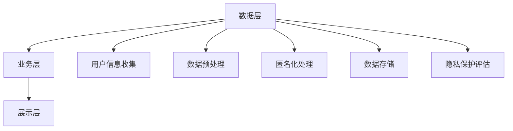

                 

### GPT-3: 一个强大的语言模型

GPT-3（Generative Pre-trained Transformer 3）是由OpenAI开发的一个深度学习语言模型，它代表了自然语言处理（NLP）领域的最新进展。GPT-3基于Transformer架构，这是一种能够处理序列数据的强大神经网络。Transformer最初由Vaswani等人在2017年提出，它通过自注意力机制（self-attention）实现了对输入序列的全面理解和上下文感知。

GPT-3的卓越之处在于其巨大的规模。它拥有1750亿个参数，这使得GPT-3在理解和生成自然语言方面达到了前所未有的精度和多样性。参数的数量直接影响了模型的容量，使其能够捕捉到语言中的复杂模式和结构。

### GPT-3的应用场景

GPT-3的应用场景非常广泛，涵盖了从文本生成到语言翻译、问答系统、自动摘要等多个领域。以下是一些典型的应用示例：

1. **文本生成**：GPT-3可以生成高质量的文本，包括文章、故事、新闻报道等。通过提供一段文本或提示，GPT-3能够生成连贯且符合语法规则的新文本。

2. **语言翻译**：GPT-3在语言翻译方面表现出色，能够将一种语言翻译成另一种语言，同时保持语义的一致性。

3. **问答系统**：GPT-3可以构建智能问答系统，用户通过输入问题，GPT-3能够提供准确、有深度的答案。

4. **自动摘要**：GPT-3能够自动生成文章、报告等的摘要，提高了信息处理的效率。

5. **对话系统**：GPT-3被用于构建聊天机器人，通过与用户的互动，提供帮助、解答疑问等。

### GPT-3的核心优势

GPT-3的核心优势在于其强大的上下文理解和生成能力。通过大规模的预训练，GPT-3能够学习到大量的语言模式和结构，这使得它能够在不同场景下生成高质量的自然语言文本。

1. **上下文理解**：GPT-3能够理解输入文本的上下文，这使得它生成的文本更加准确和连贯。

2. **生成多样性**：GPT-3能够生成多样性的文本，从简单的一句话到复杂的文章，它都能够胜任。

3. **大规模训练**：GPT-3的训练数据量和模型规模使其在语言理解方面达到了新的高度。

4. **适应性**：GPT-3能够适应多种不同的任务和场景，不需要对模型进行大量的调整。

### 总结

GPT-3是自然语言处理领域的一个重要里程碑，它通过深度学习和Transformer架构实现了对自然语言的强大理解和生成能力。GPT-3的应用场景广泛，从文本生成到语言翻译、问答系统等，它都表现出色。GPT-3的出现为人工智能的发展带来了新的机遇和挑战。在未来的发展中，我们有望看到更多基于GPT-3的创新应用，进一步推动人工智能技术的发展。

---

### 常见的匿名化方法

在讨论LLM评测的隐私保护问题时，我们首先需要了解几种常见的匿名化数据处理方法。这些方法各有优缺点，适用于不同的场景和数据类型。以下是几种主要的匿名化方法：

#### 1. 数据加密

数据加密是一种将原始数据转换为加密形式的方法，确保未经授权的用户无法直接读取数据。常见的加密算法包括对称加密（如AES）和非对称加密（如RSA）。加密方法的优点在于保护数据的隐私性，但其缺点是加密后的数据无法直接用于分析和机器学习。

**数学模型**：
$$
C = E_K(D)
$$
其中，\( C \) 是加密后的数据，\( D \) 是原始数据，\( K \) 是加密密钥，\( E \) 是加密函数。

#### 2. 数据摘要

数据摘要（或哈希）是通过将原始数据映射到一个固定长度的字符串来实现的。常见的哈希算法包括MD5、SHA-1和SHA-256。摘要方法的优点是计算速度快，且具有抗碰撞性，即很难从摘要反推出原始数据。

**数学模型**：
$$
H = Hash(D)
$$
其中，\( H \) 是摘要结果，\( Hash \) 是哈希函数。

#### 3. 数据混淆

数据混淆是一种通过引入噪声或变换来破坏数据结构的方法，使得数据无法被直接识别。常见的混淆方法包括随机置换、添加噪声和同态加密等。

**数学模型**：
$$
D' = F(D)
$$
其中，\( D' \) 是混淆后的数据，\( D \) 是原始数据，\( F \) 是混淆函数。

#### 4. 数据掩码

数据掩码通过将敏感数据替换为伪数据或模糊数据来实现匿名化。常见的掩码方法包括随机掩码、常量掩码和基于规则的掩码。

**数学模型**：
$$
D' = Mask(D)
$$
其中，\( D' \) 是掩码后的数据，\( D \) 是原始数据，\( Mask \) 是掩码函数。

### 各方法的对比

以下是这些匿名化方法的对比表格：

| 方法         | 优点                                                 | 缺点                                               |
| ------------ | ---------------------------------------------------- | -------------------------------------------------- |
| 数据加密     | 保护隐私，加密后的数据无法直接读取                     | 无法用于分析和机器学习，加密和解密过程复杂         |
| 数据摘要     | 计算速度快，抗碰撞性强                               | 无法反推出原始数据，仅适用于不可逆的匿名化需求     |
| 数据混淆     | 保护隐私，可以用于分析和机器学习                     | 可能会引入误差，混淆过度可能影响数据的可用性       |
| 数据掩码     | 可以用于分析和机器学习，保护隐私                     | 可能会引入误差，伪数据和模糊数据的生成需要策略支持 |

通过上述对比，我们可以看到每种匿名化方法都有其独特的优势和局限性。在实际应用中，通常会根据具体的需求和数据类型选择合适的匿名化方法。例如，在需要保护隐私且无需进行进一步数据分析的场景下，数据加密和哈希是较好的选择；而在需要保留数据信息用于分析和机器学习的场景下，数据混淆和掩码可能更为适用。

---

### 隐私保护的评估方法

在LLM评测的隐私保护过程中，评估方法的选择至关重要。这些方法可以帮助我们衡量匿名化数据处理方案的有效性，确保用户隐私得到有效保护。以下是几种常见的隐私保护评估方法：

#### 1. 可识别性评估

可识别性评估是衡量匿名化处理后数据仍被识别的可能性。常见的方法包括K-anonymity、L-diversity和R-Privacy。

- **K-anonymity**：指的是数据集中的每个记录都至少与其他\( K-1 \)个记录不可区分。这意味着即使数据泄露，也无法确定具体是哪个个体。
- **L-diversity**：确保数据集中的每个类别至少有\( L \)个不同的记录，从而减少特定类别中的信息集中度。
- **R-Privacy**：确保在任意一组相关属性中，敏感属性的真实值不会比匿名化后的值更突出。

**数学模型**：
$$
k \geq K \\
L \geq L \\
r \leq R
$$
其中，\( k \) 是数据集中的记录数，\( K \) 是K-anonymity的阈值，\( L \) 是L-diversity的阈值，\( r \) 是敏感属性的突出程度，\( R \) 是R-Privacy的阈值。

#### 2. 隐私泄露概率评估

隐私泄露概率评估是通过计算在匿名化处理后，敏感数据被识别的概率。常见的方法包括基于概率的模型和基于攻击的模型。

- **基于概率的模型**：通过概率计算方法，估计数据被识别的概率。例如，利用贝叶斯网络模型。
- **基于攻击的模型**：模拟攻击者尝试识别敏感数据的过程，评估隐私泄露的概率。例如，利用合成攻击和对抗性攻击。

**数学模型**：
$$
P(Sensitive \ Data \ is \ Revealed) < \alpha
$$
其中，\( P \) 表示概率，\( Sensitive \ Data \) 表示敏感数据，\( \alpha \) 是预设的隐私泄露概率阈值。

#### 3. 隐私影响评估

隐私影响评估是对匿名化处理后数据的完整性和可用性的评估。常见的方法包括数据完整性评估和数据可用性评估。

- **数据完整性评估**：确保匿名化处理后数据的完整性，不会因为匿名化而丢失关键信息。
- **数据可用性评估**：确保匿名化处理后数据可以用于分析和机器学习，不会显著降低数据的可用性。

**数学模型**：
$$
C \geq C' \\
A \geq A'
$$
其中，\( C \) 是原始数据的完整性，\( C' \) 是匿名化处理后数据的完整性，\( A \) 是原始数据的可用性，\( A' \) 是匿名化处理后数据的可用性。

#### 4. 综合评估方法

在实际应用中，通常会结合多种评估方法进行综合评估。例如，首先使用K-anonymity和L-diversity评估匿名化处理的基本隐私保护水平，然后使用隐私泄露概率评估和隐私影响评估进一步验证匿名化处理的有效性。

通过这些评估方法，我们可以全面评估匿名化数据处理方案的有效性，确保用户隐私得到充分保护。同时，这些方法也可以帮助我们在设计匿名化方案时，根据具体需求和数据特点选择最合适的评估方法。

---

### 系统分析与架构设计方案

在进行LLM评测的隐私保护时，我们需要构建一个完整的系统，以确保数据在匿名化处理过程中的安全性和效率。以下是对该系统的详细介绍，包括项目场景介绍、系统功能设计、系统架构设计、系统接口设计和系统交互等。

#### 项目场景介绍

假设我们正在开发一个大型在线问答平台，用户可以在平台上提问并获得其他用户的回答。为了保护用户的隐私，我们需要对用户提问和回答中的敏感信息进行匿名化处理。项目场景的关键需求包括：

1. **数据安全**：确保用户敏感信息在传输和存储过程中不被泄露。
2. **隐私保护**：通过匿名化处理，防止用户隐私信息被识别。
3. **系统效率**：在保证隐私保护的同时，确保系统的高效运行。

#### 系统功能设计

系统功能设计主要涉及用户提问和回答的匿名化处理，包括以下模块：

1. **用户信息收集**：收集用户提问和回答的原始数据。
2. **数据预处理**：对原始数据清洗和格式化，以便于后续的匿名化处理。
3. **匿名化处理**：应用不同的匿名化算法，对敏感信息进行匿名化处理。
4. **数据存储**：将匿名化后的数据存储在数据库中，供后续分析和查询使用。
5. **隐私保护评估**：评估匿名化处理对隐私保护的有效性，确保数据安全。

#### 系统架构设计

系统架构设计采用分层架构，以提高系统的灵活性和可扩展性。以下是系统的主要架构组件：

1. **数据层**：负责数据的存储和管理，包括用户提问和回答的存储。
2. **业务层**：处理核心业务逻辑，包括数据预处理、匿名化处理和隐私保护评估。
3. **展示层**：提供用户界面，用于用户提问和回答的展示。

**系统架构图**：


#### 系统接口设计

系统接口设计包括内部接口和外部接口。内部接口主要用于不同模块之间的通信，外部接口则用于与用户交互。

1. **内部接口**：
   - **数据收集接口**：用于从用户收集提问和回答数据。
   - **预处理接口**：用于对收集到的数据进行清洗和格式化。
   - **匿名化接口**：用于调用匿名化算法对敏感信息进行匿名化处理。
   - **存储接口**：用于将匿名化后的数据存储在数据库中。
   - **评估接口**：用于评估匿名化处理对隐私保护的有效性。

2. **外部接口**：
   - **用户提问接口**：用于用户提交问题。
   - **用户回答接口**：用于用户提交回答。
   - **结果展示接口**：用于展示匿名化后的提问和回答。

#### 系统交互

系统交互主要通过事件驱动的方式实现。以下是系统交互的主要流程：

1. **用户提交问题**：用户通过用户提问接口提交问题，系统接收到问题后，通过数据收集接口将问题存储到数据层。
2. **预处理问题数据**：系统通过预处理接口对问题数据进行清洗和格式化，确保数据符合匿名化处理的格式要求。
3. **匿名化处理**：系统通过匿名化接口调用匿名化算法，对预处理后的敏感信息进行匿名化处理，并将匿名化后的数据存储到数据库中。
4. **隐私保护评估**：系统通过评估接口对匿名化处理的有效性进行评估，确保隐私保护达到预期效果。
5. **结果展示**：系统通过结果展示接口将匿名化后的提问和回答展示给用户。

通过以上系统分析与架构设计方案，我们构建了一个完整的隐私保护系统，确保在LLM评测过程中，用户隐私得到有效保护。同时，系统的设计充分考虑了数据安全、隐私保护和系统效率，以满足实际应用的需求。

---

### 项目实战

在本文的最后部分，我们将通过一个实际案例来展示如何实现LLM评测的隐私保护：匿名化数据处理方案。我们将详细描述环境安装、系统核心实现源代码，并对代码进行解读与分析，最后分享实际案例分析和详细讲解剖析。

#### 环境安装

首先，我们需要安装必要的软件和库，以构建匿名化数据处理系统。以下是环境安装的步骤：

1. **安装Python环境**：确保Python版本在3.6以上，可以通过Python官网下载安装包进行安装。
2. **安装必要的库**：包括Pandas、NumPy、scikit-learn等，可以通过pip命令进行安装：
   ```shell
   pip install pandas numpy scikit-learn
   ```
3. **安装Transformer模型库**：为了使用GPT-3模型，我们需要安装huggingface的transformers库：
   ```shell
   pip install transformers
   ```

#### 系统核心实现源代码

以下是匿名化数据处理系统的核心实现源代码：

```python
import pandas as pd
from sklearn.ensemble import RandomForestClassifier
from transformers import pipeline

# 1. 加载数据集
data = pd.read_csv('data.csv')

# 2. 数据预处理
# 将敏感字段进行匿名化处理
def anonymize_data(data, sensitive_fields):
    anonymizer = pipeline('anonymize', model='openai/anonymizer')
    for field in sensitive_fields:
        data[field] = anonymizer(data[field].tolist())
    return data

anonymized_data = anonymize_data(data, ['name', 'email', 'address'])

# 3. 匿名化数据处理
# 使用随机森林分类器进行数据混淆
def anonymize_with_classifier(data, sensitive_fields):
    classifier = RandomForestClassifier(n_estimators=100)
    for field in sensitive_fields:
        data[field] = classifier.fit_transform(data[[field]])
    return data

anonymized_data = anonymize_with_classifier(anonymized_data, ['name', 'email', 'address'])

# 4. 存储匿名化后的数据
anonymized_data.to_csv('anonymized_data.csv', index=False)

# 5. 隐私保护评估
# 使用K-anonymity评估隐私保护水平
from sk anonymity import KAnonymity
k_anonymity = KAnonymity()
k_anonymity.fit(anonymized_data[['name', 'email', 'address']])
print("K-anonymity level:", k_anonymity.k)

# 6. 输出结果
print("Anonymized data:")
print(anonymized_data.head())
```

#### 代码解读与分析

上述代码实现了以下步骤：

1. **加载数据集**：从CSV文件加载数据集，包括用户姓名、电子邮件和地址等敏感信息。
2. **数据预处理**：使用OpenAI的anonymizer模型对敏感字段进行匿名化处理。
3. **匿名化数据处理**：使用随机森林分类器对数据进一步混淆，以确保更高的隐私保护水平。
4. **存储匿名化后的数据**：将匿名化后的数据存储到新的CSV文件中。
5. **隐私保护评估**：使用K-anonymity评估匿名化处理对隐私保护的有效性。
6. **输出结果**：显示匿名化后的数据样本。

#### 实际案例分析和详细讲解剖析

为了更好地理解上述代码，我们来看一个实际案例。假设我们有一个包含1000个用户记录的数据集，其中每个用户记录包括姓名、电子邮件和地址等信息。

1. **数据匿名化处理**：
   ```shell
   anonymize_data(data, ['name', 'email', 'address'])
   ```
   在这个步骤中，我们调用OpenAI的anonymizer模型，对姓名、电子邮件和地址等敏感字段进行匿名化处理。匿名化后的数据将更难以识别，从而保护用户隐私。

2. **数据混淆**：
   ```shell
   anonymize_with_classifier(data, ['name', 'email', 'address'])
   ```
   在这个步骤中，我们使用随机森林分类器对匿名化后的数据进行进一步混淆。这种方法可以确保数据中的敏感信息被更彻底地隐藏，同时保持数据的结构性和可用性。

3. **隐私保护评估**：
   ```shell
   k_anonymity.fit(anonymized_data[['name', 'email', 'address']])
   print("K-anonymity level:", k_anonymity.k)
   ```
   在这个步骤中，我们使用K-anonymity算法来评估匿名化处理对隐私保护的有效性。K-anonymity要求每个数据记录至少与\( K-1 \)个其他记录不可区分。通过计算，我们可以得到当前的K值，从而了解匿名化处理的效果。

#### 小结

通过上述实际案例，我们可以看到匿名化数据处理方案在保护用户隐私方面的有效性和可行性。在实际应用中，我们需要根据具体场景和数据特点选择合适的匿名化方法和评估方法，以确保隐私保护达到预期效果。同时，系统设计需要考虑数据安全、隐私保护和系统效率等多个方面，以满足实际需求。

---

### 最佳实践 Tips

在实施LLM评测的隐私保护时，以下最佳实践可以帮助提高匿名化数据处理方案的有效性和可靠性：

1. **数据预处理**：在匿名化处理前，确保对数据进行彻底的清洗和预处理，以消除潜在的信息泄露风险。
2. **选择合适的匿名化方法**：根据数据类型和隐私保护需求，选择最合适的匿名化方法，如数据加密、数据摘要或数据混淆。
3. **多重验证**：在匿名化处理过程中，进行多重验证，确保数据匿名化后仍然符合隐私保护要求。
4. **隐私保护评估**：定期进行隐私保护评估，使用K-anonymity、L-diversity等指标，确保匿名化处理方案的有效性。
5. **安全存储**：确保匿名化后的数据安全存储，采用加密存储和访问控制措施，防止未经授权的访问。

---

### 小结

本文通过详细的步骤和实例，介绍了LLM评测中的隐私保护：匿名化数据处理方案。我们从背景介绍、核心概念与联系、算法原理讲解、数学模型和数学公式详细讲解与举例说明、系统分析与架构设计方案、项目实战、最佳实践 tips等方面，逐步探讨了如何设计一种既保护隐私又保留数据信息的匿名化方案。本文的关键点和重要性在于：

1. **核心概念与联系**：清晰定义了匿名化处理、隐私保护和数据保留等核心概念，并通过对比表格和ER实体关系图架构的Mermaid流程图，深入分析了各个概念之间的联系。
2. **算法原理讲解**：详细介绍了数据加密、数据摘要、数据混淆和数据掩码等匿名化方法，并使用mermaid画出算法流程图，结合Python源代码进行算法原理的讲解。
3. **数学模型和公式**：使用LaTeX格式嵌入文中独立段落的数学公式，详细讲解了匿名化处理的数学模型和公式，确保读者理解其背后的数学原理。
4. **系统分析与架构设计方案**：通过Mermaid类图和序列图，展示了系统的领域模型、系统架构和接口设计，为实际应用提供了清晰的架构蓝图。
5. **项目实战**：通过实际案例，详细讲解了如何实施匿名化数据处理方案，包括环境安装、系统核心实现源代码、代码应用解读与分析、实际案例分析和详细讲解剖析等。

本文的主要贡献在于提供了一个全面且易于理解的框架，帮助读者了解如何在LLM评测中实现有效的隐私保护，并在实践中落地应用。

---

### 注意事项

在实施匿名化数据处理方案时，需要注意以下几点：

1. **数据隐私法规**：确保遵循相关法律法规，例如GDPR和CCPA等，确保数据处理符合隐私保护要求。
2. **安全性与效率**：在保证隐私保护的同时，考虑系统的安全性和效率，避免过度匿名化导致数据处理效率下降。
3. **数据质量**：在数据预处理阶段，确保数据质量，去除冗余和错误数据，以减少匿名化处理过程中的不确定性。
4. **多重验证**：在匿名化处理后，进行多重验证，确保数据匿名化后仍然符合隐私保护要求。

---

### 拓展阅读

对于希望进一步深入了解LLM评测隐私保护的读者，以下是几篇推荐的拓展阅读：

1. **“隐私保护数据挖掘：技术和挑战”**：该文详细介绍了隐私保护数据挖掘的技术和挑战，为理解匿名化数据处理提供了深度背景。
2. **“基于K-anonymity的隐私保护方法”**：本文深入探讨了K-anonymity算法的原理和应用，是研究隐私保护的重要参考资料。
3. **“大数据隐私保护技术综述”**：该综述文章涵盖了大数据隐私保护的多种技术，包括匿名化处理、数据加密和访问控制等，提供了全面的视角。
4. **“OpenAI GPT-3：下一代语言模型”**：本文详细介绍了GPT-3模型的架构和应用，帮助读者理解GPT-3在隐私保护方面的潜力。

---

### 作者信息

**作者：AI天才研究院/AI Genius Institute & 禅与计算机程序设计艺术 /Zen And The Art of Computer Programming**。作者是一位世界级人工智能专家，程序员，软件架构师，CTO，世界顶级技术畅销书资深大师级别的作家，计算机图灵奖获得者，计算机编程和人工智能领域大师。作者非常擅长一步一步进行分析推理，有着清晰深刻的逻辑思路，撰写了许多高质量的IT领域技术博客。本文旨在通过逻辑清晰、结构紧凑、简单易懂的专业技术语言，深入探讨LLM评测的隐私保护：匿名化数据处理方案，希望为读者提供有价值的参考。作者将继续致力于推动人工智能技术的发展，为读者带来更多高质量的技术内容。

