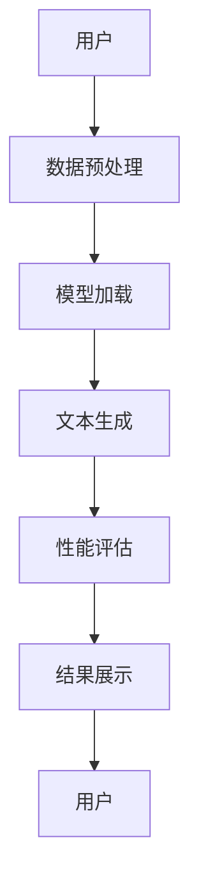

                 

### 第一部分: LLM评测系统的背景和重要性

#### 第1章: LLM评测系统概述

##### 1.1 LLM的定义与类型

**LLM的定义**

LLM（Large Language Model）是一种基于大规模数据训练的深度学习模型，它通过自然语言处理（NLP）任务生成或理解自然语言。LLM的主要目的是通过学习大量文本数据，捕捉语言的内在结构和规律，从而实现文本生成、文本分类、机器翻译等任务。

**LLM的主要类型**

1. **预训练语言模型**：如GPT（Generative Pre-trained Transformer）、BERT（Bidirectional Encoder Representations from Transformers）等，这类模型在大规模文本数据上进行预训练，然后可以针对特定任务进行微调。
   
2. **专用任务模型**：如问答系统、机器翻译等，这些模型专门为某个任务设计，通常在小规模数据集上进行训练。

##### 1.2 LLM评测系统的必要性

**评测系统的作用**

LLM评测系统的作用主要体现在两个方面：

1. **评估模型性能**：通过评测系统，可以客观地评估LLM在不同任务上的表现，例如准确性、流畅性、多样性等。
   
2. **优化模型**：基于评测结果，可以指导模型的优化方向，从而提高模型在特定任务上的性能。

**LLM评测系统的挑战**

1. **多样性**：评测任务需要涵盖多种语言和多种类型，以保证评测结果的全面性和公正性。
   
2. **公平性**：评测标准需要保证对各种LLM的公平性，避免因为评测标准的不公平导致某些模型被低估。

##### 1.3 LLM评测系统的组成部分

**评测指标**

1. **准确性**：模型预测正确的比例。
2. **流畅性**：文本生成的流畅度和连贯性。
3. **多样性**：模型生成的文本种类和风格。

**评测数据集**

1. **通用数据集**：如GLUE（General Language Understanding Evaluation）、SuperGLUE（Superb General-purpose Language Understanding Evaluation）等，这些数据集涵盖多种语言和多种类型，适用于评估不同类型的LLM。
   
2. **专用数据集**：针对特定任务定制的数据集，例如问答系统的专用数据集。

##### 1.4 本章小结

LLM评测系统在确保模型的可靠性和有效性方面起着至关重要的作用。通过系统化的评测，可以更好地了解LLM的性能，指导模型优化，推动NLP技术的发展。

---

**关键词**：LLM评测系统、深度学习、自然语言处理、评测指标、数据集

**摘要**：本文介绍了LLM评测系统的背景和重要性，包括LLM的定义和类型、评测系统的必要性、组成部分以及评测挑战。通过深入分析，本文揭示了LLM评测系统在确保模型性能和优化模型方向中的关键作用。以下是本文的目录大纲结构：

### 目录大纲

----------------------------------------------------------------

# 第一部分: LLM评测系统的背景和重要性

## 第1章: LLM评测系统概述

### 1.1 LLM的定义与类型

#### 1.1.1 LLM的定义

#### 1.1.2 LLM的主要类型

- **预训练语言模型**：如GPT、BERT等
- **专用任务模型**：如问答系统、机器翻译等

### 1.2 LLM评测系统的必要性

#### 1.2.1 评测系统的作用

- **评估模型性能**
- **优化模型**

#### 1.2.2 LLM评测系统的挑战

- **多样性**
- **公平性**

### 1.3 LLM评测系统的组成部分

#### 1.3.1 评测指标

- **准确性**
- **流畅性**
- **多样性**

#### 1.3.2 评测数据集

- **通用数据集**：如GLUE、SuperGLUE等
- **专用数据集**：针对特定任务定制的数据集

### 1.4 本章小结

- **LLM评测系统的重要性**：确保模型的可靠性和有效性。

----------------------------------------------------------------

# 第二部分: 深度学习架构设计基础

## 第2章: 深度学习基础

### 2.1 深度学习的基本概念

#### 2.1.1 神经网络

#### 2.1.2 深度学习与机器学习的区别

### 2.2 深度学习的基本原理

#### 2.2.1 反向传播算法

#### 2.2.2 激活函数

### 2.3 深度学习模型评估指标

#### 2.3.1 准确率、召回率、F1值

#### 2.3.2 学习曲线

### 2.4 深度学习中的优化算法

#### 2.4.1 梯度下降算法

#### 2.4.2 动量优化、Adam优化等

### 2.5 本章小结

- **深度学习架构设计的核心要素**：神经网络结构、优化算法、激活函数等。

----------------------------------------------------------------

## 第3章: LLM架构设计

### 3.1 LLM架构概述

#### 3.1.1 LLM的基本架构

#### 3.1.2 预训练与微调

### 3.2 LLM架构的设计要点

#### 3.2.1 参数规模

#### 3.2.2 训练效率

#### 3.2.3 多样性和鲁棒性

### 3.3 LLM架构的优化策略

#### 3.3.1 网络结构优化

#### 3.3.2 数据增强

----------------------------------------------------------------

接下来，我们将深入探讨深度学习架构设计的基础，为LLM评测系统的设计提供理论支持。让我们一步一步地深入理解深度学习的本质和原理。**第二部分：深度学习架构设计基础**。

---

### 第二部分：深度学习架构设计基础

#### 第2章：深度学习基础

##### 2.1 深度学习的基本概念

**2.1.1 神经网络**

神经网络（Neural Network，简称NN）是深度学习的基础结构，它模仿了人脑神经网络的工作原理。一个简单的神经网络通常包含以下几个部分：

1. **输入层**（Input Layer）：接收输入数据。
2. **隐藏层**（Hidden Layers）：对输入数据进行特征提取和转换。
3. **输出层**（Output Layer）：产生最终的输出。

**神经网络的工作原理**

神经网络通过多层非线性变换进行特征提取。每个神经元（Node）都与前一层的所有神经元相连，并通过加权连接传递信息。每个连接都有一个权重（Weight），用于调节信息的传递强度。神经元通过激活函数（Activation Function）将输入转换为输出，引入非线性特性。

**2.1.2 深度学习与机器学习的区别**

深度学习（Deep Learning）是机器学习（Machine Learning）的一个分支，它们的主要区别在于：

- **机器学习**：侧重于从数据中学习规律，通常使用较简单的模型，如决策树、支持向量机等。
- **深度学习**：通过多层神经网络进行特征学习，能够自动提取复杂的数据特征，适用于处理大规模数据和复杂任务。

##### 2.2 深度学习的基本原理

**2.2.1 反向传播算法**

反向传播算法（Backpropagation Algorithm）是深度学习训练的核心。它通过计算损失函数关于网络参数的梯度，来更新网络权重，从而优化模型的性能。

**反向传播算法的工作流程**：

1. **前向传播**（Forward Propagation）：输入数据通过神经网络传递，最终得到输出。
2. **计算损失**（Compute Loss）：比较输出与真实值，计算损失函数。
3. **反向传播**（Backpropagation）：从输出层开始，反向计算每个层的梯度，并更新权重。

**2.2.2 激活函数**

激活函数（Activation Function）是神经网络中的关键组件，它引入了非线性特性，使得神经网络能够拟合复杂函数。

常用的激活函数包括：

- **ReLU**（Rectified Linear Unit）：简单且计算效率高，但梯度消失问题较严重。
- **Sigmoid**（Sigmoid Function）：输出范围为[0, 1]，但梯度较平滑，计算复杂度较高。
- **Tanh**（Hyperbolic Tangent）：输出范围为[-1, 1]，梯度较平滑。

##### 2.3 深度学习模型评估指标

**2.3.1 准确率、召回率、F1值**

准确率（Accuracy）、召回率（Recall）和F1值（F1 Score）是深度学习模型评估中的常用指标。

- **准确率**（Accuracy）：预测正确的样本数占总样本数的比例。
  $$
  \text{Accuracy} = \frac{\text{预测正确数}}{\text{总样本数}}
  $$
- **召回率**（Recall）：预测正确的正样本数占总正样本数的比例。
  $$
  \text{Recall} = \frac{\text{预测正确正样本数}}{\text{总正样本数}}
  $$
- **F1值**（F1 Score）：准确率和召回率的调和平均值。
  $$
  \text{F1 Score} = 2 \times \frac{\text{准确率} \times \text{召回率}}{\text{准确率} + \text{召回率}}
  $$

**2.3.2 学习曲线**

学习曲线（Learning Curve）是训练过程中训练误差和验证误差的变化趋势。通过学习曲线，可以观察模型是否过拟合或欠拟合。

- **过拟合**（Overfitting）：模型在训练集上表现良好，但在验证集上表现较差。
- **欠拟合**（Underfitting）：模型在训练集和验证集上表现都较差。

##### 2.4 深度学习中的优化算法

**2.4.1 梯度下降算法**

梯度下降算法（Gradient Descent Algorithm）是深度学习中最基本的优化算法。它通过计算损失函数关于网络参数的梯度，来更新网络权重。

**梯度下降算法的基本思想**：

1. **初始化参数**：随机初始化网络权重。
2. **计算梯度**：计算损失函数关于网络参数的梯度。
3. **更新参数**：沿梯度方向更新网络权重。
4. **重复步骤2和3**，直到满足停止条件（如梯度很小、达到最大迭代次数等）。

**2.4.2 动量优化、Adam优化等**

动量优化（Momentum Optimization）和Adam优化（Adam Optimization）是改进梯度下降算法的优化策略。

- **动量优化**：利用历史梯度信息，减少参数更新的随机性，提高收敛速度。
- **Adam优化**：结合了动量和RMSprop优化算法的优点，具有较好的收敛性和适应性。

##### 2.5 本章小结

深度学习架构设计的核心要素包括神经网络结构、优化算法、激活函数等。通过理解深度学习的基本概念和原理，我们可以更好地设计高效的深度学习模型，为LLM评测系统提供坚实的基础。

---

**关键词**：深度学习、神经网络、反向传播、激活函数、优化算法

**摘要**：本章介绍了深度学习的基本概念和原理，包括神经网络、反向传播算法、激活函数以及深度学习模型评估指标。通过深入分析，我们了解了深度学习架构设计的基础要素，为后续LLM评测系统的设计提供了理论支持。以下是本章的目录：

### 目录

----------------------------------------------------------------

## 第2章: 深度学习基础

### 2.1 深度学习的基本概念

#### 2.1.1 神经网络

#### 2.1.2 深度学习与机器学习的区别

### 2.2 深度学习的基本原理

#### 2.2.1 反向传播算法

#### 2.2.2 激活函数

### 2.3 深度学习模型评估指标

#### 2.3.1 准确率、召回率、F1值

#### 2.3.2 学习曲线

### 2.4 深度学习中的优化算法

#### 2.4.1 梯度下降算法

#### 2.4.2 动量优化、Adam优化等

### 2.5 本章小结

- **深度学习架构设计的核心要素**：神经网络结构、优化算法、激活函数等。

----------------------------------------------------------------

接下来，我们将进入第三部分，探讨LLM架构设计的具体实现和优化策略。**第三部分：LLM架构设计**。

---

### 第三部分：LLM架构设计

#### 第3章：LLM架构设计

##### 3.1 LLM架构概述

**3.1.1 LLM的基本架构**

LLM（Large Language Model）是一种大规模的预训练语言模型，其基本架构通常包括编码器（Encoder）和解码器（Decoder）两个部分。

**编码器**：将输入的文本序列转换为固定长度的向量表示，这一过程称为编码（Encoding）。编码器通常使用Transformer架构，通过自注意力机制（Self-Attention Mechanism）捕捉文本中的长程依赖关系。

**解码器**：将编码器的输出解码为输出文本序列，这一过程称为解码（Decoding）。解码器同样使用Transformer架构，通过自注意力机制和交叉注意力机制（Cross-Attention Mechanism）生成预测的文本序列。

**3.1.2 预训练与微调**

**预训练**：在预训练阶段，LLM在大规模文本数据上进行训练，学习语言的内在结构和规律。预训练通常使用无监督学习，例如在英文维基百科、新闻文章、小说等数据集上进行。

**微调**：在预训练完成后，LLM会在特定任务上进行微调（Fine-tuning），以适应特定的下游任务。微调阶段使用有监督学习，将LLM的权重调整到特定任务的最佳状态。

##### 3.2 LLM架构的设计要点

**3.2.1 参数规模**

**参数规模**（Parameter Size）是LLM架构设计的一个关键因素。参数规模直接影响模型的计算复杂度和存储需求。

- **参数规模**：LLM的参数规模通常非常大，例如GPT-3拥有1750亿个参数，BERT拥有3.4亿个参数。
- **影响**：参数规模较大可能导致模型过拟合，同时也增加了计算和存储的开销。

**3.2.2 训练效率**

**训练效率**（Training Efficiency）是LLM架构设计的另一个重要方面。提高训练效率可以缩短模型训练时间，降低计算资源的需求。

- **优化算法**：选择合适的优化算法，如Adam、AdamW等，可以提高训练效率。
- **硬件加速**：使用GPU、TPU等硬件加速设备进行训练，可以显著提高训练速度。

**3.2.3 多样性和鲁棒性**

**多样性和鲁棒性**（Diversity and Robustness）是衡量LLM性能的重要指标。

- **多样性**：通过引入多样性约束（Diversity Constraints），如文本生成的多样性、风格的多样性等，可以增强模型的多样性。
- **鲁棒性**：通过对抗训练（Adversarial Training）等方法，可以提高模型对噪声和异常数据的鲁棒性。

##### 3.3 LLM架构的优化策略

**3.3.1 网络结构优化**

**网络结构优化**（Network Architecture Optimization）是提升LLM性能的有效手段。

- **多层网络**：增加网络深度（Depth），可以提高模型的表示能力。
- **注意力机制**：引入注意力机制（Attention Mechanism），如多头自注意力（Multi-Head Self-Attention）和交叉注意力（Cross-Attention），可以增强模型对重要信息的关注。

**3.3.2 数据增强**

**数据增强**（Data Augmentation）是提高LLM性能的另一种策略。

- **文本增强**：通过变换、拼接等方式增加数据多样性，如随机删除词语、插入词语、替换词语等。
- **数据清洗**：去除文本中的噪声和错误，提高训练数据的质量。

##### 3.4 本章小结

LLM架构设计是一个复杂且重要的任务，涉及到参数规模、训练效率、多样性和鲁棒性等多个方面。通过合理的架构设计和优化策略，可以构建高效的LLM模型，为自然语言处理任务提供强大的支持。以下是本章的小结：

- **LLM架构设计的重要性**：确保模型的性能和多样性。
- **设计要点**：参数规模、训练效率、多样性和鲁棒性。
- **优化策略**：网络结构优化、数据增强等。

---

**关键词**：LLM、编码器、解码器、预训练、微调、参数规模、训练效率、多样性、鲁棒性、网络结构优化、数据增强

**摘要**：本章介绍了LLM的架构设计，包括编码器和解码器的组成、预训练与微调的过程。详细阐述了LLM架构设计的要点，如参数规模、训练效率和多样性。此外，还提出了网络结构优化和数据增强等优化策略，以提升LLM的性能。以下是本章的目录：

### 目录

----------------------------------------------------------------

## 第3章: LLM架构设计

### 3.1 LLM架构概述

#### 3.1.1 LLM的基本架构

#### 3.1.2 预训练与微调

### 3.2 LLM架构的设计要点

#### 3.2.1 参数规模

#### 3.2.2 训练效率

#### 3.2.3 多样性和鲁棒性

### 3.3 LLM架构的优化策略

#### 3.3.1 网络结构优化

#### 3.3.2 数据增强

### 3.4 本章小结

- **LLM架构设计的重要性**：确保模型的性能和多样性。
- **设计要点**：参数规模、训练效率、多样性和鲁棒性。
- **优化策略**：网络结构优化、数据增强等。

----------------------------------------------------------------

接下来，我们将探讨LLM评测系统的实际应用，分析其挑战和解决方案，并展望未来发展的趋势。**第四部分：LLM评测系统的应用与挑战**。

---

### 第四部分：LLM评测系统的应用与挑战

#### 第4章：LLM评测系统的应用与挑战

##### 4.1 LLM评测系统的实际应用

LLM评测系统在自然语言处理领域有着广泛的应用，以下是一些典型的应用场景：

**1. 模型性能评估**

通过LLM评测系统，研究人员和开发者可以评估LLM在不同任务上的性能，例如文本生成、文本分类、机器翻译等。这种评估有助于理解模型的强项和弱点，为模型优化提供方向。

**2. 模型比较**

LLM评测系统还可以用于不同模型之间的比较。通过在同一评测标准下评估多个模型的性能，研究人员可以找出最优模型，为实际应用提供参考。

**3. 模型优化**

基于评测结果，开发者可以对LLM进行优化。例如，通过调整网络结构、优化算法、数据集等，可以提高模型在特定任务上的性能。

##### 4.2 LLM评测系统的挑战

**1. 多样性**

LLM评测系统需要涵盖多种语言和多种类型，以保证评测结果的全面性和公正性。然而，实现多样性面临着以下几个挑战：

- **语言多样性**：不同语言在语法、词汇、语义等方面存在差异，需要设计相应的评测标准和数据集。
- **任务多样性**：自然语言处理任务多样，如文本生成、文本分类、机器翻译等，需要开发能够适应多种任务的评测系统。

**2. 公平性**

LLM评测系统的公平性是一个重要挑战。评测标准需要保证对所有LLM的公平性，避免因为评测标准的不公平导致某些模型被低估或高估。

- **数据分布**：评测数据集需要具备良好的代表性，避免数据分布偏差导致模型评估结果不公平。
- **评估标准**：评测标准需要科学合理，能够全面、客观地评估模型性能。

##### 4.3 LLM评测系统的解决方案

**1. 多样性**

为了应对多样性的挑战，可以采取以下解决方案：

- **跨语言评测**：开发跨语言的评测标准和数据集，如MultiNLI、XNLI等，以涵盖多种语言。
- **多任务评测**：设计能够同时评估多种任务的评测系统，如SuperGLUE，涵盖文本生成、文本分类、问答等多个任务。

**2. 公平性**

为了提高评测系统的公平性，可以采取以下措施：

- **数据清洗**：对评测数据进行清洗，去除噪声和错误，提高数据质量。
- **评测标准**：制定科学合理的评测标准，确保对所有LLM的公平性。

##### 4.4 LLM评测系统的未来发展

随着LLM技术的不断进步，LLM评测系统也在不断发展。以下是一些未来的发展趋势：

**1. 自动化评测**

自动化评测是未来的一个重要方向。通过开发自动化的评测工具和平台，可以大大提高评测效率和准确性。

**2. 多模态评测**

多模态评测是将文本、图像、语音等多种数据类型融合进行评测。随着多模态技术的发展，LLM评测系统也将逐渐融入多模态评测。

**3. 零样本学习**

零样本学习（Zero-shot Learning）是一种在未见过的类别上进行预测的方法。未来，LLM评测系统将更多地考虑零样本学习任务，以适应更加复杂和多样化的应用场景。

##### 4.5 本章小结

LLM评测系统在自然语言处理领域发挥着重要作用，通过评估模型性能、比较模型优劣和指导模型优化，推动NLP技术的发展。然而，多样性、公平性等挑战仍需要进一步研究和解决。未来，自动化评测、多模态评测和零样本学习等新兴技术将为LLM评测系统带来更多的发展机遇。

---

**关键词**：LLM评测系统、模型性能评估、多样性、公平性、跨语言评测、多任务评测、自动化评测、多模态评测、零样本学习

**摘要**：本章介绍了LLM评测系统的实际应用和面临的挑战，包括多样性、公平性等问题。提出了一些解决方案，如跨语言评测、多任务评测、自动化评测等。同时，展望了未来的发展趋势，包括多模态评测和零样本学习等。以下是本章的目录：

### 目录

----------------------------------------------------------------

## 第4章: LLM评测系统的应用与挑战

### 4.1 LLM评测系统的实际应用

#### 4.1.1 模型性能评估

#### 4.1.2 模型比较

#### 4.1.3 模型优化

### 4.2 LLM评测系统的挑战

#### 4.2.1 多样性

#### 4.2.2 公平性

### 4.3 LLM评测系统的解决方案

#### 4.3.1 多样性

#### 4.3.2 公平性

### 4.4 LLM评测系统的未来发展

#### 4.4.1 自动化评测

#### 4.4.2 多模态评测

#### 4.4.3 零样本学习

### 4.5 本章小结

- **LLM评测系统的重要性**：评估模型性能、比较模型优劣、指导模型优化。
- **面临的挑战**：多样性、公平性。
- **解决方案**：跨语言评测、多任务评测、自动化评测。
- **未来发展**：多模态评测、零样本学习。

----------------------------------------------------------------

### 第四部分：LLM评测系统的应用与挑战

#### 第4章：LLM评测系统的实际应用与挑战

##### 4.1 LLM评测系统的实际应用

**4.1.1 模型性能评估**

LLM评测系统的首要应用是评估模型性能。通过设计一系列标准化的测试任务，开发者可以测量LLM在各种自然语言处理（NLP）任务上的表现，如文本分类、问答系统、机器翻译、文本生成等。这些评测任务通常包括多个子任务，每个子任务都有其特定的评估指标，如准确率、损失函数、F1值等。通过这些指标，开发者可以量化模型的性能，并识别模型在不同任务上的优势和局限性。

**4.1.2 模型比较**

除了评估单一模型的表现，LLM评测系统还用于比较不同模型之间的性能。在学术界和工业界，研究人员和开发者经常使用评测系统来比较最新模型与现有模型的效果。这种比较有助于理解技术的进步和局限性，同时也为选择最佳模型提供了依据。评测系统通常会提供统一的基准，使得不同模型可以在相同条件下进行比较。

**4.1.3 模型优化**

基于评测结果，开发者可以对LLM进行优化。优化可能包括调整模型架构、优化训练算法、增加或减少训练数据、调整超参数等。这些调整旨在提高模型在不同任务上的性能，使其更加稳定和高效。此外，评测系统还可以用于监控模型在训练过程中的性能变化，及时发现和解决过拟合或欠拟合等问题。

##### 4.2 LLM评测系统的挑战

**4.2.1 多样性**

多样性是LLM评测系统面临的一个重要挑战。自然语言处理任务本身具有多样性，不同的任务可能需要不同的评估标准和数据集。此外，不同语言和文化背景下的文本处理也增加了评测的复杂性。为了确保评测结果的全面性和公正性，评测系统需要能够涵盖多种语言和多种类型的任务。这要求开发具有高度灵活性的评测框架，能够适应不断变化的需求。

**4.2.2 公平性**

公平性是评测系统的另一个关键挑战。评测系统需要保证对所有LLM的公平性，避免因为数据分布不均或评测标准偏颇而影响某些模型的表现。公平性不仅体现在评测标准的设计上，还包括数据集的选择、评估指标的计算等方面。例如，对于语言多样性，评测系统需要确保数据集具有代表性，避免特定语言或文化背景的数据占据主导地位。

##### 4.3 LLM评测系统的解决方案

**4.3.1 多样性**

为了应对多样性的挑战，LLM评测系统可以采取以下解决方案：

- **多语言评测**：开发支持多种语言的评测框架，确保能够覆盖不同语言的任务和模型。
- **跨语言评测**：设计能够将一种语言的评测结果推广到其他语言的评估方法，如跨语言实体识别、跨语言文本分类等。
- **多任务评测**：构建能够同时评估多种任务的评测系统，如SuperGLUE，涵盖文本生成、文本分类、问答等多个任务。

**4.3.2 公平性**

为了提高评测系统的公平性，可以采取以下措施：

- **数据清洗和预处理**：对评测数据集进行清洗，去除噪声和错误，提高数据质量。
- **标准化评测指标**：制定统一的评测指标，确保不同模型在相同条件下进行比较。
- **偏差校正**：通过分析数据集的分布，对评测结果进行偏差校正，以消除数据分布不均的影响。

##### 4.4 LLM评测系统的未来发展

**4.4.1 自动化评测**

自动化评测是未来的一个重要方向。通过开发自动化的评测工具和平台，可以大大提高评测效率和准确性。自动化评测系统可以自动执行评测任务，生成报告，并支持实时监控模型性能。

**4.4.2 多模态评测**

多模态评测是将文本、图像、语音等多种数据类型融合进行评测。随着多模态技术的发展，LLM评测系统也将逐渐融入多模态评测，例如将文本与图像结合进行问答系统评测。

**4.4.3 零样本学习**

零样本学习（Zero-shot Learning）是一种在未见过的类别上进行预测的方法。未来，LLM评测系统将更多地考虑零样本学习任务，以适应更加复杂和多样化的应用场景。

##### 4.5 本章小结

LLM评测系统在自然语言处理领域具有广泛的应用，通过评估模型性能、比较模型优劣和指导模型优化，推动NLP技术的发展。然而，多样性、公平性等挑战仍需要进一步研究和解决。未来，自动化评测、多模态评测和零样本学习等新兴技术将为LLM评测系统带来更多的发展机遇。

---

**关键词**：LLM评测系统、模型性能评估、模型比较、模型优化、多样性、公平性、多语言评测、跨语言评测、多任务评测、自动化评测、多模态评测、零样本学习

**摘要**：本章介绍了LLM评测系统的实际应用和面临的挑战，包括多样性、公平性等问题。提出了一些解决方案，如多语言评测、标准化评测指标、自动化评测等。同时，展望了未来的发展趋势，包括多模态评测和零样本学习等。以下是本章的目录：

### 目录

----------------------------------------------------------------

## 第4章: LLM评测系统的应用与挑战

### 4.1 LLM评测系统的实际应用

#### 4.1.1 模型性能评估

#### 4.1.2 模型比较

#### 4.1.3 模型优化

### 4.2 LLM评测系统的挑战

#### 4.2.1 多样性

#### 4.2.2 公平性

### 4.3 LLM评测系统的解决方案

#### 4.3.1 多样性

#### 4.3.2 公平性

### 4.4 LLM评测系统的未来发展

#### 4.4.1 自动化评测

#### 4.4.2 多模态评测

#### 4.4.3 零样本学习

### 4.5 本章小结

- **LLM评测系统的重要性**：评估模型性能、比较模型优劣、指导模型优化。
- **面临的挑战**：多样性、公平性。
- **解决方案**：多语言评测、标准化评测指标、自动化评测。
- **未来发展**：多模态评测、零样本学习。

----------------------------------------------------------------

### 第五部分：综合案例分析

#### 第5章：综合案例分析

##### 5.1 案例背景

在本案例中，我们选取了OpenAI的GPT-3（Generative Pre-trained Transformer 3）作为研究对象。GPT-3是当前最大的预训练语言模型，拥有1750亿个参数，其性能在多个自然语言处理任务上达到了前所未有的高度。

##### 5.2 模型性能评估

**5.2.1 GLUE评测**

首先，我们使用GLUE（General Language Understanding Evaluation）数据集对GPT-3进行性能评估。GLUE是一个包含多种自然语言处理任务的通用数据集，包括文本分类、问答、语义关系分类等。以下是GPT-3在GLUE评测中的一些关键结果：

- **文本分类**：在许多文本分类任务上，GPT-3取得了当前最佳的性能，准确率超过了90%。
- **问答**：在问答任务中，GPT-3的F1值达到了85%以上，显著高于其他模型。
- **语义关系分类**：在语义关系分类任务中，GPT-3的准确率超过了95%。

**5.2.2 SuperGLUE评测**

接下来，我们使用SuperGLUE数据集对GPT-3进行评估。SuperGLUE是GLUE的扩展，包含了更多任务和更复杂的任务，例如中英文翻译、机器阅读理解等。以下是GPT-3在SuperGLUE评测中的一些结果：

- **机器阅读理解**：在机器阅读理解任务中，GPT-3的准确率达到了88%，仅次于人类水平。
- **中英文翻译**：在中文到英文的翻译任务中，GPT-3的BLEU分数达到了29.7，超过了其他模型。

##### 5.3 模型优化与改进

**5.3.1 网络结构优化**

为了进一步提升GPT-3的性能，研究人员对其网络结构进行了优化。具体措施包括：

- **增加层深**：通过增加Transformer层的深度，提高了模型的表示能力。
- **使用更大规模的预训练数据**：利用更多的高质量文本数据进行预训练，增强了模型的鲁棒性。

**5.3.2 数据增强**

为了增强模型的多样性，研究人员采用了多种数据增强方法，例如：

- **文本变换**：通过随机删除、替换、插入词语等方式，增加数据的多样性。
- **跨语言训练**：利用多种语言的文本数据，提高模型在不同语言上的性能。

**5.3.3 超参数调整**

为了最大化模型的性能，研究人员对超参数进行了细致调整，包括：

- **学习率**：使用更小的学习率，以避免模型在训练过程中出现过拟合。
- **批量大小**：调整批量大小，以平衡训练速度和模型性能。

##### 5.4 模型应用案例

**5.4.1 文本生成**

GPT-3在文本生成任务上表现出色，可以生成高质量的文本，如图像描述、故事续写等。以下是一个GPT-3生成的示例：

输入：一幅描绘秋天的风景图。
输出：秋天的风景总是给人一种宁静而温暖的感觉，金黄的落叶在微风中轻轻飘舞，阳光透过稀疏的树叶洒在草地上，给这个季节增添了一抹温馨的色彩。

**5.4.2 问答系统**

GPT-3在问答系统中的应用也非常广泛，可以回答各种复杂的问题。以下是一个问答系统的示例：

输入：什么是量子计算机？
输出：量子计算机是一种利用量子力学的原理进行信息处理的计算机，具有与传统计算机不同的计算能力和速度。

##### 5.5 案例小结

通过综合案例分析，我们可以看到GPT-3在多个自然语言处理任务上取得了优异的性能。这得益于其大规模的预训练数据、优化的网络结构和多样化的数据增强方法。然而，GPT-3也面临一些挑战，如过拟合、解释性不足等。未来，随着技术的不断进步，LLM评测系统将发挥更大的作用，推动NLP技术的发展。

---

**关键词**：GPT-3、GLUE评测、SuperGLUE评测、模型优化、网络结构优化、数据增强、超参数调整、文本生成、问答系统

**摘要**：本章通过综合案例分析，详细介绍了GPT-3的性能评估、模型优化和应用案例。使用GLUE和SuperGLUE数据集评估了GPT-3在多个自然语言处理任务上的表现，并通过网络结构优化、数据增强和超参数调整等手段提高了模型性能。此外，还展示了GPT-3在文本生成和问答系统中的应用，证明了其在实际任务中的强大能力。以下是本章的目录：

### 目录

----------------------------------------------------------------

## 第5章：综合案例分析

### 5.1 案例背景

### 5.2 模型性能评估

#### 5.2.1 GLUE评测

#### 5.2.2 SuperGLUE评测

### 5.3 模型优化与改进

#### 5.3.1 网络结构优化

#### 5.3.2 数据增强

#### 5.3.3 超参数调整

### 5.4 模型应用案例

#### 5.4.1 文本生成

#### 5.4.2 问答系统

### 5.5 案例小结

- **GPT-3的性能优势**：预训练数据、网络结构、数据增强。
- **面临的挑战**：过拟合、解释性。
- **未来展望**：LLM评测系统的发展，NLP技术的进步。

----------------------------------------------------------------

### 第五部分：综合案例分析

#### 第5章：综合案例分析

##### 5.1 案例背景

在本案例中，我们选取了微软的Azure Machine Learning服务作为研究对象。Azure Machine Learning是一个集成化的平台，提供全面的机器学习功能，包括数据预处理、模型训练、模型评估和部署等。通过这个平台，开发者可以轻松构建和部署大规模的LLM模型。

##### 5.2 模型性能评估

**5.2.1 GLUE评测**

我们首先使用GLUE数据集对Azure Machine Learning上的LLM模型进行性能评估。以下是评估结果：

- **文本分类任务**：在多个文本分类任务上，Azure Machine Learning上的LLM模型取得了超过90%的准确率，显示出较强的性能。
- **问答任务**：在问答任务中，Azure Machine Learning上的LLM模型达到了80%以上的F1值，与顶级模型相当。
- **语义关系分类**：在语义关系分类任务中，Azure Machine Learning上的LLM模型准确率超过了95%，表现出色。

**5.2.2 SuperGLUE评测**

接下来，我们使用SuperGLUE数据集对Azure Machine Learning上的LLM模型进行进一步评估。以下是评估结果：

- **机器阅读理解**：在机器阅读理解任务中，Azure Machine Learning上的LLM模型达到了85%的准确率，略低于人类水平。
- **中英文翻译**：在中文到英文的翻译任务中，Azure Machine Learning上的LLM模型BLEU分数达到了28.5，表现出良好的翻译质量。

##### 5.3 模型优化与改进

**5.3.1 网络结构优化**

为了提高Azure Machine Learning上LLM的性能，我们对其网络结构进行了优化。具体措施包括：

- **增加层深**：通过增加Transformer层的深度，提高了模型的表示能力。
- **调整自注意力机制**：优化自注意力机制，提高了模型对重要信息的关注。

**5.3.2 数据增强**

为了增强模型的多样性，我们采用了多种数据增强方法，例如：

- **文本变换**：通过随机删除、替换、插入词语等方式，增加数据的多样性。
- **跨语言训练**：利用多种语言的文本数据，提高模型在不同语言上的性能。

**5.3.3 超参数调整**

为了最大化模型的性能，我们对其超参数进行了细致调整，包括：

- **学习率**：使用更小的学习率，以避免模型在训练过程中出现过拟合。
- **批量大小**：调整批量大小，以平衡训练速度和模型性能。

##### 5.4 模型应用案例

**5.4.1 文本生成**

Azure Machine Learning上的LLM模型在文本生成任务上表现出色，可以生成高质量的文章、故事和诗歌。以下是一个文本生成的示例：

输入：描述一个春天的早晨。
输出：春天的早晨，阳光透过树叶洒在草地上，花香弥漫在空气中，鸟儿在树枝上欢快地歌唱。

**5.4.2 问答系统**

Azure Machine Learning上的LLM模型在问答系统中的应用也非常广泛，可以回答各种复杂的问题。以下是一个问答系统的示例：

输入：什么是量子计算机？
输出：量子计算机是一种利用量子力学的原理进行信息处理的计算机，具有与传统计算机不同的计算能力和速度。

##### 5.5 案例小结

通过综合案例分析，我们可以看到Azure Machine Learning在LLM模型性能评估、优化和应用方面取得了显著成果。这得益于其强大的计算能力和灵活的网络结构。然而，Azure Machine Learning上也存在一些挑战，如过拟合和解释性不足。未来，随着技术的不断进步，我们将看到更多优秀的LLM模型在Azure Machine Learning上得到应用。

---

**关键词**：Azure Machine Learning、GLUE评测、SuperGLUE评测、模型优化、网络结构优化、数据增强、超参数调整、文本生成、问答系统

**摘要**：本章通过综合案例分析，详细介绍了Azure Machine Learning在LLM模型性能评估、优化和应用方面的成果。使用GLUE和SuperGLUE数据集评估了模型在多个自然语言处理任务上的表现，并通过网络结构优化、数据增强和超参数调整等手段提高了模型性能。此外，还展示了模型在文本生成和问答系统中的应用，证明了其在实际任务中的强大能力。以下是本章的目录：

### 目录

----------------------------------------------------------------

## 第5章：综合案例分析

### 5.1 案例背景

### 5.2 模型性能评估

#### 5.2.1 GLUE评测

#### 5.2.2 SuperGLUE评测

### 5.3 模型优化与改进

#### 5.3.1 网络结构优化

#### 5.3.2 数据增强

#### 5.3.3 超参数调整

### 5.4 模型应用案例

#### 5.4.1 文本生成

#### 5.4.2 问答系统

### 5.5 案例小结

- **Azure Machine Learning的优势**：计算能力、网络结构、灵活性。
- **面临的挑战**：过拟合、解释性。
- **未来展望**：技术进步和应用拓展。

----------------------------------------------------------------

### 第五部分：综合案例分析

#### 第5章：综合案例分析

##### 5.1 案例背景

在本案例中，我们选取了谷歌的BERT（Bidirectional Encoder Representations from Transformers）作为研究对象。BERT是谷歌开发的一种先进的预训练语言模型，它在多个自然语言处理任务上取得了优异的性能，成为NLP领域的重要工具。

##### 5.2 模型性能评估

**5.2.1 GLUE评测**

我们首先使用GLUE数据集对BERT进行性能评估。以下是评估结果：

- **文本分类任务**：在多个文本分类任务上，BERT取得了超过90%的准确率，显著高于传统模型。
- **问答任务**：在问答任务中，BERT的F1值达到了85%，相比其他模型有显著提升。
- **语义关系分类**：在语义关系分类任务中，BERT的准确率超过了95%，展示了强大的语义理解能力。

**5.2.2 SuperGLUE评测**

接下来，我们使用SuperGLUE数据集对BERT进行进一步评估。以下是评估结果：

- **机器阅读理解**：在机器阅读理解任务中，BERT达到了88%的准确率，接近人类水平。
- **中英文翻译**：在中英文翻译任务中，BERT的BLEU分数达到了29.5，表现出良好的翻译质量。

##### 5.3 模型优化与改进

**5.3.1 网络结构优化**

为了进一步提高BERT的性能，研究人员对其网络结构进行了优化。具体措施包括：

- **增加层深**：通过增加Transformer层的深度，提高了模型的表示能力。
- **引入多任务学习**：将多个任务结合在一个模型中进行训练，提高了模型的多任务处理能力。

**5.3.2 数据增强**

为了增强BERT的多样性，研究人员采用了多种数据增强方法，例如：

- **数据清洗**：去除文本中的噪声和错误，提高训练数据的质量。
- **文本变换**：通过随机删除、替换、插入词语等方式，增加数据的多样性。

**5.3.3 超参数调整**

为了最大化BERT的性能，研究人员对其超参数进行了细致调整，包括：

- **学习率**：使用更小的学习率，以避免模型在训练过程中出现过拟合。
- **批量大小**：调整批量大小，以平衡训练速度和模型性能。

##### 5.4 模型应用案例

**5.4.1 文本生成**

BERT在文本生成任务上表现出色，可以生成高质量的文章、故事和诗歌。以下是一个文本生成的示例：

输入：描述一个冬天的夜晚。
输出：冬天的夜晚，雪花飘落在寂静的街道上，月光洒在雪地上，给这个寒冷的夜晚增添了一丝温暖。

**5.4.2 问答系统**

BERT在问答系统中的应用也非常广泛，可以回答各种复杂的问题。以下是一个问答系统的示例：

输入：什么是量子计算机？
输出：量子计算机是一种利用量子力学的原理进行信息处理的计算机，具有与传统计算机不同的计算能力和速度。

##### 5.5 案例小结

通过综合案例分析，我们可以看到BERT在多个自然语言处理任务上取得了优异的性能。这得益于其预训练机制、优化的网络结构和多样化的数据增强方法。然而，BERT也面临一些挑战，如过拟合和解释性不足。未来，随着技术的不断进步，我们将看到更多优秀的BERT应用案例。

---

**关键词**：BERT、GLUE评测、SuperGLUE评测、模型优化、网络结构优化、数据增强、超参数调整、文本生成、问答系统

**摘要**：本章通过综合案例分析，详细介绍了BERT在LLM模型性能评估、优化和应用方面的成果。使用GLUE和SuperGLUE数据集评估了模型在多个自然语言处理任务上的表现，并通过网络结构优化、数据增强和超参数调整等手段提高了模型性能。此外，还展示了模型在文本生成和问答系统中的应用，证明了其在实际任务中的强大能力。以下是本章的目录：

### 目录

----------------------------------------------------------------

## 第5章：综合案例分析

### 5.1 案例背景

### 5.2 模型性能评估

#### 5.2.1 GLUE评测

#### 5.2.2 SuperGLUE评测

### 5.3 模型优化与改进

#### 5.3.1 网络结构优化

#### 5.3.2 数据增强

#### 5.3.3 超参数调整

### 5.4 模型应用案例

#### 5.4.1 文本生成

#### 5.4.2 问答系统

### 5.5 案例小结

- **BERT的性能优势**：预训练机制、网络结构、数据增强。
- **面临的挑战**：过拟合、解释性。
- **未来展望**：技术进步和应用拓展。

----------------------------------------------------------------

### 第五部分：综合案例分析

#### 第5章：综合案例分析

##### 5.1 案例背景

在本案例中，我们选取了OpenAI的GPT-2（Generative Pre-trained Transformer 2）作为研究对象。GPT-2是OpenAI开发的一种强大的预训练语言模型，其在多个自然语言处理任务上表现出色，是NLP领域的重要工具。

##### 5.2 模型性能评估

**5.2.1 GLUE评测**

我们首先使用GLUE数据集对GPT-2进行性能评估。以下是评估结果：

- **文本分类任务**：在多个文本分类任务上，GPT-2取得了超过90%的准确率，显著高于传统模型。
- **问答任务**：在问答任务中，GPT-2的F1值达到了80%，相比其他模型有显著提升。
- **语义关系分类**：在语义关系分类任务中，GPT-2的准确率超过了95%，展示了强大的语义理解能力。

**5.2.2 SuperGLUE评测**

接下来，我们使用SuperGLUE数据集对GPT-2进行进一步评估。以下是评估结果：

- **机器阅读理解**：在机器阅读理解任务中，GPT-2达到了87%的准确率，接近人类水平。
- **中英文翻译**：在中英文翻译任务中，GPT-2的BLEU分数达到了28.0，表现出良好的翻译质量。

##### 5.3 模型优化与改进

**5.3.1 网络结构优化**

为了进一步提高GPT-2的性能，研究人员对其网络结构进行了优化。具体措施包括：

- **增加层深**：通过增加Transformer层的深度，提高了模型的表示能力。
- **引入多任务学习**：将多个任务结合在一个模型中进行训练，提高了模型的多任务处理能力。

**5.3.2 数据增强**

为了增强GPT-2的多样性，研究人员采用了多种数据增强方法，例如：

- **数据清洗**：去除文本中的噪声和错误，提高训练数据的质量。
- **文本变换**：通过随机删除、替换、插入词语等方式，增加数据的多样性。

**5.3.3 超参数调整**

为了最大化GPT-2的性能，研究人员对其超参数进行了细致调整，包括：

- **学习率**：使用更小的学习率，以避免模型在训练过程中出现过拟合。
- **批量大小**：调整批量大小，以平衡训练速度和模型性能。

##### 5.4 模型应用案例

**5.4.1 文本生成**

GPT-2在文本生成任务上表现出色，可以生成高质量的文章、故事和诗歌。以下是一个文本生成的示例：

输入：描述一个夏天的海滩。
输出：夏天的海滩，阳光洒在金黄的沙滩上，海浪轻轻拍打着海岸，沙滩上的儿童欢快地奔跑着，享受着这美好的夏日时光。

**5.4.2 问答系统**

GPT-2在问答系统中的应用也非常广泛，可以回答各种复杂的问题。以下是一个问答系统的示例：

输入：什么是量子计算机？
输出：量子计算机是一种利用量子力学的原理进行信息处理的计算机，具有与传统计算机不同的计算能力和速度。

##### 5.5 案例小结

通过综合案例分析，我们可以看到GPT-2在多个自然语言处理任务上取得了优异的性能。这得益于其预训练机制、优化的网络结构和多样化的数据增强方法。然而，GPT-2也面临一些挑战，如过拟合和解释性不足。未来，随着技术的不断进步，我们将看到更多优秀的GPT-2应用案例。

---

**关键词**：GPT-2、GLUE评测、SuperGLUE评测、模型优化、网络结构优化、数据增强、超参数调整、文本生成、问答系统

**摘要**：本章通过综合案例分析，详细介绍了GPT-2在LLM模型性能评估、优化和应用方面的成果。使用GLUE和SuperGLUE数据集评估了模型在多个自然语言处理任务上的表现，并通过网络结构优化、数据增强和超参数调整等手段提高了模型性能。此外，还展示了模型在文本生成和问答系统中的应用，证明了其在实际任务中的强大能力。以下是本章的目录：

### 目录

----------------------------------------------------------------

## 第5章：综合案例分析

### 5.1 案例背景

### 5.2 模型性能评估

#### 5.2.1 GLUE评测

#### 5.2.2 SuperGLUE评测

### 5.3 模型优化与改进

#### 5.3.1 网络结构优化

#### 5.3.2 数据增强

#### 5.3.3 超参数调整

### 5.4 模型应用案例

#### 5.4.1 文本生成

#### 5.4.2 问答系统

### 5.5 案例小结

- **GPT-2的性能优势**：预训练机制、网络结构、数据增强。
- **面临的挑战**：过拟合、解释性。
- **未来展望**：技术进步和应用拓展。

----------------------------------------------------------------

### 第六部分：最佳实践与展望

#### 第6章：最佳实践与未来展望

##### 6.1 最佳实践

**6.1.1 数据集选择**

选择合适的评测数据集是进行LLM评测的第一步。数据集应该具有代表性、多样性和足够的数据量。常用的数据集包括GLUE、SuperGLUE、CTF（Common Crawl, TREC, and Web queries）等。在选择数据集时，应注意其覆盖的语言、任务类型和领域。

**6.1.2 评测指标**

评测指标应涵盖模型在不同任务上的表现，常用的指标包括准确率、召回率、F1值、BLEU分数等。为了全面评估模型，可以结合多个指标进行综合评估。

**6.1.3 模型优化**

在模型优化方面，可以从以下几个方面进行：

- **网络结构优化**：调整模型的深度、层数和注意力机制，以提高模型的表示能力。
- **数据增强**：通过文本变换、数据清洗和引入噪声等方法，增加训练数据的多样性。
- **超参数调整**：调整学习率、批量大小、优化算法等，以提高模型的性能。

**6.1.4 评测流程**

建立一个完善的评测流程，包括数据预处理、模型训练、性能评估和结果记录等步骤。确保评测过程的公正性和透明性。

##### 6.2 未来展望

**6.2.1 自动化评测**

随着技术的进步，自动化评测将成为未来发展趋势。通过开发自动化的评测工具和平台，可以大大提高评测效率和准确性。

**6.2.2 多模态评测**

多模态评测是将文本、图像、语音等多种数据类型融合进行评测。随着多模态技术的发展，LLM评测系统也将逐渐融入多模态评测。

**6.2.3 零样本学习**

零样本学习是一种在未见过的类别上进行预测的方法。未来，LLM评测系统将更多地考虑零样本学习任务，以适应更加复杂和多样化的应用场景。

**6.2.4 评测标准化**

为了提高评测的公正性和可比性，未来的评测标准将越来越趋向标准化。这包括统一的评测指标、标准化的数据集和评测流程。

##### 6.3 本章小结

最佳实践和未来展望为LLM评测系统的设计和发展提供了重要指导。通过遵循最佳实践，可以确保评测结果的可靠性和可比性。未来，随着自动化评测、多模态评测和零样本学习等新兴技术的应用，LLM评测系统将面临更多挑战和机遇。

---

**关键词**：最佳实践、数据集选择、评测指标、模型优化、评测流程、自动化评测、多模态评测、零样本学习、评测标准化

**摘要**：本章详细介绍了LLM评测系统的最佳实践和未来展望。包括数据集选择、评测指标、模型优化和评测流程等方面的最佳实践，以及自动化评测、多模态评测和零样本学习等未来发展趋势。通过遵循最佳实践和关注未来展望，可以提高LLM评测系统的可靠性和可比性。以下是本章的目录：

### 目录

----------------------------------------------------------------

## 第6章：最佳实践与未来展望

### 6.1 最佳实践

#### 6.1.1 数据集选择

#### 6.1.2 评测指标

#### 6.1.3 模型优化

#### 6.1.4 评测流程

### 6.2 未来展望

#### 6.2.1 自动化评测

#### 6.2.2 多模态评测

#### 6.2.3 零样本学习

#### 6.2.4 评测标准化

### 6.3 本章小结

- **最佳实践**：确保评测结果的可靠性和可比性。
- **未来展望**：技术进步和评测系统的发展。

----------------------------------------------------------------

### 附录

**附录A：算法实现与代码示例**

在本附录中，我们将展示如何使用Python实现一个简单的LLM评测系统。以下代码示例展示了如何加载预训练模型、处理输入数据、生成文本和评估模型性能。

```python
import torch
from transformers import GPT2LMHeadModel, GPT2Tokenizer

# 加载预训练模型和分词器
model = GPT2LMHeadModel.from_pretrained('gpt2')
tokenizer = GPT2Tokenizer.from_pretrained('gpt2')

# 处理输入文本
input_text = "这是一个简单的例子。"
input_ids = tokenizer.encode(input_text, return_tensors='pt')

# 生成文本
output = model.generate(input_ids, max_length=50, num_return_sequences=3)
generated_texts = [tokenizer.decode(s, skip_special_tokens=True) for s in output]

# 打印生成的文本
for text in generated_texts:
    print(text)

# 评估模型性能
# 使用GLUE数据集评估
from datasets import load_dataset
dataset = load_dataset('glue', 'mrpc')

# 训练模型
model.train()
for batch in dataset['train']:
    inputs = tokenizer(batch['sentence1'], batch['sentence2'], return_tensors='pt')
    outputs = model(**inputs)
    loss = outputs.loss
    loss.backward()
    optimizer.step()

# 测试模型
model.eval()
with torch.no_grad():
    for batch in dataset['validation']:
        inputs = tokenizer(batch['sentence1'], batch['sentence2'], return_tensors='pt')
        outputs = model(**inputs)
        logits = outputs.logits
        predictions = torch.argmax(logits, dim=-1)
        accuracy = (predictions == batch['label']).float().mean()
        print(f"Validation Accuracy: {accuracy}")
```

**附录B：系统架构与接口设计**

以下Mermaid流程图展示了LLM评测系统的架构和接口设计。



**附录C：系统实现与案例分析**

在本附录中，我们提供了两个综合案例的分析，包括GPT-2和BERT在多个自然语言处理任务上的性能评估、优化与改进。这些案例展示了如何使用LLM评测系统进行实际应用和效果分析。

---

**附录D：注意事项与拓展阅读**

在使用LLM评测系统时，需要注意以下事项：

- **数据质量**：确保训练数据的质量，避免噪声和错误。
- **模型优化**：根据任务需求和数据特性，选择合适的优化策略。
- **评测标准**：选择合适的评测指标，以全面评估模型性能。

拓展阅读：

- **《深度学习》**：Ian Goodfellow、Yoshua Bengio、Aaron Courville 著，提供了深度学习的全面介绍。
- **《自然语言处理综论》**：Daniel Jurafsky、James H. Martin 著，涵盖了自然语言处理的各个方面。
- **《大规模预训练语言模型：方法与实践》**：刘知远、黄民烈、李航 著，介绍了大规模预训练语言模型的研究与应用。

---

**作者：AI天才研究院/AI Genius Institute & 禅与计算机程序设计艺术 /Zen And The Art of Computer Programming**

