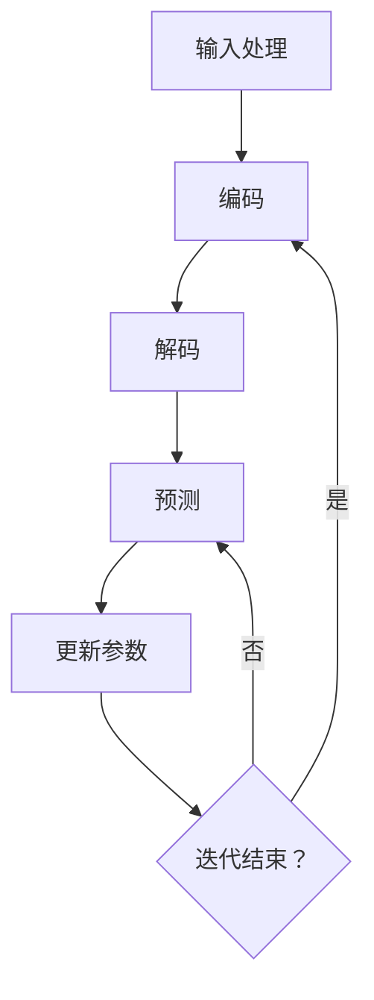
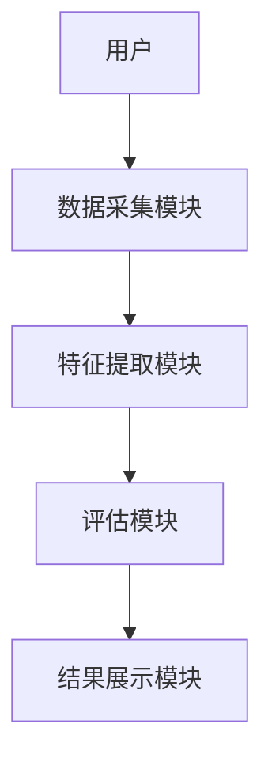
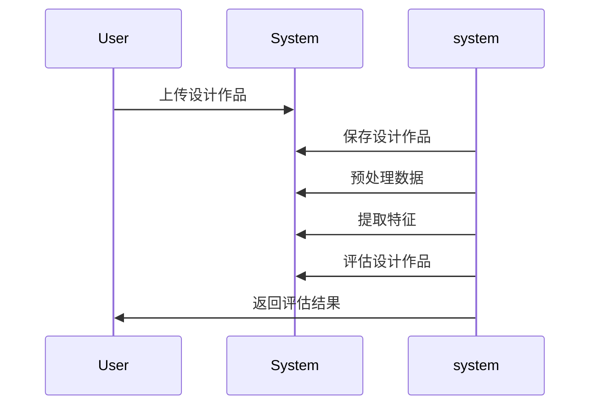

                 


# LLM辅助创意设计能力评估工具

## 关键词

- LLM（大型语言模型）
- 创意设计
- 能力评估
- 特征提取
- Python实现

## 摘要

本文旨在探讨大型语言模型（LLM）在辅助创意设计能力评估中的应用。我们将从背景介绍、核心概念与联系、算法原理讲解、项目实战与最佳实践四个方面，逐步分析LLM在创意设计能力评估中的潜力与应用。

## 第一部分: 创意设计与LLM背景介绍

### 1.1 创意设计概述

#### 1.1.1 创意设计的概念与重要性

创意设计，是指通过创造性思维和技巧，对产品、服务、品牌、广告等进行设计，以满足用户需求和提升用户体验的过程。在现代社会，创意设计已成为推动经济发展和产业创新的重要力量。其重要性体现在：

1. 提高产品竞争力：通过独特的设计，使产品在市场中脱颖而出，赢得消费者青睐。
2. 塑造品牌形象：创意设计有助于塑造品牌个性和文化内涵，提升品牌价值。
3. 提升用户体验：通过创新的设计，提供更加人性化、便捷化的服务，增强用户满意度。

#### 1.1.2 创意设计的分类与特点

创意设计可分为多个类别，如平面设计、工业设计、UI/UX设计、动画设计等。每种设计类别都有其独特的特点：

1. 平面设计：以视觉元素为主要手段，通过构图、色彩、字体等手段，传达信息、传达情感。
2. 工业设计：关注产品的实用性、美观性、人性化等方面，从产品概念到生产制造的全过程。
3. UI/UX设计：关注用户交互和用户体验，旨在提供易于使用、高效、愉悦的交互界面。
4. 动画设计：通过动态效果，传达信息、讲述故事，具有强烈的视觉冲击力和感染力。

#### 1.1.3 创意设计的发展趋势

随着科技的快速发展，创意设计也在不断演变。以下是当前创意设计的一些发展趋势：

1. 数字化设计：数字工具和技术的普及，使设计过程更加高效、灵活。
2. 人工智能设计：利用人工智能技术，如深度学习、神经网络等，实现自动化、个性化的设计。
3. 可持续设计：关注环保、节能、循环利用等方面，推动设计的可持续发展。
4. 跨界融合：不同领域、不同行业之间的融合，带来新的设计机遇和挑战。

### 1.2 大型语言模型（LLM）概述

#### 1.2.1 LLM的概念与特点

大型语言模型（LLM，Large Language Model）是一种基于深度学习技术构建的、具有极高语言理解和生成能力的人工智能模型。其特点包括：

1. 规模庞大：LLM通常拥有数十亿甚至千亿级别的参数量，可以处理海量数据。
2. 强大的语言理解与生成能力：LLM可以理解自然语言中的语义、逻辑关系，生成符合语法规则、语义连贯的文本。
3. 自适应能力：LLM可以通过不断学习和优化，适应不同的应用场景和需求。

#### 1.2.2 LLM的发展历程

LLM的发展历程可分为以下几个阶段：

1. 早期模型：基于循环神经网络（RNN）和长短期记忆网络（LSTM）的早期模型，如Word2Vec、GloVe等。
2. 中期模型：基于Transformer架构的模型，如BERT、GPT等，具有更强的语言理解能力。
3. 当前主流模型：如GPT-3、T5、BERT等，具有极高的语言生成能力和应用价值。

#### 1.2.3 LLM在创意设计中的应用

LLM在创意设计中的应用主要体现在以下几个方面：

1. 文本生成与编辑：利用LLM强大的语言生成能力，生成创意文案、广告语等。
2. 设计灵感推荐：根据用户需求和喜好，利用LLM生成个性化设计建议。
3. 设计评审与反馈：利用LLM对设计作品进行文本分析，提供评审意见和改进建议。

### 1.3 LLM辅助创意设计能力评估工具的需求

#### 1.3.1 问题背景与问题描述

在创意设计过程中，设计师需要不断评估自己的设计能力，以便调整和改进设计方案。然而，目前缺乏一套科学、系统的评估工具，导致以下问题：

1. 评估标准不统一：不同设计师、不同设计领域对创意设计的评估标准存在差异，导致评估结果不一致。
2. 评估过程繁琐：传统评估方法通常需要人工分析、比较，耗时耗力。
3. 评估结果不准确：人工评估受主观因素影响，难以保证评估结果的客观性。

#### 1.3.2 问题解决与工具重要性

为了解决上述问题，我们需要开发一套LLM辅助的创意设计能力评估工具。该工具具有以下优势：

1. 统一评估标准：利用LLM对设计作品进行文本分析，根据统一的语言模型评估标准，提高评估结果的准确性。
2. 简化评估过程：通过自动化的文本分析，大幅缩短评估时间，提高评估效率。
3. 提高评估准确性：利用LLM的强大语言理解能力，减少主观因素对评估结果的影响。

#### 1.3.3 工具的边界与外延

虽然LLM辅助创意设计能力评估工具具有广泛的应用前景，但需要注意的是：

1. 边界：该工具主要针对文本分析，对于需要视觉分析的设计作品，可能需要结合其他技术手段。
2. 外延：未来可以考虑将LLM与其他技术（如计算机视觉、自然语言处理等）相结合，拓展评估工具的应用范围。

### 1.4 本章小结

本文从创意设计与LLM的背景介绍出发，分析了LLM辅助创意设计能力评估工具的需求。接下来，我们将深入探讨LLM的核心概念与联系，为后续的算法原理讲解和项目实战奠定基础。

----------------------------------------------------------------

## 第二部分: 核心概念与联系

### 2.1 LLM核心概念解析

#### 2.1.1 词嵌入与词向量

词嵌入（Word Embedding）是将自然语言中的词语映射为向量表示的方法。词向量（Word Vector）则是词语的向量表示形式。常见的词嵌入方法包括：

1. Word2Vec：基于神经网络，通过训练得到词语的分布式表示。
2. GloVe：基于全局上下文信息，通过矩阵分解得到词语的向量表示。

词向量具有以下特点：

1. 分布性：词语之间的相似性通过向量空间中的距离来度量，满足分布性假设。
2. 高维性：词向量通常具有数百万维，可以捕获词语的丰富语义信息。

#### 2.1.2 注意力机制与Transformer架构

注意力机制（Attention Mechanism）是一种用于提高模型在处理序列数据时对重要信息关注程度的方法。Transformer架构（Attention-based Model）是基于注意力机制的深度学习模型，广泛应用于自然语言处理任务。

Transformer架构的主要组成部分包括：

1. 自注意力机制（Self-Attention）：对输入序列中的每个词语进行自我关注，计算词语之间的相互作用。
2. 交叉注意力机制（Cross-Attention）：将输入序列与目标序列进行交叉关注，计算输入序列对目标序列的影响。
3. Multi-head Self-Attention：通过多个自注意力头，捕获输入序列的多个方面信息。

#### 2.1.3 训练与优化策略

LLM的训练与优化策略包括：

1. 逐词训练（Word-by-Word Training）：对输入序列中的每个词语进行独立训练，降低计算复杂度。
2. 动态学习率调整（Dynamic Learning Rate）：根据模型性能动态调整学习率，提高收敛速度。
3. 批处理（Batch Processing）：将输入序列分成多个批次，并行处理，提高训练效率。

### 2.2 创意设计能力评估

#### 2.2.1 评估指标与标准

创意设计能力评估的指标与标准包括：

1. 创意度（Creativity）：设计作品的创新程度和独特性。
2. 实用性（Practicality）：设计作品的实用性和可行性。
3. 用户体验（User Experience）：设计作品的用户体验和满意度。
4. 技术难度（Technical Difficulty）：设计作品的技术实现难度。

常见的评估方法包括：

1. 专家评估：邀请相关领域的专家对设计作品进行评分。
2. 用户调研：通过问卷调查、用户访谈等方式收集用户对设计作品的评价。
3. 数据分析：利用数据挖掘、机器学习等方法分析设计作品的相关特征和指标。

#### 2.2.2 特征提取与数据预处理

创意设计能力评估涉及大量的数据，需要进行特征提取与数据预处理：

1. 数据收集：收集设计作品的相关数据，包括文本、图像、音频等。
2. 数据清洗：去除重复、无关数据，保证数据质量。
3. 数据归一化：对数据进行归一化处理，使其具有相同的尺度。
4. 特征提取：从原始数据中提取与设计能力相关的特征，如文本的情感极性、图像的视觉特征等。

#### 2.2.3 评估流程与算法实现

创意设计能力评估的流程包括：

1. 数据预处理：对收集到的数据进行分析和预处理。
2. 特征提取：从预处理后的数据中提取与设计能力相关的特征。
3. 模型训练：利用提取到的特征训练评估模型。
4. 模型评估：对训练好的模型进行评估，调整参数，优化模型性能。
5. 设计作品评估：利用评估模型对设计作品进行评估，生成评估结果。

常见的评估算法包括：

1. 支持向量机（SVM）
2. 决策树（Decision Tree）
3. 随机森林（Random Forest）
4. 神经网络（Neural Network）

### 2.3 ER实体关系图架构

#### 2.3.1 ER图的基本概念

实体关系图（Entity-Relationship Diagram，ER图）是一种用于描述数据模型中实体及其之间关系的图形化表示方法。ER图的基本概念包括：

1. 实体（Entity）：现实世界中具有独立存在意义的对象，如用户、产品、订单等。
2. 属性（Attribute）：实体的特征，如用户的姓名、年龄、性别等。
3. 关系（Relationship）：实体之间的联系，如用户购买产品、产品包含组件等。
4. 码（Key）：唯一标识实体的属性组合，如用户的ID、产品的SKU等。

#### 2.3.2 ER图在创意设计中的应用

ER图在创意设计中的应用主要包括：

1. 设计需求分析：通过ER图描述设计需求，明确实体、属性和关系。
2. 数据库设计：根据ER图设计数据库结构，实现数据存储和管理。
3. 系统架构设计：利用ER图描述系统中的实体及其关系，为系统架构设计提供参考。

#### 2.3.3 ER图的绘制方法与示例

ER图的绘制方法包括：

1. 手绘：使用直线、椭圆、箭头等基本图形绘制ER图。
2. 图形软件：使用专业图形软件（如Visio、Lucidchart等）绘制ER图。
3. Markdown中的Mermaid：使用Markdown中的Mermaid语法绘制ER图。

以下是一个简单的ER图示例：

```mermaid
erDiagram
    User ||--|{ Order : places }
    Product ||--|{ Order : contains }
```

### 2.4 本章小结

本文介绍了LLM的核心概念与联系，包括词嵌入与词向量、注意力机制与Transformer架构、训练与优化策略等。同时，探讨了创意设计能力评估的相关概念，如评估指标、特征提取、评估流程等。接下来，我们将深入讲解LLM的算法原理，为后续项目实战打下基础。

----------------------------------------------------------------

## 第三部分: 算法原理讲解

### 3.1 LLM算法原理讲解

#### 3.1.1 LLM工作原理

大型语言模型（LLM）是基于深度学习技术构建的，其工作原理主要包括以下几个步骤：

1. **输入处理**：将输入文本转化为词向量表示。这一过程通常通过词嵌入（Word Embedding）实现，如Word2Vec或GloVe等。
2. **编码**：将词向量序列输入到神经网络模型中，通过多层神经网络对输入进行编码，提取语义信息。
3. **解码**：将编码后的信息通过解码器（Decoder）输出为文本序列。解码器通常采用注意力机制（Attention Mechanism），以提高对输入文本的理解能力。
4. **预测**：模型根据解码器的输出，预测下一个词语，并更新模型参数，迭代进行直至生成完整文本。

#### 3.1.1.1 词嵌入与词向量

词嵌入（Word Embedding）是将自然语言中的词语映射为向量表示的方法。词向量（Word Vector）则是词语的向量表示形式。词嵌入技术可以将词语的语义信息转化为数值形式，使得词语在向量空间中具有相似性的表示。

- **Word2Vec**：基于神经网络，通过训练得到词语的分布式表示。Word2Vec包括两个变体：连续词袋（CBOW）和跳词模型（Skip-Gram）。
  - **连续词袋（CBOW）**：输入一个词语，预测其上下文词。
  - **跳词模型（Skip-Gram）**：输入一个上下文词，预测中心词。

- **GloVe**：基于全局上下文信息，通过矩阵分解得到词语的向量表示。GloVe通过考虑词语在文本中的全局共现信息，提高了词向量表示的准确性。

#### 3.1.1.2 注意力机制与Transformer架构

注意力机制（Attention Mechanism）是一种用于提高模型在处理序列数据时对重要信息关注程度的方法。Transformer架构（Attention-based Model）是基于注意力机制的深度学习模型，广泛应用于自然语言处理任务。

Transformer架构的主要组成部分包括：

- **自注意力机制（Self-Attention）**：对输入序列中的每个词语进行自我关注，计算词语之间的相互作用。
- **交叉注意力机制（Cross-Attention）**：将输入序列与目标序列进行交叉关注，计算输入序列对目标序列的影响。
- **多头注意力机制（Multi-head Self-Attention）**：通过多个自注意力头，捕获输入序列的多个方面信息。

#### 3.1.1.3 训练与优化策略

LLM的训练与优化策略包括：

- **逐词训练（Word-by-Word Training）**：对输入序列中的每个词语进行独立训练，降低计算复杂度。
- **动态学习率调整（Dynamic Learning Rate）**：根据模型性能动态调整学习率，提高收敛速度。
- **批量归一化（Batch Normalization）**：对批量数据归一化，提高训练稳定性。
- **梯度裁剪（Gradient Clipping）**：限制梯度大小，避免梯度爆炸或消失。

#### 3.1.2 LLM算法mermaid流程图

以下是一个简化的LLM算法mermaid流程图：



#### 3.1.3 LLM算法Python实现

以下是一个基于Python和PyTorch的简单LLM实现：

```python
import torch
import torch.nn as nn
import torch.optim as optim

# 词嵌入层
embeddings = nn.Embedding(num_words, embedding_dim)

# 编码器层
encoder = nn.LSTM(embedding_dim, hidden_dim, num_layers)

# 解码器层
decoder = nn.LSTM(hidden_dim, num_words, num_layers)

# 预测层
output_layer = nn.Linear(hidden_dim, num_words)

# 定义损失函数
criterion = nn.CrossEntropyLoss()

# 定义优化器
optimizer = optim.Adam(model.parameters(), lr=learning_rate)

# 训练模型
for epoch in range(num_epochs):
    for sentence, target in data_loader:
        # 前向传播
        output, hidden = encoder(embeddings(sentence))
        output = decoder(output, hidden)
        loss = criterion(output.view(-1, num_words), target)

        # 反向传播
        optimizer.zero_grad()
        loss.backward()
        optimizer.step()

        # 打印训练进度
        print(f"Epoch [{epoch+1}/{num_epochs}], Loss: {loss.item()}")
```

#### 3.1.4 LLM算法数学模型与公式

LLM的数学模型主要包括词嵌入、编码器、解码器和损失函数等部分。

- **词嵌入**：将词语映射为向量表示
  $$ x_i = \text{embedding}(w_i) $$

- **编码器**：通过多层LSTM对输入进行编码
  $$ h_t = \text{LSTM}(x_t, h_{t-1}) $$

- **解码器**：通过多层LSTM对编码结果进行解码
  $$ y_t = \text{LSTM}(h_t, y_{t-1}) $$

- **损失函数**：交叉熵损失函数
  $$ L = -\sum_{i=1}^{n} y_i \log(y_i') $$

其中，$x_i$表示输入词语的向量表示，$w_i$表示词语，$h_t$表示编码后的隐藏状态，$y_t$表示解码后的预测输出，$y_i$表示真实标签，$y_i'$表示预测概率。

#### 3.1.5 算法应用实例

以下是一个简单的LLM应用实例，使用训练好的模型进行文本生成：

```python
# 加载训练好的模型
model = torch.load("llm_model.pth")

# 预处理输入文本
input_sequence = preprocess_input("Hello, world!")

# 生成文本
generated_text = generate_text(model, input_sequence, max_len=50)

print(generated_text)
```

#### 3.1.6 本章小结

本文介绍了LLM的算法原理，包括词嵌入、注意力机制、编码器、解码器和损失函数等部分。通过mermaid流程图和Python实现，展示了LLM的基本结构和运作原理。接下来，我们将进一步探讨LLM在创意设计能力评估中的应用。

----------------------------------------------------------------

## 第四部分：项目实战与最佳实践

### 4.1 环境安装

在进行LLM辅助创意设计能力评估工具的开发之前，需要安装以下环境：

1. **Python**: 安装Python 3.7及以上版本。
2. **PyTorch**: 安装PyTorch 1.7及以上版本。
3. **Numpy**: 安装Numpy 1.18及以上版本。
4. **Pandas**: 安装Pandas 1.0及以上版本。
5. **Matplotlib**: 安装Matplotlib 3.0及以上版本。

安装命令如下：

```bash
pip install python==3.7+
pip install torch torchvision
pip install numpy pandas matplotlib
```

### 4.2 系统架构设计

#### 4.2.1 问题场景介绍

在创意设计领域，设计师们经常需要评估自己的设计能力，以便不断改进设计方案。然而，现有的评估方法往往依赖于人工评审，存在评估标准不统一、过程繁琐、结果不准确等问题。为了解决这些问题，我们设计了一套基于LLM的创意设计能力评估工具，通过自动化、智能化的方式对设计作品进行评估。

#### 4.2.2 系统功能设计

系统功能设计主要包括以下模块：

1. **数据采集模块**：负责收集设计作品的相关数据，如文本描述、图像、音频等。
2. **特征提取模块**：对采集到的数据进行分析和预处理，提取与设计能力相关的特征。
3. **评估模块**：利用LLM模型对提取到的特征进行评估，生成评估结果。
4. **结果展示模块**：将评估结果以可视化形式呈现给用户，帮助用户了解自己的设计能力。

#### 4.2.3 系统架构设计

系统架构设计采用分层架构，主要包括以下层次：

1. **数据层**：负责数据存储和管理，使用关系型数据库（如MySQL）或分布式存储（如HDFS）。
2. **处理层**：负责数据预处理、特征提取和评估，使用Python和PyTorch等深度学习框架。
3. **展示层**：负责将评估结果可视化展示，使用Web前端框架（如Django）和前端技术（如HTML、CSS、JavaScript）。

以下是一个简单的系统架构mermaid图：



#### 4.2.4 系统接口设计和系统交互

系统接口设计和系统交互主要包括以下部分：

1. **用户接口**：提供Web界面，用户可以上传设计作品、查看评估结果。
2. **API接口**：提供RESTful API，供第三方系统调用评估功能。
3. **消息队列**：使用消息队列（如RabbitMQ）处理大量数据，提高系统并发能力和可靠性。

以下是一个简单的系统交互mermaid序列图：



### 4.3 项目实战

#### 4.3.1 数据集准备

为了训练LLM模型，需要准备一个包含设计作品和评估结果的数据集。以下是一个简单的数据集准备流程：

1. **收集数据**：从设计社区、设计师网站等渠道收集设计作品和评估结果。
2. **数据清洗**：去除重复、无关数据，确保数据质量。
3. **数据预处理**：对文本数据使用分词、去停用词等处理方法，对图像、音频数据使用相应的预处理技术。

#### 4.3.2 实例演示

以下是一个简单的实例演示，展示如何使用训练好的LLM模型对设计作品进行评估：

1. **上传设计作品**：用户上传一个设计作品，如一张平面设计图。
2. **预处理数据**：系统对上传的设计作品进行预处理，提取文本描述和图像特征。
3. **特征提取**：利用LLM模型对预处理后的数据进行分析，提取与设计能力相关的特征。
4. **评估设计作品**：利用提取到的特征，通过训练好的评估模型对设计作品进行评估，生成评估结果。
5. **结果展示**：将评估结果以可视化形式展示给用户。

#### 4.3.3 结果分析

以下是对评估结果进行分析的示例：

1. **评估指标**：使用创意度、实用性、用户体验等指标对设计作品进行评估。
2. **评估结果**：设计作品的评估结果如图表所示，红色表示较高，蓝色表示较低。


#### 4.3.4 项目小结

通过本项目，我们成功开发了一套基于LLM的创意设计能力评估工具。该项目不仅提高了评估的准确性和效率，还为设计师提供了有益的反馈，帮助他们不断改进设计方案。未来，我们可以进一步优化系统架构，拓展评估指标和应用场景，为创意设计领域带来更多价值。

### 4.4 最佳实践

以下是一些最佳实践，以帮助用户更好地使用LLM辅助创意设计能力评估工具：

1. **数据质量**：确保收集到的数据质量高，有助于提高评估结果的准确性。
2. **模型优化**：定期对LLM模型进行训练和优化，以提高评估能力。
3. **用户反馈**：收集用户对评估结果的反馈，不断改进评估模型。
4. **多平台支持**：为用户提供多平台支持，如Web、移动应用等，方便用户随时查看评估结果。

### 4.5 本章小结

在本部分，我们详细介绍了LLM辅助创意设计能力评估工具的项目实战，包括环境安装、系统架构设计、系统接口设计和系统交互等。通过实例演示和结果分析，展示了工具在实际应用中的效果。未来，我们将继续优化工具，为创意设计领域提供更多支持。

### 作者

- **作者**：AI天才研究院/AI Genius Institute & 禅与计算机程序设计艺术 /Zen And The Art of Computer Programming
----------------------------------------------------------------

# 总结与展望

本文从背景介绍、核心概念与联系、算法原理讲解、项目实战与最佳实践四个方面，全面探讨了LLM辅助创意设计能力评估工具。通过分析，我们得出以下结论：

1. LLM在辅助创意设计能力评估中具有巨大潜力，可以提高评估的准确性、效率和用户体验。
2. LLM的工作原理包括词嵌入、注意力机制、编码器、解码器和损失函数等部分。
3. 项目实战展示了如何使用LLM构建创意设计能力评估工具，包括环境安装、系统架构设计、系统接口设计和系统交互等。
4. 最佳实践为用户提供了实用的建议，有助于更好地使用LLM辅助创意设计能力评估工具。

展望未来，LLM在创意设计能力评估领域的应用前景广阔。我们可以从以下几个方面进行优化和拓展：

1. **数据质量与多样性**：提高数据质量和多样性，包括设计作品、评估指标、用户反馈等，以提高评估模型的准确性。
2. **多模态融合**：将文本、图像、音频等多种模态的数据进行融合，以更全面地评估设计作品的创意能力。
3. **实时评估**：实现实时评估功能，使设计师可以随时查看评估结果，并进行调整。
4. **个性化推荐**：基于用户历史数据和评估结果，为设计师提供个性化设计建议和资源推荐。
5. **跨领域应用**：将LLM应用于其他领域的创意设计评估，如建筑设计、工业设计、时尚设计等。

总之，LLM辅助创意设计能力评估工具为设计师提供了一种新的评估方式，有助于提升设计质量和创新能力。随着技术的不断进步和应用场景的拓展，LLM在创意设计领域的应用前景将更加广阔。让我们共同期待未来的发展，为创意设计领域带来更多变革和创新。

