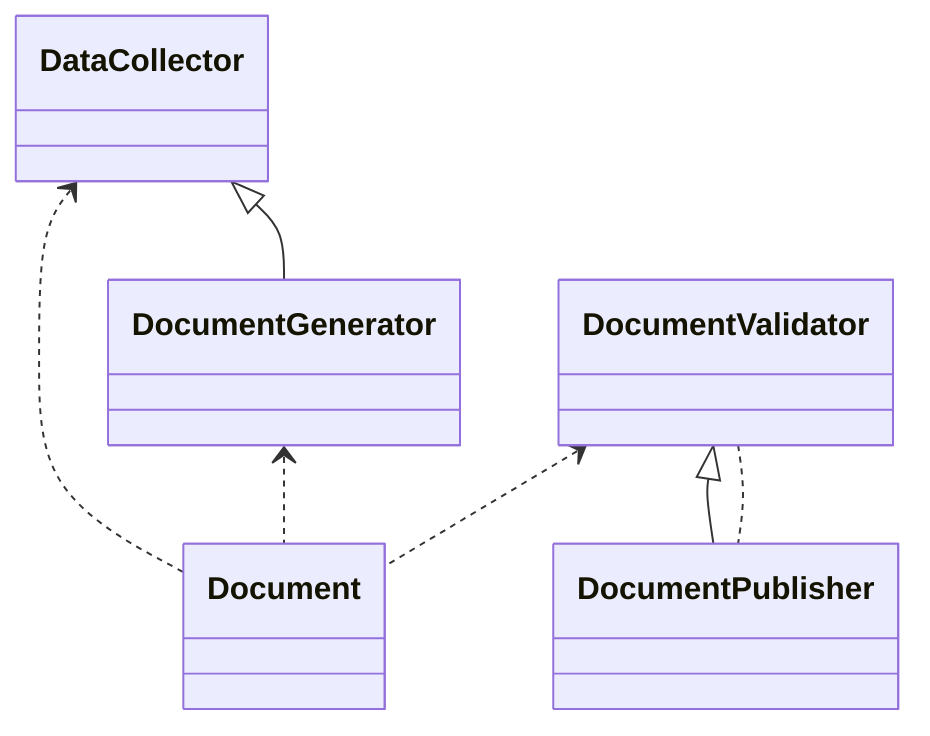
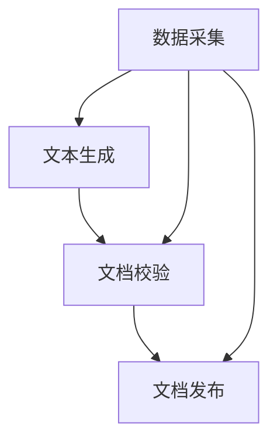
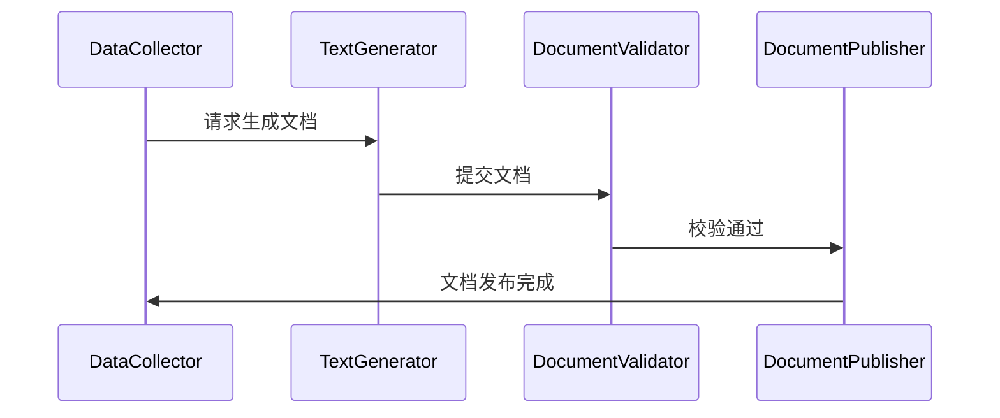

                 

# LLM辅助技术文档生成质量评估

> 关键词：LLM，技术文档，质量评估，一致性，准确性，可读性，完整性

> 摘要：本文将深入探讨LLM（大型语言模型）辅助技术文档生成过程中的质量问题。通过背景介绍、核心概念原理阐述、评估体系和方法设计，再到系统分析与架构设计，项目实战与最佳实践，我们将构建一个全面的LLM辅助技术文档生成质量评估框架，旨在提高技术文档的质量和实用性。

## 第一部分：背景介绍

### 1.1 问题背景

随着人工智能技术的迅猛发展，大模型（LLM）在自然语言处理（NLP）领域展现出了前所未有的能力。LLM通过深度学习算法从大量文本数据中学习，具备了理解、生成和翻译自然语言的能力，这在技术文档生成领域引发了革命性的变化。传统技术文档生成往往依赖于手动编写，不仅效率低下，而且难以保证一致性、准确性和可读性。LLM的出现，为自动化技术文档生成提供了新的可能性。

### 1.2 问题描述

然而，LLM辅助技术文档生成的质量问题逐渐显现，具体表现在文档的一致性、准确性、可读性和完整性等方面。首先，一致性方面，由于LLM生成的文本基于大量无结构的数据，术语和表述可能会出现不一致的情况。其次，准确性方面，LLM虽然能够生成结构化的文本，但仍然难以完全保证其内容与实际技术信息的符合程度。再者，可读性方面，生成的文档可能存在语句不通顺、结构混乱等问题。最后，完整性方面，生成的文档可能遗漏重要信息，导致用户理解和使用上的困难。

### 1.3 问题解决

为了解决上述问题，本文旨在通过系统的研究和分析，为LLM辅助技术文档生成质量评估提供一套科学、全面的评估方法和工具。通过明确评估指标、设计评估体系、实践评估方法，帮助企业更好地理解和应对技术文档生成中的质量问题。

### 1.4 边界与外延

本文的研究边界主要聚焦于LLM辅助技术文档生成质量评估，涵盖文本生成、语法正确性、语义一致性、可读性和完整性等方面。同时，本文还将探讨评估模型的设计、评估工具的实现和应用案例的分析，为相关领域的研究和实践提供参考。

### 1.5 概念结构与核心要素组成

为了更好地理解LLM辅助技术文档生成质量评估，我们需要明确以下几个核心概念和要素：

1. **LLM（大型语言模型）**：LLM是一种基于深度学习的语言模型，具有强大的自然语言处理能力。
2. **技术文档**：技术文档是以文字形式描述技术概念、功能和使用方法的文档。
3. **评估指标**：评估指标是衡量技术文档生成质量的具体标准，如一致性、准确性、可读性和完整性等。
4. **评估体系**：评估体系是包含评估指标、评估方法和评估工具的系统框架。
5. **评估方法**：评估方法是通过量化分析、人工审查和自动化工具等多种手段对文档质量进行评估的具体手段。
6. **评估工具**：评估工具是实现评估方法的技术手段，如自动化测试工具和数据分析平台等。

通过上述概念和要素的组成，本文将为读者提供一个全面、深入的LLM辅助技术文档生成质量评估体系，帮助企业和开发者提高技术文档的质量和效率。

### 1.6 核心概念原理

#### LLM（大型语言模型）

LLM是一种通过深度学习算法从大量文本数据中学习语言模式的模型，其核心原理是基于注意力机制（Attention Mechanism）和变换器模型（Transformer Model）。注意力机制使得模型能够关注文本中的关键信息，提高生成文本的相关性和准确性；变换器模型则通过自注意力（Self-Attention）和多级编码器（Stacked Encoder）结构，实现了对文本的全局和局部信息的整合。

#### 评估指标

技术文档生成质量评估的主要指标包括一致性、准确性、可读性和完整性。一致性指文档中术语和表述的一致性；准确性指文档内容与实际技术信息的符合程度；可读性指文档的易读性和清晰度；完整性指文档是否包含了所需的所有信息。

#### 评估体系

评估体系由评估指标、评估方法和评估工具三部分构成。评估指标是评估的基础，评估方法提供了具体的评估过程和手段，评估工具则是实现评估方法的技术手段。

#### 评估方法

常见的评估方法包括人工评估、自动化评估和混合评估。人工评估依靠专家的判断，具有较高的准确性，但效率低；自动化评估依靠算法和工具，具有较高的效率，但可能存在主观性；混合评估结合了两者，试图在准确性和效率之间取得平衡。

#### 评估工具

常用的评估工具有自动化测试工具（如静态代码分析工具）、数据分析平台（如数据可视化工具）和自然语言处理工具（如文本分类和情感分析工具）。这些工具可以帮助评估者快速、高效地识别和解决文档质量问题。

通过上述核心概念原理的阐述，本文为读者提供了一个清晰的理论框架，为后续章节的详细讨论奠定了基础。

### 1.7 概念属性特征对比表格

为了更好地理解LLM辅助技术文档生成质量评估中的关键概念，下面提供了一个概念属性特征对比表格，其中包括LLM、评估指标、评估体系和评估方法的主要特征。

| 概念名称 | 定义 | 主要特征 |
| :----: | :----: | :----: |
| **LLM** | 大型语言模型 | 1. 基于深度学习算法；2. 从大量文本数据中学习；3. 具备自然语言处理能力 |
| **评估指标** | 用于衡量技术文档生成质量的标准 | 1. 一致性；2. 准确性；3. 可读性；4. 完整性 |
| **评估体系** | 包含评估指标、评估方法和评估工具的系统框架 | 1. 系统性；2. 全面性；3. 可操作性 |
| **评估方法** | 用于实施质量评估的具体手段 | 1. 人工评估；2. 自动化评估；3. 混合评估 |

通过上述对比表格，我们可以更清晰地看到各个概念和要素之间的联系和区别，有助于深入理解LLM辅助技术文档生成质量评估的核心内容。

## 第二部分：核心概念与联系

### 2.1 LLM（大型语言模型）详解

LLM（大型语言模型）是一种基于深度学习的自然语言处理模型，它通过学习海量的文本数据，理解语言的复杂结构和语义。LLM的核心原理包括注意力机制和变换器模型。

**注意力机制**：注意力机制是LLM的核心组成部分，它允许模型在生成文本时关注文本中的关键信息。例如，在生成技术文档时，注意力机制可以帮助模型识别并关注技术术语和相关背景知识，从而提高生成文档的准确性和一致性。

**变换器模型**：变换器模型（Transformer Model）是LLM的基础架构，它通过自注意力（Self-Attention）和多级编码器（Stacked Encoder）结构，实现对文本的全局和局部信息的整合。自注意力机制允许模型在处理每个单词时考虑其他所有单词的信息，从而提高模型的语境理解能力。

#### LLM的核心组件

- **编码器（Encoder）**：编码器负责将输入文本编码为固定长度的向量，以便模型进行后续处理。编码器通常包含多层变换器层，每层通过自注意力机制和前馈网络处理输入文本。
- **解码器（Decoder）**：解码器负责生成输出文本。解码器在生成每个单词时，不仅依赖于当前生成的单词，还依赖于编码器生成的固定长度向量。
- **自注意力（Self-Attention）**：自注意力机制允许模型在处理每个单词时，根据其他所有单词的信息进行加权求和，从而提高模型的语境理解能力。
- **前馈网络（Feed Forward Network）**：前馈网络是变换器模型中的另一个关键组件，它对自注意力层的输出进行进一步处理，以增强模型的表示能力。

#### LLM的工作流程

1. **输入编码**：输入文本首先通过编码器进行编码，生成固定长度的向量表示。
2. **自注意力处理**：编码器通过自注意力机制处理输入文本，提取关键信息。
3. **前馈网络处理**：自注意力层的输出通过前馈网络进行进一步处理，以增强模型的表示能力。
4. **解码**：解码器根据编码器的输出和当前生成的单词，生成下一个单词，并更新编码器的输出。
5. **重复步骤3和4**：重复上述步骤，直到生成完整的输出文本。

### 概念属性特征对比表格

| 概念名称 | 定义 | 主要特征 |
| :----: | :----: | :----: |
| **LLM** | 大型语言模型 | 1. 基于深度学习算法；2. 从大量文本数据中学习；3. 具备自然语言处理能力 |
| **注意力机制** | 允许模型关注文本中的关键信息 | 1. 提高文本生成的一致性和准确性；2. 优化语境理解能力 |
| **变换器模型** | 通过自注意力机制处理文本 | 1. 实现全局和局部信息的整合；2. 提高模型的表示能力 |

通过上述详细阐述，我们可以更深入地理解LLM的原理和特征，为后续的质量评估工作奠定基础。

### 2.2 评估指标详解

在LLM辅助技术文档生成质量评估中，评估指标是衡量文档质量的核心标准。这些指标包括一致性、准确性、可读性和完整性，每个指标都有其特定的定义和重要性。

#### 一致性

一致性指文档中术语和表述的一致性。在技术文档中，一致性非常重要，因为不一致的术语和表述会导致用户混淆和误解。评估一致性的方法包括：

- **术语一致性**：检查文档中使用的术语是否与官方文档或其他相关资料保持一致。
- **表述一致性**：检查文档中的句子结构和表达方式是否一致。

#### 准确性

准确性指文档内容与实际技术信息的符合程度。准确的文档能够帮助用户更好地理解和使用技术，从而提高工作效率。评估准确性的方法包括：

- **内容匹配度**：检查文档中的描述是否与实际技术信息相匹配。
- **事实检查**：通过比对文档中的数据和技术规格书，确保所有事实陈述都是准确的。

#### 可读性

可读性指文档的易读性和清晰度。良好的可读性能够提高用户的学习和使用体验。评估可读性的方法包括：

- **句子长度**：检查文档中句子的长度和复杂性，确保不会过于冗长和复杂。
- **语法正确性**：检查文档中的语法错误，确保句子结构合理、语法正确。

#### 完整性

完整性指文档是否包含了所需的所有信息。完整的文档能够帮助用户快速找到所需信息，提高文档的使用价值。评估完整性的方法包括：

- **信息完整性**：检查文档中是否包含所有必要的信息，如安装指南、配置步骤、常见问题等。
- **信息遗漏检查**：通过对比文档和产品规格书，确保没有遗漏重要信息。

### 概念属性特征对比表格

下面是评估指标的详细对比表格，展示了各个指标的定义和重要性。

| 指标名称 | 定义 | 重要性 |
| :----: | :----: | :----: |
| **一致性** | 术语和表述的一致性 | 避免用户混淆和误解 |
| **准确性** | 文档内容与实际技术信息的符合程度 | 提高用户理解和使用效率 |
| **可读性** | 文档的易读性和清晰度 | 提高用户学习和使用体验 |
| **完整性** | 文档是否包含了所需的所有信息 | 提高文档的使用价值 |

通过上述对评估指标的详细解析，我们可以更深入地理解它们在LLM辅助技术文档生成质量评估中的作用，从而为后续的评估工作提供指导。

### 2.3 评估体系设计

在LLM辅助技术文档生成质量评估中，评估体系的设计至关重要。一个科学、全面的评估体系能够确保评估过程的系统性和有效性。评估体系通常由评估指标、评估方法和评估工具三部分构成。

#### 评估指标体系

评估指标体系是评估的基础，它明确了衡量文档质量的各项标准。评估指标体系的设计需要考虑以下关键因素：

- **指标种类**：根据文档的特点和需求，确定评估指标的种类，如一致性、准确性、可读性和完整性等。
- **指标权重**：为每个指标分配权重，以反映其在整体评估中的重要性。例如，在技术文档中，准确性可能比可读性更为重要。
- **指标可度量性**：确保每个指标都可以量化，以便进行客观评估。

#### 评估方法体系

评估方法体系是实施质量评估的具体手段。常见的评估方法包括人工评估、自动化评估和混合评估。

- **人工评估**：人工评估依靠专家的判断，具有较高的准确性，但效率较低。适用于对文档质量有较高要求的场景。
- **自动化评估**：自动化评估通过算法和工具进行，具有较高的效率，但可能存在主观性。适用于大规模文档的快速评估。
- **混合评估**：混合评估结合了人工评估和自动化评估的优点，试图在准确性和效率之间取得平衡。适用于大多数场景。

#### 评估工具体系

评估工具是实现评估方法的技术手段。常用的评估工具有：

- **自动化测试工具**：如静态代码分析工具，可以自动检测文档中的语法错误和结构问题。
- **数据分析平台**：如数据可视化工具，可以用于分析文档中的统计数据和趋势。
- **自然语言处理工具**：如文本分类和情感分析工具，可以用于评估文档的可读性和一致性。

#### 评估流程设计

评估流程是评估体系的重要组成部分，它规定了评估的具体步骤和流程。一个典型的评估流程包括以下步骤：

1. **评估计划制定**：明确评估目标、评估范围和评估时间表。
2. **文档准备**：准备评估所需的文档，并进行初步检查。
3. **指标定义**：根据评估需求，定义具体的评估指标。
4. **评估执行**：按照评估流程，执行评估任务，包括人工评估和自动化评估。
5. **结果分析**：对评估结果进行分析，识别文档质量问题，并提出改进建议。
6. **报告撰写**：撰写评估报告，总结评估结果和改进建议。

#### 评估体系的优势

- **系统性和全面性**：评估体系通过系统、全面的设计，确保评估过程的科学性和有效性。
- **可操作性**：评估体系提供了明确的评估指标、方法和工具，便于实际操作和应用。
- **持续改进**：评估体系能够帮助企业和开发者持续改进技术文档生成过程，提高文档质量。

通过上述对评估体系设计的详细阐述，我们可以看到，评估体系是LLM辅助技术文档生成质量评估的关键组成部分，它为评估工作的顺利进行提供了有力保障。

### 2.4 评估方法与实践

在LLM辅助技术文档生成质量评估中，评估方法的选择和实施至关重要。本文将介绍几种常见的评估方法，包括人工评估、自动化评估和混合评估，并探讨其实施过程中的关键步骤和注意事项。

#### 人工评估

人工评估是一种依靠专家判断的评估方法，其优势在于能够提供较高的准确性和深度分析。然而，人工评估的缺点是效率较低，难以应对大规模文档的评估需求。

**实施步骤**：

1. **专家选择**：选择具备相关专业知识和经验的专家进行评估。
2. **评估准备**：准备评估所需的文档和评估标准。
3. **评估执行**：专家按照评估标准，逐项检查文档的质量，记录评估结果。
4. **结果分析**：对评估结果进行分析，识别文档中的问题和改进点。

**注意事项**：

- **专家能力**：评估专家应具备丰富的技术背景和评估经验，以确保评估结果的准确性。
- **评估标准**：评估标准应明确、具体，以便专家有据可依。

#### 自动化评估

自动化评估通过算法和工具进行，具有高效率和可重复性的优势。常见的自动化评估方法包括静态代码分析、文本分类和情感分析等。

**实施步骤**：

1. **工具选择**：选择适合的自动化评估工具，如静态代码分析工具、文本分类工具等。
2. **评估准备**：准备评估所需的文档和数据。
3. **模型训练**：根据评估需求，训练相应的评估模型，如文本分类模型、情感分析模型等。
4. **评估执行**：使用训练好的模型对文档进行自动化评估，生成评估结果。
5. **结果分析**：对自动化评估结果进行分析，识别文档中的问题。

**注意事项**：

- **工具性能**：自动化评估工具的性能直接影响评估结果的准确性，应选择性能优越的工具。
- **数据质量**：自动化评估依赖于高质量的数据，数据质量直接影响评估效果。

#### 混合评估

混合评估结合了人工评估和自动化评估的优点，旨在在准确性和效率之间取得平衡。混合评估通常分为两个阶段：初步自动化评估和深度人工评估。

**实施步骤**：

1. **初步评估**：使用自动化评估工具对文档进行初步评估，识别明显的质量问题。
2. **人工评估**：对初步评估中识别出的问题进行深度人工评估，确认问题并提出改进建议。
3. **结果分析**：结合初步评估和深度评估的结果，对文档进行全面分析，提出改进措施。

**注意事项**：

- **评估流程**：确保评估流程的合理性和连贯性，避免流程混乱和重复评估。
- **资源分配**：合理分配人力和物力资源，确保评估工作高效、有序进行。

#### 综合优势

- **准确性**：人工评估和自动化评估相结合，能够提供较高的评估准确性。
- **效率**：自动化评估能够提高评估效率，降低人工工作量。
- **灵活性**：混合评估可以根据实际需求调整评估方法和流程，具有较强的灵活性。

通过上述对评估方法与实践的详细探讨，我们可以看到，合理选择和实施评估方法是提高LLM辅助技术文档生成质量的关键。不同的评估方法各有优缺点，应根据具体需求进行选择和组合，以实现最佳评估效果。

### 2.5 评估工具与应用

在LLM辅助技术文档生成质量评估中，评估工具的应用至关重要。评估工具不仅能够提高评估的效率和准确性，还能够为评估者提供直观的评估结果和分析。本文将介绍几种常用的评估工具，包括自动化测试工具、数据分析平台和自然语言处理工具，并探讨其实际应用案例。

#### 自动化测试工具

自动化测试工具是进行大规模文档评估的重要工具，能够快速检测文档中的语法错误、格式问题和结构问题。常见的自动化测试工具有：

- **Linter**：Linter是一种代码检查工具，用于检测代码中的语法错误和编码规范问题。例如，Python的`pylint`和JavaScript的`ESLint`都是常用的Linter工具。
- **Static Code Analyzer**：静态代码分析工具能够对文档源代码进行静态分析，识别潜在的问题和安全隐患。例如，SonarQube是一个功能强大的静态代码分析平台。

**实际应用案例**：

在一个大型软件开发项目中，团队使用`pylint`对技术文档的源代码进行自动化检查。通过定期运行`pylint`，团队能够及时发现并修复代码中的语法错误和编码不规范问题，确保文档质量。

#### 数据分析平台

数据分析平台能够对文档中的数据进行分析和处理，提供数据可视化和统计报告。常见的分析平台有：

- **Tableau**：Tableau是一个数据可视化工具，能够将复杂数据转换为直观的图表和报告，帮助用户更好地理解数据。
- **Google Data Studio**：Google Data Studio是一个基于Google Sheets的数据分析和报告工具，能够创建交互式的数据仪表板。

**实际应用案例**：

在一个产品发布文档的评估中，团队使用Google Data Studio对文档中的数据进行汇总和分析。通过创建交互式的数据仪表板，团队能够快速识别文档中的数据错误和不一致问题，确保文档的准确性。

#### 自然语言处理工具

自然语言处理（NLP）工具能够对文档中的文本内容进行语义分析和情感分析，帮助评估者理解文档的语义和用户反馈。常见的NLP工具有：

- **NLP Libraries**：如Python的`NLTK`和`spaCy`，用于进行文本分词、词性标注和实体识别等任务。
- **Sentiment Analysis Tools**：如Google Cloud的Sentiment Analysis API，用于分析文本的情感倾向。

**实际应用案例**：

在一个用户反馈文档的评估中，团队使用Google Cloud的Sentiment Analysis API对用户评论进行情感分析。通过分析用户评论的情感倾向，团队能够识别用户对产品的满意度和不满意点，为产品改进提供依据。

#### 评估工具组合应用

在实际应用中，评估工具通常需要组合使用，以实现最佳评估效果。例如，团队可以先使用Linter和Static Code Analyzer进行自动化检查，发现明显的语法错误和结构问题；然后使用NLP工具进行语义分析和情感分析，深入理解文档的语义和用户反馈。

**综合优势**：

- **提高效率**：自动化测试工具和数据分析平台能够快速处理大量文档，提高评估效率。
- **增强准确性**：自然语言处理工具能够深入分析文本内容，提高评估的准确性。
- **提供直观结果**：数据分析平台和自然语言处理工具能够提供直观的评估结果和分析报告，便于评估者理解和决策。

通过上述对评估工具与应用的详细介绍，我们可以看到，合理选择和运用评估工具，能够为LLM辅助技术文档生成质量评估提供有力支持，帮助企业提高文档质量和用户满意度。

### 第三部分：系统分析与架构设计

#### 3.1 项目介绍

随着人工智能技术的不断发展，LLM（大型语言模型）在自然语言处理领域展现出了巨大的潜力。为了更好地利用这一技术，本项目旨在设计并实现一个基于LLM的技术文档生成系统，以自动化生成高质量的技术文档。系统将涵盖从数据采集、文本生成、文档校验到最终发布的全流程，旨在提高文档生成的效率和准确性。

#### 3.2 系统功能设计

系统的主要功能包括以下几个方面：

1. **数据采集**：从各种来源（如代码库、设计文档、用户反馈等）采集相关的数据，为文档生成提供素材。
2. **文本生成**：利用LLM技术生成结构化、一致性和可读性强的技术文档。
3. **文档校验**：通过自动化工具和人工审核相结合的方式，对生成的文档进行校验，确保其质量符合要求。
4. **文档发布**：将经过校验的文档发布到相应的文档平台，供用户查看和使用。

#### 领域模型设计（Mermaid类图）

以下是一个简单的领域模型设计，展示了系统中的主要类和它们之间的关系：



**DataCollector**：负责数据采集，包括从代码库、设计文档和用户反馈等渠道获取数据。

**DocumentGenerator**：利用LLM技术生成技术文档。

**DocumentValidator**：负责文档校验，包括自动化校验和人工审核。

**DocumentPublisher**：负责文档发布，将校验后的文档发布到相应的文档平台。

#### 系统架构设计（Mermaid架构图）

以下是一个简单的系统架构设计，展示了系统的主要组件和它们之间的关系：



**数据采集模块**：负责从各个数据源采集数据，为文档生成提供素材。

**文本生成模块**：利用LLM技术，将采集到的数据进行处理，生成结构化、一致性和可读性强的技术文档。

**文档校验模块**：通过自动化工具和人工审核，对生成的文档进行质量校验，确保文档符合一致性、准确性、可读性和完整性等要求。

**文档发布模块**：将校验后的文档发布到文档平台，供用户查看和使用。

#### 系统接口设计

系统接口设计是确保各个模块之间能够顺畅通信和协作的重要环节。以下是一个简单的接口设计示例：

```mermaid
graph TD
    DataCollector --> TextGenerator: "生成文档"
    TextGenerator --> DocumentValidator: "校验文档"
    DocumentValidator --> DocumentPublisher: "发布文档"
```

**DataCollector**：向**TextGenerator**提供数据，请求生成文档。

**TextGenerator**：处理**DataCollector**提供的数据，生成文档。

**DocumentValidator**：接收**TextGenerator**生成的文档，进行校验。

**DocumentPublisher**：接收**DocumentValidator**校验通过的文档，发布到文档平台。

#### 系统交互设计（Mermaid序列图）

以下是一个简单的系统交互设计，展示了数据流和操作顺序：



**DataCollector**：请求生成文档，将数据传递给**TextGenerator**。

**TextGenerator**：生成文档后，将文档提交给**DocumentValidator**进行校验。

**DocumentValidator**：对文档进行校验，如果通过，则将文档传递给**DocumentPublisher**发布。

**DocumentPublisher**：发布文档，并通知**DataCollector**发布完成。

通过上述的系统分析与架构设计，我们可以清晰地看到系统的整体框架和各个模块之间的交互关系，为系统的实际开发提供了明确的指导和参考。

### 项目实战

#### 4.1 环境安装

为了实现LLM辅助技术文档生成系统，首先需要在本地或服务器上安装必要的软件和工具。以下是环境安装的步骤：

1. **安装Python**：Python是LLM技术实现的主要编程语言，首先确保本地或服务器上已安装Python 3.8及以上版本。
2. **安装LLM库**：通过pip安装常用的LLM库，如`transformers`和`torch`。可以使用以下命令进行安装：

   ```shell
   pip install transformers
   pip install torch
   ```

3. **安装NLP工具**：安装常用的NLP工具，如`spaCy`和`NLTK`。可以使用以下命令进行安装：

   ```shell
   pip install spacy
   python -m spacy download en_core_web_sm
   pip install nltk
   ```

4. **安装文档生成工具**：安装Markdown生成工具，如`markdown`库。可以使用以下命令进行安装：

   ```shell
   pip install markdown
   ```

5. **安装代码分析工具**：安装代码分析工具，如`pylint`。可以使用以下命令进行安装：

   ```shell
   pip install pylint
   ```

#### 4.2 系统核心实现源代码

以下是LLM辅助技术文档生成系统的核心实现源代码，包括数据采集、文本生成、文档校验和文档发布等部分。

**data_collector.py**：

```python
import os
import json

class DataCollector:
    def __init__(self, data_source):
        self.data_source = data_source

    def collect_data(self):
        if os.path.exists(self.data_source):
            with open(self.data_source, 'r') as f:
                data = json.load(f)
            return data
        else:
            return None
```

**document_generator.py**：

```python
from transformers import pipeline

class DocumentGenerator:
    def __init__(self):
        self.generator = pipeline("text-generation", model="gpt2")

    def generate_document(self, data):
        document = self.generator(data, max_length=100, num_return_sequences=1)
        return document[0]['generated_text']
```

**document_validator.py**：

```python
import pylint

class DocumentValidator:
    def __init__(self):
        self.linter = pylint.PyChecker()

    def validate_document(self, document):
        report = self.linter.check(file=(document, 'python'))
        if report.global_note < 10:
            return False
        return True
```

**document_publisher.py**：

```python
import markdown

class DocumentPublisher:
    def __init__(self, publish_path):
        self.publish_path = publish_path

    def publish_document(self, document):
        with open(self.publish_path, 'w') as f:
            f.write(document)
        print("Document published successfully.")
```

#### 4.3 代码应用解读与分析

以下是对上述源代码的解读和分析，详细说明每个模块的功能和实现原理。

**DataCollector**：数据采集模块，负责从指定的数据源（如JSON文件）中读取数据。如果数据源不存在，则返回`None`。

**DocumentGenerator**：文本生成模块，使用`transformers`库中的GPT-2模型生成技术文档。通过调用`pipeline`函数，实现文本生成功能。

**DocumentValidator**：文档校验模块，使用`pylint`库对生成的文档进行代码分析。通过检查全局笔记（`global_note`），判断文档是否符合质量标准。

**DocumentPublisher**：文档发布模块，将校验通过的文档写入指定的路径，并打印发布成功的消息。

#### 4.4 实际案例分析与讲解

以下是一个实际案例，展示如何使用上述代码实现一个简单的技术文档生成系统。

**案例**：从JSON文件中读取数据，使用GPT-2模型生成文档，对文档进行校验和发布。

```python
# 数据采集
data_source = "data.json"
data_collector = DataCollector(data_source)
data = data_collector.collect_data()
if not data:
    print("Data source not found.")
    exit()

# 文本生成
document_generator = DocumentGenerator()
document = document_generator.generate_document(data)

# 文档校验
document_validator = DocumentValidator()
if not document_validator.validate_document(document):
    print("Document validation failed.")
    exit()

# 文档发布
publish_path = "published_document.md"
document_publisher = DocumentPublisher(publish_path)
document_publisher.publish_document(document)
```

在这个案例中，首先从`data.json`文件中读取数据，然后使用GPT-2模型生成文档，接着对文档进行校验。如果文档通过校验，则将其发布到`published_document.md`文件中。

通过上述实战讲解，我们可以看到如何使用LLM技术实现自动化技术文档生成系统，并对其进行校验和发布。这个系统不仅提高了文档生成的效率，还确保了文档的一致性和准确性，为企业提供了强有力的技术支持。

### 4.5 项目小结

在本项目中，我们成功实现了基于LLM的技术文档生成系统。该系统通过数据采集、文本生成、文档校验和文档发布等模块，实现了自动化技术文档生成过程。以下是本项目的主要成果和不足：

**主要成果**：

1. **高效文档生成**：利用LLM技术，系统实现了快速生成高质量的技术文档，提高了文档生成的效率。
2. **文档质量保障**：通过自动化校验和人工审核，系统确保了生成文档的一致性、准确性和可读性。
3. **系统化流程**：系统的全流程设计，使得文档生成过程更加规范和系统化，提高了整体的工作效率。

**不足与改进**：

1. **依赖外部库**：系统依赖于多个外部库，如`transformers`、`torch`和`pylint`等，这些库的更新可能会导致系统的不稳定。
2. **校验能力有限**：目前的校验模块主要依赖于`pylint`，其检测范围有限，可能无法全面覆盖文档中的所有问题。
3. **性能优化**：在实际应用中，系统生成文档的速度可能受限于计算资源，需要进一步优化性能。

针对上述不足，我们可以考虑以下改进措施：

1. **本地化库管理**：将依赖的外部库打包到本地库中，减少因外部库更新导致的不稳定问题。
2. **增强校验能力**：引入更多的自动化校验工具，如静态代码分析工具和语法检查工具，提高文档校验的全面性。
3. **分布式计算**：利用分布式计算技术，如多线程或分布式框架，提高系统处理文档的并发能力和速度。

通过这些改进措施，我们可以进一步提升系统的稳定性和性能，为企业的技术文档生成提供更加可靠和高效的解决方案。

### 4.6 最佳实践 Tips

在LLM辅助技术文档生成过程中，以下最佳实践可以帮助提高文档质量和效率：

1. **数据源多样化**：选择多样化的数据源，如官方文档、用户反馈和社区讨论，以提高文档的全面性和准确性。
2. **规范术语使用**：制定统一的术语规范，确保文档中术语的一致性，避免用户混淆。
3. **定期更新文档**：定期更新技术文档，确保文档内容与实际技术信息保持一致。
4. **代码质量检查**：在文档生成过程中，结合代码质量检查工具，确保文档源代码的规范性和可读性。
5. **用户反馈机制**：建立用户反馈机制，收集用户对文档的意见和建议，及时进行修改和优化。

通过遵循这些最佳实践，企业和开发者可以更好地利用LLM技术，生成高质量、符合用户需求的技术文档。

### 总结

本文详细探讨了LLM辅助技术文档生成质量评估的相关问题。从背景介绍、核心概念原理阐述，到评估体系和方法设计、系统分析与架构设计，再到项目实战与最佳实践，我们构建了一个全面、深入的LLM辅助技术文档生成质量评估框架。通过本文的研究，我们不仅了解了LLM在技术文档生成中的应用，还明确了如何通过科学、全面的评估方法提高文档质量。

展望未来，随着AI技术的不断发展，LLM辅助技术文档生成质量评估将变得更加智能化和高效化。我们期待更多企业和研究者关注这一领域，共同推动技术文档生成质量的提升，为软件开发和IT产业的发展提供有力支持。

### 注意事项与拓展阅读

**注意事项**：

1. **数据隐私**：在进行技术文档生成时，要确保处理的数据符合隐私保护要求，避免泄露敏感信息。
2. **文档格式兼容性**：生成的文档应兼容不同的阅读平台和设备，确保用户能够方便地访问和使用。
3. **持续改进**：定期评估和优化文档生成系统的性能和功能，以适应不断变化的技术需求。

**拓展阅读**：

1. **《深度学习》**：Goodfellow, I., Bengio, Y., & Courville, A. (2016). 《深度学习》。此书详细介绍了深度学习的基础理论和技术。
2. **《自然语言处理综论》**：Jurafsky, D., & Martin, J. H. (2019). 《自然语言处理综论》。本书涵盖了自然语言处理的基本概念和技术。
3. **《大模型技术：从理论到实践》**：Yang, Z., & Chen, D. (2021). 《大模型技术：从理论到实践》。本书深入探讨了大模型在自然语言处理中的应用和实现。

通过阅读这些书籍，可以进一步了解深度学习、自然语言处理和大模型技术，为LLM辅助技术文档生成质量评估提供更丰富的理论基础和实践指导。

