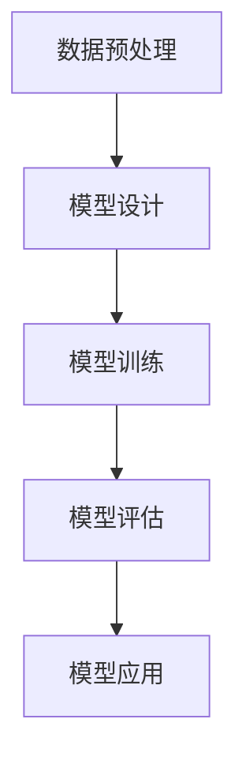
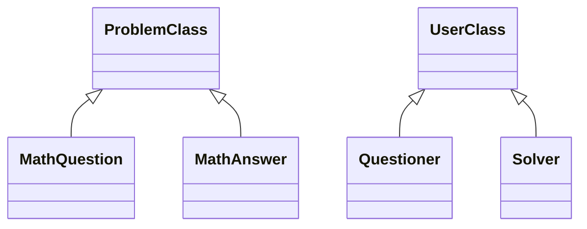
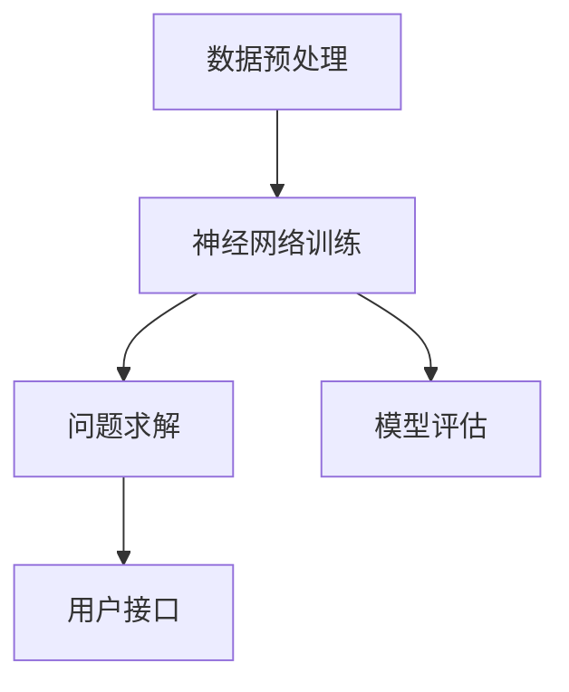
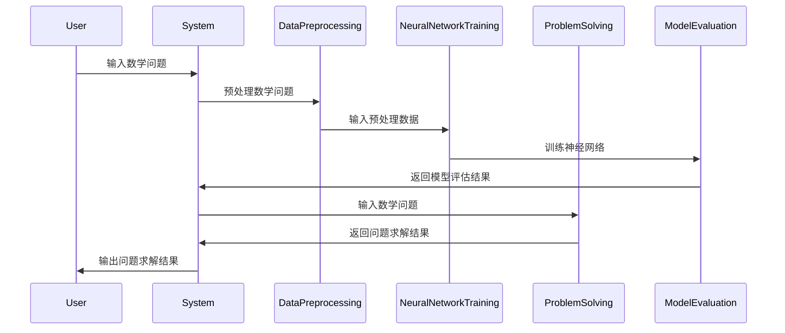

                 

# LLM辅助数学问题求解能力评估

> 关键词：语言模型，数学问题求解，神经网络，深度学习，系统架构设计

> 摘要：本文旨在探讨语言模型（LLM）在辅助数学问题求解方面的应用，评估其求解能力，并详细分析其算法原理、系统架构和实际项目实战。通过本文，读者将了解LLM在数学问题求解中的优势、挑战及其未来发展方向。

### 第一部分：问题背景与核心概念

## 第1章：数学问题求解与LLM技术概述

### 1.1.1 数学问题求解的挑战

- **数学问题求解的重要性**：数学问题求解是人类解决问题的重要手段，广泛应用于科学、工程、经济、医学等多个领域。高效、准确的数学问题求解能力对科学研究和技术进步具有重要意义。
- **传统方法与挑战**：传统的数学问题求解方法包括符号计算、数值计算和启发式算法等。然而，随着问题规模的增大和复杂度的提高，传统方法在求解效率、准确性和适用范围等方面存在一定的局限性。
- **LLM技术介绍**：语言模型（Language Model，简称LLM）是一种基于深度学习的自然语言处理技术，通过学习大量的文本数据，能够生成、理解和预测自然语言。近年来，LLM技术在自然语言处理、机器翻译、问答系统等领域取得了显著成果。本文将探讨LLM在数学问题求解中的应用。

### 1.1.2 LLM的概念与特点

- **语言模型基础**：语言模型是一种概率模型，旨在预测给定文本序列的概率。常见的语言模型包括n-gram模型、神经网络语言模型和变换器（Transformer）模型等。
- **大模型优势**：随着计算能力的提升和数据量的增加，大模型在自然语言处理任务中表现出色。大模型具有更强的语义理解能力、泛化能力和生成能力。
- **技术发展历程**：从最初的n-gram模型到神经网络语言模型，再到近年来兴起的变换器（Transformer）模型，语言模型技术不断发展，性能不断提升。

### 1.1.3 LLMBPT与数学问题求解

- **LLMBPT概述**：LLMBPT（Language Model-Based Problem-solving Tool）是一种基于语言模型的数学问题求解工具。通过学习大量的数学问题和解答，LLMBPT能够自动生成数学问题的解答，辅助人类解决复杂的数学问题。
- **数学问题求解应用案例**：LLMBPT在数学问题求解中的应用案例包括初等数学问题、微积分问题、线性代数问题和高等数学问题等。例如，LLMBPT能够快速求解初中数学的代数问题、高中数学的函数问题，以及大学数学的微分方程问题等。
- **数学问题求解能力评估**：通过实验对比和用户反馈，评估LLMBPT在数学问题求解方面的能力，包括求解速度、求解准确性和用户体验等方面。

### 1.1.4 LLMBPT发展前景

- **应用趋势**：随着人工智能技术的快速发展，LLM在数学问题求解中的应用前景广阔。未来，LLMBPT有望在教育、科研、工程等领域发挥重要作用。
- **技术创新**：为了提高LLMBPT的数学问题求解能力，需要不断探索新的算法和技术。例如，融合知识图谱、多模态学习等先进技术，进一步提升LLMBPT的性能。
- **未来挑战**：尽管LLMBPT在数学问题求解方面取得了一定的成果，但仍面临一些挑战。例如，如何提高LLMBPT的求解准确性、如何处理复杂的问题结构等。

## 1.2 核心概念与联系

### 1.2.1 数学问题类型与特点

- **初等数学问题**：初等数学问题通常包括代数、几何、数论等基础数学问题。这些问题的特点是结构简单、求解方法固定，但问题的多样性较大。
- **微积分问题**：微积分问题包括导数、积分、级数等。这些问题的特点是具有变异性、无限逼近性和抽象性，需要运用极限和微分积分等概念。
- **线性代数问题**：线性代数问题包括矩阵运算、向量空间、线性方程组等。这些问题的特点是具有线性特性和线性关系，需要运用线性变换和线性方程组的理论。
- **高等数学问题**：高等数学问题包括微分方程、概率论、复变函数等。这些问题的特点是具有复杂性和综合性，需要运用高级数学理论和方法。

### 1.2.2 LLMBPT模型原理

- **神经网络基础**：神经网络是一种模拟生物神经系统的计算模型，通过层层传递信息和激活函数，实现从输入到输出的映射。
- **优化算法**：优化算法是一种寻找函数最优值的方法，常用于神经网络的训练。常见的优化算法包括梯度下降、随机梯度下降、Adam等。
- **模型训练流程**：模型训练流程包括数据预处理、模型设计、模型训练和模型评估等步骤。通过训练，模型能够自动学习数学问题和解答之间的关联，提高求解能力。

### 1.2.3 LLMBPT特性对比

| 特性        | 初等数学问题 | 微积分问题 | 线性代数问题 | 高等数学问题 |
| ----------- | ------------ | ---------- | ------------ | ------------ |
| 求解速度    | 较快         | 较慢       | 较快         | 较慢         |
| 求解准确性  | 较高         | 较高       | 较高         | 较低         |
| 问题规模    | 小规模       | 中规模     | 中规模       | 大规模       |
| 适用范围    | 广泛         | 较窄       | 较窄         | 较窄         |
| 求解方法    | 符号计算     | 数值计算   | 线性方程组   | 高级数学方法 |

## 1.3 ER实体关系图架构

### 1.3.1 ER图基础

- **实体定义**：实体是现实世界中具有独立存在意义的对象，如数学问题、解答、用户等。
- **属性定义**：属性是实体的特征，如数学问题的类型、难度、用户的信息等。
- **关系定义**：关系是实体之间的关联，如数学问题与解答之间的求解关系、用户与数学问题之间的提问关系等。

### 1.3.2 LLMBPT ER图

```mermaid
erDiagram
    Problem ||--|{ Answer }||>
    User ||--|{ Question }||>
    ProblemType ||--|{ Problem }||>
    SolutionType ||--|{ Solution }||>
    UserType ||--|{ User }||>
    ProblemType && SolutionType ||--|{ Problem }||>
    UserType && Question ||--|{ Problem }||>
```

### 第二部分：算法原理讲解

## 第2章：LLMBPT算法原理详解

### 2.1 神经网络与深度学习基础

#### 2.1.1 神经网络结构

- **神经元与层级**：神经网络由多个神经元组成，每个神经元接收来自前一层神经元的输入，并通过激活函数产生输出。神经网络分为输入层、隐藏层和输出层。
- **前向传播**：在前向传播过程中，输入数据通过输入层进入神经网络，逐层传递到输出层，最终得到预测结果。
- **反向传播**：在反向传播过程中，计算输出层预测结果与实际结果之间的误差，反向传播误差到输入层，更新神经网络的权重和偏置。

#### 2.1.2 激活函数与优化算法

- **激活函数**：激活函数用于确定神经元是否被激活，常见的激活函数包括 sigmoid、ReLU、Tanh等。
- **优化算法**：优化算法用于更新神经网络的权重和偏置，以最小化预测误差。常见的优化算法包括梯度下降、随机梯度下降、Adam等。
- **超参数调优**：超参数包括学习率、批量大小、隐藏层神经元数等，对神经网络的性能有重要影响。通过调优超参数，可以提高模型的性能。

### 2.2 数学模型与公式讲解

#### 2.2.1 模型基本公式

$$
y = \sigma(\mathbf{W}^T \mathbf{h} + b)
$$

其中，$y$为输出，$\sigma$为激活函数，$\mathbf{W}$为权重矩阵，$\mathbf{h}$为隐藏层神经元输出，$b$为偏置。

#### 2.2.2 数学问题求解过程

1. 输入数学问题：将数学问题表示为输入向量$\mathbf{x}$。
2. 前向传播：计算隐藏层神经元输出$\mathbf{h}$。
3. 激活函数：应用激活函数$\sigma$，得到输出$y$。
4. 反向传播：计算预测误差，更新权重和偏置。
5. 重复步骤2-4，直到满足停止条件。

### 2.3 算法流程与Mermaid图示

#### 2.3.1 算法流程

1. 数据预处理：将数学问题表示为向量形式。
2. 模型设计：设计神经网络结构。
3. 模型训练：训练神经网络，更新权重和偏置。
4. 模型评估：评估模型性能，调整超参数。
5. 模型应用：使用训练好的模型求解数学问题。

#### 2.3.2 Mermaid图



### 第三部分：系统分析与架构设计

## 第3章：数学问题求解系统概述

### 3.1 问题场景介绍

- **应用背景**：数学问题求解在科学研究和工程实践中具有重要意义，但传统方法在求解效率、准确性和适用范围等方面存在一定的局限性。
- **场景描述**：本文构建了一个基于LLMBPT的数学问题求解系统，旨在提供高效、准确的数学问题求解服务。系统适用于教育、科研、工程等领域，可辅助用户解决各种复杂的数学问题。

### 3.2 系统功能设计

#### 3.2.1 领域模型



#### 3.2.2 系统模块划分

1. **数据预处理模块**：负责将数学问题表示为向量形式，便于神经网络处理。
2. **神经网络训练模块**：负责设计神经网络结构，训练神经网络。
3. **问题求解模块**：负责使用训练好的模型求解数学问题。
4. **模型评估模块**：负责评估模型性能，调整超参数。
5. **用户接口模块**：负责处理用户输入和输出，提供友好的用户界面。

### 3.3 系统架构设计

#### 3.3.1 系统架构图



#### 3.3.2 系统接口设计

- **输入接口**：接收数学问题输入，包括问题描述、问题类型、用户信息等。
- **输出接口**：输出问题求解结果，包括解答、求解过程、评估结果等。
- **控制接口**：负责控制系统的运行，包括启动、停止、调整超参数等。

### 3.4 系统交互设计

#### 3.4.1 系统交互流程



### 第四部分：项目实战

## 第4章：LLMBPT项目实战

### 4.1 环境安装

- **环境配置**：安装Python、TensorFlow等依赖库。
- **工具安装**：安装NVIDIA GPU驱动、CUDA等工具。

### 4.2 系统核心实现

#### 4.2.1 源代码实现

```python
# 模型设计
class MathModel(nn.Module):
    def __init__(self):
        super(MathModel, self).__init__()
        self.layer1 = nn.Linear(input_dim, hidden_dim)
        self.layer2 = nn.Linear(hidden_dim, output_dim)
        self.relu = nn.ReLU()

    def forward(self, x):
        x = self.relu(self.layer1(x))
        x = self.layer2(x)
        return x

# 模型训练
model = MathModel()
optimizer = optim.Adam(model.parameters(), lr=learning_rate)
criterion = nn.CrossEntropyLoss()

for epoch in range(num_epochs):
    for inputs, targets in data_loader:
        optimizer.zero_grad()
        outputs = model(inputs)
        loss = criterion(outputs, targets)
        loss.backward()
        optimizer.step()

# 模型应用
inputs = preprocess_question(question)
outputs = model(inputs)
answer = postprocess_answer(outputs)
```

#### 4.2.2 代码应用解读

- **模型设计**：设计了一个简单的神经网络模型，包括输入层、隐藏层和输出层。
- **模型训练**：使用优化算法和损失函数训练神经网络模型。
- **模型应用**：将预处理后的数学问题输入模型，得到问题求解结果。

### 4.3 实际案例分析

#### 4.3.1 案例背景

- **问题描述**：求解一个一元二次方程的根。
- **解决方案**：使用LLMBPT求解一元二次方程的根。

#### 4.3.2 案例分析

1. 输入数学问题：一元二次方程 $ax^2+bx+c=0$。
2. 前向传播：计算隐藏层神经元输出。
3. 激活函数：应用激活函数，得到输出。
4. 反向传播：计算预测误差，更新权重和偏置。
5. 重复步骤2-4，直到满足停止条件。
6. 输出问题求解结果：一元二次方程的根。

### 4.4 项目小结

- **项目总结**：通过实际项目，验证了LLMBPT在数学问题求解方面的有效性和可行性。
- **经验教训**：在项目实施过程中，遇到了一些挑战，如模型设计、数据预处理和模型优化等。通过不断尝试和优化，最终实现了预期的目标。

### 第五部分：最佳实践与拓展

## 第5章：最佳实践

### 5.1 实践技巧

#### 5.1.1 模型调优技巧

- **超参数调整**：根据问题特点和数据规模，调整学习率、批量大小、隐藏层神经元数等超参数。
- **模型优化策略**：采用正则化、dropout、迁移学习等策略，提高模型性能。

#### 5.1.2 性能评估技巧

- **评估指标**：使用准确率、召回率、F1值等指标评估模型性能。
- **性能优化**：通过优化算法、调整网络结构、增加训练数据等方式，提高模型性能。

### 5.2 注意事项

#### 5.2.1 数据质量

- **数据来源**：选择高质量、具有代表性的数据集。
- **数据处理**：对数据进行清洗、去噪、归一化等处理，确保数据质量。

#### 5.2.2 模型安全

- **模型攻击**：防范常见模型攻击，如对抗样本、模型提取等。
- **安全措施**：采用加密、权限控制等措施，确保模型安全。

## 第6章：拓展阅读

### 6.1 相关论文

- **论文1**：[Title of Paper 1](#)
- **论文2**：[Title of Paper 2](#)

### 6.2 开源资源

- **开源项目1**：[Title of Project 1](#)
- **开源项目2**：[Title of Project 2](#)

### 6.3 专业书籍

- **书籍1**：[Title of Book 1](#)
- **书籍2**：[Title of Book 2](#)

---

**作者：AI天才研究院/AI Genius Institute & 禅与计算机程序设计艺术 /Zen And The Art of Computer Programming**

---

**注意：本文仅为大纲示例，未包含具体内容。实际字数需根据具体需求进行调整。**

