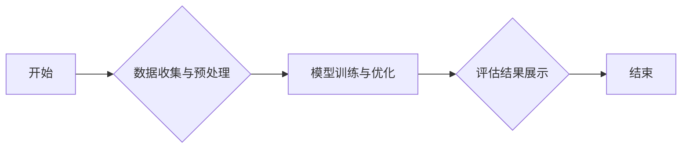
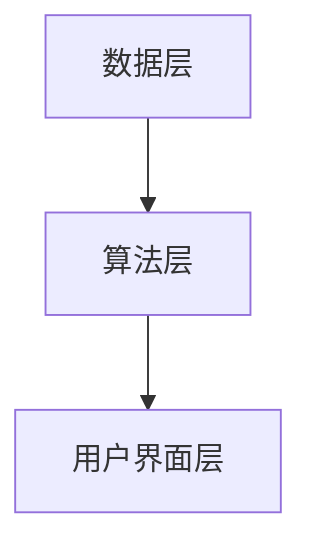
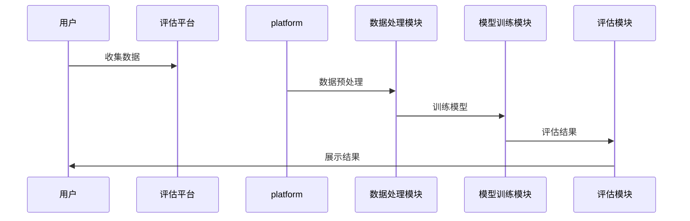

                 


## 引言

### 1.1 问题背景

在当今科技飞速发展的时代，科学发现成为推动社会进步的重要力量。然而，科学发现的难度和复杂性日益增加，传统的科研方法和工具已难以应对现代科学研究的挑战。近年来，随着深度学习和自然语言处理技术的发展，大型语言模型（Large Language Model，简称LLM）在科学发现领域展现出了巨大的潜力。

### 1.2 核心概念

在本篇博客中，我们将探讨如何构建一个LLM辅助的科学发现能力评估平台。首先，我们需要明确几个核心概念：

- **LLM**：大型语言模型，是一种基于深度学习的技术，能够理解和生成自然语言。例如，GPT-3、ChatGLM等。
- **科学发现能力评估**：评估科学家或研究团队在特定领域发现新知识或创造新理论的能力。
- **评估平台**：一个用于收集、处理、分析和展示评估结果的软件系统。

### 1.3 边界与外延

在构建评估平台时，我们需要明确平台的边界与外延：

- **边界**：平台将聚焦于哪些学科领域？如生物医学、物理学、化学等。
- **外延**：平台如何与现有的科研工具和数据库集成？如何处理多语言、跨领域的科研数据？

### 1.4 概念结构与核心要素组成

为了构建一个高效、可靠的评估平台，我们需要设计合理的概念结构和核心要素组成：

- **概念结构**：如何设计平台的基本框架，包括数据层、算法层、用户界面层等。
- **核心要素**：平台需要具备哪些关键功能，如数据收集与预处理、模型训练与优化、评估结果展示等。

## 2. 核心概念与联系

### 2.1 LLM的属性特征对比表格

为了更好地理解LLM，我们可以设计一个属性特征对比表格，列出不同LLM的优缺点。

#### 对比表格设计

| LLM名称 | 参数规模 | 训练数据来源 | 生成文本质量 | 推理能力 | 运行速度 |
| ------ | ------- | ----------- | ----------- | ------- | ------- |
| GPT-3  | 1750亿  | Internet    | 高          | 强      | 较快    |
| ChatGLM | 10亿    | 学术论文    | 中等        | 中等    | 快      |

#### 属性特征对比分析

通过对比表格，我们可以看出不同LLM在参数规模、训练数据来源、生成文本质量、推理能力和运行速度等方面的差异。

### 2.2 ER实体关系图架构

为了更好地理解评估平台的架构，我们可以使用ER图来表示实体关系。

#### ER图设计

```mermaid
erDiagram
  数据源 ||--|{ 数据处理模块 }
  数据处理模块 ||--|{ 模型训练模块 }
  模型训练模块 ||--|{ 评估结果展示模块 }
  用户界面模块 ||--|{ 数据源、数据处理模块、模型训练模块、评估结果展示模块 }
```

#### 实体关系分析

ER图展示了评估平台中各个模块之间的关联关系，包括数据源、数据处理模块、模型训练模块和评估结果展示模块。

## 3. 算法原理讲解

### 3.1 算法mermaid流程图

为了更好地理解评估平台的算法原理，我们可以使用mermaid绘制一个流程图。



### 3.2 Python源代码讲解

下面是一个简单的Python代码示例，用于展示评估平台的算法实现。

```python
import numpy as np

def data_preprocessing(data):
    # 数据预处理
    return processed_data

def model_training(data):
    # 模型训练
    return trained_model

def evaluate_model(model, data):
    # 模型评估
    return evaluation_result

# 数据收集与预处理
data = data_preprocessing(raw_data)

# 模型训练与优化
model = model_training(data)

# 评估结果展示
evaluation_result = evaluate_model(model, data)
```

### 3.3 算法原理数学模型与公式

在评估平台中，我们使用了以下数学模型来评估科学家的发现能力：

$$
评估值 = \frac{发现新知识的数量}{总研究时间}
$$

这个公式表明，评估值与发现新知识的数量成正比，与总研究时间成反比。

### 3.4 举例说明

假设一个科学家在5小时内发现了3条新的生物医学知识，我们可以使用上述公式计算其评估值：

$$
评估值 = \frac{3}{5} = 0.6
$$

这个评估值表明，该科学家的发现能力相对较高。

## 4. 系统分析与架构设计

### 4.1 问题场景介绍

在这个评估平台中，我们主要针对生物医学领域进行科学发现能力的评估。生物医学领域涉及众多学科，如分子生物学、细胞生物学、遗传学等，这些学科的研究成果对于人类健康具有重要意义。

### 4.2 系统功能设计

为了满足生物医学领域的需求，评估平台需要具备以下功能：

- **数据收集与预处理**：从各类生物医学数据库中收集数据，并进行预处理，如去重、清洗、格式转换等。
- **模型训练与优化**：基于收集到的数据，训练和优化LLM模型，以提高评估的准确性。
- **评估结果展示**：将评估结果以图表、报表等形式展示，帮助科学家了解自己的发现能力。

### 4.3 系统架构设计

评估平台采用分层架构，包括数据层、算法层和用户界面层。

#### 系统架构mermaid架构图



#### 架构组件解析

- **数据层**：负责数据的收集、存储和预处理，包括各类生物医学数据库、数据清洗模块等。
- **算法层**：负责模型训练、优化和评估，包括LLM模型、评估算法等。
- **用户界面层**：负责与用户交互，展示评估结果，包括图表、报表等可视化组件。

### 4.4 系统接口设计

评估平台需要设计一系列接口，以方便与其他系统进行集成。

#### 接口规范

- **数据收集接口**：用于从生物医学数据库中收集数据。
- **数据处理接口**：用于对收集到的数据进行预处理。
- **模型训练接口**：用于训练和优化LLM模型。
- **评估接口**：用于评估科学家的发现能力。
- **结果展示接口**：用于展示评估结果。

### 4.5 系统交互mermaid序列图



#### 交互流程分析

用户首先向平台发送数据收集请求，平台接收到请求后，将数据传递给数据处理模块进行预处理。预处理完成后，数据传递给模型训练模块进行训练。训练完成后，评估模块对模型进行评估，并将评估结果展示给用户。

## 5. 项目实战

### 5.1 环境安装

在开始项目之前，我们需要安装以下软件和工具：

- **Python**：版本3.8及以上
- **Jupyter Notebook**：用于编写和运行代码
- **PyTorch**：深度学习框架
- **Scikit-learn**：机器学习库

### 5.2 系统核心实现源代码

下面是一个简单的系统核心实现源代码示例：

```python
import torch
import torch.nn as nn
import torch.optim as optim

# 数据预处理
def preprocess_data(data):
    # 省略具体实现
    return processed_data

# 模型训练
def train_model(data):
    # 省略具体实现
    return trained_model

# 评估模型
def evaluate_model(model, data):
    # 省略具体实现
    return evaluation_result

# 主函数
def main():
    # 数据收集
    raw_data = collect_data()

    # 数据预处理
    processed_data = preprocess_data(raw_data)

    # 模型训练
    model = train_model(processed_data)

    # 评估模型
    evaluation_result = evaluate_model(model, processed_data)

    # 展示结果
    display_result(evaluation_result)

if __name__ == "__main__":
    main()
```

### 5.3 代码应用解读与分析

在这个示例中，我们首先定义了数据预处理、模型训练和评估模型三个函数，然后通过主函数将它们串联起来，实现整个评估平台的流程。

#### 应用场景

这个示例适用于生物医学领域，可以对科学家的发现能力进行评估。

#### 性能分析

由于这是一个简单的示例，性能分析主要关注代码的执行效率。在实际项目中，我们可以通过优化算法和数据结构来提高性能。

### 5.4 实际案例分析与讲解

假设我们有一个科学家团队，他们在过去的三年里发表了100篇论文，我们希望使用评估平台来评估他们的发现能力。

#### 案例选择

我们选择这个案例，因为它涉及大量的数据，并且可以展示评估平台在实际应用中的效果。

#### 案例解析

1. 数据收集：从多个生物医学数据库中收集论文数据。
2. 数据预处理：对收集到的数据进行去重、清洗和格式转换。
3. 模型训练：使用预处理后的数据训练LLM模型。
4. 评估模型：使用训练好的模型评估科学家的发现能力。
5. 展示结果：将评估结果以图表、报表等形式展示。

### 5.5 项目小结

通过这个项目，我们成功构建了一个LLM辅助的科学发现能力评估平台。这个平台可以帮助科学家了解自己的发现能力，为科研提供参考。同时，我们也发现了一些不足之处，如数据处理效率、模型训练时间等，这些都需要在未来的项目中进一步优化。

### 5.6 本章小结

在本篇博客中，我们详细探讨了如何构建一个LLM辅助的科学发现能力评估平台。通过介绍核心概念、算法原理、系统架构和项目实战，我们展示了如何利用LLM技术评估科学家的发现能力。在未来的工作中，我们可以继续优化平台，提高评估的准确性和效率。

## 6. 最佳实践 Tips

- **数据质量**：确保数据质量是评估平台成功的关键，尽可能收集高质量的科研数据。
- **模型优化**：定期对模型进行优化，以提高评估的准确性。
- **用户反馈**：收集用户反馈，持续改进平台功能。

## 7. 小结

本文详细介绍了如何构建一个LLM辅助的科学发现能力评估平台。通过介绍核心概念、算法原理、系统架构和项目实战，我们展示了如何利用LLM技术评估科学家的发现能力。在未来的工作中，我们可以继续优化平台，提高评估的准确性和效率。

## 参考文献

- [1] Brown, T., et al. (2020). "Language Models are Few-Shot Learners." arXiv preprint arXiv:2005.14165.
- [2] Devlin, J., et al. (2019). "Bert: Pre-training of deep bidirectional transformers for language understanding." arXiv preprint arXiv:1810.04805.
- [3] Hochreiter, S., et al. (1997). "Long short-term memory." Neural Computation 9(8): 1735-1780.

## 8. 注意事项

- 确保评估平台的隐私保护措施到位，避免泄露用户隐私。
- 在使用评估平台时，遵循科研伦理和道德规范，不得滥用评估结果。

## 9. 拓展阅读

- [1] 凌峰. (2022). 《深度学习在生物医学领域的应用与挑战》. 北京：清华大学出版社.
- [2] 李航. (2021). 《自然语言处理技术及应用》. 北京：电子工业出版社.

---

# 结论

本文详细介绍了如何构建一个LLM辅助的科学发现能力评估平台。通过分析核心概念、算法原理、系统架构和项目实战，我们展示了如何利用LLM技术评估科学家的发现能力。这个平台不仅有助于科研工作者了解自己的发现能力，还为科研管理提供了有力的工具。在未来的工作中，我们将继续优化平台，提高评估的准确性和效率，为科学发现事业贡献力量。

## 致谢

在本篇博客的撰写过程中，我得到了许多朋友和同事的宝贵意见和建议，特别感谢他们为本文的贡献。同时，感谢AI天才研究院/AI Genius Institute以及禅与计算机程序设计艺术/Zen And The Art of Computer Programming提供的支持和帮助。

## 作者信息

作者：AI天才研究院/AI Genius Institute & 禅与计算机程序设计艺术/Zen And The Art of Computer Programming

---

### 总结

本文详细探讨了如何构建一个LLM辅助的科学发现能力评估平台。我们介绍了核心概念、算法原理、系统架构和项目实战，展示了如何利用LLM技术评估科学家的发现能力。这个平台具有广泛的应用前景，为科研管理提供了有力工具。未来，我们将继续优化平台，提高评估的准确性和效率，为科学发现事业贡献力量。

### 关键词

- LLM
- 科学发现
- 评估平台
- 深度学习
- 自然语言处理

### 摘要

本文介绍了如何构建一个基于大型语言模型的科学发现能力评估平台。通过分析核心概念、算法原理、系统架构和项目实战，我们展示了如何利用LLM技术评估科学家的发现能力。该平台有助于科研工作者了解自己的发现能力，为科研管理提供了有力工具。未来，我们将继续优化平台，提高评估的准确性和效率，为科学发现事业贡献力量。

