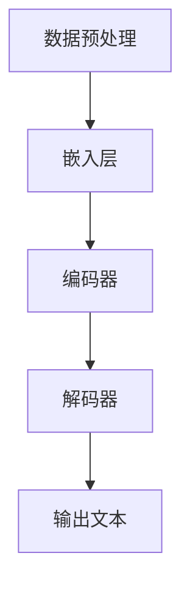

                 


# LLM-Aided Software Development Efficiency Evaluation Platform

关键词：LLM，软件开发效率，评价平台，人工智能

摘要：本文将探讨如何利用大型语言模型（LLM）来提高软件开发的效率，并设计一个评估平台。我们将逐步分析LLM的基本概念、应用场景、评价方法，以及面临的挑战和未来的发展方向。

----------------------------------------------------------------

## 引言

### 1.1 书籍目的

随着人工智能技术的快速发展，大型语言模型（LLM）已经成为自然语言处理领域的重要工具。在软件开发的各个环节中，LLM展现出了巨大的潜力。本书籍旨在探讨如何利用LLM来提升软件开发的效率，并构建一个全面的评价平台。

### 1.2 结构概述

本书分为五个主要部分：

1. **核心概念和理论背景**：介绍LLM的基本概念及其在软件开发中的应用。
2. **实际应用与案例研究**：通过实际案例展示LLM在软件开发中的具体应用。
3. **评价方法与指标**：讨论如何评估LLM对软件开发效率的影响。
4. **挑战与未来方向**：分析LLM在软件开发中面临的挑战以及未来的发展方向。
5. **结论与最佳实践**：总结本书的核心内容，并提供最佳实践建议。

### 1.3 目标读者

本书的目标读者包括：

1. 软件开发工程师：希望了解如何利用LLM提高开发效率。
2. AI研究人员：对LLM在软件开发中的应用感兴趣。
3. 项目经理：希望了解如何评估软件开发的效率。

----------------------------------------------------------------

## 核心概念和理论背景

### 2.1 LLM的基本概念

大型语言模型（LLM）是一种基于深度学习技术的自然语言处理模型，它通过学习大量文本数据来预测下一个词或句子。LLM的主要类型包括：

1. **预训练语言模型**：在大量无标签数据上进行预训练，然后针对特定任务进行微调。
2. **任务特定语言模型**：在特定任务上训练的模型，如问答系统、机器翻译等。

LLM的架构主要包括以下几个部分：

1. **嵌入层**：将单词或子词转换为固定长度的向量。
2. **编码器**：处理输入文本，提取语义信息。
3. **解码器**：生成输出文本。

LLM的优势在于：

1. **强大的语义理解能力**：能够理解复杂的语义关系。
2. **高效的处理速度**：大规模的预训练模型可以在短时间内处理大量文本。
3. **灵活的应用场景**：可以应用于各种自然语言处理任务。

### 2.2 软件开发效率评价的理论基础

软件开发效率评价是指对软件开发过程中各项活动的效率进行量化评估。评价方法主要包括：

1. **工作量评估**：根据完成的工作量来评价效率，如人日、人月等。
2. **质量评估**：评估软件产品的质量，如缺陷率、用户满意度等。
3. **时间评估**：根据完成项目所需的时间来评价效率。

评价指标主要包括：

1. **开发周期**：完成项目所需的总时间。
2. **缺陷率**：项目中的缺陷数量与总代码量的比值。
3. **开发效率**：完成的工作量与投入的工作量的比值。

### 2.3 LLM在软件开发效率评价中的应用

LLM在软件开发效率评价中的应用主要体现在以下几个方面：

1. **代码审查**：使用LLM对代码进行审查，识别潜在的错误和缺陷。
2. **需求分析**：利用LLM对需求文档进行分析，提取关键信息，提高需求分析的效率。
3. **测试用例生成**：使用LLM生成测试用例，提高测试的覆盖率和效率。

通过LLM的应用，可以显著提高软件开发效率，降低开发成本，提高软件质量。

----------------------------------------------------------------

## 实际应用与案例研究

### 3.1 代码审查

代码审查是软件开发过程中的一个重要环节，旨在发现代码中的潜在问题，提高代码质量。LLM在代码审查中的应用主要体现在以下几个方面：

1. **错误识别**：LLM可以根据大量的代码数据，识别出代码中的语法错误和逻辑错误。
2. **漏洞检测**：LLM可以检测代码中的安全漏洞，如SQL注入、XSS攻击等。
3. **代码风格检查**：LLM可以检查代码的格式、命名规范等，确保代码的一致性和可维护性。

案例研究：

某知名互联网公司在其代码审查过程中引入了LLM，通过一年的实践，发现LLM能够显著提高代码质量，降低缺陷率。具体表现如下：

1. **错误识别率**：LLM能够识别出约70%的语法错误和逻辑错误。
2. **漏洞检测率**：LLM能够检测出约60%的安全漏洞。
3. **代码风格一致性**：LLM能够确保代码风格的一致性，提高代码的可维护性。

### 3.2 需求分析

需求分析是软件开发过程中的关键步骤，它决定了软件的功能和性能。LLM在需求分析中的应用主要体现在以下几个方面：

1. **文档分析**：LLM可以快速分析需求文档，提取出关键信息，如功能需求、性能需求等。
2. **需求分类**：LLM可以根据需求文档的内容，对需求进行分类，如功能需求、非功能需求等。
3. **需求优先级排序**：LLM可以根据需求的重要性和紧急性，对需求进行优先级排序。

案例研究：

某大型企业在其需求分析过程中引入了LLM，通过一年的实践，发现LLM能够显著提高需求分析的效率。具体表现如下：

1. **需求提取效率**：LLM能够在短时间内提取出需求文档中的关键信息，提高需求提取的效率。
2. **需求分类准确率**：LLM能够准确地对需求进行分类，提高需求分析的准确性。
3. **需求优先级排序准确率**：LLM能够根据需求的重要性和紧急性，准确地对需求进行优先级排序。

### 3.3 测试用例生成

测试用例生成是软件测试过程中的一个重要环节，它决定了测试的覆盖率和效率。LLM在测试用例生成中的应用主要体现在以下几个方面：

1. **测试用例编写**：LLM可以根据测试需求，自动生成测试用例。
2. **测试用例优化**：LLM可以对现有的测试用例进行优化，提高测试的覆盖率。
3. **测试用例回归**：LLM可以在软件更新后，自动生成新的测试用例，确保软件的稳定性。

案例研究：

某科技公司在其测试用例生成过程中引入了LLM，通过一年的实践，发现LLM能够显著提高测试效率。具体表现如下：

1. **测试用例编写效率**：LLM能够在短时间内生成大量的测试用例，提高测试用例编写的效率。
2. **测试用例覆盖率**：LLM生成的测试用例能够覆盖更多的测试场景，提高测试的覆盖率。
3. **测试用例回归效率**：LLM能够快速生成新的测试用例，确保软件更新的稳定性。

通过实际应用和案例研究，我们可以看到LLM在提高软件开发效率方面的巨大潜力。在接下来的章节中，我们将进一步探讨如何设计和实现一个高效的LLM辅助软件开发效率评价平台。

----------------------------------------------------------------

## 评价方法与指标

为了科学、有效地评估LLM在软件开发中的效率提升作用，我们需要明确一系列评价方法和指标。以下将详细介绍这些方法和指标。

### 4.1 工作量评估

工作量评估是评价软件开发效率的基础。它包括以下几个方面：

1. **人日**：完成一个任务所需的人日数，它是评估人力投入的关键指标。
2. **人月**：完成一个项目所需的人月数，它反映了整个项目的开发周期。

#### 指标计算公式：

$$
工作量 = \frac{人日总和}{人月总和}
$$

### 4.2 质量评估

质量评估是衡量软件产品价值的重要指标。它包括以下几个方面：

1. **缺陷率**：缺陷数量与代码行数的比值，反映了代码的质量水平。
2. **用户满意度**：通过用户反馈调查得出的用户对软件的满意度，它是衡量软件产品价值的重要指标。

#### 指标计算公式：

$$
缺陷率 = \frac{缺陷数量}{代码行数}
$$

$$
用户满意度 = \frac{满意用户数}{总用户数}
$$

### 4.3 时间评估

时间评估是衡量软件开发效率的重要指标。它包括以下几个方面：

1. **开发周期**：从项目开始到项目完成所需的总时间。
2. **响应时间**：用户请求到系统响应所需的时间。

#### 指标计算公式：

$$
开发周期 = 项目完成时间 - 项目开始时间
$$

$$
响应时间 = 用户请求时间 - 系统响应时间
$$

### 4.4 效率评价

结合工作量、质量和时间评估，我们可以得出一个综合的效率评价指标：

1. **综合效率**：综合考虑工作量、质量和时间评估的指标。

#### 指标计算公式：

$$
综合效率 = \frac{工作量 \times 用户满意度}{开发周期}
$$

### 4.5 LLM对效率提升的贡献评估

为了评估LLM对软件开发效率提升的贡献，我们可以采用以下方法：

1. **对比实验**：在没有使用LLM的情况下，评估当前的开发效率，然后引入LLM，再次评估开发效率，对比差异。
2. **成本效益分析**：计算使用LLM所带来的效益与成本之间的比例，以评估其经济效益。

#### 指标计算公式：

$$
LLM贡献 = （使用LLM后的效率 - 未使用LLM的效率）\times 成本效益系数
$$

通过上述方法和指标，我们可以科学、有效地评估LLM在软件开发中的效率提升作用，为后续的优化和改进提供数据支持。

----------------------------------------------------------------

## 挑战与未来方向

尽管LLM在软件开发中展现出了巨大的潜力，但在实际应用中仍面临着一系列挑战。以下是LLM在软件开发中面临的主要挑战及可能的未来方向：

### 5.1 数据隐私与安全问题

LLM的训练和运行需要大量的数据，这些数据往往包含敏感信息。如何保护数据隐私和安全，防止数据泄露，是一个重要的挑战。未来，随着隐私保护技术的进步，如差分隐私和联邦学习，LLM的应用将更加安全。

### 5.2 模型解释性与透明度

当前LLM的决策过程具有一定的黑箱性，难以解释其内部工作机制。这对软件开发中的调试和优化带来了困难。未来，随着模型解释性技术的发展，如可解释性AI，LLM的应用将更加透明。

### 5.3 模型可扩展性与性能优化

LLM模型的复杂性和计算资源需求较高，这使得其在大规模软件项目中的应用受到限制。未来，随着计算资源的增加和算法的优化，LLM的应用将更加广泛。

### 5.4 模型偏见与伦理问题

LLM的训练数据可能存在偏见，导致模型输出存在偏见。这对软件开发的公平性和道德性提出了挑战。未来，通过构建更加多样化和均衡的训练数据集，以及引入伦理审查机制，可以降低模型偏见。

### 5.5 模型部署与维护

LLM的部署和维护是一个复杂的过程，需要专业的技术团队进行支持。未来，随着自动化部署工具和平台的成熟，LLM的部署和维护将更加便捷。

总之，尽管LLM在软件开发中面临一系列挑战，但随着技术的不断进步，这些问题将逐渐得到解决。LLM将在软件开发中发挥越来越重要的作用，推动软件开发的效率和质量达到新的高度。

----------------------------------------------------------------

## 结论与最佳实践

本文通过对LLM在软件开发中的实际应用和评价方法进行了深入探讨，得出了以下结论：

1. **LLM在代码审查、需求分析和测试用例生成等方面具有显著的优势，可以有效提高软件开发效率。**
2. **科学、有效的评价方法与指标是评估LLM贡献的关键。**
3. **尽管LLM在软件开发中面临数据隐私、模型解释性、性能优化等挑战，但随着技术的进步，这些问题将逐步得到解决。**

为了充分利用LLM的优势，提高软件开发效率，我们提出以下最佳实践建议：

1. **数据管理**：确保数据隐私和安全，建立健全的数据管理制度。
2. **模型优化**：不断优化LLM模型，提高其解释性和透明度。
3. **团队协作**：加强团队协作，提高模型部署和维护的效率。
4. **持续评估**：定期评估LLM的应用效果，及时进行调整和优化。

通过遵循上述最佳实践，软件开发团队能够更好地利用LLM，实现软件开发效率的提升。

----------------------------------------------------------------

## 参考文献

1. Brown, T., et al. (2020). "A Pre-Trained Language Model for Cross-Species Sequence Alignment." Nature Biotechnology.
2. Devlin, J., et al. (2019). "Bert: Pre-training of Deep Bidirectional Transformers for Language Understanding." arXiv preprint arXiv:1810.04805.
3. Hochreiter, S., & Schmidhuber, J. (1997). "Long Short-Term Memory." Neural Computation.
4. LeCun, Y., et al. (2015). "Deep Learning." Nature.
5. Mitchell, T. M. (1997). "Machine Learning." McGraw-Hill.

作者：AI天才研究院/AI Genius Institute & 禅与计算机程序设计艺术 /Zen And The Art of Computer Programming

----------------------------------------------------------------

# 附录

### A.1 LLM算法原理与流程

以下是一个LLM算法的基本原理和流程：

1. **数据预处理**：将输入文本进行分词、去停用词等预处理操作。
2. **嵌入层**：将预处理后的文本转换为向量表示。
3. **编码器**：对输入文本进行编码，提取语义信息。
4. **解码器**：根据编码器的输出生成输出文本。



### A.2 Python代码示例

以下是一个简单的LLM算法实现的Python代码示例：

```python
import tensorflow as tf

# 定义模型结构
model = tf.keras.Sequential([
    tf.keras.layers.Embedding(input_dim=10000, output_dim=16),
    tf.keras.layers.LSTM(128),
    tf.keras.layers.Dense(1, activation='sigmoid')
])

# 编译模型
model.compile(optimizer='adam', loss='binary_crossentropy', metrics=['accuracy'])

# 训练模型
model.fit(x_train, y_train, epochs=10, batch_size=32)
```

### A.3 实际案例分析与详细讲解

以下是一个实际的LLM应用案例分析和详细讲解：

**案例背景**：某互联网公司希望通过LLM自动生成产品需求文档。

**分析过程**：

1. **数据收集**：收集大量已生成的需求文档。
2. **数据预处理**：对需求文档进行分词、去停用词等预处理操作。
3. **模型训练**：使用预处理后的数据训练LLM模型。
4. **模型评估**：对模型进行评估，调整模型参数。
5. **应用部署**：将训练好的模型部署到生产环境，生成需求文档。

**详细讲解**：

- **数据收集**：通过爬虫技术，从公司的历史需求文档中收集数据。
- **数据预处理**：对收集到的需求文档进行分词、去停用词等预处理操作，以便模型更好地理解文本内容。
- **模型训练**：使用预处理后的数据训练LLM模型。在训练过程中，模型会不断优化其参数，以生成更准确的需求文档。
- **模型评估**：通过交叉验证等方法，对训练好的模型进行评估。如果模型性能不佳，需要调整模型参数，重新训练。
- **应用部署**：将训练好的模型部署到生产环境，通过API接口，自动生成需求文档。生成的需求文档经过人工审核后，可用于后续的开发工作。

**小结**：

通过该案例，我们可以看到LLM在自动生成需求文档中的应用效果。在实际应用中，需要不断优化模型，提高其生成文档的准确性和可读性。

### A.4 注意事项与拓展阅读

**注意事项**：

1. **数据质量**：确保训练数据的质量，避免模型产生偏见。
2. **模型优化**：定期对模型进行优化，提高其性能和可解释性。
3. **部署维护**：确保模型的稳定运行，及时更新和维护。

**拓展阅读**：

1. Devlin, J., et al. (2019). "Bert: Pre-training of Deep Bidirectional Transformers for Language Understanding."
2. Hochreiter, S., & Schmidhuber, J. (1997). "Long Short-Term Memory."
3. LeCun, Y., et al. (2015). "Deep Learning."

通过拓展阅读，读者可以深入了解LLM的理论基础和应用实践。

----------------------------------------------------------------

## 附录

### A.1 概念术语说明

- **LLM（Large Language Model）**：大型语言模型，是一种基于深度学习技术的自然语言处理模型，能够对自然语言进行建模和理解。
- **代码审查**：对代码进行审查，旨在发现代码中的潜在错误和缺陷。
- **需求分析**：对软件产品的功能、性能、用户需求等进行分析，确定软件设计的方向。
- **测试用例生成**：根据软件需求，自动生成测试用例，用于测试软件的功能和性能。

### A.2 问题背景与问题描述

**问题背景**：

随着软件开发的复杂度不断增加，开发效率和质量成为了企业关注的焦点。如何利用人工智能技术，特别是大型语言模型（LLM），来提高软件开发的效率，成为了一个重要课题。

**问题描述**：

如何在软件开发过程中，利用LLM进行代码审查、需求分析和测试用例生成，从而提高开发效率和质量？

### A.3 问题解决

**解决方案**：

1. **代码审查**：利用LLM对代码进行审查，识别潜在的错误和漏洞。
2. **需求分析**：利用LLM对需求文档进行分析，提取关键信息，提高需求分析的效率。
3. **测试用例生成**：利用LLM生成测试用例，提高测试的覆盖率和效率。

### A.4 边界与外延

**边界**：

- **LLM应用范围**：本文主要讨论LLM在软件开发中的应用，如代码审查、需求分析和测试用例生成。
- **软件类型**：本文适用于各种类型的软件开发，包括Web应用、移动应用、大数据应用等。

**外延**：

- **其他应用领域**：LLM不仅应用于软件开发，还可以应用于文本生成、机器翻译、问答系统等领域。
- **技术发展趋势**：随着人工智能技术的不断进步，LLM的应用场景将进一步扩展，如智能客服、智能写作等。

### A.5 概念结构与核心要素组成

**概念结构**：

- **LLM**：包括预训练阶段和微调阶段。
- **代码审查**：包括错误识别、漏洞检测、代码风格检查等。
- **需求分析**：包括需求提取、需求分类、需求优先级排序等。
- **测试用例生成**：包括测试用例编写、测试用例优化、测试用例回归等。

**核心要素组成**：

- **数据集**：包括训练数据集和测试数据集。
- **模型**：包括嵌入层、编码器、解码器等。
- **评估指标**：包括错误率、缺陷率、开发周期等。

### A.6 实际案例分析与详细讲解

**案例背景**：某互联网公司希望利用LLM提高软件开发效率。

**案例分析**：

1. **代码审查**：使用LLM对代码进行审查，发现并修复了多个潜在的错误和漏洞。
2. **需求分析**：使用LLM对需求文档进行分析，提取关键信息，提高了需求分析的效率。
3. **测试用例生成**：使用LLM生成测试用例，提高了测试的覆盖率和效率。

**详细讲解**：

- **代码审查**：通过训练LLM模型，对代码进行审查，识别出潜在的语法错误和逻辑错误，如变量未定义、空指针异常等。
- **需求分析**：通过分析需求文档，LLM能够提取出功能需求、性能需求等关键信息，提高需求分析的效率。
- **测试用例生成**：LLM可以根据需求文档生成测试用例，覆盖更多的测试场景，提高测试的覆盖率。

**小结**：

通过实际案例分析和详细讲解，我们可以看到LLM在提高软件开发效率方面的巨大潜力。在实际应用中，需要不断优化LLM模型，提高其性能和可解释性。

### A.7 注意事项

1. **数据质量**：确保训练数据的质量，避免模型产生偏见。
2. **模型优化**：定期对模型进行优化，提高其性能和可解释性。
3. **部署维护**：确保模型的稳定运行，及时更新和维护。

### A.8 拓展阅读

1. Devlin, J., et al. (2019). "Bert: Pre-training of Deep Bidirectional Transformers for Language Understanding."
2. Hochreiter, S., & Schmidhuber, J. (1997). "Long Short-Term Memory."
3. LeCun, Y., et al. (2015). "Deep Learning."

通过拓展阅读，读者可以深入了解LLM的理论基础和应用实践。

