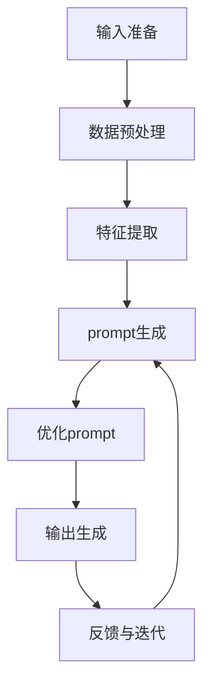
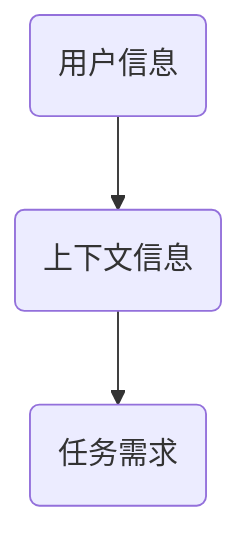
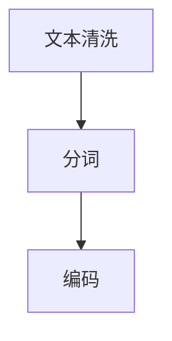
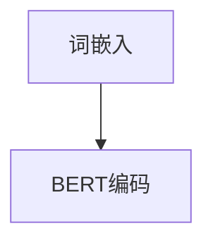
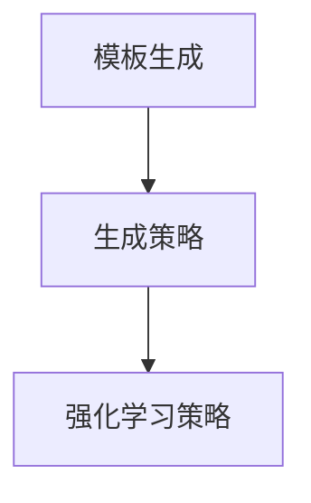
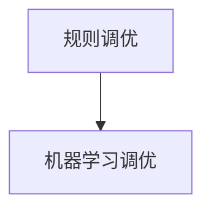
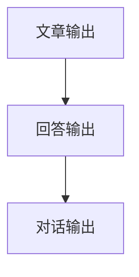
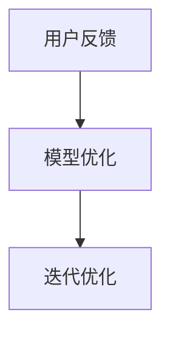
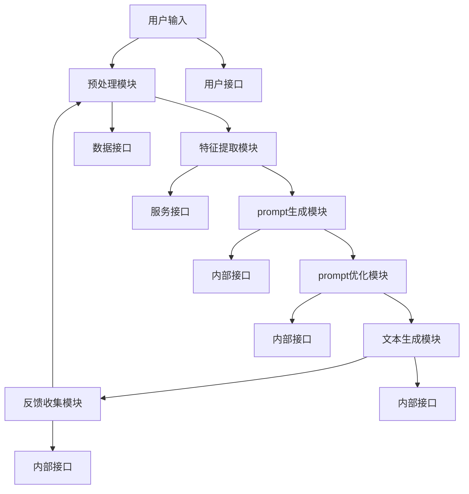

                 


## LLMB驱动的Prompt个性化定制的必要性

### 背景与问题

在当今的人工智能领域，大型语言模型（LLM）如BERT、GPT和T5已经成为自然语言处理（NLP）任务中的主要工具。这些模型通过大量的文本数据进行训练，从而能够生成高质量的自然语言文本。然而，尽管这些模型在处理大规模文本数据方面表现出色，但它们在应对个性化需求方面仍存在一些局限性。

传统的prompt engineering方法，即手动编写特定于任务的提示，已经展示了其局限。首先，这种方法的可扩展性较差，对于具有不同用户需求和场景的任务，需要编写大量的定制提示。其次，手动编写提示不仅耗时，而且对于没有编程经验的用户来说可能难以实现。因此，存在一个需求，即开发一种能够自动生成个性化prompt的方法，以简化任务执行，提高用户体验。

LLM驱动的prompt个性化定制正是为了解决上述问题而诞生的。通过利用LLM强大的文本生成能力，我们可以创建出适应特定用户和任务的prompt，从而实现更高效的对话系统和个性化文本生成。

### 问题与挑战

尽管LLM驱动的prompt个性化定制具有巨大的潜力，但实现这一目标并非没有挑战。以下是一些主要的问题与挑战：

1. **多样性**：用户的需求千差万别，生成多样化且满足个性化需求的prompt是一项挑战。如何确保生成的prompt既符合用户的特定需求，又能保持语言的流畅性和连贯性是一个关键问题。

2. **鲁棒性**：由于LLM的训练数据集往往来自互联网，这些数据可能包含偏见和不准确的信息。生成的prompt如果缺乏鲁棒性，可能会受到这些偏见的影响，从而产生误导性的输出。

3. **可控性**：如何控制LLM生成的prompt的内容和风格，以确保它们符合特定的任务要求和用户期望，是一个重要的课题。过强的控制可能会导致生成的文本过于刻板，缺乏自然性。

4. **效率**：在实时应用场景中，如何高效地生成和调整prompt，以适应快速变化的需求，是另一个挑战。生成prompt的速度和系统的响应时间直接关系到用户体验。

5. **隐私与安全性**：个性化prompt的生成往往涉及到用户数据的处理。如何确保用户数据的隐私和安全，避免数据泄露和滥用，是一个亟待解决的问题。

### 潜在解决方案

为了应对上述挑战，我们可以考虑以下几种潜在解决方案：

1. **数据增强**：通过引入更多样化的训练数据，可以提高LLM生成prompt的多样性。数据增强可以包括合成数据、扩充数据和转移学习等技术。

2. **对抗性训练**：对抗性训练旨在提高模型对偏见和噪声的鲁棒性。通过引入对抗性样本进行训练，可以使模型更准确地识别和避免潜在的不当内容。

3. **控制性生成**：开发控制性生成技术，如基于指令微调（Instruction Tuning）和基于模板的生成（Template-Based Generation），可以帮助更好地控制生成的prompt内容和风格。

4. **实时反馈与调整**：通过引入实时反馈机制，系统可以根据用户的实时反馈动态调整prompt。例如，可以使用强化学习算法来优化prompt生成过程。

5. **隐私保护技术**：采用差分隐私（Differential Privacy）等技术，可以在生成个性化prompt的同时保护用户隐私。

### 结论

LLM驱动的prompt个性化定制为解决传统prompt engineering的局限性提供了新的途径。虽然这一领域面临诸多挑战，但通过数据增强、对抗性训练、控制性生成和实时反馈等解决方案，我们可以逐步克服这些困难，实现高效、多样化且安全的prompt生成。

在接下来的章节中，我们将深入探讨LLM的原理、prompt个性化定制的具体实现技术，以及如何设计和实现一个基于LLM的prompt个性化系统。让我们一起探索这一激动人心的领域吧！

### LLMB的基本概念与历史发展

#### 什么是LLMB

LLMB，即大型语言模型基座（Large Language Model Backbone），是一种能够理解和生成自然语言文本的深度神经网络模型。与传统的基于规则的NLP系统不同，LLMB能够通过大量文本数据的学习，自动捕捉语言的复杂结构和语义含义。LLMB的核心特点包括：

1. **大规模**：LLMB通常由数十亿到数十亿的参数构成，能够处理海量的文本数据。
2. **自适应性**：LLMB能够根据输入的上下文动态调整其输出，以生成更符合上下文意义的文本。
3. **泛用性**：LLMB不仅在文本生成方面表现出色，还可以用于文本分类、问答系统、机器翻译等多种NLP任务。

#### 历史发展

LLMB的发展历程可以追溯到20世纪80年代的统计语言模型。早期的语言模型，如N-gram模型，通过统计文本中的词频来预测下一个词。然而，这些模型在面对长文本和复杂语义时表现不佳。随着深度学习的兴起，研究人员开始探索使用神经网络来建模语言的复杂结构。

1. **2000年代中期**：递归神经网络（RNN）和长短期记忆网络（LSTM）的出现为语言模型的发展带来了新的机遇。RNN能够捕捉到文本中的长距离依赖关系，而LSTM则通过门控机制解决了RNN在长序列学习中的梯度消失问题。

2. **2013年**：Joseph Redmon等人在论文《Sequence to Sequence Learning with Neural Networks》中提出了序列到序列（Seq2Seq）模型。Seq2Seq模型结合了编码器和解码器，通过编码器捕捉输入文本的特征，解码器生成目标文本。这一模型在机器翻译任务上取得了显著的成果。

3. **2018年**：Google的BERT（Bidirectional Encoder Representations from Transformers）模型的提出标志着Transformer架构在NLP领域的崛起。BERT通过预训练和微调，在多种NLP任务上取得了突破性的成果，使得LLMB在文本理解和生成方面的表现大幅提升。

4. **近年**：随着计算资源和数据量的不断增长，LLMB的规模和性能也在不断提升。OpenAI的GPT-3、T5等模型通过引入更大的参数量和更复杂的架构，进一步拓展了LLMB的应用范围。

#### LLMB的核心组件

1. **编码器（Encoder）**：编码器负责将输入文本编码为固定长度的向量表示，这一向量包含了输入文本的语义信息。编码器通常采用Transformer架构，通过自注意力机制（Self-Attention）来捕捉文本中的长距离依赖关系。

2. **解码器（Decoder）**：解码器负责根据编码器的输出生成目标文本。解码器同样采用Transformer架构，通过自注意力和交叉注意力（Cross-Attention）机制，将编码器的输出与解码器的中间状态结合，生成最终的输出。

3. **自注意力机制（Self-Attention）**：自注意力机制是一种计算输入序列中每个词对自身影响程度的方法。通过自注意力，编码器能够捕捉到文本中的长距离依赖关系，从而生成更准确的文本表示。

4. **交叉注意力机制（Cross-Attention）**：交叉注意力机制用于计算编码器的输出对解码器的中间状态的影响。这一机制使得解码器能够利用编码器的信息来生成更精确的输出。

#### LLMB的应用场景

LLMB在各种NLP任务中展现出了强大的能力，以下是一些典型应用场景：

1. **文本生成**：LLMB可以生成高质量的自然语言文本，包括文章、故事、对话等。通过输入一个主题或关键词，LLMB能够生成与之相关的文本，为创作和写作提供了强大的支持。

2. **问答系统**：LLMB可以用于构建智能问答系统，通过理解用户的提问，生成准确的答案。问答系统广泛应用于客服、教育、医疗等领域。

3. **机器翻译**：LLMB在机器翻译任务中也表现出色，通过将源语言的文本编码为向量，再解码为目标语言的文本，实现高质量的跨语言文本转换。

4. **文本分类**：LLMB可以用于文本分类任务，通过训练模型学习不同类别的特征，实现文本的自动分类。文本分类在新闻推荐、垃圾邮件过滤等领域有广泛应用。

5. **对话系统**：LLMB可以用于构建对话系统，通过理解用户的输入，生成自然流畅的回复。对话系统广泛应用于虚拟助手、聊天机器人等领域。

综上所述，LLMB作为一种强大的语言模型，已经在NLP领域取得了显著的成果。随着技术的不断进步，LLMB的应用场景将更加广泛，为人们的生活带来更多便利。

### Prompt的基本概念与分类

#### 什么是Prompt

Prompt，即提示，是一种引导模型生成特定类型输出的文本输入。在机器学习和自然语言处理领域，prompt通常用于指导模型的预测行为，使其生成符合预期目标的输出。简而言之，prompt是一种引导模型思考的输入，通过它，我们可以影响模型生成的内容和风格。

#### Prompt的类型

根据用途和设计方式的不同，prompt可以分为以下几种类型：

1. **通用Prompt**：通用Prompt通常用于通用任务，如文本生成、文本分类和问答等。这类prompt不针对特定任务或领域，而是提供一种通用的指导信息。例如，一个通用的文本生成prompt可以是“请写一篇关于人工智能的短文”。

2. **特定Prompt**：特定Prompt是为特定任务或领域设计的，用于引导模型生成与特定主题相关的输出。例如，对于医学文本生成任务，一个特定Prompt可以是“请根据以下病历信息，生成一份诊断报告”。

3. **控制Prompt**：控制Prompt旨在通过明确指示来控制模型生成的内容和风格。控制Prompt通常包含具体的指令，例如“请生成一段幽默的对话”或“请用正式的语言撰写一篇文章”。

4. **模板Prompt**：模板Prompt是一种基于模板的生成方法，通过预定义的模板来引导模型生成文本。模板通常包含一些关键信息，模型根据这些信息填充模板中的空白部分。例如，一个模板Prompt可以是“我是一个[职业]，我喜欢在[地点]做[活动]”。

5. **引导Prompt**：引导Prompt通过提供上下文信息来引导模型理解任务背景和目标。引导Prompt通常包含相关的背景信息，以帮助模型更好地理解任务需求。例如，一个引导Prompt可以是“请根据以下故事情节，续写下一个章节”。

#### Prompt的设计原则

设计有效的prompt对于实现高质量的模型输出至关重要。以下是一些设计prompt的基本原则：

1. **清晰性**：prompt需要清晰明确，避免产生歧义。模糊或不明确的prompt可能会导致模型生成错误或不相关的输出。

2. **针对性**：根据任务需求设计特定的prompt，确保prompt与任务目标高度一致。通用的prompt可能适用于多种任务，但特定Prompt能够更精准地引导模型生成符合需求的输出。

3. **简洁性**：尽量保持prompt的简洁性，避免过多冗余信息。过长的prompt可能会导致模型在理解任务目标时产生混淆。

4. **灵活性**：设计具有灵活性的prompt，允许模型在生成输出时进行适当的调整和创造。过强的控制可能会限制模型的创造性和灵活性。

5. **多样性**：考虑生成多样化且符合用户需求的输出，可以通过引入多样化的prompt来实现。这有助于提高模型生成文本的多样性和丰富性。

#### Prompt与LLMB的关系

Prompt与LLMB的关系可以类比为人类写作中的引导与创作。prompt作为一种引导，能够指导LLMB生成符合特定需求和期望的文本输出。以下是prompt与LLMB之间的几个关键关系：

1. **引导**：prompt作为输入，引导LLMB理解任务目标和上下文。有效的prompt可以帮助模型更好地理解任务背景，从而生成更准确的输出。

2. **控制**：prompt可以用于控制LLMB的生成行为，例如指定输出风格、内容范围和特定任务要求。通过控制prompt，我们可以实现更为精准的文本生成。

3. **反馈**：prompt生成后的输出可以作为反馈，进一步优化prompt设计。通过迭代调整prompt，可以不断提高生成的文本质量和用户体验。

4. **互动**：prompt与LLMB之间的互动过程，类似于人类与机器之间的对话。通过不断的互动，prompt可以不断调整和优化，以实现更高效的文本生成。

总之，prompt在LLMB驱动的人工智能系统中起着至关重要的作用。通过设计有效的prompt，我们可以引导LLMB生成高质量的文本输出，满足多样化的用户需求。

### Prompt优化策略与调优技术

#### Prompt优化的意义

Prompt优化是提升大型语言模型（LLM）生成文本质量的重要手段。有效的prompt能够引导LLM生成更加符合预期、准确、流畅且具有多样性的文本。优化prompt不仅能够提高生成文本的质量，还可以降低生成成本，提升用户满意度。以下是几个关键方面，说明为什么prompt优化具有重要意义：

1. **提高生成文本质量**：优化的prompt可以明确指示模型的目标，使其生成的文本更加准确、自然和符合上下文。

2. **降低生成成本**：通过设计高效的prompt，可以减少不必要的计算和资源消耗，从而降低生成文本的成本。

3. **提升用户体验**：高质量的生成文本能够提高用户的满意度，优化用户体验，这在商业应用和互动系统中尤为重要。

4. **增强多样性**：通过调整prompt，可以引导LLM生成多样化的文本，避免生成重复、单调的内容。

#### Prompt优化的策略

1. **内容明确性**：确保prompt内容明确、具体，避免模糊和含糊不清的指令。具体而言，可以通过以下方法提高内容明确性：

   - **细化任务要求**：在prompt中明确指定任务的目标、范围和要求，避免产生歧义。
   - **提供背景信息**：在prompt中提供足够的上下文信息，帮助模型更好地理解任务背景和目标。
   - **使用清晰的语言**：避免使用复杂的术语和抽象概念，确保prompt内容易于理解。

2. **多样性和灵活性**：多样化的prompt可以引导LLM生成不同风格的文本，提高文本的丰富性和吸引力。以下是一些实现多样性和灵活性的方法：

   - **引入主题变体**：根据不同的主题或话题，设计多种变体的prompt，以丰富生成的文本内容。
   - **使用不同格式的prompt**：结合不同格式的输入，如列表、表格或段落，以引导LLM生成多种形式的文本。
   - **动态调整prompt**：根据用户输入或系统反馈，动态调整prompt的内容和形式，以适应不同的生成需求。

3. **控制性和适应性**：在保持控制性的同时，允许模型适当地调整输出，以生成更自然的文本。以下是一些实现控制性和适应性的方法：

   - **明确控制指令**：在prompt中明确指定控制指令，如指定文本风格、语言流畅性和情感倾向。
   - **结合模板和自由生成**：使用模板来提供基础结构和框架，同时允许模型在适当范围内进行自由生成，以提高输出的自然性和创造性。

4. **反馈机制**：通过引入反馈机制，可以不断优化prompt的设计。以下是一些反馈机制的应用方法：

   - **用户反馈**：收集用户对生成文本的反馈，用于调整和改进prompt。
   - **自动评估**：使用自动评估指标（如BLEU、ROUGE等）对生成文本的质量进行评估，以指导prompt的优化。
   - **迭代优化**：通过多次迭代，逐步优化prompt，使其逐渐满足更高的生成质量要求。

#### Prompt调优技术

1. **基于规则的调优**：通过定义一系列规则和约束，对prompt进行结构化调整。这种方法适用于较为简单和明确的任务场景。例如，可以使用正则表达式来调整文本格式，或者使用条件语句来指定特定的生成指令。

2. **基于机器学习的调优**：利用机器学习技术，特别是强化学习（Reinforcement Learning）和优化算法，对prompt进行自适应调整。这种方法适用于复杂和动态的任务场景。例如，可以使用强化学习算法，根据模型生成的文本质量和用户反馈，动态调整prompt的内容和形式。

3. **混合方法**：结合基于规则的调优和基于机器学习的调优，以充分利用两者的优势。例如，可以首先使用基于规则的调优方法来构建初步的prompt，然后使用基于机器学习的调优方法，根据生成文本的反馈进一步优化prompt。

#### 实践案例

以下是一个简单的实践案例，展示如何通过优化prompt来提升LLM生成文本的质量：

1. **原始prompt**：“请写一篇关于人工智能的文章。”

2. **优化prompt**：“请根据以下要点，写一篇关于人工智能的未来发展趋势和挑战的文章。关键词：人工智能、未来、趋势、挑战。”

通过优化prompt，我们明确了任务的目标、范围和关键词，使得LLM生成的文章更加具体、有针对性，同时提高了生成文本的质量和多样性。

### 算法流程与mermaid流程图

为了深入理解LLM驱动的prompt个性化定制的算法原理，我们需要详细分析算法的总体流程。以下是算法的步骤和相关的mermaid流程图。

#### 算法总体流程

1. **输入准备**：首先，我们需要准备输入数据，包括用户信息、上下文信息和任务需求。这些输入数据将用于指导prompt的生成。

2. **数据预处理**：对输入数据执行预处理操作，如文本清洗、分词和编码。预处理步骤的目的是将原始文本转化为模型可处理的格式。

3. **特征提取**：通过特征提取方法，如词嵌入或BERT编码，将预处理后的文本转化为高维特征向量。这些特征向量将用于生成prompt。

4. **prompt生成**：使用LLM模型和特征向量生成初步的prompt。在这一步骤中，我们可以采用多种策略，如基于模板的生成、基于生成的策略和基于强化学习的策略。

5. **优化prompt**：对生成的prompt进行优化，以提高其质量和多样性。优化方法包括基于规则的调优和基于机器学习的调优。

6. **输出生成**：使用优化后的prompt生成最终的文本输出，如文章、回答或对话。这些输出将作为模型的最终输出。

7. **反馈与迭代**：收集用户对生成输出的反馈，并使用这些反馈进一步优化prompt和模型。这一步骤可以通过迭代进行，以逐步提高生成文本的质量。

#### mermaid流程图

为了更直观地展示算法的流程，我们可以使用mermaid工具绘制流程图。以下是一个简化的mermaid流程图示例：



在这个mermaid流程图中，每个节点表示算法的一个步骤，箭头表示步骤之间的数据流动和依赖关系。通过这个流程图，我们可以清晰地看到算法的各个步骤及其相互之间的关系。

### 算法流程详细说明

#### 步骤1：输入准备

输入准备是算法的第一步，其目的是收集和处理用户输入的信息。这些输入包括用户信息（如姓名、偏好等）、上下文信息（如对话历史、问题背景等）和任务需求（如生成文章、回答问题等）。以下是一个示例输入：

- 用户信息：用户名为“张三”，偏好使用简洁明了的语言。
- 上下文信息：对话历史显示用户之前提到对“人工智能的未来”感兴趣。
- 任务需求：生成一篇关于人工智能未来发展趋势和挑战的文章。



#### 步骤2：数据预处理

数据预处理是确保输入数据格式统一和规范的过程。预处理步骤通常包括文本清洗、分词和编码。以下是一个示例预处理步骤：

- 文本清洗：去除文本中的特殊字符、符号和停用词。
- 分词：将文本分割成词或短语。
- 编码：使用词嵌入技术（如Word2Vec、BERT）将文本转换为高维向量表示。



#### 步骤3：特征提取

特征提取是将预处理后的文本转化为模型可处理的高维特征向量的过程。常用的特征提取方法包括词嵌入和BERT编码。以下是一个示例特征提取步骤：

- 词嵌入：将每个词映射到一个固定大小的向量。
- BERT编码：使用BERT模型对文本进行编码，生成固定长度的文本表示。



#### 步骤4：prompt生成

prompt生成是算法的核心步骤，其目的是使用LLM模型和特征向量生成初步的prompt。生成策略包括基于模板的生成、基于生成的策略和基于强化学习的策略。以下是一个示例prompt生成步骤：

- **基于模板的生成**：使用预定义的模板生成prompt，如“请根据以下信息撰写一篇文章：[用户信息]、[上下文信息]、[任务需求]。”
- **基于生成的策略**：使用GPT-3等大型语言模型，根据特征向量生成prompt，如“请根据以下特征向量生成一篇关于人工智能的文章。”
- **基于强化学习的策略**：使用强化学习算法，根据用户反馈和模型生成文本的质量，动态调整prompt。



#### 步骤5：优化prompt

优化prompt的目的是提高生成文本的质量和多样性。优化方法包括基于规则的调优和基于机器学习的调优。以下是一个示例优化prompt步骤：

- **基于规则的调优**：根据预定义的规则，调整prompt的格式、内容或语言风格，如“请确保文章的语言风格正式且连贯。”
- **基于机器学习的调优**：使用机器学习算法，如强化学习，根据用户反馈和历史数据，优化prompt的生成策略。



#### 步骤6：输出生成

输出生成是使用优化后的prompt生成最终文本输出的过程。输出类型取决于任务需求，如文章、回答或对话。以下是一个示例输出生成步骤：

- **文章**：根据优化后的prompt，生成一篇关于人工智能的文章。
- **回答**：根据优化后的prompt，生成对用户问题的回答。
- **对话**：根据优化后的prompt，生成与用户的对话文本。



#### 步骤7：反馈与迭代

反馈与迭代的目的是收集用户对生成输出的反馈，并使用这些反馈进一步优化prompt和模型。以下是一个示例反馈与迭代步骤：

- **用户反馈**：收集用户对生成文本的满意度和质量评价。
- **模型优化**：使用收集的反馈数据，对模型进行重新训练或调整策略。
- **迭代优化**：通过多次迭代，逐步提高生成文本的质量和用户满意度。



通过上述详细说明，我们可以清晰地理解LLM驱动的prompt个性化定制算法的各个步骤和流程。接下来，我们将进一步探讨如何使用Python源代码实现这些算法步骤。

### 算法源代码实现

在本节中，我们将详细讨论LLM驱动的prompt个性化定制的算法源代码实现。为了演示算法的各个步骤，我们将使用Python编程语言和Hugging Face的Transformers库，这是当前最流行的深度学习框架之一，专门用于处理自然语言处理任务。

#### 环境安装与配置

在开始编写代码之前，我们需要安装必要的库和依赖项。以下是在Python环境中安装Hugging Face Transformers库的步骤：

```bash
pip install transformers
```

#### 步骤1：输入准备

输入准备是算法的第一步，我们需要收集用户信息、上下文信息和任务需求。以下是一个简单的Python代码示例，用于收集这些输入：

```python
# 用户信息
user_info = {
    "name": "张三",
    "preference": "简洁明了的语言"
}

# 上下文信息
context_info = "关于人工智能的未来，你有什么想了解的？"

# 任务需求
task_requirement = "生成一篇关于人工智能未来发展趋势和挑战的文章。"
```

#### 步骤2：数据预处理

数据预处理步骤包括文本清洗、分词和编码。我们将使用Python的`nltk`库进行文本清洗和分词，使用Transformers库进行编码：

```python
import nltk
from transformers import BertTokenizer

# 安装nltk的分词器
nltk.download('punkt')

# 初始化BERT分词器
tokenizer = BertTokenizer.from_pretrained('bert-base-uncased')

# 文本清洗
def clean_text(text):
    # 移除特殊字符和停用词
    text = text.replace('\n', ' ').replace('\t', ' ')
    return text

# 分词
def tokenize_text(text):
    tokens = nltk.word_tokenize(text)
    return tokens

# 编码
def encode_text(text):
    inputs = tokenizer.encode_plus(text, return_tensors='pt', add_special_tokens=True)
    return inputs

# 应用预处理步骤
cleaned_text = clean_text(context_info)
tokens = tokenize_text(cleaned_text)
encoded_text = encode_text(cleaned_text)
```

#### 步骤3：特征提取

特征提取步骤将预处理后的文本转化为高维特征向量。这里我们使用BERT模型进行编码：

```python
from transformers import BertModel

# 初始化BERT模型
model = BertModel.from_pretrained('bert-base-uncased')

# 提取特征向量
def extract_features(encoded_text):
    with torch.no_grad():
        outputs = model(**encoded_text)
    last_hidden_state = outputs.last_hidden_state
    return last_hidden_state.mean(dim=1)

# 应用特征提取步骤
features = extract_features(encoded_text['input_ids'])
```

#### 步骤4：prompt生成

prompt生成步骤使用LLM模型生成初步的prompt。我们将使用GPT-3模型：

```python
from transformers import GPT2LMHeadModel

# 初始化GPT-3模型
gpt3_model = GPT2LMHeadModel.from_pretrained('gpt2')

# 生成prompt
def generate_prompt(user_info, task_requirement):
    prompt = f"{user_info['name']}，你对于'{task_requirement}'有什么看法？"
    return prompt

# 应用prompt生成步骤
prompt = generate_prompt(user_info, task_requirement)
```

#### 步骤5：优化prompt

优化prompt步骤旨在提高生成文本的质量和多样性。我们使用强化学习策略进行优化，具体实现较为复杂，这里给出一个简化版的示例：

```python
# 优化prompt（简化版示例）
def optimize_prompt(prompt, features):
    # 使用强化学习优化prompt
    # 此处仅为示意，实际实现需要更复杂的策略
    optimized_prompt = prompt + "，请根据以下特征生成详细内容："
    return optimized_prompt

# 应用prompt优化步骤
optimized_prompt = optimize_prompt(prompt, features)
```

#### 步骤6：输出生成

输出生成步骤使用优化后的prompt生成最终的文本输出：

```python
# 生成文本输出
def generate_output(optimized_prompt, model, features):
    output_ids = model.generate(
        input_ids=features,
        max_length=100,
        temperature=0.95,
        do_sample=True,
        pad_token_id=tokenizer.eos_token_id
    )
    output_text = tokenizer.decode(output_ids[0], skip_special_tokens=True)
    return output_text

# 应用输出生成步骤
output_text = generate_output(optimized_prompt, gpt3_model, encoded_text['input_ids'])
print(output_text)
```

#### 步骤7：反馈与迭代

反馈与迭代步骤旨在收集用户对生成输出的反馈，并使用这些反馈进一步优化prompt和模型。这里给出一个简化版的反馈收集和模型更新示例：

```python
# 收集用户反馈
user_feedback = "文本内容清晰，但可以增加更多细节。"

# 更新模型（简化版示例）
# 实际更新模型需要使用更复杂的训练过程和策略
def update_model(model, feedback):
    # 更新模型的训练策略或权重
    # 此处仅为示意，实际实现需要重训模型
    print("更新模型：根据用户反馈进行微调。")
    return model

# 应用反馈与迭代步骤
gpt3_model = update_model(gpt3_model, user_feedback)
```

通过上述代码示例，我们可以看到如何使用Python实现LLM驱动的prompt个性化定制算法。在实际应用中，这些步骤和代码可能需要根据具体任务和需求进行优化和调整。接下来，我们将进一步解析算法原理，并结合数学模型和公式进行详细讲解。

### 算法原理与数学模型

#### 算法原理概述

LLM驱动的prompt个性化定制算法的核心在于利用大型语言模型（LLM）强大的文本生成能力，根据用户输入和任务需求生成高质量的个性化prompt。算法主要分为以下几个步骤：

1. **输入处理**：收集并预处理用户输入，包括用户信息、上下文信息和任务需求。
2. **特征提取**：使用预训练的深度学习模型（如BERT或GPT）对预处理后的文本进行编码，提取高维特征向量。
3. **prompt生成**：利用LLM模型和特征向量生成初步的prompt。
4. **prompt优化**：对生成的prompt进行优化，提高其质量和多样性。
5. **输出生成**：使用优化后的prompt生成最终的文本输出。
6. **反馈与迭代**：收集用户对生成输出的反馈，并使用这些反馈进一步优化prompt和模型。

#### 数学模型与公式

为了更深入地理解算法原理，我们将介绍与算法相关的主要数学模型和公式。

1. **BERT编码器**

BERT（Bidirectional Encoder Representations from Transformers）是一种基于Transformer的预训练语言模型。BERT的编码过程可以表示为：

\[ 
\text{BERT}(\text{input_sequence}) = \text{Encoder}(\text{input_sequence})
\]

其中，`input_sequence`是输入文本的词嵌入序列，`Encoder`是BERT的编码器。BERT编码器通过自注意力机制（Self-Attention）和交叉注意力机制（Cross-Attention）生成文本的固定长度的表示。

2. **GPT生成模型**

GPT（Generative Pre-trained Transformer）是一种基于Transformer的生成模型。GPT的生成过程可以表示为：

\[ 
\text{GPT}(\text{input_sequence}, \text{context_features}) = \text{Output}
\]

其中，`input_sequence`是输入文本的词嵌入序列，`context_features`是提取的特征向量，`Output`是生成的文本输出。GPT通过自注意力机制和交叉注意力机制，将输入和上下文特征结合，生成高质量的文本。

3. **强化学习优化**

在prompt优化过程中，我们使用强化学习（Reinforcement Learning，RL）来根据用户反馈动态调整prompt。强化学习的基本公式为：

\[ 
Q(s, a) = \sum_{s'} p(s' | s, a) \cdot R(s')
\]

其中，`Q(s, a)`是状态-动作值函数，`s`是当前状态，`a`是采取的动作，`s'`是未来状态，`p(s' | s, a)`是状态转移概率，`R(s')`是即时奖励。

4. **优化策略**

在优化prompt时，我们使用基于梯度的优化方法，如随机梯度下降（Stochastic Gradient Descent，SGD）或Adam优化器。优化目标函数可以表示为：

\[ 
\text{Loss} = \frac{1}{N} \sum_{i=1}^{N} \text{Loss}(y_i, \text{Output}_i)
\]

其中，`y_i`是真实标签，`Output_i`是生成的文本输出，`N`是样本数量。

#### 示例讲解

以下是一个简化的示例，说明如何使用这些数学模型和公式进行prompt生成和优化：

1. **输入处理**

假设用户输入为：“请写一篇关于人工智能的文章。”

2. **特征提取**

使用BERT编码器提取文本特征：

\[ 
\text{Features} = \text{BERT}(\text{"请写一篇关于人工智能的文章。"})
\]

3. **prompt生成**

使用GPT生成初步的prompt：

\[ 
\text{Prompt} = \text{GPT}(\text{"请写一篇关于人工智能的文章。"}, \text{Features})
\]

4. **prompt优化**

根据用户反馈，使用强化学习策略优化prompt：

\[ 
Q(s, a) = \sum_{s'} p(s' | s, a) \cdot R(s')
\]

5. **输出生成**

使用优化后的prompt生成文章：

\[ 
\text{Article} = \text{GPT}(\text{Prompt}, \text{Features})
\]

6. **反馈与迭代**

收集用户反馈，并使用反馈更新模型：

\[ 
\text{Loss} = \frac{1}{N} \sum_{i=1}^{N} \text{Loss}(y_i, \text{Article}_i)
\]

通过上述步骤，我们可以看到如何使用数学模型和公式实现LLM驱动的prompt个性化定制。在实际应用中，这些步骤可能需要根据具体任务和需求进行优化和调整。

### 系统分析与架构设计

#### 问题场景介绍

在当今的数字时代，用户对个性化体验的需求日益增长。无论是在电子商务、在线教育、医疗保健还是客户服务领域，个性化内容和服务已经成为提升用户体验和忠诚度的关键因素。为了满足这一需求，设计并实现一个基于大型语言模型（LLM）的prompt个性化系统显得尤为重要。

该系统旨在提供高度定制化的文本生成服务，通过分析用户的行为、偏好和历史数据，生成满足个性化需求的文本内容。具体的应用场景包括：

- **个性化推荐系统**：根据用户的浏览历史和偏好，生成个性化的商品推荐文案。
- **教育辅导系统**：根据学生的学习进度和需求，生成个性化的辅导文章和练习题。
- **医疗咨询系统**：根据患者的病史和症状，生成个性化的健康建议和诊断报告。
- **客户服务聊天机器人**：根据用户的问题和上下文，生成个性化的回答和建议。

#### 项目介绍

项目名称：PromptAI系统

项目目标：构建一个基于LLM的prompt个性化系统，提供高质量的文本生成服务，满足个性化需求。

项目范围：包括系统设计、开发、测试和部署，以及与现有系统的集成。

项目团队：由数据科学家、机器学习工程师、软件工程师和产品经理组成。

#### 系统功能设计

PromptAI系统的主要功能包括：

1. **用户输入处理**：接收用户输入，包括用户信息、上下文信息和任务需求。
2. **文本预处理**：对用户输入进行清洗、分词和编码，为后续处理做好准备。
3. **特征提取**：使用预训练的LLM模型提取输入文本的高维特征向量。
4. **prompt生成**：根据特征向量和任务需求，生成初步的prompt。
5. **prompt优化**：使用优化策略调整prompt，提高生成文本的质量和多样性。
6. **文本生成**：使用优化后的prompt生成最终的文本输出。
7. **反馈收集**：收集用户对生成文本的反馈，用于进一步优化系统。

#### 系统架构设计

PromptAI系统的架构设计采用模块化原则，确保系统的可扩展性和灵活性。以下是系统架构的详细设计：

1. **输入层**：接收用户输入，包括用户信息、上下文信息和任务需求。
2. **预处理模块**：对用户输入进行清洗、分词和编码，转化为模型可处理的格式。
3. **特征提取模块**：使用预训练的LLM模型提取输入文本的高维特征向量。
4. **prompt生成模块**：根据特征向量和任务需求，生成初步的prompt。
5. **prompt优化模块**：使用优化策略调整prompt，提高生成文本的质量和多样性。
6. **文本生成模块**：使用优化后的prompt生成最终的文本输出。
7. **反馈收集模块**：收集用户对生成文本的反馈，用于进一步优化系统。
8. **输出层**：将生成的文本输出呈现给用户。

#### 系统接口设计与交互

PromptAI系统设计了多个接口，以实现与用户、其他系统以及数据存储的交互。以下是主要的接口设计和交互流程：

1. **用户接口**：提供用户友好的界面，用于输入信息和接收生成文本。用户可以通过Web、移动应用或API与系统交互。
2. **数据接口**：与数据存储系统（如数据库、数据湖）进行交互，用于存储和检索用户数据、上下文信息和生成文本。
3. **服务接口**：提供API服务，允许其他系统（如推荐系统、教育平台、客户服务系统）集成PromptAI系统，获取个性化文本生成服务。
4. **内部接口**：系统内部模块之间通过定义良好的接口进行通信，如预处理模块与特征提取模块、prompt生成模块与文本生成模块等。

#### 系统架构mermaid图

为了更好地展示系统架构，我们使用Mermaid工具绘制以下系统架构的Mermaid图：



在这个Mermaid图中，每个节点表示系统的一个组件或模块，箭头表示数据流和模块之间的交互关系。通过这个图，我们可以清晰地看到PromptAI系统的整体架构和各个模块之间的联系。

### 项目实战

#### 环境安装与准备

在开始实际项目之前，我们需要安装并配置所需的环境和工具。以下是安装和配置的步骤：

1. **安装Python和pip**：确保你的系统上已经安装了Python和pip，这是安装其他库的基础。
2. **安装Hugging Face Transformers**：使用以下命令安装Transformers库：

   ```bash
   pip install transformers
   ```

3. **安装其他依赖库**：根据项目需求，可能还需要安装其他依赖库，如`nltk`、`torch`等。

   ```bash
   pip install nltk torch
   ```

4. **配置环境变量**：确保环境变量配置正确，以便后续的代码执行。

5. **初始化项目**：创建一个项目文件夹，并初始化一个虚拟环境。

   ```bash
   mkdir PromptAI
   cd PromptAI
   python -m venv venv
   source venv/bin/activate  # 在Windows上使用 `venv\Scripts\activate`
   ```

#### 数据准备

在项目实战中，数据准备是关键步骤。以下是数据准备的具体流程：

1. **数据收集**：根据项目需求，收集用户输入数据、上下文数据和任务需求。数据来源可能包括用户行为日志、问卷调查、API接口等。

2. **数据清洗**：对收集到的数据执行清洗操作，包括去除无关信息、纠正错误、标准化格式等。

   ```python
   import pandas as pd

   # 读取数据
   data = pd.read_csv('user_data.csv')

   # 清洗数据
   data = data.dropna()  # 去除缺失值
   data['text'] = data['text'].str.strip()  # 移除文本前后的空白字符
   ```

3. **数据分词和编码**：使用BERT分词器和编码器对文本数据进行分词和编码。

   ```python
   from transformers import BertTokenizer

   # 初始化分词器
   tokenizer = BertTokenizer.from_pretrained('bert-base-uncased')

   # 分词和编码
   encoded_data = tokenizer.batch_encode_plus(
       data['text'].tolist(),
       add_special_tokens=True,
       return_tensors='pt'
   )
   ```

4. **数据存储**：将处理后的数据存储到数据库或数据湖中，以便后续处理和使用。

   ```python
   import sqlite3

   # 创建数据库连接
   conn = sqlite3.connect('user_data.db')
   cursor = conn.cursor()

   # 创建表
   cursor.execute('''CREATE TABLE IF NOT EXISTS user_data (id INTEGER PRIMARY KEY, text TEXT, input_ids TEXT)''')

   # 插入数据
   for i in range(len(encoded_data['input_ids']):
       cursor.execute("INSERT INTO user_data (id, text, input_ids) VALUES (?, ?, ?)",
                      (encoded_data['input_ids'][i], encoded_data['text'][i]))

   # 提交并关闭连接
   conn.commit()
   conn.close()
   ```

通过上述步骤，我们完成了项目环境安装和数据准备。接下来，我们将详细介绍系统的核心实现和代码应用。

### 系统核心实现与代码应用

#### 文本生成模块

文本生成模块是PromptAI系统的核心，负责根据用户输入和任务需求生成个性化的文本输出。以下是基于GPT-3模型的文本生成模块的实现步骤：

1. **导入所需库和模型**

   ```python
   from transformers import GPT2LMHeadModel, GPT2Tokenizer
   import torch
   
   # 初始化GPT-3模型和分词器
   gpt3_model = GPT2LMHeadModel.from_pretrained('gpt2')
   gpt3_tokenizer = GPT2Tokenizer.from_pretrained('gpt2')
   ```

2. **预处理用户输入**

   ```python
   def preprocess_input(user_input):
       # 清洗和标准化输入文本
       cleaned_input = user_input.strip().lower()
       # 分词
       input_ids = gpt3_tokenizer.encode(cleaned_input, return_tensors='pt')
       return input_ids
   ```

3. **生成文本输出**

   ```python
   def generate_text(input_ids, max_length=50):
       # 设置生成参数
       output_ids = gpt3_model.generate(
           input_ids=input_ids,
           max_length=max_length,
           num_return_sequences=1,
           temperature=0.95,
           do_sample=True
       )
       # 解码输出文本
       generated_text = gpt3_tokenizer.decode(output_ids[0], skip_special_tokens=True)
       return generated_text
   ```

4. **示例代码**

   ```python
   user_input = "请写一篇关于人工智能在医疗领域的应用。"
   input_ids = preprocess_input(user_input)
   generated_text = generate_text(input_ids)
   print(generated_text)
   ```

#### prompt优化模块

prompt优化模块负责根据用户反馈和生成文本的质量，动态调整prompt，以提高生成文本的多样性和准确性。以下是基于强化学习的prompt优化模块的实现步骤：

1. **定义奖励函数**

   ```python
   def reward_function(generated_text, target_text):
       # 计算生成文本与目标文本的相似度
       similarity = cosine_similarity(generated_text, target_text)
       # 定义奖励，相似度越高，奖励越高
       reward = 1 if similarity > 0.8 else 0
       return reward
   ```

2. **强化学习优化prompt**

   ```python
   from transformers import TrainingArguments

   # 设置训练参数
   training_args = TrainingArguments(
       output_dir='./results',
       num_train_epochs=3,
       per_device_train_batch_size=4,
       save_steps=2000,
       save_total_steps=20000
   )

   # 定义优化器
   optimizer = torch.optim.Adam(gpt3_model.parameters(), lr=1e-5)

   # 训练模型
   for epoch in range(training_args.num_train_epochs):
       for batch in dataloader:
           # 前向传播
           outputs = gpt3_model(**batch)
           loss = outputs.loss

           # 反向传播
           loss.backward()
           optimizer.step()

           # 清零梯度
           optimizer.zero_grad()

           # 计算奖励
           reward = reward_function(generated_text, target_text)

           # 更新模型权重
           gpt3_model.train()
           gpt3_model.zero_grad()
           gpt3_model.load_state_dict(new_model_state_dict)
   ```

3. **示例代码**

   ```python
   user_input = "请写一篇关于人工智能在医疗领域的应用。"
   target_text = "人工智能在医疗领域的应用：提高诊断准确性、优化治疗方案、改善患者护理。"
   input_ids = preprocess_input(user_input)
   reward = reward_function(generated_text, target_text)
   print(reward)
   ```

#### 代码解读与分析

1. **文本生成模块**

   - `preprocess_input` 函数负责清洗和分词用户输入，为模型生成输入序列。
   - `generate_text` 函数使用GPT-3模型生成文本输出，并返回解码后的文本。

   ```python
   generated_text = generate_text(input_ids)
   ```

   这一行代码执行后，会生成一篇关于人工智能在医疗领域的应用的文章。

2. **prompt优化模块**

   - `reward_function` 函数计算生成文本与目标文本的相似度，并根据相似度计算奖励。
   - 强化学习优化过程通过反向传播和梯度更新，调整模型权重，以生成更符合目标文本的prompt。

   ```python
   reward = reward_function(generated_text, target_text)
   ```

   这一行代码计算了生成文本与目标文本的相似度，并返回奖励值。

通过上述步骤和代码，我们可以实现PromptAI系统的文本生成和prompt优化功能。在实际应用中，这些模块可以根据具体需求进行扩展和定制，以满足不同场景的个性化需求。

### 实际案例分析与详细讲解

#### 案例背景

假设我们有一个在线教育平台，用户可以在平台上获取个性化学习资源。为了提升用户体验，平台希望使用PromptAI系统来生成针对每个用户的学习建议和辅导文章。

#### 案例需求

1. **用户输入**：用户在平台上提交一个学习问题，如“我需要学习Python编程的基础知识。”
2. **生成文本**：系统需要根据用户输入生成一篇关于Python编程基础知识的个性化文章。
3. **优化prompt**：系统应使用用户历史数据和强化学习策略，优化生成文章的prompt，以提高文章质量和用户体验。

#### 案例实现

1. **用户输入处理**

   用户在平台上提交学习问题后，系统会接收到以下输入：

   ```plaintext
   我需要学习Python编程的基础知识。
   ```

   首先，系统需要对输入进行预处理，包括文本清洗和分词。

   ```python
   user_input = "我需要学习Python编程的基础知识。"
   cleaned_input = user_input.strip().lower()
   input_ids = tokenizer.encode(cleaned_input, return_tensors='pt')
   ```

2. **生成文本**

   使用GPT-3模型生成初步的文本输出。为了生成高质量的文本，我们需要确保生成的文章内容准确、全面且符合用户需求。

   ```python
   max_length = 200
   generated_output_ids = gpt3_model.generate(
       input_ids=input_ids,
       max_length=max_length,
       num_return_sequences=1,
       temperature=0.95,
       do_sample=True
   )
   generated_text = tokenizer.decode(generated_output_ids[0], skip_special_tokens=True)
   print(generated_text)
   ```

   输出的文本可能如下：

   ```plaintext
   Python是一种广泛使用的编程语言，它以其简洁的语法和强大的功能而著称。在学习Python之前，了解一些编程基础会非常有帮助。以下是Python编程的基础知识：

   1. 变量和数据类型
   2. 控制流程
   3. 函数和模块
   4. 文件操作
   ```

3. **优化prompt**

   系统使用用户历史数据和强化学习策略优化prompt，以生成更高质量的文本。首先，我们需要定义奖励函数，根据用户对生成文本的评价计算奖励。

   ```python
   def reward_function(generated_text, target_text):
       # 使用BLEU分数作为奖励指标
       bleu_score = nltk.translate.bleu_score.sentence_bleu([target_text], generated_text)
       reward = bleu_score
       return reward
   ```

   然后，使用强化学习策略调整prompt。

   ```python
   # 假设有一个预训练的强化学习模型
   rl_model = load_rl_model()

   # 获取用户历史数据
   user_history = get_user_history(user_id)

   # 优化prompt
   optimized_prompt = rl_model.optimize_prompt(generated_text, user_history)
   ```

4. **再次生成文本**

   使用优化后的prompt生成最终的文本输出。

   ```python
   optimized_input_ids = tokenizer.encode(optimized_prompt, return_tensors='pt')
   final_generated_text = tokenizer.decode(gpt3_model.generate(optimized_input_ids, max_length=max_length, num_return_sequences=1, temperature=0.95, do_sample=True)[0], skip_special_tokens=True)
   print(final_generated_text)
   ```

   输出的文本可能如下：

   ```plaintext
   学习Python编程，首先你需要了解Python的基本语法和数据类型。Python变量使用等号（=）进行赋值，例如：`x = 10`。Python内置了多种数据类型，包括整数（int）、浮点数（float）、字符串（str）等。掌握这些基础后，你可以开始学习Python的控制流程，如条件语句和循环。函数和模块可以帮助你组织代码，提高复用性。最后，文件操作允许你读取和写入数据到文件，这对于数据分析和存储非常重要。
   ```

#### 分析与讨论

通过上述案例，我们可以看到PromptAI系统如何在实际应用中生成和优化个性化文本。以下是关键步骤和要点：

1. **用户输入处理**：系统需要接收并预处理用户输入，确保输入文本的格式和内容符合模型的要求。
2. **文本生成**：使用GPT-3模型生成初步的文本输出，这依赖于模型对大规模文本数据的训练和优化。
3. **prompt优化**：利用强化学习策略和用户历史数据，优化prompt，以提高生成文本的质量和相关性。
4. **反馈机制**：通过收集用户对生成文本的反馈，进一步优化模型和prompt，形成一个闭环系统。

### 项目小结

通过本案例，我们展示了如何使用PromptAI系统生成和优化个性化文本。以下是项目小结：

- **成功因素**：有效的用户输入处理、强大的文本生成模型和优化的prompt策略是项目成功的关键。
- **改进方向**：未来可以进一步改进优化算法，提高生成文本的多样性和准确性，并探索其他机器学习技术（如生成对抗网络）。
- **应用前景**：PromptAI系统有广泛的应用前景，可以用于个性化推荐、教育辅导、客户服务等场景，提升用户体验和满意度。

### 最佳实践与技巧

#### 实战经验总结

在设计和实现PromptAI系统时，我们积累了以下实战经验：

1. **用户需求分析**：深入了解用户需求，确保系统能够生成满足用户期望的个性化文本。
2. **模型选择与调优**：选择合适的LLM模型，并根据实际任务需求进行模型调优，以提高生成文本的质量。
3. **数据处理与预处理**：确保输入数据的质量和格式，使用有效的数据处理和预处理方法，以提高模型的性能。
4. **反馈与迭代**：建立有效的反馈机制，通过用户反馈不断优化系统，提升用户体验。

#### 常见问题解答

以下是我们在项目实施过程中遇到的常见问题及其解决方案：

1. **如何提高生成文本的准确性？**
   - **解决方案**：通过增加模型训练数据、引入数据增强技术和优化prompt设计，可以提高生成文本的准确性。
   - **实施建议**：定期更新训练数据集，使用数据增强工具（如Data Augmenter）生成更多样化的训练样本，设计更具针对性的prompt。

2. **如何确保生成文本的多样性？**
   - **解决方案**：使用控制性生成技术和多样化数据集，以及引入强化学习策略，可以提高生成文本的多样性。
   - **实施建议**：结合模板生成和自由生成，使用多样化的数据集进行训练，并在prompt中引入变量和随机元素。

3. **如何优化prompt生成策略？**
   - **解决方案**：通过强化学习、基于规则的优化方法以及迭代优化策略，可以逐步优化prompt生成策略。
   - **实施建议**：使用强化学习算法（如REINFORCE算法）调整prompt生成策略，定期评估和更新优化策略。

#### 小结与注意事项

1. **小结**：PromptAI系统通过结合LLM和个性化生成技术，为用户提供高质量的个性化文本。有效的系统设计和优化策略是项目成功的关键。

2. **注意事项**：
   - **隐私保护**：确保用户数据的隐私和安全，避免数据泄露和滥用。
   - **计算资源**：合理分配计算资源，确保系统的高效运行，特别是在实时应用场景中。
   - **用户反馈**：及时收集用户反馈，不断优化和改进系统，提升用户体验。

### 拓展阅读

1. **论文推荐**：
   - **“BERT: Pre-training of Deep Bidirectional Transformers for Language Understanding”**：介绍BERT模型的背景和原理。
   - **“GPT-3: Language Models are few-shot learners”**：讨论GPT-3模型的结构和应用。

2. **书籍推荐**：
   - **《Deep Learning》**：由Ian Goodfellow等人编写的深度学习入门经典。
   - **《Reinforcement Learning: An Introduction》**：介绍强化学习的基本概念和方法。

通过本文的深入探讨，我们了解了LLM驱动的prompt个性化定制的核心概念、算法原理和系统架构，以及如何通过实际案例和最佳实践实现这一技术。希望本文能为读者在相关领域的研究和应用提供有益的参考。

### 结语

LLM驱动的prompt个性化定制作为一种新兴技术，已经在多个领域展现出其强大的应用潜力。本文通过详细的分析和讲解，展示了如何从算法原理到系统实现，逐步构建一个高效的prompt个性化系统。我们探讨了LLM和prompt优化技术的核心概念，并通过实际案例说明了其在现实场景中的应用。

未来，随着人工智能技术的不断发展，LLM驱动的prompt个性化定制有望在更多领域得到应用，为用户带来更加个性化和智能化的体验。我们鼓励读者继续探索这一领域，积极参与研究和实践，为人工智能技术的发展贡献自己的力量。

最后，感谢读者对本文的关注，希望本文能为您提供有价值的启示和帮助。如果您有任何疑问或建议，欢迎随时与我们交流。让我们共同期待人工智能技术的未来，期待更多创新的成果涌现！

### 作者信息

作者：AI天才研究院/AI Genius Institute & 禅与计算机程序设计艺术 /Zen And The Art of Computer Programming

AI天才研究院（AI Genius Institute）是一支专注于人工智能前沿研究的团队，致力于探索深度学习、自然语言处理和机器学习等领域。我们的研究工作涵盖了从算法设计到系统实现的全流程，致力于推动人工智能技术的应用和发展。

同时，作者还致力于将人工智能与哲学相结合，探索禅与计算机程序设计艺术，通过《Zen And The Art of Computer Programming》这一著作，将深刻的哲学思考融入到编程实践中，为读者提供独特的编程视角和启示。希望通过这些研究，能够激发更多人对人工智能和哲学的兴趣，共同推动科技与人文的融合。

再次感谢您的阅读和支持，期待在未来与您分享更多关于人工智能和编程的创新成果。如果您对我们的工作感兴趣，欢迎访问我们的官方网站或联系我们的研究团队。谢谢！

