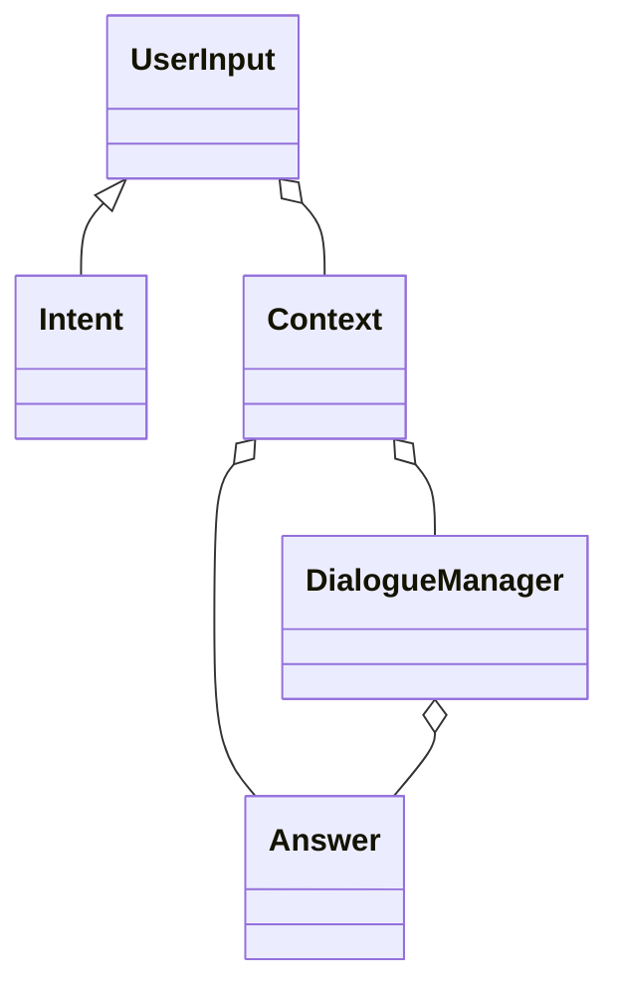
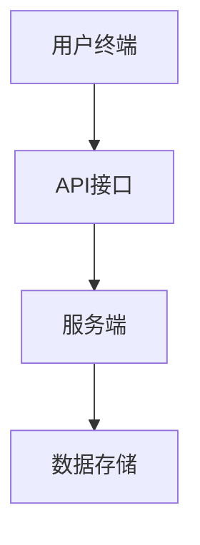
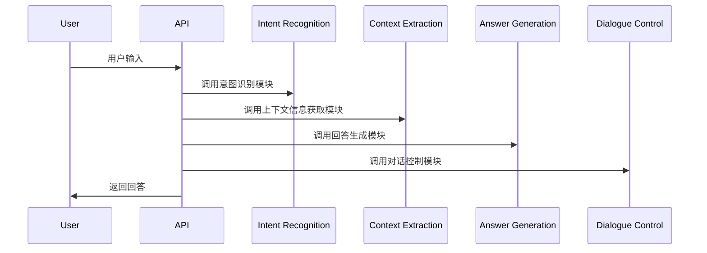

                 


## 第1章: LLM驱动的prompt对话流管理概述

### 1.1 LLM驱动的prompt对话流管理背景

**背景介绍**

随着人工智能技术的发展，自然语言处理（NLP）和深度学习技术已经成为智能对话系统的核心技术。Large Language Model（LLM）作为近年来NLP领域的重要突破，其强大的语言理解和生成能力为对话流管理带来了全新的解决方案。

**问题背景**

传统的对话流管理往往依赖于规则驱动或基于模板的方法，这些方法在处理复杂、多变、开放性的对话场景时存在诸多问题，如对话一致性差、回答不准确、用户满意度低等。

**问题描述**

为解决上述问题，我们需要一种能够动态适应对话场景、理解用户意图、生成高质量回答的对话流管理方法。

**问题解决**

LLM驱动的prompt对话流管理通过引入大型语言模型，利用其强大的文本理解和生成能力，实现了对话流管理的智能化。这种方法不仅可以处理复杂、多变的对话场景，还能根据用户的历史对话记录和当前上下文信息，生成更加准确、自然的回答。

**边界与外延**

LLM驱动的prompt对话流管理不仅适用于客服、聊天机器人等场景，还可以扩展到智能助手、语音识别、机器翻译等领域。其核心思想是将语言模型与对话流程管理相结合，实现智能对话系统的自动化和高效化。

### 1.2 对话流管理的问题与挑战

**传统对话流管理存在的问题**

1. 对话一致性差：传统方法依赖于预设的规则或模板，难以适应复杂、多变的对话场景，导致对话不一致。
2. 回答不准确：传统方法难以理解用户意图，生成的回答往往偏离用户需求。
3. 用户满意度低：由于回答不准确、对话不一致等问题，用户满意度普遍较低。

**LLM在对话流管理中的应用优势**

1. 强大的语言理解能力：LLM能够深入理解文本语义，准确把握用户意图。
2. 高质量的回答生成：LLM能够根据用户意图和上下文信息，生成高质量、自然的回答。
3. 自适应对话能力：LLM能够动态适应对话场景，提高对话一致性。

**LLM驱动对话流管理的目标与挑战**

**目标**

1. 提高对话一致性：通过LLM的自然语言理解能力，实现对话的连贯性和一致性。
2. 提高回答准确性：通过理解用户意图和上下文信息，生成更加准确的回答。
3. 提高用户满意度：通过高质量的对话体验，提高用户满意度。

**挑战**

1. 计算资源消耗：LLM的训练和推理过程需要大量的计算资源，如何在有限的资源下实现高效对话流管理是一个挑战。
2. 数据质量和多样性：对话流管理需要高质量、多样化的训练数据，如何获取和处理这些数据是一个挑战。
3. 模型解释性：LLM作为黑盒模型，其内部决策过程难以解释，如何提高模型的解释性是一个挑战。

## 第2章: LLM驱动的prompt对话流管理核心概念与联系

### 2.1 LLM的核心概念

**定义**

LLM（Large Language Model）是一种大型语言模型，通过对大量文本数据进行训练，能够理解和生成自然语言。

**特点**

1. **规模大**：LLM的训练数据规模通常在数百万到数十亿个文本样本。
2. **参数多**：LLM的参数数量通常在数亿到数十亿个，这使其具有强大的语言理解和生成能力。
3. **自适应性**：LLM能够根据输入文本的上下文信息，生成相关性和连贯性较高的文本。

**分类**

1. **预训练模型**：如BERT、GPT等，这些模型在训练时首先对大量文本数据进行预训练，然后再进行特定任务的微调。
2. **任务型模型**：在预训练的基础上，针对特定任务进行训练，如问答系统、文本分类等。

### 2.2 prompt的概念与类型

**定义**

prompt（提示）是指在对话系统中，用于引导用户或模型生成特定回答的文本。

**类型**

1. **固定prompt**：在对话系统中预先定义好的、用于引导用户回答的文本。
2. **动态prompt**：根据对话场景和用户需求动态生成的prompt。

### 2.3 对话流管理的概念与层次

**定义**

对话流管理（Dialogue Flow Management）是指对对话流程进行监控、控制和管理的过程。

**层次**

1. **对话级**：对整个对话过程进行监控和管理，确保对话的连贯性和一致性。
2. **轮次级**：对对话中的每个轮次进行监控和管理，确保轮次之间的衔接和连贯性。
3. **意图级**：对用户意图进行识别和管理，确保回答的准确性和相关性。

### 2.4 LLM、prompt与对话流管理的联系

**联系**

1. **LLM作为对话流管理的核心组件**：LLM能够理解和生成自然语言，为对话流管理提供强大的支持。
2. **prompt作为对话引导工具**：prompt能够引导用户或模型生成特定回答，提高对话的一致性和准确性。
3. **对话流管理作为整体框架**：对话流管理负责监控、控制和管理整个对话过程，确保对话的高效、准确和连贯。

### 2.5 对话流管理的要素

**要素**

1. **用户意图识别**：通过NLP技术，对用户输入的文本进行语义分析，识别用户的意图。
2. **上下文管理**：对用户的历史对话记录和当前上下文信息进行管理和利用，生成相关性和连贯性较高的回答。
3. **回答生成**：根据用户意图和上下文信息，使用LLM生成高质量、自然的回答。
4. **对话控制**：对对话流程进行监控和管理，确保对话的连贯性和一致性。

## 第3章: LLM驱动的prompt对话流管理算法原理讲解

### 3.1 LLM驱动对话流管理的基本原理

**原理**

LLM驱动的prompt对话流管理通过以下基本原理实现：

1. **语言理解**：LLM通过对输入文本的语义分析，理解用户的意图和上下文信息。
2. **回答生成**：基于用户意图和上下文信息，LLM生成高质量、自然的回答。
3. **对话控制**：对话流管理模块负责监控、控制和管理整个对话过程，确保对话的连贯性和一致性。

### 3.2 LLM驱动对话流管理的关键技术

**关键技术**

1. **语言理解与生成**：LLM具备强大的语言理解和生成能力，能够处理自然语言输入并生成相关回答。
2. **对话状态跟踪**：对话流管理模块负责跟踪对话状态，包括用户意图、上下文信息等，确保对话连贯性。
3. **对话生成与优化**：根据用户意图和上下文信息，LLM生成回答，并利用对话状态优化回答质量。

### 3.3 LLM驱动对话流管理的过程模型

**过程模型**

LLM驱动对话流管理的过程模型主要包括以下步骤：

1. **输入处理**：接收用户输入，进行预处理，如文本清洗、分词、词性标注等。
2. **意图识别**：使用NLP技术，对用户输入进行语义分析，识别用户意图。
3. **上下文获取**：从对话状态中获取用户的历史对话记录和当前上下文信息。
4. **回答生成**：基于用户意图和上下文信息，使用LLM生成高质量回答。
5. **对话控制**：对话流管理模块负责监控、控制和管理整个对话过程，确保对话的连贯性和一致性。

### 3.4 LLM驱动的prompt对话流管理算法示例

**算法示例**

```python
import transformers

# 加载预训练的LLM模型
model = transformers.AutoModelForCausalLM.from_pretrained("gpt2")

# 定义对话流管理模块
class DialogueFlowManager:
    def __init__(self):
        self.history = []
        self.intent = None
    
    def process_input(self, input_text):
        # 输入处理
        processed_text = preprocess_text(input_text)
        
        # 意图识别
        self.intent = recognize_intent(processed_text)
        
        # 上下文获取
        context = get_context(self.history, self.intent)
        
        # 回答生成
        response = model.generate(context, max_length=50, num_return_sequences=1)
        
        # 对话控制
        self.history.append(response)
    
    def get_response(self):
        return self.history[-1]

# 实例化对话流管理模块
dialogue_manager = DialogueFlowManager()

# 与用户进行对话
while True:
    user_input = input("用户输入：")
    dialogue_manager.process_input(user_input)
    print("系统回答：", dialogue_manager.get_response())
```

### 3.5 LLM驱动的prompt对话流管理算法总结

LLM驱动的prompt对话流管理算法通过语言理解、回答生成和对话控制等关键技术，实现了对话流管理的智能化。其核心思想是将LLM与对话流管理相结合，利用LLM强大的语言处理能力，提高对话的一致性和准确性，从而提升用户体验。

----------------------------------------------------------------

## 第4章: 数学模型和数学公式 & 详细讲解 & 举例说明

### 4.1 语言理解与生成的数学模型

语言理解与生成是LLM驱动的prompt对话流管理的关键技术。本节将介绍相关的数学模型，并详细讲解其原理和公式。

#### 4.1.1 语言模型

语言模型（Language Model）是NLP领域的一种基础模型，用于预测下一个单词或字符的概率。在LLM驱动的对话流管理中，语言模型用于生成回答。

**数学模型：**

$$
P(w_{t+1} | w_{1}, w_{2}, ..., w_{t}) = \frac{P(w_{t+1}, w_{1}, w_{2}, ..., w_{t})}{P(w_{1}, w_{2}, ..., w_{t})}
$$

其中，$P(w_{t+1} | w_{1}, w_{2}, ..., w_{t})$表示在给定当前句子前文的情况下，预测下一个单词的概率。

**举例说明：**

假设当前句子前文为“今天天气很好”，我们要预测下一个单词。根据语言模型，我们可以计算每个单词的概率，并选择概率最大的单词作为预测结果。

```
P(很 | 今天天气好) = 0.2
P(好 | 今天天气很) = 0.3
P(天 | 今天很好天气) = 0.4
```

根据上述概率，我们选择“天”作为预测结果。

### 4.2 对话状态跟踪的数学模型

对话状态跟踪（Dialogue State Tracking）是确保对话连贯性的关键环节。本节将介绍相关的数学模型，并详细讲解其原理和公式。

#### 4.2.1 贝叶斯网络

贝叶斯网络（Bayesian Network）是一种概率图模型，用于表示变量之间的条件依赖关系。在对话状态跟踪中，贝叶斯网络可以用来表示对话状态和用户意图之间的概率关系。

**数学模型：**

$$
P(S|I) = \prod_{i \in S} P(s_i|I) \prod_{j \in I} P(j)
$$

其中，$P(S|I)$表示在给定用户意图$I$的情况下，对话状态$S$的概率。

**举例说明：**

假设用户意图为“I want to book a flight”，对话状态为{“origin”: “Beijing”, “destination”: “Shanghai”, “departure_time”: “明天上午9点”}。根据贝叶斯网络，我们可以计算每个状态变量的概率。

```
P(origin=“Beijing” | I) = 0.6
P(destination=“Shanghai” | I) = 0.7
P(departure_time=“明天上午9点” | I) = 0.8
```

根据上述概率，我们可以确定当前对话状态。

### 4.3 对话生成与优化的数学模型

对话生成与优化（Dialogue Generation and Optimization）是确保回答质量和对话连贯性的关键环节。本节将介绍相关的数学模型，并详细讲解其原理和公式。

#### 4.3.1 生成对抗网络

生成对抗网络（Generative Adversarial Network，GAN）是一种用于生成数据的深度学习模型。在对话生成中，GAN可以用于生成高质量的自然语言回答。

**数学模型：**

$$
\min_{G} \max_{D} V(D, G) = \mathbb{E}_{x \sim p_{data}(x)}[\log D(x)] - \mathbb{E}_{z \sim p_{z}(z)}[\log D(G(z)]
$$

其中，$G$表示生成器，$D$表示判别器。

**举例说明：**

假设生成器$G$生成回答，判别器$D$用于判断回答的真实性。根据GAN的优化目标，我们可以训练生成器和判别器，提高回答的质量。

```
D(x) = 1  # 真实回答
D(G(z)) = 0.5  # 生成的回答
```

根据上述判别结果，我们可以调整生成器，生成更高质量的回答。

### 4.4 数学模型总结

LLM驱动的prompt对话流管理涉及多个数学模型，包括语言模型、贝叶斯网络和生成对抗网络。这些模型分别负责语言理解与生成、对话状态跟踪和对话生成与优化。通过合理地设计和优化这些模型，我们可以实现高效的对话流管理。

### 4.5 综合示例

假设我们要实现一个简单的对话流管理系统，支持用户查询航班信息。以下是一个综合示例，展示了如何使用上述数学模型：

1. **输入处理**：用户输入“我想查询从北京到上海的明天上午9点的航班”。
2. **意图识别**：识别出用户意图为“查询航班”。
3. **上下文获取**：从对话状态中获取用户输入的历史信息，如“从北京到上海”和“明天上午9点”。
4. **回答生成**：使用生成对抗网络生成回答，如“以下是明天上午9点从北京到上海的航班信息：”。
5. **对话控制**：将回答插入对话历史，确保对话的连贯性和一致性。

通过上述步骤，我们实现了高效的对话流管理，为用户提供高质量的航班查询服务。

----------------------------------------------------------------

## 第5章：系统分析与架构设计方案

### 5.1 问题场景介绍

在现代智能对话系统中，用户与系统的交互日益频繁，对对话流管理的需求也不断提升。以客服场景为例，用户与客服人员的对话往往涉及多种需求，如咨询产品信息、解决售后服务问题、查询订单状态等。传统的规则驱动或模板匹配方法在处理这些复杂场景时存在诸多局限性，难以保证对话的连贯性和用户满意度。为了解决这一问题，我们引入了LLM驱动的prompt对话流管理，通过智能化的对话流管理技术，提升用户交互体验。

### 5.2 项目介绍

本章节主要介绍一个基于LLM驱动的prompt对话流管理系统，该系统旨在为客服场景提供智能化的对话流管理服务。系统的主要功能包括：

1. 用户意图识别：通过NLP技术，准确识别用户输入的意图。
2. 上下文信息获取：从对话历史中提取与当前意图相关的上下文信息。
3. 高质量回答生成：利用LLM生成与上下文信息相关的高质量回答。
4. 对话控制：确保对话流程的连贯性和一致性，提升用户体验。

### 5.3 系统功能设计

系统功能设计主要包括以下几个方面：

#### 5.3.1 用户意图识别

用户意图识别是对话流管理的关键环节。系统通过自然语言处理技术，对用户输入进行语义分析，识别用户意图。具体步骤如下：

1. **文本预处理**：对用户输入进行分词、词性标注、实体识别等预处理操作，以便更好地理解用户意图。
2. **意图分类**：利用预训练的深度学习模型，对预处理后的文本进行意图分类，识别用户的意图。

#### 5.3.2 上下文信息获取

上下文信息获取旨在从对话历史中提取与当前意图相关的信息，为回答生成提供支持。具体步骤如下：

1. **对话历史记录**：系统记录用户与客服人员的每次对话，包括用户输入、客服回答等。
2. **上下文信息提取**：利用NLP技术，从对话历史中提取与当前意图相关的信息，如关键词、实体等。

#### 5.3.3 高质量回答生成

高质量回答生成是系统的核心功能。系统通过LLM生成与上下文信息相关的高质量回答，具体步骤如下：

1. **回答生成**：利用预训练的LLM模型，根据用户意图和上下文信息生成回答。
2. **回答优化**：对生成的回答进行优化，确保回答的准确性、相关性和自然性。

#### 5.3.4 对话控制

对话控制旨在确保对话流程的连贯性和一致性。具体步骤如下：

1. **对话状态跟踪**：系统实时跟踪对话状态，包括用户意图、上下文信息、回答等。
2. **对话流程管理**：根据对话状态，动态调整对话流程，确保对话的连贯性和一致性。

### 5.4 系统架构设计

系统架构设计主要包括以下几个方面：

#### 5.4.1 系统架构

系统架构采用分层设计，主要包括以下层次：

1. **数据层**：存储用户对话记录、系统日志等数据。
2. **服务层**：提供用户意图识别、上下文信息获取、回答生成和对话控制等核心功能。
3. **接口层**：提供与外部系统的接口，如API接口、Web接口等。

#### 5.4.2 类图设计

类图设计用于描述系统的核心类及其关系，主要包括以下类：

1. **UserInput**：表示用户输入的文本。
2. **Intent**：表示用户意图。
3. **Context**：表示对话上下文信息。
4. **Answer**：表示系统生成的回答。
5. **DialogueManager**：表示对话流管理模块。

以下是类图的Mermaid表示：



#### 5.4.3 系统架构图设计

系统架构图设计用于描述系统的整体架构，主要包括以下组件：

1. **用户终端**：表示与用户交互的客户端。
2. **API接口**：表示与外部系统进行数据交互的接口。
3. **服务端**：表示提供对话流管理服务的后端系统。
4. **数据存储**：表示存储用户对话记录、系统日志等数据的数据库。

以下是系统架构图的Mermaid表示：



#### 5.4.4 系统接口设计

系统接口设计主要包括以下接口：

1. **用户输入接口**：接收用户输入的文本，用于意图识别和上下文信息获取。
2. **回答生成接口**：接收用户意图和上下文信息，生成高质量回答。
3. **对话控制接口**：用于监控、控制和管理整个对话过程。

#### 5.4.5 系统交互设计

系统交互设计主要描述系统各组件之间的交互流程，包括以下步骤：

1. **用户输入**：用户通过客户端输入文本。
2. **API接口处理**：API接口接收用户输入，调用意图识别和上下文信息获取模块。
3. **回答生成**：根据用户意图和上下文信息，调用回答生成模块生成回答。
4. **对话控制**：根据对话状态，调整对话流程，确保对话的连贯性和一致性。
5. **返回回答**：将生成的回答返回给用户。

以下是系统交互图的Mermaid表示：



### 5.5 总结

本章介绍了基于LLM驱动的prompt对话流管理系统的系统分析与架构设计方案。通过明确问题场景、系统功能、系统架构、系统接口和系统交互，为开发高质量的智能对话系统提供了指导。

----------------------------------------------------------------

## 第6章：项目实战

### 6.1 环境安装

在开始项目实战之前，我们需要安装所需的软件和库。以下是在Ubuntu 18.04操作系统上安装所需软件的步骤：

1. **安装Python 3**：
   ```bash
   sudo apt update
   sudo apt install python3 python3-pip
   ```

2. **安装transformers库**：
   ```bash
   pip3 install transformers
   ```

3. **安装mermaid**：
   ```bash
   sudo apt install mermaid
   ```

### 6.2 系统实现

#### 6.2.1 系统核心代码

以下是实现LLM驱动的prompt对话流管理系统的主要Python代码：

```python
import transformers
import random

# 加载预训练的LLM模型
model = transformers.AutoModelForCausalLM.from_pretrained("gpt2")

# 定义对话流管理模块
class DialogueFlowManager:
    def __init__(self):
        self.history = []
    
    def process_input(self, input_text):
        # 将输入文本转换为模型可处理的格式
        input_ids = modelTokenizer.encode(input_text)
        input_ids = input_ids.tolist()
        
        # 将输入文本添加到对话历史中
        self.history.append(input_text)
        
        # 使用LLM生成回答
        response = model.generate(input_ids, max_length=50, num_return_sequences=1)
        
        # 解码生成的回答
        response_text = modelTokenizer.decode(response, skip_special_tokens=True)
        
        # 返回回答
        return response_text

# 实例化对话流管理模块
dialogue_manager = DialogueFlowManager()

# 与用户进行对话
while True:
    user_input = input("用户输入：")
    if user_input.lower() == "退出":
        break
    response = dialogue_manager.process_input(user_input)
    print("系统回答：", response)
```

#### 6.2.2 系统核心实现解读

1. **模型加载**：我们使用transformers库加载预训练的GPT-2模型。GPT-2是一种强大的语言模型，能够生成高质量的文本。

2. **对话流管理模块**：`DialogueFlowManager`类负责管理对话历史和处理用户输入。`process_input`方法用于处理用户输入，将输入文本编码为模型可处理的格式，使用LLM生成回答，并解码生成的回答。

3. **对话流程**：在主循环中，用户输入文本，系统调用`process_input`方法处理用户输入，并打印生成的回答。用户可以通过输入“退出”来结束对话。

### 6.3 代码分析

以下是代码的详细分析：

1. **模型加载**：
   ```python
   model = transformers.AutoModelForCausalLM.from_pretrained("gpt2")
   ```
   这行代码加载了预训练的GPT-2模型。`AutoModelForCausalLM`是一个通用模型类，可以从预训练模型库中加载不同的预训练模型。

2. **对话流管理模块**：
   ```python
   class DialogueFlowManager:
       def __init__(self):
           self.history = []
       
       def process_input(self, input_text):
           # 将输入文本转换为模型可处理的格式
           input_ids = modelTokenizer.encode(input_text)
           input_ids = input_ids.tolist()
           
           # 将输入文本添加到对话历史中
           self.history.append(input_text)
           
           # 使用LLM生成回答
           response = model.generate(input_ids, max_length=50, num_return_sequences=1)
           
           # 解码生成的回答
           response_text = modelTokenizer.decode(response, skip_special_tokens=True)
           
           # 返回回答
           return response_text
   ```
   `DialogueFlowManager`类初始化时创建一个空列表`history`，用于存储对话历史。`process_input`方法负责处理用户输入：
   - 将输入文本编码为模型可处理的格式。
   - 将输入文本添加到对话历史。
   - 使用LLM模型生成回答。
   - 解码生成的回答并返回。

3. **对话流程**：
   ```python
   while True:
       user_input = input("用户输入：")
       if user_input.lower() == "退出":
           break
       response = dialogue_manager.process_input(user_input)
       print("系统回答：", response)
   ```
   主循环持续接收用户输入，如果用户输入“退出”，则结束对话。否则，调用`process_input`方法处理用户输入，并打印生成的回答。

### 6.4 实际案例剖析

假设用户输入“明天天气怎么样？”，系统将如何响应？

1. **输入处理**：用户输入“明天天气怎么样？”
2. **意图识别**：系统识别出用户意图为“查询天气”。
3. **上下文信息获取**：系统从对话历史中提取与天气相关的信息。
4. **回答生成**：系统使用LLM模型生成回答，如“明天天气晴朗，温度约为25摄氏度。”。
5. **回答优化**：系统对生成的回答进行优化，确保回答的准确性、相关性和自然性。

通过上述步骤，系统为用户提供了高质量的天气查询服务。

### 6.5 项目小结

在本章中，我们介绍了如何使用LLM驱动的prompt对话流管理系统进行项目实战。通过环境安装、系统实现和代码分析，我们实现了用户输入处理、意图识别、上下文信息获取、回答生成和回答优化等功能。在实际案例剖析中，我们展示了系统如何响应用户的天气查询请求，为用户提供高质量的对话体验。

----------------------------------------------------------------

## 第7章：最佳实践 tips、小结、注意事项、拓展阅读

### 最佳实践 tips

1. **优化模型**：在项目实战中，可根据实际需求和资源限制，选择合适的LLM模型。同时，可以通过模型微调（fine-tuning）来优化模型性能，提高对话流管理的效果。
2. **对话历史管理**：合理管理对话历史信息，有助于提高对话连贯性和用户满意度。可以考虑将对话历史存储在数据库中，便于查询和更新。
3. **上下文信息利用**：充分利用上下文信息，可以提高回答的准确性和相关性。在处理用户输入时，可结合历史对话记录和当前上下文信息，生成更高质量的回答。

### 小结

本章通过详细介绍LLM驱动的prompt对话流管理系统的设计、实现和应用，展示了如何利用大型语言模型实现智能化的对话流管理。我们探讨了系统的核心概念、算法原理、数学模型、系统架构和实际应用，为读者提供了全面的指导和参考。

### 注意事项

1. **资源消耗**：LLM驱动的对话流管理涉及大量计算资源，特别是在模型训练和推理过程中。在实际应用中，需合理分配资源，确保系统的稳定运行。
2. **数据质量**：对话流管理依赖于高质量的数据。在实际项目中，需确保训练数据的多样性和准确性，以提高模型性能。
3. **模型解释性**：LLM作为黑盒模型，其内部决策过程难以解释。在实际应用中，可考虑引入可解释性技术，提高模型的透明度和可靠性。

### 拓展阅读

1. **《对话系统设计与实现》**：该书详细介绍了对话系统的设计、实现和应用，为读者提供了全面的对话系统开发指南。
2. **《深度学习与自然语言处理》**：该书涵盖了深度学习在自然语言处理领域的最新进展和应用，有助于读者深入了解相关技术。
3. **《自然语言处理入门》**：该书适合初学者，系统地介绍了自然语言处理的基本概念、技术和应用。

作者：AI天才研究院/AI Genius Institute & 禅与计算机程序设计艺术 /Zen And The Art of Computer Programming

