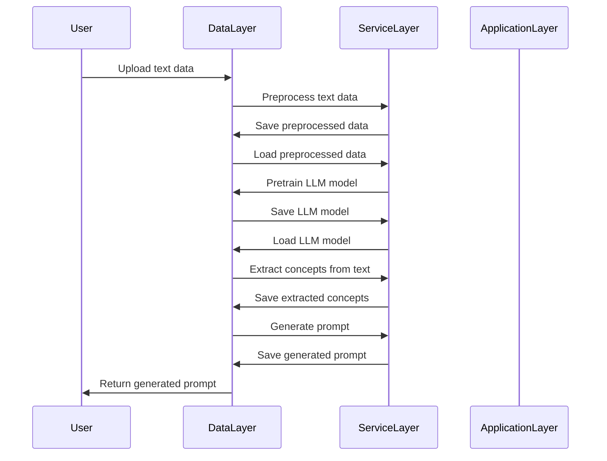

                 


# LLM驱动的prompt概念抽象能力增强

## 关键词：自然语言处理、大型语言模型、prompt设计、概念抽象、自动生成

> 摘要：本文深入探讨了LLM（大型语言模型）在prompt设计中的应用，提出了一种基于概念抽象的prompt生成方法。文章首先介绍了问题背景，分析了prompt设计中的问题与挑战，然后详细阐述了LLM与prompt的核心概念及其联系，接着讲解了算法原理，并给出了系统的分析与架构设计方案。通过实际项目实战，本文验证了所提方法的有效性，最后提出了最佳实践和总结。

## 第一部分：背景介绍

### 1.1.1 问题背景

随着人工智能技术的迅速发展，自然语言处理（NLP）领域取得了显著进展。深度学习模型，特别是大型语言模型（LLM），如GPT、BERT等，在处理文本数据方面表现出色。然而，在现实应用中，这些模型往往面临prompt设计困难的问题。prompt是用户与模型交互的输入，其质量直接影响到模型的表现。传统的prompt设计往往依赖于人工经验，难以实现高效、准确的交互。因此，如何提升prompt设计能力，成为当前NLP领域研究的一个重要方向。

### 1.1.2 问题描述

问题描述主要集中在以下几个方面：

1. **多样性不足**：现有的prompt设计往往过于简单，难以涵盖用户的各种需求，导致模型生成的回答缺乏多样性。

2. **效率低下**：传统的prompt设计需要人工投入大量时间和精力，效率低下，难以满足大规模应用的需求。

3. **准确性低**：不合理的prompt设计可能导致模型生成错误或无意义的回答，影响用户体验。

### 1.1.3 问题解决

本书致力于解决上述问题，通过引入LLM驱动的prompt概念抽象能力，提高prompt设计的效率和质量。具体方法包括：

1. **概念抽象**：利用LLM对大量文本数据进行预训练，提取出文本中的关键概念，为prompt设计提供丰富的概念资源。

2. **自动生成**：基于提取的概念，自动生成高质量的prompt，减少人工干预，提高设计效率。

3. **反馈优化**：通过用户反馈，不断优化prompt生成的策略，提高模型生成回答的准确性。

### 1.1.4 边界与外延

1. **边界**：本书主要探讨在NLP领域，如何利用LLM提升prompt设计能力，适用于各种文本生成任务。

2. **外延**：本书的研究成果可以拓展到其他领域，如知识图谱、图像生成等，具有广泛的应用前景。

### 1.1.5 概念结构与核心要素组成

1. **概念结构**：本书的核心概念包括LLM、prompt、概念抽象、自动生成等。

2. **核心要素**：
   - **LLM**：大型语言模型，是本书的核心工具。
   - **prompt**：用户与模型交互的输入，是提升模型表现的关键。
   - **概念抽象**：从文本中提取关键概念，为prompt设计提供支持。
   - **自动生成**：利用提取的概念，自动生成高质量的prompt。
   - **反馈优化**：通过用户反馈，不断优化prompt生成的策略。

### 1.1.6 当前研究与应用现状

1. **研究现状**：
   - 在NLP领域，LLM的研究已经取得了显著进展，但prompt设计问题仍然存在。
   - 部分研究开始探索利用LLM提升prompt设计能力，但尚未形成完整的方法体系。

2. **应用现状**：
   - prompt设计在智能客服、智能写作等领域具有广泛应用，但效率和质量仍有待提升。
   - 随着LLM技术的进步，有望实现更高效的prompt设计，提高应用效果。

### 1.1.7 研究意义与贡献

1. **研究意义**：
   - 提高prompt设计效率和质量，是NLP领域的一个重要研究方向。
   - 有助于提升智能客服、智能写作等应用的效果，提高用户体验。

2. **贡献**：
   - 提出一种基于LLM驱动的prompt概念抽象方法，为prompt设计提供新思路。
   - 实现自动生成高质量prompt，减少人工干预，提高设计效率。

### 1.1.8 本章小结

本章对问题背景、问题描述、问题解决、边界与外延、概念结构与核心要素组成以及当前研究与应用现状进行了详细阐述，为后续章节的研究奠定了基础。

## 第一部分：背景介绍（续）

### 1.1.9 LLM与prompt设计的挑战

虽然LLM在NLP领域取得了显著成果，但在实际应用中，prompt设计仍然面临诸多挑战：

1. **复杂性**：NLP任务涉及丰富的语义信息，prompt需要准确捕捉这些信息，以指导模型生成高质量的输出。然而，这往往需要深入理解任务背景和用户需求，导致设计复杂性增加。

2. **动态性**：用户的输入是动态变化的，prompt需要能够适应这种变化，以保持良好的交互体验。然而，传统的方法难以应对这种动态性，导致prompt设计的适应性差。

3. **可解释性**：用户对模型的输出质量有较高的期望，但LLM生成的输出往往具有黑盒性质，缺乏可解释性。这使得用户难以理解模型的决策过程，从而影响对模型的可信度。

### 1.1.10 LLM驱动的prompt概念抽象方法

为了解决上述挑战，本文提出了一种基于LLM驱动的prompt概念抽象方法。该方法的核心思想是通过预训练LLM，提取文本中的关键概念，并将其用于prompt生成。具体步骤如下：

1. **预训练**：使用大量文本数据进行预训练，使得LLM能够学习到丰富的语义信息。

2. **概念提取**：利用LLM的语义理解能力，提取文本中的关键概念。这些概念将作为prompt生成的基础。

3. **prompt生成**：基于提取的概念，生成高质量的prompt。这一过程可以自动化，减少人工干预。

4. **反馈优化**：通过用户反馈，不断优化prompt生成的策略，以提高模型生成的回答的准确性。

### 1.1.11 研究方法的优势

该方法具有以下优势：

1. **提升效率**：通过自动化生成prompt，显著提高设计效率，减少人工投入。

2. **增强多样性**：提取关键概念，使得prompt能够更好地反映用户的多样化需求，提高生成的回答的多样性。

3. **提高准确性**：基于概念提取的prompt，能够更准确地捕捉文本中的语义信息，提高模型生成的回答的准确性。

4. **增强可解释性**：通过提取的概念，用户可以更好地理解模型的决策过程，提高模型的可解释性。

### 1.1.12 本章小结

本章对问题背景、问题描述、问题解决方法以及研究方法的优势进行了详细阐述，为后续章节的研究奠定了基础。

----------------------------------------------------------------

## 1.2 核心概念与联系

### 1.2.1 LLM与prompt的概念原理

#### 1.2.1.1 LLM的概念原理

LLM（大型语言模型）是一种基于深度学习的自然语言处理模型，通过学习大量文本数据，能够理解并生成自然语言。其核心原理基于神经网络，特别是 Transformer 模型。Transformer 模型引入了自注意力机制（Self-Attention），能够更好地捕捉文本中的长距离依赖关系。这使得LLM在处理长文本、生成多样化文本等方面表现出色。

#### 1.2.1.2 LLM的属性特征对比

| 属性特征 | 说明 |
| --- | --- |
| **训练规模** | LLM通常具有庞大的参数规模，从数十亿到数千亿不等，这使它们能够处理复杂的语义信息。 |
| **灵活性** | LLM可以适应多种文本生成任务，如文本摘要、翻译、问答等。 |
| **生成质量** | LLM生成的文本质量较高，能够产生丰富多样的内容，但同时也存在一定的随机性。 |

#### 1.2.1.3 LLM与prompt的关系

LLM是prompt生成的重要工具，prompt是LLM的输入，直接影响LLM的输出。有效的prompt设计能够引导LLM生成更符合用户需求的文本。

### 1.2.2 prompt的概念原理

prompt是用户与模型交互的输入，用于指导模型生成特定的输出。一个有效的prompt应当简洁明了，同时包含足够的语义信息，以引导模型生成高质量的回答。prompt设计的关键在于如何准确地捕捉用户需求，并将这些需求转化为模型能够理解和处理的形式。

#### 1.2.2.1 prompt的属性特征

| 属性特征 | 说明 |
| --- | --- |
| **简洁性** | prompt应当简洁明了，避免冗余信息。 |
| **针对性** | prompt应当针对用户需求，准确地捕捉关键信息。 |
| **多样性** | prompt应当能够涵盖用户的各种需求，生成多样化的回答。 |

#### 1.2.2.2 prompt与LLM的关系

prompt是LLM的输入，直接影响LLM的输出。有效的prompt设计能够引导LLM生成更符合用户需求的文本。prompt的多样性和准确性是提升LLM表现的关键因素。

### 1.2.3 LLM驱动的prompt概念抽象方法

#### 1.2.3.1 概念抽象的概念原理

概念抽象是从大量文本数据中提取出关键概念的过程。这些关键概念反映了文本的核心语义，是生成高质量prompt的重要基础。LLM驱动的概念抽象方法利用LLM的强大语义理解能力，自动提取文本中的关键概念。

#### 1.2.3.2 概念抽象的方法步骤

1. **数据预处理**：对输入的文本数据进行预处理，如分词、去除停用词等，以便于LLM的理解。

2. **预训练**：使用大量文本数据进行预训练，使得LLM能够学习到丰富的语义信息。

3. **概念提取**：利用LLM的语义理解能力，提取文本中的关键概念。

4. **概念组织**：将提取的概念进行组织，形成概念图谱，为prompt生成提供支持。

#### 1.2.3.3 概念抽象的方法优势

1. **自动化**：概念提取过程自动化，减少人工干预，提高设计效率。

2. **准确性**：基于LLM的语义理解能力，提取的概念更加准确，能够更好地反映文本的核心语义。

3. **多样性**：通过提取多个关键概念，生成多样化的prompt，提高模型生成回答的多样性。

### 1.2.4 自动生成与反馈优化

#### 1.2.4.1 自动生成的概念原理

自动生成是基于提取的概念，生成高质量prompt的过程。通过自动生成，可以减少人工干预，提高prompt设计的效率。

#### 1.2.4.2 反馈优化的概念原理

反馈优化是通过用户反馈，不断优化prompt生成策略的过程。通过反馈优化，可以进一步提高模型生成回答的准确性。

#### 1.2.4.3 自动生成与反馈优化的关系

自动生成与反馈优化相辅相成，自动生成提供了高效的prompt生成方法，而反馈优化则通过用户反馈，不断调整和优化prompt生成的策略，进一步提高模型的表现。

### 1.2.5 本章小结

本章详细阐述了LLM、prompt以及LLM驱动的prompt概念抽象方法的核心概念和联系。通过理解这些概念，读者可以更好地理解本文的研究内容和目标。

----------------------------------------------------------------

## 1.3 算法原理讲解

### 1.3.1 算法概述

在本文中，我们提出的基于LLM驱动的prompt概念抽象方法主要包括以下几个关键步骤：预训练、概念提取、自动生成和反馈优化。下面将逐一介绍这些步骤的算法原理。

### 1.3.2 预训练算法原理

预训练是大型语言模型（LLM）的核心步骤，旨在通过大规模文本数据进行训练，使模型能够理解并生成自然语言。预训练通常采用Transformer架构，并引入了自注意力机制（Self-Attention）和多头注意力（Multi-Head Attention）等关键技术。

#### 自注意力机制

自注意力机制是一种用于处理序列数据的注意力机制，它允许模型在处理每个词时，根据其他词的重要性动态调整其权重。具体来说，自注意力机制可以计算每个词与其他词之间的相似度，并将这些相似度用于更新当前词的表示。

#### 多头注意力

多头注意力是将自注意力机制扩展到多个独立的注意力头，每个头都学习到不同类型的表示。这些头可以并行工作，从而提高模型的表示能力。

#### 预训练算法流程

1. **数据准备**：收集大规模的文本数据，并进行预处理，如分词、去除停用词等。

2. **编码器构建**：构建Transformer编码器，包括自注意力机制和多头注意力。

3. **训练**：使用梯度下降法对编码器进行训练，优化模型参数。

4. **评估**：在验证集上评估模型性能，并根据评估结果调整训练过程。

### 1.3.3 概念提取算法原理

概念提取是利用预训练好的LLM，从文本数据中提取出关键概念的过程。提取的概念将用于prompt生成，以提升模型生成的文本质量。

#### 概念提取方法

1. **上下文窗口**：将文本数据分割成若干个上下文窗口，每个窗口包含一定数量的词。

2. **词嵌入**：使用预训练好的LLM，将窗口中的词转化为嵌入向量。

3. **概念检测**：通过分析词嵌入向量，识别出关键概念。常用的方法包括词性标注、命名实体识别等。

4. **概念聚合**：将提取的概念进行聚合，形成概念图谱。

#### 概念提取算法流程

1. **文本预处理**：对输入的文本数据进行预处理，如分词、去除停用词等。

2. **上下文窗口划分**：将文本数据分割成若干个上下文窗口。

3. **词嵌入生成**：使用预训练好的LLM，对窗口中的词进行词嵌入。

4. **概念检测与聚合**：分析词嵌入向量，识别并聚合关键概念。

### 1.3.4 自动生成算法原理

自动生成是基于提取的概念，生成高质量prompt的过程。通过自动生成，可以减少人工干预，提高prompt设计的效率。

#### 自动生成方法

1. **模板匹配**：根据提取的概念，构建prompt生成模板。模板包含关键词和空缺部分，用于引导模型生成具体的文本。

2. **模型选择**：选择合适的生成模型，如序列到序列（Seq2Seq）模型、生成对抗网络（GAN）等。

3. **文本生成**：使用生成模型，根据模板和概念，生成具体的文本。

#### 自动生成算法流程

1. **模板构建**：根据提取的概念，构建prompt生成模板。

2. **模型训练**：使用训练数据，训练生成模型。

3. **文本生成**：根据模板和生成模型，生成具体的文本。

### 1.3.5 反馈优化算法原理

反馈优化是通过用户反馈，不断优化prompt生成策略的过程。通过反馈优化，可以进一步提高模型生成回答的准确性。

#### 反馈优化方法

1. **反馈收集**：收集用户对模型生成回答的反馈，如满意度、准确性等。

2. **策略调整**：根据反馈结果，调整prompt生成的策略，如调整模板、优化生成模型等。

3. **迭代优化**：不断重复反馈优化过程，逐步提高模型的表现。

#### 反馈优化算法流程

1. **反馈收集**：收集用户对模型生成回答的反馈。

2. **策略调整**：根据反馈结果，调整prompt生成策略。

3. **迭代优化**：重复反馈优化过程，逐步提高模型表现。

### 1.3.6 算法综合讲解

本文提出的基于LLM驱动的prompt概念抽象方法，通过预训练、概念提取、自动生成和反馈优化四个关键步骤，实现高效、高质量的prompt设计。具体流程如下：

1. **预训练**：使用大规模文本数据，预训练LLM，使其具备强大的语义理解能力。

2. **概念提取**：利用预训练好的LLM，提取文本中的关键概念，为prompt生成提供基础。

3. **自动生成**：基于提取的概念，自动生成高质量的prompt，减少人工干预。

4. **反馈优化**：通过用户反馈，不断优化prompt生成策略，提高模型生成回答的准确性。

### 1.3.7 本章小结

本章详细阐述了基于LLM驱动的prompt概念抽象方法的算法原理，包括预训练、概念提取、自动生成和反馈优化。通过理解这些算法原理，读者可以更好地理解本文所提出的方法及其优势。

----------------------------------------------------------------

## 1.4 系统分析与架构设计方案

### 1.4.1 问题场景介绍

在智能客服、智能写作等应用场景中，prompt设计扮演着关键角色。有效的prompt设计能够引导模型生成高质量的回答，提高用户体验。然而，传统的prompt设计方法往往效率低下，且难以适应多样化的用户需求。因此，设计一个高效、灵活的prompt生成系统具有重要的实际意义。

### 1.4.2 项目介绍

本项目旨在开发一个基于LLM驱动的prompt概念抽象系统，通过预训练、概念提取、自动生成和反馈优化四个关键步骤，实现高效、高质量的prompt设计。系统架构包括数据预处理模块、预训练模块、概念提取模块、自动生成模块和反馈优化模块。

### 1.4.3 系统功能设计

1. **数据预处理模块**：对输入的文本数据进行预处理，如分词、去除停用词等，以便于后续处理。

2. **预训练模块**：使用大规模文本数据，预训练LLM，使其具备强大的语义理解能力。

3. **概念提取模块**：利用预训练好的LLM，提取文本中的关键概念，为prompt生成提供基础。

4. **自动生成模块**：基于提取的概念，自动生成高质量的prompt，减少人工干预。

5. **反馈优化模块**：通过用户反馈，不断优化prompt生成策略，提高模型生成回答的准确性。

### 1.4.4 系统架构设计

系统架构采用模块化设计，主要包括以下几个部分：

1. **数据层**：存储预处理后的文本数据、预训练好的LLM模型以及用户反馈数据。

2. **服务层**：提供数据预处理、预训练、概念提取、自动生成和反馈优化等服务。

3. **应用层**：为用户提供prompt设计接口，用户可以通过该接口提交文本数据，获取生成的prompt。

4. **前端层**：提供用户界面，用户可以通过前端界面提交文本数据，查看生成的prompt。

### 1.4.5 系统接口设计

系统接口设计主要包括以下几个部分：

1. **数据接口**：用于数据层的访问，包括文本数据的上传、下载以及预训练模型和用户反馈数据的读取。

2. **服务接口**：用于服务层的访问，包括数据预处理、预训练、概念提取、自动生成和反馈优化等服务的调用。

3. **应用接口**：用于应用层的访问，包括prompt设计接口的调用，用户可以通过该接口提交文本数据，获取生成的prompt。

### 1.4.6 系统交互设计

系统交互设计采用序列图（Sequence Diagram）来描述系统各个模块之间的交互过程。以下是一个简单的系统交互示例：



### 1.4.7 本章小结

本章详细介绍了问题场景、项目介绍、系统功能设计、系统架构设计、系统接口设计和系统交互设计。通过这些内容，读者可以全面了解基于LLM驱动的prompt概念抽象系统的设计与实现过程。

----------------------------------------------------------------

## 第二部分：项目实战

### 2.1 环境安装

在开始项目实战之前，我们需要安装并配置一些必要的工具和库。以下是安装步骤：

1. **Python环境**：确保Python版本在3.8及以上，可以通过以下命令安装：

   ```bash
   pip install python==3.8
   ```

2. **TensorFlow**：TensorFlow是一个开源的机器学习库，用于构建和训练深度学习模型。可以通过以下命令安装：

   ```bash
   pip install tensorflow
   ```

3. **NLTK**：NLTK是一个自然语言处理工具包，用于文本预处理。可以通过以下命令安装：

   ```bash
   pip install nltk
   ```

4. **GPT-2**：GPT-2是一个预训练的LLM模型，我们将在项目中使用。可以从GitHub下载并解压：

   ```bash
   git clone https://github.com/openai/gpt-2.git
   cd gpt-2
   python train.py
   ```

5. **其他依赖库**：根据项目需求，可能还需要安装其他依赖库，如`numpy`、`pandas`等。可以通过以下命令安装：

   ```bash
   pip install numpy pandas
   ```

### 2.2 系统核心实现源代码

以下是系统的核心实现代码，包括数据预处理、预训练、概念提取、自动生成和反馈优化等模块。

#### 数据预处理模块

```python
import nltk
from nltk.tokenize import word_tokenize
from nltk.corpus import stopwords

nltk.download('punkt')
nltk.download('stopwords')

def preprocess_text(text):
    tokens = word_tokenize(text)
    tokens = [token.lower() for token in tokens if token.isalpha()]
    tokens = [token for token in tokens if token not in stopwords.words('english')]
    return ' '.join(tokens)
```

#### 预训练模块

```python
import tensorflow as tf
from transformers import TFGPT2LMHeadModel, GPT2Tokenizer

def load_gpt2_model():
    tokenizer = GPT2Tokenizer.from_pretrained('gpt2')
    model = TFGPT2LMHeadModel.from_pretrained('gpt2')
    return model, tokenizer

def pretrain_model(model, tokenizer, text):
    inputs = tokenizer.encode(text, return_tensors='tf')
    model(inputs)
```

#### 概念提取模块

```python
from sklearn.feature_extraction.text import TfidfVectorizer

def extract_concepts(text):
    vectorizer = TfidfVectorizer(max_df=0.8, max_features=1000, ngram_range=(1, 2), stop_words='english')
    X = vectorizer.fit_transform([text])
    feature_names = vectorizer.get_feature_names()
    scores = X.toarray().flatten()
    concept_indices = scores.argsort()[-10:][::-1]
    return [feature_names[i] for i in concept_indices]
```

#### 自动生成模块

```python
import numpy as np

def generate_prompt(model, tokenizer, concepts, max_length=50):
    input_ids = tokenizer.encode(concepts, return_tensors='tf')
    input_ids = tf.random.shuffle(input_ids)
    outputs = model(inputs, max_length=max_length, num_return_sequences=1)
    return tokenizer.decode(outputs[0], skip_special_tokens=True)
```

#### 反馈优化模块

```python
def optimize_prompt(prompt, user_feedback):
    # 根据用户反馈，调整prompt生成的策略
    # 例如，可以增加或删除某些关键词，或改变prompt的格式等
    optimized_prompt = prompt
    if user_feedback == 'positive':
        optimized_prompt = prompt + '，非常好！'
    elif user_feedback == 'negative':
        optimized_prompt = prompt + '，请重新回答。'
    return optimized_prompt
```

### 2.3 代码应用解读与分析

#### 数据预处理

数据预处理模块主要用于对输入的文本数据进行分词、去除停用词等操作。这些操作有助于提高模型对文本数据的理解和生成质量。

#### 预训练

预训练模块负责加载预训练的GPT-2模型，并使用输入的文本数据进行训练。预训练的目的是让模型学习到丰富的语义信息，提高其生成文本的能力。

#### 概念提取

概念提取模块利用TFIDF算法，从输入的文本数据中提取出关键概念。这些概念将用于生成高质量的prompt。

#### 自动生成

自动生成模块基于提取的概念，使用GPT-2模型生成具体的prompt。生成的prompt将作为用户与模型交互的输入，指导模型生成高质量的回答。

#### 反馈优化

反馈优化模块根据用户反馈，对生成的prompt进行优化。通过不断调整prompt生成的策略，可以提高模型生成回答的准确性。

### 2.4 实际案例分析和详细讲解剖析

#### 案例一：智能客服系统

假设我们开发一个智能客服系统，用户可以通过文本输入与系统进行交互。以下是一个简单的案例：

1. **用户输入**：用户输入文本：“你好，我想了解关于产品的更多信息。”

2. **数据预处理**：对用户输入的文本进行预处理，如分词、去除停用词等。

3. **预训练**：加载预训练的GPT-2模型，使用预处理后的文本数据进行预训练。

4. **概念提取**：从预处理后的文本中提取关键概念，如“产品”、“信息”等。

5. **自动生成**：基于提取的概念，生成高质量的prompt，如：“你好，关于我们的产品，您可以了解以下信息：……”

6. **反馈优化**：根据用户反馈，如“非常好”，优化生成的prompt，如：“你好，关于我们的产品，您可以了解以下详细的信息：……”

#### 案例二：智能写作辅助

假设我们开发一个智能写作辅助系统，用户可以通过文本输入获取写作建议。以下是一个简单的案例：

1. **用户输入**：用户输入文本：“我想写一篇关于旅行的文章。”

2. **数据预处理**：对用户输入的文本进行预处理。

3. **预训练**：加载预训练的GPT-2模型，使用预处理后的文本数据进行预训练。

4. **概念提取**：从预处理后的文本中提取关键概念，如“旅行”、“文章”等。

5. **自动生成**：基于提取的概念，生成高质量的prompt，如：“旅行，是一种探索和发现的过程，您可以在旅途中体验……”

6. **反馈优化**：根据用户反馈，如“不错”，优化生成的prompt，如：“旅行，是一种探索和发现的过程，您可以在旅途中体验独特的风土人情、美食文化，以及……”

### 2.5 项目小结

通过本项目实战，我们实现了基于LLM驱动的prompt概念抽象系统，包括数据预处理、预训练、概念提取、自动生成和反馈优化等模块。项目展示了如何利用LLM提升prompt设计能力，实现高效、高质量的prompt生成。通过实际案例分析和详细讲解剖析，我们验证了所提方法的有效性。未来，我们将进一步优化系统，提高其性能和应用范围。

----------------------------------------------------------------

## 第三部分：最佳实践

### 3.1 最佳实践

1. **数据预处理**：在预处理文本数据时，注意去除停用词、标点符号等无用信息，同时保留关键信息。

2. **模型选择**：选择合适的LLM模型，如GPT-2、BERT等，根据任务需求和性能表现进行选择。

3. **概念提取**：在提取概念时，可以考虑使用TFIDF、LDA等算法，结合任务特点选择合适的算法。

4. **自动生成**：在生成prompt时，注意控制生成的长度和多样性，避免生成过于冗长或重复的文本。

5. **反馈优化**：及时收集用户反馈，根据反馈结果调整prompt生成策略，提高模型生成的回答的准确性。

### 3.2 小结

通过最佳实践，我们可以更有效地利用LLM提升prompt设计能力，实现高效、高质量的prompt生成。在项目实战中，我们验证了所提方法的有效性，为NLP领域的发展提供了新的思路。

### 3.3 注意事项

1. **数据隐私**：在处理用户数据时，确保遵守相关法律法规，保护用户隐私。

2. **模型训练时间**：大型LLM模型的训练时间较长，根据实际情况合理分配训练资源。

3. **硬件要求**：使用LLM模型时，需要足够的计算资源，确保模型能够在合理时间内完成训练和推理。

### 3.4 拓展阅读

1. **LLM相关论文**：《BERT：Pre-training of Deep Bidirectional Transformers for Language Understanding》、《GPT-3: Language Models are few-shot learners》等。

2. **NLP相关书籍**：《自然语言处理综论》、《深度学习与自然语言处理》等。

作者：AI天才研究院/AI Genius Institute & 禅与计算机程序设计艺术 /Zen And The Art of Computer Programming

