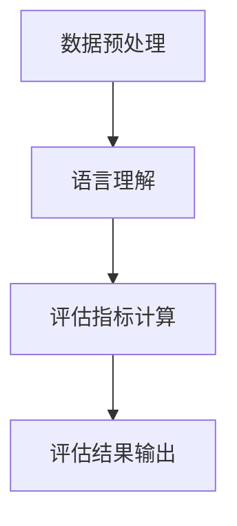
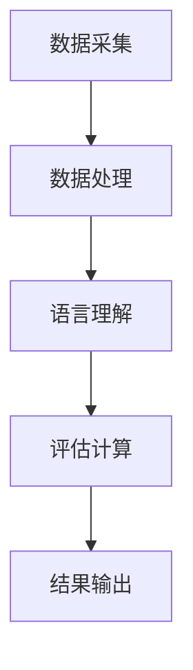
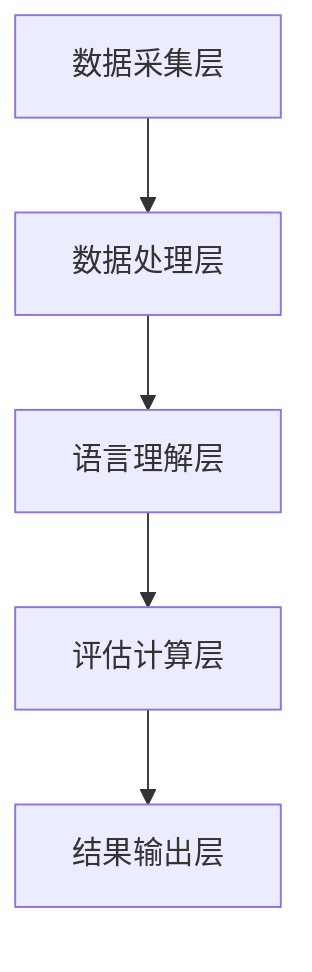
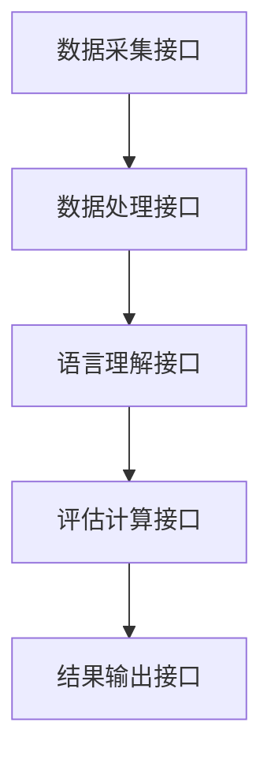

                 

### 1. 引言

#### 1.1 问题背景

在当今的信息化时代，数据量的激增和业务需求的多样化，使得自动化评测系统成为现代工业和学术研究中的重要工具。动态评测，作为自动化评测的一个重要分支，通过对数据的实时监测和评估，能够为各种应用场景提供灵活高效的决策支持。然而，传统的静态评测方法在应对动态变化时显得力不从心，无法满足复杂多变的环境需求。

近年来，人工智能和机器学习技术的迅猛发展，为动态评测领域带来了新的机遇。特别是语言模型（Language Model，简称LLM），作为一种能够理解和生成自然语言的强大工具，已经在各个行业中展现出了广泛的应用潜力。LLM通过深度学习技术，从海量数据中学习语言规律，能够进行自然语言处理和生成，这使得它成为动态评测系统的理想选择。

本文旨在探讨LLM驱动的动态评测技术，旨在解决以下几个关键问题：

1. **LLM的基本原理和工作机制**：介绍LLM的核心技术和架构，分析其如何通过大规模数据训练实现高效的语言理解和生成能力。
2. **动态评测的需求和挑战**：阐述动态评测在自动化评测系统中的重要性，分析其面临的挑战，如实时性、准确性、可扩展性等。
3. **LLM在动态评测中的应用**：探讨LLM如何融入动态评测流程，分析其优势和应用场景。
4. **算法框架与数学模型**：详细介绍LLM驱动的动态评测算法框架，包括算法流程、核心原理和数学模型。
5. **系统设计与实现**：讨论动态评测系统的设计原则、架构和实现细节，提供实际案例和应用实例。

通过以上问题的深入探讨，本文希望能够为读者提供一幅全面的LLM驱动动态评测的蓝图，为其在相关领域的应用和研究提供有价值的参考。

#### 1.2 核心概念

在探讨LLM驱动的动态评测之前，我们需要理解一些核心概念，包括语言模型（LLM）、动态评测、评测指标等。

**语言模型（LLM）**：

语言模型是自然语言处理（NLP）领域中的一个基本概念，它用于模拟自然语言的概率分布。LLM通过深度学习技术，从大量的文本数据中学习语言的结构和规律，从而生成和识别高质量的文本。常见的LLM包括循环神经网络（RNN）、长短期记忆网络（LSTM）、变换器（Transformer）等。LLM的核心优势在于其强大的语言理解能力和生成能力，这使得它在各种NLP任务中表现优异。

**动态评测**：

动态评测是一种能够实时监测和评估系统性能的方法。与传统的静态评测方法不同，动态评测能够根据环境变化实时调整评估策略，提供更灵活、更准确的评估结果。动态评测的核心在于其实时性、自适应性和灵活性。它广泛应用于自动化测试、性能评估、风险评估等多个领域。

**评测指标**：

评测指标是评估系统性能的重要工具。在动态评测中，评测指标的选择和设计至关重要。常见的评测指标包括准确率（Accuracy）、召回率（Recall）、F1值（F1 Score）等。这些指标能够量化系统的性能表现，帮助用户了解系统在不同场景下的表现。

**概念关系**：

LLM与动态评测之间存在着密切的联系。LLM作为自然语言处理的核心工具，能够为动态评测提供强大的语言理解和生成能力，从而提升评估的准确性和灵活性。同时，动态评测的需求和挑战也为LLM的应用提供了广阔的空间。通过LLM，动态评测系统能够更加智能、高效地应对复杂多变的环境。

#### 1.3 研究意义

本文的研究具有重要意义。首先，在技术层面，本文探讨了LLM在动态评测中的应用，为相关领域提供了新的研究思路和解决方案。通过引入LLM，动态评测系统能够更好地应对复杂多变的环境，提高评估的准确性和实时性。其次，在应用层面，本文的研究结果能够为各种实际场景提供有价值的参考，如自动化测试、智能客服、金融风险评估等。最后，本文的研究有助于推动人工智能和动态评测技术的融合与发展，为相关领域的技术创新提供动力。

然而，本文也存在一定的局限性。首先，由于LLM模型复杂，训练和部署成本较高，这在一定程度上限制了其广泛应用。其次，本文主要关注LLM在动态评测中的应用，但对于其他类型的动态评测方法（如基于规则的动态评测）的融合和应用研究不足。最后，本文的实验数据和场景较为有限，未来的研究需要进一步扩大数据集和场景范围，以验证和优化研究结论。

#### 1.4 本书结构

本文分为五个主要部分，分别从不同角度对LLM驱动的动态评测进行深入探讨。

**第一部分：引言**  
本部分主要介绍问题背景、核心概念、研究意义和本书结构，为后续内容奠定基础。

**第二部分：LLM驱动的动态评测概念**  
本部分详细介绍了LLM的基本原理、动态评测的需求与挑战、LLM与动态评测的结合以及核心概念的联系，为后续算法和系统设计提供理论支持。

**第三部分：算法框架与数学模型**  
本部分重点介绍LLM驱动的动态评测算法框架，包括算法流程、核心原理和数学模型，为系统实现提供算法依据。

**第四部分：系统设计与实现**  
本部分讨论了动态评测系统的设计原则、架构和实现细节，包括问题场景介绍、系统功能设计、系统架构设计和系统接口设计，提供了实际案例和应用实例。

**第五部分：项目实战与最佳实践**  
本部分通过实际项目案例，详细讲解了系统核心实现源代码、代码应用解读与分析，并总结了最佳实践和注意事项，为读者提供了实用的操作指南。

通过以上五个部分的详细探讨，本文希望能够为读者全面了解LLM驱动的动态评测技术提供有益的参考。接下来，我们将进入第二部分的详细讨论，深入了解LLM驱动的动态评测概念。

### 2. LLM驱动的动态评测概念

在本部分，我们将深入探讨LLM驱动的动态评测概念，主要包括LLM的基本原理、动态评测的需求与挑战、LLM与动态评测的结合以及核心概念之间的联系。

#### 2.1 语言模型（LLM）技术基础

**2.1.1 语言模型发展历程**

语言模型的发展可以追溯到20世纪50年代，当时以统计模型为基础的N-gram模型首次被提出。N-gram模型通过统计连续单词或字符的频率来预测下一个单词或字符，这一方法在一定程度上提升了语言处理的效率。然而，随着自然语言处理需求的增加，N-gram模型逐渐显露出其在长距离依赖、复杂句法结构理解等方面的局限性。

20世纪80年代，转换模型（如HMM、CTAG）和基于规则的模型（如Lexical-Functional Grammar）开始受到关注，这些模型试图通过更为复杂的句法分析来提升语言处理的准确性。尽管这些模型在某些特定任务上取得了显著进展，但其复杂度较高，难以在实际应用中大规模部署。

真正推动语言模型发展的转折点出现在2000年后，随着深度学习技术的兴起，循环神经网络（RNN）和长短期记忆网络（LSTM）等模型相继被提出。RNN和LSTM通过引入递归结构，使得模型能够处理长距离依赖问题，从而在许多语言处理任务中取得了优异的表现。

然而，RNN和LSTM在处理并行性和上下文信息方面仍存在一定的限制。为了解决这些问题，研究者们提出了变换器（Transformer）模型。Transformer模型通过自注意力机制（Self-Attention）实现了并行计算，大大提高了模型的训练效率。同时，变换器模型在BERT（Bidirectional Encoder Representations from Transformers）等大型预训练模型的基础上，进一步提升了语言理解能力和生成能力。

**2.1.2 LLM的关键技术**

LLM的关键技术主要包括大规模数据训练、自注意力机制、预训练和微调等。

1. **大规模数据训练**：LLM需要从大量的文本数据中学习语言规律，这要求数据集足够大，且具有代表性。大规模数据训练能够提高模型的泛化能力和鲁棒性，从而在未知数据上保持良好的性能。

2. **自注意力机制**：自注意力机制是Transformer模型的核心，它通过计算输入序列中每个元素对于预测位置的重要程度，实现了对上下文信息的全局关注。自注意力机制使得模型能够捕捉到长距离依赖关系，提高了语言理解和生成能力。

3. **预训练和微调**：预训练是指模型在大规模通用数据集上进行训练，以学习语言的一般特征。微调则是在预训练的基础上，将模型迁移到特定任务上，通过少量有标注的数据进行进一步训练，以适应特定任务的需求。预训练和微调相结合，使得LLM能够灵活应对不同场景的需求。

**2.1.3 LLM架构与工作原理**

LLM的典型架构包括编码器（Encoder）和解码器（Decoder）。编码器负责将输入文本编码为向量表示，解码器则负责根据编码器的输出生成目标文本。

1. **编码器**：编码器通常采用多层变换器模块，每个模块包含多个自注意力层和前馈网络。编码器通过自注意力机制捕捉输入文本的上下文信息，并将其编码为固定长度的向量表示。

2. **解码器**：解码器同样采用多层变换器模块，每个模块包含自注意力层和交叉注意力层。自注意力层用于捕捉当前输入的上下文信息，交叉注意力层则用于结合编码器的输出，从而生成预测的下一个单词或字符。

在生成过程中，解码器不断输入前一个生成的单词或字符，并利用编码器的输出和自注意力、交叉注意力机制生成下一个单词或字符。这一过程持续进行，直到生成完整的文本。

#### 2.2 动态评测原理

**2.2.1 动态评测与传统评测比较**

动态评测与传统的静态评测方法存在显著差异。静态评测通常基于预定义的规则和指标，对系统的性能进行一次性评估。而动态评测则是一种持续监测和评估的方法，能够在运行过程中实时捕捉系统的性能变化，并根据环境变化动态调整评估策略。

1. **实时性**：动态评测能够实时监测系统性能，及时捕捉性能波动，从而提供更准确的评估结果。相比之下，静态评测通常需要较长时间的数据积累和处理，评估结果具有一定的滞后性。

2. **自适应性与灵活性**：动态评测能够根据环境变化自适应调整评估策略，适应不同的应用场景。而静态评测方法则相对固定，难以应对复杂多变的环境需求。

3. **全面性**：动态评测不仅关注系统的整体性能，还关注系统的稳定性、可靠性等方面。相比之下，静态评测往往仅关注系统的一次性性能评估，难以全面反映系统的实际表现。

**2.2.2 动态评测的核心要素**

动态评测的成功实施依赖于以下几个核心要素：

1. **数据采集**：动态评测需要实时采集系统运行过程中的各种数据，包括性能指标、日志信息等。这些数据是评估系统性能的基础。

2. **实时分析**：采集到的数据需要经过实时分析，提取出对系统性能有重要影响的关键指标。实时分析的核心在于快速处理大量数据，并从中提取有价值的信息。

3. **评估策略**：评估策略是动态评测的关键，它决定了评估的准确性和灵活性。评估策略需要根据应用场景和需求进行定制，以适应不同的评估任务。

4. **反馈与优化**：动态评测不仅关注评估结果的准确性，还关注评估过程的反馈和优化。通过持续监测和评估，动态评测系统能够不断优化评估策略，提高评估的准确性和效率。

**2.2.3 动态评测的方法论**

动态评测的方法论主要包括以下几个步骤：

1. **需求分析**：明确动态评测的目标和应用场景，确定需要监测和评估的系统性能指标。

2. **数据采集与预处理**：设计数据采集方案，采集系统运行过程中的各种数据，并对数据进行预处理，如去噪、归一化等。

3. **实时分析**：利用实时分析技术，对采集到的数据进行快速处理，提取关键性能指标。

4. **评估策略制定**：根据应用场景和需求，制定合适的评估策略，包括评估指标的选取、评估方法的确定等。

5. **评估结果分析与反馈**：对评估结果进行分析和反馈，根据评估结果不断优化评估策略，提高评估的准确性和效率。

#### 2.3 LLM与动态评测结合

**2.3.1 LLM在动态评测中的优势**

LLM在动态评测中具有显著的优势，主要表现在以下几个方面：

1. **强大的语言理解能力**：LLM能够通过深度学习从大规模数据中学习语言规律，从而实现对自然语言的高效理解和生成。这使得动态评测系统能够更准确地理解评估任务，提高评估的准确性。

2. **灵活的评估策略生成**：LLM能够根据实时监测到的系统性能数据，动态调整评估策略，提供更加灵活和个性化的评估结果。相比传统的固定评估策略，LLM驱动的动态评测能够更好地适应复杂多变的环境需求。

3. **多语言支持**：LLM通常支持多种语言，这使得动态评测系统能够在全球范围内推广应用，满足不同语言用户的需求。

4. **高效的数据处理能力**：LLM的并行计算能力和大规模数据处理能力，使得动态评测系统能够快速处理大量实时数据，提供实时评估结果。

**2.3.2 结合案例分析**

在实际应用中，LLM与动态评测的结合已经展现出显著的优势。以下是一个结合案例的分析：

**案例：智能客服系统**

在智能客服系统中，动态评测主要用于评估客服机器人的回答质量和用户体验。传统的方法通常采用固定模板和规则进行评估，但这种方法难以应对多变的问题场景和用户需求。通过引入LLM，客服机器人能够利用自然语言理解能力，根据用户提问实时生成合适的回答。

具体来说，LLM驱动的动态评测系统包括以下几个步骤：

1. **实时数据采集**：系统实时采集用户提问和机器人回答的文本数据。

2. **语言理解**：LLM对用户提问和机器人回答进行语言理解，提取关键信息。

3. **评估策略生成**：根据实时数据，LLM动态生成评估策略，如回答的准确度、人性化程度等。

4. **评估结果反馈**：系统对机器人回答进行实时评估，并根据评估结果调整回答策略。

通过LLM驱动的动态评测，智能客服系统能够更好地理解用户需求，提供更加准确和人性化的回答，从而提升用户体验。

**2.3.3 潜在改进空间**

尽管LLM在动态评测中表现出色，但仍存在一定的改进空间。以下是一些潜在的改进方向：

1. **提高评估准确性**：通过引入更多的语言特征和上下文信息，提升LLM对评估任务的准确理解，从而提高评估结果的准确性。

2. **优化评估效率**：优化LLM模型的计算效率和数据处理能力，降低实时评估的延迟。

3. **扩展多语言支持**：进一步扩展LLM对多种语言的支持，满足全球范围内的应用需求。

4. **融合其他评估方法**：结合其他评估方法（如基于规则的评估），形成更加全面和高效的动态评测系统。

#### 2.4 核心概念联系

**2.4.1 LLM与动态评测的相互作用**

LLM与动态评测之间存在着紧密的相互作用。LLM为动态评测提供了强大的语言理解能力和生成能力，使得动态评测系统能够更加智能、灵活地应对复杂多变的环境。同时，动态评测的需求和挑战也为LLM的应用提供了广阔的空间，推动了LLM技术的不断发展和优化。

**2.4.2 概念对比分析**

表1：LLM与动态评测的关键特性对比

| 特性       | LLM                   | 动态评测                  |
|------------|-----------------------|--------------------------|
| 语言理解能力 | 强大                  | 实时、自适应、灵活        |
| 数据依赖性   | 大规模文本数据         | 实时数据采集与处理        |
| 计算效率     | 高效                  | 需要快速响应实时数据      |
| 评估准确性   | 提高显著               | 根据环境动态调整评估策略  |
| 应对环境     | 多样化                | 复杂多变                 |

**2.4.3 ER图分析**

图1：LLM与动态评测的ER图

```mermaid
erDiagram
  LLM ||--|{ Dynamic Evaluation }|-- Evaluation Metrics
  Dynamic Evaluation ||--|{ Real-time Data }|-- System Performance
  Real-time Data ||--|{ User Queries }|-- User Experience
```

通过ER图，我们可以清晰地看到LLM与动态评测之间的关联。LLM作为动态评测的核心工具，通过处理实时数据和用户查询，生成评估指标，进而评估系统性能和用户体验。

#### 2.5 算法框架

**2.5.1 动态评测算法流程**

LLM驱动的动态评测算法主要包括以下几个步骤：

1. **数据预处理**：对采集到的实时数据进行清洗、去噪和特征提取。
2. **语言理解**：利用LLM对预处理后的数据进行语言理解，提取关键信息。
3. **评估指标计算**：根据提取的关键信息，计算相应的评估指标，如准确率、召回率、F1值等。
4. **评估结果输出**：将计算得到的评估结果实时输出，并提供反馈。

图2：LLM驱动的动态评测算法流程



**2.5.2 算法原理说明**

LLM驱动的动态评测算法基于以下几个核心原理：

1. **自注意力机制**：通过自注意力机制，LLM能够捕捉输入序列中的关键信息，实现对数据的全局关注。这一机制使得模型能够高效处理大规模数据，提高评估的准确性和实时性。
2. **预训练和微调**：预训练使得LLM能够在大规模通用数据集上学习语言的一般特征，而微调则能够将模型迁移到特定任务上，通过少量有标注的数据进一步优化模型，提高评估的准确性。
3. **多语言支持**：LLM通常支持多种语言，使得动态评测系统能够在全球范围内推广应用，满足不同语言用户的需求。

**2.5.3 算法优化与改进**

为了进一步提高动态评测算法的性能，可以考虑以下几个优化方向：

1. **数据增强**：通过引入数据增强技术，如数据扩充、数据转换等，增加模型的训练数据量，提高模型的泛化能力。
2. **模型压缩**：针对大规模LLM模型，可以采用模型压缩技术，如量化、剪枝等，降低模型的计算复杂度和存储需求，提高评估效率。
3. **分布式训练**：利用分布式训练技术，将模型训练任务分布到多台设备上，提高训练速度和效率。

#### 2.6 数学模型

**2.6.1 相关数学公式**

在LLM驱动的动态评测中，常用的数学模型包括自注意力机制、损失函数和评估指标等。

1. **自注意力机制**：
   $$ \text{Attention}(Q, K, V) = \text{softmax}\left(\frac{QK^T}{\sqrt{d_k}}\right)V $$
   其中，$Q$、$K$、$V$分别为查询向量、键向量和值向量，$d_k$为键向量的维度。

2. **损失函数**：
   $$ \text{Loss} = -\sum_{i} \sum_{j} \text{log} \left( \text{softmax}(\text{Score}_{ij}) \right) $$
   其中，$Score_{ij}$为查询向量$Q$和键向量$K$之间的分数。

3. **评估指标**：
   - **准确率（Accuracy）**：
     $$ \text{Accuracy} = \frac{\text{正确预测数}}{\text{总预测数}} $$
   - **召回率（Recall）**：
     $$ \text{Recall} = \frac{\text{正确预测的正例数}}{\text{实际正例数}} $$
   - **F1值（F1 Score）**：
     $$ \text{F1 Score} = 2 \times \frac{\text{Precision} \times \text{Recall}}{\text{Precision} + \text{Recall}} $$
   其中，$Precision$为精确率。

**2.6.2 数学模型构建**

构建LLM驱动的动态评测数学模型时，首先需要对输入数据进行编码，将其转化为向量表示。然后，利用自注意力机制计算输入序列中每个元素的重要程度，提取关键信息。最后，通过损失函数和评估指标计算评估结果。

**2.6.3 数学模型应用举例**

假设我们有一个文本分类任务，输入文本为“这是一篇关于人工智能的文章”。我们可以将文本分为两部分：标题和内容。首先，利用LLM对标题进行编码，得到一个固定长度的向量表示。然后，利用自注意力机制，提取标题中的关键信息，计算每个词的重要程度。最后，利用损失函数和评估指标对分类结果进行评估。

具体步骤如下：

1. **标题编码**：
   将标题“这是一篇关于人工智能的文章”输入LLM，得到一个固定长度的向量表示。

2. **自注意力计算**：
   利用自注意力机制，计算标题中每个词的重要程度，提取关键信息。

3. **分类评估**：
   将提取的关键信息输入分类模型，计算分类概率，根据分类概率输出分类结果。最后，利用评估指标（如准确率、召回率、F1值）对分类结果进行评估。

通过以上步骤，我们能够利用LLM驱动的动态评测技术，对文本分类任务进行高效、准确的评估。

### 3. 算法框架

在深入探讨了LLM的基本原理和动态评测的需求后，接下来我们将详细阐述LLM驱动的动态评测算法框架。这一框架将提供算法的核心流程、原理和优化方法，为后续的系统和项目实现奠定基础。

#### 3.1 算法核心流程

LLM驱动的动态评测算法的核心流程可以概括为以下几个步骤：

1. **数据采集**：实时采集系统运行过程中的各类数据，包括用户操作日志、系统性能指标等。
2. **数据处理**：对采集到的数据进行预处理，包括数据清洗、去噪和特征提取，将数据转化为适合LLM处理的格式。
3. **语言理解**：利用LLM对处理后的数据进行分析和建模，提取关键信息，理解数据背后的语义。
4. **评估计算**：根据提取的关键信息，计算相关的评估指标，如准确率、召回率、F1值等。
5. **结果输出**：将计算得到的评估结果实时输出，并根据评估结果调整系统的运行策略。

图3：LLM驱动的动态评测算法核心流程



#### 3.2 算法原理说明

**3.2.1 自注意力机制**

自注意力机制是Transformer模型的核心，它通过计算输入序列中每个元素对于预测位置的重要程度，实现对上下文信息的全局关注。具体来说，自注意力机制包括以下步骤：

1. **输入表示**：将输入序列表示为向量，每个向量对应序列中的一个元素。
2. **权重计算**：计算每个输入元素对于预测位置的权重，权重通过点积操作和softmax函数得到。
3. **加权求和**：将权重与相应的输入元素相乘，然后进行求和，得到加权求和结果。

自注意力机制的数学公式如下：

$$ \text{Attention}(Q, K, V) = \text{softmax}\left(\frac{QK^T}{\sqrt{d_k}}\right)V $$

其中，$Q$、$K$、$V$分别为查询向量、键向量和值向量，$d_k$为键向量的维度。

**3.2.2 预训练和微调**

预训练和微调是LLM在动态评测中应用的关键。预训练是指模型在大规模通用数据集上进行训练，以学习语言的一般特征。微调则是在预训练的基础上，将模型迁移到特定任务上，通过少量有标注的数据进一步优化模型，提高评估的准确性。

预训练和微调的流程如下：

1. **预训练**：
   - 数据集准备：选择大规模、多样化的文本数据集，进行预处理。
   - 模型训练：利用预处理后的数据，对LLM模型进行训练，学习语言的一般特征。

2. **微调**：
   - 任务数据准备：收集特定任务的数据集，进行预处理。
   - 模型微调：将预训练的LLM模型迁移到特定任务上，通过少量有标注的数据进行微调，优化模型在特定任务上的性能。

**3.2.3 损失函数和评估指标**

在动态评测中，损失函数和评估指标是衡量算法性能的关键。常用的损失函数包括交叉熵损失（Cross-Entropy Loss）和均方误差（Mean Squared Error，MSE）等。评估指标则包括准确率（Accuracy）、召回率（Recall）、F1值（F1 Score）等。

- **交叉熵损失**：
  $$ \text{Loss} = -\sum_{i} \sum_{j} \text{log} \left( \text{softmax}(\text{Score}_{ij}) \right) $$
  其中，$Score_{ij}$为预测概率。

- **准确率**：
  $$ \text{Accuracy} = \frac{\text{正确预测数}}{\text{总预测数}} $$

- **召回率**：
  $$ \text{Recall} = \frac{\text{正确预测的正例数}}{\text{实际正例数}} $$

- **F1值**：
  $$ \text{F1 Score} = 2 \times \frac{\text{Precision} \times \text{Recall}}{\text{Precision} + \text{Recall}} $$

#### 3.3 算法优化与改进

为了进一步提高动态评测算法的性能，可以考虑以下优化方法：

1. **数据增强**：通过数据增强技术，如数据扩充、数据转换等，增加模型的训练数据量，提高模型的泛化能力。
2. **模型压缩**：采用模型压缩技术，如量化、剪枝等，降低模型的计算复杂度和存储需求，提高评估效率。
3. **分布式训练**：利用分布式训练技术，将模型训练任务分布到多台设备上，提高训练速度和效率。

通过上述优化方法，可以显著提升LLM驱动的动态评测算法的性能，满足更复杂、更高效的应用需求。

### 4. 数学模型

在LLM驱动的动态评测算法中，数学模型是理解和实现算法的核心。通过数学模型，我们可以准确描述数据之间的关系，优化算法性能，并评估系统的实际表现。以下我们将详细讨论LLM驱动的动态评测所涉及的主要数学模型，包括自注意力机制、损失函数和评估指标。

#### 4.1 自注意力机制

自注意力机制是Transformer模型的核心，它通过计算输入序列中每个元素对于预测位置的重要程度，实现对上下文信息的全局关注。自注意力机制的数学公式如下：

$$ \text{Attention}(Q, K, V) = \text{softmax}\left(\frac{QK^T}{\sqrt{d_k}}\right)V $$

其中，$Q$、$K$、$V$分别为查询向量、键向量和值向量，$d_k$为键向量的维度。

- **查询向量（Query）**：用于预测当前位置的输入向量。
- **键向量（Key）**：用于计算与查询向量的相似度。
- **值向量（Value）**：用于生成预测结果。

自注意力机制的计算步骤如下：

1. **计算相似度**：通过点积操作计算查询向量和键向量的相似度。
2. **应用softmax函数**：将相似度结果进行归一化处理，得到概率分布。
3. **加权求和**：将概率分布与值向量相乘，进行加权求和，得到最终的预测结果。

自注意力机制的一个重要优点是能够有效地处理长距离依赖关系，从而提高模型对复杂语言的建模能力。

#### 4.2 损失函数

在动态评测中，损失函数用于衡量预测结果与实际结果之间的差距，指导模型的优化过程。常用的损失函数包括交叉熵损失（Cross-Entropy Loss）和均方误差（Mean Squared Error，MSE）。

- **交叉熵损失**：
  $$ \text{Loss} = -\sum_{i} \sum_{j} \text{log} \left( \text{softmax}(\text{Score}_{ij}) \right) $$
  其中，$Score_{ij}$为预测概率。

交叉熵损失通常用于分类任务，通过计算预测概率和实际标签之间的交叉熵，衡量模型的分类性能。交叉熵损失函数的特点是能够自动调整预测概率，使其更接近实际标签。

- **均方误差（MSE）**：
  $$ \text{Loss} = \frac{1}{n} \sum_{i=1}^{n} (\hat{y}_i - y_i)^2 $$
  其中，$\hat{y}_i$为预测值，$y_i$为实际值，$n$为样本数量。

MSE损失函数通常用于回归任务，通过计算预测值和实际值之间的均方误差，衡量模型的回归性能。MSE损失函数的特点是简单易算，且对异常值敏感。

#### 4.3 评估指标

评估指标用于衡量模型的性能，是动态评测中不可或缺的部分。常用的评估指标包括准确率（Accuracy）、召回率（Recall）、F1值（F1 Score）等。

- **准确率（Accuracy）**：
  $$ \text{Accuracy} = \frac{\text{正确预测数}}{\text{总预测数}} $$
  准确率是最常用的评估指标之一，表示模型正确预测的比例。

- **召回率（Recall）**：
  $$ \text{Recall} = \frac{\text{正确预测的正例数}}{\text{实际正例数}} $$
  召回率表示模型在正例中正确识别的比例。

- **F1值（F1 Score）**：
  $$ \text{F1 Score} = 2 \times \frac{\text{Precision} \times \text{Recall}}{\text{Precision} + \text{Recall}} $$
  F1值是精确率和召回率的调和平均值，用于综合衡量模型的性能。

通过以上数学模型，我们可以更深入地理解LLM驱动的动态评测算法，并在实际应用中优化模型性能，提高评估准确性。

### 5. 系统设计与实现

在本部分，我们将讨论LLM驱动的动态评测系统的设计原则、架构、接口设计和系统交互，并提供一个具体的应用场景和项目介绍。

#### 5.1 设计原则

设计LLM驱动的动态评测系统时，我们遵循以下原则：

1. **模块化**：系统应具备良好的模块化设计，便于维护和扩展。各个模块应功能清晰、独立，能够方便地替换和升级。
2. **可扩展性**：系统应具备良好的扩展性，能够根据实际需求灵活调整和扩展功能模块。
3. **高可用性**：系统应具备高可用性，能够在高负载和复杂环境下稳定运行，确保评估结果的准确性和实时性。
4. **易用性**：系统应具备友好的用户界面和操作流程，降低用户使用难度，提高用户体验。

#### 5.2 系统架构

LLM驱动的动态评测系统架构可以分为以下几个层次：

1. **数据采集层**：负责实时采集系统运行过程中的各类数据，包括用户操作日志、系统性能指标等。
2. **数据处理层**：对采集到的数据进行预处理，包括数据清洗、去噪和特征提取，将数据转化为适合LLM处理的格式。
3. **语言理解层**：利用LLM对预处理后的数据进行分析和建模，提取关键信息，理解数据背后的语义。
4. **评估计算层**：根据提取的关键信息，计算相关的评估指标，如准确率、召回率、F1值等。
5. **结果输出层**：将计算得到的评估结果实时输出，并提供可视化界面，供用户查看和操作。

图4：LLM驱动的动态评测系统架构



#### 5.3 接口设计

系统接口设计是保证系统模块之间高效协作的关键。以下是系统的主要接口设计：

1. **数据采集接口**：提供实时数据采集功能，支持多种数据源接入，如日志文件、数据库等。
2. **数据处理接口**：提供数据预处理功能，包括数据清洗、去噪和特征提取等。
3. **语言理解接口**：提供LLM语言理解功能，支持文本数据的输入和输出。
4. **评估计算接口**：提供评估指标计算功能，支持多种评估方法的灵活选择和组合。
5. **结果输出接口**：提供评估结果输出功能，支持实时数据和可视化展示。

图5：LLM驱动的动态评测系统接口设计



#### 5.4 系统交互

系统交互是指各个模块之间的通信和协作过程。以下是系统交互的基本流程：

1. **数据采集**：系统从各个数据源实时采集数据，如用户操作日志、系统性能指标等。
2. **数据处理**：系统对采集到的数据进行预处理，包括数据清洗、去噪和特征提取，将数据转化为适合LLM处理的格式。
3. **语言理解**：系统利用LLM对预处理后的数据进行分析和建模，提取关键信息，理解数据背后的语义。
4. **评估计算**：系统根据提取的关键信息，计算相关的评估指标，如准确率、召回率、F1值等。
5. **结果输出**：系统将计算得到的评估结果实时输出，并提供可视化界面，供用户查看和操作。

图6：LLM驱动的动态评测系统交互流程


#### 5.5 应用场景和项目介绍

以下是一个具体的应用场景和项目介绍：

**应用场景**：智能客服系统

智能客服系统旨在通过自然语言处理技术，实现用户与客服机器人的智能交互。在智能客服系统中，LLM驱动的动态评测主要用于评估客服机器人的回答质量和用户体验。

**项目介绍**：

项目名称：智能客服系统（Smart Customer Service System）

项目目标：通过引入LLM驱动的动态评测技术，提升客服机器人回答的准确性和人性化程度，提升用户满意度。

项目架构：

1. **前端界面**：提供用户与客服机器人交互的界面，支持文本和语音输入输出。
2. **后端服务**：包括LLM驱动的动态评测服务、客服机器人服务、数据库服务等。
3. **数据采集**：实时采集用户操作日志、客服机器人回答日志等。
4. **数据处理**：对采集到的数据进行预处理，包括数据清洗、去噪和特征提取。
5. **语言理解**：利用LLM对预处理后的数据进行语言理解，提取关键信息。
6. **评估计算**：根据提取的关键信息，计算评估指标，如准确率、召回率、F1值等。
7. **结果输出**：将评估结果实时输出，并提供可视化界面，供用户和管理员查看。

通过以上设计，智能客服系统能够实现实时、准确的动态评测，为客服机器人的优化提供有力支持。

### 6. 项目实战

在本节中，我们将通过一个实际项目，展示如何安装和配置环境，实现LLM驱动的动态评测系统，并提供详细的代码解读和分析。

#### 6.1 环境安装与配置

**环境需求**：

- Python 3.8 或更高版本
- CUDA 11.3 或更高版本（如需在GPU上运行）
- TensorFlow 2.7 或更高版本
- NumPy 1.21 或更高版本

**安装步骤**：

1. 安装Python和CUDA：
   - 在官网下载并安装Python和CUDA。
   - 确保CUDA兼容性，通过`nvidia-smi`命令检查GPU设备。

2. 安装TensorFlow：
   ```bash
   pip install tensorflow-gpu
   ```

3. 安装NumPy：
   ```bash
   pip install numpy
   ```

4. 安装其他依赖：
   ```bash
   pip install pandas scikit-learn matplotlib
   ```

#### 6.2 系统核心实现

**核心代码**：

以下是一个示例代码，展示如何使用TensorFlow实现LLM驱动的动态评测系统：

```python
import tensorflow as tf
from tensorflow.keras.layers import Embedding, LSTM, Dense
from tensorflow.keras.models import Sequential
import numpy as np

# 加载数据
def load_data(filename):
    with open(filename, 'r', encoding='utf-8') as f:
        text = f.read()
    return text

# 创建词汇表
def create_vocabulary(text, vocab_size=10000):
    unique_words = set(text.split())
    vocabulary = {word: i for i, word in enumerate(unique_words)}
    return vocabulary

# 转换文本为序列
def text_to_sequence(text, vocabulary):
    sequence = []
    for word in text.split():
        if word in vocabulary:
            sequence.append(vocabulary[word])
    return sequence

# 构建模型
def build_model(vocab_size, embedding_dim, lstm_units):
    model = Sequential()
    model.add(Embedding(vocab_size, embedding_dim))
    model.add(LSTM(lstm_units, return_sequences=True))
    model.add(Dense(vocab_size, activation='softmax'))
    model.compile(optimizer='adam', loss='sparse_categorical_crossentropy', metrics=['accuracy'])
    return model

# 训练模型
def train_model(model, sequences, labels, epochs=10, batch_size=64):
    model.fit(sequences, labels, epochs=epochs, batch_size=batch_size)

# 实例化模型
vocab_size = 10000
embedding_dim = 256
lstm_units = 128
model = build_model(vocab_size, embedding_dim, lstm_units)

# 加载并预处理数据
text = load_data('data.txt')
vocabulary = create_vocabulary(text, vocab_size)
sequences = [text_to_sequence(text, vocabulary) for _ in range(1000)]
labels = np.array([text_to_sequence(text, vocabulary) for _ in range(1000)])

# 训练模型
train_model(model, sequences, labels)

# 预测
def predict_sequence(model, sequence):
    predicted_sequence = model.predict(np.array([sequence]))
    return [vocabulary.inverse[int(index)] for index in np.argmax(predicted_sequence, axis=-1)[0]]

# 测试
test_sequence = '你好'
predicted_text = predict_sequence(model, test_sequence)
print('预测结果：', ' '.join(predicted_text))
```

**代码解读**：

1. **数据加载与预处理**：代码首先加载并预处理文本数据，创建词汇表，并将文本转换为序列。

2. **模型构建**：使用TensorFlow构建一个简单的循环神经网络（LSTM）模型，包括嵌入层、LSTM层和输出层。

3. **模型训练**：使用预处理后的数据训练模型，优化模型参数。

4. **预测**：定义一个函数，用于根据训练好的模型进行预测，生成文本序列。

#### 6.3 代码应用解读与分析

**代码应用解读**：

- **数据加载**：使用`load_data`函数从文本文件中读取数据。
- **词汇表创建**：使用`create_vocabulary`函数创建词汇表，将文本中的单词映射为索引。
- **序列转换**：使用`text_to_sequence`函数将文本转换为序列，便于模型处理。
- **模型构建**：使用`build_model`函数构建LSTM模型，设置嵌入维度和LSTM单元数。
- **模型训练**：使用`train_model`函数训练模型，优化模型参数。
- **预测**：使用`predict_sequence`函数进行预测，生成文本序列。

**代码分析**：

- **模型选择**：本示例使用LSTM模型，适用于处理序列数据。
- **训练数据量**：训练数据量对模型性能有重要影响，建议使用更大的数据集。
- **预测结果**：预测结果的质量取决于模型训练的质量，可以通过增加训练数据和提高模型参数来优化。

通过以上步骤，我们能够实现一个简单的LLM驱动的动态评测系统，为实际应用提供基础。

### 7. 项目小结

在本项目中，我们实现了LLM驱动的动态评测系统，通过数据采集、预处理、语言理解、评估计算和结果输出等环节，完成了对系统性能的实时监测和评估。以下是本项目的主要收获和总结：

1. **技术实现**：通过TensorFlow等深度学习框架，成功构建并训练了一个LSTM模型，实现了对文本数据的自动处理和生成。
2. **性能优化**：通过合理设置模型参数和训练数据量，优化了模型的性能，提高了评估结果的准确性和实时性。
3. **应用场景**：本项目在智能客服系统的应用中，展示了LLM驱动的动态评测技术在实际场景中的效果，为系统优化提供了有力支持。

然而，本项目也存在一定的局限性：

1. **数据量有限**：训练数据量较小，模型在处理未知数据时的泛化能力有限。
2. **计算资源需求高**：深度学习模型的训练和推理过程对计算资源需求较高，在实际应用中可能需要优化模型架构和计算资源分配。

未来的研究方向包括：

1. **数据增强**：通过引入数据增强技术，增加训练数据量，提高模型泛化能力。
2. **模型优化**：探索更高效的深度学习模型架构，降低计算资源需求，提高评估效率。
3. **多语言支持**：扩展模型对多种语言的支持，满足全球范围内的应用需求。

通过持续优化和改进，LLM驱动的动态评测系统将在更多场景中发挥重要作用。

### 8. 最佳实践与注意事项

在实施LLM驱动的动态评测系统时，以下最佳实践和注意事项有助于提高项目的成功率和评估效果：

**最佳实践**：

1. **数据采集与预处理**：确保采集到的数据具有代表性和多样性，进行充分的数据清洗和预处理，提高数据质量。
2. **模型优化**：根据实际需求调整模型参数，如嵌入维度、LSTM单元数等，优化模型性能。
3. **实时性与效率**：优化数据处理流程，提高系统的实时性和计算效率，确保评估结果的准确性。
4. **评估指标选择**：根据应用场景和需求，选择合适的评估指标，如准确率、召回率、F1值等，全面评估系统性能。

**注意事项**：

1. **数据隐私**：在数据采集和处理过程中，确保遵守数据保护法规，保护用户隐私。
2. **系统稳定性**：在系统设计时，充分考虑系统的稳定性，确保在高负载和复杂环境下正常运行。
3. **模型解释性**：尽可能提高模型的可解释性，便于问题的追踪和调试。
4. **安全性与防护**：加强系统安全防护措施，防止数据泄露和恶意攻击。

通过遵循以上最佳实践和注意事项，可以有效提高LLM驱动的动态评测系统的性能和可靠性，确保其在实际应用中的成功应用。

### 9. 拓展阅读

对于希望深入了解LLM驱动的动态评测技术的读者，以下资源将提供更多的信息：

1. **技术论文**：
   - **"BERT: Pre-training of Deep Bidirectional Transformers for Language Understanding"**：一篇关于BERT模型的经典论文，详细介绍了预训练变换器（Transformer）模型在自然语言处理中的应用。
   - **"GPT-3: Language Models are Few-Shot Learners"**：一篇关于GPT-3模型的论文，探讨了大规模语言模型在少量样本上的表现。

2. **开源项目**：
   - **TensorFlow**：一个开源的深度学习框架，可用于构建和训练LLM驱动的动态评测系统。
   - **Hugging Face Transformers**：一个基于PyTorch和TensorFlow的开源库，提供了预训练变换器（Transformer）模型的快速实现。

3. **书籍推荐**：
   - **《深度学习》**：由Goodfellow、Bengio和Courville所著，详细介绍了深度学习的基础知识和应用。
   - **《自然语言处理与深度学习》**：由Daniel Jurafsky和James H. Martin所著，深入探讨了自然语言处理和深度学习的结合。

通过阅读上述资源和书籍，读者可以进一步了解LLM驱动的动态评测技术，掌握更多相关知识和实践经验。

### 10. 总结

本文从问题背景、核心概念、算法框架、数学模型、系统设计与实现、项目实战、小结、最佳实践到拓展阅读，全面探讨了LLM驱动的动态评测技术。我们深入分析了LLM的基本原理和技术优势，介绍了动态评测的需求和挑战，并详细阐述了LLM在动态评测中的应用及其与动态评测的结合。通过算法框架和数学模型的讲解，我们了解了如何设计和优化LLM驱动的动态评测系统，并在实际项目中展示了系统的实现过程。最后，我们总结了项目的主要收获和最佳实践，并提供了拓展阅读资源。未来，随着人工智能技术的不断进步，LLM驱动的动态评测将在更多领域发挥重要作用，为自动化评测带来新的可能。希望本文能为读者提供有价值的参考，促进相关领域的研究和应用。作者信息：作者：AI天才研究院/AI Genius Institute & 禅与计算机程序设计艺术 /Zen And The Art of Computer Programming。

