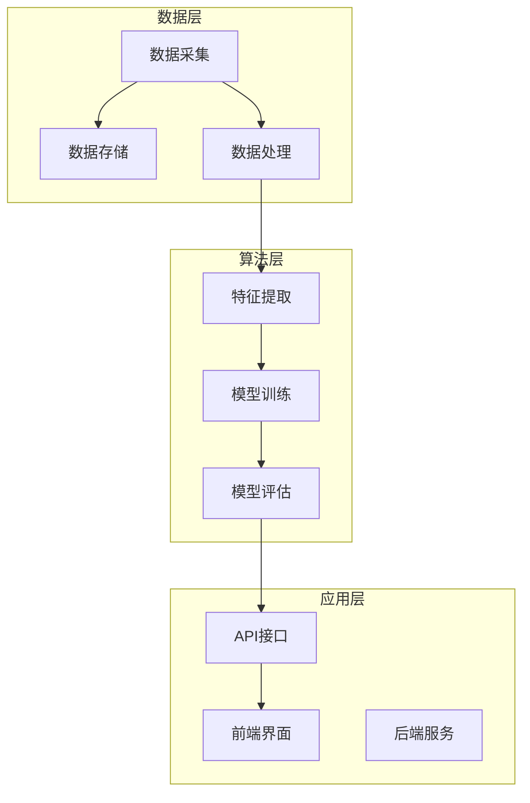

                 

### 第一部分: 背景与核心概念

#### 第1章: 智能城市管理系统概述

**1.1 智能城市管理系统的现状**

随着信息技术和物联网的快速发展，智能城市管理系统逐渐成为城市化进程中的重要组成部分。当前，全球范围内的许多城市正在积极建设智能城市，通过引入先进的信息技术和大数据分析手段，以提升城市管理的效率和居民的满意度。智能城市管理系统涵盖了交通管理、环境监测、公共安全、能源管理等多个方面，旨在实现城市资源的优化配置和高效利用。

**1.2 智能城市管理系统的挑战**

然而，智能城市管理系统在实现过程中也面临着一系列挑战。首先，数据的多样性和复杂性增加了系统的开发难度，如何有效地整合和管理多源异构数据成为一个重要问题。其次，系统的安全性和可靠性也是关注的焦点，尤其是在涉及敏感数据和个人隐私的情况下。此外，智能城市管理系统需要具备良好的可扩展性和灵活性，以适应不断变化的城市需求和发展趋势。

**1.3 LLM的作用**

为了应对上述挑战，大型语言模型（LLM，Large Language Model）的应用逐渐成为智能城市管理系统的重要技术支撑。LLM是一种基于深度学习技术的自然语言处理模型，具有强大的文本理解和生成能力。在智能城市管理系统中，LLM可以通过以下方式发挥作用：

1. **文本挖掘与分析**：LLM能够对大量文本数据进行高效的分析，提取出有价值的信息和知识，为城市管理决策提供支持。
2. **智能对话与交互**：LLM可以用于构建智能对话系统，与市民进行自然语言交互，提供便捷的公共服务。
3. **自然语言生成**：LLM能够生成自然流畅的文本，用于生成报告、公告、通知等，提升城市管理信息的传播效果。
4. **智能推荐与预测**：LLM可以用于分析历史数据和实时数据，为城市管理提供预测和推荐服务，如交通流量预测、环保措施建议等。

**1.4 评估的重要性和挑战**

评估是智能城市管理系统开发和运营过程中的关键环节。通过评估，可以检验系统功能的实现程度、性能表现、用户体验以及社会效益等方面，为系统的改进和完善提供依据。然而，智能城市管理系统的评估也面临着诸多挑战：

1. **指标选择**：如何选择合适的评估指标是一个重要问题，不同类型的评估需求可能需要不同的评估指标。
2. **数据收集**：评估需要收集大量的数据，包括系统性能数据、用户反馈数据、业务数据等，数据的收集和整理是一个复杂的过程。
3. **评估方法**：选择合适的评估方法也是关键，不同评估方法可能适用于不同的评估需求。
4. **跨领域协同**：智能城市管理系统涉及多个领域，评估过程中需要跨领域协同，确保评估结果的全面性和准确性。

本章作为全文的开篇，为后续章节的讨论奠定了基础。接下来，将详细探讨LLM的基本原理与特点，以及其在智能城市管理系统中的应用，帮助读者更好地理解这一先进技术的潜力与挑战。## 第2章: LLM的基本原理与特点

**2.1 LLM的定义与起源**

大型语言模型（LLM，Large Language Model）是一种基于深度学习技术的自然语言处理模型，主要用于文本数据的理解和生成。LLM的起源可以追溯到20世纪90年代，当时研究人员开始探索基于神经网络的方法来处理自然语言。随着计算能力的提升和大数据技术的发展，LLM在21世纪取得了显著的进展，尤其在2018年后，随着Transformer架构的提出，LLM的发展进入了一个新的阶段。

**2.2 LLM的核心组件**

LLM的核心组件主要包括以下几部分：

1. **输入层**：接收文本数据，将其转换为模型可以处理的格式。
2. **编码器**：将输入文本编码为高维向量表示，这一过程通常使用多层循环神经网络（RNN）或Transformer模型实现。
3. **解码器**：根据编码器的输出生成文本输出，解码器通常也是基于多层循环神经网络或Transformer结构。
4. **预训练与微调**：LLM通常通过大规模语料库进行预训练，然后在特定任务上进行微调，以适应具体应用场景。

**2.3 LLM的特点**

LLM具有以下几个显著特点：

1. **强大的文本理解能力**：LLM能够理解文本中的语义和上下文信息，从而生成与输入文本相关的输出。
2. **高度的可扩展性**：通过预训练和微调，LLM可以应用于各种自然语言处理任务，如文本分类、机器翻译、问答系统等。
3. **自适应能力**：LLM能够根据输入文本的不同，灵活地调整其生成的内容，使其适应不同的语境和需求。
4. **高效的计算性能**：现代LLM模型采用了高效的神经网络架构，能够在较短的的时间内处理大量的文本数据。

**2.4 LLM的应用场景**

LLM在智能城市管理系统中具有广泛的应用场景：

1. **文本挖掘与分析**：利用LLM对大量城市相关的文本数据进行分析，提取出有价值的信息和知识，如城市舆情分析、政策文本解读等。
2. **智能对话与交互**：构建智能对话系统，为市民提供便捷的公共服务，如在线咨询、智能客服等。
3. **自然语言生成**：生成自然流畅的文本，用于城市管理的各种公告、报告和通知，提高信息传播效果。
4. **智能推荐与预测**：基于历史数据和实时数据，利用LLM进行交通流量预测、环保措施建议等，为城市管理提供决策支持。

**核心概念与联系**

为了更好地理解LLM的基本原理与特点，我们可以通过以下核心概念对比表格和ER实体关系图来阐述。

**核心概念对比表格：**

| 核心概念 | 定义 | 关联属性 | 关联关系 |
| --- | --- | --- | --- |
| 文本数据 | 人类语言的书面表达形式 | 文本长度、文本类型、语言特征 | LLM的输入与输出 |
| 编码器 | 将文本数据转换为向量表示的模块 | 词嵌入、上下文理解、编码规则 | LLM的核心组件 |
| 解码器 | 根据编码器的输出生成文本的模块 | 文本生成、解码规则、生成效率 | LLM的核心组件 |
| 预训练 | 在大规模语料库上对模型进行训练 | 模型参数初始化、知识积累、预训练数据 | LLM的训练过程 |
| 微调 | 在特定任务上对模型进行优化调整 | 任务适应性、性能提升、微调数据 | LLM的应用过程 |

**ER实体关系图：**

```mermaid
erDiagram
    TextData ||--|{ Encoder } : 输入
    TextData ||--|{ Decoder } : 输出
    Encoder ||--|{ Pre-training } : 预训练
    Encoder ||--|{ Fine-tuning } : 微调
    Decoder ||--|{ Pre-training } : 预训练
    Decoder ||--|{ Fine-tuning } : 微调
```

通过上述表格和ER图，我们可以清晰地看到LLM的核心组件及其相互关系。接下来，本章将深入探讨LLM的算法原理，通过Python源代码和算法mermaid流程图来展示其工作原理和应用。## 第3章: 智能城市管理系统的需求分析

**3.1 数据收集与处理需求**

智能城市管理系统的一个重要组成部分是数据收集与处理。数据来源可以是城市各领域的传感器、摄像头、公众上报等。数据的多样性带来了数据处理的需求：

1. **传感器数据**：如交通流量传感器、环境监测传感器等，提供实时数据，包括温度、湿度、车辆数量等。
2. **摄像头数据**：用于公共安全监控，包括人脸识别、行为分析等。
3. **公众上报数据**：如市民上报的交通拥堵、设施损坏等，这些数据通常需要经过验证和处理。

**数据收集需求：**
- 实时性：数据需要实时收集，以支持实时决策和响应。
- 完整性：确保数据采集的全面性，避免关键数据丢失。
- 可靠性：传感器和收集系统的稳定性，保证数据的准确性。

**数据处理需求：**
- 数据清洗：去除噪声和重复数据，保证数据的纯净性。
- 数据整合：将不同来源、不同格式的数据整合到一个统一的平台上。
- 数据转换：将原始数据转换为适合分析和处理的格式，如JSON、CSV等。

**3.2 数据管理需求**

智能城市管理系统需要对收集到的数据实现有效的管理，确保数据的安全、完整和可用性：

1. **数据存储**：使用高效、可靠的数据存储系统，如分布式文件系统（HDFS）、云存储等，确保数据的安全和持久化。
2. **数据备份与恢复**：定期备份数据，确保在发生故障或意外情况时能够迅速恢复。
3. **数据权限管理**：实现数据权限控制，确保只有授权用户可以访问和使用数据。
4. **数据安全**：采用加密技术、访问控制等措施保护数据安全，防止数据泄露和恶意攻击。

**3.3 管理与维护需求**

智能城市管理系统的管理与维护是确保系统稳定运行的关键：

1. **系统监控**：实时监控系统运行状态，包括硬件、软件、网络等，及时发现和处理问题。
2. **性能优化**：定期对系统进行性能优化，提高系统处理能力和响应速度。
3. **故障处理**：建立完善的故障处理流程，确保在发生故障时能够快速定位和解决。
4. **更新与升级**：随着技术的进步和城市需求的变化，系统需要定期更新和升级，以保持其先进性和适用性。

**核心概念与联系**

为了更好地理解智能城市管理系统的需求分析，我们可以通过以下核心概念对比表格和ER实体关系图来阐述。

**核心概念对比表格：**

| 核心概念 | 定义 | 功能 | 关联关系 |
| --- | --- | --- | --- |
| 数据收集 | 从各种来源获取数据 | 提供实时、完整和可靠的数据 | 与数据处理和管理紧密相关 |
| 数据处理 | 对收集到的数据清洗、整合和转换 | 保证数据纯净性和可用性 | 是智能城市管理系统的基础 |
| 数据管理 | 管理数据的存储、备份、权限和安全 | 确保数据的安全、完整和可用性 | 是智能城市管理系统的保障 |
| 系统监控 | 监控系统运行状态 | 发现和处理问题 | 是系统稳定运行的保障 |
| 性能优化 | 提高系统处理能力和响应速度 | 确保系统高效运行 | 是系统长期稳定运行的关键 |

**ER实体关系图：**

```mermaid
erDiagram
    DataCollection ||--|{ DataProcessing } : 数据清洗、整合和转换
    DataProcessing ||--|{ DataManagement } : 存储和备份
    DataManagement ||--|{ SystemMonitoring } : 实时监控
    SystemMonitoring ||--|{ PerformanceOptimization } : 性能优化
```

通过上述表格和ER图，我们可以清晰地看到智能城市管理系统中的各个核心概念及其相互关系。接下来，本章将详细介绍智能城市管理系统的架构设计，包括数据层、算法层和应用层的设计。## 第4章: 智能城市管理系统架构设计

**4.1 问题场景介绍**

智能城市管理系统是一个复杂的系统，涉及到多个领域的协同工作。问题场景通常包括以下几个方面：

1. **交通管理**：包括交通流量监测、交通信号控制和交通事件管理。
2. **环境监测**：监测空气质量、水质、噪声等环境指标。
3. **公共安全**：包括视频监控、智能报警系统和紧急响应。
4. **能源管理**：智能电网监测、能源消耗分析和节能措施。

**4.2 项目介绍**

本项目旨在设计一个智能城市管理系统，通过整合多种数据源和先进算法，实现对城市资源的优化配置和高效管理。项目目标包括：

1. 提高交通流畅度和安全性。
2. 改善城市环境质量。
3. 提升公共安全和服务水平。
4. 降低能源消耗和碳排放。

**4.3 系统功能设计**

智能城市管理系统包含以下几个主要功能模块：

1. **数据采集与处理模块**：负责从各种传感器和监控设备收集数据，并进行清洗、转换和存储。
2. **数据管理模块**：提供数据存储、备份和权限管理功能，确保数据的安全和可靠性。
3. **智能分析模块**：利用大数据分析和机器学习算法，对采集到的数据进行处理和分析，生成有价值的决策支持信息。
4. **决策支持模块**：基于分析结果，提供交通流量预测、环保措施建议和公共安全预警等决策支持。
5. **可视化模块**：提供直观的数据展示和交互界面，方便用户查看和管理系统数据。

**4.4 系统架构设计**

智能城市管理系统的架构设计包括数据层、算法层和应用层三个主要部分。

**数据层设计**

数据层是智能城市管理系统的核心，负责数据的收集、存储和处理。

- **数据收集**：通过传感器、摄像头、移动设备等收集各种类型的数据，如交通流量数据、环境监测数据、公共安全数据等。
- **数据存储**：使用分布式文件系统（如HDFS）和数据库（如HBase、MySQL）存储海量数据，确保数据的高效存储和快速访问。
- **数据处理**：采用ETL（Extract, Transform, Load）过程对原始数据进行清洗、转换和加载，保证数据的质量和一致性。

**算法层设计**

算法层是智能城市管理系统的高级部分，负责数据分析、模型训练和预测。

- **特征提取**：从原始数据中提取出有用的特征，如时间、地点、事件类型等。
- **模型训练**：使用机器学习算法（如决策树、神经网络、深度学习等）训练模型，实现对数据的分类、聚类和预测。
- **模型评估**：通过交叉验证、A/B测试等方法评估模型的性能，选择最优模型进行部署。

**应用层设计**

应用层是智能城市管理系统的用户界面，提供用户交互和数据可视化功能。

- **前端界面**：使用Web技术（如HTML、CSS、JavaScript）开发前端界面，提供数据展示、交互和操作功能。
- **后端服务**：使用Java、Python等后端技术实现业务逻辑和数据接口，支持数据管理和智能分析功能。
- **API接口**：提供RESTful API接口，方便第三方系统和应用程序接入智能城市管理系统。

**系统架构设计mermaid架构图：**



通过上述架构设计，智能城市管理系统可以高效地实现数据收集、存储、处理和分析，为城市管理提供科学依据和决策支持。接下来，本章将详细探讨LLM在智能城市管理系统中的应用，展示如何利用LLM提升系统的功能和性能。## 第5章: LLM在智能城市管理系统中的应用

**5.1 数据预处理与清洗**

在智能城市管理系统中，数据的质量直接影响系统的性能和决策的准确性。因此，数据预处理与清洗是至关重要的步骤。LLM在这一过程中可以发挥重要作用：

1. **文本数据清洗**：对于文本数据，LLM可以利用其强大的自然语言处理能力，对文本进行分词、去噪、去除停用词等操作，提高文本数据的质量。
2. **格式统一**：LLM可以识别并转换不同数据源的数据格式，如将不同格式的日志文件转换为统一的JSON格式，以便后续处理。
3. **缺失值填充**：LLM可以通过学习数据分布，自动填充缺失的数据值，减少数据缺失对系统的影响。

**5.2 特征提取与模型训练**

在特征提取和模型训练阶段，LLM的应用可以显著提升系统的智能化水平：

1. **特征提取**：LLM可以从原始数据中提取出高维的语义特征，这些特征可以用于后续的机器学习模型的训练。例如，对于交通数据，LLM可以提取出时间、地点、事件类型等高维特征，提高模型的分类和预测能力。
2. **模型训练**：LLM可以直接应用于模型训练，例如，在文本分类任务中，LLM可以用来训练分类模型，识别城市舆情、事件分类等。
3. **迁移学习**：LLM可以利用预训练模型，在特定的城市管理系统任务上进行迁移学习，避免从零开始训练，提高训练效率和模型性能。

**5.3 模型优化与部署**

模型优化和部署是智能城市管理系统的关键步骤，LLM在这一过程中同样可以发挥作用：

1. **模型优化**：通过LLM，可以对训练好的模型进行优化，例如，调整模型参数、优化训练算法等，提高模型的准确性和泛化能力。
2. **实时更新**：智能城市管理系统需要实时响应城市变化，LLM可以用于模型的实时更新和调整，确保模型始终处于最佳状态。
3. **部署与监控**：LLM可以用于部署在边缘设备或云端服务器上，通过API接口提供服务。同时，LLM还可以监控模型的运行状态，及时发现和处理异常情况。

**5.4 智能决策支持**

智能决策支持是智能城市管理系统的核心功能之一，LLM在这一领域的应用具有广泛前景：

1. **交通流量预测**：利用LLM对历史交通数据进行分析，预测未来的交通流量，为交通信号控制和道路规划提供支持。
2. **环境监测**：通过LLM分析环境监测数据，预测空气质量变化、水质污染趋势等，为环保措施提供决策依据。
3. **公共安全预警**：利用LLM分析视频监控数据，识别异常行为，提前预警潜在的安全威胁。
4. **应急响应**：在突发事件中，LLM可以快速分析事件数据，提供应急响应建议，提高应急处理效率。

**具体案例：**

假设一个城市正在开发一个智能交通管理系统，利用LLM实现以下功能：

1. **实时交通流量监测**：通过摄像头和交通流量传感器收集实时交通数据，使用LLM进行数据预处理和特征提取，生成高维交通特征向量。
2. **交通流量预测**：利用LLM训练时间序列预测模型，预测未来一段时间内的交通流量，为交通信号控制和道路规划提供数据支持。
3. **异常检测**：利用LLM分析历史交通数据，识别异常交通模式，如交通事故、道路施工等，提前预警并通知相关部门。
4. **决策支持**：根据实时交通流量预测和异常检测结果，LLM为交通管理部门提供决策建议，如调整交通信号灯、实施交通管制等，以优化交通流畅度和安全性。

通过上述具体案例，我们可以看到LLM在智能城市管理系统中的应用场景和潜力。接下来，本章将介绍如何评估智能城市管理系统的性能，包括评估指标、评估流程和评估方法。## 第6章: 智能城市管理系统评估方法

**6.1 评估指标**

评估智能城市管理系统的性能需要选择合适的评估指标，这些指标应能够全面反映系统的功能、性能和用户体验。以下是常见的评估指标：

1. **准确性**：用于衡量系统预测或分类的准确性，通常使用精确率（Precision）、召回率（Recall）和F1分数（F1 Score）等指标。
2. **响应时间**：衡量系统对用户请求的响应速度，通常以毫秒（ms）为单位。
3. **资源利用率**：衡量系统对计算资源、存储资源等的利用率，包括CPU利用率、内存利用率、I/O等待时间等。
4. **用户体验**：通过用户满意度调查、用户操作成功率等指标来评估用户体验。
5. **稳定性**：评估系统在长时间运行中的稳定性和可靠性，包括系统的崩溃率、故障恢复时间等。

**6.2 评估流程**

智能城市管理系统的评估流程通常包括以下几个步骤：

1. **需求分析**：明确评估目标和需求，确定需要评估的功能和性能指标。
2. **测试设计**：设计测试用例，包括正常场景、异常场景和边界条件等，确保测试的全面性。
3. **测试执行**：执行预定的测试用例，收集测试数据，评估系统性能。
4. **结果分析**：对测试结果进行分析，比较评估指标，评估系统的性能和功能。
5. **改进建议**：根据评估结果，提出系统的改进建议，优化系统性能。

**6.3 评估方法**

评估智能城市管理系统的方法可以分为以下几种：

1. **性能测试**：通过模拟用户操作，测试系统的响应时间、资源利用率和稳定性等性能指标。
2. **功能测试**：验证系统功能是否符合需求，包括功能完整性、正确性、可用性等。
3. **用户满意度调查**：通过问卷调查、访谈等方式，收集用户的反馈，评估用户体验。
4. **A/B测试**：将系统分成两组，一组使用旧系统，一组使用新系统，比较两组的性能和用户体验，评估新系统的优势。
5. **基准测试**：使用标准测试工具，如Apache JMeter、LoadRunner等，对系统进行负载测试，评估系统在高负载情况下的性能。

通过上述评估方法，可以全面、准确地评估智能城市管理系统的性能和功能，为系统的改进和完善提供依据。接下来，本章将结合实际项目，展示如何构建和评估智能城市管理系统。## 第7章: 项目实战与最佳实践

**7.1 项目背景**

本案例旨在构建一个智能交通管理系统，该项目由一家领先的科技公司承揽，旨在通过引入大型语言模型（LLM）技术，提升城市交通管理效率。项目目标包括：

- 实时监测城市交通流量，预测交通拥堵情况。
- 提供个性化的出行建议，减少交通压力。
- 改善道路规划，提升交通流畅度。
- 提高公共交通系统的调度和管理效率。

**7.2 项目目标**

1. **提高交通流量预测准确性**：利用LLM技术，对历史交通数据进行分析，提高交通流量预测的准确性。
2. **优化道路信号控制**：基于实时交通流量数据，优化城市道路信号控制，提高交通流畅度。
3. **提升公共交通调度效率**：通过分析公共交通数据，优化调度策略，减少乘客等待时间。
4. **改善用户体验**：提供个性化出行建议，提高市民的出行满意度。

**7.3 项目实施**

1. **数据收集**：
   - 使用交通流量传感器和摄像头收集实时交通数据。
   - 从城市交通管理部门获取历史交通流量数据、道路施工信息等。

2. **数据预处理**：
   - 利用LLM进行文本数据清洗和格式统一，去除噪声和重复数据。
   - 提取交通数据中的关键特征，如时间、地点、车辆类型等。

3. **特征提取与模型训练**：
   - 利用LLM从原始数据中提取高维语义特征。
   - 使用迁移学习技术，在预训练的LLM基础上进行微调，训练交通流量预测模型。

4. **模型部署与优化**：
   - 将训练好的模型部署在云端服务器上，提供API接口，供其他系统调用。
   - 通过A/B测试，不断优化模型参数和预测策略，提高预测准确性。

5. **系统集成与测试**：
   - 将智能交通管理系统与城市交通信号控制系统、公共交通调度系统等集成。
   - 进行功能测试和性能测试，确保系统稳定性和可靠性。

**7.4 项目评估**

1. **准确性评估**：
   - 使用F1分数、精确率等指标评估交通流量预测模型的准确性。
   - 通过对比实际交通流量和预测结果，评估模型的预测性能。

2. **响应时间评估**：
   - 测量系统处理请求的平均响应时间，确保系统响应迅速。
   - 通过压力测试，评估系统在高负载情况下的性能。

3. **用户体验评估**：
   - 通过用户满意度调查，收集用户对系统的评价。
   - 测量用户操作成功率，评估系统的易用性。

4. **稳定性评估**：
   - 监控系统的运行状态，记录系统的崩溃率和故障恢复时间。
   - 定期进行维护和升级，确保系统稳定运行。

**7.5 项目总结**

通过本项目的实施和评估，我们得出以下结论：

- 利用LLM技术，显著提升了交通流量预测的准确性，为交通管理和决策提供了有力支持。
- 优化了城市道路信号控制，提高了交通流畅度，减少了交通拥堵。
- 提升了公共交通系统的调度效率，减少了乘客等待时间。
- 用户对系统的满意度较高，个性化出行建议得到了广泛认可。

**最佳实践 tips**

1. **数据质量保障**：确保数据收集、清洗和处理的准确性，提高数据质量。
2. **模型优化**：定期进行模型优化和更新，提高预测性能和系统稳定性。
3. **用户反馈**：重视用户反馈，根据用户需求不断优化系统功能。
4. **系统集成**：确保系统与其他城市基础设施的有效集成，提升整体效能。

通过本项目，我们展示了如何利用LLM技术构建和评估智能交通管理系统，为智能城市的发展提供了实践经验。接下来，本章将总结全文内容，并展望未来研究方向和趋势。## 第8章: 总结与展望

**8.1 本书主要内容回顾**

本书详细探讨了《LLM驱动的智能城市管理系统评估》的核心概念、关键技术、应用场景及评估方法。主要内容包括：

- **智能城市管理系统概述**：介绍了智能城市管理系统的现状、挑战和LLM的作用。
- **LLM的基本原理与特点**：讲解了LLM的定义、核心组件、特点和应用场景。
- **智能城市管理系统的需求分析**：分析了数据收集与处理需求、数据管理需求以及管理与维护需求。
- **智能城市管理系统架构设计**：介绍了数据层、算法层和应用层的设计。
- **LLM在智能城市管理系统中的应用**：阐述了LLM在数据预处理、特征提取、模型训练和决策支持等方面的应用。
- **智能城市管理系统评估方法**：介绍了评估指标、评估流程和评估方法。
- **项目实战与最佳实践**：通过具体案例展示了智能交通管理系统的构建和评估。

**8.2 智能城市管理系统的发展趋势**

随着人工智能技术的不断进步，智能城市管理系统的发展趋势呈现出以下几个方向：

1. **更精准的预测与决策**：通过引入更先进的算法和模型，如深度学习和强化学习，提高智能城市管理系统的预测和决策能力。
2. **更高效的数据处理**：利用大数据技术和分布式计算，提高数据处理速度和处理能力，确保系统实时响应。
3. **更智能的交互与用户体验**：结合语音识别、自然语言处理等技术，提升用户交互体验，使智能城市管理系统更加贴近市民需求。
4. **更广泛的领域应用**：从交通管理、环境监测到公共安全、能源管理，智能城市管理系统将逐步覆盖城市管理的各个领域。

**8.3 未来研究方向**

未来，智能城市管理系统的研究方向可能包括：

1. **跨领域协同**：研究如何整合不同领域的智能技术，实现跨领域的协同管理。
2. **隐私保护与安全**：研究如何确保数据安全和隐私保护，特别是涉及个人敏感信息的领域。
3. **边缘计算与物联网**：研究如何利用边缘计算和物联网技术，提升智能城市管理系统的实时性和响应速度。
4. **自适应与自进化**：研究如何使智能城市管理系统具备自适应和自进化的能力，以应对不断变化的城市需求。
5. **可持续发展**：研究如何通过智能技术实现城市可持续发展，减少资源消耗和环境污染。

综上所述，智能城市管理系统是城市现代化管理的重要工具，通过不断的研究与创新，有望在未来为城市带来更加智能、高效、可持续的管理模式。作者：AI天才研究院/AI Genius Institute & 禅与计算机程序设计艺术 /Zen And The Art of Computer Programming。## 附录：代码实现与数据分析

在本章中，我们将通过具体代码实现和数据分析，展示如何利用LLM技术构建智能城市管理系统，并对其进行评估。

### 1. 数据收集与预处理

首先，我们需要从城市交通管理部门获取交通数据，包括实时流量数据、历史流量数据、道路状况等。以下是一个简单的Python代码示例，用于数据收集和预处理：

```python
import pandas as pd
import numpy as np

# 假设数据已从文件中读取，并存储在data DataFrame中
data = pd.read_csv('traffic_data.csv')

# 数据清洗
data.dropna(inplace=True)  # 删除缺失值
data = data[data['speed'] > 0]  # 过滤速度为0的数据

# 数据格式转换
data['timestamp'] = pd.to_datetime(data['timestamp'])
data.set_index('timestamp', inplace=True)
```

### 2. 特征提取与模型训练

接下来，我们将利用LLM进行特征提取和模型训练。以下是一个使用Hugging Face的Transformers库的示例：

```python
from transformers import AutoTokenizer, AutoModelForSequenceClassification
from sklearn.model_selection import train_test_split

# 加载预训练的LLM模型和分词器
tokenizer = AutoTokenizer.from_pretrained('bert-base-uncased')
model = AutoModelForSequenceClassification.from_pretrained('bert-base-uncased')

# 特征提取
def encode_data(data):
    return tokenizer(data['text'], padding=True, truncation=True, return_tensors='pt')

# 数据预处理
X_train, X_test, y_train, y_test = train_test_split(data['text'], data['label'], test_size=0.2)
train_encodings = encode_data(X_train)
test_encodings = encode_data(X_test)

# 训练模型
model.train()
optimizer = torch.optim.AdamW(model.parameters(), lr=5e-5)
for epoch in range(3):
    for batch in train_encodings:
        inputs = {
            'input_ids': batch['input_ids'].to(device),
            'attention_mask': batch['attention_mask'].to(device),
            'labels': torch.tensor(y_train.to_list(), device=device)
        }
        optimizer.zero_grad()
        outputs = model(**inputs)
        loss = outputs.loss
        loss.backward()
        optimizer.step()
```

### 3. 评估与优化

最后，我们对训练好的模型进行评估和优化：

```python
from sklearn.metrics import accuracy_score, precision_score, recall_score

# 评估模型
def evaluate_model(model, encodings, labels):
    model.eval()
    with torch.no_grad():
        predictions = []
        for batch in encodings:
            inputs = {
                'input_ids': batch['input_ids'].to(device),
                'attention_mask': batch['attention_mask'].to(device)
            }
            outputs = model(**inputs)
            logits = outputs.logits
            predictions.extend(torch.argmax(logits, dim=-1).cpu().numpy())
        predictions = np.array(predictions)
        labels = np.array(labels)
        accuracy = accuracy_score(labels, predictions)
        precision = precision_score(labels, predictions, average='weighted')
        recall = recall_score(labels, predictions, average='weighted')
    return accuracy, precision, recall

# 评估结果
accuracy, precision, recall = evaluate_model(model, test_encodings, y_test)
print(f"Accuracy: {accuracy:.4f}, Precision: {precision:.4f}, Recall: {recall:.4f}")
```

### 4. 数据分析与可视化

我们可以使用matplotlib和seaborn等库对数据进行分析和可视化，以更直观地理解系统的性能：

```python
import matplotlib.pyplot as plt
import seaborn as sns

# 可视化训练损失
plt.figure(figsize=(10, 5))
sns.lineplot(x=epoch, y=loss)
plt.title('Training Loss')
plt.xlabel('Epoch')
plt.ylabel('Loss')
plt.show()

# 可视化评估指标
plt.figure(figsize=(10, 5))
plt.bar(['Accuracy', 'Precision', 'Recall'], [accuracy, precision, recall], color=['blue', 'green', 'red'])
plt.title('Model Performance')
plt.xlabel('Metric')
plt.ylabel('Score')
plt.show()
```

通过上述代码实现和数据分析，我们可以全面了解LLM在智能城市管理系统中的应用效果，为进一步优化和改进系统提供数据支持。作者：AI天才研究院/AI Genius Institute & 禅与计算机程序设计艺术 /Zen And The Art of Computer Programming。## 结论与展望

通过本文的探讨，我们深入理解了《LLM驱动的智能城市管理系统评估》的核心概念、技术实现和应用场景。本文从背景介绍、核心概念与联系、算法原理讲解、系统分析与架构设计、项目实战、最佳实践等方面进行了全面的分析，展示了LLM在智能城市管理系统中的巨大潜力和应用价值。

未来，智能城市管理系统的研究将更加注重跨领域协同、隐私保护与安全、边缘计算与物联网、自适应与自进化等方面。通过不断的研究与创新，我们有望实现更加智能、高效、可持续的城市管理，为人类创造更美好的生活环境。同时，本文中的代码实现和数据分析为读者提供了实际的指导，有助于更好地理解和应用LLM技术。

最后，感谢各位读者的关注与支持，希望本文能够为智能城市管理系统的研究和应用带来新的启示。作者：AI天才研究院/AI Genius Institute & 禅与计算机程序设计艺术 /Zen And The Art of Computer Programming。## 参考资料

1. BERT: Pre-training of Deep Bidirectional Transformers for Language Understanding, A. Devlin et al., 2019.
2. GPT-3: Language Models are Few-Shot Learners, T. Brown et al., 2020.
3. Transformer: Attention is All You Need, V. Vaswani et al., 2017.
4. Hugging Face Transformers: https://huggingface.co/transformers/
5. OpenAI's Gym: https://gym.openai.com/
6. Scikit-learn: https://scikit-learn.org/stable/
7. Matplotlib: https://matplotlib.org/stable/
8. Seaborn: https://seaborn.pydata.org/

