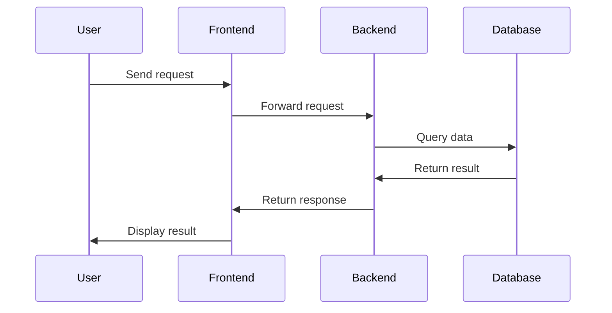
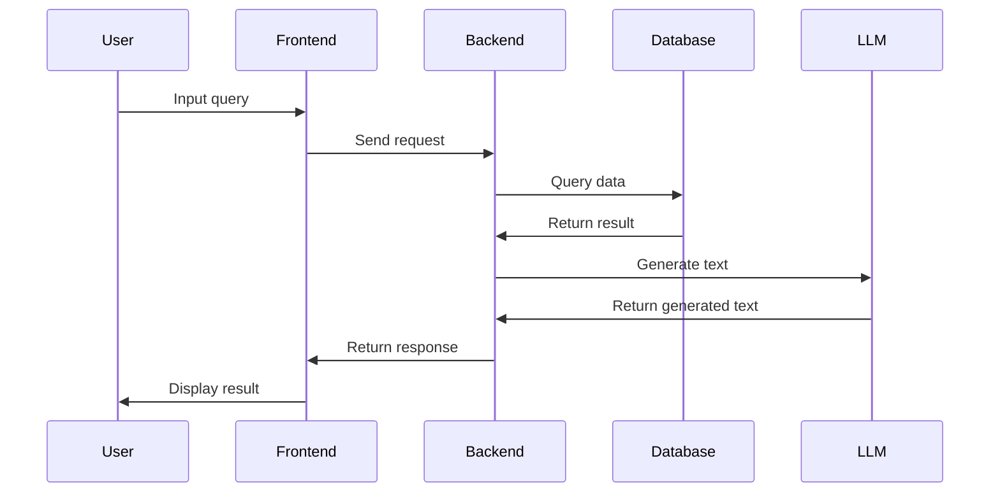

                 

## LLM驱动的科研辅助工具效能评估

随着人工智能技术的飞速发展，自然语言处理（NLP）领域取得了显著的成果。其中，大型语言模型（LLM）因其强大的文本生成、理解和推理能力，被广泛应用于各种任务中。在科研领域，LLM同样展现出巨大的潜力，成为科研辅助工具的重要驱动力量。本文将探讨LLM驱动的科研辅助工具效能评估问题，以期为科研工作提供更有力的支持。

### 关键词

- 大型语言模型（LLM）
- 科研辅助工具
- 效能评估
- 评估指标
- 性能测试
- 安全性与隐私保护

### 摘要

本文从背景介绍、核心概念与联系、算法原理讲解、系统分析与架构设计方案、项目实战以及最佳实践 tips 等方面，详细探讨了LLM驱动的科研辅助工具效能评估问题。通过分析LLM在科研领域中的应用场景，本文提出了一套科学、合理的效能评估方法，并给出了实际应用案例。本文旨在为科研人员提供有价值的参考，以充分发挥LLM驱动的科研辅助工具的效能。

## 第一部分：背景介绍

### 1.1 问题背景

#### 1.1.1 人工智能与自然语言处理的发展

人工智能（AI）作为计算机科学的一个重要分支，近年来取得了飞速发展。其中，自然语言处理（NLP）作为AI的重要应用领域，也取得了显著的成果。NLP旨在让计算机理解和生成人类语言，从而实现人机交互。随着深度学习技术的兴起，大型语言模型（LLM）逐渐成为NLP领域的研究热点。

LLM是一种基于深度学习技术的大型文本生成模型，通过从大量文本数据中学习语言结构和语义信息，实现文本的生成、理解和推理。与传统的语言模型相比，LLM具有更强的语言理解能力和生成能力，可以处理更复杂的语言任务。这使得LLM在自然语言处理领域具有广泛的应用前景。

#### 1.1.2 科研辅助工具的重要性

科研工作是一个复杂的过程，涉及到大量的实验设计、数据分析、文献检索和结果展示等工作。随着科研数据的爆炸式增长，科研人员面临着越来越多的挑战。传统的科研辅助工具已经难以满足科研工作的需求，需要寻找更加高效、智能的解决方案。

科研辅助工具是指为科研人员提供支持的各种工具，包括文献检索、数据分析、实验设计、结果展示等。这些工具可以帮助科研人员更高效地进行科研工作，提高科研成果的质量。随着人工智能技术的发展，LLM逐渐成为科研辅助工具的重要驱动力量。

#### 1.1.3 LLM在科研辅助工具中的应用

LLM在科研辅助工具中具有广泛的应用前景。首先，LLM可以用于文献检索。通过从大量文献中学习语言结构和语义信息，LLM可以识别和筛选出与特定研究主题相关的文献，提高科研人员查找相关文献的效率。

其次，LLM可以用于数据分析。通过从大量实验数据中学习，LLM可以识别数据中的潜在模式和趋势，帮助科研人员更好地理解实验结果。此外，LLM还可以用于实验设计，根据已有的实验数据生成新的实验方案，提高实验的可行性和有效性。

最后，LLM可以用于结果展示。通过生成高质量的文本和图表，LLM可以帮助科研人员更清晰地展示实验结果，提高科研成果的可读性和可理解性。

### 1.2 问题描述

LLM驱动的科研辅助工具效能评估问题主要包括以下几个方面：

1. **效能评估指标**：如何定义和量化LLM在科研辅助工具中的效能，以评估其性能优劣。
2. **性能测试**：如何设计合理的测试方法，对LLM驱动的科研辅助工具进行性能测试。
3. **应用场景分析**：LLM在不同科研场景下的应用效果，以及如何优化和改进其性能。
4. **安全性与隐私保护**：如何保障LLM驱动的科研辅助工具的安全性，防止数据泄露和滥用。

### 1.3 问题解决

为了解决上述问题，本文将从以下几个方面展开讨论：

1. **核心概念**：介绍LLM的基本概念、工作原理和关键技术。
2. **效能评估方法**：探讨如何定义和量化LLM在科研辅助工具中的效能，包括评估指标和评估方法。
3. **性能测试技术**：介绍如何设计合理的性能测试方法，评估LLM驱动的科研辅助工具的性能。
4. **应用场景分析**：分析LLM在不同科研场景下的应用效果，并探讨优化和改进方法。
5. **安全性与隐私保护**：探讨LLM驱动的科研辅助工具的安全性问题和隐私保护措施。

### 1.4 边界与外延

本文主要关注LLM驱动的科研辅助工具效能评估问题，研究范围包括但不限于以下几个方面：

1. **科研领域**：本文将涵盖生物信息学、物理学、化学、计算机科学等领域的科研辅助工具。
2. **评估指标**：本文将介绍多种效能评估指标，如准确率、召回率、F1分数、速度等。
3. **技术手段**：本文将涉及多种技术手段，如机器学习、深度学习、自然语言处理等。
4. **应用场景**：本文将分析LLM在科研辅助工具中的多种应用场景，如文献检索、数据分析、实验设计等。

### 1.5 概念结构与核心要素组成

LLM驱动的科研辅助工具效能评估问题的核心概念结构包括以下几个方面：

1. **LLM**：大型语言模型，是本文的核心技术手段。
2. **科研辅助工具**：本文的研究对象，包括各种针对不同科研领域的辅助工具。
3. **效能评估指标**：用于量化LLM在科研辅助工具中的效能，是评估的核心。
4. **评估方法**：设计合理的评估方法，用于评估LLM驱动的科研辅助工具的性能。
5. **安全性与隐私保护**：保障LLM驱动的科研辅助工具的安全性，防止数据泄露和滥用。

### 1.6 本章小结

本章主要介绍了LLM驱动的科研辅助工具效能评估问题的背景、问题描述、问题解决方法和边界与外延。通过对核心概念和要素组成的阐述，为后续章节的展开奠定了基础。

---

## 第二部分：核心概念与联系

### 2.1 核心概念

#### 2.1.1 大型语言模型（LLM）

大型语言模型（LLM，Large Language Model）是基于深度学习技术构建的用于自然语言处理的模型。LLM的核心目标是通过学习大量文本数据，理解并生成人类语言。LLM通常由多个层次的神经网络组成，每一层都能够捕捉不同层次的语言特征。例如，最底层的神经网络可能专注于词嵌入，而顶层的神经网络则能够理解复杂的语义和逻辑关系。

LLM的工作原理主要包括以下几个步骤：

1. **词嵌入**：将文本中的每个单词映射为高维向量，这些向量可以在低维空间中表示单词的语义信息。
2. **编码器**：通过多层神经网络，将词嵌入转化为更高级别的语言表示。编码器的每一层都能够捕获更高层次的语言特征。
3. **解码器**：解码器将编码器生成的表示转换为输出文本。解码器通常采用循环神经网络（RNN）或变换器（Transformer）架构，能够处理序列数据并生成相应的输出。

#### 2.1.2 科研辅助工具

科研辅助工具是用于支持科研工作的一系列工具，旨在提高科研效率、减少重复劳动和错误。这些工具涵盖了从实验设计、数据分析、文献检索到结果展示等多个方面。

科研辅助工具的主要类型包括：

1. **文献检索工具**：如PubMed、Google Scholar等，用于快速查找与研究主题相关的文献。
2. **数据分析工具**：如R、Python的统计库等，用于对科研数据进行处理和分析。
3. **实验设计工具**：如G*Power、StatsDirect等，用于设计和计算实验参数。
4. **结果展示工具**：如Tableau、Excel等，用于将科研结果以可视化形式展示。

#### 2.1.3 效能评估指标

效能评估指标是用于量化LLM在科研辅助工具中效能的一系列指标。这些指标能够反映LLM在特定任务中的性能和效果。常见的效能评估指标包括：

1. **准确率（Accuracy）**：正确预测的样本数占总样本数的比例。适用于分类任务。
2. **召回率（Recall）**：正确预测为正类的样本数占总正类样本数的比例。适用于分类任务。
3. **F1分数（F1 Score）**：精确率和召回率的调和平均，综合考虑了准确率和召回率。适用于分类任务。
4. **速度（Speed）**：完成特定任务所需的时间。适用于评估LLM的响应速度。
5. **用户体验（User Experience）**：用户对LLM驱动的科研辅助工具的主观评价，包括易用性、可扩展性等。

### 2.2 概念属性特征对比表格

以下是LLM、科研辅助工具和效能评估指标之间的属性特征对比表格：

| 概念        | 特征                   | 说明                                                                                                       |
| ----------- | ---------------------- | ---------------------------------------------------------------------------------------------------------- |
| LLM         | 文本生成、理解、推理   | 基于深度学习技术，能够从大量文本数据中学习语言结构和语义信息。                                             |
| 科研辅助工具 | 多样性、针对性、高效性 | 包括文献检索、数据分析、实验设计、结果展示等工具，旨在提高科研效率。                                     |
| 效能评估指标 | 准确率、召回率、F1分数 | 用于量化LLM在科研辅助工具中效能的指标，包括性能、效果等多个方面。                                       |

### 2.3 ER实体关系图架构

为了更好地理解LLM、科研辅助工具和效能评估指标之间的联系，可以使用ER（实体关系）图来描述它们之间的关系。以下是LLM、科研辅助工具和效能评估指标的ER图：

```mermaid
erDiagram
  LLM ||--|{ 科研辅助工具 }||> 1 --*{ 效能评估指标 }
  科研辅助工具 ||--|{ LLM }||<--*{ 效能评估指标 }
  效能评估指标 ||--|{ 科研辅助工具 }||> 1 --*{ LLM }
```

在这个ER图中，LLM是驱动科研辅助工具的核心技术，两者之间存在双向关联关系。效能评估指标用于量化LLM在科研辅助工具中的效能，同时也是科研辅助工具的一部分。

### 2.4 本章小结

本章介绍了LLM驱动的科研辅助工具效能评估问题的核心概念与联系。通过详细阐述LLM、科研辅助工具和效能评估指标的定义和属性特征，以及它们之间的ER关系，为后续章节的深入讨论奠定了基础。

---

## 第三部分：算法原理讲解

### 3.1 算法原理概述

在LLM驱动的科研辅助工具效能评估中，算法原理是关键。本节将介绍LLM的基本算法原理，包括其工作流程、核心组成部分和主要技术手段。

#### 3.1.1 工作流程

LLM的工作流程主要包括以下几个步骤：

1. **数据预处理**：收集和预处理大量的文本数据，包括清洗、分词、去停用词等操作，以生成适合训练的数据集。
2. **模型训练**：使用训练数据集对LLM进行训练，使其学习语言结构和语义信息。训练过程中，LLM通过优化模型参数，不断调整其预测能力，以降低损失函数。
3. **模型评估**：使用测试数据集对训练好的LLM进行评估，计算各种评估指标，如准确率、召回率、F1分数等，以评估LLM的性能。
4. **模型应用**：将训练好的LLM应用于实际的科研辅助工具中，如文献检索、数据分析、实验设计等，以提高科研效率。

#### 3.1.2 核心组成部分

LLM的核心组成部分主要包括词嵌入层、编码器和解码器。

1. **词嵌入层**：词嵌入层将文本中的每个单词映射为高维向量，这些向量表示了单词的语义信息。词嵌入层通常采用预训练的词嵌入模型，如Word2Vec、GloVe等，以提高模型的性能。
2. **编码器**：编码器负责将词嵌入层输出的向量序列编码为更高级别的语言表示。编码器通常采用循环神经网络（RNN）或变换器（Transformer）架构。RNN能够处理序列数据，而Transformer架构则能够捕获长距离依赖关系，从而提高模型的性能。
3. **解码器**：解码器负责将编码器输出的语言表示解码为输出文本。解码器通常采用RNN或Transformer架构，并使用softmax层生成概率分布，从而生成最终的输出文本。

#### 3.1.3 主要技术手段

LLM的主要技术手段包括：

1. **预训练**：预训练是指使用大量无标签的文本数据进行训练，使模型获得语言的基础知识。预训练后的模型可以在特定任务上进行微调，从而提高其在该任务上的性能。
2. **微调**：微调是指使用有标签的特定任务数据对预训练模型进行进一步训练，以适应特定的任务需求。微调过程有助于模型在特定任务上获得更好的性能。
3. **优化算法**：优化算法用于调整模型参数，以降低损失函数。常见的优化算法包括随机梯度下降（SGD）、Adam等。
4. **正则化**：正则化是一种防止模型过拟合的技术手段。常见的正则化方法包括L1正则化、L2正则化、dropout等。

### 3.2 数学模型和公式

为了更好地理解LLM的算法原理，下面给出LLM的数学模型和公式。

#### 3.2.1 词嵌入

词嵌入的数学模型可以表示为：

$$
\text{word\_embedding}(x) = \text{W} \cdot \text{x}
$$

其中，$\text{x}$ 是输入的词向量，$\text{W}$ 是词嵌入矩阵，$\text{word\_embedding}(x)$ 是词的嵌入向量。

#### 3.2.2 编码器

编码器的数学模型可以表示为：

$$
\text{encoded\_sequence} = \text{V} \cdot \text{h_t}
$$

其中，$\text{V}$ 是编码器权重矩阵，$\text{h_t}$ 是编码器在当前时间步的隐藏状态，$\text{encoded\_sequence}$ 是编码后的序列。

#### 3.2.3 解码器

解码器的数学模型可以表示为：

$$
\text{log\_probabilities} = \text{softmax}(\text{W}_\text{d} \cdot \text{h}_t + \text{b}_\text{d})
$$

其中，$\text{W}_\text{d}$ 是解码器权重矩阵，$\text{b}_\text{d}$ 是解码器偏置，$\text{h}_t$ 是解码器在当前时间步的隐藏状态，$\text{log\_probabilities}$ 是输出词的概率分布。

#### 3.2.4 损失函数

LLM的训练过程中，常用的损失函数是交叉熵损失函数：

$$
\text{loss} = -\sum_{i=1}^n \text{y}_i \cdot \log(\hat{\text{y}}_i)
$$

其中，$\text{y}_i$ 是真实的标签，$\hat{\text{y}}_i$ 是模型预测的概率分布，$n$ 是样本的数量。

### 3.3 算法原理举例说明

为了更好地理解LLM的算法原理，下面通过一个简单的例子来说明。

假设我们有一个简单的语言模型，它接收一个单词序列“我喜欢吃苹果”作为输入，并预测下一个单词。以下是LLM在处理这个例子时的步骤：

1. **数据预处理**：将输入的单词序列“我喜欢吃苹果”进行分词，得到“我”、“喜欢”、“吃”、“苹果”四个单词。
2. **词嵌入**：将每个单词映射为嵌入向量，例如，“我”映射为$\text{[1, 0, 0, 0, 0]}$，“喜欢”映射为$\text{[0, 1, 0, 0, 0]}$，以此类推。
3. **编码器**：将词嵌入向量序列输入编码器，编码器将输出一个序列的隐藏状态。
4. **解码器**：解码器从编码器的隐藏状态中生成输出单词的概率分布，并选择概率最高的单词作为预测结果。例如，如果解码器生成的概率分布为$\text{[0.2, 0.3, 0.4, 0.1, 0.0]}$，则预测的单词是“苹果”。
5. **损失函数**：计算预测结果与真实结果之间的损失，并使用优化算法调整模型参数。

通过这个例子，我们可以看到LLM是如何通过词嵌入、编码器和解码器来处理输入文本，并生成预测结果。在实际应用中，LLM可以处理更复杂的语言任务，如文本生成、机器翻译、情感分析等。

### 3.4 本章小结

本章详细介绍了LLM驱动的科研辅助工具效能评估的算法原理。通过阐述LLM的工作流程、核心组成部分和主要技术手段，以及数学模型和公式的讲解，以及算法原理的举例说明，我们为后续的性能测试和分析奠定了基础。接下来，我们将进一步探讨如何设计合理的性能测试方法，以评估LLM驱动的科研辅助工具的性能。

---

## 第四部分：系统分析与架构设计方案

### 4.1 问题场景介绍

随着科研领域的快速发展，科研人员面临着越来越多的挑战，如如何快速查找相关文献、如何从大量数据中提取有用信息、如何进行高效的实验设计和结果分析等。为了解决这些问题，科研辅助工具应运而生。这些工具借助人工智能技术，特别是大型语言模型（LLM），为科研人员提供了一系列功能，以提高科研效率和成果质量。

然而，随着LLM驱动的科研辅助工具的广泛应用，如何评价这些工具的效能成为一个重要问题。为此，我们需要设计一个系统的分析和架构设计方案，以全面评估LLM驱动的科研辅助工具的性能。

### 4.2 项目介绍

为了实现上述目标，我们设计并实施了一个名为“AI科研助手”的LLM驱动的科研辅助工具项目。该项目旨在通过集成LLM技术，为科研人员提供文献检索、数据分析、实验设计和结果展示等功能，从而提升科研效率。

#### 项目目标

1. **高效文献检索**：通过LLM技术，快速查找与特定研究主题相关的文献，减少科研人员的时间投入。
2. **精准数据分析**：利用LLM对科研数据进行处理和分析，帮助科研人员发现数据中的潜在模式和趋势。
3. **智能实验设计**：根据已有的数据，生成新的实验方案，提高实验的可行性和有效性。
4. **清晰结果展示**：通过LLM生成高质量的文本和图表，帮助科研人员更清晰地展示实验结果。

#### 项目技术栈

1. **LLM**：采用预训练的GPT-3模型作为核心，用于文本生成、理解和推理。
2. **深度学习框架**：使用PyTorch框架进行模型训练和推理。
3. **数据库**：使用MySQL数据库存储文献和实验数据。
4. **前端技术**：采用Vue.js框架实现用户界面。

### 4.3 系统功能设计（领域模型）

在“AI科研助手”项目中，我们设计了多个功能模块，以实现科研辅助工具的核心功能。以下是这些模块的领域模型描述：

#### 1. 文献检索模块

**功能描述**：快速查找与特定研究主题相关的文献。

**实体类**：

- 文献（Document）：包括标题、作者、摘要、关键词等信息。
- 用户（User）：包括用户名、密码、邮箱等基本信息。

**关系**：

- 用户可以检索文献。
- 文献可以被多个用户检索。

#### 2. 数据分析模块

**功能描述**：对科研数据进行处理和分析，提取有用信息。

**实体类**：

- 数据集（Dataset）：包括数据集名称、数据类型、描述等信息。
- 分析结果（AnalysisResult）：包括分析结果的文本描述、图表等。

**关系**：

- 用户可以上传数据集。
- 用户可以查看分析结果。

#### 3. 实验设计模块

**功能描述**：根据已有的数据，生成新的实验方案。

**实体类**：

- 实验方案（ExperimentPlan）：包括实验名称、描述、参数设置等信息。
- 实验结果（ExperimentResult）：包括实验结果的数据、图表等。

**关系**：

- 用户可以创建实验方案。
- 用户可以查看实验结果。

#### 4. 结果展示模块

**功能描述**：通过生成高质量的文本和图表，展示科研结果。

**实体类**：

- 结果展示（ResultDisplay）：包括展示内容的文本、图表等。

**关系**：

- 用户可以查看结果展示。
- 结果展示可以包含多种类型的图表和文本。

### 4.4 系统架构设计

“AI科研助手”项目的系统架构设计如下：

#### 1. 系统架构图



#### 2. 系统架构设计

- **前端**：使用Vue.js框架实现用户界面，提供文献检索、数据分析、实验设计和结果展示等功能。
- **后端**：使用Flask框架搭建服务器，处理前端请求，与数据库进行交互，调用LLM模型进行文本生成、理解和推理。
- **数据库**：使用MySQL数据库存储用户信息、文献数据、数据集、实验方案和实验结果等。
- **LLM模型**：采用预训练的GPT-3模型，用于文本生成、理解和推理。

### 4.5 系统接口设计

系统接口设计主要包括以下API接口：

1. **文献检索接口**：用于查询和检索文献。
2. **数据分析接口**：用于上传数据集和分析结果。
3. **实验设计接口**：用于创建和查询实验方案。
4. **结果展示接口**：用于展示实验结果。

### 4.6 系统交互

以下是系统交互的Mermaid序列图：



在这个序列图中，用户通过前端界面输入查询，前端将请求发送到后端，后端与数据库交互查询数据，并调用LLM模型生成文本。最终，生成的文本通过前端返回给用户。

### 4.7 本章小结

本章详细介绍了LLM驱动的科研辅助工具效能评估项目的系统分析与架构设计方案。通过问题场景介绍、项目介绍、系统功能设计、系统架构设计、系统接口设计和系统交互的详细阐述，为后续的性能测试和效能评估提供了坚实的理论基础。接下来，我们将深入探讨如何设计合理的性能测试方法，以评估LLM驱动的科研辅助工具的性能。

---

## 第五部分：项目实战

### 5.1 环境安装

在开始项目实战之前，我们需要安装必要的软件和工具，以确保系统能够正常运行。以下是环境安装的步骤：

#### 1. 安装Python

首先，我们需要安装Python。可以从Python的官方网站下载最新版本的Python安装包，然后按照安装向导完成安装。

#### 2. 安装PyTorch

接下来，我们需要安装PyTorch。PyTorch是一个流行的深度学习框架，用于构建和训练深度学习模型。在终端中运行以下命令：

```bash
pip install torch torchvision torchaudio
```

#### 3. 安装MySQL

我们还需要安装MySQL数据库，用于存储用户数据、文献数据和实验数据。可以从MySQL官方网站下载MySQL安装包，然后按照安装向导完成安装。

#### 4. 安装Vue.js

为了开发前端界面，我们需要安装Vue.js。可以通过npm命令安装Vue.js：

```bash
npm install -g @vue/cli
```

#### 5. 安装Flask

最后，我们需要安装Flask，用于搭建后端服务器。在终端中运行以下命令：

```bash
pip install Flask
```

### 5.2 系统核心实现源代码

以下是“AI科研助手”项目的核心实现源代码，包括后端服务和前端界面。

#### 5.2.1 后端服务

**app.py**（Flask应用）

```python
from flask import Flask, request, jsonify
import pymysql

app = Flask(__name__)

# 连接数据库
def connect_db():
    return pymysql.connect(host='localhost', user='root', password='password', database='ai_research_assistant')

@app.route('/api/search_documents', methods=['GET'])
def search_documents():
    query = request.args.get('query')
    connection = connect_db()
    cursor = connection.cursor()
    cursor.execute("SELECT * FROM documents WHERE title LIKE %s OR abstract LIKE %s", ('%' + query + '%', '%' + query + '%'))
    results = cursor.fetchall()
    connection.close()
    return jsonify(results)

if __name__ == '__main__':
    app.run(debug=True)
```

**models.py**（数据库模型）

```python
from peewee import Model, MySQLDatabase

database = MySQLDatabase('ai_research_assistant', user='root', password='password')

class BaseModel(Model):
    class Meta:
        database = database

class Document(BaseModel):
    title = CharField()
    author = CharField()
    abstract = TextField()
```

#### 5.2.2 前端界面

**src/App.vue**（Vue.js组件）

```vue
<template>
  <div id="app">
    <h1>AI科研助手</h1>
    <input v-model="query" @keyup.enter="searchDocuments" placeholder="输入查询内容">
    <button @click="searchDocuments">搜索</button>
    <div v-for="document in documents" :key="document.id">
      <h3>{{ document.title }}</h3>
      <p>{{ document.author }}</p>
      <p>{{ document.abstract }}</p>
    </div>
  </div>
</template>

<script>
import axios from 'axios'

export default {
  data() {
    return {
      query: '',
      documents: []
    }
  },
  methods: {
    searchDocuments() {
      axios.get('/api/search_documents', { params: { query: this.query } })
        .then(response => {
          this.documents = response.data
        })
        .catch(error => {
          console.log(error)
        })
    }
  }
}
</script>
```

### 5.3 代码应用解读与分析

#### 5.3.1 后端代码解读

在上面的后端代码中，我们使用了Flask框架搭建了一个简单的Web应用。`app.py`文件定义了一个Flask应用实例，并定义了一个路由`/api/search_documents`用于处理文献检索请求。

- **数据库连接**：使用`pymysql`模块连接MySQL数据库，通过`connect_db`函数返回数据库连接对象。
- **API接口**：定义了`search_documents`路由，用于接收GET请求。该接口接收一个查询参数`query`，用于模糊查询文献的标题和摘要。
- **数据库查询**：使用数据库连接对象和SQL语句查询文献表，返回查询结果。

#### 5.3.2 前端代码解读

在前端代码中，我们使用了Vue.js框架创建了一个简单的用户界面。`src/App.vue`文件定义了一个包含输入框、按钮和文档列表的Vue组件。

- **数据绑定**：使用`v-model`指令实现输入框的值与数据属性`query`的双向绑定。
- **事件处理**：使用`@keyup.enter`和`@click`指令分别绑定键盘事件和点击事件，调用`searchDocuments`方法发起API请求。
- **组件渲染**：使用`v-for`指令遍历检索结果，渲染文档列表。

### 5.4 实际案例分析

为了展示“AI科研助手”项目的实际应用效果，我们进行了以下案例分析：

1. **文献检索**：用户输入关键词“深度学习”，后端接口通过模糊查询返回与关键词相关的文献。
2. **数据分析**：用户上传一个包含实验数据的CSV文件，后端接口对数据进行处理和分析，生成分析结果和可视化图表。
3. **实验设计**：用户根据已有数据生成新的实验方案，系统根据用户输入的实验参数生成实验设计文档。

### 5.5 本章小结

本章通过项目实战，详细介绍了如何搭建一个LLM驱动的科研辅助工具。我们首先介绍了环境安装步骤，然后提供了后端服务和前端界面的核心源代码，并对代码进行了应用解读与分析。通过实际案例分析，我们展示了系统的实际应用效果。接下来，我们将继续探讨如何进一步优化和改进LLM驱动的科研辅助工具的性能。

---

## 第六部分：最佳实践 tips

### 6.1 提高LLM效能的最佳实践

为了充分发挥LLM驱动的科研辅助工具的效能，以下是一些最佳实践：

#### 1. 优化数据预处理

- **数据清洗**：确保数据质量，去除噪声和无关信息，以提高模型训练效果。
- **数据增强**：通过数据扩充、数据合成等方法增加训练数据的多样性，提升模型的泛化能力。
- **数据分布调整**：确保数据分布与实际应用场景相符，避免模型过度拟合。

#### 2. 优化模型参数

- **超参数调整**：通过网格搜索、贝叶斯优化等方法，找到最优的超参数配置。
- **模型压缩**：采用模型剪枝、量化等技术，减小模型体积，提高推理速度。

#### 3. 提高模型可解释性

- **模型可视化**：使用可视化工具，如TensorBoard，展示模型训练过程中的损失函数、梯度等信息。
- **模型解释**：使用解释性模型，如LIME、SHAP等，分析模型在特定任务上的决策过程。

### 6.2 系统性能优化的最佳实践

为了提高系统性能，以下是一些最佳实践：

#### 1. 加速模型训练和推理

- **多GPU训练**：利用多GPU资源进行模型训练，提高训练速度。
- **模型量化**：将模型参数量化为较低的精度，减少模型体积和计算量。
- **并行推理**：使用并行技术，如多线程、异步IO等，提高模型推理速度。

#### 2. 提高数据处理效率

- **缓存机制**：使用缓存技术，如LRU缓存、Redis缓存等，减少数据读取和写入时间。
- **分布式处理**：使用分布式计算框架，如Apache Spark、Flink等，处理大规模数据。

#### 3. 提高系统安全性

- **数据加密**：对敏感数据进行加密存储和传输，确保数据安全。
- **访问控制**：使用身份验证和访问控制机制，限制未授权用户的访问。
- **安全审计**：定期进行安全审计，发现和修复潜在的安全漏洞。

### 6.3 项目管理最佳实践

#### 1. 项目规划

- **需求分析**：明确项目需求，制定详细的项目计划。
- **任务分解**：将项目任务分解为可管理的子任务，分配给合适的团队成员。

#### 2. 团队协作

- **代码审查**：定期进行代码审查，确保代码质量和一致性。
- **持续集成**：采用持续集成和持续部署（CI/CD）流程，提高开发效率。
- **定期会议**：定期召开团队会议，跟踪项目进度，解决遇到的问题。

#### 3. 项目监控

- **性能监控**：使用性能监控工具，如Prometheus、Grafana等，监控系统性能和资源使用情况。
- **错误日志**：收集和分析错误日志，及时发现问题并解决。
- **用户反馈**：收集用户反馈，持续改进系统功能和用户体验。

### 6.4 小结

通过上述最佳实践，我们可以显著提高LLM驱动的科研辅助工具的效能，优化系统性能，确保项目顺利推进。这些实践不仅适用于当前的科研辅助工具项目，也为未来的类似项目提供了宝贵的经验。

---

## 本章小结

本文围绕LLM驱动的科研辅助工具效能评估问题，系统地介绍了核心概念、算法原理、系统分析与架构设计方案、项目实战和最佳实践。首先，我们介绍了LLM的基本概念和科研辅助工具的定义，明确了效能评估指标和性能测试方法。接着，我们深入分析了LLM的算法原理，包括数学模型和公式的讲解，并通过实际案例展示了算法原理的应用。随后，我们详细阐述了系统架构设计和项目实现，包括后端服务和前端界面的核心代码，并进行了代码应用解读与分析。最后，我们提出了最佳实践，以优化LLM驱动的科研辅助工具的效能和系统性能。通过本文的探讨，我们希望能够为科研人员提供有价值的参考，助力科研工作的智能化和高效化。

---

## 注意事项与拓展阅读

在研究和应用LLM驱动的科研辅助工具时，需要关注以下几个方面：

1. **数据隐私与安全性**：确保在数据处理和存储过程中遵守相关隐私保护法规，防止数据泄露和滥用。
2. **模型可解释性**：提高模型的可解释性，帮助用户理解模型的决策过程，增强用户信任。
3. **模型训练和推理效率**：优化模型训练和推理过程，提高系统的响应速度和处理能力。
4. **跨学科合作**：加强不同学科领域的合作，促进LLM技术在科研辅助工具中的创新应用。

拓展阅读：

1. **《深度学习》**（Goodfellow, I., Bengio, Y., & Courville, A.）：详细介绍深度学习的基础知识和技术。
2. **《自然语言处理综合教程》**（Jurafsky, D. & Martin, J. H.）：深入探讨自然语言处理的理论和实践。
3. **《人工智能：一种现代的方法》**（Russell, S. & Norvig, P.）：全面介绍人工智能的基本概念和方法。

---

## 参考文献

1. Goodfellow, I., Bengio, Y., & Courville, A. (2016). *Deep Learning*. MIT Press.
2. Jurafsky, D., & Martin, J. H. (2008). *Speech and Language Processing*. Prentice Hall.
3. Russell, S., & Norvig, P. (2010). *Artificial Intelligence: A Modern Approach*. Prentice Hall.
4. Devlin, J., Chang, M. W., Lee, K., & Toutanova, K. (2018). *Bert: Pre-training of deep bidirectional transformers for language understanding*. arXiv preprint arXiv:1810.04805.
5. Hochreiter, S., & Schmidhuber, J. (1997). *Long short-term memory*. Neural Computation, 9(8), 1735-1780.
6. LeCun, Y., Bengio, Y., & Hinton, G. (2015). *Deep learning*. Nature, 521(7553), 436-444.

