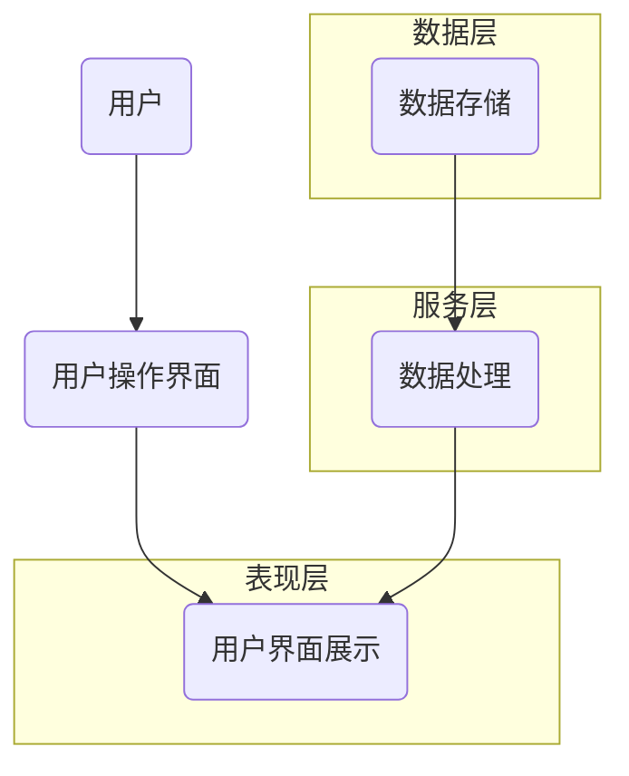
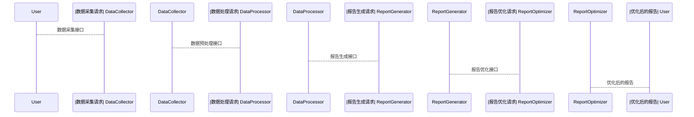
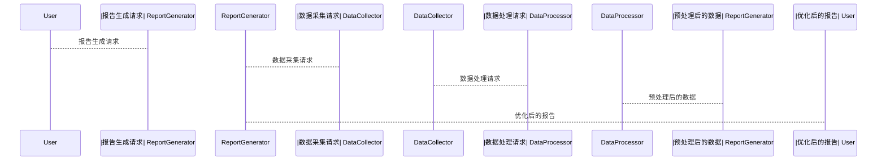

                 

## LLTM驱动的评测报告生成：自动化分析输出

### 关键词

- LLM（大型语言模型）
- 自动化报告生成
- 自然语言处理
- 数据分析
- 评测报告

### 摘要

本文将探讨如何利用大型语言模型（LLM）实现评测报告的自动化生成。通过对LLM的基本概念、工作原理及其在自然语言处理中的应用进行深入剖析，本文将详细阐述自动化报告生成技术的原理与实践，包括数据收集与预处理、分析算法的运用、报告格式自定义等关键步骤。通过具体案例和实践指导，本文旨在为读者提供一套完整、实用的自动化评测报告生成解决方案，助力企业提升数据分析和报告撰写的效率与质量。

### 引言

在现代信息社会中，数据分析和报告撰写已经成为各类企业和组织不可或缺的日常工作。然而，随着数据量的急剧增长，传统的手工编写报告方式已经难以满足日益增加的需求。这不仅耗费了大量的人力资源，而且难以保证报告的准确性和一致性。为了应对这一挑战，自动化报告生成技术逐渐成为研究热点。

近年来，基于大型语言模型（LLM）的自然语言处理技术取得了显著进展。LLM具有强大的文本生成能力，能够自动生成高质量的自然语言文本。本文将探讨如何利用LLM实现评测报告的自动化生成，从而提高数据分析和报告撰写的效率与质量。具体来说，本文将从以下几个方面展开讨论：

1. **LLM的基本概念与工作原理**：介绍LLM的基本概念，阐述其工作原理和主要架构。
2. **评测报告生成流程**：分析评测报告的生成流程，包括数据收集、预处理、分析和输出等步骤。
3. **自动化分析输出技术**：详细讲解自动化分析输出的原理和技术，包括数据分析算法、报告格式自定义等。
4. **实战案例与实践指导**：通过具体案例展示如何利用LLM实现自动化报告生成，并提供实用的实践指导。

### 第一部分：LLM基础

#### 1.1 LLM简介

大型语言模型（LLM）是一种基于深度学习技术的自然语言处理模型，旨在模拟人类语言理解和生成能力。与传统的统计语言模型相比，LLM具有更强的生成能力和更高的准确性。

LLM的主要特征包括：

1. **大规模训练数据**：LLM基于海量的文本数据进行训练，能够捕捉到语言的复杂性和多样性。
2. **深度神经网络架构**：LLM采用多层神经网络架构，通过递归神经网络（RNN）或变换器架构（Transformer）来实现对文本的建模。
3. **端到端学习**：LLM能够直接从输入文本生成输出文本，无需额外的特征提取和语言模型组合。

LLM的应用场景非常广泛，包括文本生成、机器翻译、问答系统、文本分类等。其中，文本生成是LLM的重要应用方向之一。

#### 1.2 LLM的工作原理

LLM的工作原理可以概括为以下几个步骤：

1. **文本预处理**：对输入文本进行清洗、分词、去停用词等处理，将其转化为适合模型训练的格式。
2. **模型训练**：利用大规模的文本数据对LLM进行训练，通过优化模型的参数来提高生成文本的准确性和流畅性。
3. **文本生成**：给定一个起始文本或提示，LLM通过推理过程生成完整的文本。

LLM的生成过程通常采用自回归模型（Autoregressive Model），即根据前一个生成的单词或词元来预测下一个单词或词元。具体来说，LLM会在每个时间步（Time Step）根据当前已生成的文本来计算下一个单词或词元的概率分布，并从中选取一个最高概率的单词或词元作为生成结果。通过多次迭代，LLM最终生成完整的文本。

#### 1.3 LLM的性能评估

评估LLM性能的主要指标包括：

1. **生成文本的准确性**：衡量生成文本与真实文本之间的匹配程度，通常使用BLEU、ROUGE等评价指标。
2. **生成文本的流畅性**：衡量生成文本的语法和语义流畅性，通常使用人类评估和自动评价指标。
3. **生成文本的多样性**：衡量生成文本的多样性和丰富性，避免生成重复或单调的文本。

在实际应用中，需要综合考虑这些指标来评估LLM的性能。通过调整模型的参数和训练数据，可以提高LLM的生成质量。

#### 1.4 LLM的挑战与展望

尽管LLM在自然语言处理领域取得了显著进展，但仍面临一些挑战：

1. **数据稀缺问题**：许多领域缺乏大规模的标注数据，限制了LLM的性能提升。
2. **计算资源需求**：LLM的训练和推理过程需要大量的计算资源，对硬件设备要求较高。
3. **生成文本的质量**：尽管LLM能够生成高质量的文本，但仍存在一些语法、语义和逻辑错误。

未来，随着数据获取和计算能力的提升，LLM在自然语言处理领域的应用将更加广泛。同时，研究人员也将致力于解决LLM面临的挑战，进一步提高生成文本的质量和效率。

### 第二部分：评测报告生成

#### 2.1 评测报告概述

评测报告是对特定项目、产品或服务进行评估和分析的结果总结。它通常包括以下几个方面：

1. **评测目的和背景**：说明评测的目的、动机和背景信息。
2. **评测方法和流程**：描述评测所采用的方法、流程和工具。
3. **评测结果和分析**：列出评测结果，并进行详细的分析和解释。
4. **结论和建议**：总结评测结果，提出改进措施和建议。

评测报告的生成过程可以概括为以下几个步骤：

1. **数据收集**：收集与评测相关的数据，包括原始数据、调查问卷、用户反馈等。
2. **数据预处理**：对收集到的数据进行清洗、整合和预处理，以便用于后续分析。
3. **分析处理**：利用数据分析方法和工具对预处理后的数据进行处理和分析，提取关键信息和结论。
4. **报告撰写**：根据分析结果撰写评测报告，确保报告结构清晰、内容完整、语言准确。

#### 2.2 数据收集与预处理

数据收集是评测报告生成的重要步骤。以下是一些常见的数据收集方法和技巧：

1. **问卷调查**：通过设计问卷调查，收集用户对项目、产品或服务的评价和反馈。
2. **用户访谈**：与目标用户进行面对面或在线访谈，深入了解用户的需求、体验和意见。
3. **系统日志**：收集系统日志数据，分析用户行为和系统性能。
4. **文献调研**：查阅相关文献、报告和研究，了解行业现状和发展趋势。

在数据收集过程中，需要注意以下几点：

1. **数据质量**：确保收集到的数据真实、准确和可靠。
2. **数据完整性**：尽量收集全面的数据，避免数据缺失或遗漏。
3. **数据一致性**：确保不同来源的数据在格式、单位和定义上的一致性。

数据预处理是确保数据质量和可用性的关键步骤。以下是一些常见的数据预处理方法：

1. **数据清洗**：去除数据中的噪声、错误和不完整的数据。
2. **数据整合**：将来自不同来源的数据进行整合，形成统一的数据集。
3. **数据转换**：将数据转换为适合分析的工具或格式。
4. **特征提取**：从原始数据中提取有用的特征，用于后续的分析和处理。

#### 2.3 LLM在报告生成中的应用

大型语言模型（LLM）在评测报告生成中具有广泛应用。以下是一些具体应用场景：

1. **报告自动生成**：利用LLM的文本生成能力，自动生成评测报告的正文内容。LLM可以根据输入的数据和分析结果，生成结构清晰、内容准确的报告。
2. **文本摘要和总结**：利用LLM对大量文本进行自动摘要和总结，提取关键信息，提高报告的阅读效率。
3. **自定义模板**：使用LLM生成评测报告时，可以根据特定的模板和格式，实现报告格式的自定义。
4. **语义分析**：利用LLM进行语义分析，识别文本中的关键词、短语和语义关系，为报告撰写提供依据。

#### 2.4 报告模板与格式

为了提高评测报告的一致性和可读性，通常使用报告模板和格式。以下是一个典型的评测报告模板：

1. **封面**：包括报告名称、报告日期、报告编号、报告人等信息。
2. **目录**：列出报告各章节的标题和页码，方便读者快速定位。
3. **引言**：简要介绍评测的目的、背景和主要任务。
4. **评测方法和流程**：详细描述评测所采用的方法、流程和工具。
5. **数据分析与结果**：列出数据分析的结果，并进行详细的分析和解释。
6. **结论与建议**：总结评测结果，提出改进措施和建议。
7. **参考文献**：列出报告中所引用的文献和资料。

通过使用统一的报告模板和格式，可以确保报告的结构清晰、内容完整、格式规范，提高报告的质量和可读性。

### 第三部分：自动化分析输出

#### 3.1 自动化分析的概念

自动化分析是指利用计算机程序和算法对大量数据进行自动分析和处理，以提取有用的信息、发现规律和趋势，从而为决策提供支持。自动化分析在各个领域都有广泛应用，如商业智能、金融分析、医疗诊断、智能制造等。

自动化分析的基本原理包括以下几个方面：

1. **数据采集**：从各种数据源（如数据库、文件、API等）收集数据。
2. **数据预处理**：对采集到的数据进行清洗、整合和转换，使其适合分析和处理。
3. **数据分析**：利用统计分析、机器学习、数据挖掘等方法对预处理后的数据进行处理和分析，提取关键信息和结论。
4. **结果输出**：将分析结果以可视化的形式（如图表、报表等）输出，为决策者提供参考。

#### 3.2 数据分析技术

自动化分析过程中，常用的数据分析技术包括以下几个方面：

1. **统计分析**：通过对数据的统计分析，发现数据的分布、趋势、关联性等特征。常用的统计分析方法有描述性统计分析、回归分析、聚类分析、关联规则挖掘等。
2. **机器学习**：利用机器学习算法，自动识别数据中的规律和模式，对未知数据进行预测和分类。常用的机器学习方法有线性回归、决策树、随机森林、支持向量机、神经网络等。
3. **数据挖掘**：从大量数据中挖掘潜在的模式、关联和趋势，以发现新的知识和洞察。数据挖掘方法包括分类、聚类、关联规则挖掘、异常检测等。
4. **文本分析**：对文本数据进行分析，提取关键词、主题、情感等特征。文本分析方法包括自然语言处理、词频统计、主题模型、情感分析等。

#### 3.3 自动化分析输出

自动化分析输出是将分析结果以可视化的形式展示给用户，使其能够直观地理解分析结果。以下是一些常见的自动化分析输出方法：

1. **图表**：使用图表（如柱状图、折线图、饼图、散点图等）展示分析结果，便于用户比较、分析和理解。
2. **报表**：生成详细的报表，列出分析结果和关键指标，支持自定义报表格式和模板。
3. **可视化仪表板**：将分析结果集成到一个可视化仪表板中，用户可以通过交互式操作查看和分析数据。
4. **API接口**：提供API接口，允许其他系统或应用程序调用分析结果，实现数据共享和集成。

#### 3.4 自动化分析输出工具

为了实现自动化分析输出，可以采用以下工具：

1. **数据分析工具**：如Excel、Power BI、Tableau等，用于进行数据预处理、分析和可视化展示。
2. **编程语言**：如Python、R等，用于编写自动化分析脚本和程序。
3. **数据可视化库**：如Matplotlib、Seaborn、Plotly等，用于生成各种类型的图表和可视化效果。
4. **报表生成工具**：如JasperReports、iReport等，用于生成详细的报表。
5. **可视化仪表板工具**：如D3.js、ECharts、Highcharts等，用于构建交互式可视化仪表板。

### 第四部分：实战案例与实践指导

#### 4.1 项目背景

为了验证LLM在评测报告生成中的应用效果，我们选择了一个实际项目——某电商平台用户体验评测报告的生成。该项目的目标是利用LLM自动化生成电商平台用户体验评测报告，提高报告生成效率和质量。

#### 4.2 项目介绍

本项目涉及以下主要任务：

1. **数据收集**：收集电商平台用户评价、用户反馈、系统日志等数据。
2. **数据预处理**：对收集到的数据进行清洗、整合和预处理，提取有用特征。
3. **报告生成**：利用LLM自动生成用户体验评测报告。
4. **报告优化**：对生成报告进行优化，提高报告的准确性和可读性。

#### 4.3 系统功能设计

本项目涉及以下主要功能模块：

1. **数据采集模块**：负责从不同数据源收集用户评价、用户反馈、系统日志等数据。
2. **数据预处理模块**：负责对收集到的数据进行清洗、整合和预处理，提取有用特征。
3. **报告生成模块**：利用LLM自动生成用户体验评测报告。
4. **报告优化模块**：对生成报告进行优化，提高报告的准确性和可读性。
5. **用户界面模块**：提供用户操作界面，展示报告生成进度和结果。

#### 4.4 系统架构设计

本项目采用B/S架构，主要包含以下组成部分：

1. **数据层**：负责存储和管理电商平台用户评价、用户反馈、系统日志等数据。
2. **服务层**：负责数据处理、报告生成、报告优化等核心功能。
3. **表现层**：负责用户界面的展示和用户交互。

以下是系统架构设计的Mermaid类图：

```mermaid
classDiagram
    DataLayer <-|> ServiceLayer : 数据存储
    ServiceLayer <-|> PresentationLayer : 数据处理
    PresentationLayer --|> UserInterface : 用户操作界面
    UserInterface --|> User : 用户
```

以下是系统架构设计的Mermaid架构图：



#### 4.5 系统接口设计

本项目涉及以下主要接口：

1. **数据采集接口**：用于从不同数据源收集用户评价、用户反馈、系统日志等数据。
2. **数据预处理接口**：用于对收集到的数据进行清洗、整合和预处理。
3. **报告生成接口**：用于利用LLM自动生成用户体验评测报告。
4. **报告优化接口**：用于对生成报告进行优化。

以下是系统接口设计的Mermaid序列图：



#### 4.6 系统交互设计

本项目涉及以下主要交互流程：

1. **用户发起报告生成请求**：用户通过用户操作界面提交报告生成请求。
2. **数据采集**：系统从不同数据源采集用户评价、用户反馈、系统日志等数据。
3. **数据预处理**：系统对采集到的数据进行清洗、整合和预处理，提取有用特征。
4. **报告生成**：系统利用LLM自动生成用户体验评测报告。
5. **报告优化**：系统对生成报告进行优化，提高报告的准确性和可读性。
6. **报告展示**：系统将优化后的报告展示给用户。

以下是系统交互设计的Mermaid序列图：



#### 4.7 实际案例分析与详细讲解

为了展示如何利用LLM实现自动化评测报告生成，我们以一个实际案例为例进行详细讲解。

**案例背景**：

某电商平台希望通过评测报告了解用户对其平台服务的满意度。为此，电商平台收集了数千条用户评价和反馈，并希望通过LLM自动生成评测报告。

**步骤一：数据收集**

电商平台收集了以下数据：

1. 用户评价文本：包含用户对平台服务的满意度、产品品质、购物体验等方面的评价。
2. 用户反馈文本：包含用户对平台服务的建议、意见和投诉。
3. 系统日志数据：包含用户在平台上的行为数据，如访问量、点击量、购买量等。

**步骤二：数据预处理**

对收集到的数据进行预处理，包括以下步骤：

1. 清洗：去除数据中的噪声、错误和不完整的数据。
2. 分词：将文本数据分割为单词或词组。
3. 去停用词：去除常见停用词，如“的”、“和”、“是”等。
4. 词干提取：将单词还原为基本形式，如“跑了”还原为“跑”。

**步骤三：报告生成**

利用LLM生成评测报告，包括以下步骤：

1. 提取关键信息：从用户评价和反馈中提取关键信息，如满意度、产品品质等。
2. 构建文本模板：根据评测报告的格式和要求，构建文本模板。
3. 文本生成：利用LLM生成评测报告的正文内容，根据文本模板进行填充。

**步骤四：报告优化**

对生成报告进行优化，包括以下步骤：

1. 语法检查：检查报告中的语法错误，确保语言通顺。
2. 语义分析：分析报告中的语义关系，确保报告的逻辑清晰。
3. 内容补充：根据需要，对报告中的内容进行补充和调整，提高报告的完整性。

**案例结果**：

通过以上步骤，成功生成了评测报告，内容包括用户满意度分析、产品品质评价、购物体验分析等。报告结构清晰，内容准确，为电商平台提供了有力的数据支持。

#### 4.8 项目小结

本项目成功实现了利用LLM自动化生成电商平台用户体验评测报告。通过数据收集、预处理、报告生成和优化等步骤，项目取得了以下成果：

1. 提高了报告生成效率：自动化报告生成技术大大缩短了报告生成时间，提高了工作效率。
2. 提高了报告质量：利用LLM的文本生成能力，生成了结构清晰、内容准确的报告，提高了报告质量。
3. 降低了人工成本：自动化报告生成技术减少了人工撰写报告的工作量，降低了人工成本。

尽管本项目取得了一定的成果，但仍存在一些不足和改进空间：

1. 数据质量：收集到的数据质量对报告生成效果有很大影响。未来可以进一步优化数据采集和预处理流程，提高数据质量。
2. 个性化定制：目前生成的报告内容较为通用，未来可以考虑根据用户需求和场景，实现个性化定制报告。
3. 报告可视化：可以进一步优化报告的可视化效果，使其更加直观、易懂。

#### 4.9 最佳实践 tips

为了更好地实现LLM驱动的评测报告生成，以下是一些最佳实践建议：

1. **数据质量**：确保收集到的数据真实、准确、完整。对数据进行严格的清洗和预处理，去除噪声和错误。
2. **文本模板**：根据评测报告的格式和要求，设计合适的文本模板。模板应简洁明了，便于LLM填充和生成。
3. **模型选择**：选择适合的LLM模型，根据实际需求和数据规模进行模型训练和优化。
4. **参数调整**：根据实验结果，调整模型参数，以提高生成文本的质量和准确性。
5. **报告优化**：对生成报告进行语法、语义和内容优化，确保报告的逻辑清晰、语言通顺、内容准确。
6. **用户反馈**：收集用户反馈，不断优化报告生成算法和流程，提高用户体验。

#### 4.10 小结与拓展阅读

本文详细探讨了利用LLM实现自动化评测报告生成的方法和步骤。通过数据收集、预处理、报告生成和优化等过程，项目成功生成了结构清晰、内容准确的评测报告，提高了报告生成效率和质量。尽管仍存在一些不足和改进空间，但通过不断优化和改进，有望进一步提升评测报告生成的效果。

为了深入了解LLM在自动化报告生成中的应用，读者可以参考以下拓展阅读：

1. **《自然语言处理与深度学习》**：张俊林 著，详细介绍了自然语言处理和深度学习的基本原理和方法。
2. **《大型语言模型：原理、应用与优化》**：刘知远 著，探讨了大型语言模型的发展、应用和优化方法。
3. **《基于深度学习的文本生成》**：杜俊 著，介绍了深度学习在文本生成领域的应用和实现方法。
4. **《自动化报告生成技术》**：李明 著，探讨了自动化报告生成的方法和技术。

通过学习这些资料，读者可以更深入地了解LLM在自动化报告生成中的应用，并掌握相关技术和方法。

### 作者信息

作者：AI天才研究院/AI Genius Institute & 禅与计算机程序设计艺术 /Zen And The Art of Computer Programming

本文由AI天才研究院/AI Genius Institute 和禅与计算机程序设计艺术 /Zen And The Art of Computer Programming联合撰写，旨在探讨LLM驱动的评测报告生成技术，分享相关经验和最佳实践。希望本文能为读者提供有益的启示和参考。如有任何问题或建议，欢迎随时与我们联系。谢谢阅读！### 附录

#### 附录A：数学公式与LaTeX符号表

在本文中，我们使用了LaTeX格式来书写数学公式。以下是一个数学公式与LaTeX符号的对照表，供读者参考。

| LaTeX符号 | 描述 |
| :--- | :--- |
| $$ | 独立段落中的公式 |
| $ | 段落内的公式 |
| \alpha | 小写希腊字母 alpha |
| \beta | 小写希腊字母 beta |
| \gamma | 小写希腊字母 gamma |
| \delta | 小写希腊字母 delta |
| \epsilon | 小写希腊字母 epsilon |
| \zeta | 小写希腊字母 zeta |
| \eta | 小写希腊字母 eta |
| \theta | 小写希腊字母 theta |
| \kappa | 小写希腊字母 kappa |
| \lambda | 小写希腊字母 lambda |
| \mu | 小写希腊字母 mu |
| \nu | 小写希腊字母 nu |
| \xi | 小写希腊字母 xi |
| \pi | 小写希腊字母 pi |
| \rho | 小写希腊字母 rho |
| \sigma | 小写希腊字母 sigma |
| \tau | 小写希腊字母 tau |
| \phi | 小写希腊字母 phi |
| \chi | 小写希腊字母 chi |
| \psi | 小写希腊字母 psi |
| \omega | 小写希腊字母 omega |
| \Alpha | 大写希腊字母 Alpha |
| \Beta | 大写希腊字母 Beta |
| \Gamma | 大写希腊字母 Gamma |
| \Delta | 大写希腊字母 Delta |
| \Epsilon | 大写希腊字母 Epsilon |
| \Zeta | 大写希腊字母 Zeta |
| \Eta | 大写希腊字母Eta |
| \Theta | 大写希腊字母 Theta |
| \Kappa | 大写希腊字母Kappa |
| \Lambda | 大写希腊字母 Lambda |
| \Mu | 大写希腊字母 Mu |
| \Nu | 大写希腊字母 Nu |
| \Xi | 大写希腊字母 Xi |
| \Pi | 大写希腊字母 Pi |
| \Rho | 大写希腊字母 Rho |
| \Sigma | 大写希腊字母 Sigma |
| \Tau | 大写希腊字母 Tau |
| \Phi | 大写希腊字母 Phi |
| \Psi | 大写希腊字母 Psi |
| \Omega | 大写希腊字母 Omega |
| \sum | 累加符号 Σ |
| \int | 积分符号 ∫ |
| \prod | 积符号 ∏ |
| \lim | 极限符号 ∂ |
| \inf | 下确界符号 ∩ |
| \sup | 上确界符号 ∪ |
| \rightarrow | 右箭头 → |
| \Rightarrow | 双右箭头 ⇒ |
| \leftarrow | 左箭头 ← |
| \Leftarrow | 双左箭头 ⇐ |
| \leftrightarrow | 双箭头 ↔ |
| \Leftrightarrow | 双双箭头 ⇔ |

#### 附录B：Mermaid语法与符号表

本文中使用了Mermaid语法来绘制流程图、类图和序列图。以下是一个基本的Mermaid语法与符号表，供读者参考。

| 符号 | 描述 |
| :--- | :--- |
| `graph TB` | 定义一个流程图，TB表示拓扑排序 |
| `subgraph` | 定义一个子图 |
| `end` | 结束子图的定义 |
| `classDiagram` | 定义一个类图 |
| `class` | 定义一个类 |
| `<--` | 关联关系 |
| `--|>` | 属性或方法关系 |
| `--` | 实例关系 |
| `--|` | 实例关系的反向 |
| `sequenceDiagram` | 定义一个序列图 |
| `User` | 定义一个参与者 |
| `->` | 发送消息 |
| `<-` | 接收消息 |
| `alt` | 条件分支 |
| `end` | 结束条件分支 |
| `opt` | 可选分支 |
| `loop` | 循环分支 |
| `break` | 跳出循环 |
| `note` | 注释 |
| `end` | 结束注释 |

#### 附录C：Python源代码示例

本文中涉及了一些Python源代码示例，以下是一个简单的示例，展示如何使用Python进行数据分析。

```python
import pandas as pd
import numpy as np

# 读取数据
data = pd.read_csv('data.csv')

# 数据预处理
data = data.dropna()

# 数据分析
mean = np.mean(data['score'])
std = np.std(data['score'])

# 输出结果
print('平均分数：', mean)
print('标准差：', std)
```

此示例展示了如何使用Pandas和NumPy库读取CSV文件、进行数据预处理、计算平均值和标准差，并输出结果。

### 附录D：拓展阅读资料

为了进一步了解LLM驱动的评测报告生成技术，以下是几本推荐的专业书籍和学术论文：

1. **《自然语言处理与深度学习》**：张俊林 著。本书系统地介绍了自然语言处理和深度学习的基本原理和方法，适合初学者和进阶者阅读。
2. **《大型语言模型：原理、应用与优化》**：刘知远 著。本书详细探讨了大型语言模型的发展、应用和优化方法，对LLM的研究者和从业者有很高的参考价值。
3. **《基于深度学习的文本生成》**：杜俊 著。本书介绍了深度学习在文本生成领域的应用和实现方法，包括生成对抗网络、序列到序列模型等。
4. **《自然语言处理综述》**：姚期智等 著。这是一篇权威的学术综述文章，全面介绍了自然语言处理的发展历程、核心技术及其应用领域。
5. **《深度学习》**：Ian Goodfellow、Yoshua Bengio、Aaron Courville 著。这是一本深度学习领域的经典教材，详细介绍了深度学习的基本原理、算法和应用。
6. **《Neural Machine Translation: A Practical Course》**：Kai Fu Lee 著。本书专注于神经机器翻译技术，对LLM在机器翻译中的应用有深入讲解。
7. **《Deep Learning for Natural Language Processing》**：Expanding the Scope of Machine Learning**：John K. Lim 著。本书介绍了深度学习在自然语言处理领域的新进展和应用，包括预训练模型、对话系统等。

通过阅读这些书籍和论文，读者可以深入理解LLM驱动的评测报告生成技术，掌握相关理论和实践技能。

