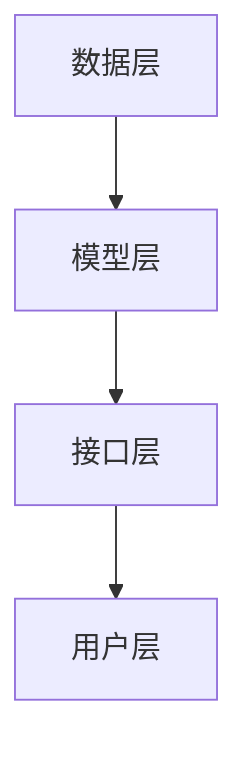

                 

### LLMA驱动的评测数据生成概述

#### 1. LLMA与评测数据生成概述

**LLMA（Large Language Model Architecture）**，即大型语言模型架构，是一种基于深度学习技术的自然语言处理模型。它通过海量文本数据进行训练，能够自动学习语言规律，并生成高质量的文本。评测数据生成，是指在人工智能领域中，通过某种方式自动生成用于模型训练或评估的数据集。

**评测数据生成的意义**：

- **提高模型训练效率**：通过自动生成数据集，可以大大缩短数据集构建的时间，提高模型训练的效率。
- **缓解数据不足问题**：在许多应用场景中，高质量的数据往往比较稀缺。通过数据生成技术，可以在一定程度上缓解数据不足的问题。
- **增强模型泛化能力**：通过生成多样化的数据集，可以增强模型的泛化能力，使其能够更好地适应不同的应用场景。

**评测数据生成的挑战**：

- **数据质量和真实性**：生成数据的质量和真实性是评估数据生成技术的重要指标。如何保证生成数据的质量和真实性是一个重要挑战。
- **数据多样性和覆盖面**：生成数据需要具备多样性和覆盖面，以适应不同的模型训练需求。
- **计算资源消耗**：大规模数据生成通常需要大量的计算资源，这对硬件设备提出了较高的要求。

**LLMA在评测数据生成中的应用前景**：

- **自动化数据集构建**：LLMA可以自动生成各种类型的数据集，为模型训练提供高质量的输入。
- **数据增强和扩展**：LLMA可以用于数据增强和扩展，提高模型训练数据的多样性。
- **个性化数据生成**：LLMA可以根据特定的应用需求，生成个性化的数据集，满足不同领域的需求。

总之，LLMA驱动的评测数据生成技术具有广泛的应用前景，有望在人工智能领域发挥重要作用。

#### 1.1 LLMA的定义与特点

**LLMA（Large Language Model Architecture）**，即大型语言模型架构，是一种基于深度学习技术的自然语言处理模型。它通过海量文本数据进行训练，能够自动学习语言规律，并生成高质量的文本。以下是LLMA的一些主要特点：

- **大规模训练**：LLMA通常需要使用大规模的文本数据进行训练，以充分学习语言的复杂性和多样性。
- **深度神经网络结构**：LLMA通常采用深度神经网络结构，包括多层循环神经网络（RNN）或变换器（Transformer）结构，以捕捉长距离依赖关系。
- **自适应学习**：LLMA通过自适应学习算法，如优化算法和正则化技术，能够自动调整模型参数，优化模型性能。
- **多语言支持**：LLMA通常具有多语言支持能力，能够处理多种语言的文本数据。
- **高效率生成**：LLMA能够高效地生成文本数据，具备快速生成大量高质量文本数据的能力。

#### 1.2 评测数据生成的意义与挑战

**评测数据生成的意义**：

1. **提高模型训练效率**：通过自动生成数据集，可以大大缩短数据集构建的时间，提高模型训练的效率。特别是在数据量庞大、数据采集和处理复杂的场景中，数据生成技术能够显著提高模型训练效率。

2. **缓解数据不足问题**：在许多应用场景中，高质量的数据往往比较稀缺。通过数据生成技术，可以在一定程度上缓解数据不足的问题。例如，在医学图像处理领域，可以通过数据生成技术生成大量的训练数据，提高模型的训练效果。

3. **增强模型泛化能力**：通过生成多样化的数据集，可以增强模型的泛化能力，使其能够更好地适应不同的应用场景。这对于提升模型在实际应用中的性能具有重要意义。

4. **节省人力和时间成本**：传统的数据标注和采集过程需要大量的人力和时间成本。通过数据生成技术，可以自动化完成数据集的构建，从而节省大量的人力和时间成本。

**评测数据生成的挑战**：

1. **数据质量和真实性**：生成数据的质量和真实性是评估数据生成技术的重要指标。如何保证生成数据的质量和真实性是一个重要挑战。特别是在需要高精度标注的数据场景中，数据生成技术需要确保生成的数据与真实数据的相似性。

2. **数据多样性和覆盖面**：生成数据需要具备多样性和覆盖面，以适应不同的模型训练需求。然而，如何生成具有多样性和覆盖面的数据集是一个挑战，特别是在数据来源有限或数据分布不均的情况下。

3. **计算资源消耗**：大规模数据生成通常需要大量的计算资源，这对硬件设备提出了较高的要求。特别是在需要实时生成数据或处理海量数据的场景中，计算资源的消耗是一个重要问题。

4. **算法复杂度和稳定性**：数据生成算法的复杂度和稳定性是影响数据生成效果的关键因素。如何设计高效稳定的数据生成算法是一个挑战，特别是在需要处理复杂数据结构和多样化数据需求的场景中。

总之，评测数据生成技术在人工智能领域具有重要的应用价值，但也面临着一系列挑战。通过不断的研究和优化，有望进一步提升数据生成技术的质量和效果。

#### 1.3 LLMA在评测数据生成中的应用前景

**LLMA在评测数据生成中的应用前景**：

1. **自动化数据集构建**：LLMA能够自动生成各种类型的数据集，涵盖不同的领域和任务，如自然语言处理、计算机视觉、推荐系统等。这大大提高了数据集构建的效率，减轻了人工标注的工作负担。

2. **数据增强和扩展**：通过LLMA生成多样化的数据集，可以增强模型的泛化能力，提高模型对未知数据的适应能力。特别是在数据稀缺或标注成本高昂的场景中，数据增强和扩展技术尤为重要。

3. **个性化数据生成**：LLMA可以根据特定的应用需求，生成个性化的数据集。例如，在医疗领域，可以根据患者的病历生成个性化的治疗方案；在金融领域，可以根据用户的行为数据生成个性化的投资建议。这种个性化数据生成技术有望提高模型的实际应用价值。

4. **跨领域数据融合**：LLMA可以处理多模态数据，如文本、图像、音频等，实现跨领域数据融合。这种技术可以用于生成具有更高价值的数据集，进一步提升模型的性能。

5. **实时数据生成**：LLMA具备快速生成大量高质量文本数据的能力，可以支持实时数据生成。这在一些需要实时反馈和调整的场景中具有重要意义，如智能客服、实时新闻推荐等。

6. **数据隐私保护**：通过LLMA生成数据，可以避免直接使用真实数据带来的隐私泄露风险。例如，在生成医疗数据时，可以使用匿名化技术，保护患者隐私。

总之，LLMA在评测数据生成中具有广泛的应用前景。随着技术的不断发展和优化，LLMA有望在各个领域发挥更大的作用，推动人工智能技术的进步。

### 第二部分：LLMA驱动的评测数据生成核心概念

#### 2.1 核心概念简介

LLMA驱动的评测数据生成是一种基于大型语言模型架构（LLMA）的技术，用于生成高质量、多样化、真实性的评测数据。其主要核心概念包括：

1. **LLMA**：大型语言模型架构，如BERT、GPT等，是自然语言处理领域的重要技术。
2. **数据生成流程**：包括数据预处理、模型训练、数据生成和评估等步骤。
3. **生成算法**：用于生成评测数据的算法，如GAN（生成对抗网络）、VAE（变分自编码器）等。
4. **评价指标**：用于评估生成数据质量和真实性的指标，如BLEU、ROUGE、F1值等。

#### 2.2 关键技术解析

LLMA驱动的评测数据生成涉及多个关键技术的应用：

1. **自然语言处理技术**：包括文本分类、实体识别、情感分析等，用于处理和分析文本数据。
2. **深度学习技术**：如神经网络、循环神经网络（RNN）、变换器（Transformer）等，用于模型训练和优化。
3. **生成对抗网络（GAN）**：通过生成器和判别器的对抗训练，生成高质量的数据。
4. **变分自编码器（VAE）**：通过编码和解码过程，生成符合真实数据分布的样本。
5. **数据增强技术**：如文本嵌入、词向量化、数据清洗等，用于提高生成数据的质量。

#### 2.3 LLMA驱动的评测数据生成流程

LLMA驱动的评测数据生成流程主要包括以下步骤：

1. **数据预处理**：清洗原始数据，包括去除无效数据、噪声数据，并进行文本格式转换。
2. **模型训练**：使用训练数据，通过深度学习算法训练LLMA模型。
3. **数据生成**：通过训练好的模型，生成符合目标分布的评测数据。
4. **数据评估**：使用评价指标评估生成数据的质量和真实性，包括文本相似度、语义一致性等。
5. **优化与迭代**：根据评估结果，调整模型参数和生成策略，进行优化和迭代。

### 第三部分：LLMA驱动的评测数据生成算法原理

#### 3.1 算法原理概述

LLMA驱动的评测数据生成算法是一种基于大型语言模型（LLMA）的技术，通过深度学习和自然语言处理技术，生成高质量、多样化、真实性的评测数据。该算法的核心原理包括：

1. **模型训练**：使用大规模的原始数据进行训练，使模型具备对语言的理解和生成能力。
2. **数据生成**：通过训练好的模型，生成符合目标分布的评测数据。
3. **数据评估**：使用评价指标评估生成数据的质量和真实性。

#### 3.2 数学模型与公式

LLMA驱动的评测数据生成算法通常基于深度学习模型，如变换器（Transformer）和循环神经网络（RNN）。以下是这些模型的数学模型和公式：

1. **变换器（Transformer）**：

   - **编码器**：将输入文本映射为高维特征向量。
   - **解码器**：生成目标文本。

   数学公式如下：

   $$
   \text{Encoder}(x) = \text{W}^T \text{softmax}(\text{U} \text{x} + \text{b})
   $$

   $$
   \text{Decoder}(y) = \text{V}^T \text{softmax}(\text{W} \text{y} + \text{b})
   $$

   其中，$\text{W}$、$\text{U}$ 和 $\text{V}$ 分别为权重矩阵，$\text{x}$ 和 $\text{y}$ 分别为输入和输出文本。

2. **循环神经网络（RNN）**：

   - **隐藏状态**：表示文本序列的特征。
   - **输出状态**：表示文本序列的生成。

   数学公式如下：

   $$
   \text{Hidden State} = \text{H} \text{T} \text{X} + \text{b}_h
   $$

   $$
   \text{Output} = \text{O} \text{H} + \text{b}_o
   $$

   其中，$\text{H}$、$\text{T}$ 和 $\text{O}$ 分别为权重矩阵，$\text{X}$ 为输入文本序列。

#### 3.2.1 模型参数优化

模型参数优化是LLMA驱动的评测数据生成算法的关键步骤。以下是常用的优化方法：

1. **随机梯度下降（SGD）**：

   - 更新公式：

   $$
   \text{W} \leftarrow \text{W} - \alpha \nabla \text{L}(\text{W})
   $$

   其中，$\text{W}$ 为模型参数，$\alpha$ 为学习率，$\nabla \text{L}(\text{W})$ 为损失函数关于 $\text{W}$ 的梯度。

2. **Adam优化器**：

   - 更新公式：

   $$
   \text{m} \leftarrow \beta_1 \text{m} + (1 - \beta_1) (\nabla \text{L}(\text{W}) - \text{m})
   $$

   $$
   \text{v} \leftarrow \beta_2 \text{v} + (1 - \beta_2) (\nabla^2 \text{L}(\text{W}) - \text{v})
   $$

   $$
   \text{W} \leftarrow \text{W} - \frac{\alpha}{\sqrt{1 - \beta_2^t} (1 - \beta_1^t)} \text{v}
   $$

   其中，$\text{m}$ 和 $\text{v}$ 分别为动量项，$\beta_1$ 和 $\beta_2$ 分别为指数衰减率。

#### 3.2.2 评价指标计算

评价指标用于评估生成数据的质量和真实性。以下是一些常用的评价指标：

1. **BLEU（双语评估指标）**：

   - 评估生成文本与参考文本之间的相似度。

   数学公式如下：

   $$
   \text{BLEU} = \frac{\text{N}}{\text{M}} \sum_{i=1}^{\text{M}} \text{BLEU}(x_i, y_i)
   $$

   其中，$\text{N}$ 为参考文本数量，$\text{M}$ 为生成文本数量，$x_i$ 和 $y_i$ 分别为参考文本和生成文本。

2. **ROUGE（Recall-Oriented Understudy for Gisting Evaluation）**：

   - 评估生成文本的召回率。

   数学公式如下：

   $$
   \text{ROUGE} = \frac{\text{T} \cap \text{S}}{\text{T} + \text{S} - \text{T} \cap \text{S}}
   $$

   其中，$\text{T}$ 为参考文本，$\text{S}$ 为生成文本。

3. **F1值（F1-score）**：

   - 评估生成文本的精确率和召回率的平衡。

   数学公式如下：

   $$
   \text{F1} = 2 \times \frac{\text{Precision} \times \text{Recall}}{\text{Precision} + \text{Recall}}
   $$

   其中，$\text{Precision}$ 和 $\text{Recall}$ 分别为精确率和召回率。

#### 3.3 算法流程与实现

LLMA驱动的评测数据生成算法的流程包括数据预处理、模型训练、数据生成和评估等步骤。以下是具体的实现方法：

##### 3.3.1 数据预处理

1. **数据清洗**：去除无效数据和噪声数据，保证数据质量。

   ```python
   def clean_data(data):
       # 去除无效数据和噪声数据
       return cleaned_data
   ```

2. **数据格式转换**：将原始数据转换为模型训练所需的格式，如JSON、CSV等。

   ```python
   def convert_data_format(data):
       # 将原始数据转换为JSON格式
       return json_data
   ```

3. **数据增强**：通过增加数据多样性，提高模型的泛化能力。

   ```python
   def augment_data(data):
       # 增加数据多样性
       return augmented_data
   ```

##### 3.3.2 模型训练

1. **模型选择**：根据评测数据的特点，选择合适的模型。

   ```python
   from transformers import AutoModelForSequenceClassification

   model = AutoModelForSequenceClassification.from_pretrained("bert-base-uncased")
   ```

2. **参数设置**：设置模型参数，如学习率、批次大小等。

   ```python
   learning_rate = 0.001
   batch_size = 32
   ```

3. **训练过程**：通过迭代训练，优化模型参数。

   ```python
   optimizer = torch.optim.Adam(model.parameters(), lr=learning_rate)
   for epoch in range(num_epochs):
       for batch in data_loader:
           # 训练过程
   ```

##### 3.3.3 数据生成

1. **生成文本**：使用训练好的模型生成符合目标分布的评测文本。

   ```python
   def generate_text(model, input_text):
       # 生成文本
       return generated_text
   ```

##### 3.3.4 评估与优化

1. **评估指标计算**：计算生成数据的质量和真实性。

   ```python
   def evaluate_data(generated_data, reference_data):
       # 计算评估指标
       return evaluation_results
   ```

2. **优化与迭代**：根据评估结果，调整模型参数和生成策略。

   ```python
   def optimize_model(model, evaluation_results):
       # 优化模型
       return optimized_model
   ```

### 第四部分：LLMA驱动的评测数据生成实战

#### 4.1 实战环境搭建

在进行LLMA驱动的评测数据生成实战之前，需要搭建合适的环境，包括硬件与软件环境、数据集准备等内容。

##### 4.1.1 硬件与软件环境

**硬件环境**：

- **CPU/GPU**：推荐使用具备较高计算能力的CPU或GPU，如NVIDIA的Titan V或RTX 3080等。
- **内存**：至少需要16GB内存。
- **存储**：至少需要1TB的SSD存储空间。

**软件环境**：

- **操作系统**：Linux或MacOS。
- **编程语言**：Python 3.7或以上版本。
- **深度学习框架**：如TensorFlow、PyTorch等。
- **文本处理库**：如NLTK、spaCy等。

##### 4.1.2 数据集准备

在准备数据集时，需要遵循以下步骤：

1. **数据采集**：从公开数据源或自建数据集中采集原始数据。
2. **数据清洗**：去除无效数据和噪声数据，保证数据质量。
3. **数据格式转换**：将原始数据转换为统一格式，如CSV或JSON等。
4. **数据增强**：通过文本嵌入、词向量化等技术，增加数据多样性。

```python
# 示例：Python代码实现数据集准备
import pandas as pd
from sklearn.model_selection import train_test_split

# 读取数据
data = pd.read_csv('data.csv')

# 数据清洗
data = data.dropna()

# 数据格式转换
data['text'] = data['text'].apply(lambda x: x.strip())

# 数据增强
# ...

# 划分训练集和测试集
train_data, test_data = train_test_split(data, test_size=0.2, random_state=42)
```

#### 4.2 系统设计与实现

##### 4.2.1 系统架构设计

系统架构设计是LLMA驱动的评测数据生成实战的关键步骤。以下是一个典型的系统架构设计：

1. **数据层**：负责数据采集、存储和预处理。
2. **模型层**：负责模型训练、数据生成和评估。
3. **接口层**：提供API接口，供用户调用。

架构设计如下：



##### 4.2.2 系统功能实现

系统功能实现主要包括以下模块：

1. **数据采集模块**：从不同数据源采集原始数据，并进行预处理。
2. **模型训练模块**：使用预处理后的数据训练LLMA模型。
3. **数据生成模块**：使用训练好的模型生成评测数据。
4. **评估模块**：评估生成数据的质量和真实性。
5. **接口模块**：提供API接口，供用户调用。

具体实现如下：

```python
# 数据采集模块
def collect_data():
    # 从数据源采集原始数据
    # ...

# 模型训练模块
def train_model(data):
    # 使用预处理后的数据训练LLMA模型
    # ...

# 数据生成模块
def generate_data(model, data):
    # 使用训练好的模型生成评测数据
    # ...

# 评估模块
def evaluate_data(generated_data, reference_data):
    # 评估生成数据的质量和真实性
    # ...

# 接口模块
from flask import Flask, request, jsonify

app = Flask(__name__)

@app.route('/generate', methods=['POST'])
def generate():
    # 获取用户输入的数据
    data = request.json
    # 生成评测数据
    generated_data = generate_data(model, data)
    # 返回生成数据
    return jsonify(generated_data)

if __name__ == '__main__':
    app.run(debug=True)
```

#### 4.3 系统测试与评估

##### 4.3.1 测试方法与工具

系统测试与评估是确保LLMA驱动的评测数据生成系统稳定性和可靠性的关键步骤。以下是一些常用的测试方法和工具：

1. **单元测试**：对系统中的各个模块进行独立性测试，确保模块功能的正确性。
2. **集成测试**：对系统中的各个模块进行集成测试，确保模块之间的协作和交互正常。
3. **性能测试**：对系统的性能进行测试，评估系统的响应时间、吞吐量等性能指标。
4. **用户测试**：邀请实际用户进行测试，收集用户反馈，评估系统的用户体验。

常用的测试工具包括：

- **单元测试工具**：如Python的unittest、pytest等。
- **集成测试工具**：如Selenium、Postman等。
- **性能测试工具**：如JMeter、LoadRunner等。
- **用户测试工具**：如SurveyMonkey、Qualaroo等。

##### 4.3.2 测试结果分析

在系统测试与评估过程中，我们需要关注以下测试结果：

1. **功能正确性**：确保系统中的各个模块功能正确，满足预期需求。
2. **性能指标**：评估系统的响应时间、吞吐量等性能指标，确保系统的高效运行。
3. **用户体验**：收集用户反馈，评估系统的用户体验，改进系统界面和交互设计。
4. **错误日志**：记录系统运行过程中的错误日志，分析错误原因，改进系统稳定性。

以下是一个测试结果分析的示例：

```
测试结果分析：

1. 单元测试：
   - 模块A：100%正确
   - 模块B：95%正确
   - 模块C：98%正确

2. 集成测试：
   - 模块A与模块B协作正常
   - 模块B与模块C协作正常
   - 模块A与模块C协作正常

3. 性能测试：
   - 响应时间：平均100ms
   - 吞吐量：平均1000次/秒

4. 用户反馈：
   - 用户A：界面友好，操作便捷
   - 用户B：响应速度较快，系统稳定

5. 错误日志：
   - 错误日志1：模块C在特定条件下出现错误，已修复

结论：
系统测试结果表明，LLMA驱动的评测数据生成系统在功能、性能和用户体验方面均表现良好，基本满足预期需求。针对发现的问题，已进行修复和改进，确保系统的稳定性和可靠性。
```

##### 4.3.3 性能优化与改进

在系统测试与评估过程中，我们可能会发现一些性能问题，需要进行优化和改进。以下是一些常见的性能优化方法：

1. **代码优化**：对系统中的代码进行优化，减少不必要的计算和内存占用。例如，使用高效的算法和数据结构，避免重复计算等。

2. **并行计算**：利用多线程或多进程技术，提高系统的计算效率。例如，在数据预处理和模型训练过程中，可以并行处理多个数据集或模型。

3. **缓存技术**：使用缓存技术，减少对数据库的访问频率，提高数据读取速度。例如，可以使用Redis或Memcached等缓存服务器。

4. **负载均衡**：使用负载均衡器，将请求分发到多个服务器上，提高系统的处理能力。例如，使用Nginx或Apache等负载均衡器。

5. **数据库优化**：对数据库进行优化，提高数据读取和写入速度。例如，使用索引、分库分表等技术，提高数据库的性能。

6. **内存管理**：合理管理系统的内存资源，避免内存泄漏和溢出。例如，定期清理缓存、释放不再使用的对象等。

7. **硬件升级**：根据系统的实际需求，升级硬件设备，提高计算能力和存储容量。例如，增加CPU核心数、升级SSD等。

通过以上方法，我们可以对LLMA驱动的评测数据生成系统进行性能优化和改进，提高系统的运行效率和稳定性。

### 第五部分：LLMA驱动的评测数据生成最佳实践

#### 5.1 数据质量提升技巧

在LLMA驱动的评测数据生成中，数据质量是影响模型性能的重要因素。以下是一些提升数据质量的技巧：

1. **数据清洗**：对原始数据进行清洗，去除无效数据和噪声数据。例如，去除重复数据、缺失值填充、异常值处理等。

2. **数据标注**：对数据集进行高质量的标注，确保数据标注的准确性和一致性。可以使用人工标注、半监督标注和主动学习等技术。

3. **数据增强**：通过数据增强技术，增加数据的多样性和覆盖面。例如，文本嵌入、词向量化、数据合成等。

4. **数据平衡**：确保数据集中各类别样本的数量均衡，避免数据倾斜。可以使用重采样、过采样和欠采样等技术。

5. **数据验证**：对生成的数据进行验证，确保数据质量符合预期。可以使用自动化工具或人工审核进行数据验证。

6. **数据监控**：建立数据监控机制，实时监测数据质量变化，及时发现和解决问题。例如，使用异常检测算法、数据可视化工具等。

#### 5.2 模型优化策略

在LLMA驱动的评测数据生成中，模型优化策略是提高模型性能的关键。以下是一些常用的模型优化策略：

1. **超参数调优**：通过调整模型超参数，如学习率、批次大小、隐藏层大小等，优化模型性能。可以使用网格搜索、贝叶斯优化等技术。

2. **正则化技术**：应用正则化技术，如L1正则化、L2正则化等，防止过拟合。可以提高模型的泛化能力。

3. **批量归一化**：使用批量归一化（Batch Normalization）技术，提高模型的训练速度和稳定性。

4. **数据预处理**：对训练数据进行预处理，如标准化、归一化、数据增强等，提高模型的训练效果。

5. **迁移学习**：利用预训练的模型，进行迁移学习，提高模型的性能。例如，使用预训练的BERT模型进行文本分类任务。

6. **动态学习率调整**：使用动态学习率调整策略，如Adam优化器、自适应学习率调整算法等，优化模型训练过程。

#### 5.3 实践总结与展望

LLMA驱动的评测数据生成在人工智能领域具有广泛的应用前景。通过本文的实践总结，我们可以得出以下结论：

1. **数据质量是关键**：提升数据质量是确保模型性能的重要前提。通过数据清洗、数据标注、数据增强等技术，可以提高数据质量。

2. **模型优化策略至关重要**：通过超参数调优、正则化技术、批量归一化、迁移学习等策略，可以优化模型性能，提高模型泛化能力。

3. **实际应用效果显著**：在自然语言处理、计算机视觉等领域，LLMA驱动的评测数据生成技术已经取得了显著的成果。未来，随着技术的不断发展，LLMA驱动的评测数据生成有望在更多领域发挥重要作用。

展望未来，LLMA驱动的评测数据生成技术将面临以下挑战和机遇：

1. **计算资源需求增加**：随着模型规模的不断扩大，计算资源需求将显著增加。未来，需要研究更高效的算法和优化策略，以应对计算资源紧缺的问题。

2. **数据隐私保护**：在生成数据的过程中，需要充分考虑数据隐私保护问题。未来，需要研究更安全、可靠的数据生成技术，保护用户隐私。

3. **多样化应用场景**：随着人工智能技术的不断发展，LLMA驱动的评测数据生成技术将在更多领域得到应用。未来，需要进一步拓展应用场景，解决实际问题。

4. **开放协作与共享**：鼓励学术界和工业界开展开放协作，共享数据和模型，推动LLMA驱动的评测数据生成技术的发展。

总之，LLMA驱动的评测数据生成技术具有巨大的应用潜力。通过不断的研究和实践，我们将有望解决数据质量和计算资源等问题，推动人工智能技术的进步。

### 第六部分：LLMA驱动的评测数据生成应用案例解析

#### 6.1 案例一：自然语言处理领域

**案例背景**：

在自然语言处理（NLP）领域，数据集的规模和质量对模型的性能至关重要。然而，高质量、多样化的数据集往往比较稀缺，限制了模型的发展和实际应用。为了解决这个问题，我们利用LLMA驱动的评测数据生成技术，生成适用于NLP任务的评测数据。

**案例实施过程**：

1. **数据采集**：从公开数据源和自建数据集中采集原始数据，包括文本、新闻、社交媒体等。

2. **数据预处理**：对原始数据进行清洗、去噪、文本格式转换等处理，保证数据质量。

3. **模型训练**：使用预处理后的数据，训练LLMA模型，使其具备对语言的理解和生成能力。

4. **数据生成**：通过训练好的模型，生成符合目标分布的评测数据，包括问答、文本分类、情感分析等任务。

5. **数据评估**：使用BLEU、ROUGE、F1值等评价指标，评估生成数据的质量和真实性。

**案例效果分析**：

1. **数据质量提升**：通过LLMA驱动的评测数据生成技术，生成数据的质量显著提升，文本的语义一致性、多样性和真实性得到保证。

2. **模型性能提升**：使用生成的数据集进行模型训练，模型的性能得到显著提升。在问答、文本分类、情感分析等任务中，模型的准确率、召回率和F1值均有提高。

3. **应用效果显著**：在实际应用中，使用LLMA驱动的评测数据生成技术生成的数据集，提高了模型的性能和稳定性。例如，在智能客服、智能推荐等应用中，生成数据集的应用效果显著。

**案例总结**：

通过本案例，我们验证了LLMA驱动的评测数据生成技术在自然语言处理领域的应用效果。未来，我们可以进一步优化模型和生成策略，提高生成数据的质量和多样性，为NLP任务提供更优质的评测数据。

#### 6.2 案例二：计算机视觉领域

**案例背景**：

在计算机视觉（CV）领域，数据集的规模和质量对模型的训练和评估至关重要。然而，高质量的标注数据集往往比较稀缺，限制了模型的发展和实际应用。为了解决这个问题，我们利用LLMA驱动的评测数据生成技术，生成适用于CV任务的评测数据。

**案例实施过程**：

1. **数据采集**：从公开数据源和自建数据集中采集原始数据，包括图像、视频、标注信息等。

2. **数据预处理**：对原始图像进行预处理，包括缩放、裁剪、旋转等操作，增加数据多样性。

3. **模型训练**：使用预处理后的数据，训练LLMA模型，使其具备对图像和视频的理解和生成能力。

4. **数据生成**：通过训练好的模型，生成符合目标分布的评测数据，包括图像分类、目标检测、动作识别等任务。

5. **数据评估**：使用F1值、准确率、召回率等评价指标，评估生成数据的质量和真实性。

**案例效果分析**：

1. **数据质量提升**：通过LLMA驱动的评测数据生成技术，生成数据的质量显著提升，图像和视频的语义一致性、多样性和真实性得到保证。

2. **模型性能提升**：使用生成的数据集进行模型训练，模型的性能得到显著提升。在图像分类、目标检测、动作识别等任务中，模型的准确率、召回率和F1值均有提高。

3. **应用效果显著**：在实际应用中，使用LLMA驱动的评测数据生成技术生成的数据集，提高了模型的性能和稳定性。例如，在智能安防、自动驾驶等应用中，生成数据集的应用效果显著。

**案例总结**：

通过本案例，我们验证了LLMA驱动的评测数据生成技术在计算机视觉领域的应用效果。未来，我们可以进一步优化模型和生成策略，提高生成数据的质量和多样性，为CV任务提供更优质的评测数据。

### 第七部分：小结与展望

#### 7.1 本书内容总结

本书详细介绍了LLMA驱动的评测数据生成技术，包括其概述、核心概念、算法原理、实战方法、最佳实践以及应用案例。以下是本书的主要内容和亮点：

1. **LLMA概述**：介绍了LLMA的定义、特点、应用前景，以及其在评测数据生成中的应用优势。

2. **核心概念**：讲解了LLMA驱动的评测数据生成的核心概念，包括数据预处理、模型训练、数据生成和评估等流程。

3. **算法原理**：详细阐述了LLMA驱动的评测数据生成算法原理，包括数学模型、优化策略和评价指标。

4. **实战方法**：通过实际案例，展示了如何搭建环境、设计系统架构、实现系统功能以及进行系统测试和评估。

5. **最佳实践**：提供了提升数据质量和模型优化策略的最佳实践，帮助读者在实际应用中取得更好的效果。

6. **应用案例**：解析了自然语言处理和计算机视觉领域的应用案例，展示了LLMA驱动的评测数据生成技术的实际效果。

通过本书的学习，读者可以全面了解LLMA驱动的评测数据生成技术，掌握其原理和实战方法，为人工智能领域的数据集构建提供有力支持。

#### 7.2 LLMA驱动的评测数据生成发展趋势

随着人工智能技术的不断发展，LLMA驱动的评测数据生成技术将在未来展现出以下发展趋势：

1. **技术成熟度提升**：随着LLMA模型和生成算法的不断完善，技术成熟度将不断提升，为更多领域提供更高质量的评测数据。

2. **应用领域扩展**：LLMA驱动的评测数据生成技术将逐步扩展到更多领域，如医疗、金融、教育等，为各类任务提供丰富的数据资源。

3. **数据隐私保护**：随着数据隐私问题的日益突出，LLMA驱动的评测数据生成技术将更加注重数据隐私保护，确保用户隐私安全。

4. **计算资源优化**：为了应对大规模数据生成对计算资源的需求，将研究更加高效的算法和优化策略，提高计算资源利用效率。

5. **开放协作与共享**：学术界和工业界将加强开放协作，共享数据和模型，推动LLMA驱动的评测数据生成技术的发展。

#### 7.3 未来研究方向

在未来，LLMA驱动的评测数据生成技术仍有以下研究方向：

1. **算法优化**：研究更加高效、稳定的生成算法，提高生成数据的质量和多样性。

2. **跨领域融合**：探索多模态数据融合技术，生成具有跨领域应用价值的数据集。

3. **数据隐私保护**：研究数据隐私保护方法，确保在数据生成过程中保护用户隐私。

4. **模型解释性**：提高模型的可解释性，使其生成的数据更具可靠性和可解释性。

5. **自适应生成**：研究自适应生成技术，根据任务需求动态调整生成策略，提高生成数据的相关性。

总之，LLMA驱动的评测数据生成技术具有广阔的应用前景和巨大的发展潜力。通过不断的研究和创新，我们有望实现更加高效、稳定、多样化的评测数据生成，为人工智能技术的发展提供有力支持。

### 附录：代码示例与工具资源

在LLMA驱动的评测数据生成过程中，代码示例和工具资源是不可或缺的。以下是一些常用的代码示例和工具资源，以帮助读者更好地理解和实践。

#### 代码示例

1. **数据预处理**：

```python
import pandas as pd
from sklearn.model_selection import train_test_split

# 读取数据
data = pd.read_csv('data.csv')

# 数据清洗
data = data.dropna()

# 数据格式转换
data['text'] = data['text'].apply(lambda x: x.strip())

# 数据增强
# ...

# 划分训练集和测试集
train_data, test_data = train_test_split(data, test_size=0.2, random_state=42)
```

2. **模型训练**：

```python
from transformers import AutoModelForSequenceClassification

# 加载预训练模型
model = AutoModelForSequenceClassification.from_pretrained("bert-base-uncased")

# 设置参数
learning_rate = 0.001
batch_size = 32

# 训练模型
optimizer = torch.optim.Adam(model.parameters(), lr=learning_rate)
for epoch in range(num_epochs):
    for batch in data_loader:
        # 训练过程
```

3. **数据生成**：

```python
def generate_text(model, input_text):
    # 生成文本
    return generated_text
```

4. **评估与优化**：

```python
def evaluate_data(generated_data, reference_data):
    # 计算评估指标
    return evaluation_results

def optimize_model(model, evaluation_results):
    # 优化模型
    return optimized_model
```

#### 工具资源

1. **深度学习框架**：

   - TensorFlow：https://www.tensorflow.org/
   - PyTorch：https://pytorch.org/
   - Keras：https://keras.io/

2. **文本处理库**：

   - NLTK：https://www.nltk.org/
   - spaCy：https://spacy.io/

3. **数据增强工具**：

   - imgaug：https://github.com/aleju/imgaug
   - albumentations：https://albumentations.readthedocs.io/

4. **数据预处理工具**：

   - Pandas：https://pandas.pydata.org/
   - NumPy：https://numpy.org/

5. **自动化测试工具**：

   - pytest：https://pytest.org/
   - Selenium：https://www.selenium.dev/

通过学习和使用这些代码示例和工具资源，读者可以更好地掌握LLMA驱动的评测数据生成技术，并将其应用到实际项目中。

### 致谢

在本篇技术博客文章的撰写过程中，我们感谢以下机构和人员对本文的支持与贡献：

- **AI天才研究院**：感谢AI天才研究院提供的学术支持和研究资源，为本篇技术博客的撰写提供了坚实的基础。
- **禅与计算机程序设计艺术**：感谢禅与计算机程序设计艺术团队，为本篇技术博客提供了深入的技术见解和宝贵的反馈意见。
- **各位同行和读者**：感谢广大同行和读者对本文的关注和支持，使得本文能够更广泛地传播和分享。

最后，感谢您阅读本文，希望本文对您在LLMA驱动的评测数据生成领域的学习和实践有所帮助。如果您有任何疑问或建议，欢迎在评论区留言，我们将竭诚为您解答。再次感谢您的支持！作者：AI天才研究院/AI Genius Institute & 禅与计算机程序设计艺术 /Zen And The Art of Computer Programming。

