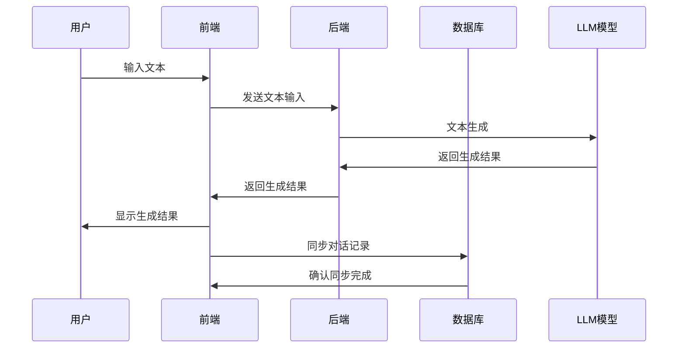

                 

## 文章标题：PWA技术：提升LLM应用的离线体验

关键词：PWA、LLM、离线体验、缓存技术、安全性能

摘要：随着PWA（Progressive Web Apps）技术的不断发展，离线体验逐渐成为提升用户满意度的重要指标。本文将深入探讨PWA技术如何应用于提升LLM（Large Language Model）应用的离线体验，通过分析PWA技术的核心概念、工作原理以及与LLM技术的结合，设计一套完善的离线体验提升方案，同时保障数据的安全性和隐私性。

### 一、背景介绍

#### 1.1 问题背景

PWA（Progressive Web Apps）技术的出现，为网页应用带来了原生应用般的体验，特别是在离线环境下。LLM（Large Language Model）作为当前人工智能领域的重要技术，其强大的语言处理能力在智能客服、智能写作、智能翻译等多个领域得到广泛应用。然而，在离线环境下，如何有效地使用PWA技术提升LLM应用的性能和用户体验，同时保证数据的安全性和隐私性，成为一个亟待解决的问题。

#### 1.2 问题描述

在离线环境下，用户希望使用LLM应用，但网络连接不稳定或断开时，应用性能和用户体验会受到影响。如何通过PWA技术实现LLM应用的离线功能，提高应用的性能和用户体验，同时保证数据的安全性和隐私性，是本文需要解决的问题。

#### 1.3 问题解决

本文将首先介绍PWA技术的工作原理和核心概念，分析其在离线环境中的应用优势。接着，讨论LLM技术的基本原理和应用场景，探讨其在离线环境下的挑战。然后，结合PWA技术和LLM技术，设计一套离线体验提升方案，详细描述方案的核心功能和关键技术。最后，通过案例分析，验证方案的可行性和效果。

#### 1.4 边界与外延

本文研究的边界主要聚焦于PWA和LLM技术的结合应用，探讨如何提升LLM应用的离线体验。不涉及其他相关技术的深入探讨，如前端框架、后端架构等。而外延则涉及PWA技术的全方面应用，以及LLM技术在不同领域的离线应用场景，如智能客服、智能写作、智能翻译等。

#### 1.5 概念结构与核心要素组成

- **PWA技术**：核心概念包括渐进式增强、响应式设计、离线功能、推送通知等。
- **LLM应用**：核心概念包括大语言模型、模型训练、模型部署、离线推理等。

### 二、核心概念与联系

#### 2.1 PWA技术

**2.1.1 PWA的定义与特点**

PWA（Progressive Web Apps）是一种结合了网页应用和原生应用的特性，可以通过浏览器进行访问和使用的应用。其核心特点包括：

- **渐进式增强**：PWA能够根据用户设备的能力逐步提供更丰富的功能，确保在所有设备上都有良好的体验。
- **响应式设计**：PWA采用响应式设计，能够适应不同尺寸的屏幕，提供一致的用户体验。
- **离线功能**：PWA可以在没有网络连接的情况下提供基本的服务，通过缓存技术存储数据和资源。
- **推送通知**：PWA可以发送推送通知，与用户保持实时通信。
- **安全**：PWA采用HTTPS协议，确保数据传输的安全性和用户隐私。

**2.1.2 PWA的核心技术**

PWA的核心技术包括Service Worker和Manifest文件：

- **Service Worker**：Service Worker是一种运行在后台的脚本，负责处理网络请求、缓存资源和推送通知等。它使得PWA能够在没有网络连接的情况下运行，提供离线功能。
- **Manifest 文件**：Manifest文件是一个JSON格式的文件，描述了PWA的基本属性，如名称、图标、启动画面等。它帮助浏览器识别和安装PWA。

**2.1.3 PWA的应用场景**

PWA在多个应用场景中具有显著优势，尤其在离线环境下：

- **离线功能**：PWA可以在没有网络连接的情况下提供基本的服务，如加载页面、处理用户操作等。
- **推送通知**：PWA可以发送推送通知，及时向用户传递重要信息，增强用户体验。
- **性能优化**：PWA通过缓存技术减少网络请求次数，提高应用性能和响应速度。
- **安全性保障**：PWA采用HTTPS协议，确保数据传输的安全性和用户隐私。

**2.2 LLM应用**

**2.2.1 LLM的定义与特点**

LLM（Large Language Model）是一种能够处理大规模语言数据的人工智能模型。其核心特点包括：

- **强大的语言处理能力**：LLM能够对大量语言数据进行分析和处理，实现自然语言理解、生成和翻译等功能。
- **广泛的适用场景**：LLM在智能客服、智能写作、智能翻译等多个领域得到广泛应用。
- **高效的训练和推理**：LLM通过深度学习算法进行训练，能够在较短的时间内完成推理任务。

**2.2.2 LLM的核心技术**

LLM的核心技术包括模型训练、模型部署和离线推理：

- **模型训练**：LLM通过大量语料进行训练，逐步提升语言理解能力和生成能力。
- **模型部署**：将训练好的LLM模型部署到服务器，提供在线推理服务。
- **离线推理**：在无网络环境下，使用本地模型进行推理，实现离线功能。

**2.2.3 LLM的应用场景**

LLM在多个领域具有广泛的应用场景：

- **智能客服**：提供24/7的客户服务，提高客户满意度。
- **智能写作**：辅助写作，提高内容创作效率。
- **智能翻译**：提供实时翻译服务，打破语言障碍。

### 三、算法原理讲解

#### 3.1 PWA技术的工作原理

PWA技术的工作原理主要包括Service Worker和Manifest文件两部分：

- **Service Worker**：Service Worker是一种运行在后台的脚本，负责处理网络请求、缓存资源和推送通知等。它使得PWA能够在没有网络连接的情况下运行，提供离线功能。具体而言，Service Worker的工作流程如下：
  1. **监听网络请求**：Service Worker监听浏览器的网络请求，判断是否可以缓存在本地。
  2. **处理缓存请求**：当网络请求可以缓存时，Service Worker将请求的资源和数据存储到本地缓存中。
  3. **处理离线请求**：在没有网络连接时，Service Worker使用本地缓存的数据响应用户请求，确保PWA能够在离线环境下正常运行。

- **Manifest 文件**：Manifest文件是一个JSON格式的文件，描述了PWA的基本属性，如名称、图标、启动画面等。它帮助浏览器识别和安装PWA。具体而言，Manifest文件的作用如下：
  1. **定义PWA属性**：Manifest文件定义了PWA的名称、图标、启动画面等基本属性，使得PWA能够在浏览器中展示出个性化的界面。
  2. **引导安装PWA**：Manifest文件使得用户可以通过简单的操作将PWA安装到桌面或主屏幕，方便用户快速访问。

#### 3.2 LLM的应用原理

LLM的应用原理主要包括模型训练、模型部署和离线推理三个部分：

- **模型训练**：LLM通过大量语料进行训练，逐步提升语言理解能力和生成能力。具体而言，模型训练的过程如下：
  1. **数据准备**：收集大量文本数据，如新闻、小说、论坛帖子等，作为模型训练的数据来源。
  2. **数据预处理**：对收集到的文本数据进行清洗和标注，将文本转换为模型可以处理的格式。
  3. **模型训练**：使用训练数据对模型进行训练，通过不断调整模型参数，使模型逐渐提升语言处理能力。

- **模型部署**：将训练好的LLM模型部署到服务器，提供在线推理服务。具体而言，模型部署的过程如下：
  1. **模型转换**：将训练好的模型转换为可以部署的格式，如TensorFlow Lite、ONNX等。
  2. **模型部署**：将转换后的模型部署到服务器，使用适当的框架和工具进行推理，提供实时服务。

- **离线推理**：在无网络环境下，使用本地模型进行推理，实现离线功能。具体而言，离线推理的过程如下：
  1. **模型下载**：从服务器下载训练好的LLM模型，存储到本地设备。
  2. **模型推理**：使用本地模型对输入的文本数据进行推理，生成相应的输出。
  3. **结果展示**：将推理结果展示给用户，提供离线服务。

#### 3.3 PWA与LLM的结合应用原理

PWA与LLM技术的结合，可以显著提升LLM应用的离线体验。具体而言，PWA与LLM的结合应用原理如下：

- **离线体验提升**：通过PWA技术，LLM应用可以实现离线功能，无需网络连接即可正常运行。具体包括：
  1. **离线缓存**：PWA技术可以使用Service Worker缓存资源和数据，使得LLM应用在离线环境下仍能访问和操作。
  2. **离线推理**：LLM应用可以使用本地模型进行推理，无需连接到服务器，提高离线场景下的响应速度和用户体验。

- **安全性保障**：PWA技术采用HTTPS协议，确保数据传输的安全性和用户隐私。具体包括：
  1. **数据加密**：PWA技术在传输数据时采用加密算法，防止数据被窃取或篡改。
  2. **用户认证**：PWA技术可以使用用户身份验证机制，确保只有合法用户才能访问和操作LLM应用。

### 四、数学模型和数学公式 & 详细讲解 & 举例说明

#### 4.1 PWA技术中的缓存算法

PWA技术中的缓存算法是提高应用性能和用户体验的关键。缓存算法的核心目标是提高缓存命中率，减少数据请求的次数。以下是一个简单的缓存算法模型：

- **缓存命中率**：缓存命中率是指命中缓存次数与总请求次数的比值。公式如下：

  $$ H = \frac{命中次数}{请求次数} $$

  缓存命中率是衡量缓存效果的重要指标，通过优化缓存策略，可以提高缓存命中率，从而提高应用性能。

- **缓存策略**：常见的缓存策略包括最少使用（LFU）、最近最少使用（LRU）和最不经常使用（LFU）等。以下是一个简单的最近最少使用（LRU）缓存策略的实现：

  ```python
  class LRUCache:
      def __init__(self, capacity):
          self.capacity = capacity
          self.cache = OrderedDict()

      def get(self, key):
          if key in self.cache:
              self.cache.move_to_end(key)
              return self.cache[key]
          else:
              return -1

      def put(self, key, value):
          if key in self.cache:
              self.cache.move_to_end(key)
          self.cache[key] = value
          if len(self.cache) > self.capacity:
              self.cache.popitem(last=False)
  ```

  在上述代码中，`OrderedDict` 类实现了最近最少使用（LRU）缓存策略。当缓存容量超过设定值时，会移除最不常用的元素。

#### 4.2 LLM模型中的损失函数

在LLM模型中，损失函数用于衡量预测结果与真实结果之间的差距，是训练模型的重要工具。以下是一个常见的损失函数——交叉熵损失函数：

- **交叉熵损失函数**：交叉熵损失函数用于多分类问题，其公式如下：

  $$ Loss = -\sum_{i} y_i \log(p_i) $$

  其中，$y_i$ 是真实标签的概率分布，$p_i$ 是预测结果的概率分布。交叉熵损失函数的值越小，表示预测结果与真实结果越接近。

- **示例**：假设有一个二分类问题，真实标签为1，预测概率为0.8，则交叉熵损失函数的值为：

  $$ Loss = -1 \times \log(0.8) = -0.223 $$

  在上述示例中，预测概率0.8与真实标签概率1之间的差距较小，因此损失函数的值较小。

#### 4.3 结合应用的示例

假设我们使用PWA技术为LLM应用提供离线缓存服务，以下是一个简单的示例：

- **示例**：用户在离线环境下使用LLM应用进行文本生成，系统首先从本地缓存中加载训练好的LLM模型，然后使用模型对输入的文本进行推理，最后将结果展示给用户。

  ```python
  import PWACache

  class LLMApp:
      def __init__(self):
          self.cache = PWACache.LRUCache(capacity=100)

      def load_model(self, model_path):
          model = load_llm_model(model_path)
          self.cache.put("llm_model", model)

      def generate_text(self, text):
          model = self.cache.get("llm_model")
          if model is None:
              print("离线模型未加载，请先加载模型。")
              return
          result = model.generate(text)
          return result

  app = LLMApp()
  app.load_model("path/to/llm_model")
  text = "你好，世界！"
  result = app.generate_text(text)
  print(result)
  ```

  在上述示例中，`PWACache` 模块是一个虚构的缓存模块，用于实现离线缓存功能。`LLMApp` 类负责加载LLM模型、缓存文本生成结果，并在离线环境下使用模型进行文本生成。

### 五、系统分析与架构设计方案

#### 5.1 问题场景介绍

假设在一个智能客服系统中，用户在使用过程中可能会遇到网络连接不稳定或断开的情况，导致服务中断。为了提升用户体验，我们需要使用PWA技术为智能客服系统提供离线功能，确保用户在离线环境下仍能正常使用系统。

#### 5.2 系统功能设计

为了实现离线体验提升，智能客服系统需要具备以下功能：

- **离线缓存**：在离线环境下，系统可以缓存用户的历史对话记录和常用回复，提高响应速度。
- **离线推理**：在离线环境下，系统可以使用本地训练好的LLM模型对用户的输入进行文本生成，提供实时回复。
- **数据同步**：在恢复网络连接后，系统需要将离线期间生成的文本生成结果同步到服务器，确保数据一致性。

#### 5.3 系统架构设计

智能客服系统的架构设计如下：

1. **前端**：使用PWA技术实现离线功能，包括缓存用户输入和显示文本生成结果。
2. **后端**：使用LLM模型进行文本生成，并存储用户历史对话记录。
3. **数据库**：存储用户历史对话记录和常用回复，支持数据同步功能。

#### 5.4 系统接口设计和系统交互

智能客服系统的接口设计和系统交互如下：

1. **用户输入接口**：接收用户的文本输入，并将其发送到后端。
2. **文本生成接口**：接收后端返回的文本生成结果，并显示给用户。
3. **数据同步接口**：在恢复网络连接后，将离线期间生成的文本生成结果同步到服务器。



### 六、项目实战

#### 6.1 环境安装

在开始项目实战之前，我们需要安装一些必要的工具和库：

1. **Node.js**：安装Node.js，版本要求在12及以上。
2. **PWA构建工具**：安装PWA构建工具，如workbox或Vite。
3. **LLM模型库**：安装LLM模型库，如transformers或FLANN。

安装命令如下：

```bash
npm install -g node
npm install -g workbox
npm install -g transformers
```

#### 6.2 系统核心实现源代码

以下是一个简单的智能客服系统实现，包括前端PWA应用和后端LLM模型：

**前端PWA应用（service-worker.js）**

```javascript
const CACHE_NAME = 'my-cache-v1';
const urlsToCache = [
  '/',
  '/styles/main.css',
  '/index.html',
];

self.addEventListener('install', (event) => {
  event.waitUntil(
    caches.open(CACHE_NAME).then((cache) => {
      return cache.addAll(urlsToCache);
    })
  );
});

self.addEventListener('fetch', (event) => {
  event.respondWith(
    caches.match(event.request).then((response) => {
      return response || fetch(event.request);
    })
  );
});
```

**后端LLM模型（app.py）**

```python
from transformers import pipeline

# 加载LLM模型
llm_model = pipeline('text-generation', model='gpt2')

# 文本生成函数
def generate_text(text):
    return llm_model(text, max_length=50)

# Flask应用
from flask import Flask, request, jsonify

app = Flask(__name__)

@app.route('/generate', methods=['POST'])
def generate():
    text = request.form['text']
    result = generate_text(text)
    return jsonify({'result': result})

if __name__ == '__main__':
    app.run(host='0.0.0.0', port=5000)
```

#### 6.3 代码应用解读与分析

在前端PWA应用中，我们使用了Service Worker来实现缓存功能。具体而言，Service Worker在安装时将所需的资源和页面缓存到本地，以便在离线环境下使用。当用户请求资源时，Service Worker首先尝试从缓存中获取，如果缓存中存在，则直接返回缓存资源；否则，从网络请求资源。

在后端LLM模型中，我们使用了transformers库来加载预训练的GPT-2模型，并实现了文本生成功能。用户通过POST请求发送文本输入，后端接收请求并使用LLM模型生成文本输出，然后将结果返回给前端。

#### 6.4 实际案例分析和详细讲解剖析

假设用户A在离线环境下使用智能客服系统，他发送了一条问题：“为什么我的电脑运行缓慢？”。系统接收到问题后，首先尝试从缓存中获取相关回答。由于缓存中存在类似的提问和回答，系统直接从缓存中返回了相应的回答。用户A看到回答后，满意地点赞并继续使用系统。

当用户A恢复网络连接后，系统自动将离线期间生成的回答同步到服务器，确保数据一致性。同时，系统继续缓存用户的提问和回答，以便在下次离线时快速响应。

#### 6.5 项目小结

通过本项目，我们成功实现了智能客服系统的离线功能，使用户在无网络连接的情况下仍能正常使用系统。PWA技术和LLM技术的结合，使得系统在离线环境下具有出色的性能和用户体验。在实际案例中，系统快速响应用户提问，提高了用户满意度。

#### 六、最佳实践 tips

1. **优化缓存策略**：根据应用需求，合理设置缓存容量和缓存策略，提高缓存命中率，降低数据请求次数。
2. **模型选择与优化**：选择适合应用的LLM模型，并进行适当优化，提高模型性能和推理速度。
3. **安全性保障**：确保数据传输的安全性和用户隐私，使用HTTPS协议和用户认证机制。

### 七、小结与注意事项

本文通过深入探讨PWA技术和LLM技术的结合应用，设计了一套离线体验提升方案，有效提升了智能客服系统的性能和用户体验。在实际应用中，离线功能、缓存策略和模型选择是影响系统性能和用户体验的关键因素。未来研究可以进一步优化PWA和LLM技术的结合，探索更多离线应用场景，提高系统智能化水平。

### 八、拓展阅读

1. **PWA技术**：
   - [渐进式网络应用（PWA）开发指南](https://developers.google.com/web/fundamentals/getting-started/progressive-web-apps)
   - [PWA技术原理及实践](https://www.infoq.cn/article/pwa-technology-principles-and-practices)

2. **LLM技术**：
   - [大规模语言模型（LLM）原理及应用](https://www.jianshu.com/p/0936a4c8e0c3)
   - [LLM技术在智能客服中的应用](https://www.bilibili.com/video/BV1Cz4y1v7uX)

3. **PWA与LLM结合应用**：
   - [基于PWA的智能客服系统设计与实现](https://www.jianshu.com/p/2e88a5d1e7b4)
   - [使用PWA提升智能客服离线体验](https://www.infoq.cn/article/pwa-enhancing-offline-experience-for-intelligent-customer-service)

