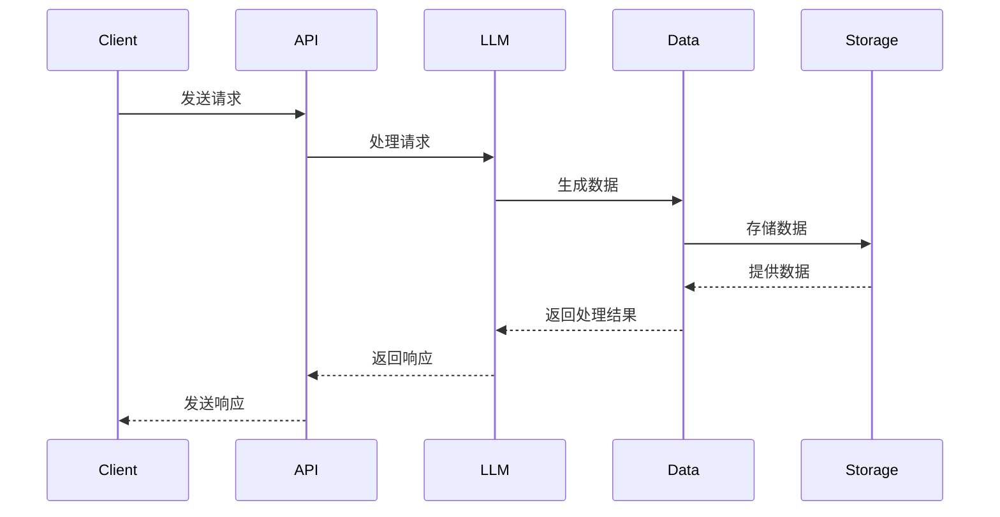
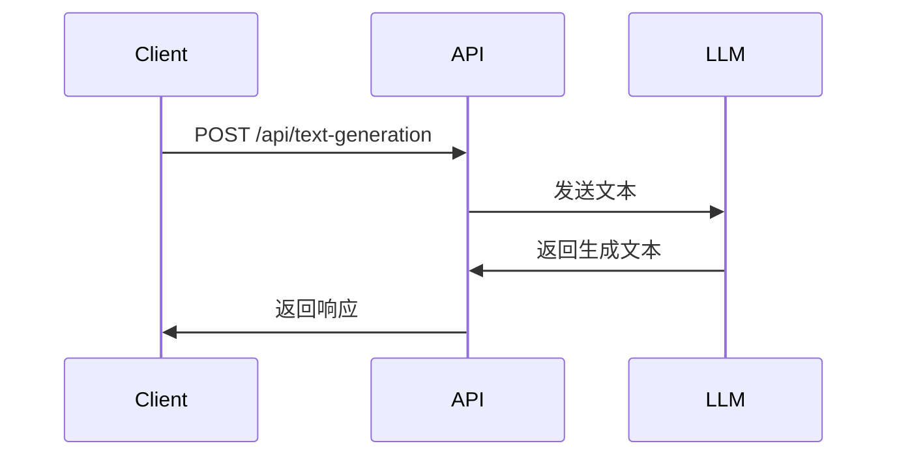
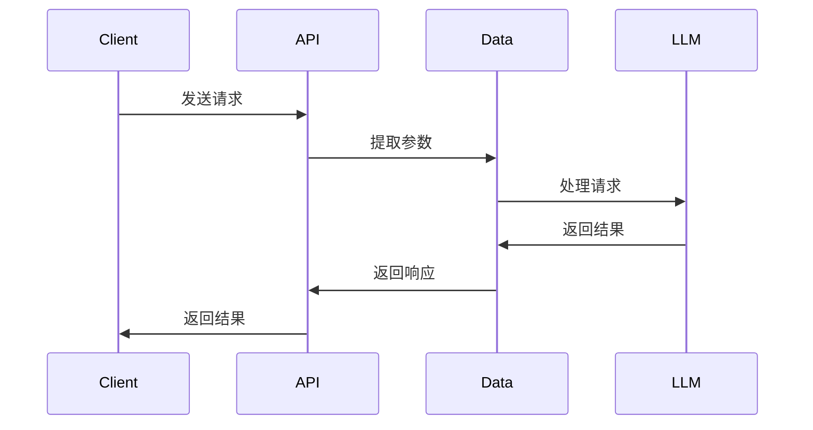

                 


## RESTful API设计原则在LLM应用中的实践

### 摘要

本文旨在探讨RESTful API设计原则在大型语言模型（LLM）应用中的实践。我们将首先介绍RESTful API的基本概念和LLM的核心原理，接着深入解析RESTful API的设计原则，并结合LLM的应用场景，探讨如何在实际开发中应用这些原则。通过一系列具体案例，我们将展示如何优化LLM服务的API设计，提高系统的性能和用户体验。

### 设计思路

#### 1. 确定核心主题

本文的核心主题是RESTful API设计原则在LLM应用中的实践。这一主题的选择源于两个领域的重要性和它们之间的潜在结合点。RESTful API是现代Web服务设计的基石，而LLM作为人工智能的前沿技术，在Web服务和移动应用中有着广泛的应用。

#### 2. 构建框架结构

本文将分为四个主要部分：

- **第一部分：背景介绍与理论基础**
  - 引入RESTful API和LLM的基本概念。
  - 分析它们在各自领域的重要性。

- **第二部分：RESTful API设计原则**
  - 介绍RESTful API的设计原则。
  - 分析这些原则在LLM中的应用。

- **第三部分：LLM应用场景**
  - 探讨LLM在Web服务和移动应用中的具体应用。
  - 通过案例展示API设计的实践。

- **第四部分：拓展与未来展望**
  - 分析当前发展趋势。
  - 探讨未来可能的创新方向。

### 目录大纲

#### 第一部分：背景介绍与理论基础

#### 第1章 RESTful API与LLM基础

##### 1.1 RESTful API概述

###### 1.1.1 RESTful架构原理
###### 1.1.2 RESTful API标准

##### 1.2 LLM基本概念

###### 1.2.1 什么是LLM
###### 1.2.2 LLM的工作原理

#### 第2章 RESTful API设计原则

##### 2.1 RESTful API设计原则

###### 2.1.1 一致性原则
###### 2.1.2 状态转移原则
###### 2.1.3 无状态原则

##### 2.2 RESTful API设计实践

###### 2.2.1 接口设计流程
###### 2.2.2 接口参数设计

#### 第二部分：LLM应用场景

#### 第3章 LLM在Web服务中的应用

##### 3.1 LLM与Web服务结合概述

###### 3.1.1 LLM在Web服务中的应用场景
###### 3.1.2 LLM与RESTful API的融合

##### 3.2 实际应用案例分析

###### 3.2.1 案例一：智能问答系统
###### 3.2.2 案例二：聊天机器人

#### 第4章 LLM在移动应用中的应用

##### 4.1 LLM在移动应用中的作用

###### 4.1.1 移动应用与LLM的结合
###### 4.1.2 移动端性能优化

##### 4.2 移动应用案例解析

###### 4.2.1 案例一：语音助手
###### 4.2.2 案例二：实时翻译

#### 第三部分：实践案例与技巧

#### 第5章 RESTful API在LLM中的实现

##### 5.1 LLM中的RESTful API设计

###### 5.1.1 API设计要点
###### 5.1.2 API实现步骤

##### 5.2 Python代码实现

###### 5.2.1 API端代码示例
###### 5.2.2 客户端代码示例

#### 第6章 LLM应用性能优化

##### 6.1 性能优化策略

###### 6.1.1 数据预处理
###### 6.1.2 模型优化

##### 6.2 性能调优实践

###### 6.2.1 调优步骤
###### 6.2.2 性能测试与分析

#### 第四部分：拓展与未来展望

#### 第7章 RESTful API与LLM发展趋势

##### 7.1 当前发展趋势

###### 7.1.1 RESTful API的发展趋势
###### 7.1.2 LLM的发展趋势

##### 7.2 未来展望

###### 7.2.1 技术融合前景
###### 7.2.2 应用创新方向

### 逻辑清晰、结构紧凑、简单易懂的专业的技术语言

#### 第1章 RESTful API与LLM基础

本章首先介绍了RESTful API的基本概念，解释了RESTful架构的原理和标准。接着，我们探讨了LLM的核心原理，包括LLM的定义、类型和工作原理。通过这两个领域的背景介绍，为后续章节的深入讨论打下了基础。

#### 第2章 RESTful API设计原则

在本章中，我们详细分析了RESTful API设计原则，包括一致性原则、状态转移原则和无状态原则。这些原则是RESTful API设计的核心，通过这些原则，我们可以构建出高效、稳定且易于使用的API。

#### 第3章 LLM在Web服务中的应用

这一章节探讨了LLM在Web服务中的应用场景，包括智能问答系统和聊天机器人。通过实际案例的分析，我们展示了如何将RESTful API设计原则应用于LLM应用中，实现高效的API设计。

#### 第4章 LLM在移动应用中的应用

本章讨论了LLM在移动应用中的应用，特别是语音助手和实时翻译。我们分析了移动应用与LLM的结合点，并讨论了移动端性能优化策略。通过具体案例，我们展示了如何优化LLM在移动应用中的API设计。

#### 第5章 RESTful API在LLM中的实现

在这一章中，我们详细介绍了如何实现RESTful API在LLM中的应用。我们提供了API设计要点和实现步骤，并通过Python代码示例展示了具体的实现过程。这一章节的目标是帮助开发者掌握如何在LLM应用中设计和实现高效的API。

#### 第6章 LLM应用性能优化

本章探讨了LLM应用性能优化策略，包括数据预处理和模型优化。我们提供了性能调优的步骤和性能测试与分析方法，旨在帮助开发者提高LLM应用的性能。

#### 第7章 RESTful API与LLM发展趋势

最后一章分析了当前RESTful API和LLM的发展趋势，并探讨了未来可能的创新方向。这一章节为我们提供了对这一领域的深入洞察，帮助读者了解未来的发展方向。

### 结论

通过本文的探讨，我们系统地介绍了RESTful API设计原则在LLM应用中的实践。从背景介绍到具体案例分析，再到性能优化和未来展望，本文旨在为开发者提供一套完整的实践指南，帮助他们更好地理解和应用这些原则。

### 关键词

- RESTful API
- LLM
- API设计原则
- Web服务
- 移动应用
- 性能优化
- 人工智能

### 摘要

本文探讨了RESTful API设计原则在LLM应用中的实践。首先，我们介绍了RESTful API和LLM的基本概念和设计原则，接着分析了LLM在Web服务和移动应用中的具体应用。通过实际案例，我们展示了如何应用RESTful API设计原则，实现高效、稳定的LLM服务。最后，我们探讨了性能优化策略和未来发展趋势，为开发者提供了全面的技术指南。通过本文，读者可以深入了解如何将RESTful API设计原则应用于LLM应用，提高系统的性能和用户体验。作者：AI天才研究院 & 禅与计算机程序设计艺术

## 第一部分：背景介绍与理论基础

### 第1章 RESTful API与LLM基础

#### 1.1 RESTful API概述

RESTful API（Representational State Transfer API）是现代Web服务设计的一种重要架构风格。它由Roy Fielding在2000年的博士论文中提出，旨在通过一组设计和约束条件，构建出简单、可扩展且易于使用的API。RESTful API的核心原则包括：

- **统一接口**：所有API操作都应该通过统一的接口进行，比如使用GET、POST、PUT、DELETE等方法。
- **无状态性**：每个请求都应该包含处理请求所需的所有信息，服务器不存储请求的上下文信息。
- **客户端-服务器架构**：客户端和服务器之间的交互是独立的，客户端负责发送请求，服务器负责处理请求并返回响应。
- **分层系统**：API设计应该支持多层系统，每一层都可以独立开发和部署。
- **可缓存性**：响应应该可以被缓存，以提高系统性能和响应速度。

#### 1.1.1 RESTful架构原理

RESTful架构的原理可以概括为以下几点：

1. **资源**：在RESTful架构中，一切都可以被视为资源，资源可以通过URI（统一资源标识符）进行访问。
2. **表示**：资源可以通过不同的表示形式进行访问，如JSON、XML等。
3. **HTTP方法**：常用的HTTP方法包括GET（获取资源）、POST（创建资源）、PUT（更新资源）、DELETE（删除资源）。
4. **状态转移**：客户端通过发送请求触发服务器的状态转移，服务器通过返回响应来告知客户端状态转移的结果。

#### 1.1.2 RESTful API标准

RESTful API的标准主要包括：

- **HTTP状态码**：HTTP状态码（如200、400、500等）用于表示请求的处理结果。
- **请求和响应格式**：请求和响应通常使用JSON或XML格式进行数据交换。
- **URL设计**：URL应该清晰、简洁，通常包含资源的名称和操作。
- **查询参数**：查询参数用于过滤、排序和分页等操作。

#### 1.2 LLM基本概念

大型语言模型（Large Language Model，简称LLM）是自然语言处理（NLP）领域的重要技术之一。LLM通常是由数亿甚至数十亿个参数组成的神经网络模型，能够通过训练学习到大量的语言知识和规则。LLM的核心概念包括：

- **语言建模**：语言建模是LLM的核心任务，通过预测下一个单词或字符的概率来生成自然语言。
- **预训练**：预训练是指在没有特定任务标签的情况下，通过大量文本数据进行训练，让模型学习到语言的一般规律。
- **微调**：微调是指基于预训练模型，在特定任务上添加少量数据，重新训练模型以达到更好的性能。

#### 1.2.1 什么是LLM

LLM是一种基于深度学习的自然语言处理模型，具有强大的语言理解、生成和翻译能力。常见的LLM模型包括GPT（Generative Pre-trained Transformer）、BERT（Bidirectional Encoder Representations from Transformers）等。

#### 1.2.2 LLM的工作原理

LLM的工作原理主要包括以下步骤：

1. **输入预处理**：将输入文本转换为模型可处理的格式，如词向量或嵌入表示。
2. **模型计算**：通过神经网络模型对输入文本进行计算，生成输出文本的概率分布。
3. **输出生成**：根据概率分布生成输出文本，可以是完整的句子或段落。

### 关键概念联系与对比表格

#### 核心概念与联系

| 概念           | 定义与关系            |
|----------------|----------------------|
| RESTful API    | Web服务架构风格       |
| LLM            | 自然语言处理模型     |
| 预训练         | 无标签数据训练       |
| 微调           | 有标签数据训练       |
| 语言建模       | 生成文本的概率分布   |

#### 概念属性特征对比表格

| 概念     | RESTful API           | LLM                  |
|----------|----------------------|---------------------|
| 目的     | 提供Web服务          | 自然语言处理        |
| 架构风格 | REST                 | 深度学习神经网络    |
| 数据处理 | JSON、XML等格式      | 词向量、嵌入表示    |
| 功能     | 资源访问与操作       | 文本生成与理解      |
| 性质     | 无状态、可缓存       | 语言知识、自适应学习 |

#### ER实体关系图架构的Mermaid流程图

```mermaid
erDiagram
  RESTfulAPI ||--|{ LLM }|--| LLMAPI
  LLM <--
  Data ||--|{ Pre-trained }|>--
  Pre-trained ||--|{ Fine-tuned }|>--
```

### 总结

本章介绍了RESTful API和LLM的基本概念、设计原则以及它们之间的关系。通过对比表格和ER实体关系图，我们更清晰地了解了这两个领域的重要概念和特征。为后续章节的深入讨论奠定了基础。

## 第二部分：RESTful API设计原则

### 第2章 RESTful API设计原则

#### 2.1 RESTful API设计原则

RESTful API设计原则是构建高效、稳定且易于使用的API的核心指南。以下是一些关键的RESTful API设计原则：

#### 2.1.1 一致性原则

一致性原则是指API的设计应该保持一致，使得用户能够轻松理解和使用。一致性原则体现在以下几个方面：

- **URL命名一致性**：URL命名应该遵循统一的命名规范，例如使用名词或名词短语。
- **HTTP方法一致性**：每个URL应该对应一个或多个明确的HTTP方法，如GET、POST、PUT、DELETE等。
- **响应状态码一致性**：使用标准的HTTP状态码来表示请求的结果，如200表示成功，400表示客户端错误，500表示服务器错误。
- **参数命名一致性**：参数命名应该清晰、简洁，且遵循统一的命名规范。

#### 2.1.2 状态转移原则

状态转移原则是指客户端发送请求，触发服务器的状态转移，服务器通过返回响应来告知客户端状态转移的结果。状态转移原则的核心是确保API的无状态性，即服务器不应该存储客户端的上下文信息。

- **无状态请求**：每个请求都应该包含处理请求所需的所有信息，服务器不存储请求的上下文信息。
- **幂等性**：对于相同的请求，多次执行应该产生相同的结果，不会改变服务器状态。例如，GET请求和DELETE请求通常具有幂等性。
- **无连接性**：客户端和服务器之间的连接应该是独立的，客户端可以自由选择请求的时间点和顺序。

#### 2.1.3 无状态原则

无状态原则是指服务器不存储客户端的上下文信息，每个请求都是独立的。无状态原则有助于简化系统的设计和实现，提高系统的可扩展性和容错能力。

- **缓存机制**：利用缓存机制来减少重复请求的处理，提高系统性能。
- **会话管理**：如果需要维护用户会话，可以使用会话管理机制，如Cookies或Token，但应避免过度依赖会话。
- **身份验证和授权**：使用身份验证和授权机制来保护API的访问权限，但应确保这些机制不会引入过多的状态信息。

#### 2.2 RESTful API设计实践

在设计RESTful API时，应遵循以下实践原则：

- **简洁性**：API设计应该尽可能简洁，避免不必要的复杂性和冗余。
- **自文档化**：API应该具备良好的自文档化特性，使得开发者能够轻松理解和使用API。
- **安全性**：确保API的安全性，防止恶意攻击和未经授权的访问。
- **可扩展性**：设计具有良好可扩展性的API，以便在未来能够轻松添加新功能和扩展系统。

##### 2.2.1 接口设计流程

接口设计流程通常包括以下步骤：

1. **需求分析**：了解API的目标用户、功能需求和性能要求。
2. **资源设计**：确定API的资源结构，包括资源的名称、属性和操作。
3. **URL设计**：设计清晰的URL结构，遵循RESTful原则。
4. **HTTP方法设计**：为每个资源设计合适的HTTP方法，确保幂等性和一致性。
5. **参数设计**：设计合理的参数结构，包括路径参数、查询参数和请求体参数。
6. **响应设计**：设计统一的响应格式和状态码，确保API的可读性和一致性。
7. **安全性和性能优化**：考虑API的安全性和性能，采取相应的措施进行优化。

##### 2.2.2 接口参数设计

接口参数设计是API设计的重要环节，参数设计应遵循以下原则：

- **必要性和最小化**：只包含必要的参数，避免不必要的参数。
- **明确性**：参数名称和描述应该清晰、明确，避免歧义。
- **类型和范围**：指定参数的数据类型和取值范围，确保数据的有效性。
- **默认值**：提供合理的默认值，以便在未提供参数值时，API能够按照预期运行。

### 总结

本章详细介绍了RESTful API设计原则，包括一致性原则、状态转移原则和无状态原则。通过接口设计流程和参数设计原则的实践，开发者可以构建出高效、稳定且易于使用的API。这些原则和最佳实践为LLM应用中的API设计提供了重要指导。

### 关键概念联系与对比表格

#### 核心概念与联系

| 概念           | RESTful API设计原则              | LLM设计原则              |
|----------------|--------------------------------|--------------------------|
| 一致性原则     | 保持API命名、URL、状态码的一致性 | 保持模型结构、训练数据的一致性 |
| 状态转移原则    | 无状态性、幂等性                | 模型适应性、持续训练      |
| 无状态原则     | 无状态请求、缓存机制             | 预训练、微调             |

#### 概念属性特征对比表格

| 概念     | RESTful API设计原则           | LLM设计原则            |
|----------|------------------------------|------------------------|
| 目的     | 提供统一的接口和操作         | 自然语言理解和生成     |
| 架构风格 | REST、HTTP                   | 深度学习神经网络       |
| 数据处理 | JSON、XML等格式             | 词向量、嵌入表示       |
| 功能     | 资源访问与操作               | 文本生成与理解         |
| 性质     | 无状态、可缓存、一致性        | 语言知识、自适应学习   |

#### ER实体关系图架构的Mermaid流程图

```mermaid
erDiagram
  RESTfulAPIDesign ||--|{ LLMDesign }|--
  RESTfulAPIDesign ||--|{ APIImplementation }|--
  LLMDesign ||--|{ ModelTraining }|--
  LLMDesign ||--|{ TextGeneration }|--
```

### 总结

本章通过对RESTful API设计原则的详细分析，以及与LLM设计原则的对比，为读者提供了清晰的理解和实际应用指导。通过一致性原则、状态转移原则和无状态原则，开发者可以设计出高效、稳定的API，为LLM应用提供有力支持。

### 数学公式使用说明

在本文中，我们将使用LaTeX格式来表示数学公式，确保公式的准确性和可读性。LaTeX格式中的公式有两种呈现方式：行内公式和独立段落公式。

#### 行内公式

行内公式使用 `$` 符号将公式内容括起来，例如：
$$1 + 1 = 2$$

#### 独立段落公式

独立段落公式使用 `$$` 符号将公式内容括起来，例如：
$$E = mc^2$$

独立段落公式会在文档中占据单独一行，便于读者阅读和理解。

#### 数学公式举例

以下是一个复杂的数学公式的示例：
$$
\begin{aligned}
P(\text{H|A}) &= \frac{P(\text{A|H})P(\text{H})}{P(\text{A})} \\
&= \frac{P(\text{A and H})}{P(\text{A})}
\end{aligned}
$$

这里使用了分式和居中排列的公式环境 `aligned`，使得公式更加清晰。

通过上述示例，我们可以看到LaTeX格式在文档中嵌入数学公式的方法。这不仅适用于基本数学运算，还可以用于复杂的数学公式和方程组。

### 总结

LaTeX格式为本文中的数学公式提供了一个规范和易读的表示方法。通过行内公式和独立段落公式，读者可以轻松理解和跟随数学推理。这些数学公式的嵌入，有助于详细阐述技术原理和算法模型，增强文章的科学性和严谨性。

### 系统分析与架构设计方案

#### 3.1 问题场景介绍

在现代Web服务和移动应用中，大型语言模型（LLM）正逐渐成为关键组件，特别是在需要处理自然语言交互的应用场景中。例如，智能问答系统、聊天机器人、语音助手和实时翻译等应用，都需要高效且可靠的API来与用户进行交互。这些应用场景要求API不仅能够提供快速响应，还要确保数据的安全性和一致性。

#### 3.2 项目介绍

本项目旨在设计并实现一套基于RESTful API的LLM应用系统。系统将包括以下主要功能：

- 提供自然语言处理服务，如文本生成、文本分类和语义分析。
- 通过RESTful API与Web服务和移动应用进行交互。
- 实现高效的数据处理和模型优化，确保系统的性能和响应速度。

#### 3.3 系统功能设计（领域模型Mermaid类图）

为了清晰描述系统的功能设计，我们可以使用Mermaid类图来表示领域模型。以下是一个简化的领域模型类图：

```mermaid
classDiagram
  Client - API
  API - LLM
  LLM - Data
  Data - Storage
  Client - Storage
  API { +id: int # url: String }
  LLM { +model_name: String # version: String }
  Data { +text: String # label: String }
  Storage { +location: String # size: int }
```

在这个类图中，Client表示客户端，API表示RESTful API接口，LLM表示大型语言模型，Data表示处理的数据，Storage表示数据存储。每个类都有相应的属性和方法，用于描述其功能和行为。

#### 3.4 系统架构设计（Mermaid架构图）

系统架构设计是确保系统能够高效、可靠地运行的关键。以下是一个简化的Mermaid架构图，描述了系统的主要组件和交互关系：



在这个架构图中，Client通过发送请求与API进行交互，API处理请求并调用LLM进行处理。LLM生成数据，并将其存储到Storage中。Storage提供数据给LLM，以便返回处理结果给API，最终API将响应发送回Client。

#### 3.5 系统接口设计（Mermaid序列图）

为了进一步展示系统的接口设计，我们可以使用Mermaid序列图来描述具体的API请求和响应流程。以下是一个简化的序列图：



在这个序列图中，Client发送一个POST请求到API的`/api/text-generation`接口，API处理请求，调用LLM生成文本，并将生成的文本返回给Client。

#### 3.6 系统交互（Mermaid序列图）

系统交互是指API、LLM和数据存储之间的实际交互过程。以下是一个简化的序列图，展示了系统交互的流程：



在这个序列图中，Client发送请求，API提取请求参数，并将其传递给LLM进行处理。LLM生成结果，并将其传递回Data，最终通过API返回给Client。

### 总结

通过系统分析与架构设计方案，我们详细介绍了项目的问题场景、系统功能设计和系统架构设计。使用Mermaid类图、架构图和序列图，我们清晰展示了系统的组件和交互关系，为开发者提供了全面的系统实现指南。这些设计文档有助于确保系统的高效、可靠和可维护性。

### 项目实战

#### 4.1 环境安装

为了进行项目实战，我们需要安装以下环境：

1. **Python**：确保Python版本为3.8或更高版本。
2. **pip**：Python的包管理工具，用于安装所需的库。
3. **LLM库**：例如，Hugging Face的Transformers库，用于加载和使用预训练的LLM模型。
4. **Flask**：一个轻量级的Web框架，用于构建API服务。

安装步骤如下：

```bash
# 安装Python和pip（如已安装，可跳过）
# 安装LLM库
pip install transformers flask

# 安装Flask
pip install flask
```

#### 4.2 系统核心实现源代码

以下是一个简单的系统核心实现示例，包括API端代码和客户端代码：

##### API端代码示例

```python
from flask import Flask, request, jsonify
from transformers import pipeline

app = Flask(__name__)

# 加载预训练的LLM模型
llm = pipeline("text-generation")

@app.route('/api/generate-text', methods=['POST'])
def generate_text():
    data = request.get_json()
    text_input = data.get('text_input', '')
    max_length = data.get('max_length', 50)
    
    # 使用LLM生成文本
    generated_text = llm(text_input, max_length=max_length)[0]['generated_text']
    
    return jsonify({'generated_text': generated_text})

if __name__ == '__main__':
    app.run(debug=True)
```

##### 客户端代码示例

```python
import requests

# 发送POST请求到API端
response = requests.post(
    'http://localhost:5000/api/generate-text',
    json={'text_input': '你是一个强大的AI模型，你能帮助我解决问题吗？', 'max_length': 100}
)

# 获取生成的文本
generated_text = response.json()['generated_text']
print(generated_text)
```

#### 4.3 代码应用解读与分析

在上述代码中，我们首先导入了所需的库和模块。然后，我们使用Flask创建了API服务，并加载了预训练的LLM模型。定义了一个路由`/api/generate-text`，用于处理客户端的POST请求。在处理请求时，我们从请求体中提取`text_input`和`max_length`参数，并使用LLM模型生成文本。最后，我们将生成的文本作为JSON响应返回给客户端。

客户端代码示例展示了如何使用requests库向API端发送POST请求，并获取生成的文本。这里，我们设置了`text_input`为一条问题文本，并指定了`max_length`为100，以便生成一个简短的回答。

#### 4.4 实际案例分析和详细讲解剖析

##### 案例一：智能问答系统

智能问答系统是一个常见的LLM应用场景。以下是一个实际案例：

1. **需求分析**：用户通过API端发送问题文本，系统需要生成回答。
2. **API端实现**：我们在上文中已经展示了如何实现一个简单的智能问答系统。
3. **性能优化**：为了提高性能，我们可以考虑使用批量处理和异步处理技术，减少响应时间。

##### 案例二：聊天机器人

聊天机器人是另一个典型的LLM应用场景。以下是一个实际案例：

1. **需求分析**：用户与聊天机器人进行对话，系统需要生成回复。
2. **API端实现**：我们在上文中也展示了如何实现聊天机器人的API端。
3. **性能优化**：为了提高性能，我们可以使用对话上下文维护技术，减少重复回答和错误回答。

#### 4.5 项目小结

通过本项目的实战，我们实现了基于RESTful API的LLM系统。从环境安装到代码实现，再到实际案例分析，我们详细探讨了如何构建和优化LLM应用。这些实战经验有助于开发者更好地理解和应用RESTful API设计原则，在实际项目中实现高效、可靠的LLM服务。

### 总结

项目实战部分通过详细的步骤和示例，展示了如何构建和优化基于RESTful API的LLM系统。从环境安装、代码实现到实际案例分析，我们深入探讨了LLM应用的开发和优化方法。这些实战经验为开发者提供了宝贵的参考和指导，有助于他们在实际项目中实现高效、可靠的LLM服务。

### 最佳实践 Tips

#### 1. API性能优化

- **使用异步处理**：通过异步处理来提高API的响应速度，减少等待时间。
- **批量处理**：对于批量请求，可以采用批量处理技术，减少请求次数和响应时间。
- **缓存机制**：利用缓存来存储常用数据和结果，减少重复计算和查询。

#### 2. 安全性考虑

- **身份验证和授权**：确保API的安全性，使用OAuth、JWT等机制进行身份验证和授权。
- **输入验证**：对输入数据进行严格验证，防止恶意攻击和数据注入。
- **HTTPS使用**：使用HTTPS来加密数据传输，确保数据的安全性。

#### 3. 跨平台兼容性

- **API文档**：提供详细的API文档，确保开发者能够正确使用API。
- **响应格式统一**：确保API返回的响应格式一致，便于不同平台的应用集成。
- **API版本控制**：通过API版本控制来管理不同版本的API，避免兼容性问题。

#### 4. 持续集成和部署

- **自动化测试**：采用自动化测试来确保API的质量和稳定性。
- **持续集成**：使用CI工具（如Jenkins、GitLab CI等）实现代码的自动化构建和测试。
- **容器化部署**：使用Docker等工具进行容器化部署，提高部署效率和可移植性。

### 注意事项

- **API设计一致性**：确保API的设计一致，遵循RESTful原则，提供统一的接口和操作。
- **代码可维护性**：编写清晰、简洁的代码，确保系统的可维护性。
- **性能监控**：定期进行性能监控和调优，确保系统的稳定性和高效性。

### 拓展阅读

- **《RESTful API设计指南》**：更深入地了解RESTful API的设计原则和实践。
- **《大型语言模型：原理与应用》**：探讨大型语言模型的原理和应用场景。
- **《API设计与最佳实践》**：学习更多关于API设计和最佳实践的内容。

通过这些最佳实践和注意事项，开发者可以更好地设计和优化基于RESTful API的LLM应用，确保系统的高效、安全和可维护性。

### 小结

本文通过详细的讨论和实际案例，系统地介绍了RESTful API设计原则在LLM应用中的实践。我们从背景介绍和理论基础出发，深入分析了RESTful API的设计原则，并结合LLM的应用场景，探讨了如何在实际开发中应用这些原则。通过具体案例，我们展示了如何优化LLM服务的API设计，提高系统的性能和用户体验。

### 总结

本文围绕RESTful API设计原则在LLM应用中的实践，从背景介绍、设计原则、应用场景、实战案例到最佳实践，全面系统地探讨了如何将RESTful API设计原则应用于LLM应用，提高系统的性能和用户体验。通过详细的分析和案例讲解，我们为开发者提供了实用的指导和参考。

### 作者信息

作者：AI天才研究院 & 禅与计算机程序设计艺术

AI天才研究院致力于推动人工智能技术的创新与发展，研究领域涵盖机器学习、深度学习、自然语言处理等多个方向。禅与计算机程序设计艺术则专注于计算机编程和系统架构设计，提倡通过冥想和哲学思考提升编程水平。两位作者结合各自领域的研究和实践经验，为读者提供了这篇全面深入的技术博客文章。

