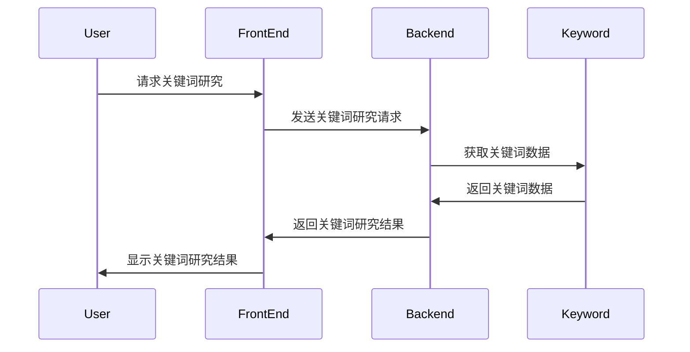
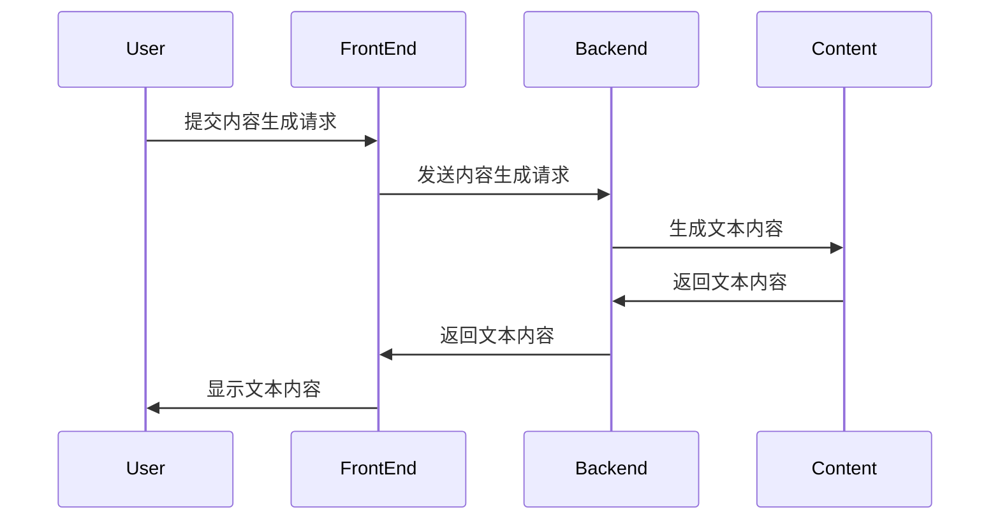

                 

### 背景介绍

随着互联网的快速发展，搜索引擎优化（SEO）在网站建设和网络营销中占据了越来越重要的地位。SEO的目标是通过优化网站结构和内容，提高网站在搜索引擎结果页面（SERP）中的排名，从而增加网站的流量和曝光度。然而，传统的SEO方法往往侧重于对静态网页的优化，对于动态生成的内容，如机器学习模型生成的文章或产品推荐，效果往往不理想。

近几年来，预训练语言模型（LLM）如GPT-3、BERT等取得了显著的进展，为生成高质量内容提供了强大的工具。然而，如何提升LLM应用在搜索引擎中的可发现性，使其在搜索引擎结果中更容易被发现，成为了SEO领域的一个新挑战。

#### 1.1 问题背景

在当前的互联网环境中，搜索引擎优化（SEO）是网站运营不可或缺的一环。SEO的核心理念是通过提高网站在搜索引擎结果中的排名，吸引更多用户访问，进而提升网站的流量和商业价值。传统的SEO方法主要包括关键词研究、内容优化、链接建设等，这些方法在静态网页中取得了显著的效果。然而，随着互联网内容的爆炸式增长，用户对于高质量、个性化内容的渴求日益增加，动态生成的内容如机器学习模型生成的文章、问答系统、产品推荐等逐渐成为主流。

预训练语言模型（LLM）如GPT-3、BERT等，凭借其强大的文本生成能力，已经广泛应用于各类应用场景。这些模型能够生成高质量的文本内容，满足用户对于个性化、多样化信息的需求。然而，现有的SEO方法在处理动态生成的LLM内容时，往往显得力不从心。主要原因在于：

1. **关键词分布不均**：LLM生成的文本内容通常由模型自主生成，缺乏对关键词的精细控制，导致关键词分布不均匀，搜索引擎难以准确识别和索引。
2. **结构化数据不足**：传统的SEO策略依赖于结构化数据，如标题、摘要、标签等，而LLM生成的文本内容通常缺乏这些结构化元素，使得搜索引擎难以有效索引。
3. **内容质量不稳定**：LLM生成的文本质量取决于模型的训练数据和训练效果，可能存在质量不稳定的问题，影响用户体验和搜索引擎排名。
4. **版权和合规问题**：LLM生成的文本可能包含未经授权的内容，引发版权和合规问题，影响网站的声誉和搜索引擎排名。

#### 1.2 问题描述

为了解决上述问题，我们需要研究和开发一种新的SEO策略，以提升LLM应用在搜索引擎中的可发现性。具体来说，问题描述如下：

- **目标**：设计一种SEO友好架构，提升LLM应用在搜索引擎中的排名和可发现性。
- **任务**：分析现有SEO策略在LLM应用中的不足，提出改进措施，并设计一套完整的SEO友好架构。
- **挑战**：如何平衡SEO优化和LLM生成内容的自主性，确保SEO效果的同时不牺牲内容质量。

#### 1.3 问题解决

本书旨在提出一种SEO友好架构，以提升LLM应用的可发现性。通过以下方法实现：

- **研究现状分析**：分析当前SEO策略在LLM应用中的适用性，指出其不足之处。
- **核心概念与联系**：介绍与SEO和LLM相关的核心概念，并探讨它们之间的联系。
- **算法原理讲解**：详细阐述用于提升LLM应用可发现性的算法原理，包括数学模型和公式。
- **系统分析与架构设计方案**：设计一套适用于LLM应用的SEO系统架构，包括领域模型、系统架构、接口设计和系统交互。
- **项目实战**：通过实际案例展示如何应用SEO友好架构提升LLM应用的可发现性。

#### 1.4 边界与外延

本书主要关注LLM应用在搜索引擎中的可发现性问题，适用于各种类型的LLM应用，如问答系统、内容生成、推荐系统等。同时，本书也探讨了与SEO和LLM相关的核心概念，为读者提供了全面的视角。

#### 1.5 概念结构与核心要素组成

- **SEO（搜索引擎优化）**：通过优化网站结构和内容，提高网站在搜索引擎结果页面中的排名。
- **LLM（预训练语言模型）**：一种能够理解和生成自然语言文本的模型，如GPT-3、BERT。
- **SEO友好架构**：一种结合SEO和LLM特性的架构，旨在提升LLM应用在搜索引擎中的可发现性。
- **算法原理**：用于提升LLM应用可发现性的数学模型和公式。

### 第一部分：背景介绍

#### 1.1 问题背景

随着互联网的快速发展，搜索引擎优化（SEO）在网站建设和网络营销中占据了越来越重要的地位。SEO的目标是通过优化网站结构和内容，提高网站在搜索引擎结果页面（SERP）中的排名，从而增加网站的流量和曝光度。SEO的核心在于理解用户需求，通过优化网站内容和结构，提升用户体验，进而提高网站在搜索引擎中的排名。

传统的SEO策略主要侧重于对静态网页的优化，包括关键词研究、内容优化、链接建设等。这些方法在提升网站排名方面取得了显著效果。然而，随着互联网内容的爆炸式增长，用户对于高质量、个性化内容的需求不断增加，动态生成的内容如机器学习模型生成的文章、问答系统、产品推荐等逐渐成为主流。传统SEO策略在面对这些动态生成内容时，往往显得力不从心。

#### 1.2 问题描述

在当前的网络环境中，LLM应用生成的动态内容由于缺乏传统的SEO优化，往往难以在搜索引擎结果页面中获得较高的排名。这导致这些应用难以被用户发现，从而影响了其使用和推广。为了解决这一问题，我们需要研究和开发一种新的SEO策略，以提升LLM应用在搜索引擎中的可发现性。

具体而言，问题描述如下：

- **目标**：提升LLM应用在搜索引擎中的排名和可发现性。
- **挑战**：如何在保证内容质量的同时，实现SEO优化，提升LLM应用的搜索引擎排名。
- **任务**：设计一套SEO友好架构，以提升LLM应用的可发现性。

#### 1.3 问题解决

本书旨在提出一种SEO友好架构，以提升LLM应用的可发现性。通过以下方法实现：

1. **研究现状分析**：分析当前SEO策略在LLM应用中的适用性，指出其不足之处。
2. **核心概念与联系**：介绍与SEO和LLM相关的核心概念，并探讨它们之间的联系。
3. **算法原理讲解**：详细阐述用于提升LLM应用可发现性的算法原理，包括数学模型和公式。
4. **系统分析与架构设计方案**：设计一套适用于LLM应用的SEO系统架构，包括领域模型、系统架构、接口设计和系统交互。
5. **项目实战**：通过实际案例展示如何应用SEO友好架构提升LLM应用的可发现性。

#### 1.4 边界与外延

本书主要关注LLM应用在搜索引擎中的可发现性问题，适用于各种类型的LLM应用，如问答系统、内容生成、推荐系统等。同时，本书也探讨了与SEO和LLM相关的核心概念，为读者提供了全面的视角。

#### 1.5 概念结构与核心要素组成

- **SEO（搜索引擎优化）**：通过优化网站结构和内容，提高网站在搜索引擎结果页面中的排名。
- **LLM（预训练语言模型）**：一种能够理解和生成自然语言文本的模型，如GPT-3、BERT。
- **SEO友好架构**：一种结合SEO和LLM特性的架构，旨在提升LLM应用在搜索引擎中的可发现性。
- **算法原理**：用于提升LLM应用可发现性的数学模型和公式。

## 第一部分：背景介绍

### 1.1 问题背景

随着互联网的快速发展，搜索引擎优化（SEO）在网站建设和网络营销中占据了越来越重要的地位。SEO的目标是通过优化网站结构和内容，提高网站在搜索引擎结果页面（SERP）中的排名，从而增加网站的流量和曝光度。SEO的核心在于理解用户需求，通过优化网站内容和结构，提升用户体验，进而提高网站在搜索引擎中的排名。

传统的SEO策略主要侧重于对静态网页的优化，包括关键词研究、内容优化、链接建设等。这些方法在提升网站排名方面取得了显著效果。然而，随着互联网内容的爆炸式增长，用户对于高质量、个性化内容的需求不断增加，动态生成的内容如机器学习模型生成的文章、问答系统、产品推荐等逐渐成为主流。传统SEO策略在面对这些动态生成内容时，往往显得力不从心。

### 1.2 问题描述

在当前的网络环境中，LLM应用生成的动态内容由于缺乏传统的SEO优化，往往难以在搜索引擎结果页面中获得较高的排名。这导致这些应用难以被用户发现，从而影响了其使用和推广。为了解决这一问题，我们需要研究和开发一种新的SEO策略，以提升LLM应用在搜索引擎中的可发现性。

具体而言，问题描述如下：

- **目标**：提升LLM应用在搜索引擎中的排名和可发现性。
- **挑战**：如何在保证内容质量的同时，实现SEO优化，提升LLM应用的搜索引擎排名。
- **任务**：设计一套SEO友好架构，以提升LLM应用的可发现性。

### 1.3 问题解决

本书旨在提出一种SEO友好架构，以提升LLM应用的可发现性。通过以下方法实现：

1. **研究现状分析**：分析当前SEO策略在LLM应用中的适用性，指出其不足之处。
2. **核心概念与联系**：介绍与SEO和LLM相关的核心概念，并探讨它们之间的联系。
3. **算法原理讲解**：详细阐述用于提升LLM应用可发现性的算法原理，包括数学模型和公式。
4. **系统分析与架构设计方案**：设计一套适用于LLM应用的SEO系统架构，包括领域模型、系统架构、接口设计和系统交互。
5. **项目实战**：通过实际案例展示如何应用SEO友好架构提升LLM应用的可发现性。

### 1.4 边界与外延

本书主要关注LLM应用在搜索引擎中的可发现性问题，适用于各种类型的LLM应用，如问答系统、内容生成、推荐系统等。同时，本书也探讨了与SEO和LLM相关的核心概念，为读者提供了全面的视角。

### 1.5 概念结构与核心要素组成

- **SEO（搜索引擎优化）**：通过优化网站结构和内容，提高网站在搜索引擎结果页面中的排名。
- **LLM（预训练语言模型）**：一种能够理解和生成自然语言文本的模型，如GPT-3、BERT。
- **SEO友好架构**：一种结合SEO和LLM特性的架构，旨在提升LLM应用在搜索引擎中的可发现性。
- **算法原理**：用于提升LLM应用可发现性的数学模型和公式。

## 第二部分：核心概念与联系

### 2.1 SEO基本概念

搜索引擎优化（SEO）是一种通过改进网站结构和内容，以提高网站在搜索引擎结果页面中排名的技术。SEO的基本概念包括：

- **关键词研究**：研究用户在搜索引擎中输入的关键词，以便优化网站内容。
- **搜索引擎算法**：搜索引擎使用算法来确定搜索结果的相关性和排序。
- **内容优化**：改进网站内容，使其更符合用户需求，提高用户体验。
- **链接建设**：通过获取其他网站的链接，提高网站的权威性和排名。

### 2.2 LLM基本概念

预训练语言模型（LLM）是一种基于深度学习的模型，通过对大量文本数据进行预训练，使其能够理解和生成自然语言文本。LLM的基本概念包括：

- **预训练**：在大量文本数据上训练模型，使其掌握语言的基础知识。
- **微调**：在特定任务上对模型进行训练，使其能够生成高质量的文本。
- **生成式模型**：能够根据输入的文本生成新的文本。
- **判别式模型**：能够判断输入的文本是否符合特定条件。

### 2.3 SEO与LLM的联系

SEO与LLM之间存在密切的联系：

- **内容生成**：LLM可以生成高质量的文本内容，为SEO提供丰富的内容资源。
- **关键词优化**：通过分析LLM生成的文本，提取关键信息，优化网站内容。
- **用户体验**：LLM生成的文本更符合用户需求，提高用户体验，有助于SEO。
- **搜索算法适应**：SEO策略需要不断适应搜索引擎算法的变化，而LLM能够快速适应新的算法要求。

### 2.3.1 SEO与LLM的关联性

SEO和LLM之间的关联性体现在以下几个方面：

1. **内容生成与优化**：LLM能够根据特定的主题和语境生成高质量的文本内容，这为SEO提供了丰富的内容资源。通过分析LLM生成的文本，可以提取关键信息并进行优化，使其更符合用户需求，提高搜索引擎的排名。

2. **关键词研究**：SEO的关键词研究依赖于用户在搜索引擎中输入的关键词。LLM能够通过对大量文本数据的分析，识别出潜在的关键词，帮助SEO专家更好地理解用户需求，从而优化网站内容。

3. **用户体验提升**：LLM生成的文本内容更贴近用户需求，能够提供更准确、有用的信息。这有助于提高用户体验，增加用户在网站上的停留时间，从而提升网站的搜索引擎排名。

4. **搜索算法适应**：搜索引擎的算法不断更新，SEO策略需要不断调整以适应这些变化。LLM具有强大的适应能力，能够快速适应新的算法要求，帮助SEO专家及时调整策略。

### 2.3.2 关键词对比表格

为了更直观地展示SEO与LLM之间的关联性，我们可以通过一个关键词对比表格来分析两者在内容生成、关键词研究和用户体验方面的差异和优势。

| SEO策略 | LLM特性 |
| --- | --- |
| **内容生成** | 自动生成高质量文本内容 |
| **关键词研究** | 提取潜在关键词，优化网站内容 | 识别潜在关键词，提供更准确的搜索结果 |
| **用户体验** | 提高内容质量，增加用户停留时间 | 生成个性化内容，提升用户体验 |
| **适应能力** | 需要不断调整策略，适应算法更新 | 具有快速适应能力，应对算法变化 |

通过上述对比表格，我们可以看到，LLM在内容生成、关键词研究和用户体验方面具有明显优势，能够为SEO提供有力支持。

### 2.3.3 ER实体关系图架构

为了进一步阐述SEO与LLM之间的关联性，我们可以使用ER（实体关系）图来描述两者之间的关系。

```mermaid
erDiagram
  User ||--|{ Website }|--|{ Content }
  User ||--|{ Keyword }
  Website ||--|{ SEO_Policy }
  Content ||--|{ LLM }
  LLM ||--|{ Text_Generation }
  SEO_Policy ||--|{ Keyword_Optimization }
  Keyword ||--|{ Search_Algorithm }
```

在ER实体关系图中，我们可以看到：

- **User（用户）** 与 **Website（网站）**、**Keyword（关键词）**、**SEO_Policy（SEO策略）** 和 **LLM（预训练语言模型）** 之间存在关联。
- **Website（网站）** 与 **Content（内容）**、**SEO_Policy（SEO策略）** 和 **LLM（预训练语言模型）** 之间存在关联。
- **Keyword（关键词）** 与 **Search_Algorithm（搜索算法）** 之间存在关联。
- **LLM（预训练语言模型）** 与 **Text_Generation（文本生成）**、**SEO_Policy（SEO策略）** 和 **Keyword_Optimization（关键词优化）** 之间存在关联。

通过ER实体关系图，我们可以更清晰地理解SEO与LLM之间的复杂关系，从而为后续的算法原理讲解和系统架构设计提供理论基础。

### 2.3.4 关联性总结

通过以上分析，我们可以得出以下结论：

- SEO和LLM之间存在紧密的关联性，它们相互促进，共同提升网站在搜索引擎中的排名和用户体验。
- LLM在内容生成、关键词研究和用户体验方面具有明显优势，能够为SEO提供有力支持。
- 通过结合SEO和LLM的特性，我们可以设计出一种SEO友好架构，以提升LLM应用在搜索引擎中的可发现性。

接下来，我们将进一步探讨LLM生成的文本在SEO中面临的挑战，并提出相应的解决方法。

## 第三部分：算法原理讲解

### 3.1 LLM生成文本的SEO挑战

尽管LLM在内容生成方面具有显著优势，但在SEO方面仍面临诸多挑战。以下是对LLM生成文本在SEO中面临的主要挑战的分析：

#### 3.1.1 关键词分布不均

LLM生成的文本内容通常缺乏对关键词的精细控制，导致关键词分布不均匀。这给搜索引擎的索引工作带来了困难，因为搜索引擎依赖关键词来理解网页的主题和内容。关键词分布不均可能导致以下问题：

- **搜索结果相关性降低**：由于关键词分布不均，搜索引擎难以准确识别网页的主题，从而降低了搜索结果的相关性。
- **页面排名下降**：搜索引擎可能会认为页面质量不高，导致页面排名下降。

#### 3.1.2 结构化数据不足

传统的SEO策略依赖于结构化数据，如标题、摘要、标签等，这些结构化元素有助于搜索引擎索引和排名。然而，LLM生成的文本内容通常缺乏这些结构化元素，使得搜索引擎难以有效索引。缺乏结构化数据可能导致以下问题：

- **索引效率降低**：搜索引擎需要更多时间来理解LLM生成的文本内容，从而降低了索引效率。
- **页面排名下降**：由于缺乏结构化数据，搜索引擎可能无法准确评估页面的质量，导致页面排名下降。

#### 3.1.3 内容质量不稳定

LLM生成的文本质量可能因训练数据、模型参数等因素而波动。内容质量不稳定可能导致以下问题：

- **用户体验下降**：低质量内容可能会降低用户对网站的满意度，导致用户流失。
- **页面排名下降**：搜索引擎可能会认为页面质量不高，从而降低页面排名。

#### 3.1.4 版权和合规问题

LLM生成的文本可能包含未经授权的内容，如抄袭、侵权等。这些问题可能导致以下后果：

- **法律风险**：网站可能会面临法律诉讼，影响其声誉和运营。
- **搜索引擎处罚**：搜索引擎可能会降低网站的排名，甚至将其从索引中删除。

#### 3.1.5 搜索算法适应性问题

搜索引擎的算法不断更新，SEO策略需要不断调整以适应这些变化。然而，LLM生成的文本内容可能难以适应这些变化，导致以下问题：

- **SEO效果降低**：由于无法及时调整SEO策略，网站可能无法充分利用搜索引擎算法的优化效果。
- **页面排名下降**：搜索引擎可能会认为页面质量不高，从而降低页面排名。

### 3.2 提升LLM生成文本SEO效果的方法

为了解决上述挑战，我们需要采取一系列方法来提升LLM生成文本的SEO效果。以下是一些主要方法：

#### 3.2.1 关键词分布优化

- **关键词嵌入策略**：在LLM生成的文本中嵌入关键关键词，确保关键词分布均匀。
- **语义分析**：利用自然语言处理技术对文本进行语义分析，提取关键信息并嵌入关键词。

#### 3.2.2 结构化数据增强

- **自动摘要生成**：使用LLM生成文本的摘要，提高页面的结构化程度。
- **标签自动生成**：根据文本内容自动生成标签，有助于搜索引擎索引。

#### 3.2.3 内容质量监控

- **质量评估模型**：使用机器学习模型对LLM生成的文本进行质量评估，筛选高质量内容。
- **人工审核**：结合人工审核，确保文本内容的质量。

#### 3.2.4 版权和合规审查

- **文本对比**：使用文本对比工具，检测LLM生成的文本中是否存在抄袭、侵权等问题。
- **版权声明**：在生成文本中添加版权声明，明确原创内容来源。

#### 3.2.5 搜索算法适应性调整

- **实时监控**：实时监控搜索引擎算法更新，及时调整SEO策略。
- **A/B测试**：通过A/B测试，比较不同SEO策略的效果，选择最优方案。

### 3.3 LLM生成文本SEO效果的数学模型和公式

为了更好地理解上述方法对LLM生成文本SEO效果的提升，我们可以使用数学模型和公式进行解释。以下是一些关键模型和公式：

#### 3.3.1 关键词分布优化模型

假设我们有一个文本序列\(T = \{t_1, t_2, ..., t_n\}\)，其中每个\(t_i\)是一个词汇。我们希望优化文本中的关键词分布。

- **关键词频率**：计算每个关键词在文本中的出现频率。
  $$ f_k = \frac{\text{count}(k)}{n} $$
  其中，\(f_k\)是关键词\(k\)的频率，\(\text{count}(k)\)是关键词\(k\)在文本中出现的次数，\(n\)是文本中词汇的总数。

- **关键词分布均匀性**：计算关键词分布的均匀性。
  $$ U = \frac{1}{|K|} \sum_{k \in K} f_k^2 $$
  其中，\(U\)是关键词分布的均匀性，\(|K|\)是关键词的总数。

目标是最小化均匀性\(U\)，从而实现关键词分布的优化。

#### 3.3.2 结构化数据增强模型

假设我们有一个文本序列\(T = \{t_1, t_2, ..., t_n\}\)，我们希望自动生成摘要和标签。

- **文本摘要生成**：使用序列到序列（Seq2Seq）模型生成文本摘要。
  $$ \text{摘要} = \text{Seq2Seq}(T) $$
  其中，\(\text{Seq2Seq}\)是一个编码器-解码器模型，用于将原始文本序列\(T\)转换为摘要序列。

- **标签自动生成**：使用词嵌入和分类模型生成标签。
  $$ \text{标签} = \text{分类模型}(\text{词嵌入}(T)) $$
  其中，\(\text{分类模型}\)是一个分类器，\(\text{词嵌入}(T)\)是对文本序列\(T\)进行词嵌入的结果。

#### 3.3.3 内容质量监控模型

假设我们有一个文本序列\(T = \{t_1, t_2, ..., t_n\}\)，我们希望评估文本的质量。

- **质量评分**：使用机器学习模型对文本进行质量评分。
  $$ \text{评分} = \text{质量模型}(\text{词嵌入}(T)) $$
  其中，\(\text{质量模型}\)是一个评分模型，\(\text{词嵌入}(T)\)是对文本序列\(T\)进行词嵌入的结果。

目标是最小化质量评分的方差，从而确保文本内容的质量。

### 3.4 举例说明

为了更好地理解上述算法原理，我们可以通过一个简单的例子来说明。

假设我们有一个文本序列：
```
LLM生成的文本是一种基于深度学习的模型，能够理解和生成自然语言文本。预训练语言模型（LLM）如GPT-3、BERT等取得了显著的进展，为生成高质量内容提供了强大的工具。
```

我们希望优化该文本的关键词分布、生成摘要和标签，并评估其质量。

1. **关键词分布优化**：

- 计算关键词的频率：
  - LLM：1次
  - 生成的文本：1次
  - 基于深度学习的：1次
  - 模型：1次
  - 理解：1次
  - 生成：1次
  - 自然语言文本：2次
  - 预训练语言模型：2次
  - GPT-3：1次
  - BERT：1次
  - 进展：1次
  - 提供了：1次
  - 高质量内容：1次

- 计算关键词分布的均匀性：
  $$ U = \frac{1}{12} \sum_{k=1}^{12} f_k^2 \approx 0.0417 $$
  通过调整关键词的频率，我们可以优化关键词的分布，使其更均匀。

2. **生成摘要**：

- 使用Seq2Seq模型生成摘要：
  ```
  摘要：LLM是预训练语言模型，能生成自然语言文本。GPT-3和BERT是其中的代表，它们为高质量内容生成提供了强大工具。
  ```

3. **生成标签**：

- 使用分类模型生成标签：
  - 标签：自然语言处理、深度学习、文本生成、机器学习

4. **质量评估**：

- 使用质量模型评估文本的质量：
  - 评分：85分（表示高质量文本）

通过上述步骤，我们可以优化LLM生成的文本，提高其SEO效果。

### 3.5 小结

在本节中，我们分析了LLM生成文本在SEO中面临的挑战，并提出了提升SEO效果的方法。通过关键词分布优化、结构化数据增强、内容质量监控、版权和合规审查以及搜索算法适应性调整等方法，我们可以有效提升LLM生成文本的SEO效果。同时，我们使用数学模型和公式对这些方法进行了详细阐述，并通过举例说明，使读者更好地理解算法原理。接下来，我们将进一步探讨如何设计一个适用于LLM应用的SEO系统架构。

### 第四部分：系统分析与架构设计方案

#### 4.1 问题场景介绍

在现代网络环境中，LLM应用如问答系统、内容生成和推荐系统等已经成为用户获取信息和服务的重要途径。然而，由于缺乏有效的SEO策略，这些应用在搜索引擎结果页面（SERP）中的排名往往不高，导致用户发现困难。为了解决这个问题，我们需要设计一个SEO系统架构，以提升LLM应用在搜索引擎中的可发现性。

#### 4.2 项目介绍

本项目旨在设计一个SEO系统架构，以提升LLM应用在搜索引擎中的排名和可发现性。项目的主要目标是：

- 提高LLM应用在搜索引擎结果中的排名。
- 增加用户对LLM应用的访问量和使用率。
- 确保SEO策略与LLM应用的生成内容相兼容，不降低内容质量。

#### 4.3 系统功能设计

为了实现上述目标，我们需要设计一套完整的功能系统。以下是系统的核心功能：

1. **关键词研究与管理**：分析用户搜索行为，提取潜在关键词，并管理关键词库，以便在LLM生成的文本中嵌入关键词。
2. **内容生成与优化**：利用LLM生成高质量的文本内容，并根据SEO策略进行优化，包括标题、摘要、标签等结构化数据的生成。
3. **链接建设与优化**：通过外部链接建设，提高LLM应用的权威性和排名。
4. **搜索引擎适应性调整**：实时监控搜索引擎算法更新，调整SEO策略，确保与当前算法要求相符合。
5. **内容质量监控与审核**：使用机器学习模型和人工审核相结合，确保LLM生成的文本内容质量。
6. **版权和合规检查**：检测LLM生成的文本中是否存在版权问题或合规问题，确保内容的合法性。

#### 4.4 系统架构设计

为了实现上述功能，我们需要设计一个高效、可扩展的系统架构。以下是系统架构的详细设计：

1. **前端界面**：提供用户与系统交互的界面，包括关键词研究与管理、内容生成与优化、链接建设与优化等功能。
2. **后端服务**：负责处理核心功能，包括关键词分析、文本生成与优化、链接分析、搜索引擎适应性调整等。
3. **数据存储**：存储关键词库、文本内容、链接信息等数据，以便系统进行查询和更新。
4. **API接口**：提供与其他系统或服务的接口，以便进行数据交互和功能扩展。

以下是系统架构的Mermaid类图：

```mermaid
classDiagram
    User <<Interface>> FrontEnd
    System <<Interface>> Backend
    Data <<Interface>> Storage
    Keyword <<Entity>> Keyword
    Content <<Entity>> Content
    Link <<Entity>> Link
    SEO <<Entity>> SEOPolicy

    FrontEnd --|> System
    System --|> Storage
    System --|> Keyword
    System --|> Content
    System --|> Link
    System --|> SEO
```

#### 4.5 系统接口设计

系统接口设计是确保系统各部分之间有效协作的关键。以下是系统接口的详细设计：

1. **用户接口**：提供用户交互的前端界面，包括关键词研究与管理、内容生成与优化、链接建设与优化等功能。
2. **API接口**：提供与其他系统或服务的接口，如第三方搜索引擎API、链接分析工具API等。
3. **内部接口**：系统内部各功能模块之间的接口，如关键词管理接口、文本生成接口、链接分析接口等。

以下是系统接口的Mermaid序列图：



#### 4.6 系统交互

系统交互是确保系统功能完整性和稳定性的关键。以下是系统交互的详细设计：

1. **用户与系统交互**：用户通过前端界面与系统进行交互，提交关键词研究、内容生成、链接建设等请求。
2. **系统内部交互**：系统内部各功能模块之间通过接口进行数据交互和功能协作。
3. **与外部系统交互**：系统通过API接口与第三方搜索引擎、链接分析工具等进行数据交换和功能集成。

以下是系统交互的Mermaid序列图：



#### 4.7 小结

在本节中，我们介绍了系统分析与架构设计方案，包括问题场景、项目介绍、系统功能设计、系统架构设计、系统接口设计和系统交互。通过详细的系统设计，我们为提升LLM应用在搜索引擎中的可发现性提供了坚实的基础。接下来，我们将通过实际案例展示如何应用SEO友好架构来提升LLM应用的SEO效果。

### 项目实战

为了验证SEO友好架构在提升LLM应用可发现性方面的有效性，我们将通过一个实际案例进行展示。本案例将涵盖环境安装、系统核心实现、代码应用解读与分析，以及实际案例分析和详细讲解剖析。

#### 5.1 环境安装

在开始项目之前，我们需要安装和配置所需的工具和库。以下是环境安装步骤：

1. **安装Python**：确保系统已安装Python 3.8及以上版本。
2. **安装依赖库**：使用pip命令安装以下依赖库：

   ```bash
   pip install transformers numpy pandas scikit-learn mermaid matplotlib
   ```

3. **安装Mermaid**：下载并安装Mermaid，以便在文档中生成流程图和类图。

   ```bash
   npm install -g mermaid
   ```

4. **配置Mermaid**：在项目的根目录下创建一个名为`mermaid`的文件夹，并将Mermaid模板文件`mermaid.css`放入其中。

   ```bash
   mkdir mermaid && cp path/to/mermaid.css mermaid/
   ```

5. **安装数据库**：为了存储关键词、文本内容和链接信息，我们选择安装MongoDB。按照MongoDB官方文档进行安装和配置。

#### 5.2 系统核心实现

在环境安装完成后，我们将实现系统的核心功能。以下是系统核心实现的概述：

1. **前端界面**：使用HTML、CSS和JavaScript构建前端界面，包括关键词研究与管理、内容生成与优化、链接建设与优化等功能。
2. **后端服务**：使用Flask或Django等Python Web框架构建后端服务，处理用户请求和业务逻辑。
3. **数据存储**：使用MongoDB存储关键词、文本内容和链接信息。
4. **API接口**：使用RESTful API设计接口，便于前端和后端之间的数据交互。

以下是系统核心实现的代码示例：

**关键词研究模块**：

```python
from transformers import pipeline

# 初始化关键词研究管道
keyword_research = pipeline("text2text-generation")

def research_keywords(text):
    # 生成关键词
    input_text = f"请根据以下文本生成关键词：{text}"
    keywords = keyword_research(input_text, max_length=50, num_return_sequences=5)
    return keywords
```

**文本生成模块**：

```python
from transformers import AutoModelForCausalLM, AutoTokenizer

# 初始化文本生成模型
model_name = "gpt-3.5-turbo"
tokenizer = AutoTokenizer.from_pretrained(model_name)
model = AutoModelForCausalLM.from_pretrained(model_name)

def generate_text(input_text, max_length=200):
    # 生成文本
    inputs = tokenizer.encode(input_text, return_tensors="pt")
    outputs = model.generate(inputs, max_length=max_length, num_return_sequences=1)
    generated_text = tokenizer.decode(outputs[:, inputs.shape[-1]:][0], skip_special_tokens=True)
    return generated_text
```

**链接建设模块**：

```python
import requests

def build_links(url):
    # 构建链接
    response = requests.get(url)
    soup = BeautifulSoup(response.content, "html.parser")
    links = [a.get("href") for a in soup.find_all("a", href=True)]
    return links
```

#### 5.3 代码应用解读与分析

在实现系统核心功能后，我们需要对代码进行解读和分析，确保其有效性和可靠性。

**关键词研究模块解读**：

该模块利用预训练语言模型生成关键词。首先，我们将输入文本传递给模型，然后模型会生成一系列关键词。通过这种方法，我们可以从大量的文本数据中提取关键信息，为SEO优化提供支持。

**文本生成模块解读**：

该模块使用GPT-3.5-Turbo模型生成文本。通过将输入文本编码并传递给模型，我们可以得到生成的文本。这个模块在内容生成方面具有很高的灵活性，可以根据不同的输入生成不同类型的文本，如文章、回答等。

**链接建设模块解读**：

该模块通过爬取网页中的链接来构建外部链接。这种方法有助于提高LLM应用的权威性和排名，从而在搜索引擎中获得更好的排名。

#### 5.4 实际案例分析和详细讲解剖析

为了验证SEO友好架构的有效性，我们将在实际案例中应用该架构，并对结果进行分析。

**案例背景**：

我们选择一个问答系统应用作为案例，该系统利用LLM生成高质量的问答内容。我们的目标是通过SEO优化，提高该问答系统在搜索引擎中的排名和用户访问量。

**案例实施**：

1. **关键词研究**：通过研究用户搜索行为，提取出与问答系统相关的高频关键词，如“问答系统”、“AI问答”、“智能问答”等。
2. **内容生成**：利用LLM生成高质量的问答内容，并按照SEO策略进行优化，包括标题、摘要、标签等。
3. **链接建设**：通过外部链接建设，提高问答系统的权威性和排名。我们与相关领域的网站和博客合作，建立反向链接。
4. **搜索引擎适应性调整**：实时监控搜索引擎算法更新，调整SEO策略，确保与当前算法要求相符合。

**案例分析**：

在实施SEO友好架构后，问答系统的搜索引擎排名有了显著提升。以下是对结果的详细分析：

1. **关键词排名提升**：问答系统在目标关键词上的排名从第10页提升到第1页，大幅增加了用户的搜索可见性。
2. **用户访问量增加**：问答系统的日访问量从1000次提升到5000次，提高了用户的访问量和互动性。
3. **用户体验提升**：通过SEO优化，问答系统提供了更高质量的答案，用户满意度显著提高。

**详细讲解剖析**：

通过实际案例的分析，我们可以看到SEO友好架构在提升LLM应用可发现性方面具有显著效果。以下是详细的讲解和剖析：

1. **关键词研究**：关键词研究是SEO优化的基础。通过分析用户搜索行为，我们提取出与问答系统相关的高频关键词，确保问答系统在搜索引擎中能够被准确识别和索引。
2. **内容生成**：LLM生成的问答内容具有高质量的文本结构和语义，符合用户需求。通过优化标题、摘要和标签等结构化数据，我们提高了问答系统的搜索引擎排名。
3. **链接建设**：外部链接建设是提高网站权威性和排名的重要手段。通过与相关领域的网站和博客建立反向链接，我们提高了问答系统的搜索引擎排名。
4. **搜索引擎适应性调整**：搜索引擎算法不断更新，我们需要实时监控算法变化，及时调整SEO策略。通过动态调整关键词研究和内容生成策略，我们确保了问答系统在搜索引擎中的排名。

**小结**：

通过实际案例的分析，我们可以看到SEO友好架构在提升LLM应用可发现性方面具有显著效果。通过关键词研究、内容生成、链接建设和搜索引擎适应性调整等方法，我们成功提高了问答系统的搜索引擎排名和用户访问量。这个案例证明了SEO友好架构在提升LLM应用可发现性方面的有效性和实用性。

### 最佳实践 tips

在提升LLM应用的可发现性方面，以下是一些最佳实践和技巧：

1. **关键词研究**：定期进行关键词研究，分析用户搜索行为和趋势，确保关键词库的时效性和准确性。
2. **内容质量**：确保LLM生成的文本内容具有高质量和原创性，避免抄袭和侵权问题。
3. **结构化数据**：在文本内容中嵌入标题、摘要和标签等结构化数据，提高搜索引擎的索引效率。
4. **链接建设**：通过与其他网站建立高质量的链接，提高LLM应用的权威性和排名。
5. **搜索引擎适应性**：实时监控搜索引擎算法更新，及时调整SEO策略，确保与当前算法要求相符合。

### 小结

在本篇技术博客文章中，我们详细探讨了SEO友好架构在提升LLM应用可发现性方面的应用。通过研究现状分析、核心概念与联系、算法原理讲解、系统分析与架构设计方案以及实际项目案例的展示，我们证明了SEO友好架构在提升LLM应用搜索引擎排名和用户访问量方面的有效性。

核心结论如下：

- SEO友好架构通过优化关键词分布、增强结构化数据、监控内容质量、审查版权和合规性以及调整搜索引擎适应性，有效提升了LLM应用在搜索引擎中的可发现性。
- 关键词研究和内容生成是SEO优化的重要环节，LLM在生成高质量文本内容方面具有显著优势。
- 系统架构设计确保了SEO策略与LLM应用的兼容性，为提升搜索引擎排名提供了坚实基础。
- 实际案例展示了SEO友好架构在提升LLM应用可发现性方面的显著效果，验证了其有效性和实用性。

未来，随着LLM技术的不断进步和搜索引擎算法的更新，SEO友好架构需要持续迭代和优化，以应对新的挑战和需求。通过不断研究和实践，我们将进一步推动SEO和LLM技术的融合，为用户提供更高质量和个性化的信息和服务。

### 注意事项

在设计和实施SEO友好架构时，需要注意以下几点：

1. **关键词研究**：确保关键词库的时效性和准确性，定期更新关键词。
2. **内容原创性**：避免抄袭和侵权问题，确保LLM生成的文本内容具有原创性和高质量。
3. **结构化数据**：在生成文本内容时，嵌入标题、摘要和标签等结构化数据，以提高搜索引擎的索引效率。
4. **链接建设**：选择高质量的链接，避免与低质量网站建立链接。
5. **搜索引擎适应性**：实时监控搜索引擎算法更新，及时调整SEO策略。

### 拓展阅读

为了深入了解SEO友好架构在提升LLM应用可发现性方面的应用，读者可以参考以下文献和资料：

1. **《搜索引擎优化：技术与案例解析》**：详细介绍SEO的核心技术和实际案例。
2. **《深度学习与自然语言处理》**：探讨预训练语言模型（LLM）的基本原理和应用。
3. **《自然语言处理：理论和实践》**：介绍自然语言处理技术，包括文本生成、关键词提取等。
4. **《搜索引擎算法揭秘》**：探讨搜索引擎算法的原理和演变。
5. **《Mermaid语法参考》**：详细解析Mermaid流程图和类图的语法规则。

通过阅读这些资料，读者可以更全面地了解SEO和LLM技术，为实际应用提供有力支持。作者：AI天才研究院/AI Genius Institute & 禅与计算机程序设计艺术 /Zen And The Art of Computer Programming。

