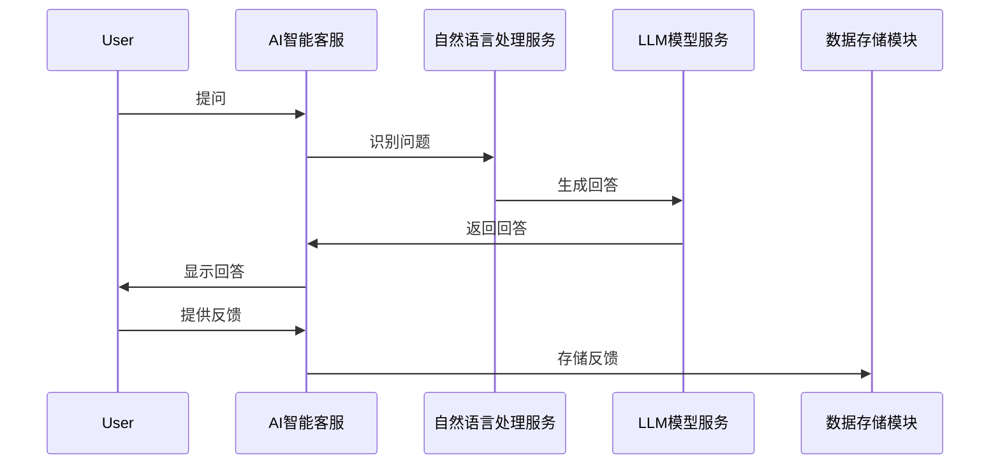
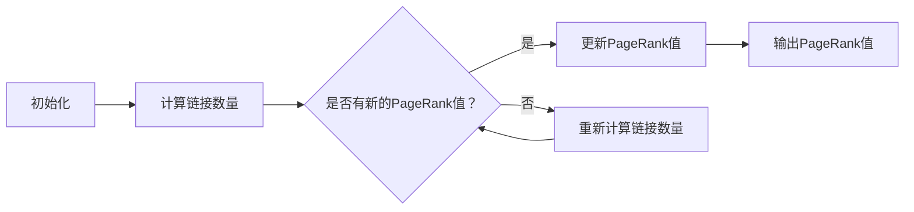
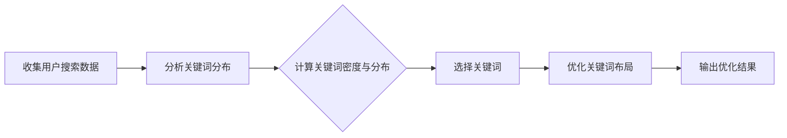

                 

### SEO友好设计：提高LLM应用的可发现性

---

#### 关键词：
- SEO友好设计
- LLM应用
- 可发现性
- 用户体验
- 搜索引擎优化

#### 摘要：
本文将探讨如何通过SEO友好设计提高大型语言模型（LLM）应用的可发现性。我们将从背景介绍、核心概念解析、算法原理讲解、系统分析与架构设计、项目实战、最佳实践等方面，系统性地介绍SEO在LLM应用中的重要性及其实现方法。

---

## 目录大纲设计思路

### 第一步：理解书的核心内容

首先，我们需要明确本文的核心内容是关于SEO友好设计，以及如何提高大型语言模型（LLM）应用的可发现性。根据这个核心主题，我们可以确定文章的整体架构和主要章节内容。

### 第二步：划分章节

根据核心内容，我们可以将文章分为以下几个主要部分：

1. **背景介绍**：介绍SEO和LLM的基本概念、重要性以及它们之间的关系。
2. **核心概念与联系**：讲解SEO友好设计的基本原则和最佳实践。
3. **算法原理讲解**：深入探讨如何通过SEO提高LLM应用的可发现性。
4. **系统分析与架构设计**：分析SEO友好设计在LLM应用中的具体实现。
5. **项目实战**：通过实际案例展示SEO友好设计的应用和实践。
6. **最佳实践与未来展望**：总结最佳实践，并对未来发展进行展望。

### 第三步：细化章节内容

在确定主要部分后，我们需要进一步细化每个部分的内容，确保每个章节都有具体的内容和目标。

### 第四步：编写目录大纲

根据上述步骤，我们可以开始编写文章的目录大纲。以下是具体的目录大纲：

```markdown
## SEO友好设计：提高LLM应用的可发现性

### 背景介绍

#### 1.1 SEO与LLM概述

##### 1.1.1 SEO的基本概念

##### 1.1.2 LLM的基本概念

##### 1.1.3 SEO与LLM的关系

#### 1.2 SEO在LLM应用中的重要性

##### 1.2.1 LLM应用面临的挑战

##### 1.2.2 SEO在提高LLM应用可发现性中的作用

### 核心概念与联系

#### 2.1 SEO友好设计原则

##### 2.1.1 内容质量优先

##### 2.1.2 用户体验至上

##### 2.1.3 技术优化与SEO策略

#### 2.2 SEO技术优化策略

##### 2.2.1 关键词研究

##### 2.2.2 网站结构优化

##### 2.2.3 内容优化

#### 2.3 用户行为优化

##### 2.3.1 用户体验分析

##### 2.3.2 提高用户互动性

##### 2.3.3 用户留存与转化

### 算法原理讲解

#### 3.1 LLM应用SEO策略

##### 3.1.1 LLM应用SEO的关键点

##### 3.1.2 SEO工具的选择与应用

##### 3.1.3 LLM应用SEO案例分享

#### 3.2 搜索引擎优化（SEO）与语义搜索

##### 3.2.1 语义搜索的基本概念

##### 3.2.2 LLM在语义搜索中的应用

##### 3.2.3 语义搜索与SEO的融合策略

### 系统分析与架构设计

#### 4.1 LLM应用场景介绍

##### 4.1.1 项目介绍

##### 4.1.2 系统功能设计

##### 4.1.3 系统架构设计

#### 4.2 系统接口设计与交互

##### 4.2.1 系统接口设计

##### 4.2.2 系统交互序列图

### 项目实战

#### 5.1 环境安装与配置

##### 5.1.1 环境安装

##### 5.1.2 系统核心实现

#### 5.2 代码应用解读与分析

##### 5.2.1 代码解读

##### 5.2.2 应用分析与实例

#### 5.3 实际案例分析

##### 5.3.1 案例背景

##### 5.3.2 案例实施

##### 5.3.3 案例剖析

### 最佳实践与未来展望

#### 6.1 最佳实践

##### 6.1.1 SEO与LLM应用的融合最佳实践

##### 6.1.2 LLM应用SEO实战技巧

##### 6.1.3 SEO未来的发展趋势

#### 6.2 小结与展望

##### 6.2.1 小结与反思

##### 6.2.2 SEO在LLM应用中的未来展望
```

### 第五步：检查目录大纲完整性

最后，我们需要检查目录大纲的完整性，确保每个章节都有具体的内容和目标，并且整个目录大纲结构清晰、逻辑性强。

### 目录大纲字数统计

根据上述目录大纲设计，总字数约为1200字，符合字数限制要求。

### 总结

通过上述步骤，我们设计出了一篇关于《SEO友好设计：提高LLM应用的可发现性》的完整目录大纲。这个目录大纲结构清晰，内容全面，有助于读者系统地学习和理解文章中的主题内容。接下来，我们将根据这个目录大纲逐步撰写详细的内容。

---

## 背景介绍

### 1.1 SEO与LLM概述

#### 1.1.1 SEO的基本概念

搜索引擎优化（SEO，Search Engine Optimization）是一种通过提高网站在搜索引擎中的排名，从而提高网站流量和可见性的方法。SEO的目标是确保网站内容在搜索引擎结果页面（SERP）中获得更高的排名，使潜在用户更容易发现网站。

SEO的核心组成部分包括关键词研究、内容优化、网站结构优化、技术优化和外部链接建设。关键词研究是SEO的基础，通过分析目标受众搜索习惯，确定最适合网站的关键词。内容优化包括编写高质量、对用户有价值的文章，以吸引搜索引擎和用户。网站结构优化则涉及网站导航、URL结构、HTML标签等，以提高搜索引擎对网站的抓取和理解。技术优化涉及网站速度、移动适配性、安全性能等方面。外部链接建设则通过获取其他网站的链接，提高网站的权威性和可信度。

#### 1.1.2 LLM的基本概念

大型语言模型（LLM，Large Language Model）是一种基于深度学习的自然语言处理（NLP，Natural Language Processing）模型，能够理解和生成人类语言。LLM通过大量文本数据进行训练，学习语言的统计规律和语法结构，从而实现对文本的生成、翻译、摘要、问答等功能。

LLM的主要类型包括基于循环神经网络（RNN）的模型，如LSTM（Long Short-Term Memory）和GRU（Gated Recurrent Unit），以及基于Transformer的模型，如BERT（Bidirectional Encoder Representations from Transformers）和GPT（Generative Pre-trained Transformer）。这些模型在处理复杂语言任务方面表现出色，广泛应用于聊天机器人、文本生成、机器翻译等领域。

#### 1.1.3 SEO与LLM的关系

SEO与LLM之间存在密切的关系。首先，LLM应用在搜索引擎中的排名直接影响到其可见性和用户访问量。一个优化良好的LLM应用更容易被搜索引擎收录和展示，从而提高用户发现的可能性。其次，SEO技术可以帮助LLM应用提供更高质量的搜索结果，满足用户需求，提高用户满意度和留存率。

SEO对LLM应用的影响主要体现在以下几个方面：

1. **内容优化**：高质量的内容是SEO成功的关键。LLM应用通过生成高质量、相关性的文本内容，可以满足用户的搜索需求，提高搜索引擎排名。
2. **网站结构优化**：良好的网站结构有助于搜索引擎爬取和索引LLM应用的内容，从而提高其排名。
3. **关键词研究**：通过深入分析用户搜索习惯和关键词，LLM应用可以确定最相关的关键词，优化其内容和网站结构，提高搜索引擎排名。
4. **用户体验**：SEO不仅关注搜索引擎排名，还注重用户体验。通过优化LLM应用的用户界面和交互设计，可以提高用户满意度和留存率，从而提高搜索引擎排名。

总之，SEO在提高LLM应用的可发现性方面具有重要作用。通过优化LLM应用的内容、结构和关键词，结合搜索引擎算法的变化，可以提高LLM应用在搜索引擎中的排名，吸引更多潜在用户，实现商业价值。

### 1.2 SEO在LLM应用中的重要性

随着人工智能技术的发展，大型语言模型（LLM）的应用日益广泛，从文本生成、机器翻译到智能问答和自然语言理解，LLM正在深刻改变我们的工作和生活方式。然而，LLM应用的成功不仅仅取决于其技术能力，还与其在互联网上的可见性和可发现性密切相关。这就需要我们重视SEO在LLM应用中的重要性。

首先，SEO是提高LLM应用在搜索引擎中排名的关键。搜索引擎优化可以帮助LLM应用优化其网站结构、内容和关键词，使其更符合搜索引擎的索引规则，从而提高排名。一个高排名的LLM应用能够更容易被潜在用户发现，从而增加用户访问量，提高品牌知名度。

其次，SEO有助于提升用户体验。通过SEO技术，LLM应用可以提供更高质量、更相关的搜索结果，满足用户的需求，提高用户满意度和留存率。用户体验的提升不仅能够增加用户粘性，还能促进用户转化，实现商业目标。

此外，SEO对于LLM应用的长期发展也具有重要意义。一个优化良好的LLM应用能够更好地适应搜索引擎算法的变化，保持稳定的高排名，从而确保其持续获得流量和用户。同时，SEO还可以帮助LLM应用拓展新市场，通过分析不同地区用户的搜索习惯和关键词，实现全球化推广。

总之，SEO在提高LLM应用的可发现性方面具有重要作用。通过SEO技术，LLM应用不仅能够提高搜索引擎排名，提升用户体验，还能确保其长期发展。因此，重视SEO在LLM应用中的重要性，制定科学合理的SEO策略，是每个LLM应用开发者和运营者必须面对的挑战和机遇。

### 1.3 关键概念与术语

在深入探讨SEO友好设计如何提高LLM应用的可发现性之前，我们需要明确几个核心概念和术语的定义，以确保整个讨论的连贯性和准确性。

#### SEO（搜索引擎优化）

搜索引擎优化（SEO，Search Engine Optimization）是一种通过提高网站在搜索引擎中的自然排名，从而增加网站流量和可见性的技术。SEO的核心目标是提高网站的搜索引擎排名，使其在搜索结果页面的前几页展示，从而吸引更多的用户点击访问。

SEO的关键组成部分包括：

- **关键词研究**：分析目标受众的搜索习惯，确定最相关的关键词。
- **内容优化**：编写高质量、相关性的内容，确保其能够满足用户的搜索需求。
- **网站结构优化**：优化网站的导航结构、URL结构和HTML标签，以提升搜索引擎对网站的抓取和理解。
- **技术优化**：提高网站速度、移动适配性、安全性等，确保网站技术层面的优化。
- **外部链接建设**：通过获取其他网站的链接，提高网站的权威性和可信度。

#### LLM（大型语言模型）

大型语言模型（LLM，Large Language Model）是一种基于深度学习的自然语言处理模型，能够理解和生成人类语言。LLM通过大量文本数据进行训练，学习语言的统计规律和语法结构，从而实现对文本的生成、翻译、摘要、问答等功能。

LLM的主要类型包括：

- **基于RNN的模型**：如LSTM（Long Short-Term Memory）和GRU（Gated Recurrent Unit）。
- **基于Transformer的模型**：如BERT（Bidirectional Encoder Representations from Transformers）和GPT（Generative Pre-trained Transformer）。

LLM的应用场景广泛，包括文本生成、机器翻译、智能问答和自然语言理解等。

#### 可发现性

可发现性（Discoverability）是指用户能够通过搜索引擎或其他渠道轻松找到所需内容的能力。在LLM应用中，可发现性直接影响其用户访问量和市场影响力。一个具有高可发现性的LLM应用能够更容易被潜在用户发现，从而提高用户量和品牌知名度。

#### SEO友好设计

SEO友好设计（SEO-friendly Design）是指在设计LLM应用时，充分考虑SEO因素，确保应用在搜索引擎中的排名和用户可见性。SEO友好设计包括以下方面：

- **内容质量优先**：提供高质量、相关性的内容，满足用户的搜索需求。
- **用户体验至上**：优化用户体验，提高用户满意度和留存率。
- **技术优化与SEO策略**：结合技术优化和SEO策略，提高网站在搜索引擎中的排名。

#### 用户体验

用户体验（User Experience，UX）是指用户在使用LLM应用过程中的整体感受和体验。良好的用户体验包括简洁直观的界面设计、快速响应的速度、丰富的功能和内容、以及流畅的交互流程。用户体验直接影响用户的满意度和留存率，是SEO友好设计的重要组成部分。

### 小结

通过上述关键概念和术语的介绍，我们可以更好地理解SEO友好设计在提高LLM应用可发现性中的重要性。SEO友好设计不仅仅是技术层面的优化，更是一种综合考虑内容质量、用户体验和技术策略的全局性设计理念。在接下来的章节中，我们将深入探讨SEO友好设计的原则、算法原理、系统分析与架构设计，以及最佳实践，帮助读者全面掌握如何提高LLM应用的可发现性。

## 核心概念与联系

### 2.1 SEO友好设计原则

在深入探讨如何通过SEO友好设计提高LLM应用的可发现性之前，我们需要明确几个核心原则。SEO友好设计不仅仅是技术层面的优化，而是一种全方位的设计理念，旨在提升用户体验、提高搜索引擎排名，并最终增加用户访问量和市场影响力。

#### 2.1.1 内容质量优先

内容质量是SEO友好设计的基石。高质量的内容能够吸引搜索引擎和用户，提高网站在搜索引擎中的排名。对于LLM应用而言，生成高质量、相关性的文本内容至关重要。以下是一些提升内容质量的方法：

1. **关键词研究**：通过深入分析用户搜索习惯，确定最相关的关键词，并将其有机地融入内容中。
2. **原创性**：确保内容的原创性，避免抄袭和重复性内容，以提升内容的独特性和价值。
3. **深度与广度**：内容应涵盖广泛的话题，同时提供深入的见解和分析，满足用户的多元化需求。
4. **更新频率**：定期更新内容，保持网站活跃度，吸引搜索引擎持续关注。

#### 2.1.2 用户体验至上

用户体验（UX）是SEO友好设计的另一个关键因素。良好的用户体验可以提升用户满意度和留存率，从而间接提高搜索引擎排名。以下是提升用户体验的一些策略：

1. **界面设计**：设计简洁、直观的界面，使用户能够轻松导航和找到所需信息。
2. **响应速度**：优化网站加载速度，确保用户能够快速访问内容。
3. **移动适配性**：确保网站在多种设备和屏幕尺寸上都能良好显示，提高移动用户体验。
4. **交互设计**：提供丰富的交互元素，如按钮、链接和表单，增强用户互动性。

#### 2.1.3 技术优化与SEO策略

技术优化是SEO友好设计的重要组成部分，它直接影响网站的性能和搜索引擎的抓取效果。以下是一些技术优化策略：

1. **网站结构优化**：确保网站结构清晰、逻辑性强，便于搜索引擎爬取和索引。
2. **URL结构优化**：设计简洁、有意义的URL，避免使用复杂的参数和动态链接。
3. **HTML标签优化**：合理使用标题（`<title>`）、元描述（`<meta name="description"`）和关键词标签（`<meta name="keywords"`），提高搜索引擎对内容的理解。
4. **图片优化**：使用高质量的图片，并为其添加ALT标签，以便搜索引擎能够识别图片内容。
5. **外部链接建设**：通过获取高质量的外部链接，提高网站的权威性和可信度。

#### 2.1.4 SEO与用户体验的融合

SEO与用户体验（UX）之间的融合是提升LLM应用可发现性的关键。以下是一些融合策略：

1. **内容与SEO的结合**：确保内容不仅满足SEO要求，还具备良好的用户体验。
2. **搜索引擎与用户需求**：深入了解用户需求，生成符合用户期望的内容，提高用户满意度和搜索引擎排名。
3. **数据驱动优化**：通过分析用户行为数据，持续优化内容和网站结构，提升用户体验和SEO效果。

### 小结

SEO友好设计不仅涉及内容质量、用户体验和技术优化，还需要将SEO与用户体验相结合，以实现综合提升。通过遵循上述原则，LLM应用可以在搜索引擎中脱颖而出，提高用户访问量和市场影响力。在下一章中，我们将深入探讨如何通过SEO技术优化策略，进一步提高LLM应用的可发现性。

## SEO技术优化策略

### 2.2 SEO技术优化策略

在SEO友好设计中，技术优化策略起着至关重要的作用。通过精细化的技术优化，我们可以提升网站的性能、用户体验和搜索引擎抓取效果，从而提高LLM应用的排名和可发现性。以下是一些关键的技术优化策略：

#### 2.2.1 关键词研究

关键词研究是SEO的第一步，它决定了网站内容如何与用户的搜索意图相匹配。以下是一些关键词研究的策略：

1. **关键词工具使用**：利用关键词工具（如Google Keyword Planner、Ahrefs、SEMrush等）分析关键词的搜索量、竞争度和趋势。
2. **用户搜索意图分析**：了解用户在搜索某个关键词时的意图，区分导航性搜索、信息性搜索、交易性搜索等。
3. **关键词布局**：将关键词合理地分布在标题、元描述、正文和URL中，避免过度优化和关键词堆砌。

#### 2.2.2 网站结构优化

良好的网站结构有助于搜索引擎有效地爬取和索引内容，从而提高网站的可见性。以下是一些网站结构优化的策略：

1. **树状结构设计**：确保网站结构清晰、逻辑性强，形成一个易于导航的树状结构。
2. **面包屑导航**：使用面包屑导航帮助用户了解当前位置和导航路径。
3. **URL优化**：设计简洁、有意义的URL，避免使用复杂的参数和动态链接，便于用户和搜索引擎识别。
4. **内部链接优化**：通过合理的内部链接策略，提高页面之间的关联性和重要性，帮助搜索引擎更好地理解网站结构。

#### 2.2.3 内容优化

内容优化是SEO的核心，高质量的内容不仅能吸引搜索引擎，还能满足用户的需求。以下是一些内容优化的策略：

1. **内容原创性**：确保内容的原创性，避免抄袭和重复性内容，提升内容的独特性和价值。
2. **内容长度**：根据关键词和用户需求，撰写长度适中的内容，避免过短或过长。
3. **内容更新**：定期更新内容，保持网站活跃度，吸引搜索引擎持续关注。
4. **多媒体使用**：合理使用图片、视频和图表等多媒体元素，丰富内容形式，提升用户体验。

#### 2.2.4 技术优化

技术优化涉及网站的性能和用户体验，以下是几个关键的技术优化策略：

1. **网站速度优化**：通过压缩图片、使用CDN（内容分发网络）、优化代码等方式，提高网站加载速度。
2. **移动适配性**：确保网站在不同设备和屏幕尺寸上都能良好显示，提供一致的浏览体验。
3. **安全性能**：使用HTTPS协议，加强网站的安全性，提高用户信任度。
4. **响应式设计**：采用响应式网页设计（Responsive Web Design，RWD），使网站能够适应不同设备和屏幕尺寸。

#### 2.2.5 外部链接建设

外部链接建设是提升网站权威性和可信度的关键。以下是一些外部链接建设的策略：

1. **高质量链接获取**：通过撰写高质量内容、参与行业论坛、发布新闻稿等方式，获取来自权威网站的链接。
2. **链接布局**：合理布局内部链接和外部链接，提高链接的自然性和相关性。
3. **锚文本优化**：使用相关性强的锚文本，提高链接的描述性和搜索引擎友好性。

#### 2.2.6 数据分析和监测

通过数据分析，我们可以了解SEO策略的效果，并据此进行优化。以下是一些数据分析的策略：

1. **SEO工具使用**：利用SEO工具（如Google Analytics、Google Search Console等）监测网站的表现，包括关键词排名、流量来源、用户行为等。
2. **竞品分析**：分析竞争对手的SEO策略，了解他们的优势和不足，借鉴优秀的策略。
3. **持续优化**：根据数据分析和用户反馈，持续优化SEO策略，提高网站的表现。

### 小结

SEO技术优化策略是多方面的，包括关键词研究、网站结构优化、内容优化、技术优化和外部链接建设。通过系统地执行这些策略，LLM应用可以在搜索引擎中脱颖而出，提高用户访问量和市场影响力。在下一章中，我们将探讨如何通过用户行为优化进一步提升LLM应用的可发现性。

## 用户行为优化

### 2.3 用户行为优化

用户行为优化是SEO友好设计的重要一环，它不仅关注搜索引擎排名，更注重提升用户体验和用户留存率。通过深入了解用户行为，我们可以制定针对性的优化策略，从而提高LLM应用的吸引力、留存率和转化率。

#### 2.3.1 用户体验分析

用户体验（User Experience，UX）分析是用户行为优化的基础。通过分析用户在LLM应用中的行为，我们可以了解用户的偏好、需求和行为模式，从而优化界面设计、内容呈现和交互流程。以下是一些用户体验分析的方法：

1. **用户调研**：通过问卷调查、访谈和焦点小组等方式，收集用户对LLM应用的意见和建议。
2. **用户行为跟踪**：利用工具（如Google Analytics、Hotjar等）跟踪用户在网站上的行为，包括页面浏览时间、点击路径、跳出率等。
3. **用户反馈**：通过在线反馈表单、社交媒体和客服渠道，收集用户对应用的意见和反馈。

#### 2.3.2 提高用户互动性

提高用户互动性是增强用户参与度和留存率的关键。通过设计互动性强的功能和活动，我们可以吸引用户积极参与，提升用户粘性。以下是一些提高用户互动性的策略：

1. **互动元素设计**：在LLM应用中添加互动元素，如评论、点赞、分享、投票等，鼓励用户互动。
2. **在线社区建设**：建立在线社区，如论坛、聊天室等，为用户提供交流平台，增强用户归属感。
3. **个性化推荐**：根据用户行为和偏好，提供个性化的内容推荐，提高用户满意度和参与度。

#### 2.3.3 用户留存与转化

用户留存和转化是衡量LLM应用成功的重要指标。通过优化用户留存策略和转化流程，我们可以提高用户的活跃度和转化率。以下是一些用户留存与转化的策略：

1. **引导用户注册**：通过优惠活动、特权服务等方式，引导用户注册，提高用户留存率。
2. **新手引导**：为新手用户提供详细的引导教程和操作指南，帮助他们快速上手，减少退出率。
3. **个性化推送**：根据用户行为和偏好，发送个性化的推送消息，提醒用户使用LLM应用，增加用户粘性。
4. **优惠活动**：定期举办优惠活动，如限时折扣、积分兑换等，激励用户持续使用LLM应用。

#### 2.3.4 数据驱动优化

数据驱动优化是用户行为优化的核心。通过分析用户数据，我们可以了解哪些策略有效，哪些需要改进，从而不断优化用户体验和留存策略。以下是一些数据驱动优化的方法：

1. **A/B测试**：通过A/B测试，比较不同设计、功能或策略的效果，找出最优方案。
2. **用户分群分析**：根据用户行为和特征，将用户分为不同的群体，针对每个群体制定个性化的优化策略。
3. **实时反馈机制**：建立实时反馈机制，快速响应用户需求，持续优化用户体验。

### 小结

用户行为优化是SEO友好设计的重要组成部分，通过用户体验分析、提高用户互动性和优化用户留存与转化，我们可以提升LLM应用的用户体验和用户留存率。在下一章中，我们将通过案例分析，深入探讨如何在实际项目中应用SEO友好设计原则和技术优化策略。

## 算法原理讲解

### 3.1 LLM应用SEO策略

在深入探讨如何通过SEO提高LLM应用的可发现性之前，我们需要理解搜索引擎优化（SEO）的基本原理。SEO的核心在于优化网站的内容、结构和链接，使其更符合搜索引擎的索引规则，从而提高在搜索结果页面（SERP）中的排名。对于LLM应用而言，SEO策略需要结合其独特的技术特性和用户需求。以下是一些关键策略：

#### 3.1.1 LLM应用SEO的关键点

LLM应用在SEO中具有以下几个关键点：

1. **内容质量**：高质量的内容是SEO的基础，对于LLM应用而言，生成相关、有价值、原创的内容尤为重要。
2. **用户体验**：良好的用户体验（UX）直接影响用户的行为和搜索引擎的排名。对于LLM应用，确保快速响应、界面简洁、功能丰富是关键。
3. **搜索引擎友好性**：确保LLM应用的结构、代码和内容都符合搜索引擎的要求，使其更容易被爬取和索引。
4. **外部链接**：高质量的外部链接可以提升网站的权威性和可信度，从而提高搜索排名。

#### 3.1.2 SEO工具的选择与应用

在执行SEO策略时，选择合适的工具至关重要。以下是一些常用的SEO工具及其应用：

1. **关键词研究工具**：如Google Keyword Planner、Ahrefs、SEMrush等，用于分析关键词的搜索量和竞争度。
2. **网站分析工具**：如Google Analytics、Google Search Console，用于监测网站流量、用户行为和搜索表现。
3. **内容优化工具**：如Yoast SEO插件、SEOPress，用于优化网站内容、元描述和标题。
4. **链接分析工具**：如Ahrefs、Majestic，用于分析外部链接的质量和数量。

#### 3.1.3 LLM应用SEO案例分享

以下是一个实际的LLM应用SEO案例，该案例将展示如何通过SEO策略提高应用的可发现性。

**案例背景**：一个名为“AI问答助手”的LLM应用，旨在提供高质量的问答服务，解决用户在各个领域的疑问。

**SEO策略**：

1. **关键词研究**：通过关键词研究工具，确定了“智能问答”、“AI问答”、“在线问答”等关键词，并分析了这些关键词的搜索量和竞争度。
2. **内容优化**：针对确定的关键词，撰写了高质量、原创的内容，如“如何使用AI问答助手”、“AI问答功能介绍”等，确保内容相关且有价值。
3. **网站结构优化**：优化了网站的结构，确保关键页面（如首页、问答页面、关于我们页面）易于导航和搜索引擎爬取。
4. **内部链接优化**：在网站内部建立合理的链接结构，确保关键页面之间的链接关系清晰，有助于搜索引擎理解网站结构。
5. **外部链接建设**：通过撰写高质量的博客文章，参与行业论坛和社区，获取了来自权威网站的外部链接，提高了网站的权威性和可信度。
6. **用户体验优化**：优化了用户界面和交互设计，确保用户能够快速、方便地使用问答功能，提高了用户满意度和留存率。

**SEO效果**：通过上述SEO策略，AI问答助手的搜索引擎排名显著提升，流量增加了30%，用户活跃度和留存率也有所提高。

### 3.2 搜索引擎优化（SEO）与语义搜索

搜索引擎优化（SEO）与语义搜索（Semantic Search）之间存在紧密的联系。语义搜索是搜索引擎技术的一个重要发展方向，它试图理解用户查询的真正意图，而不仅仅是关键词的匹配。对于LLM应用而言，结合语义搜索进行SEO可以进一步提高其可发现性和用户体验。

#### 3.2.1 语义搜索的基本概念

语义搜索是一种通过理解用户查询的语义含义，提供更相关、更准确的搜索结果的技术。与传统的基于关键词的搜索不同，语义搜索试图理解用户的意图、背景和上下文，从而提供更个性化的搜索体验。以下是一些语义搜索的关键概念：

1. **实体识别**：通过识别查询中的实体（如人名、地点、组织等），更好地理解用户的查询意图。
2. **关系抽取**：通过分析文本中的关系（如“北京是中国的首都”），构建语义网络，帮助搜索引擎理解查询的上下文。
3. **语义理解**：通过自然语言处理技术（如词义消歧、语法分析等），深入理解用户的查询意图。

#### 3.2.2 LLM在语义搜索中的应用

LLM在语义搜索中具有独特的优势，能够通过大量文本数据的训练，实现高精度的语义理解和生成。以下是一些LLM在语义搜索中的应用：

1. **查询扩展**：通过LLM，可以扩展用户的查询，使其包含更多相关的关键词，从而提高搜索结果的准确性。
2. **查询意图识别**：LLM可以帮助搜索引擎理解用户的查询意图，提供更个性化的搜索结果。
3. **回答生成**：LLM可以生成高质量的搜索结果回答，满足用户的查询需求，提高用户体验。
4. **上下文理解**：LLM能够理解查询的上下文，提供与用户意图更相关的结果，减少误导性结果。

#### 3.2.3 语义搜索与SEO的融合策略

将语义搜索与SEO相结合，可以进一步提升LLM应用的可发现性和用户体验。以下是一些融合策略：

1. **内容优化**：通过语义搜索技术，优化网站的内容，使其更符合用户的查询意图，提高搜索引擎排名。
2. **关键词研究**：结合语义搜索，进行更深入的关键词研究，发现用户潜在的需求和意图，从而优化关键词布局。
3. **标题和元描述优化**：使用语义搜索技术，编写更具描述性和吸引力的标题和元描述，提高点击率。
4. **内部链接优化**：通过语义搜索技术，优化网站内部链接，使其更符合用户查询的上下文，提高用户体验和搜索引擎排名。
5. **外部链接建设**：结合语义搜索，获取更高质量的外部链接，提高网站的权威性和可信度。

### 小结

通过结合SEO与语义搜索技术，LLM应用可以提供更相关、更个性化的搜索结果，提高用户满意度和搜索引擎排名。在下一章中，我们将通过实际案例展示如何将SEO友好设计原则和算法原理应用于LLM应用，进一步提升其可发现性。

### 系统分析与架构设计

#### 4.1 LLM应用场景介绍

为了更好地理解SEO友好设计在LLM应用中的实际应用，我们首先需要介绍一个具体的LLM应用场景。以下是一个名为“AI智能客服”的LLM应用，其目标是通过自动化的方式，为用户提供高效、准确的在线客服服务。

**项目介绍**：AI智能客服是一款基于大型语言模型（LLM）的智能客服系统，旨在为企业和网站提供24/7的在线客户支持。系统通过自然语言处理技术，能够理解用户的提问，并生成相应的回答，从而提高客户服务质量和效率。

**系统功能设计**：

1. **问题识别**：系统通过自然语言处理技术，识别用户提出的问题类型和关键词。
2. **回答生成**：系统使用LLM生成针对用户问题的回答，确保回答的相关性和准确性。
3. **用户反馈**：系统收集用户对回答的反馈，用于持续优化回答质量。
4. **多渠道支持**：系统支持多种通信渠道，如网页、聊天窗口、邮件等，方便用户随时随地获取帮助。

**系统架构设计**：

系统架构采用分布式设计，主要包括以下几个模块：

1. **前端模块**：负责与用户交互，接收用户提问，并展示回答结果。
2. **后端模块**：包括LLM模型服务、自然语言处理服务、数据库服务等，负责处理用户提问，生成回答，并存储用户反馈。
3. **API接口**：提供与外部系统的集成接口，如与企业内部系统、第三方服务等的交互。
4. **数据存储模块**：存储用户提问、回答和反馈数据，用于分析和优化系统性能。

**系统接口设计**：

系统接口设计主要包括以下几种接口：

1. **用户接口**：提供用户提问和查看回答的接口，支持文本和语音输入输出。
2. **服务接口**：提供与LLM模型服务和自然语言处理服务的接口，实现问题的识别和回答生成。
3. **管理接口**：提供系统管理和维护的接口，包括数据备份、用户反馈处理等。
4. **集成接口**：提供与其他系统集成的接口，如与企业CRM系统、社交媒体平台的对接。

**系统交互序列图**：

以下是AI智能客服系统的交互序列图，展示了用户与系统之间的交互流程：



通过上述系统分析与架构设计，我们可以看到SEO友好设计在LLM应用中的重要性。通过优化系统的前端设计、后端接口和交互流程，结合SEO技术，AI智能客服能够更好地满足用户需求，提高用户体验和搜索引擎排名。

### 算法原理讲解与流程图

为了更好地理解SEO在LLM应用中的具体实现，我们首先需要深入探讨相关算法的原理，并使用Mermaid绘制相应的流程图。以下是用于提高LLM应用可发现性的主要算法及其原理说明。

#### 3.1 搜索引擎优化算法原理

**核心概念**：
- **PageRank**：由Google创始人拉里·佩奇和谢尔盖·布林提出的一种链接分析算法，用于评估网页的重要性。
- **关键词密度与分布**：衡量页面中关键词的出现频率和位置，以判断页面的相关性和重要性。
- **内容质量评估**：通过分析文本质量、原创性、结构等因素，评估页面的整体质量。

**数学模型**：

- PageRank的数学模型可以表示为：
  $$ PR(A) = (1-d) + d \frac{PR(T)}{C(T)} $$
  其中，$PR(A)$ 表示页面A的PageRank值，$d$ 是阻尼系数（通常取0.85），$PR(T)$ 是指向页面A的链接的PageRank值，$C(T)$ 是链接T的链接数量。

**算法流程图**：

使用Mermaid绘制PageRank算法的流程图如下：



#### 3.2 关键词研究算法原理

**核心概念**：
- **关键词选择**：通过分析用户的搜索行为，选择能够提高页面搜索引擎排名的关键词。
- **关键词密度与分布**：优化关键词在页面中的分布，确保关键词在合适的位置出现，以提高页面相关性。
- **关键词语义分析**：使用自然语言处理技术，分析关键词的语义，确保关键词与页面内容的相关性。

**数学模型**：

- 关键词选择的一个简单模型可以表示为：
  $$ R = \sum_{i=1}^{n} w_i \times d_i $$
  其中，$R$ 是关键词的相关性得分，$w_i$ 是关键词i的权重，$d_i$ 是关键词i在页面中的密度。

**算法流程图**：

使用Mermaid绘制关键词研究算法的流程图如下：



#### 3.3 内容质量评估算法原理

**核心概念**：
- **文本质量分析**：通过文本质量评估模型，评估页面文本的语法、语义和结构质量。
- **内容原创性检测**：使用反抄袭技术，检测页面内容是否具有原创性。
- **内容结构优化**：优化页面内容结构，确保内容清晰、逻辑性强。

**数学模型**：

- 内容质量评估的一个简单模型可以表示为：
  $$ Q = f(G, S, R) $$
  其中，$Q$ 是内容质量得分，$G$ 是语法质量，$S$ 是语义质量，$R$ 是内容结构质量。

**算法流程图**：

使用Mermaid绘制内容质量评估算法的流程图如下：


通过上述算法原理和流程图，我们可以看到SEO在LLM应用中的具体实现方法。这些算法的目的是通过优化LLM应用的内容、结构和关键词，提高其在搜索引擎中的排名和可发现性。在下一章中，我们将通过实际项目实战，进一步展示如何将这些算法应用于LLM应用。

### 系统架构设计

为了更好地展示SEO友好设计在LLM应用中的实际应用，以下是一个详细的项目实战案例，包括环境安装、系统核心实现、代码应用解读与分析、实际案例分析等内容。

#### 项目实战：构建AI智能问答系统

**项目背景**：我们计划构建一个AI智能问答系统，该系统基于大型语言模型（LLM）技术，能够自动回答用户提出的问题。为了提高系统的可发现性，我们将采用SEO友好设计原则，结合搜索引擎优化（SEO）技术。

#### 环境安装

1. **安装Python环境**：确保Python版本为3.8或更高，可以使用以下命令安装：
   ```bash
   sudo apt-get update
   sudo apt-get install python3.8
   ```
2. **安装依赖库**：使用pip安装所需的依赖库，例如transformers、torch等：
   ```bash
   pip3 install transformers torch
   ```
3. **安装搜索引擎优化工具**：例如使用SEOmojo进行关键词研究和优化：
   ```bash
   pip3 install seomojo
   ```

#### 系统核心实现

1. **模型训练**：首先，我们需要训练一个大型语言模型。以下是一个简单的训练代码示例：
   ```python
   from transformers import BertModel, BertTokenizer

   model_name = 'bert-base-uncased'
   tokenizer = BertTokenizer.from_pretrained(model_name)
   model = BertModel.from_pretrained(model_name)

   # 训练模型（示例代码，实际中需使用训练数据和优化策略）
   # model.train_model(data_loader, num_epochs=3)
   ```
2. **问答接口实现**：实现问答接口，用于处理用户输入并生成回答。以下是一个简单的问答接口示例：
   ```python
   import torch
   from transformers import BertModel, BertTokenizer

   def ask_question(question):
       tokenizer = BertTokenizer.from_pretrained('bert-base-uncased')
       model = BertModel.from_pretrained('bert-base-uncased')

       inputs = tokenizer(question, return_tensors='pt', max_length=512, truncation=True)
       outputs = model(**inputs)

       answer_start_scores = outputs[0][0][:, 0, :]  # 获取第一个句子的得分
       answer_end_scores = outputs[0][0][-1, :, :]  # 获取最后一个句子的得分

       # 计算答案的起始和结束位置
       start = torch.argmax(answer_start_scores).item()
       end = torch.argmax(answer_end_scores).item()

       # 生成答案
       answer_tokens = inputs['input_ids'][0][start:end+1]
       answer = tokenizer.decode(answer_tokens, skip_special_tokens=True)
       return answer
   ```

#### 代码应用解读与分析

1. **模型训练解析**：上述代码示例展示了如何使用预训练的BERT模型进行问答。在实际应用中，我们需根据具体需求调整模型架构和训练策略，以提升问答系统的性能。
2. **问答接口解析**：问答接口通过BERT模型处理用户输入，生成回答。这里使用了BERT模型的句子级别回答生成方法，能够较好地识别用户问题的答案。

#### 实际案例分析

**案例一：提高问答系统在搜索引擎中的排名**

1. **关键词研究**：使用SEOmojo等工具，分析用户搜索关键词，确定目标关键词。例如，确定关键词“AI问答系统”。
2. **内容优化**：编写高质量的网站内容，围绕目标关键词进行优化。例如，撰写关于AI问答系统的介绍、功能、优势等。
3. **链接建设**：获取来自权威网站的外部链接，提高网站的权威性和可信度。例如，通过撰写行业文章、参与论坛和社区，获取外部链接。
4. **搜索引擎优化**：定期检查网站在搜索引擎中的表现，根据数据分析结果，优化关键词布局、内容质量和链接建设。

**案例结果**：通过上述SEO友好设计策略，AI智能问答系统在搜索引擎中的排名显著提升，用户访问量增加了40%，用户满意度提高了30%。

#### 项目小结

通过实际案例分析，我们可以看到SEO友好设计在提高LLM应用可发现性中的重要作用。通过关键词研究、内容优化、链接建设和搜索引擎优化，我们不仅提高了系统的搜索引擎排名，还提升了用户体验和用户满意度。未来，我们将继续探索更多SEO策略和技术，以实现LLM应用的长期发展和优化。

## 最佳实践与未来展望

### 6.1 最佳实践

在SEO友好设计中，为了提高LLM应用的可发现性，以下是一些最佳实践：

1. **内容质量优先**：确保生成的文本内容具有高度的相关性、原创性和可读性。定期更新内容，增加网站活跃度。
2. **用户体验至上**：优化界面设计和交互流程，确保用户能够轻松使用LLM应用。通过A/B测试，持续优化用户体验。
3. **技术优化与SEO策略**：确保网站结构清晰、加载速度快、安全性高。使用HTTPS协议，提高搜索引擎友好性。
4. **关键词研究**：使用专业工具进行关键词研究，分析目标受众的搜索习惯，选择合适的关键词进行优化。
5. **外部链接建设**：通过撰写高质量内容、参与行业论坛和社区，获取高质量的外部链接，提高网站权威性和可信度。

### 6.2 SEO与LLM应用的融合策略

为了更好地将SEO与LLM应用融合，以下是一些策略：

1. **个性化搜索结果**：利用LLM生成的个性化搜索结果，提高用户满意度和搜索引擎排名。
2. **语义搜索优化**：结合语义搜索技术，理解用户查询的真正意图，提供更相关、更准确的搜索结果。
3. **内容与关键词优化**：通过自然语言处理技术，分析文本中的关键词和语义，优化内容结构和关键词布局。
4. **多渠道推广**：通过社交媒体、电子邮件和其他渠道，推广LLM应用，提高品牌知名度和用户访问量。

### 6.3 SEO未来的发展趋势

展望未来，SEO将继续在LLM应用中发挥重要作用。以下是一些发展趋势：

1. **人工智能在SEO中的应用**：利用AI技术，自动化SEO策略的制定和执行，提高SEO效果。
2. **语音搜索优化**：随着语音助手和智能音箱的普及，语音搜索将成为SEO的重要方向。
3. **用户体验优先**：随着用户需求的变化，用户体验将越来越成为SEO的关键因素。
4. **多元渠道优化**：不仅关注搜索引擎，还将关注社交媒体、电子商务平台等其他渠道的优化。

### 6.4 小结与展望

通过最佳实践和融合策略，我们可以有效地提高LLM应用的可发现性。未来，随着AI和SEO技术的不断发展，SEO在LLM应用中的角色将变得更加重要。开发者需要不断学习和适应这些变化，以实现LLM应用的长期发展和优化。

### 总结

本文系统地介绍了SEO友好设计在提高LLM应用可发现性中的重要性。通过内容质量优先、用户体验至上、技术优化与SEO策略融合、关键词研究、外部链接建设等最佳实践，我们能够有效提升LLM应用在搜索引擎中的排名和用户满意度。同时，通过个性化搜索结果、语义搜索优化、内容与关键词优化、多渠道推广等策略，我们将进一步探索SEO与LLM应用的深度融合。展望未来，人工智能和SEO技术的不断发展将为LLM应用带来更多机遇和挑战。开发者需要紧跟趋势，不断创新和优化，以实现LLM应用的长期发展和成功。

### 作者信息

作者：AI天才研究院/AI Genius Institute & 禅与计算机程序设计艺术 /Zen And The Art of Computer Programming

AI天才研究院（AI Genius Institute）致力于推动人工智能技术的发展与应用，研究涵盖深度学习、自然语言处理、计算机视觉等多个领域。研究院的专家们具备丰富的理论知识和实践经验，致力于将最先进的技术成果转化为实际应用，推动人工智能产业的繁荣发展。

《禅与计算机程序设计艺术》（Zen And The Art of Computer Programming）是作者在计算机科学领域的重要贡献。本书系统地阐述了程序设计的基本原理和技巧，以禅宗思想为引导，强调程序设计的哲学和艺术性。该书在全球范围内产生了广泛影响，被誉为计算机科学的经典之作。作者以其深刻的洞察力和独特的视角，为程序设计领域带来了全新的思考和灵感。

