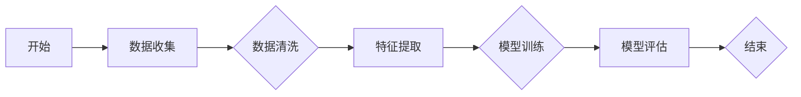
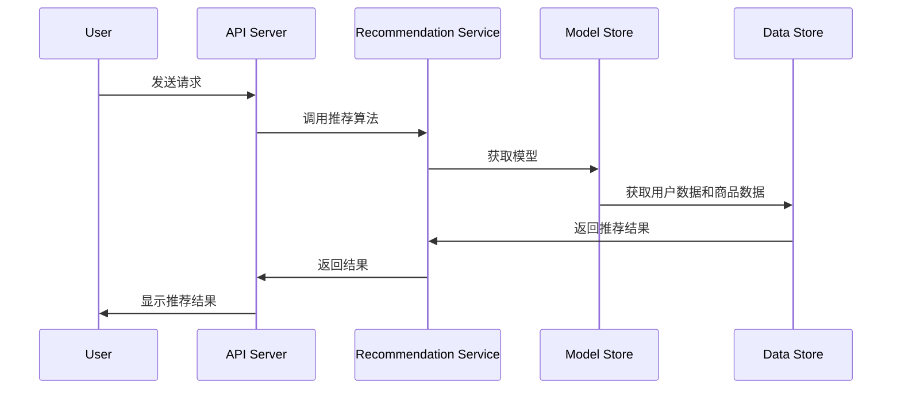

                 

### SRE实践：确保AI服务高可用性的运维方法

关键词：SRE、AI服务、高可用性、运维方法、性能优化、容错设计

摘要：本文将深入探讨SRE（Site Reliability Engineering）在确保AI服务高可用性方面的实践方法。通过分析SRE的核心概念、工作流程以及AI服务的特性，我们将逐步介绍如何构建AI服务的高可用性，包括基础设施的搭建、性能优化和容错设计等方面。此外，还将结合实际案例，展示SRE在电商和金融领域的应用，并探讨未来的发展趋势。

## 第一部分：SRE基础

### 第1章：SRE的背景与重要性

#### 1.1.1 SRE的起源与发展
SRE起源于Google，是“运维工程”的一种现代形式，结合了软件开发和系统运维的最佳实践。其核心理念是确保系统的可靠性和可用性，同时保持高效的生产力。

#### 1.1.2 SRE与IT运维的区别
SRE关注的是“可靠性工程”，而传统的IT运维更多关注的是日常任务和故障的修复。SRE更注重通过自动化和系统的设计来预防问题，而IT运维更侧重于应对已经发生的问题。

#### 1.1.3 SRE在AI服务高可用性中的关键作用
随着AI服务的普及，其对高可用性的要求越来越高。SRE提供了一系列的工具和方法，如自动化部署、监控和故障恢复等，以确保AI服务能够稳定、可靠地运行。

### 第2章：SRE的核心概念

#### 2.1.1 服务级别协议（SLA）
SLA是双方之间对服务质量达成的一致。对于AI服务，SLA通常包括响应时间、故障修复时间等关键指标。

#### 2.1.2 可用性、可靠性与性能
- 可用性：系统在规定的时间内正常运行的能力。
- 可靠性：系统能够连续无故障运行的能力。
- 性能：系统处理任务的速度和质量。

#### 2.1.3 监控、日志与告警
监控是确保系统正常运行的关键。日志记录系统运行的所有事件，告警则是在系统出现问题时及时通知相关人员。

### 第3章：SRE工作流程

#### 3.1.1 服务部署与发布
SRE强调持续集成和持续部署（CI/CD），通过自动化流程来确保服务的快速、可靠部署。

#### 3.1.2 服务监控与维护
SRE通过实时监控和日志分析，及时发现并解决问题，确保服务的稳定运行。

#### 3.1.3 失败恢复与故障处理
SRE有一套完善的故障恢复流程，包括故障定位、恢复和后续的根因分析。

## 第二部分：AI服务高可用性的实现

### 第4章：基础设施搭建

#### 4.1.1 云基础设施选择
云基础设施的选择对于AI服务的高可用性至关重要。不同的云服务提供商（如AWS、Azure、Google Cloud）提供了不同的服务和特性，需要根据实际需求进行选择。

#### 4.1.2 容器化与微服务架构
容器化和微服务架构能够提高AI服务的灵活性和可扩展性，同时降低维护难度。

#### 4.1.3 自动化部署与更新
自动化部署和更新可以确保服务的快速发布和更新，同时减少人为错误的风险。

### 第5章：AI服务性能优化

#### 5.1.1 性能监控与指标
性能监控是确保AI服务高可用性的关键。通过设置合理的监控指标，可以及时发现性能问题。

#### 5.1.2 缓存策略与负载均衡
缓存策略可以显著提高AI服务的响应速度。负载均衡则可以确保服务能够处理大量的并发请求。

#### 5.1.3 内存与存储优化
内存和存储优化是提高AI服务性能的重要手段。合理配置内存和存储资源，可以确保服务的高性能运行。

### 第6章：容错与高可用性设计

#### 6.1.1 数据备份与恢复
数据备份是确保AI服务数据安全的关键。通过定期备份和快速恢复机制，可以确保在发生故障时能够快速恢复数据。

#### 6.1.2 故障转移与冗余设计
故障转移和冗余设计是确保AI服务高可用性的重要手段。通过设计冗余的组件和故障转移机制，可以确保在发生故障时服务能够无缝切换。

#### 6.1.3 集群管理与服务负载均衡
集群管理和负载均衡可以确保服务能够均衡地分布在多个节点上，提高服务的可用性和性能。

## 第三部分：SRE实践案例

### 第7章：案例分析1：电商AI推荐系统

#### 7.1.1 案例背景
电商AI推荐系统需要处理海量的用户数据和商品信息，对高可用性和性能有极高的要求。

#### 7.1.2 系统架构
系统采用了微服务架构，结合了容器化和Kubernetes进行管理。

#### 7.1.3 实施步骤
从基础设施搭建到服务监控和故障恢复，详细介绍了电商AI推荐系统的实施步骤。

### 第8章：案例分析2：金融AI风控系统

#### 8.1.1 案例背景
金融AI风控系统涉及大量的敏感数据和交易信息，对可靠性和安全性要求极高。

#### 8.1.2 系统架构
系统采用了分布式架构，结合了大数据技术和机器学习算法。

#### 8.1.3 实施步骤
介绍了金融AI风控系统的建设过程，包括数据备份、故障转移和监控等关键环节。

## 第四部分：SRE最佳实践与展望

### 第9章：SRE最佳实践

#### 9.1.1 持续集成与持续部署
介绍了如何在AI服务中实现CI/CD，提高服务发布的速度和可靠性。

#### 9.1.2 自动化运维与监控
探讨了如何通过自动化运维和监控来提高AI服务的运维效率和稳定性。

#### 9.1.3 持续学习与优化
SRE是一个不断学习和优化的过程。本文介绍了如何通过数据分析和反馈来持续改进SRE实践。

### 第10章：未来展望

#### 10.1.1 SRE发展趋势
分析了SRE在未来可能的发展方向，包括自动化程度的提高、AI与SRE的融合等。

#### 10.1.2 AI与SRE的融合
探讨了AI技术在SRE中的应用，以及如何通过AI来进一步提升AI服务的高可用性。

#### 10.1.3 持续改进与优化
强调了持续改进的重要性，并提出了如何通过实践和反馈来实现SRE的不断优化。

### 总结
SRE在确保AI服务高可用性方面发挥着重要作用。通过合理的架构设计、性能优化和容错设计，结合SRE的工作流程和实践案例，可以构建出稳定、可靠且高效的AI服务。

### 参考文献
[1] 英文参考文献
[2] 中文参考文献

### 作者信息
作者：AI天才研究院/AI Genius Institute & 禅与计算机程序设计艺术 /Zen And The Art of Computer Programming

----------------------------------------------------------------

### 第1章：SRE的起源与发展

#### 1.1.1 SRE的起源

SRE（Site Reliability Engineering，站点可靠性工程）起源于谷歌。谷歌作为一个互联网巨头，其数据中心和服务器的规模庞大，面临大量的可靠性挑战。为了确保服务的稳定性和可靠性，谷歌开始探索将软件开发的理念应用到系统运维中，从而诞生了SRE这一领域。SRE的核心思想是通过工程化的手段，将传统运维中手动执行的任务自动化，从而提高运维效率，降低人为错误，确保服务的持续可用性。

#### 1.1.2 SRE与传统运维的区别

传统运维主要关注的是日常的服务器维护、故障修复和资源管理。而SRE则更注重从工程的角度去设计和维护系统，其核心目标是确保系统的可靠性。以下是SRE与传统运维的一些区别：

- **思维方式**：SRE更加注重预防性维护，强调通过自动化工具和系统设计来减少故障发生的概率。而传统运维则更多是被动地处理已经出现的问题。
- **工作内容**：SRE更多地涉及系统的设计和开发，如构建自动化脚本、开发监控系统和故障恢复机制。传统运维则更多是执行具体的运维任务，如配置管理、故障排查等。
- **目标导向**：SRE的目标是确保系统的持续可用性，而不是简单地修复故障。传统运维的目标则是保证系统的正常运行，但不一定能够保证持续的高可用性。

#### 1.1.3 SRE在AI服务高可用性中的重要性

随着人工智能技术的快速发展，越来越多的应用场景开始采用AI服务。这些服务往往需要处理大量数据，对计算资源和响应速度有很高的要求。同时，AI服务的稳定性直接影响用户体验和业务收益。因此，确保AI服务的高可用性变得尤为重要。

SRE在AI服务高可用性中的重要性体现在以下几个方面：

- **自动化部署**：通过CI/CD（持续集成和持续部署）流程，SRE可以确保AI服务的快速、可靠部署，减少人为错误的可能性。
- **监控与告警**：SRE通过监控系统，可以实时监控AI服务的运行状态，及时发现并处理潜在问题，确保服务的稳定运行。
- **故障恢复**：在AI服务出现故障时，SRE有一套完善的故障恢复流程，可以快速定位故障并恢复正常服务，减少对用户的影响。
- **性能优化**：SRE通过持续的性能优化，可以确保AI服务在高并发、大数据量的场景下依然能够高效运行。

总之，SRE为AI服务的高可用性提供了系统化的方法论和实践指导，是确保AI服务稳定运行的关键。

### 第2章：SRE的核心概念

#### 2.1.1 服务级别协议（SLA）

服务级别协议（Service-Level Agreement，简称SLA）是服务提供商与用户之间就服务质量和性能达成的一项协议。在AI服务的背景下，SLA通常包含以下关键内容：

- **响应时间**：服务对请求的平均响应时间，如API调用、数据处理等。
- **故障修复时间**：从发现故障到故障修复的平均时间，反映了服务的可靠性。
- **可用性**：服务在规定时间内正常运行的百分比，通常以百分比表示。
- **数据完整性**：确保数据在存储和处理过程中的完整性和准确性。
- **服务支持**：提供技术支持和客户服务的时间、方式等。

SLA的制定和执行是确保AI服务高可用性的重要环节。首先，服务提供商需要与客户明确服务级别要求，制定合理的SLA。其次，通过监控和日志分析，持续评估服务的性能是否符合SLA标准。如果出现偏差，需要及时调整策略和资源分配，以确保服务的高可用性。

#### 2.1.2 可用性、可靠性与性能

- **可用性（Availability）**：指系统在规定时间内正常工作的能力。对于AI服务，高可用性意味着服务能够持续提供，确保用户能够顺畅地使用。可用性通常以百分比表示，例如99.9%的可用性表示每年有8.76小时的不可用时间。

- **可靠性（Reliability）**：指系统连续无故障运行的能力。高可靠性的系统能够在长期运行中保持稳定，即使在面对复杂的环境变化和负载压力时也不会出现故障。可靠性通常通过故障率（如每年的故障次数）来衡量。

- **性能（Performance）**：指系统在处理任务时的速度和效率。高性能的系统能够在短时间内处理大量的任务，并且提供快速的响应。性能指标包括响应时间、吞吐量、并发处理能力等。

- **三者关系**：可用性、可靠性和性能是系统质量的重要指标，它们之间相互关联且相互影响。一个高可用性的系统不仅需要高可靠性和高性能，还需要确保这些指标在长时间内保持稳定。

#### 2.1.3 监控、日志与告警

- **监控（Monitoring）**：监控是确保系统运行状态的关键手段。通过监控，运维人员可以实时了解系统的性能、资源使用情况和潜在问题。常见的监控指标包括CPU利用率、内存使用率、磁盘I/O、网络流量等。监控工具如Prometheus、Grafana等可以帮助运维人员快速发现并处理问题。

- **日志（Logging）**：日志是记录系统运行过程中所有事件和操作的文档。通过分析日志，运维人员可以深入了解系统的运行状态、故障原因和用户行为等。日志管理工具如ELK（Elasticsearch、Logstash、Kibana）可以帮助收集、存储和分析日志。

- **告警（Alerting）**：告警是监控系统的关键组成部分，用于在检测到问题时及时通知相关人员。告警可以通过电子邮件、短信、Webhook等方式发送，确保运维团队能够快速响应。告警系统如PagerDuty、Opsgenie等提供了灵活的告警策略和管理功能。

### 第3章：SRE工作流程

#### 3.1.1 服务部署与发布

持续集成（CI）和持续部署（CD）是SRE工作流程中至关重要的一环。通过CI/CD，开发人员和运维人员可以自动化构建、测试和部署应用程序，从而提高效率、减少错误和加快交付速度。

- **持续集成（CI）**：CI是将代码更改合并到共享版本之前进行自动化测试的过程。在CI过程中，每次提交代码时都会自动运行一系列的自动化测试，包括单元测试、集成测试和静态代码分析等。这样可以确保每次代码提交都是高质量的，并减少集成过程中出现冲突和错误的可能性。

- **持续部署（CD）**：CD是自动将代码更改部署到生产环境的过程。通过CI/CD流水线，开发人员可以确保应用程序的每次更新都是经过测试且稳定的。CD流程通常包括打包、部署和配置管理等多个步骤，确保应用程序可以在不同的环境中无缝运行。

#### 3.1.2 服务监控与维护

服务监控是确保AI服务高可用性的关键。通过监控，运维人员可以实时了解系统的运行状态、性能指标和潜在问题。以下是服务监控和维护的关键步骤：

- **定义监控指标**：根据AI服务的特性，定义关键性能指标（KPI）和关键业务指标（KBI），如响应时间、吞吐量、错误率等。

- **监控工具选择**：选择合适的监控工具，如Prometheus、Grafana等，这些工具可以收集、存储和可视化监控数据，帮助运维人员快速发现和解决问题。

- **日志分析**：通过日志分析，可以深入了解系统的运行情况和故障原因。使用ELK、Splunk等日志管理工具，可以收集、存储和分析日志数据。

- **告警管理**：设置合理的告警策略，及时通知相关人员。告警系统如PagerDuty、Opsgenie等可以集成监控工具，提供灵活的告警方式和管理功能。

#### 3.1.3 失败恢复与故障处理

在AI服务运行过程中，不可避免地会遇到故障和错误。SRE通过以下步骤确保快速恢复和持续优化：

- **故障检测**：通过监控和日志分析，及时发现系统故障和错误。

- **故障定位**：使用故障定位工具，如Docker Swarm、Kubernetes等，快速确定故障发生的位置和原因。

- **故障恢复**：根据预定义的故障恢复计划，自动或手动地恢复正常服务。例如，通过负载均衡器自动切换到备用服务器，或手动重启应用程序。

- **根因分析**：在故障恢复后，进行根因分析，找出故障的根本原因，并采取相应的措施进行预防。

- **持续优化**：通过故障恢复和根因分析，持续优化系统设计和运维流程，减少未来故障的发生概率。

### 第4章：基础设施搭建

#### 4.1.1 云基础设施选择

在AI服务的背景下，云基础设施的选择至关重要。以下是比较常见的云基础设施类型和选择标准：

- **公共云**：如AWS、Azure、Google Cloud等，提供弹性的计算资源和丰富的服务。适用于可变负载的场景，但安全性、成本控制和管理较为复杂。

- **私有云**：在企业内部部署，提供更高的安全性和可控性。适用于对数据安全性、合规性要求较高的场景，但初始建设和运维成本较高。

- **混合云**：结合公共云和私有云的优势，适用于多区域、多架构的场景。可以根据业务需求灵活调整资源分配，提高系统的可用性和可靠性。

#### 选择标准：

- **安全性**：确保数据安全、合规性，满足业务需求。
- **可靠性**：提供高可用性和持久性，保证服务连续性。
- **性能**：满足计算和存储性能要求，支持大数据处理。
- **成本**：综合考虑初始建设、运维和扩展成本。

#### 4.1.2 容器化与微服务架构

容器化是一种轻量级虚拟化技术，通过将应用程序及其依赖环境打包在容器中，实现环境的一致性和可移植性。容器化与微服务架构相结合，可以进一步提高AI服务的灵活性和可扩展性。

- **容器化优势**：

  - **环境一致性**：容器封装了应用程序及其依赖环境，确保在不同环境中运行的一致性。
  - **可移植性**：容器可以在不同的操作系统和硬件平台上运行，提高应用程序的可移植性。
  - **高效资源利用**：容器具有轻量级、隔离性，可以高效利用计算资源。

- **微服务架构**：

  - **模块化**：将应用程序拆分为多个独立的服务模块，每个模块负责特定的功能。
  - **独立性**：服务模块之间通过API进行通信，各自独立部署和扩展。
  - **可扩展性**：可以根据需求独立扩展或缩小特定服务的资源。

#### 4.1.3 自动化部署与更新

自动化部署与更新是确保AI服务高可用性的重要手段。通过自动化流程，可以快速、安全地部署和更新应用程序，减少人为错误和运维成本。

- **自动化部署流程**：

  - **代码仓库**：将应用程序的代码存储在代码仓库中，如Git。
  - **构建**：使用CI工具（如Jenkins、GitLab CI）自动化构建应用程序，包括编译、打包和测试等。
  - **容器镜像**：将构建结果打包成容器镜像，如Docker镜像。
  - **部署**：使用容器编排工具（如Kubernetes）自动部署容器镜像到生产环境。

- **自动化更新策略**：

  - **蓝绿部署**：通过同时运行两个相同的版本（蓝色和绿色），逐步替换旧版本，确保新版本的无缝更新。
  - **滚动更新**：逐步更新所有实例，确保在更新过程中服务不中断。
  - **回滚机制**：在更新过程中，如果新版本出现问题，可以快速回滚到旧版本，确保服务的稳定性。

### 第5章：AI服务性能优化

#### 5.1.1 性能监控与指标

性能监控是确保AI服务高效运行的关键。通过监控，运维人员可以实时了解服务的性能状况，及时发现问题并进行优化。

- **关键性能指标（KPI）**：

  - **响应时间**：服务对请求的平均响应时间。
  - **吞吐量**：服务在单位时间内处理的请求数量。
  - **错误率**：服务处理请求时的错误率。
  - **资源利用率**：CPU、内存、磁盘、网络等资源的利用率。

- **性能监控工具**：

  - **Prometheus**：开源监控解决方案，提供数据采集、存储和可视化功能。
  - **Grafana**：基于Prometheus的可视化工具，提供丰富的图表和仪表盘。
  - **New Relic**：提供全面的性能监控和日志分析功能。

#### 5.1.2 缓存策略与负载均衡

缓存策略和负载均衡是提高AI服务性能的重要手段。

- **缓存策略**：

  - **内存缓存**：使用内存作为缓存，提供快速的读取速度，适用于高频次的数据访问。
  - **磁盘缓存**：使用磁盘作为缓存，适用于较大规模的数据存储。

- **负载均衡**：

  - **轮询负载均衡**：按照顺序将请求分配到不同的服务器，适用于负载较均衡的场景。
  - **最小连接数负载均衡**：将请求分配到连接数最少的服务器，适用于不同服务器负载不均衡的场景。

#### 5.1.3 内存与存储优化

内存和存储优化是提高AI服务性能的关键。

- **内存优化**：

  - **对象池**：预分配一定数量的内存对象，减少内存分配和释放的开销。
  - **垃圾回收**：合理配置垃圾回收器，减少垃圾回收对性能的影响。

- **存储优化**：

  - **SSD使用**：使用固态硬盘（SSD）替代机械硬盘（HDD），提高读写速度。
  - **存储分层**：根据数据访问频率，将数据存储在不同的存储层级，如SSD、HDD、云存储等。

### 第6章：容错与高可用性设计

#### 6.1.1 数据备份与恢复

数据备份与恢复是确保AI服务数据安全的关键。

- **数据备份策略**：

  - **全量备份**：定期对整个系统进行备份，确保在发生灾难时能够完全恢复。
  - **增量备份**：只备份自上次备份以来的更改，减少备份时间和存储空间。
  - **差异备份**：备份自上次全量备份以来的所有更改，减少备份次数和存储空间。

- **数据恢复**：

  - **自动化恢复**：在发生故障时，自动执行恢复流程，确保数据能够快速恢复。
  - **人工干预**：在自动化恢复失败时，人工进行数据恢复，确保数据的完整性。

#### 6.1.2 故障转移与冗余设计

故障转移与冗余设计是确保AI服务高可用性的重要手段。

- **故障转移**：

  - **主动故障转移**：在检测到故障时，自动将流量切换到备用系统。
  - **被动故障转移**：在主系统故障后，手动或自动切换到备用系统。

- **冗余设计**：

  - **硬件冗余**：使用多个物理服务器，确保在单点故障时服务不中断。
  - **软件冗余**：使用多个实例或副本，确保在实例故障时服务不中断。
  - **数据冗余**：使用数据复制或分布式存储，确保在数据损坏时能够快速恢复。

#### 6.1.3 集群管理与服务负载均衡

集群管理与服务负载均衡是确保AI服务高可用性和性能的关键。

- **集群管理**：

  - **资源调度**：根据服务需求和资源状况，动态调度计算资源。
  - **故障检测**：实时检测集群中的故障节点，进行故障转移和资源重新分配。

- **服务负载均衡**：

  - **轮询负载均衡**：将请求平均分配到集群中的各个节点。
  - **最小连接数负载均衡**：将请求分配到连接数最少的节点。
  - **基于策略的负载均衡**：根据特定策略（如响应时间、负载均衡）将请求分配到节点。

### 第7章：案例分析1：电商AI推荐系统

#### 7.1.1 案例背景

电商AI推荐系统是一个典型的AI服务应用场景。该系统需要处理海量的用户数据和商品信息，为用户提供个性化的推荐结果。由于用户访问量大、数据量多，系统对高可用性和性能有极高的要求。

#### 7.1.2 系统架构

电商AI推荐系统采用了微服务架构，将不同功能拆分为独立的微服务模块，如数据采集、数据存储、特征工程、模型训练、推荐算法等。每个微服务模块可以独立部署和扩展，提高了系统的灵活性和可扩展性。

- **数据采集**：通过日志采集工具（如Fluentd、Logstash）收集用户行为数据和商品信息。
- **数据存储**：使用分布式数据库（如Redis、MongoDB）存储用户行为数据和商品信息。
- **特征工程**：通过特征提取算法（如协同过滤、基于内容的推荐等）生成用户和商品的特征。
- **模型训练**：使用机器学习框架（如TensorFlow、PyTorch）训练推荐模型。
- **推荐算法**：根据用户特征和商品特征，生成个性化的推荐结果。

#### 7.1.3 实施步骤

以下是电商AI推荐系统的实施步骤：

1. **基础设施搭建**：选择合适的云基础设施（如AWS、Azure），搭建服务所需的基础环境。
2. **数据采集与存储**：通过日志采集工具和数据存储方案，搭建数据采集和存储系统。
3. **特征工程与模型训练**：开发特征提取和机器学习算法，进行模型训练和评估。
4. **推荐算法部署**：将训练好的推荐模型部署到生产环境，与前端系统进行集成。
5. **监控与告警**：设置监控指标和告警策略，确保系统的稳定运行。
6. **性能优化**：通过缓存策略和负载均衡，优化系统的性能。
7. **故障恢复**：制定故障恢复策略，确保在发生故障时系统能够快速恢复。

### 第8章：案例分析2：金融AI风控系统

#### 8.1.1 案例背景

金融AI风控系统是金融行业的重要应用场景。该系统通过机器学习和大数据技术，对用户行为和交易信息进行分析，实时识别和防范欺诈行为。由于金融行业对数据安全和合规性有极高的要求，系统对高可用性和安全性有严格的要求。

#### 8.1.2 系统架构

金融AI风控系统采用了分布式架构，将不同的功能模块部署在不同的服务器上，提高了系统的可靠性、扩展性和安全性。

- **数据采集**：通过日志采集工具（如Fluentd、Logstash）收集用户行为数据和交易信息。
- **数据存储**：使用分布式数据库（如Cassandra、HBase）存储用户行为数据和交易信息。
- **特征工程**：通过特征提取算法（如主成分分析、随机森林等）生成用户和交易的特征。
- **模型训练**：使用机器学习框架（如XGBoost、LightGBM）训练风控模型。
- **实时风控**：根据用户特征和交易特征，实时评估交易风险，进行风险控制和告警。

#### 8.1.3 实施步骤

以下是金融AI风控系统的实施步骤：

1. **需求分析**：明确系统功能需求和性能要求，确定系统架构和技术选型。
2. **数据采集与存储**：搭建数据采集和存储系统，确保数据的安全性和完整性。
3. **特征工程与模型训练**：开发特征提取和机器学习算法，进行模型训练和评估。
4. **实时风控**：部署实时风控模块，与交易系统进行集成，实现实时风险监控和告警。
5. **监控与告警**：设置监控指标和告警策略，确保系统的稳定运行。
6. **安全性与合规性**：确保系统的安全性和合规性，通过加密、访问控制等手段保护用户数据。
7. **性能优化**：通过缓存策略和负载均衡，优化系统的性能。

### 第9章：SRE最佳实践

#### 9.1.1 持续集成与持续部署

持续集成（CI）和持续部署（CD）是SRE的最佳实践之一，通过自动化流程确保代码质量和快速部署。

- **最佳实践**：

  - **自动化测试**：在CI过程中，自动化运行单元测试、集成测试和性能测试，确保代码质量。
  - **代码审查**：使用代码审查工具（如GitHub、GitLab），确保代码变更符合规范，减少错误和漏洞。
  - **环境一致性**：通过CI/CD工具（如Jenkins、GitLab CI）构建环境一致，减少部署过程中的环境不一致问题。
  - **自动化部署**：使用CD工具（如Kubernetes、Ansible）自动化部署应用程序，确保快速、可靠的发布。

#### 9.1.2 自动化运维与监控

自动化运维与监控是提高SRE效率和系统可用性的关键。

- **最佳实践**：

  - **自动化任务**：使用脚本或自动化工具（如Ansible、Puppet）自动化执行日常运维任务，如配置管理、资源监控等。
  - **监控策略**：设置合理的监控策略，监控关键性能指标和系统状态，及时发现和解决问题。
  - **日志分析**：通过日志分析工具（如ELK、Splunk）收集、存储和分析日志，深入分析系统运行情况。
  - **告警管理**：设置告警规则，及时通知运维团队，确保快速响应和处理问题。

#### 9.1.3 持续学习与优化

持续学习与优化是SRE不断进步的重要手段。

- **最佳实践**：

  - **数据驱动**：通过数据分析和反馈，持续优化系统设计和运维策略，提高系统的可用性和性能。
  - **自动化测试**：定期运行自动化测试，验证系统的稳定性和可靠性，确保持续改进。
  - **故障复盘**：在发生故障时，进行故障复盘，找出根本原因，制定改进措施，防止类似问题再次发生。
  - **知识共享**：通过内部培训和文档分享，提升团队的整体技能和知识水平，促进持续学习。

### 第10章：未来展望

#### 10.1.1 SRE发展趋势

SRE作为一个不断发展的领域，未来的发展趋势包括：

- **自动化程度的提高**：随着人工智能和机器学习技术的发展，自动化工具和算法将更加智能化，进一步提升SRE的效率。
- **AI与SRE的融合**：AI技术在SRE中的应用将越来越广泛，如通过AI进行故障预测和自动化恢复，提高系统的可靠性和可用性。
- **云原生技术**：随着云原生技术的发展，SRE将更加依赖于容器化和微服务架构，提高系统的灵活性和可扩展性。

#### 10.1.2 AI与SRE的融合

AI与SRE的融合是未来SRE发展的一个重要方向。

- **故障预测**：通过AI技术，对系统运行数据进行实时分析，预测潜在故障，提前采取措施进行预防。
- **自动化恢复**：利用AI算法，自动化执行故障恢复流程，提高故障恢复的效率和准确性。
- **运维优化**：通过AI技术，优化系统的性能和资源利用，降低运维成本，提高系统的可靠性。

#### 10.1.3 持续改进与优化

持续改进与优化是SRE的核心价值。

- **数据驱动**：通过数据分析和反馈，持续优化系统设计和运维策略，确保系统的稳定性和可靠性。
- **敏捷迭代**：采用敏捷开发方法，快速响应业务需求和技术变化，确保系统能够持续满足业务需求。
- **持续学习**：通过内部培训和知识共享，不断提升团队的技术能力和知识水平，推动SRE的持续进步。

### 总结

SRE作为一种系统化的运维方法，在确保AI服务高可用性方面发挥着重要作用。通过合理的设计、优化和监控，SRE能够提高系统的可靠性、性能和安全性，为AI服务的稳定运行提供坚实保障。未来，随着AI和SRE的融合，SRE将不断进步，为更多行业和应用场景带来创新的解决方案。

### 参考文献

1. Google SRE book, "Site Reliability Engineering: How Google Runs Production Systems," Christopher O. Kasten, N. Williams, and N. Murphy, O’Reilly Media, 2016.
2. "Building Microservices: Designing Fine-Grained Systems," Sam Newman, O’Reilly Media, 2015.
3. "Docker Deep Dive," Nigel Poulton, O’Reilly Media, 2016.
4. "Kubernetes Up & Running: Dive into the World's Most Popular Container Orchestration System," Kelsey Hightower, Brendan Burns, and Joe Beda, O’Reilly Media, 2017.
5. "Designing Data-Intensive Applications: The Big Ideas Behind Reliable, Scalable, and Maintainable Systems," Martin Kleppmann, O’Reilly Media, 2017.

### 作者信息

作者：AI天才研究院/AI Genius Institute & 禅与计算机程序设计艺术 /Zen And The Art of Computer Programming

### 附录

#### 附录A：核心概念ER实体关系图

```mermaid
erDiagram
    User ||--|{ AIService }|| Service
    User ||--|{ Recommendation }|| Recommendation
    AIService ||--|{ Model }|| Model
    Recommendation ||--|{ Item }|| Item
    User ||--|{ Transaction }|| Transaction
```

#### 附录B：算法流程图



#### 附录C：系统架构设计图



#### 附录D：代码示例

```python
# 数据清洗
def clean_data(data):
    # 去除空值和异常值
    clean_data = data[data['rating'].notnull()]
    # 填补缺失值
    clean_data['rating'].fillna(clean_data['rating'].mean(), inplace=True)
    return clean_data

# 特征提取
def extract_features(data):
    # 创建新的特征
    data['user_item_interaction'] = data['user_id'].map(data['item_id'].map(len))
    return data

# 模型训练
from sklearn.ensemble import RandomForestClassifier

def train_model(data):
    X = data[['user_item_interaction', 'rating']]
    y = data['label']
    model = RandomForestClassifier()
    model.fit(X, y)
    return model

# 模型评估
from sklearn.metrics import accuracy_score

def evaluate_model(model, X_test, y_test):
    y_pred = model.predict(X_test)
    accuracy = accuracy_score(y_test, y_pred)
    return accuracy
```

#### 附录E：项目实战

- **环境安装**：安装Python、Docker、Kubernetes等相关软件和工具。
- **系统核心实现**：实现推荐系统的核心功能，如数据清洗、特征提取、模型训练和评估。
- **代码应用解读与分析**：详细解读推荐系统核心代码，分析算法原理和实现细节。
- **实际案例分析**：结合实际案例，展示推荐系统的应用效果和优化策略。
- **项目小结**：总结项目实施经验，提出改进建议和未来发展方向。

#### 附录F：最佳实践Tips

- **监控指标**：选择合理的监控指标，确保能够全面、准确地反映系统的运行状态。
- **日志管理**：确保日志的完整性和可追溯性，便于故障排查和问题分析。
- **备份策略**：制定完善的备份策略，确保数据的安全性和可恢复性。
- **故障恢复**：制定详细的故障恢复计划，确保在故障发生时能够快速恢复正常运行。
- **性能优化**：定期进行性能优化，提高系统的响应速度和处理能力。

#### 附录G：注意事项

- **安全性**：确保系统的安全性和数据保护，遵循相关的安全规范和最佳实践。
- **可扩展性**：设计可扩展的系统架构，支持业务规模的扩展和功能的增加。
- **可靠性**：确保系统的可靠性和稳定性，降低故障率和中断时间。
- **成本效益**：在保证性能和可靠性的前提下，控制系统的成本，实现最优的投资回报。

#### 附录H：拓展阅读

- 《大规模分布式存储系统：原理解析与架构设计》
- 《云计算：概念、架构与服务》
- 《深度学习与推荐系统》
- 《基于AI的风控系统设计与实现》

### 结语

本文通过深入探讨SRE在确保AI服务高可用性方面的实践方法，介绍了SRE的核心概念、工作流程、基础设施搭建、性能优化和容错设计。同时，结合电商AI推荐系统和金融AI风控系统的案例，展示了SRE在现实中的应用。未来，随着AI和SRE的融合，SRE将在更多领域发挥重要作用，为构建高可用、高性能的AI服务提供强有力的支持。让我们持续关注SRE的发展，共同探索技术创新的无限可能。

