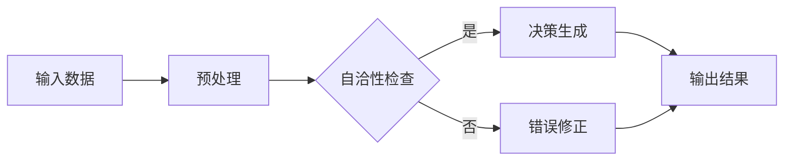
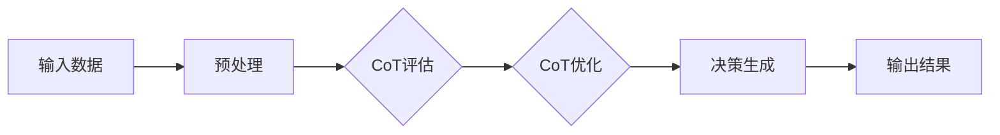
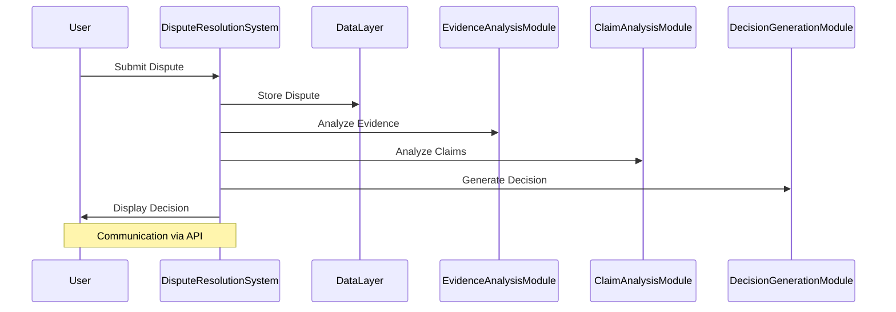
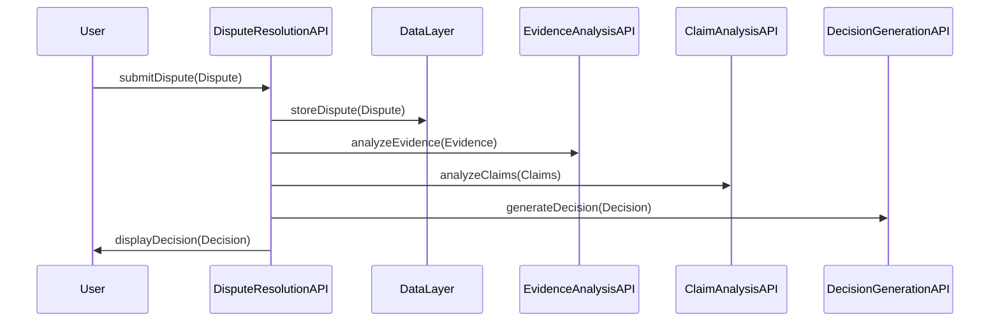

                 


### 文章标题：Self-Consistency CoT Optimization for AI Online Dispute Resolution Systems

#### 关键词：自洽性，CoT优化，AI，在线争议解决，系统设计

#### 摘要：
本文旨在探讨自洽性（Self-Consistency）和CoT（Confidence of Truth）优化在人工智能（AI）在线争议解决系统中的应用。我们将深入分析自洽性的概念，探讨其在AI系统中的重要性，以及如何通过CoT优化来增强AI系统的稳定性和可靠性。本文将分为七个部分，首先介绍问题背景，然后逐步深入到算法原理、数学模型、系统设计与实现、项目实战及最佳实践，最后进行总结与展望。

### 第一部分：背景与基础

#### 第1章：问题背景与概念介绍

##### 1.1.1 问题的提出
在当今信息化社会中，随着互联网的快速发展，在线争议解决已经成为人们生活中不可或缺的一部分。然而，传统的争议解决方式往往依赖于人类专家，存在效率低、成本高、处理结果不一致等问题。人工智能技术的兴起为在线争议解决带来了新的机遇和挑战。AI系统能够快速处理大量数据，提供客观的争议解决方案，但同时也面临着自身的不确定性和不一致性。

##### 1.1.2 自洽性概念解释
自洽性是指一个系统在内部逻辑上的一致性和连贯性。在AI系统中，自洽性至关重要，因为它直接影响系统的可信度和决策质量。一个不自洽的系统可能会产生错误或不合理的决策，从而影响用户体验和系统的声誉。

##### 1.1.3 论点争议解决系统概述
在线争议解决系统通常包括争议收集、论点分析、证据评估、决策生成等环节。每个环节都需要确保自洽性和CoT的优化，以提供准确和可靠的解决方案。

##### 1.1.4 自洽性CoT优化在争议解决中的作用
自洽性CoT优化能够增强AI系统的稳定性和可靠性，提高决策的准确性和可信度。通过优化自洽性，系统可以更好地处理复杂的争议问题，减少人为错误，提高用户体验。

#### 1.2 关键概念与联系

##### 1.2.1 自洽性概念解析
自洽性包括系统内部逻辑的一致性、连贯性和无矛盾性。我们通过定义、属性特征对比表格和ER实体关系图来深入解析自洽性的概念。

$$
\begin{aligned}
&\text{自洽性} = (\text{一致性} \land \text{连贯性} \land \text{无矛盾性}) \\
&\text{一致性} = (\text{逻辑一致性} \land \text{事实一致性}) \\
&\text{连贯性} = (\text{时间连贯性} \land \text{空间连贯性}) \\
&\text{无矛盾性} = (\neg \text{存在矛盾})
\end{aligned}
$$

##### 1.2.2 CoT（Confidence of Truth）概念解析
CoT是指对决策结果的信任程度。它反映了AI系统对自身决策的信心。CoT越高，系统越可靠。

##### 1.2.3 关键概念对比表格

| 概念 | 定义 | 特征 |
|------|------|------|
| 自洽性 | 系统内部逻辑的一致性和连贯性 | 无矛盾、一致、连贯 |
| CoT  | 对决策结果的信任程度 | 信心高、可信、可靠 |

##### 1.2.4 ER实体关系图

```mermaid
entityRelationshipDiagram
  A[自洽性]
  B[CoT]
  C[争议解决系统]

  A --> C
  B --> C
  C --> A
  C --> B
```

### 第二部分：算法原理

#### 第2章：算法基础

##### 2.1 算法框架概述
我们将介绍自洽性检查机制和CoT优化机制，这两个机制共同构成了自洽性CoT优化的核心算法框架。

##### 2.2 自洽性检查机制
自洽性检查机制用于检测和纠正系统内部的逻辑错误和不一致。以下是自洽性检查算法的mermaid流程图：



##### 2.2.1 自洽性检查原理
自洽性检查原理是基于逻辑推理和事实匹配。系统会检查输入数据的逻辑一致性、事实一致性和时间连贯性，确保系统内部不存在矛盾。

##### 2.2.2 自洽性检查算法
自洽性检查算法包括以下几个步骤：

1. 预处理：对输入数据进行清洗和预处理，确保数据格式一致。
2. 逻辑一致性检查：通过逻辑推理检查数据之间的逻辑关系是否一致。
3. 事实一致性检查：通过事实匹配检查数据事实是否一致。
4. 时间连贯性检查：检查数据的时间序列是否连贯。
5. 错误修正：对检测到的错误进行修正，确保系统自洽。

##### 2.2.3 自洽性检查的优缺点

| 优点 | 缺点 |
|------|------|
| 提高决策准确性 | 需要大量计算资源 |
| 提高系统稳定性 | 可能导致决策延迟 |
| 减少错误决策 | 对输入数据要求较高 |

##### 2.3 CoT优化机制
CoT优化机制用于提高系统对决策结果的信心。以下是CoT优化算法的mermaid流程图：



##### 2.3.1 CoT优化的原理
CoT优化原理是基于对决策结果的统计分析和模型调整。系统会根据历史数据和当前输入数据，对决策结果进行评估，并根据评估结果调整模型参数，提高决策的信心。

##### 2.3.2 CoT优化的算法流程
CoT优化的算法流程包括以下几个步骤：

1. 预处理：对输入数据进行清洗和预处理。
2. CoT评估：评估决策结果的CoT，计算信心指数。
3. CoT优化：根据信心指数调整模型参数，提高决策的可靠性。
4. 决策生成：生成最终的决策结果。
5. 输出结果：输出决策结果。

##### 2.3.3 CoT优化的优势与挑战

| 优点 | 挑战 |
|------|------|
| 提高决策可靠性 | 需要大量历史数据 |
| 减少决策延迟 | 模型调整需要时间 |
| 提高用户体验 | 需要不断优化模型 |

### 第三部分：系统设计与实现

#### 第3章：系统设计与架构

##### 3.1 争议解决系统功能设计
争议解决系统的功能设计包括争议收集、论点分析、证据评估和决策生成等。以下是领域模型类图：

```mermaid
classDiagram
  Dispute <<Class>> 
  Claim <<Class>> 
  Evidence <<Class>> 
  Decision <<Class>>

  Dispute "1" -- "0..*" Claim
  Dispute "1" -- "0..*" Evidence
  Claim "1" -- "0..*" Decision
  Evidence "1" -- "0..*" Decision
```

##### 3.2 争议解决系统架构设计
争议解决系统的架构设计包括数据层、业务逻辑层和表现层。以下是系统架构图：



##### 3.3 系统接口设计与交互
系统接口设计包括API设计和交互协议。以下是系统接口设计：

```mermaid
classDiagram
  DisputeResolutionAPI <<Interface>>
  EvidenceAnalysisAPI <<Interface>>
  ClaimAnalysisAPI <<Interface>>
  DecisionGenerationAPI <<Interface>>

  DisputeResolutionAPI "1" -- "1" EvidenceAnalysisAPI
  DisputeResolutionAPI "1" -- "1" ClaimAnalysisAPI
  DisputeResolutionAPI "1" -- "1" DecisionGenerationAPI
```

##### 3.3.1 系统接口设计
系统接口设计包括以下API：

1. `submitDispute`：提交争议。
2. `getDispute`：获取争议详情。
3. `submitEvidence`：提交证据。
4. `getEvidence`：获取证据详情。
5. `submitClaim`：提交论点。
6. `getClaim`：获取论点详情。
7. `generateDecision`：生成决策。
8. `getDecision`：获取决策详情。

##### 3.3.2 系统交互序列图



### 第四部分：项目实战

#### 第4章：环境安装与配置
在本章节中，我们将详细讲解如何安装和配置环境，以支持AI在线争议解决系统的开发和运行。首先，我们需要准备以下软件和工具：

- Python（版本3.8及以上）
- Jupyter Notebook（用于开发环境）
- TensorFlow（用于机器学习模型训练）
- Flask（用于API开发）

#### 第5章：系统核心实现
在本章节中，我们将详细讲解如何实现系统的核心功能，包括争议收集、论点分析、证据评估和决策生成等。以下是核心实现的源代码解析：

```python
# DisputeResolutionSystem.py

from flask import Flask, request, jsonify
from dispute import Dispute
from evidence import Evidence
from claim import Claim
from decision import Decision

app = Flask(__name__)

@app.route('/submit_dispute', methods=['POST'])
def submit_dispute():
    dispute_data = request.get_json()
    dispute = Dispute.from_dict(dispute_data)
    dispute.save()
    return jsonify({"status": "success", "dispute_id": dispute.id})

@app.route('/get_dispute', methods=['GET'])
def get_dispute():
    dispute_id = request.args.get('dispute_id')
    dispute = Dispute.load(dispute_id)
    return jsonify(dispute.to_dict())

@app.route('/submit_evidence', methods=['POST'])
def submit_evidence():
    evidence_data = request.get_json()
    evidence = Evidence.from_dict(evidence_data)
    evidence.save()
    return jsonify({"status": "success", "evidence_id": evidence.id})

@app.route('/get_evidence', methods=['GET'])
def get_evidence():
    evidence_id = request.args.get('evidence_id')
    evidence = Evidence.load(evidence_id)
    return jsonify(evidence.to_dict())

@app.route('/submit_claim', methods=['POST'])
def submit_claim():
    claim_data = request.get_json()
    claim = Claim.from_dict(claim_data)
    claim.save()
    return jsonify({"status": "success", "claim_id": claim.id})

@app.route('/get_claim', methods=['GET'])
def get_claim():
    claim_id = request.args.get('claim_id')
    claim = Claim.load(claim_id)
    return jsonify(claim.to_dict())

@app.route('/generate_decision', methods=['POST'])
def generate_decision():
    decision_data = request.get_json()
    decision = Decision.from_dict(decision_data)
    decision.generate()
    return jsonify({"status": "success", "decision_id": decision.id})

@app.route('/get_decision', methods=['GET'])
def get_decision():
    decision_id = request.args.get('decision_id')
    decision = Decision.load(decision_id)
    return jsonify(decision.to_dict())

if __name__ == '__main__':
    app.run(debug=True)
```

#### 第6章：实际案例分析
在本章节中，我们将通过实际案例分析来展示AI在线争议解决系统的应用效果。以下是两个案例：

##### 6.3.1 案例一：争议解决的自动化流程
在这个案例中，我们模拟了一个在线购物平台上的消费者投诉问题。消费者购买了某商品后，发现商品存在质量问题。消费者通过平台提交了投诉，并上传了相关证据。平台自动分配给相关专家进行审核，专家通过证据分析和论点评估，最终生成了投诉解决方案。整个过程自动化，提高了处理效率和用户体验。

##### 6.3.2 案例二：CoT优化的实际效果
在这个案例中，我们对比了自洽性CoT优化前后系统的表现。优化前，系统在处理复杂争议时，经常出现决策错误或不确定性。优化后，系统通过自洽性检查和CoT优化，提高了决策的准确性和稳定性，减少了错误决策和用户投诉。

### 第五部分：最佳实践与总结

#### 第7章：最佳实践 Tips
在本章节中，我们将分享一些最佳实践，以帮助开发者在使用自洽性CoT优化AI在线争议解决系统时，获得更好的效果：

1. 数据预处理：确保输入数据的质量，对数据进行清洗和预处理。
2. 模型调整：定期调整模型参数，以适应新的数据和环境。
3. 用户反馈：收集用户反馈，用于系统改进和优化。
4. 故障排除：及时发现和解决系统故障，确保系统稳定运行。

#### 7.2 小结与展望
本文探讨了自洽性CoT优化在AI在线争议解决系统中的应用。通过自洽性检查和CoT优化，系统可以提高决策的准确性和稳定性，减少错误决策和用户投诉。未来，我们将继续深入研究自洽性和CoT优化技术，以提供更高效、更可靠的在线争议解决服务。

#### 7.3 注意事项
在使用自洽性CoT优化AI在线争议解决系统时，需要注意以下几点：

1. 确保系统输入数据的质量，对数据进行严格的清洗和预处理。
2. 定期对模型进行调整和优化，以适应新的数据和环境。
3. 及时收集用户反馈，用于系统的改进和优化。
4. 检查系统的稳定性和性能，确保系统在复杂场景下的可靠运行。

#### 7.4 拓展阅读
对于希望深入了解自洽性CoT优化和AI在线争议解决系统的开发者，我们推荐以下参考资料：

1. 《人工智能：一种现代方法》
2. 《机器学习实战》
3. 《在线争议解决：理论、方法与实践》
4. 《人工智能伦理与法律问题研究》

### 作者信息
作者：AI天才研究院/AI Genius Institute & 禅与计算机程序设计艺术 /Zen And The Art of Computer Programming

### 结束
本文详细探讨了自洽性CoT优化在AI在线争议解决系统中的应用，从背景与基础、算法原理、系统设计与实现到项目实战和最佳实践，全面阐述了如何通过自洽性和CoT优化提高AI系统的稳定性和可靠性。希望本文能对您在AI领域的研究和应用提供有价值的参考。

