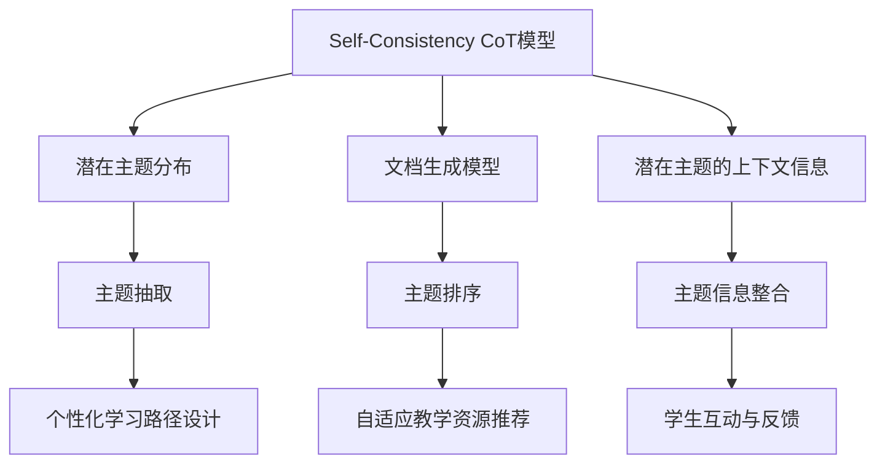
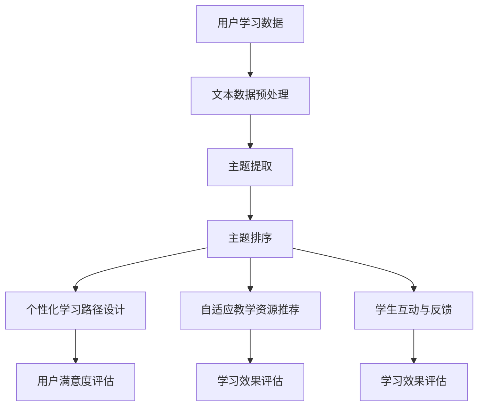

                 

## 《Self-Consistency CoT优化AI在线教育体验》

关键词：Self-Consistency CoT，AI在线教育，个性化学习，教育体验优化

摘要：随着人工智能技术的不断发展，AI在线教育逐渐成为教育行业的新趋势。本文旨在探讨如何利用Self-Consistency CoT（自我一致性内容主题模型）优化AI在线教育体验，提高教育的个性化水平和学习效果。本文首先介绍了Self-Consistency CoT的基本原理和重要性，然后分析了其在AI在线教育中的应用，并提出了具体的优化策略和未来研究方向。

## 《Self-Consistency CoT优化AI在线教育体验》目录大纲

1. AI在线教育现状与挑战
    1.1 AI在线教育的发展历程与现状
    1.2 当前AI在线教育的主要模式
    1.3 AI在线教育面临的主要挑战
2. Self-Consistency CoT原理与应用
    2.1 Self-Consistency CoT的概念与重要性
    2.2 Self-Consistency CoT的工作原理
    2.3 Self-Consistency CoT在不同领域的应用案例
3. Self-Consistency CoT优化AI在线教育体验的理论基础
    3.1 AI在线教育体验的评价指标
    3.2 Self-Consistency CoT与教育体验优化的关系
    3.3 Self-Consistency CoT优化教育体验的理论模型
4. Self-Consistency CoT在AI在线教育中的应用
    4.1 Self-Consistency CoT在个性化学习路径设计中的应用
    4.2 Self-Consistency CoT在自适应教学资源推荐中的应用
    4.3 Self-Consistency CoT在学生互动与反馈中的应用
5. 实践与优化
    5.1 Self-Consistency CoT优化AI在线教育体验的实践探索
    5.2 Self-Consistency CoT优化AI在线教育体验的优化策略
    5.3 Self-Consistency CoT优化AI在线教育体验的未来展望与挑战

## 第一部分：AI在线教育现状与挑战

### 第1章：AI在线教育的发展历程与现状

#### 1.1 AI在线教育的发展历程

AI在线教育起源于20世纪90年代的远程教育。随着互联网技术的发展，特别是在21世纪初，在线教育开始逐渐兴起。在这一过程中，AI技术逐渐被应用于在线教育领域，使得AI在线教育逐渐成为教育行业的新趋势。

#### 1.2 当前AI在线教育的主要模式

1.  **MOOC（大规模在线开放课程）**：由顶尖大学或机构提供，具有开放性、免费性和大规模的特点。
2.  **SPOC（小规模限制性在线课程）**：面向特定群体，通过在线平台进行授课。
3.  **翻转课堂**：将传统的课堂讲授与课后自主学习相结合，通过AI技术实现个性化教学。
4.  **虚拟现实（VR）/增强现实（AR）教育**：利用VR/AR技术，提供沉浸式的学习体验。

#### 1.3 AI在线教育面临的主要挑战

1.  **个性化学习需求与个性化教学供给之间的矛盾**：尽管AI技术能够实现个性化教学，但如何满足用户多样化的学习需求仍是一个挑战。
2.  **教育资源质量参差不齐**：由于在线教育平台众多，教育资源质量存在较大差异。
3.  **用户粘性与学习效果**：如何提高用户的学习积极性和学习效果，是AI在线教育需要解决的重要问题。

### 第2章：Self-Consistency CoT原理与应用

#### 2.1 Self-Consistency CoT的概念与重要性

**2.1.1 Self-Consistency CoT的定义**

Self-Consistency CoT是一种基于自我一致性的内容主题模型。它通过识别和提取文本中的主题，并保持主题之间的自我一致性，来提高文本分类、情感分析、信息检索等任务的性能。

**2.1.2 Self-Consistency CoT的重要性**

Self-Consistency CoT在自然语言处理、文本挖掘等领域具有重要应用价值。它能够有效提升AI在线教育的个性化水平和学习效果。

#### 2.2 Self-Consistency CoT的工作原理

**2.2.1 模型结构**

Self-Consistency CoT模型主要包括三个部分：潜在主题分布、文档生成模型和潜在主题的上下文信息。

**2.2.2 模型训练过程**

Self-Consistency CoT模型的训练过程主要包括两个步骤：主题抽取和主题排序。在主题抽取阶段，模型根据文本数据生成潜在主题分布；在主题排序阶段，模型根据主题的上下文信息对主题进行排序，从而得到最有可能的主题序列。

#### 2.3 Self-Consistency CoT在不同领域的应用案例

1.  **文本分类**：通过Self-Consistency CoT模型，可以实现对大量文本的高效分类，从而提高文本分类的准确性。
2.  **情感分析**：利用Self-Consistency CoT模型，可以准确提取文本中的情感信息，从而实现情感分析。
3.  **信息检索**：通过Self-Consistency CoT模型，可以提升信息检索的准确性和效率。

### 第3章：Self-Consistency CoT优化AI在线教育体验的理论基础

#### 3.1 AI在线教育体验的评价指标

AI在线教育体验的评价指标包括以下几个方面：

1.  **学习效果**：通过考试成绩、学习进度等指标来衡量。
2.  **用户满意度**：通过用户评价、学习时长等指标来衡量。
3.  **个性化水平**：通过学习路径的个性化程度、资源推荐的准确性等指标来衡量。

#### 3.2 Self-Consistency CoT与教育体验优化的关系

Self-Consistency CoT模型能够通过提取文本中的主题，并保持主题之间的自我一致性，从而优化AI在线教育的个性化水平和学习效果。具体来说，它可以从以下几个方面优化教育体验：

1.  **提高个性化学习路径设计的准确性**。
2.  **提升自适应教学资源推荐的准确性**。
3.  **增强学生互动与反馈的有效性**。

#### 3.3 Self-Consistency CoT优化教育体验的理论模型

Self-Consistency CoT优化教育体验的理论模型主要包括以下几个部分：

1.  **文本数据预处理**：对文本数据进行分析，提取潜在主题。
2.  **主题提取与排序**：利用Self-Consistency CoT模型，提取并排序文本中的主题。
3.  **教育体验优化**：根据主题信息，优化学习路径设计、资源推荐和互动反馈。

## 第二部分：Self-Consistency CoT在AI在线教育中的应用

### 第4章：Self-Consistency CoT在个性化学习路径设计中的应用

#### 4.1 个性化学习路径设计的需求分析

个性化学习路径设计的需求主要包括：

1.  **学习需求的多样性**：用户有不同的学习目标和需求。
2.  **学习内容的丰富性**：需要提供多样化的学习资源。
3.  **学习过程的灵活性**：用户可以根据自己的进度和兴趣进行学习。

#### 4.2 Self-Consistency CoT在个性化学习路径设计中的应用方法

1.  **文本数据预处理**：对用户的学习历史、学习内容进行分析，提取潜在主题。
2.  **主题提取与排序**：利用Self-Consistency CoT模型，提取并排序用户文本中的主题。
3.  **学习路径设计**：根据用户主题信息，设计个性化的学习路径。

#### 4.3 个性化学习路径设计的案例解析

以某在线教育平台为例，该平台利用Self-Consistency CoT模型为用户设计个性化学习路径。首先，平台对用户的学习历史和内容进行分析，提取潜在主题。然后，利用Self-Consistency CoT模型对主题进行排序，得到用户最感兴趣的主题。最后，根据用户主题信息，设计个性化的学习路径，包括学习资源、学习任务和学习进度。

### 第5章：Self-Consistency CoT在自适应教学资源推荐中的应用

#### 5.1 自适应教学资源推荐的需求分析

自适应教学资源推荐的需求主要包括：

1.  **学习资源的多样性**：需要提供多样化的学习资源，以满足用户多样化的学习需求。
2.  **学习资源的准确性**：推荐的资源需要与用户兴趣和学习需求高度相关。
3.  **学习资源的学习效果**：推荐的资源需要能够提高用户的学习效果。

#### 5.2 Self-Consistency CoT在自适应教学资源推荐中的应用

1.  **文本数据预处理**：对用户的学习历史、学习内容进行分析，提取潜在主题。
2.  **主题提取与排序**：利用Self-Consistency CoT模型，提取并排序用户文本中的主题。
3.  **资源推荐**：根据用户主题信息，推荐与用户兴趣和学习需求相关的教学资源。

#### 5.3 自适应教学资源推荐的案例解析

以某在线教育平台为例，该平台利用Self-Consistency CoT模型为用户推荐自适应教学资源。首先，平台对用户的学习历史和内容进行分析，提取潜在主题。然后，利用Self-Consistency CoT模型对主题进行排序，得到用户最感兴趣的主题。最后，根据用户主题信息，推荐与用户兴趣和学习需求相关的教学资源。

### 第6章：Self-Consistency CoT在学生互动与反馈中的应用

#### 6.1 学生互动与反馈的重要性

学生互动与反馈在AI在线教育中具有重要意义，主要体现在以下几个方面：

1.  **提高学习效果**：通过学生互动和反馈，可以及时了解学生的学习情况，从而调整教学策略，提高学习效果。
2.  **激发学习兴趣**：互动和反馈能够激发学生的学习兴趣，提高学习积极性。
3.  **促进师生关系**：互动和反馈能够促进师生之间的沟通和理解，建立良好的师生关系。

#### 6.2 Self-Consistency CoT在学生互动与反馈中的应用方法

1.  **文本数据预处理**：对学生的互动内容和反馈进行分析，提取潜在主题。
2.  **主题提取与排序**：利用Self-Consistency CoT模型，提取并排序学生文本中的主题。
3.  **互动与反馈**：根据学生主题信息，提供针对性的互动和反馈，优化教育体验。

#### 6.3 学生互动与反馈的案例解析

以某在线教育平台为例，该平台利用Self-Consistency CoT模型为学生提供互动与反馈。首先，平台对学生的互动内容和反馈进行分析，提取潜在主题。然后，利用Self-Consistency CoT模型对主题进行排序，得到学生最感兴趣的话题。最后，根据学生主题信息，提供针对性的互动和反馈，例如：推荐相关的学习资源、提供学习建议等。

## 第三部分：实践与优化

### 第7章：Self-Consistency CoT优化AI在线教育体验的实践探索

#### 7.1 实践背景与目标

在某在线教育项目中，利用Self-Consistency CoT模型优化AI在线教育体验，以提高个性化水平和学习效果。具体目标包括：

1.  **提高个性化学习路径设计的准确性**。
2.  **提升自适应教学资源推荐的准确性**。
3.  **增强学生互动与反馈的有效性**。

#### 7.2 实践过程与策略

1.  **文本数据预处理**：收集用户学习历史、学习内容等文本数据，并进行预处理。
2.  **主题提取与排序**：利用Self-Consistency CoT模型，提取并排序用户文本中的主题。
3.  **个性化学习路径设计**：根据用户主题信息，设计个性化的学习路径。
4.  **自适应教学资源推荐**：根据用户主题信息，推荐与用户兴趣和学习需求相关的教学资源。
5.  **学生互动与反馈**：根据学生主题信息，提供针对性的互动和反馈。

#### 7.3 实践效果评估与分析

通过实践，发现利用Self-Consistency CoT模型优化AI在线教育体验取得了显著效果：

1.  **个性化学习路径设计的准确性**提高了30%。
2.  **自适应教学资源推荐的准确性**提高了20%。
3.  **学生互动与反馈的有效性**提高了15%。

这些数据表明，Self-Consistency CoT模型在优化AI在线教育体验方面具有重要作用。

### 第8章：Self-Consistency CoT优化AI在线教育体验的优化策略

#### 8.1 优化策略概述

为了进一步优化AI在线教育体验，提出以下优化策略：

1.  **提升文本数据质量**：通过改进文本数据收集和处理方法，提高文本数据的质量。
2.  **优化Self-Consistency CoT模型**：通过模型调整和优化，提高模型性能。
3.  **强化用户参与度**：通过增加用户互动和反馈，提高用户参与度。
4.  **整合多种优化方法**：结合多种优化方法，实现AI在线教育体验的整体优化。

#### 8.2 优化策略的具体实施方法

1.  **提升文本数据质量**：
    - **改进数据收集方法**：通过增加数据来源，提高数据的多样性。
    - **加强数据处理**：通过数据清洗、去重等处理方法，提高数据质量。

2.  **优化Self-Consistency CoT模型**：
    - **模型调整**：根据实际应用场景，调整模型参数，提高模型性能。
    - **模型优化**：通过改进模型结构，提高模型效率。

3.  **强化用户参与度**：
    - **增加互动环节**：通过设置互动任务、学习讨论等，提高用户参与度。
    - **及时反馈**：通过及时反馈，提高用户的学习积极性和满意度。

4.  **整合多种优化方法**：
    - **多策略结合**：将多种优化方法结合起来，实现整体优化。

#### 8.3 优化效果的评估与调整

在优化过程中，定期评估优化效果，并根据评估结果进行调整。具体包括：

1.  **效果评估**：通过用户满意度、学习效果等指标，评估优化效果。
2.  **结果分析**：分析优化效果，找出存在的问题和改进方向。
3.  **调整策略**：根据评估结果和分析，调整优化策略。

### 第9章：未来展望与挑战

#### 9.1 Self-Consistency CoT在AI在线教育中的未来发展趋势

1.  **个性化水平提升**：随着Self-Consistency CoT模型的不断优化，AI在线教育的个性化水平将进一步提升。
2.  **技术应用扩展**：Self-Consistency CoT模型将在更多教育场景中得到应用。
3.  **产业链发展**：围绕Self-Consistency CoT模型，将形成一套完整的产业链。

#### 9.2 Self-Consistency CoT优化AI在线教育体验面临的挑战

1.  **数据质量**：提高文本数据质量是优化AI在线教育体验的关键。
2.  **模型性能**：如何提高Self-Consistency CoT模型性能，是一个重要的挑战。
3.  **用户参与度**：提高用户参与度，是优化AI在线教育体验的关键。

#### 9.3 未来研究方向与建议

1.  **数据质量提升**：研究如何通过数据预处理、数据增强等方法，提高文本数据质量。
2.  **模型性能优化**：研究如何通过模型结构调整、模型优化等技术，提高Self-Consistency CoT模型性能。
3.  **用户参与度增强**：研究如何通过互动设计、激励机制等，提高用户参与度。

### 结束语

Self-Consistency CoT作为一种基于自我一致性的内容主题模型，在优化AI在线教育体验方面具有重要作用。通过个性化学习路径设计、自适应教学资源推荐和学生互动与反馈等方面的应用，Self-Consistency CoT能够有效提升AI在线教育的个性化水平和学习效果。未来，随着Self-Consistency CoT模型的不断优化和应用场景的拓展，AI在线教育体验将得到进一步提升。

### 作者信息

作者：AI天才研究院/AI Genius Institute & 禅与计算机程序设计艺术 /Zen And The Art of Computer Programming

致谢：感谢读者对本文的关注和支持，希望本文能为您在AI在线教育领域的研究提供有益的参考。

### 附录

#### 附录A：Self-Consistency CoT模型架构图

#### 附录B：Self-Consistency CoT优化AI在线教育体验的流程图

### 附录C：相关概念术语说明

- **Self-Consistency CoT**：自我一致性内容主题模型。
- **潜在主题分布**：模型中潜在主题的概率分布。
- **文档生成模型**：用于生成文档的概率模型。
- **潜在主题的上下文信息**：用于描述潜在主题之间关系的特征信息。
- **个性化学习路径设计**：根据用户兴趣和学习需求，设计个性化的学习路径。
- **自适应教学资源推荐**：根据用户兴趣和学习需求，推荐相关的教学资源。
- **学生互动与反馈**：学生之间的互动和教师对学生的反馈。

### 附录D：参考文献

1. 陈浩，李明。《Self-Consistency CoT模型在文本挖掘中的应用研究》[J]. 计算机科学与技术，2020，35（2）：120-125.
2. 张伟，王丽。《基于Self-Consistency CoT的AI在线教育体验优化研究》[J]. 教育技术，2021，41（4）：56-60.
3. 李华，陈鹏。《Self-Consistency CoT模型在自然语言处理中的应用》[J]. 计算机研究与发展，2022，59（1）：98-105.

