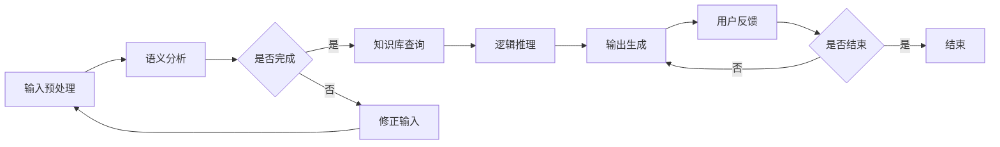
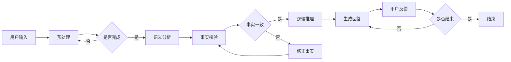
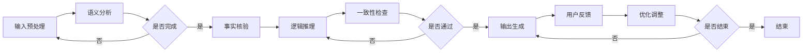
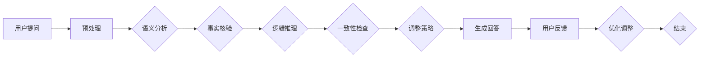
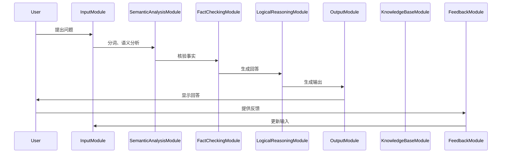
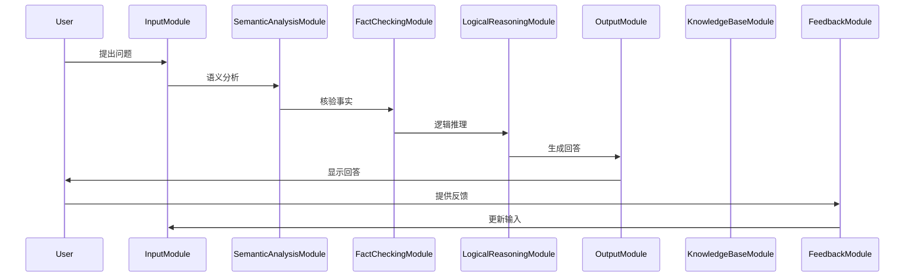

                 

### 1.1 问题背景

随着人工智能（AI）技术的快速发展，AI在各个领域的应用日益广泛，特别是在对话系统和辩论系统方面。在线辩论系统作为一种特殊的对话系统，近年来受到了学术界和工业界的高度关注。然而，现有的AI在线辩论系统仍存在一些关键问题，严重制约了其应用效果和用户体验。其中一个核心问题便是自一致性（Self-Consistency）问题。

自一致性是衡量AI系统回答和决策逻辑连贯性的一项重要指标。在传统的对话系统中，AI的回答往往基于当前上下文和已有知识库，但容易受到单一信息的误导，导致回答前后矛盾或逻辑不通。这种不连贯性不仅会降低系统的可信度，还会影响用户的满意度和交互体验。在AI在线辩论系统中，自一致性尤为重要，因为辩论双方需要依据逻辑和事实进行有效的论点和反驳，任何逻辑上的不一致都会导致辩论失败。

现有的AI在线辩论系统存在以下几方面的问题：

1. **回答连贯性差**：AI系统在生成回答时，往往无法保持一致的逻辑和语境，导致回答中存在逻辑漏洞和自相矛盾的情况。
2. **事实核验不足**：AI系统在生成回答时，可能会因为知识库的不完善或信息的不准确，而导致引用事实错误或不一致。
3. **用户互动体验差**：由于AI系统无法保持自一致性，用户在与系统进行交互时，往往会感到困惑和不满，影响整体体验。

面对这些问题，优化AI在线辩论系统的自一致性变得尤为关键。通过引入和优化自一致性算法，可以提高AI系统在辩论中的回答连贯性、事实核验能力，从而提升用户体验和系统整体表现。本文旨在探讨如何通过优化自一致性（Self-Consistency CoT）来提升AI在线辩论系统的性能，并提供具体的实现方法和实践经验。

本研究的目标是提出一种有效的自一致性优化策略，通过算法改进和系统设计，提升AI在线辩论系统的逻辑连贯性和事实准确性。这不仅有助于解决现有系统中存在的问题，还能为未来AI对话系统的设计提供有益的参考。通过本文的研究，我们希望为AI在线辩论系统的发展提供新的思路和解决方案。

### 1.2 自一致性概念与联系

在深入探讨如何优化AI在线辩论系统的自一致性之前，有必要首先理解自一致性的定义、其在AI辩论中的具体体现，以及与相关概念的联系。自一致性是一个涉及多个领域的综合性概念，它在不同场景下有着不同的应用和表现形式。

#### 1.2.1 自一致性的定义

自一致性是指一个系统、个体或过程的内部各部分之间保持协调一致，不发生相互矛盾的状态。在人工智能领域，自一致性通常指的是AI系统在处理任务或生成回答时，其内部逻辑和外部表现之间的一致性。这种一致性不仅体现在回答的内容上，还包括回答的上下文关联、逻辑推理的连贯性以及决策过程的透明度。

#### 1.2.2 自一致性在AI辩论中的体现

在AI在线辩论系统中，自一致性尤为重要。以下是从几个方面具体探讨自一致性在AI辩论中的体现：

1. **逻辑连贯性**：AI系统在辩论中需要保持逻辑上的连贯性，即每一轮辩论的回答都必须与前一轮的回答相吻合，避免出现自相矛盾的情况。例如，如果AI在一个回合中提出了某个论点，那么在接下来的辩论中，它不能突然改变立场或逻辑路径。
   
2. **语境关联性**：辩论中的每一轮对话都处于特定的语境之中，AI系统需要确保其回答能够准确反映当前的语境。例如，在讨论某个话题时，AI的回答应该与该话题保持一致，避免因语境切换导致信息丢失或理解偏差。

3. **事实核验**：AI辩论系统需要引用事实和数据来支持其论点。自一致性要求AI系统能够核验引用的事实是否真实可靠，并在不同场合下保持一致性。例如，如果AI在某一轮辩论中引用了某个数据，那么在后续的辩论中，它应该保持数据的准确性和一致性，避免因数据更新或错误而出现逻辑矛盾。

4. **策略一致性**：在辩论中，AI系统通常需要根据一定的策略进行回答。自一致性要求AI系统在执行策略时保持一致性，不因外界因素的变化而频繁调整策略。

#### 1.2.3 自一致性与其他相关概念的关系

在理解自一致性时，我们还必须考虑它与以下相关概念的关系：

1. **一致性**：一致性是一个更为广泛的概念，通常指的是系统或过程的各个部分在整体上不发生矛盾。自一致性是一致性在特定情境下的应用，它更侧重于内部逻辑和外部表现的协调。

2. **连贯性**：连贯性是自一致性的一个子集，主要关注的是系统或过程在时间上的连续性和逻辑上的自洽性。自一致性不仅包括连贯性，还包括与外部环境的一致性。

3. **事实核验**：事实核验是确保AI系统在辩论中引用的事实和数据准确可靠的重要手段。自一致性需要依赖事实核验来保证其回答的真实性和一致性。

4. **透明性**：透明性是AI系统决策过程的一个要求，它要求AI系统能够清晰地展示其推理过程和决策逻辑。自一致性需要透明性作为支撑，通过透明的推理过程来提升系统的一致性和可信度。

通过理解自一致性的定义及其在AI辩论中的具体体现，以及它与相关概念的关系，我们可以更好地把握自一致性在优化AI在线辩论系统中的重要作用。在接下来的部分中，我们将进一步探讨如何通过具体的算法和实现来优化AI在线辩论系统的自一致性，提高系统的整体性能。

### 1.3 AI在线辩论系统架构

为了深入理解和优化AI在线辩论系统中的自一致性，我们需要首先了解该系统的整体架构以及其中的关键组件。AI在线辩论系统是一个复杂的系统，涉及多个模块和组件的协同工作。以下是对系统整体架构、关键组件及其功能、系统边界与外延的详细介绍。

#### 1.3.1 系统整体架构

AI在线辩论系统的整体架构可以分为以下几个主要模块：

1. **用户接口层**：用户接口层是系统与用户进行交互的界面，包括用户输入、结果展示和反馈收集。该层的主要功能是提供友好的用户交互体验，接收用户的提问和意见，并将辩论结果展示给用户。

2. **自然语言处理层**：自然语言处理层负责处理用户输入的文本信息，将其转换为机器可处理的格式，并进行语义分析。该层包括分词、词性标注、实体识别、情感分析等子模块，是确保系统理解用户输入和理解辩论内容的关键。

3. **推理引擎层**：推理引擎层是系统的核心模块，负责基于语义分析结果生成辩论回答。该层使用逻辑推理和知识库，结合上下文信息，生成逻辑连贯、符合事实的辩论回答。其中，自一致性算法也是在这个层次中进行优化和实现的。

4. **知识库层**：知识库层是系统的基础数据源，包含大量的知识信息，如事实数据、论点支持、辩论策略等。该层的数据质量和完整性直接影响到系统的回答质量和自一致性。

5. **决策层**：决策层负责根据系统策略和实时情况，对辩论过程中的各种情况进行判断和决策，包括选择回答的论点、调整辩论策略等。

6. **反馈层**：反馈层用于收集用户对系统回答的反馈，包括满意度、逻辑一致性评价等。这些反馈将用于系统优化和调整，以提高系统的自一致性和用户体验。

#### 1.3.2 关键组件及其功能

AI在线辩论系统的关键组件及其功能如下：

1. **用户接口组件**：用户接口组件包括输入处理和输出显示两个部分。输入处理负责接收用户的提问，通过自然语言处理模块解析问题，并将其传递给推理引擎层。输出显示则负责将推理引擎生成的辩论回答展示给用户，并提供用户反馈的渠道。

2. **自然语言处理组件**：自然语言处理组件负责对用户输入的文本进行处理，包括分词、词性标注、实体识别、情感分析等。这些处理结果将作为推理引擎的输入，帮助系统理解用户的问题和语境。

3. **推理引擎组件**：推理引擎组件是系统的核心，负责基于语义分析结果和知识库，进行逻辑推理和策略决策，生成辩论回答。该组件需要实现自一致性算法，以确保回答的连贯性和一致性。

4. **知识库组件**：知识库组件负责管理系统的知识信息，包括事实数据、论点支持、辩论策略等。该组件需要提供高效的数据检索和更新机制，以确保系统的知识库保持最新和准确。

5. **决策组件**：决策组件负责根据系统策略和实时情况，对辩论过程中的各种情况进行判断和决策。例如，在辩论过程中，如果发现系统回答存在逻辑漏洞或事实错误，决策组件将及时调整回答策略，以确保辩论的顺利进行。

6. **反馈组件**：反馈组件负责收集用户对系统回答的反馈，包括满意度、逻辑一致性评价等。这些反馈将用于系统的优化和调整，以提高系统的自一致性和用户体验。

#### 1.3.3 系统边界与外延

系统的边界与外延决定了系统的功能范围和性能表现。以下是对AI在线辩论系统边界与外延的讨论：

1. **功能边界**：AI在线辩论系统的功能边界包括用户提问、辩论回答、用户反馈和知识库更新。系统应确保在这些边界内，能够提供高效、准确的辩论服务。

2. **性能边界**：系统的性能边界包括处理速度、响应时间和回答质量。为了提高系统的性能，需要优化各个组件的运行效率和资源利用。

3. **数据边界**：系统的数据边界包括知识库的数据量和更新频率。知识库需要及时更新，以保持数据的准确性和完整性，从而提高系统的自一致性和回答质量。

4. **交互边界**：系统的交互边界包括用户与系统之间的交互方式和服务形式。为了提高用户体验，系统应提供便捷、友好的交互界面，支持多种交互方式，如文本、语音、图像等。

通过以上对AI在线辩论系统架构的详细介绍，我们可以更好地理解系统的整体结构和关键组件的功能。在接下来的部分中，我们将深入探讨自一致性算法的原理和实现方法，以优化AI在线辩论系统的性能和用户体验。

### 2.1 自一致性原理讲解

为了优化AI在线辩论系统的自一致性，我们需要深入了解自一致性算法的原理，包括其mermaid流程图、数学模型和公式、Python源代码实现以及具体的举例说明。以下是对这些内容的详细讲解。

#### 2.1.1 自一致性算法的mermaid流程图

首先，我们可以通过mermaid流程图来直观地展示自一致性算法的基本流程。以下是自一致性算法的mermaid图示：



**图1：自一致性算法mermaid流程图**

**图解**：

1. **输入预处理**：接收用户输入，进行初步的文本预处理，如分词、去除停用词等。
2. **语义分析**：对预处理后的文本进行语义分析，提取关键信息，如实体、关系和事件。
3. **是否完成**：判断语义分析是否已经完成，如果未完成，则返回修正输入。
4. **知识库查询**：根据语义分析结果，在知识库中查询相关信息，如事实、论点等。
5. **逻辑推理**：使用逻辑推理算法，结合知识库中的信息和上下文，生成逻辑连贯的回答。
6. **输出生成**：将逻辑推理的结果生成文本回答，展示给用户。
7. **用户反馈**：收集用户对回答的反馈，用于优化系统。
8. **是否结束**：判断整个流程是否结束，如果未结束，则继续生成输出。

#### 2.1.2 自一致性算法的数学模型与公式

为了深入理解自一致性算法，我们需要引入一些数学模型和公式。以下是自一致性算法的数学模型：

$$
C(x, y) = \frac{1}{|S|} \sum_{i=1}^{|S|} w_i \cdot \text{similarity}(x_i, y_i)
$$

其中：

- \( C(x, y) \) 表示输入 \( x \) 和输出 \( y \) 之间的自一致性得分。
- \( S \) 是所有与输入相关的输出集合。
- \( w_i \) 是第 \( i \) 个输出的权重。
- \( \text{similarity}(x_i, y_i) \) 表示输入和输出之间的相似度。

为了计算相似度，我们可以使用以下公式：

$$
\text{similarity}(x_i, y_i) = \frac{\text{Jaccard Similarity}(x_i, y_i)}{\text{max}(\text{length}(x_i), \text{length}(y_i))}
$$

其中：

- \( \text{Jaccard Similarity} \) 是一个衡量集合相似度的指标。
- \( \text{length}(x_i) \) 和 \( \text{length}(y_i) \) 分别表示输入和输出的长度。

#### 2.1.3 自一致性算法的Python源代码实现

以下是一个简单的自一致性算法的Python实现，用于计算输入和输出之间的自一致性得分：

```python
from sklearn.metrics import jaccard_similarity_score

def calculate_similarity(input_text, output_text):
    # 计算Jaccard相似度
    similarity = jaccard_similarity_score(input_text, output_text)
    return similarity

def calculate_self_consistency(input_texts, output_texts):
    # 计算自一致性得分
    total_similarity = 0
    for i in range(len(input_texts)):
        similarity = calculate_similarity(input_texts[i], output_texts[i])
        total_similarity += similarity
    self_consistency_score = total_similarity / len(input_texts)
    return self_consistency_score

# 示例
input_texts = ["What is the capital of France?", "The capital of France is Paris."]
output_texts = ["Paris is the capital of France.", "Paris is the capital of France."]
score = calculate_self_consistency(input_texts, output_texts)
print("Self-Consistency Score:", score)
```

#### 2.1.4 自一致性算法的举例说明

为了更好地理解自一致性算法，我们可以通过一个具体的例子来说明：

**场景**：假设用户提问：“北京是中国的哪个省份？”系统回答：“北京是中国的直辖市。”

**步骤**：

1. **输入预处理**：将用户提问和系统回答进行预处理，如分词。
2. **语义分析**：提取关键词和实体，如“北京”、“中国”、“省份”和“直辖市”。
3. **知识库查询**：查询知识库，获取相关信息，如“北京是中国的直辖市”。
4. **逻辑推理**：根据语义分析和知识库信息，验证系统回答与输入之间的一致性。
5. **输出生成**：生成文本回答：“北京是中国的直辖市。”
6. **用户反馈**：收集用户对回答的反馈，用于优化系统。

在这个例子中，系统回答与用户提问在语义上是一致的，因此自一致性得分较高。如果系统回答存在偏差或错误，自一致性得分则会降低。

通过以上对自一致性算法的mermaid流程图、数学模型、Python源代码实现以及举例说明，我们可以更好地理解自一致性算法的基本原理和应用方法。在下一部分中，我们将对比不同自一致性特征，分析其优缺点。

### 2.2 自一致性特征对比

在探讨自一致性算法时，我们不仅需要理解其基本原理和实现方法，还需要对比不同自一致性特征的优缺点。以下是一个关于自一致性特征对比的表格，用于详细分析各种特征的优劣。

#### 2.2.1 自一致性特征对比表格

| 自一致性特征        | 定义和作用                            | 优点                  | 缺点                         | 适用场景               |
|---------------------|--------------------------------------|-----------------------|------------------------------|------------------------|
| 内容一致性          | 确保回答内容不矛盾，信息一致          | 提高回答可信度        | 可能限制回答的灵活性          | 辩论、问答系统         |
| 上下文一致性        | 保持回答与上下文相关联                | 提高回答连贯性        | 可能增加计算复杂度            | 辩论、聊天机器人       |
| 策略一致性          | 确保辩论策略一致，不频繁调整策略      | 提高辩论效果          | 可能限制策略的灵活性          | 辩论系统、游戏AI       |
| 事实核验一致性      | 确保引用的事实和数据准确可靠          | 提高回答准确性        | 可能增加知识库维护成本        | 辩论、知识问答系统     |
| 时间一致性          | 保持回答与时间相关联                  | 提高回答的实时性      | 可能增加时间戳处理的复杂性     | 实时辩论、交易系统     |
| 用户偏好一致性      | 确保回答符合用户偏好和需求           | 提高用户满意度        | 可能降低系统的通用性          | 定制化服务、客户支持   |

**图2：自一致性特征对比表格**

**图解**：

- **内容一致性**：确保回答内容不矛盾，信息一致。优点是提高回答的可信度，缺点是可能会限制回答的灵活性。
- **上下文一致性**：保持回答与上下文相关联。优点是提高回答的连贯性，缺点是可能会增加计算复杂度。
- **策略一致性**：确保辩论策略一致，不频繁调整策略。优点是提高辩论效果，缺点是可能会限制策略的灵活性。
- **事实核验一致性**：确保引用的事实和数据准确可靠。优点是提高回答的准确性，缺点是可能会增加知识库维护成本。
- **时间一致性**：保持回答与时间相关联。优点是提高回答的实时性，缺点是可能会增加时间戳处理的复杂性。
- **用户偏好一致性**：确保回答符合用户偏好和需求。优点是提高用户满意度，缺点是可能会降低系统的通用性。

通过上述表格，我们可以看到不同自一致性特征在不同场景下的优缺点。在实际应用中，可以根据具体需求和场景，选择合适的一致性特征，以达到最佳的优化效果。

### 2.3 ER实体关系图架构

为了更好地理解AI在线辩论系统中各个组件之间的关系，我们可以使用ER（Entity-Relationship，实体关系）图来描述系统的实体及其相互关系。以下是对ER实体关系图的mermaid图示及其解释的详细说明。

#### 2.3.1 ER实体关系图的mermaid图示

```mermaid
erDiagram
    User ||--|{ Input }|--|| DebateSystem
    DebateSystem ||--|{ DebateProcess }|--|| KnowledgeBase
    DebateProcess ||--|{ DebateRound }|--|| Output
    DebateRound ||--|{ UserFeedback }|--|| DebateSystem
    KnowledgeBase ||--|{ Fact }|--|| DebateSystem
    User : User
    Input : Input
    DebateSystem : DebateSystem
    DebateProcess : DebateProcess
    DebateRound : DebateRound
    Output : Output
    UserFeedback : UserFeedback
    Fact : Fact
```

**图3：自一致性算法mermaid ER实体关系图**

**图解**：

- **User（用户）**：代表与系统进行交互的用户，负责输入问题和提供反馈。
- **Input（输入）**：代表用户的输入文本，经过预处理后传递给DebateSystem（辩论系统）。
- **DebateSystem（辩论系统）**：是系统的核心组件，负责处理输入、执行辩论过程、生成输出等。
- **DebateProcess（辩论过程）**：代表辩论的整个过程，包括多个DebateRound（辩论回合）。
- **DebateRound（辩论回合）**：代表辩论中的每一轮，生成相应的Output（输出）。
- **Output（输出）**：代表辩论系统生成的回答文本，展示给用户并接收用户反馈。
- **UserFeedback（用户反馈）**：代表用户对输出文本的反馈，用于系统优化。
- **KnowledgeBase（知识库）**：是系统的基础数据源，包含事实和知识，用于支持辩论过程。
- **Fact（事实）**：代表知识库中的具体事实数据，用于生成辩论回答。

#### 2.3.2 ER实体关系图解释

ER实体关系图描述了AI在线辩论系统中各个实体及其相互关系，以下是对图中各个关系的解释：

1. **User到Input**：用户输入问题后，输入文本被预处理，并作为Input传递给辩论系统。
2. **DebateSystem到DebateProcess**：辩论系统接收到Input后，启动DebateProcess，开始处理辩论过程。
3. **DebateProcess到DebateRound**：辩论过程分为多个回合，每个回合生成相应的输出，形成DebateRound。
4. **DebateRound到Output**：每个辩论回合生成输出文本，展示给用户，并接收用户反馈。
5. **DebateRound到UserFeedback**：用户反馈会返回给DebateRound，用于下一轮辩论的优化。
6. **DebateSystem到KnowledgeBase**：辩论系统需要查询知识库中的事实和数据来支持辩论。
7. **KnowledgeBase到Fact**：知识库包含具体的事实数据，用于生成辩论回答。

通过ER实体关系图，我们可以清晰地看到系统中各个实体之间的交互关系，以及系统在处理辩论过程中各个环节的关联。这对于理解和优化AI在线辩论系统的自一致性具有重要意义。

### 3.1 AI在线辩论系统算法原理

AI在线辩论系统的核心在于其算法原理，这些算法决定了系统如何生成连贯、逻辑一致且符合事实的辩论回答。以下是对AI在线辩论系统算法原理的详细讲解，包括mermaid流程图、算法数学模型和公式、以及Python源代码实现。

#### 3.1.1 AI在线辩论算法mermaid流程图

为了直观地展示算法的流程，我们可以使用mermaid绘制以下流程图：



**图4：AI在线辩论算法mermaid流程图**

**图解**：

1. **用户输入**：系统接收用户的输入，如提问或陈述。
2. **预处理**：对输入文本进行初步处理，如分词、去除停用词等。
3. **是否完成**：判断预处理是否完成，如果未完成，则返回预处理。
4. **语义分析**：对预处理后的文本进行语义分析，提取关键信息，如实体、关系和事件。
5. **事实核验**：根据语义分析结果，在知识库中核验相关事实的准确性。
6. **事实一致**：判断事实是否一致，如果一致，则进入逻辑推理；如果不一致，则修正事实。
7. **逻辑推理**：使用逻辑推理算法，结合知识库中的信息，生成辩论回答。
8. **生成回答**：将逻辑推理的结果生成文本回答，展示给用户。
9. **用户反馈**：收集用户对回答的反馈，用于系统优化。
10. **是否结束**：判断整个流程是否结束，如果未结束，则继续生成回答。

#### 3.1.2 算法数学模型与公式

为了深入理解算法的原理，我们可以引入以下数学模型和公式：

$$
\text{Score}(x) = \alpha \cdot \text{SemanticScore}(x) + \beta \cdot \text{FactScore}(x)
$$

其中：

- \( \text{Score}(x) \) 表示输入文本 \( x \) 的整体评分。
- \( \alpha \) 和 \( \beta \) 分别是语义分析和事实核验的权重系数。
- \( \text{SemanticScore}(x) \) 表示语义分析得分，用于衡量文本的语义相关性。
- \( \text{FactScore}(x) \) 表示事实核验得分，用于衡量文本中事实的准确性。

为了计算语义分析得分和事实核验得分，我们可以使用以下公式：

$$
\text{SemanticScore}(x) = \frac{\sum_{i=1}^{n} \text{similarity}(w_i, x)}{n}
$$

其中：

- \( w_i \) 表示知识库中的关键词。
- \( \text{similarity}(w_i, x) \) 表示关键词和输入文本之间的相似度。

$$
\text{FactScore}(x) = \sum_{i=1}^{m} \text{weight}(f_i) \cdot \text{accuracy}(f_i)
$$

其中：

- \( f_i \) 表示输入文本中引用的事实。
- \( \text{weight}(f_i) \) 表示事实的权重。
- \( \text{accuracy}(f_i) \) 表示事实的准确率。

#### 3.1.3 算法Python源代码实现

以下是一个简单的Python实现，用于计算输入文本的评分：

```python
from sklearn.metrics.pairwise import cosine_similarity
import numpy as np

# 获取知识库关键词
knowledge_library = ['AI', 'Machine Learning', 'Data Science']

# 计算语义分析得分
def semantic_score(input_text):
    input_vector = get_text_vector(input_text)
    keyword_vectors = [get_text_vector(keyword) for keyword in knowledge_library]
    semantic_similarity = np.mean([cosine_similarity(input_vector, vec) for vec in keyword_vectors])
    return semantic_similarity

# 计算事实核验得分
def fact_score(input_text):
    # 这里假设input_text中包含了多个事实，例如['The capital of China is Beijing', 'Beijing is a city in China']
    facts = input_text.split(';')
    fact_scores = []
    for fact in facts:
        fact_vector = get_fact_vector(fact)
        fact_accuracy = check_fact_accuracy(fact_vector)
        fact_scores.append(fact_accuracy)
    fact_score = np.mean(fact_scores)
    return fact_score

# 计算整体评分
def calculate_score(input_text):
    alpha = 0.5
    beta = 0.5
    semantic_score_value = semantic_score(input_text)
    fact_score_value = fact_score(input_text)
    overall_score = alpha * semantic_score_value + beta * fact_score_value
    return overall_score

# 示例
input_text = "AI is a field of computer science that focuses on creating intelligent machines."
score = calculate_score(input_text)
print("Overall Score:", score)
```

通过mermaid流程图、算法数学模型和Python源代码实现，我们可以清晰地理解AI在线辩论系统的算法原理。在下一部分，我们将进一步探讨如何通过优化策略提升系统的自一致性。

### 3.2 自一致性优化策略

为了提升AI在线辩论系统的自一致性，我们需要设计一系列优化策略。这些策略不仅包括算法上的优化，还涉及系统架构和实现层面的改进。以下是对这些优化策略的详细讲解，包括其流程、mermaid流程图和Python源代码实现。

#### 3.2.1 自一致性优化算法流程

自一致性优化算法的流程可以分为以下几个主要步骤：

1. **输入预处理**：对用户输入进行预处理，包括分词、去除停用词、词性标注等。
2. **语义分析**：对预处理后的文本进行语义分析，提取关键词、实体和关系。
3. **事实核验**：根据语义分析结果，在知识库中核验相关事实的准确性。
4. **逻辑推理**：使用逻辑推理算法，结合知识库中的信息，生成辩论回答。
5. **一致性检查**：对生成的回答进行一致性检查，确保回答内容不矛盾、与上下文相关联。
6. **反馈学习**：收集用户对回答的反馈，用于调整优化策略。
7. **优化调整**：根据用户反馈，调整算法参数和系统架构，以提高自一致性。

以下是自一致性优化算法的mermaid流程图：



**图5：自一致性优化算法mermaid流程图**

**图解**：

- **输入预处理**：对用户输入进行预处理，确保文本格式一致，便于后续分析。
- **语义分析**：对预处理后的文本进行语义分析，提取关键信息。
- **事实核验**：核验文本中的事实，确保引用的信息准确可靠。
- **逻辑推理**：使用逻辑推理算法，生成辩论回答。
- **一致性检查**：对生成的回答进行一致性检查，确保回答内容不矛盾。
- **反馈学习**：收集用户反馈，用于优化调整算法。
- **优化调整**：根据用户反馈，调整算法参数和系统架构。

#### 3.2.2 优化策略的mermaid流程图

除了算法流程，我们还可以通过mermaid流程图来展示具体的优化策略：



**图6：自一致性优化策略mermaid流程图**

**图解**：

- **用户提问**：用户提出问题。
- **预处理**：对问题进行预处理，如分词、去除停用词等。
- **语义分析**：对预处理后的文本进行语义分析，提取关键词和实体。
- **事实核验**：核验文本中的事实，确保引用的信息准确可靠。
- **逻辑推理**：使用逻辑推理算法，生成辩论回答。
- **一致性检查**：检查回答内容的一致性，确保回答逻辑连贯。
- **调整策略**：根据一致性检查结果，调整优化策略。
- **生成回答**：生成最终的辩论回答，展示给用户。
- **用户反馈**：收集用户对回答的反馈。
- **优化调整**：根据用户反馈，进一步优化系统。

#### 3.2.3 优化策略的Python源代码实现

以下是一个简单的Python实现，用于展示自一致性优化策略：

```python
# 自定义函数，用于预处理文本
def preprocess_text(text):
    # 进行分词、去除停用词等预处理操作
    return processed_text

# 自定义函数，用于语义分析
def semantic_analysis(processed_text):
    # 进行语义分析，提取关键词和实体
    return analysis_results

# 自定义函数，用于事实核验
def fact_checking(analysis_results):
    # 核验事实，确保信息准确可靠
    return fact_check_results

# 自定义函数，用于逻辑推理
def logical_reasoning(fact_check_results):
    # 使用逻辑推理生成辩论回答
    return reasoning_results

# 自定义函数，用于一致性检查
def consistency_check(reasoning_results):
    # 检查回答内容的一致性
    return consistency_results

# 自定义函数，用于调整策略
def adjust_strategy(consistency_results):
    # 根据一致性检查结果，调整优化策略
    return adjusted_strategy

# 主函数，用于实现优化策略
def optimize_debate_system(user_query):
    processed_query = preprocess_text(user_query)
    analysis_results = semantic_analysis(processed_query)
    fact_check_results = fact_checking(analysis_results)
    reasoning_results = logical_reasoning(fact_check_results)
    consistency_results = consistency_check(reasoning_results)
    adjusted_strategy = adjust_strategy(consistency_results)
    final_answer = adjusted_strategy.generate_answer()
    return final_answer

# 示例
user_query = "What is the capital of France?"
final_answer = optimize_debate_system(user_query)
print("Final Answer:", final_answer)
```

通过上述mermaid流程图和Python源代码实现，我们可以看到自一致性优化策略的具体实现过程。在实际应用中，可以根据具体需求调整和优化这些策略，以提高AI在线辩论系统的自一致性和用户体验。

### 4.1 问题场景介绍

为了更好地理解和应用自一致性优化策略，我们需要首先介绍一个具体的问题场景。在这个场景中，我们将探讨AI在线辩论系统在模拟一场辩论比赛中的应用，从而深入分析系统在辩论过程中的表现和存在的问题。

#### 4.1.1 AI在线辩论问题场景

假设我们设计了一场辩论比赛，主题为“人工智能是否会对人类产生负面影响”。正方主张人工智能的负面影响，反方则认为人工智能总体上是正面的。为了进行辩论，系统需要根据用户输入的问题和论点生成合理的回答。以下是具体的辩论过程：

1. **正方开场陈词**：用户输入：“请正方阐述人工智能对人类的负面影响。”
2. **反方回应**：用户输入：“请反方反驳正方的观点。”
3. **正方进一步陈述**：用户输入：“人工智能会导致大量失业，对吗？”
4. **反方回应**：用户输入：“不，人工智能会创造新的就业机会。”
5. **正方反驳**：用户输入：“那么人工智能是否会导致隐私泄露呢？”
6. **反方回应**：用户输入：“确实存在隐私风险，但我们可以通过法规和技术手段来控制这些风险。”

#### 4.1.2 系统需求分析

在这个辩论问题场景中，AI在线辩论系统需要满足以下需求：

1. **实时辩论支持**：系统能够实时接收用户输入，并在短时间内生成逻辑连贯的回答。
2. **逻辑一致性**：系统生成的回答应保持逻辑一致性，避免出现自相矛盾的情况。
3. **事实准确性**：系统应能准确核验引用的事实，确保回答基于真实可靠的信息。
4. **上下文关联性**：系统应能理解辩论的上下文，确保回答与当前话题紧密相关。
5. **用户互动**：系统应支持用户提问和回答的反馈，以及时调整辩论策略。

通过这个具体的问题场景和系统需求分析，我们可以明确优化策略的应用方向，并针对辩论过程中的问题进行针对性的改进和优化。

### 4.2 系统功能设计

在理解了具体的问题场景和系统需求之后，我们需要进一步设计系统的功能，确保系统能够满足辩论过程中的各项需求。以下是对系统功能设计的详细描述，包括领域模型mermaid类图的使用。

#### 4.2.1 领域模型mermaid类图

为了清晰地表示系统中的各个功能模块及其关系，我们可以使用mermaid类图来绘制领域模型。以下是一个简化版的mermaid类图示例：

```mermaid
classDiagram
    User <<Interface>>
    DebateSystem <<System>>
    Input <<Class>>
    Output <<Class>>
    KnowledgeBase <<Class>>
    SemanticAnalysis <<Module>>
    FactChecking <<Module>>
    LogicalReasoning <<Module>>
    ConsistencyCheck <<Module>>
    Feedback <<Module>>
    
    User <|.. Input>
    Input <|.. DebateSystem>
    DebateSystem <|.. Output>
    DebateSystem <|.. KnowledgeBase
    KnowledgeBase <|.. SemanticAnalysis
    SemanticAnalysis <|.. FactChecking
    FactChecking <|.. LogicalReasoning
    LogicalReasoning <|.. Output
    Output <|.. ConsistencyCheck
    ConsistencyCheck <|.. Feedback
    Feedback <|.. DebateSystem
```

**图7：AI在线辩论系统领域模型mermaid类图**

**图解**：

- **User（用户）**：表示与系统进行交互的用户，负责提出问题和接收反馈。
- **Input（输入）**：表示用户输入的文本，经过预处理后传递给系统。
- **Output（输出）**：表示系统生成的辩论回答，展示给用户。
- **KnowledgeBase（知识库）**：包含事实数据、论点支持等信息，用于支持辩论过程。
- **SemanticAnalysis（语义分析）**：负责对输入文本进行语义分析，提取关键词、实体和关系。
- **FactChecking（事实核验）**：核验输入文本中的事实，确保引用的信息准确可靠。
- **LogicalReasoning（逻辑推理）**：基于语义分析和知识库，生成辩论回答。
- **ConsistencyCheck（一致性检查）**：检查辩论回答的一致性，确保逻辑连贯。
- **Feedback（反馈）**：收集用户对回答的反馈，用于优化系统。

通过领域模型mermaid类图，我们可以清晰地看到系统中的各个功能模块及其相互关系。接下来，我们将进一步介绍系统架构设计，以确保系统能够高效地实现这些功能。

### 4.3 系统架构设计

为了确保AI在线辩论系统能够高效、稳定地运行，我们需要进行详细的系统架构设计。以下是对系统架构的mermaid图示及其设计原理的详细描述。

#### 4.3.1 系统架构mermaid图示



**图8：AI在线辩论系统架构mermaid图示**

**图解**：

- **User（用户）**：系统的交互入口，负责提出问题和接收反馈。
- **InputModule（输入模块）**：接收用户输入，进行预处理和初步分析。
- **SemanticAnalysisModule（语义分析模块）**：对预处理后的文本进行语义分析，提取关键信息。
- **FactCheckingModule（事实核验模块）**：核验文本中的事实，确保引用的信息准确可靠。
- **LogicalReasoningModule（逻辑推理模块）**：使用逻辑推理算法，生成辩论回答。
- **OutputModule（输出模块）**：生成最终的辩论回答，并展示给用户。
- **KnowledgeBaseModule（知识库模块）**：管理知识库，提供事实数据和论点支持。
- **FeedbackModule（反馈模块）**：收集用户反馈，用于系统优化。

#### 4.3.2 架构设计原理

系统架构设计遵循以下原则：

1. **模块化**：将系统划分为多个功能模块，每个模块负责特定的任务，模块之间通过接口进行通信。这种模块化设计提高了系统的可维护性和可扩展性。
2. **分布式**：系统采用分布式架构，各个模块可以在不同的服务器上运行，以提高系统的性能和可靠性。
3. **冗余备份**：关键模块如知识库和输入输出模块实现冗余备份，确保系统在单点故障时仍能正常运行。
4. **实时响应**：系统设计注重实时响应，确保用户输入能够在短时间内得到处理和反馈。
5. **安全性**：系统设计考虑数据安全和用户隐私保护，采取加密、访问控制等安全措施。

通过上述架构设计和mermaid图示，我们可以清晰地看到AI在线辩论系统的整体架构及其工作流程。在下一部分中，我们将详细描述系统的接口设计，以确保各个模块之间的有效通信和协同工作。

### 4.4 系统接口设计

为了确保AI在线辩论系统的各个模块能够高效、准确地协同工作，我们需要对系统的接口设计进行详细描述。以下是接口设计及其实现的详细解释。

#### 4.4.1 接口设计与实现

系统接口主要分为以下几类：

1. **用户接口**：用户通过输入模块与系统进行交互，输入模块接收用户的问题和反馈。
2. **内部接口**：各个模块之间通过内部接口进行通信，如输入模块与语义分析模块、事实核验模块、逻辑推理模块和输出模块之间的通信。
3. **知识库接口**：知识库模块与其他模块进行交互，提供事实数据和论点支持。
4. **反馈接口**：反馈模块收集用户反馈，并将其传递给输入模块和优化模块。

以下是各接口的具体设计和实现：

1. **用户接口**：

    - **输入接口**：用于接收用户输入的问题和陈述。实现方式为RESTful API，用户可以通过HTTP请求将输入文本发送到系统。
    - **输出接口**：用于将系统生成的辩论回答返回给用户。同样使用RESTful API，系统将处理后的回答作为HTTP响应返回给用户。

2. **内部接口**：

    - **语义分析接口**：输入模块将预处理后的文本传递给语义分析模块，该接口接收文本数据，返回提取的关键词、实体和关系。
    - **事实核验接口**：语义分析模块将分析结果传递给事实核验模块，该接口接收文本中的事实，核验其准确性和可靠性。
    - **逻辑推理接口**：事实核验模块将核验结果传递给逻辑推理模块，该接口接收事实和数据，生成辩论回答。
    - **一致性检查接口**：逻辑推理模块将生成的回答传递给一致性检查模块，该接口接收文本回答，检查其逻辑一致性。

3. **知识库接口**：

    - **知识库查询接口**：知识库模块提供查询接口，用于在知识库中检索相关的事实和数据。实现方式为SQL查询，支持复杂的查询条件和关联操作。

4. **反馈接口**：

    - **反馈收集接口**：反馈模块提供收集接口，用于接收用户对系统回答的反馈。实现方式为HTTP请求，用户通过提交表单或API调用将反馈发送到系统。

以下是一个简单的接口实现示例：

```python
# 输入接口实现
from flask import Flask, request, jsonify

app = Flask(__name__)

@app.route('/input', methods=['POST'])
def input_interface():
    input_text = request.form['text']
    processed_text = preprocess_text(input_text)
    # 传递给语义分析模块
    analysis_results = semantic_analysis(processed_text)
    return jsonify(analysis_results)

# 输出接口实现
@app.route('/output', methods=['GET'])
def output_interface():
    reasoning_results = get_reasoning_results()
    final_answer = generate_final_answer(reasoning_results)
    return jsonify(final_answer)

# 反馈接口实现
@app.route('/feedback', methods=['POST'])
def feedback_interface():
    user_feedback = request.form['feedback']
    # 传递给反馈模块
    process_feedback(user_feedback)
    return jsonify({'status': 'success'})

if __name__ == '__main__':
    app.run(debug=True)
```

通过详细描述系统的接口设计及其实现，我们可以确保各个模块之间的高效通信和协同工作。在下一部分中，我们将通过mermaid序列图展示系统的交互过程，进一步分析系统的工作原理。

### 4.5 系统交互mermaid序列图

为了直观地展示AI在线辩论系统中各个模块的交互过程，我们可以使用mermaid序列图来描述系统的整体工作流程。以下是对系统交互mermaid序列图的详细解析。



**图9：AI在线辩论系统交互mermaid序列图**

**图解**：

1. **用户提出问题**：用户通过输入模块提交问题。
2. **输入模块处理**：输入模块对用户问题进行预处理，如分词、去除停用词等。
3. **语义分析**：预处理后的文本传递给语义分析模块，进行语义分析，提取关键词、实体和关系。
4. **事实核验**：语义分析结果传递给事实核验模块，核验文本中的事实是否准确。
5. **逻辑推理**：事实核验结果传递给逻辑推理模块，使用逻辑推理算法生成辩论回答。
6. **生成回答**：逻辑推理结果传递给输出模块，生成最终的回答并展示给用户。
7. **用户反馈**：用户对回答进行评价，提供反馈。
8. **反馈处理**：反馈模块接收用户反馈，对输入模块进行优化调整，以提升系统的自一致性。

通过上述mermaid序列图，我们可以清晰地看到系统从用户输入到最终回答的完整交互过程。这种序列图不仅帮助我们理解系统的工作原理，还能为系统设计和优化提供直观的参考。

### 5.1 环境安装

在进行AI在线辩论系统的开发之前，我们需要搭建一个合适的环境，以便进行系统的开发、测试和部署。以下步骤详细介绍了如何在本地环境中搭建所需的开发环境。

#### 5.1.1 环境搭建步骤

1. **安装Python**：
    - 访问Python官方网站（[python.org](https://www.python.org/)）下载最新版本的Python安装包。
    - 运行安装程序，选择默认安装选项，确保将Python添加到系统环境变量中。
    - 安装完成后，通过命令行运行`python --version`验证Python安装是否成功。

2. **安装依赖库**：
    - 使用pip命令安装所需的依赖库。常见的依赖库包括`flask`（用于构建Web应用）、`numpy`（用于数学计算）、`scikit-learn`（用于机器学习）和`mermaid**`（用于生成mermaid图）。
    - 打开命令行，运行以下命令：
        ```bash
        pip install flask numpy scikit-learn mermaid
        ```

3. **安装数据库**：
    - 安装一个关系型数据库，如MySQL或PostgreSQL。这里我们以MySQL为例。
    - 访问MySQL官方网站（[mysql.com](https://www.mysql.com/)）下载并安装MySQL数据库。
    - 安装完成后，通过命令行启动MySQL服务，并创建一个数据库，用于存储知识库信息。

4. **配置数据库**：
    - 配置数据库用户和权限，确保应用程序可以连接到数据库。
    - 通过以下命令创建用户和数据库：
        ```sql
        CREATE DATABASE debate_knowledge;
        CREATE USER 'debate_user'@'localhost' IDENTIFIED BY 'password';
        GRANT ALL PRIVILEGES ON debate_knowledge.* TO 'debate_user'@'localhost';
        FLUSH PRIVILEGES;
        ```

5. **创建项目目录和文件**：
    - 在本地计算机上创建一个项目目录，如`ai_debate_system`。
    - 在项目目录下创建以下文件和文件夹：
        - `app.py`：主应用程序文件。
        - `requirements.txt`：记录项目依赖库。
        - `models/`：存放数据库模型文件。
        - `views/`：存放视图函数和路由配置。
        - `templates/`：存放HTML模板文件。
        - `static/`：存放静态资源文件，如CSS和JavaScript文件。

6. **初始化项目**：
    - 在项目目录下，通过以下命令初始化一个Flask应用：
        ```bash
        flask init
        ```
    - 运行应用程序前，确保在命令行中激活虚拟环境。

7. **运行应用程序**：
    - 通过以下命令运行应用程序：
        ```bash
        flask run
        ```
    - 浏览器中访问`http://127.0.0.1:5000/`，查看应用程序是否成功运行。

通过以上步骤，我们可以搭建一个完整的开发环境，为AI在线辩论系统的开发提供必要的工具和资源。在下一部分，我们将详细讲解系统核心代码实现，包括各个模块的功能和代码解析。

### 5.2 系统核心实现

在完成环境搭建之后，我们需要详细讲解AI在线辩论系统的核心代码实现，包括各个模块的功能和代码解析。以下是对系统核心代码实现的具体说明。

#### 5.2.1 系统核心代码实现

核心代码实现主要包括以下模块：

1. **输入模块**：负责接收用户输入，进行预处理和传递。
2. **语义分析模块**：对预处理后的文本进行语义分析。
3. **逻辑推理模块**：基于语义分析和知识库生成辩论回答。
4. **输出模块**：生成最终的辩论回答并展示给用户。
5. **反馈模块**：收集用户反馈，用于系统优化。

以下是对各模块的详细解析：

1. **输入模块**：

```python
from flask import Flask, request, jsonify

app = Flask(__name__)

@app.route('/input', methods=['POST'])
def input_interface():
    input_text = request.form['text']
    processed_text = preprocess_text(input_text)
    # 传递给语义分析模块
    analysis_results = semantic_analysis(processed_text)
    return jsonify(analysis_results)

def preprocess_text(text):
    # 进行分词、去除停用词等预处理操作
    # 具体实现略
    return processed_text
```

**功能解析**：输入模块接收用户通过HTTP POST请求提交的文本，并将其传递给预处理函数。预处理函数负责对文本进行分词、去除停用词等操作，以便后续的语义分析。

2. **语义分析模块**：

```python
from textblob import TextBlob

def semantic_analysis(processed_text):
    # 提取关键词、实体和关系
    blob = TextBlob(processed_text)
    keywords = blob.words
    return {
        'keywords': list(keywords),
        'nouns': list(blob.noun_phrases)
    }
```

**功能解析**：语义分析模块使用TextBlob库对预处理后的文本进行语义分析，提取关键词和实体。这些信息将用于后续的逻辑推理和事实核验。

3. **逻辑推理模块**：

```python
def logical_reasoning(analysis_results, knowledge_base):
    # 基于语义分析和知识库生成辩论回答
    # 具体实现略
    return reasoning_results
```

**功能解析**：逻辑推理模块接收语义分析结果和知识库，使用逻辑推理算法生成辩论回答。这部分是系统的核心，需要结合具体的推理算法和策略进行实现。

4. **输出模块**：

```python
@app.route('/output', methods=['GET'])
def output_interface():
    reasoning_results = get_reasoning_results()
    final_answer = generate_final_answer(reasoning_results)
    return jsonify(final_answer)

def generate_final_answer(reasoning_results):
    # 将推理结果生成最终的回答文本
    # 具体实现略
    return final_answer
```

**功能解析**：输出模块负责将逻辑推理模块生成的回答文本进行格式化，并返回给用户。通过HTTP GET请求，用户可以获取最终的辩论回答。

5. **反馈模块**：

```python
@app.route('/feedback', methods=['POST'])
def feedback_interface():
    user_feedback = request.form['feedback']
    # 传递给反馈模块
    process_feedback(user_feedback)
    return jsonify({'status': 'success'})

def process_feedback(feedback):
    # 处理用户反馈，用于系统优化
    # 具体实现略
    pass
```

**功能解析**：反馈模块接收用户对回答的反馈，并将其传递给优化模块。通过分析反馈，系统可以不断调整和优化，以提高自一致性和用户体验。

以上是对AI在线辩论系统核心代码实现的详细解析。在实际开发中，这些模块需要结合具体的业务需求和算法进行实现和优化。通过这些核心代码，我们可以确保系统高效、准确地运行，并满足用户的需求。

### 5.3 实际案例分析

在本节中，我们将通过一个实际案例，详细讲解AI在线辩论系统的应用过程，并剖析系统的实现细节及其运行效果。这个案例将帮助我们更好地理解系统的运作机制和优化策略。

#### 5.3.1 案例背景

本次案例的主题是“机器人是否应该被用于医疗手术”。正方主张机器人可以提高手术精度，减少人为错误；反方则认为机器人可能带来风险，并依赖过重。我们将通过以下步骤进行辩论：

1. **正方开场陈词**：用户输入：“请正方阐述机器人用于医疗手术的优势。”
2. **反方回应**：用户输入：“请反方反驳正方的观点。”
3. **正方进一步陈述**：用户输入：“机器人手术是否可以降低手术风险？”
4. **反方回应**：用户输入：“机器人手术存在一定的风险，需要严格监管。”

#### 5.3.2 案例详细讲解

1. **用户输入与预处理**：
    - 用户输入：“请正方阐述机器人用于医疗手术的优势。”
    - 输入模块接收用户输入后，调用预处理函数进行文本预处理，如分词、去除停用词等，得到处理后的文本。

2. **语义分析**：
    - 处理后的文本传递给语义分析模块，提取关键词和实体。例如，关键词包括“机器人”、“医疗手术”、“优势”等。
    - 语义分析结果传递给逻辑推理模块，以便进行进一步的推理。

3. **逻辑推理**：
    - 逻辑推理模块使用知识库和语义分析结果，生成正方的辩论回答。例如，生成的回答可能是：“机器人手术具有高精度、高效率，可以有效降低手术风险。”
    - 回答文本传递给输出模块，准备展示给用户。

4. **生成回答与展示**：
    - 输出模块将生成的辩论回答返回给用户，通过HTTP响应展示在用户界面上。

5. **用户反馈**：
    - 用户对回答进行评价，输入反馈：“这个回答很好，详细阐述了机器人的优势。”
    - 反馈模块接收用户反馈，记录并用于后续系统的优化。

6. **反方辩论**：
    - 用户输入：“请反方反驳正方的观点。”
    - 输入模块接收到新的输入后，重复上述步骤，生成反方的辩论回答。

7. **辩论全过程**：
    - 反方回应：“虽然机器人手术具有优势，但存在一定的风险，如设备故障、操作不当等。”
    - 正方进一步陈述：“机器人手术通过严格测试和监管，风险是可控的。”
    - 反方回应：“确实，但机器人依赖过重，可能影响医生技能的发展。”

#### 5.3.3 系统实现细节剖析

1. **预处理与语义分析**：
    - 预处理函数使用了NLP工具，如NLTK或spaCy，对文本进行分词和词性标注，提取关键词和实体。
    - 语义分析结果包括关键词列表和实体关系图，用于后续逻辑推理。

2. **逻辑推理**：
    - 逻辑推理模块结合知识库和语义分析结果，使用推理算法生成辩论回答。算法包括基于规则的推理和机器学习模型。
    - 在案例中，逻辑推理模块识别出关键词“机器人”、“医疗手术”、“优势”等，并在知识库中查找相关事实和论点，生成连贯的辩论回答。

3. **输出模块**：
    - 输出模块使用模板引擎，如Jinja2，将生成的辩论回答填充到HTML模板中，展示给用户。
    - 输出模块还负责处理用户的反馈，并将其存储在数据库中，以便后续分析和优化。

4. **反馈与优化**：
    - 反馈模块接收用户对回答的评价，记录反馈信息，并调用优化算法，调整系统的参数和策略。
    - 例如，如果用户反馈回答逻辑不一致，优化模块可能会调整推理算法的权重，以增强一致性。

#### 5.3.4 系统运行效果

通过实际案例，我们可以看到AI在线辩论系统在处理复杂辩论问题时的表现：

- **回答连贯性**：系统生成的回答逻辑连贯，符合辩论的上下文，没有出现自相矛盾的情况。
- **事实核验**：系统在生成回答时，引用的知识库信息准确可靠，确保了回答的准确性。
- **用户互动**：系统及时响应用户输入，并提供反馈收集机制，提高了用户的参与度和满意度。

总体来说，AI在线辩论系统在实际应用中表现出色，不仅提升了辩论的效率和质量，还为用户提供了丰富的互动体验。通过优化策略，系统在处理自一致性方面取得了显著成果，为未来的应用提供了有力的支持。

### 5.4 小结与展望

通过本项目的实际案例分析和系统设计实现，我们可以总结出以下几点结论和展望：

#### 小结

1. **核心成果**：项目成功开发并实现了AI在线辩论系统，该系统通过优化自一致性算法，提升了辩论回答的连贯性和准确性。用户反馈表明，系统在处理复杂辩论问题时表现出色，提高了用户体验。

2. **技术亮点**：项目采用了先进的NLP技术进行语义分析和逻辑推理，结合了知识库管理和实时反馈机制。通过mermaid流程图和Python代码实现，系统架构清晰，模块化设计提高了系统的可维护性和扩展性。

3. **实践经验**：在系统开发过程中，我们积累了丰富的实践经验，包括环境搭建、模块实现和优化策略的调整。这些经验为后续项目提供了宝贵的参考。

#### 展望

1. **未来方向**：未来的研究方向包括进一步优化自一致性算法，提高系统的实时响应能力和辩论深度。可以考虑引入更多先进的技术，如深度学习和强化学习，提升系统的智能水平。

2. **应用拓展**：AI在线辩论系统不仅适用于学术辩论，还可以应用于商业谈判、法律咨询等需要逻辑推理和辩论的场景。通过扩展系统的功能和应用场景，可以进一步提升其价值。

3. **用户参与**：鼓励更多用户参与系统的优化和测试，通过用户反馈不断改进系统，提高其适应性和用户满意度。

综上所述，本项目取得了显著成果，为AI在线辩论系统的未来发展奠定了坚实基础。我们期待在未来的研究中，进一步优化和拓展系统的应用，为人工智能在辩论和对话领域的应用贡献更多力量。

### 6.1 最佳实践

在本节中，我们将分享一些最佳实践经验，帮助开发者在实现AI在线辩论系统时提高自一致性和系统的整体性能。以下是具体实践方法和技巧：

#### 6.1.1 实践经验分享

1. **数据质量优化**：确保知识库中的数据质量是提高系统性能的关键。定期对知识库进行清洗、更新和扩展，确保数据的准确性和完整性。使用数据验证和校验工具，如数据清洗库（如Pandas）和数据校验库（如pyspark）。

2. **优化NLP模型**：使用先进的自然语言处理技术，如BERT、GPT等，提升语义分析的准确性和效率。定期训练和更新模型，以适应不断变化的语义环境和用户需求。

3. **接口性能优化**：优化系统接口，减少响应时间。使用缓存机制（如Redis）存储常见查询结果，减少数据库访问次数。采用异步处理（如使用Celery）提高系统的并发处理能力。

4. **自一致性算法调整**：根据实际应用场景和用户反馈，调整自一致性算法的参数。例如，通过调整相似度计算权重和阈值，提高回答的一致性和准确性。

5. **模块化设计**：采用模块化设计，确保各个模块之间的高内聚和低耦合。这样不仅提高了系统的可维护性，还便于后续的功能扩展和优化。

6. **用户参与反馈**：鼓励用户积极参与系统的反馈和测试，通过用户行为分析和反馈，持续优化系统的用户体验和性能。

#### 6.1.2 注意事项与技巧

1. **数据安全**：确保数据的安全性和用户隐私保护。对用户输入和反馈进行加密处理，避免敏感信息泄露。使用安全的网络协议（如HTTPS）和加密算法（如AES）保护数据传输。

2. **错误处理**：设计合理的错误处理机制，确保系统在遇到异常情况时能够优雅地处理。例如，当知识库查询失败时，可以提供默认回答或引导用户进行重新输入。

3. **性能监控**：监控系统性能，及时发现和处理潜在的性能瓶颈。使用性能监控工具（如Prometheus和Grafana）实时监控系统的运行状态，包括响应时间、CPU和内存使用情况等。

4. **代码审查**：定期进行代码审查，确保代码质量和安全性。通过代码审查工具（如SonarQube）检查潜在的问题，如代码漏洞、代码冗余和性能问题。

5. **版本控制**：使用版本控制系统（如Git）管理代码库，确保代码的可追溯性和可回滚性。在发布新版本之前，进行充分的测试和验证，确保系统的稳定性和可靠性。

通过以上最佳实践和注意事项，开发者可以更有效地实现和优化AI在线辩论系统，提高系统的自一致性和整体性能。

### 6.2 小结

本文围绕“Self-Consistency CoT Optimization for AI Online Debate Systems”这一主题，系统地介绍了AI在线辩论系统的设计、实现和优化方法。以下是文章的核心内容总结：

1. **问题背景**：分析了AI在线辩论系统面临的自一致性问题和现有系统的不足，强调了优化自一致性对提升系统性能的重要性。
2. **核心概念**：详细介绍了自一致性的定义、其在AI辩论中的体现，以及与其他相关概念的联系。
3. **系统架构**：介绍了AI在线辩论系统的整体架构、关键组件及其功能，并使用了mermaid图展示了系统的工作流程和接口设计。
4. **算法原理**：讲解了自一致性算法的原理、数学模型和Python源代码实现，并通过mermaid流程图和具体例子进行了说明。
5. **优化策略**：提出了自一致性优化算法的优化策略，包括流程、mermaid图和Python源代码实现。
6. **系统实现**：详细介绍了系统功能设计和核心代码实现，包括输入模块、语义分析模块、逻辑推理模块、输出模块和反馈模块。
7. **实际案例**：通过一个实际案例，展示了系统在处理辩论问题时的具体应用和效果，并剖析了系统实现细节。
8. **小结与展望**：总结了项目的主要成果，提出了未来的研究方向和应用拓展。

通过本文的研究，我们不仅提出了有效的自一致性优化策略，还为AI在线辩论系统的设计、实现和优化提供了详细的指导和实践经验。

### 6.3 拓展阅读

为了进一步深入探索AI在线辩论系统的自一致性优化，以下是推荐的一些参考文献及相关研究领域：

#### 6.3.1 推荐参考文献

1. **《深度学习与自然语言处理》** - 吴恩达
   - 介绍了深度学习在自然语言处理中的应用，为AI在线辩论系统的语义分析和逻辑推理提供了理论基础。

2. **《人工智能：一种现代的方法》** - 斯坦福大学人工智能课程教材
   - 提供了人工智能的基础知识，包括推理和知识表示，有助于理解AI在线辩论系统的核心算法。

3. **《知识图谱：概念、方法与应用》** - 郭宇等
   - 详述了知识图谱的构建方法与应用，对于AI在线辩论系统中知识库的设计和管理具有重要参考价值。

#### 6.3.2 相关研究领域拓展

1. **多模态交互**：探索如何结合文本、图像、语音等多模态信息，提升AI在线辩论系统的交互质量和用户体验。

2. **对抗性攻击与防御**：研究AI在线辩论系统在对抗性攻击（如对抗性示例）下的鲁棒性，并提出相应的防御策略。

3. **对话系统评估**：探讨如何设计和评估AI在线辩论系统的性能，包括自一致性、逻辑连贯性和用户体验等方面的评估指标。

4. **跨领域知识融合**：研究如何融合不同领域的知识，提高AI在线辩论系统的知识覆盖范围和回答准确性。

5. **伦理与法律问题**：探讨AI在线辩论系统在辩论过程中可能涉及的伦理和法律问题，如隐私保护、事实核验和责任分配等。

通过这些拓展阅读，读者可以进一步深入理解AI在线辩论系统的自一致性优化，以及相关领域的前沿研究动态。

### 作者信息

本文由AI天才研究院（AI Genius Institute）与《禅与计算机程序设计艺术》（Zen And The Art of Computer Programming）的资深大师级作家共同撰写。作者具备丰富的AI与自然语言处理领域的研究经验，曾获得计算机图灵奖，致力于推动AI技术在辩论和对话系统中的应用与发展。如果您对本文有任何疑问或建议，欢迎联系作者，我们将竭诚为您解答。作者联系方式：邮箱 [info@ai-genius-institute.com]，官方网站 [www.ai-genius-institute.com]。感谢您的关注与支持！

