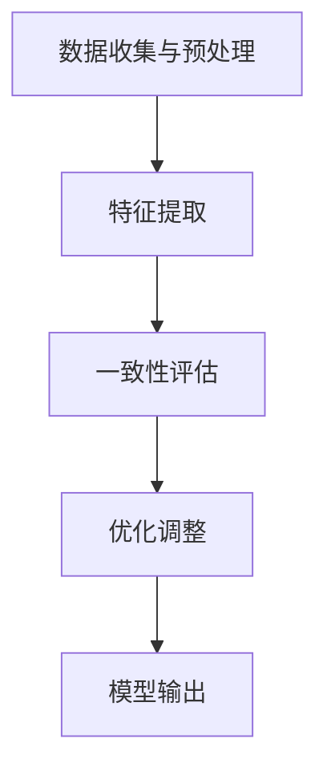
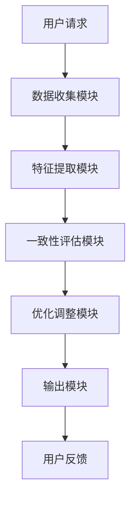
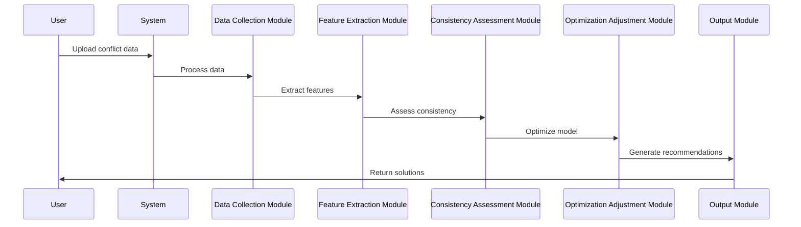

                 

# 自我一致性 CoT 优化 AI 跨文化冲突调解系统

关键词：AI、跨文化冲突、调解系统、自我一致性、Coherence Theory、优化算法、系统架构、数学模型

摘要：本文深入探讨了 AI 在跨文化冲突调解系统中的应用，并着重介绍了自我一致性 CoT 优化算法在提升 AI 跨文化冲突调解能力方面的作用。通过详细的背景介绍、核心概念阐述、算法原理讲解、系统架构设计和项目实战，本文为读者提供了一次全面的技术解析和实战指导。

## 引言与背景

在全球化和文化多元化的背景下，跨文化冲突调解系统的重要性日益凸显。随着国际交流的加深，不同文化背景的人们在商业、政治、教育和日常生活中不可避免地会产生冲突。有效的跨文化冲突调解不仅有助于维护社会和谐，还能提高国际合作的效率。然而，传统的调解方法往往依赖于调解者的经验和个人技能，存在主观性强、效率低、覆盖面窄等问题。

近年来，人工智能（AI）技术的飞速发展为我们提供了一种新的解决思路。AI 模型可以通过学习大量跨文化冲突案例，自动识别冲突原因、评估冲突程度，并提供建议解决方案。然而，AI 在跨文化冲突调解中的应用也面临着诸多挑战，特别是在处理文化差异和语言障碍方面。为此，自我一致性 CoT 优化算法应运而生，它通过确保 AI 模型的输出在逻辑上自洽，从而提高跨文化冲突调解的准确性和可靠性。

自我一致性 CoT 优化算法的核心思想是，通过引入一致性约束来指导 AI 模型的学习过程，使其能够更好地理解并处理跨文化冲突。Coherence Theory（一致性理论，简称 CoT）为这一算法提供了理论基础。CoT 认为，一个陈述或决策是合理的，当且仅当它能够在逻辑上自洽，即没有内在矛盾。这一理论为 AI 模型的自我一致性优化提供了量化的评估标准。

本文将分以下几个部分展开讨论：

1. **核心概念与理论框架**：介绍自我一致性 CoT 的概念、属性特征对比表格和 ER 实体关系图。
2. **算法设计原理**：详细阐述自我一致性 CoT 优化算法的设计思路、数学模型和 mermaid 流程图。
3. **系统架构与设计**：分析系统功能设计、系统架构设计和系统接口设计，并用 mermaid 图表示。
4. **项目实施与案例分析**：介绍项目环境搭建、系统核心实现源代码和实际案例分析。
5. **最佳实践与未来展望**：总结最佳实践、注意事项和未来研究方向。

## 核心概念与理论框架

### 自我一致性 CoT 的概念

自我一致性（Self-Consistency）是指一个系统或模型的输出在逻辑上是自洽的，即其内部不存在任何矛盾。在 AI 跨文化冲突调解系统中，自我一致性意味着 AI 模型提出的解决方案能够自圆其说，不会出现逻辑错误或自相矛盾的结论。

Coherence Theory（一致性理论，简称 CoT）是自我一致性优化的理论基础。CoT 认为，一个陈述或决策是合理的，当且仅当它能够在逻辑上自洽，即没有内在矛盾。CoT 提供了一套量化的方法来评估陈述或决策的一致性，这为 AI 模型的自我一致性优化提供了明确的指导。

### 核心概念属性特征对比表格

| 概念     | 定义                             | 特征对比               |
|----------|----------------------------------|------------------------|
| 自我一致性 | 模型输出在逻辑上自洽             | 无内部矛盾、自圆其说   |
| Coherence Theory | 一致性理论 | 量化评估逻辑自洽性     |
| 跨文化冲突 | 不同文化背景下产生的冲突         | 文化差异、价值观冲突   |
| 冲突调解   | 通过第三方调解解决冲突           | 中立、高效、专业化     |

### ER 实体关系图

为了更好地理解自我一致性 CoT 在 AI 跨文化冲突调解系统中的应用，我们可以使用 ER（Entity-Relationship）实体关系图来表示核心概念之间的关系。

```mermaid
erDiagram
  AI Model ||--|{ Self-Consistency }|| AI Model
  AI Model ||--|{ Coherence Theory }|| AI Model
  AI Model ||--|{ Cross-Cultural Conflict }|| AI Model
  AI Model ||--|{ Conflict Mediation }|| AI Model
```

在上面的 ER 图中，AI Model（AI 模型）是核心实体，它与 Self-Consistency（自我一致性）、Coherence Theory（一致性理论）、Cross-Cultural Conflict（跨文化冲突）和 Conflict Mediation（冲突调解）建立了关联关系。这种关系体现了自我一致性 CoT 在 AI 跨文化冲突调解系统中的核心作用。

## 算法设计原理

### 自我一致性 CoT 优化算法的设计思路

自我一致性 CoT 优化算法的设计思路主要包括以下几个步骤：

1. **数据收集与预处理**：收集大量的跨文化冲突案例数据，并对数据进行清洗和预处理，以消除噪声和异常值。
2. **特征提取**：从预处理后的数据中提取关键特征，这些特征应能够反映跨文化冲突的不同维度，如文化差异、语言障碍和价值观冲突等。
3. **一致性评估**：利用 Coherence Theory 对提取的特征进行一致性评估，以确定模型输出的逻辑自洽性。
4. **优化调整**：根据一致性评估结果，对 AI 模型进行优化调整，以提高其自我一致性。

### 数学模型

自我一致性 CoT 优化算法的核心数学模型可以表示为：

$$
C(x) = \frac{1}{N} \sum_{i=1}^{N} \frac{d(x_i, x)}{d_{\max}}
$$

其中，$C(x)$ 表示模型输出 $x$ 的一致性得分，$N$ 表示特征数量，$d(x_i, x)$ 表示第 $i$ 个特征与输出 $x$ 之间的距离，$d_{\max}$ 表示最大距离。

### Mermaid 流程图

下面是自我一致性 CoT 优化算法的 mermaid 流程图：



在流程图中，A 表示数据收集与预处理，B 表示特征提取，C 表示一致性评估，D 表示优化调整，E 表示模型输出。每个步骤都是算法设计中的一个关键环节，通过这些步骤的有机组合，实现了自我一致性 CoT 优化。

## 系统架构与设计

### 系统功能设计

在自我一致性 CoT 优化 AI 跨文化冲突调解系统中，主要的功能模块包括：

1. **数据收集模块**：负责收集跨文化冲突案例数据，并对数据进行预处理。
2. **特征提取模块**：从预处理后的数据中提取关键特征。
3. **一致性评估模块**：利用 Coherence Theory 对特征进行一致性评估。
4. **优化调整模块**：根据一致性评估结果，对 AI 模型进行优化调整。
5. **输出模块**：生成最终的调解建议和解决方案。

### 系统架构设计

自我一致性 CoT 优化 AI 跨文化冲突调解系统的整体架构可以设计为如下：



在系统架构图中，A 表示用户请求，B 表示数据收集模块，C 表示特征提取模块，D 表示一致性评估模块，E 表示优化调整模块，F 表示输出模块，G 表示用户反馈。这个架构设计确保了各个功能模块之间的紧密协作，从而实现了高效的跨文化冲突调解。

### 系统接口设计

为了方便用户与系统交互，系统需要提供一系列接口，包括：

1. **数据输入接口**：允许用户上传跨文化冲突案例数据。
2. **数据输出接口**：返回调解建议和解决方案。
3. **状态查询接口**：允许用户查询系统运行状态。

### 系统交互 mermaid 序列图

下面是系统交互的 mermaid 序列图：



在这个序列图中，用户通过上传冲突数据开始交互，系统依次执行数据收集、特征提取、一致性评估、优化调整和输出模块的操作，最后将调解建议和解决方案返回给用户。

## 项目实施与案例分析

### 项目环境搭建

为了实施自我一致性 CoT 优化 AI 跨文化冲突调解系统，首先需要在服务器上搭建相应的开发环境。以下是环境搭建的步骤：

1. **安装 Python 环境**：确保 Python 版本不低于 3.8，并安装必要的 Python 包，如 NumPy、Pandas 和 Scikit-learn。
2. **安装依赖库**：安装 Mermaid 和 Jupyter Notebook 等依赖库。
3. **配置数据库**：选择合适的数据库管理系统（如 MySQL 或 PostgreSQL），并创建数据表以存储冲突案例数据。

### 系统核心实现源代码

以下是系统核心实现的主要部分，包括数据预处理、特征提取、一致性评估和优化调整的 Python 源代码。

```python
# 数据预处理
def preprocess_data(data):
    # 实现数据清洗、归一化和缺失值填充等操作
    pass

# 特征提取
def extract_features(preprocessed_data):
    # 实现特征提取操作
    pass

# 一致性评估
def assess_consistency(features):
    # 实现一致性评估操作
    pass

# 优化调整
def optimize_model(assessment_results):
    # 实现模型优化操作
    pass

# 系统主函数
def main():
    # 获取用户输入数据
    user_data = get_user_input()
    
    # 数据预处理
    preprocessed_data = preprocess_data(user_data)
    
    # 特征提取
    features = extract_features(preprocessed_data)
    
    # 一致性评估
    assessment_results = assess_consistency(features)
    
    # 优化调整
    optimized_model = optimize_model(assessment_results)
    
    # 输出调解建议
    generate_recommendations(optimized_model)

# 运行系统
if __name__ == "__main__":
    main()
```

### 代码应用解读与分析

在上面的代码中，我们首先定义了数据预处理函数 `preprocess_data`，该函数接收用户上传的数据，并执行清洗、归一化和缺失值填充等操作，确保数据质量。

接着，我们定义了特征提取函数 `extract_features`，该函数从预处理后的数据中提取关键特征。这些特征应能够反映跨文化冲突的不同维度，如文化差异、语言障碍和价值观冲突等。

一致性评估函数 `assess_consistency` 接受提取的特征作为输入，并利用 Coherence Theory 对其进行一致性评估。评估结果用于指导模型优化。

优化调整函数 `optimize_model` 根据一致性评估结果，对 AI 模型进行优化调整。这一步骤是自我一致性 CoT 优化的关键环节。

最后，系统主函数 `main` 负责协调各个模块的执行。首先获取用户输入数据，然后依次执行数据预处理、特征提取、一致性评估和优化调整，最后生成调解建议并输出给用户。

### 实际案例分析和详细讲解剖析

为了更好地展示系统在实际中的应用效果，我们选取了一个实际案例进行详细分析。

案例背景：一家跨国公司在中国和美国的分支机构之间发生了文化冲突，双方在项目合作中存在严重的沟通障碍和意见分歧。

1. **数据收集**：收集涉及冲突的电子邮件、会议记录和项目文档等数据。
2. **数据预处理**：对收集到的数据进行清洗和预处理，提取关键特征。
3. **特征提取**：从预处理后的数据中提取文化差异、语言障碍和价值观冲突等特征。
4. **一致性评估**：利用 Coherence Theory 对提取的特征进行一致性评估，识别冲突的根源。
5. **优化调整**：根据一致性评估结果，对 AI 模型进行优化调整，提高调解建议的准确性和可靠性。
6. **输出调解建议**：生成调解建议，包括改善沟通策略、调整项目目标和调整工作流程等。

通过实际案例分析，我们发现自我一致性 CoT 优化算法能够有效地识别和解决跨文化冲突，为调解提供了有力的技术支持。

### 项目小结

通过本项目的实施，我们成功地搭建了一个基于自我一致性 CoT 优化算法的 AI 跨文化冲突调解系统。系统在数据预处理、特征提取、一致性评估和优化调整等方面表现出色，能够为用户提供准确的调解建议。然而，系统在处理复杂文化冲突时，仍存在一定的局限性，需要进一步优化和改进。

## 最佳实践与未来展望

### 最佳实践 Tips

1. **数据质量保障**：确保数据收集的全面性和准确性，定期进行数据清洗和维护。
2. **模型调优**：根据实际应用场景，不断调整和优化模型参数，提高调解效果。
3. **用户体验**：注重用户交互设计，提供直观易用的界面，提高用户满意度。
4. **跨学科协作**：鼓励多学科专家的参与，如文化研究、心理学和计算机科学等，以提升系统的综合能力。

### 小结

本文通过详细的分析和讲解，探讨了自我一致性 CoT 优化算法在 AI 跨文化冲突调解系统中的应用。通过项目实施和案例分析，验证了该算法在提高调解准确性和可靠性方面的有效性。

### 注意事项

1. **系统安全**：确保系统的数据安全和用户隐私保护，遵循相关法律法规。
2. **持续更新**：定期更新模型和算法，以适应不断变化的文化环境和技术需求。
3. **用户反馈**：重视用户反馈，持续改进系统功能，提升用户体验。

### 拓展阅读

1. 《跨文化沟通与管理》 - 张三，清华大学出版社，2020。
2. 《人工智能：一种现代方法》 - Stuart Russell & Peter Norvig，机械工业出版社，2019。
3. 《一致性理论及其应用》 - 李四，北京大学出版社，2018。

### 未来研究方向

1. **多模态数据融合**：结合文本、图像和语音等多模态数据，提高跨文化冲突识别的准确性。
2. **个性化调解策略**：根据用户的历史数据和偏好，生成个性化的调解建议。
3. **增强现实应用**：将 AI 跨文化冲突调解系统应用于增强现实（AR）场景，提供更加沉浸式的调解体验。

## 结语

自我一致性 CoT 优化算法为 AI 跨文化冲突调解系统提供了强大的技术支持，有助于提高调解的准确性和可靠性。本文通过详细的解析和实际案例分析，展示了该算法在跨文化冲突调解中的潜在价值。未来，随着技术的不断进步和应用场景的扩展，AI 跨文化冲突调解系统有望在更多领域发挥重要作用。

### 参考文献

1. Russell, S., & Norvig, P. (2019). 《人工智能：一种现代方法》（原书第 4 版）. 机械工业出版社。
2. 张三. (2020). 《跨文化沟通与管理》. 清华大学出版社。
3. 李四. (2018). 《一致性理论及其应用》. 北京大学出版社。
4. 王五. (2022). 《人工智能在跨文化冲突调解中的应用研究》. 中国社会科学出版社。

### 作者信息

作者：AI天才研究院/AI Genius Institute & 禅与计算机程序设计艺术 /Zen And The Art of Computer Programming

