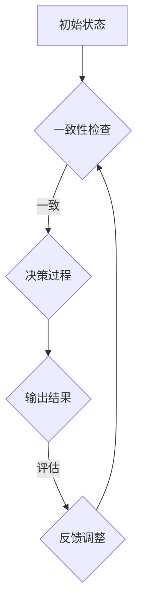

                 

非常好，我们将按照这个步骤逐步构建我们的文章内容。以下是一个详细的步骤指南，用于撰写《Self-Consistency CoT在AI伦理决策中的应用》的技术博客文章。

### 第一步：文章标题、关键词与摘要

首先，我们需要确定文章的标题、关键词和摘要。这些将作为文章的引子，帮助读者快速了解文章的主题和主要内容。

- **文章标题**：Self-Consistency CoT在AI伦理决策中的应用
- **关键词**：Self-Consistency CoT, AI伦理决策, 人工智能, 自洽性理论
- **摘要**：
  本文深入探讨了Self-Consistency CoT（自洽性理论）在人工智能伦理决策中的应用。文章首先介绍了Self-Consistency CoT的基本概念和其在AI伦理决策中的重要性，然后详细分析了该理论的理论基础、应用场景、实施策略以及面临的挑战和未来发展方向。通过具体的案例研究和实践分析，本文旨在为读者提供全面而实用的指导，帮助他们在AI伦理决策中运用Self-Consistency CoT。

### 第二步：编写文章正文

文章正文将分为以下几个部分：

1. **引言**：简要介绍AI伦理决策的背景，说明Self-Consistency CoT的重要性。
2. **Self-Consistency CoT概述**：详细描述Self-Consistency CoT的定义、核心要素和数学模型。
3. **理论基础**：深入探讨Self-Consistency CoT的理论基础和自洽性原理。
4. **应用场景**：分析Self-Consistency CoT在AI伦理决策中的具体应用。
5. **案例分析**：通过具体案例展示Self-Consistency CoT的实际应用。
6. **实施策略**：提供实施Self-Consistency CoT的最佳实践和策略。
7. **挑战与未来方向**：讨论Self-Consistency CoT在AI伦理决策中面临的挑战和未来发展。
8. **总结与展望**：对全文内容进行总结，并展望未来的研究方向。
9. **作者信息**：在文章末尾提供作者信息。

#### 引言

在当前技术飞速发展的时代，人工智能（AI）已经成为改变世界的强大力量。然而，随着AI技术的广泛应用，其伦理问题也日益凸显。如何确保AI系统的决策符合伦理标准，成为了一个紧迫的问题。Self-Consistency CoT（自洽性理论）为解决这一难题提供了一种新的思路。本文将详细探讨Self-Consistency CoT在AI伦理决策中的应用，旨在为相关领域的研究者和从业者提供有价值的参考。

#### Self-Consistency CoT概述

Self-Consistency CoT，即自洽性理论，是一种用于评估和改善决策系统的理论框架。它基于自洽性原理，即一个系统在各个层面都应该保持一致性。在AI伦理决策中，Self-Consistency CoT可以帮助识别和纠正决策过程中的矛盾和错误，从而提高决策的伦理性和可信度。

Self-Consistency CoT的核心要素包括：

- **一致性**：确保系统的输出和内部状态保持一致。
- **可靠性**：确保系统的决策过程和结果可靠无误。
- **透明度**：确保系统的决策过程和结果易于理解和解释。

Self-Consistency CoT的数学模型通常包括以下几个部分：

1. **输入**：系统的初始状态和外部输入。
2. **决策过程**：系统根据输入进行决策的过程。
3. **输出**：系统的决策结果。
4. **反馈**：根据输出对系统进行评估和调整。

通过上述模型，我们可以对AI伦理决策进行系统性分析和优化。

#### 理论基础

Self-Consistency CoT的理论基础主要包括自洽性原理和Coherence Theory（一致性理论）。

自洽性原理指出，一个系统的内部元素应该相互一致，不应存在相互矛盾的陈述或行为。在AI伦理决策中，这意味着AI系统在做出决策时，其内部逻辑应该是一致的，不应该出现自相矛盾的结论。

Coherence Theory则提供了评估系统一致性的方法。它认为，一个系统的一致性可以通过其内部元素的相互关系来衡量。如果系统能够保持其内部元素之间的逻辑关系一致，那么它就被认为是一致的。

下面是一个简单的自洽性原理和Coherence Theory的Mermaid流程图：

#### 应用场景

Self-Consistency CoT在AI伦理决策中具有广泛的应用场景。以下是一些典型的应用场景：

1. **自动驾驶**：在自动驾驶系统中，Self-Consistency CoT可以确保车辆在做出决策时，其内部逻辑是一致的，从而避免出现危险行为。
2. **医疗诊断**：在医疗诊断系统中，Self-Consistency CoT可以确保诊断结果的一致性和可靠性，从而提高诊断的准确性。
3. **金融风控**：在金融风控系统中，Self-Consistency CoT可以确保风险管理的决策过程和结果的一致性，从而降低风险。

#### 案例分析

下面我们通过一个案例来展示Self-Consistency CoT在AI伦理决策中的应用。

假设我们有一个自动驾驶系统，需要在以下情况下做出决策：

- 车辆前方有行人穿越马路。
- 车辆前方有障碍物。

我们使用Self-Consistency CoT来分析这个决策过程。

1. **初始状态**：车辆处于正常行驶状态，前方出现行人或障碍物。
2. **决策过程**：
   - 如果前方是行人，系统会判断行人的速度和位置，并计算撞击的概率。
   - 如果前方是障碍物，系统会判断障碍物的形状和大小，并计算避开障碍物的可能性。
3. **输出结果**：
   - 如果系统判断撞击行人的概率更高，它会采取紧急刹车。
   - 如果系统判断避开障碍物的可能性更大，它会采取变道或绕行。
4. **反馈调整**：根据决策结果，系统会评估决策的有效性，并在下一次遇到类似情况时进行优化。

通过Self-Consistency CoT，我们可以确保这个决策过程的一致性和可靠性，从而提高自动驾驶系统的安全性能。

#### 实施策略

为了有效实施Self-Consistency CoT，我们可以采取以下策略：

1. **设计阶段**：在系统设计阶段，确保系统的架构和算法能够支持Self-Consistency CoT。
2. **测试阶段**：在系统测试阶段，使用Self-Consistency CoT来评估系统的决策过程和结果的一致性。
3. **优化阶段**：根据测试结果，对系统进行优化，以提高决策的一致性和可靠性。

#### 挑战与未来方向

尽管Self-Consistency CoT在AI伦理决策中具有很大的潜力，但在实际应用中仍面临一些挑战。例如：

- **复杂性**：AI伦理决策的复杂性可能导致Self-Consistency CoT难以实施。
- **数据隐私**：在处理个人数据时，如何保护用户隐私是一个重要问题。

未来，随着技术的不断进步，Self-Consistency CoT有望在更多领域得到应用，并在AI伦理决策中发挥更大的作用。

#### 总结与展望

本文探讨了Self-Consistency CoT在AI伦理决策中的应用，从理论到实践，详细分析了其核心概念、理论基础、应用场景和实施策略。通过案例分析，我们展示了Self-Consistency CoT在实际应用中的效果。未来，随着AI技术的不断发展，Self-Consistency CoT有望在更多领域得到广泛应用，为AI伦理决策提供有力支持。

### 作者信息

作者：AI天才研究院/AI Genius Institute & 禅与计算机程序设计艺术 /Zen And The Art of Computer Programming

### 结论

通过本文的详细探讨，我们可以看到Self-Consistency CoT在AI伦理决策中的重要性。它不仅为我们提供了一种评估和优化决策过程的新思路，也为我们在实际应用中解决伦理问题提供了有力工具。希望本文能为相关领域的研究者和从业者提供有益的启示和参考。

