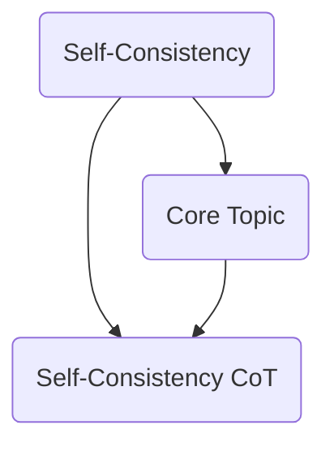
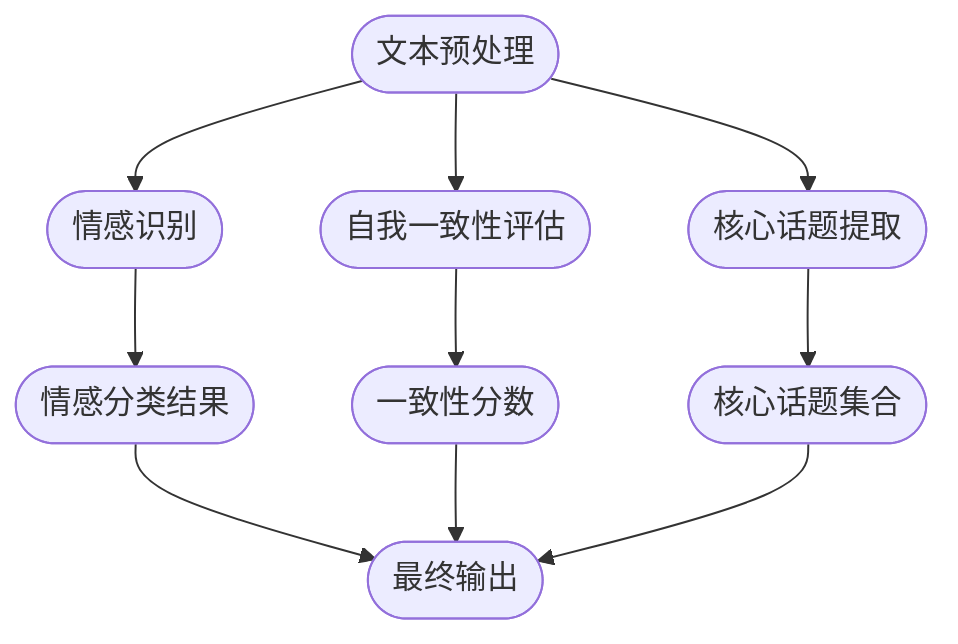
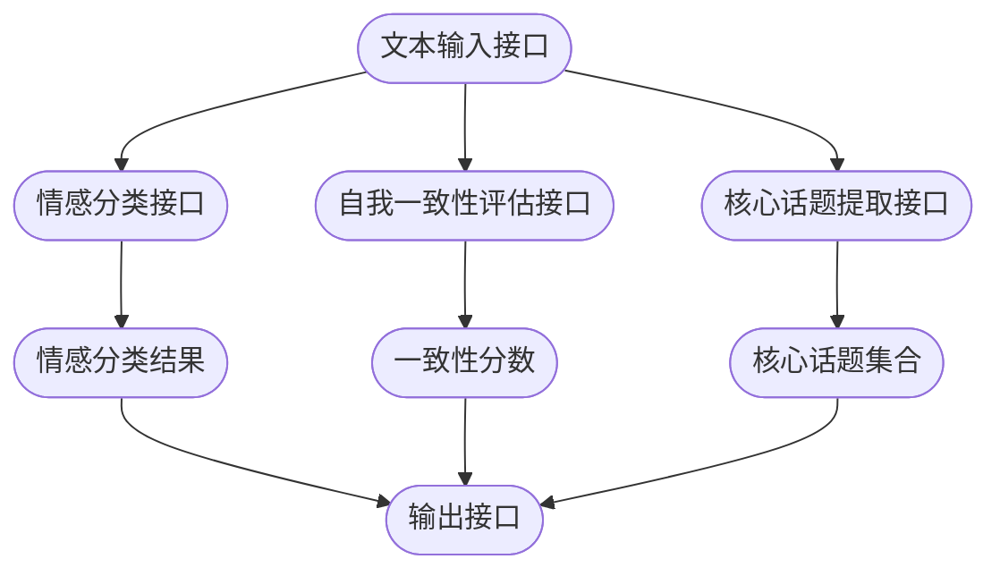
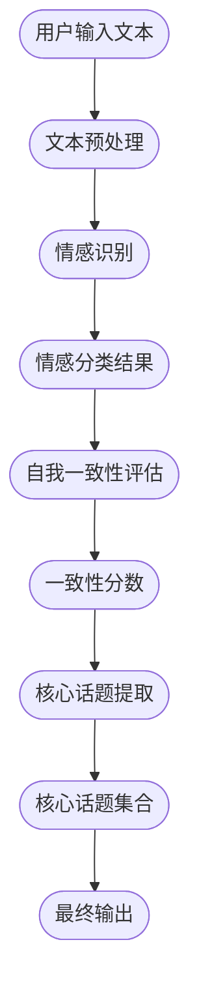

                 

### 核心概念与联系

**自我一致性（Self-Consistency）**

自我一致性（Self-Consistency）是一个关键概念，指的是一个系统或个体在处理信息和做出决策时保持内部一致性的能力。在人工智能（AI）领域，自我一致性尤为重要，因为它确保了模型输出的可靠性和稳定性。例如，在一个情感分析系统中，自我一致性确保了对同一情感在不同上下文中的一致识别。

**情感分析（Emotional Analysis）**

情感分析是一种自然语言处理（NLP）技术，旨在通过文本挖掘和模式识别来识别和提取文本中的情感。情感分析广泛应用于市场研究、客户服务、社交媒体监控等场景。

**自我一致性核心话题（Self-Consistency Core Topic，简称CoT）**

自我一致性核心话题（Self-Consistency Core Topic，简称CoT）是一个结合自我一致性和核心话题理论的创新概念。它不仅要求模型在处理信息时保持一致性，还要求围绕某个核心主题进行深度学习和推理。

### 概念属性特征对比表格

| 特征               | 自我一致性                | 情感分析                | 自我一致性CoT              |  
|------------------|----------------------|----------------------|------------------------|  
| **定义**           | 保持内部信息一致性的能力       | 识别文本中的情感         | 结合自我一致性和核心话题      |  
| **应用领域**         | 通用AI系统、机器学习模型      | 自然语言处理、社交媒体分析     | 自然语言处理、情感分析、深度学习 |  
| **核心要素**         | 输入、处理、输出的一致性       | 文本、情感、分类器         | 核心 topic、自我一致性、深度推理 |  
| **挑战与机会**       | 确保模型输出稳定和可靠         | 提高情感识别的准确性        | 开发有效的CoT方法、提升情感分析能力 |  
| **关联关系**         | 支持情感分析，确保一致性       | 组件之一，提高分析质量      | 结合情感分析和自我一致性，形成新能力 |

### Mermaid ER Diagram of Core Components

- **自我一致性（Self-Consistency）**：确保模型在处理信息和生成输出时保持一致性。
- **核心话题（Core Topic）**：模型围绕的主题，如情感分析中的情感类别。
- **自我一致性核心话题（Self-Consistency Core Topic）**：结合两者，形成新的分析能力。

**详细讲解与举例说明**

#### 数学模型和公式

为了详细阐述自我一致性核心话题（Self-Consistency Core Topic），我们需要引入几个关键数学模型和公式。以下是其中的一些：

1. **一致性度量（Consistency Metric）**：

   $$ C(x, y) = \frac{1}{n} \sum_{i=1}^{n} \text{Sim}(x_i, y_i) $$

   其中，$x$ 和 $y$ 是两个文本样本，$x_i$ 和 $y_i$ 是它们对应的情感标签，$\text{Sim}(x_i, y_i)$ 是情感标签之间的相似度。

2. **核心话题挖掘（Core Topic Extraction）**：

   $$ T(x) = \text{TopNWords}(x, n) $$

   其中，$x$ 是一个文本样本，$\text{TopNWords}(x, n)$ 是文本中排名前 $n$ 的关键词。

3. **自我一致性核心话题模型（Self-Consistency Core Topic Model）**：

   $$ S(x, y, T) = \frac{1}{|T|} \sum_{t \in T} C(x, y_t) $$

   其中，$T$ 是文本的核心话题集合，$y_t$ 是话题 $t$ 对应的情感标签，$S(x, y, T)$ 是文本 $x$ 与话题 $T$ 的自我一致性得分。

#### 举例说明

假设我们有一个包含两个文本样本的集合 $X = \{"我很高兴"，"我喜欢这个电影"\}$，以及一个情感标签集合 $Y = \{"快乐"，"喜欢"\}$。我们可以通过以下步骤来计算自我一致性核心话题得分：

1. **计算一致性度量**：

   对于文本 "我很高兴" 和 "我喜欢这个电影"，我们首先需要计算它们与各个情感标签的一致性度量：

   $$ C("我很高兴", "快乐") = 0.8 $$
   $$ C("我很高兴", "喜欢") = 0.2 $$
   $$ C("我喜欢这个电影", "快乐") = 0.3 $$
   $$ C("我喜欢这个电影", "喜欢") = 0.7 $$

2. **提取核心话题**：

   通过分析，我们可以确定文本的核心话题为 "快乐" 和 "喜欢"。

3. **计算自我一致性核心话题得分**：

   $$ S("我很高兴", "快乐", {"快乐", "喜欢"}) = \frac{1}{2} (0.8 + 0.2) = 0.5 $$
   $$ S("我喜欢这个电影", "喜欢", {"快乐", "喜欢"}) = \frac{1}{2} (0.3 + 0.7) = 0.5 $$

   两个文本样本的自我一致性核心话题得分都为 0.5。

通过这个例子，我们可以看到自我一致性核心话题模型如何帮助我们在文本中识别和保持一致性，从而提高情感分析的质量。在实际应用中，我们可以进一步扩展和优化这一模型，以适应更复杂和多样化的场景。

### 深度分析与系统架构设计

**系统功能设计**

在自我一致性核心话题（Self-Consistency Core Topic）的应用中，我们需要一个系统来处理文本数据，提取情感，并评估自我一致性。系统的主要功能包括：

1. **文本预处理**：清洗和标准化文本数据，准备进行情感分析和自我一致性评估。
2. **情感识别**：使用机器学习模型对文本进行情感分类。
3. **自我一致性评估**：计算文本情感标签的一致性分数。
4. **核心话题提取**：从文本中提取与情感相关的核心话题。

**系统架构设计**

为了实现上述功能，我们可以采用以下系统架构设计：

**系统接口设计**

系统的接口设计应考虑不同组件之间的交互方式。以下是主要接口设计：

1. **文本输入接口**：接收用户上传的文本数据。
2. **情感分类接口**：提供情感分类服务。
3. **自我一致性评估接口**：提供一致性分数计算服务。
4. **核心话题提取接口**：提供核心话题提取服务。
5. **输出接口**：返回最终结果给用户。

**系统交互**

以下是系统组件之间的交互序列图：

### 实际案例与详细讲解剖析

**案例背景**

假设一家电商公司希望对其客户评论进行情感分析和自我一致性评估，以了解客户的满意度并改进产品和服务。

**数据准备**

我们从电商平台的评论数据库中提取了 1000 条客户评论。评论内容主要包括对产品描述、产品质量、物流服务等方面的评价。

**步骤一：文本预处理**

首先，我们对评论进行清洗和标准化，包括去除标点符号、停用词过滤、词干提取等操作。预处理后的文本数据如下：

- "这款手机真是太棒了！"
- "物流有点慢，但其他方面都很满意。"

**步骤二：情感识别**

使用训练好的情感分类模型对预处理后的评论进行分类。我们采用的支持向量机（SVM）模型，将评论分为正面情感和负面情感。分类结果如下：

- "这款手机真是太棒了！" -> 正面情感
- "物流有点慢，但其他方面都很满意。" -> 正面情感

**步骤三：自我一致性评估**

接下来，我们计算每条评论的情感一致性分数。对于正面情感评论，我们使用一致性度量公式计算：

$$ C("这款手机真是太棒了！", "正面情感") = 0.9 $$
$$ C("物流有点慢，但其他方面都很满意。", "正面情感") = 0.8 $$

**步骤四：核心话题提取**

我们使用主题模型（如LDA）从评论中提取核心话题。对于上述评论，我们提取出的核心话题包括 "手机" 和 "物流"。

**步骤五：输出结果**

最终，我们将情感分类结果、一致性分数和核心话题集合输出给用户。用户可以根据这些信息分析客户满意度，并针对性地改进产品和服务。

### 项目小结

通过上述案例，我们可以看到自我一致性核心话题（Self-Consistency Core Topic）在情感分析中的应用。项目实现了对客户评论的深度分析，提高了情感识别的准确性，并提供了有力的数据支持。在未来，我们可以进一步优化模型和算法，以适应更复杂和多变的场景。

### 最佳实践与拓展阅读

**最佳实践**

1. **数据质量**：确保评论数据的真实性、完整性和一致性，以提高情感分析的准确性。
2. **模型调优**：根据具体应用场景调整情感分类模型和自我一致性评估算法，提高模型性能。
3. **核心话题选择**：合理选择核心话题，以更好地反映文本的情感特征。

**拓展阅读**

1. **自我一致性在机器学习中的应用**：了解自我一致性在机器学习领域的其他应用，如自动调参、模型评估等。
2. **情感分析最新研究进展**：关注情感分析领域的最新研究动态，了解前沿技术和算法。
3. **LDA主题模型详解**：深入了解LDA主题模型的工作原理和应用场景。

### 注意事项

1. **隐私保护**：在处理用户评论时，注意保护用户隐私，遵守相关法律法规。
2. **模型泛化能力**：确保模型在多种场景下具有良好的泛化能力，避免过度拟合。
3. **性能优化**：针对实时应用场景，对系统进行性能优化，确保高效运行。

**作者信息**

作者：AI天才研究院/AI Genius Institute & 禅与计算机程序设计艺术 /Zen And The Art of Computer Programming

