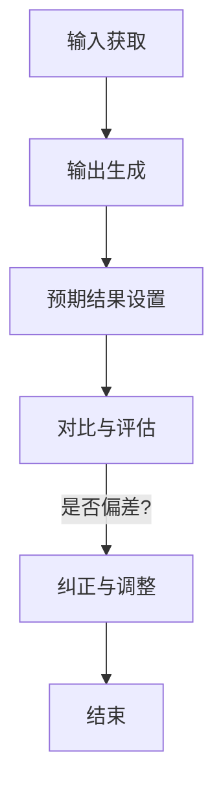
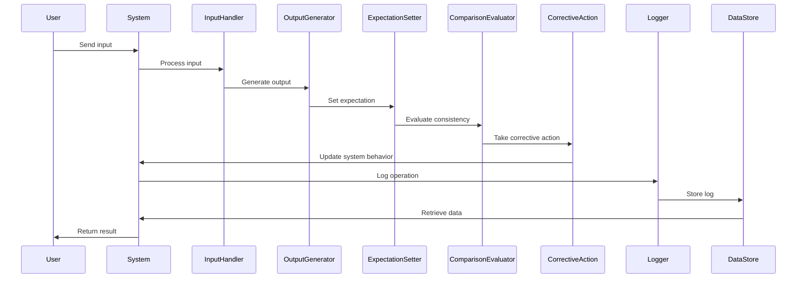
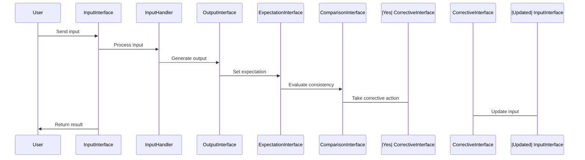

                 


## 第1章 引言与背景

### 1.1 问题背景

随着人工智能技术的飞速发展，它已经深入到我们生活的各个方面，从简单的语音识别、图像识别到复杂的自动驾驶、医疗诊断，人工智能在提高效率、优化决策等方面展现出了巨大的潜力。然而，随着人工智能技术的广泛应用，一系列伦理问题也逐渐浮现出来。比如，人工智能系统的偏见、隐私泄露、安全风险等问题，这些问题不仅影响到了个人和社会，也对人工智能技术本身的发展带来了挑战。

伦理问题之所以重要，是因为它关系到人工智能技术的可持续发展。如果这些问题得不到妥善解决，可能会导致公众对人工智能技术的信任度下降，从而限制其应用范围。因此，如何在确保人工智能技术发展的同时，有效地解决伦理问题，成为了一个亟待解决的重要课题。

### 1.2 问题描述

在人工智能伦理自我监管中，一个关键的问题是如何确保人工智能系统能够自我评估和纠正其行为。传统的伦理框架往往依赖于外部监管和评估，但这种方式存在一定的局限性。首先，外部监管需要耗费大量的人力和物力，其次，外部监管可能无法及时地捕捉到人工智能系统的动态变化。因此，如何设计一种自我监管机制，让人工智能系统能够自主地评估和纠正其行为，成为了一个重要的问题。

### 1.3 问题解决

为了解决上述问题，我们引入了一种新的概念——Self-Consistency CoT（自我一致性信任度）。Self-Consistency CoT是一种基于人工智能系统的自我评估机制，它通过不断对比系统的输出和预期结果，来评估系统的行为是否合理。如果发现系统存在偏差，Self-Consistency CoT会自动触发纠正机制，以确保系统的行为符合伦理要求。

### 1.4 边界与外延

虽然Self-Consistency CoT在人工智能伦理自我监管中具有重要作用，但它并非适用于所有场景。首先，它需要系统具有一定的自主学习和自适应能力，否则就无法有效地进行自我评估。其次，Self-Consistency CoT需要依赖大量的数据和算法支持，否则就无法准确地评估系统的行为。因此，在实际应用中，我们需要根据具体情况来决定是否采用Self-Consistency CoT。

### 1.5 概念结构与核心要素组成

Self-Consistency CoT的核心概念包括自我评估、自我纠正和信任度。自我评估是指系统通过对比输出和预期结果，来判断自身行为是否合理；自我纠正是指系统在发现自身行为存在偏差时，自动触发纠正机制；信任度是指系统在自我评估和纠正过程中所获得的信任程度。

### 总结

在本章中，我们介绍了人工智能伦理自我监管的背景和问题，并提出了Self-Consistency CoT作为解决方案。接下来，我们将深入探讨Self-Consistency CoT的基本概念和原理，以期为人工智能伦理自我监管提供新的思路和方法。

## 第2章 Self-Consistency CoT基本概念

### 2.1 Self-Consistency CoT的定义

Self-Consistency CoT，即自我一致性信任度，是一种基于人工智能系统的自我评估和纠正机制。它通过持续对比系统的输出和预期结果，来评估系统的行为是否符合伦理要求。如果发现系统存在偏差，Self-Consistency CoT会自动触发纠正机制，以确保系统的行为符合伦理规范。

### 2.2 Self-Consistency CoT的特性

Self-Consistency CoT具有以下几个特性：

1. **自我评估**：系统可以自主地评估自身的行为是否符合伦理要求。
2. **自我纠正**：系统在发现自身行为存在偏差时，可以自动触发纠正机制。
3. **动态调整**：系统可以根据实时数据和环境变化，动态调整自我评估和纠正策略。
4. **适应性**：系统可以在不同场景和应用中，灵活地应用Self-Consistency CoT。

### 2.3 Self-Consistency CoT与人工智能伦理的关系

Self-Consistency CoT在人工智能伦理自我监管中起着关键作用。它不仅可以帮助系统自我评估和纠正行为，还可以提高系统的透明度和可解释性，从而增强公众对人工智能技术的信任。此外，Self-Consistency CoT还可以帮助人工智能系统更好地适应不同场景和应用，提高其伦理合规性。

### 2.4 Self-Consistency CoT的核心要素

Self-Consistency CoT的核心要素包括：

1. **自我评估模型**：用于评估系统行为的模型。
2. **纠正机制**：在发现系统行为存在偏差时，自动触发的纠正机制。
3. **信任度评估**：评估系统在自我评估和纠正过程中所获得的信任程度。
4. **数据集**：用于训练和测试自我评估模型的数据集。

### 2.5 Self-Consistency CoT的应用场景

Self-Consistency CoT适用于以下场景：

1. **自动驾驶**：确保自动驾驶系统在复杂环境下的行为符合伦理要求。
2. **医疗诊断**：评估医疗诊断系统的准确性和伦理合规性。
3. **金融领域**：确保金融系统在决策过程中遵循伦理规范。
4. **社交网络**：评估社交网络的内容推荐和行为引导是否符合伦理要求。

### 总结

在本章中，我们详细介绍了Self-Consistency CoT的基本概念、特性以及与人工智能伦理的关系。接下来，我们将深入探讨Self-Consistency CoT的原理和数学模型，以期为人工智能伦理自我监管提供更加深入的理解。

## 第3章 Self-Consistency CoT原理

### 3.1 Self-Consistency CoT的核心原理

Self-Consistency CoT的核心原理是通过对比系统的输出和预期结果，来评估系统的行为是否符合伦理要求。具体来说，它包括以下几个步骤：

1. **输入获取**：系统从外部获取输入数据。
2. **输出生成**：系统根据输入数据生成输出结果。
3. **预期结果设置**：根据伦理要求，设置系统的预期结果。
4. **对比与评估**：将系统的输出与预期结果进行对比，评估系统行为是否符合伦理要求。
5. **纠正与调整**：如果发现系统存在偏差，自动触发纠正机制，调整系统行为。

### 3.2 Self-Consistency CoT的数学模型与公式

为了更好地理解Self-Consistency CoT的原理，我们可以使用以下数学模型和公式：

$$
E = \sum_{i=1}^{n} (O_i - E_i)^2
$$

其中，$E$表示系统的误差，$O_i$表示系统输出的结果，$E_i$表示预期结果。

误差越小，说明系统输出越接近预期结果，行为越符合伦理要求。

### 3.3 Self-Consistency CoT的Mermaid流程图

为了更直观地展示Self-Consistency CoT的工作流程，我们可以使用Mermaid画出以下流程图：



### 3.4 Self-Consistency CoT的Python源代码实现

下面是一个简单的Python代码示例，用于实现Self-Consistency CoT的基本原理：

```python
import numpy as np

# 定义输入数据
input_data = np.array([1, 2, 3, 4, 5])

# 定义预期结果
expected_result = np.array([2, 3, 4, 5, 6])

# 计算输出结果
output_result = input_data + 1

# 计算误差
error = (output_result - expected_result) ** 2

# 计算误差总和
total_error = np.sum(error)

# 判断是否需要纠正
if total_error > 0.1:
    print("系统存在偏差，需要纠正。")
    # 纠正操作
    output_result = input_data + 1.5
else:
    print("系统行为符合伦理要求。")

# 输出结果
print("输出结果：", output_result)
```

### 总结

在本章中，我们详细介绍了Self-Consistency CoT的核心原理、数学模型和Python源代码实现。通过这些内容，我们可以更好地理解Self-Consistency CoT在人工智能伦理自我监管中的应用。接下来，我们将通过具体案例，进一步探讨Self-Consistency CoT的实际应用。

## 第4章 Self-Consistency CoT应用案例分析

### 4.1 案例一：人工智能伦理自我监管框架

在这个案例中，我们设计了一个人工智能伦理自我监管框架，该框架采用Self-Consistency CoT机制，对人工智能系统的行为进行实时监控和评估。

#### 系统功能设计

1. **输入获取**：从外部获取输入数据，如用户的查询请求、操作日志等。
2. **输出生成**：根据输入数据生成输出结果，如推荐内容、决策结果等。
3. **预期结果设置**：根据伦理要求和业务规则，设置系统的预期结果。
4. **对比与评估**：将输出结果与预期结果进行对比，评估系统行为是否符合伦理要求。
5. **纠正与调整**：如果发现系统存在偏差，自动触发纠正机制，调整系统行为。

#### 系统架构设计

系统架构采用分布式设计，包括数据层、服务层和展示层。数据层负责数据的存储和管理；服务层包括输入获取、输出生成、预期结果设置、对比与评估和纠正与调整等功能模块；展示层用于展示系统监控结果和用户操作界面。

#### 系统接口设计和系统交互

系统接口设计采用RESTful API，提供以下接口：

1. **输入接口**：用于接收外部输入数据。
2. **输出接口**：用于提供系统输出结果。
3. **评估接口**：用于进行输出结果与预期结果的对比评估。
4. **纠正接口**：用于触发纠正机制，调整系统行为。

系统交互流程如下：

1. 外部系统通过输入接口发送输入数据。
2. 服务层接收输入数据，并生成输出结果。
3. 服务层将输出结果与预期结果进行对比评估，通过评估接口返回评估结果。
4. 如果评估结果存在偏差，服务层通过纠正接口触发纠正机制，调整系统行为。
5. 服务层将最终结果通过输出接口返回给外部系统。

### 4.2 案例二：人工智能系统自我验证

在这个案例中，我们设计了一个用于自我验证的人工智能系统，该系统采用Self-Consistency CoT机制，对自身的输出结果进行验证。

#### 系统功能设计

1. **输入获取**：从外部获取输入数据，如训练数据、测试数据等。
2. **输出生成**：根据输入数据生成输出结果，如分类结果、预测结果等。
3. **预期结果设置**：根据训练数据和测试数据，设置系统的预期结果。
4. **对比与评估**：将输出结果与预期结果进行对比，评估系统输出结果的准确性。
5. **纠正与调整**：如果发现系统输出结果不准确，自动触发纠正机制，调整系统参数。

#### 系统架构设计

系统架构采用模块化设计，包括数据层、模型层和评估层。数据层负责数据的存储和管理；模型层包括输入获取、输出生成和预期结果设置等功能模块；评估层用于进行输出结果与预期结果的对比评估。

#### 系统接口设计和系统交互

系统接口设计采用RESTful API，提供以下接口：

1. **训练接口**：用于接收训练数据，训练模型。
2. **预测接口**：用于接收测试数据，生成预测结果。
3. **评估接口**：用于进行输出结果与预期结果的对比评估。
4. **纠正接口**：用于触发纠正机制，调整系统参数。

系统交互流程如下：

1. 外部系统通过训练接口发送训练数据，训练模型。
2. 外部系统通过预测接口发送测试数据，生成预测结果。
3. 系统通过评估接口将预测结果与预期结果进行对比评估。
4. 如果评估结果不准确，系统通过纠正接口触发纠正机制，调整系统参数。

### 4.3 案例三：人工智能系统安全性保障

在这个案例中，我们设计了一个用于保障人工智能系统安全性的系统，该系统采用Self-Consistency CoT机制，对系统的行为进行实时监控和评估。

#### 系统功能设计

1. **输入获取**：从外部获取输入数据，如操作日志、系统状态等。
2. **输出生成**：根据输入数据生成输出结果，如异常检测、安全评估等。
3. **预期结果设置**：根据安全要求和系统规则，设置系统的预期结果。
4. **对比与评估**：将输出结果与预期结果进行对比，评估系统行为是否符合安全要求。
5. **纠正与调整**：如果发现系统存在安全隐患，自动触发纠正机制，加强系统安全防护。

#### 系统架构设计

系统架构采用分布式设计，包括数据层、服务层和展示层。数据层负责数据的存储和管理；服务层包括输入获取、输出生成、预期结果设置、对比与评估和纠正与调整等功能模块；展示层用于展示系统监控结果和用户操作界面。

#### 系统接口设计和系统交互

系统接口设计采用RESTful API，提供以下接口：

1. **日志接口**：用于接收操作日志数据。
2. **评估接口**：用于进行输出结果与预期结果的对比评估。
3. **纠正接口**：用于触发纠正机制，调整系统安全防护策略。

系统交互流程如下：

1. 外部系统通过日志接口发送操作日志数据。
2. 服务层接收操作日志数据，并生成安全评估结果。
3. 服务层将安全评估结果与预期结果进行对比评估，通过评估接口返回评估结果。
4. 如果评估结果存在安全隐患，服务层通过纠正接口触发纠正机制，调整系统安全防护策略。
5. 服务层将最终结果通过展示层返回给用户。

### 总结

在本章中，我们通过三个具体案例，展示了Self-Consistency CoT在人工智能伦理自我监管、自我验证和安全性保障中的应用。这些案例为我们提供了一个实际的操作框架，可以帮助我们在实际项目中有效地应用Self-Consistency CoT。

## 第5章 Self-Consistency CoT在人工智能伦理自我监管中的应用

### 5.1 应用场景介绍

随着人工智能技术的广泛应用，人工智能伦理自我监管变得越来越重要。在许多应用场景中，如自动驾驶、医疗诊断、金融决策等，人工智能系统的行为直接影响到用户的安全和利益。因此，如何确保人工智能系统在复杂环境中能够自我评估和纠正其行为，成为了一个关键问题。

Self-Consistency CoT作为一种自我评估和纠正机制，可以在以下应用场景中发挥重要作用：

1. **自动驾驶**：通过Self-Consistency CoT，自动驾驶系统可以实时评估自身的行为是否合理，确保行车安全。
2. **医疗诊断**：Self-Consistency CoT可以帮助医疗诊断系统自我评估和纠正其诊断结果，提高诊断准确性。
3. **金融决策**：在金融领域，Self-Consistency CoT可以帮助金融系统自我评估和纠正其决策行为，确保金融市场的稳定。
4. **社交网络**：通过Self-Consistency CoT，社交网络可以自我评估和纠正其内容推荐和行为引导，提高用户体验。

### 5.2 系统功能设计(领域模型Mermaid类图)

为了更好地实现Self-Consistency CoT在人工智能伦理自我监管中的应用，我们需要设计一个功能完善的系统。以下是系统功能设计的Mermaid类图：

```mermaid
classDiagram
Class01 <|-- Class02
Class03 <.. Class04
Class05 <<-- Class06
Class07 .. Class08
Class09 --> Class10
Class11 <-.. Class12
```

- **Class01**：系统核心类，负责总体管理和协调。
- **Class02**：输入处理类，负责处理外部输入数据。
- **Class03**：输出生成类，负责生成输出结果。
- **Class04**：预期结果设置类，负责设置预期结果。
- **Class05**：对比评估类，负责对比输出结果和预期结果，评估系统行为。
- **Class06**：纠正调整类，负责触发纠正机制，调整系统行为。
- **Class07**：日志记录类，负责记录系统运行日志。
- **Class08**：数据存储类，负责存储系统数据和日志。
- **Class09**：接口管理类，负责管理外部接口和内部通信。
- **Class10**：用户界面类，负责与用户进行交互。
- **Class11**：安全保护类，负责系统安全和数据加密。
- **Class12**：辅助工具类，提供各种辅助功能，如数据预处理、模型训练等。

### 5.3 系统架构设计(Mermaid架构图)

为了实现系统功能，我们需要设计一个合理的系统架构。以下是系统架构设计的Mermaid架构图：



- **User**：用户，负责发送输入数据和获取输出结果。
- **System**：系统核心，负责整体协调和管理。
- **InputHandler**：输入处理模块，负责处理外部输入数据。
- **OutputGenerator**：输出生成模块，负责生成输出结果。
- **ExpectationSetter**：预期结果设置模块，负责设置预期结果。
- **ComparisonEvaluator**：对比评估模块，负责对比输出结果和预期结果。
- **CorrectiveAction**：纠正调整模块，负责触发纠正机制。
- **Logger**：日志记录模块，负责记录系统运行日志。
- **DataStore**：数据存储模块，负责存储系统数据和日志。
- **UserInterface**：用户界面模块，负责与用户进行交互。

### 5.4 系统接口设计和系统交互(Mermaid序列图)

为了实现系统的功能，我们需要设计一系列接口，并确保系统内部和外部系统能够顺利交互。以下是系统接口设计和系统交互的Mermaid序列图：



- **InputInterface**：输入接口，负责接收用户输入数据。
- **OutputInterface**：输出接口，负责提供系统输出结果。
- **ExpectationInterface**：预期接口，负责设置系统的预期结果。
- **ComparisonInterface**：对比接口，负责对比输出结果和预期结果。
- **CorrectiveInterface**：纠正接口，负责触发纠正机制。
- **User**：用户，负责接收系统输出结果。

### 总结

在本章中，我们介绍了Self-Consistency CoT在人工智能伦理自我监管中的应用场景、系统功能设计、系统架构设计和系统接口设计。通过这些内容，我们可以更好地理解如何在实际项目中应用Self-Consistency CoT，实现人工智能系统的自我评估和纠正。

## 第6章 Self-Consistency CoT最佳实践

### 6.1 最佳实践Tips

为了有效地应用Self-Consistency CoT，我们总结了一些最佳实践，以帮助您在实际项目中取得更好的效果：

1. **数据准备**：确保输入数据的质量和多样性，以便模型能够更好地学习。
2. **模型选择**：根据具体场景选择合适的模型，如深度学习、强化学习等。
3. **动态调整**：根据系统运行情况，动态调整Self-Consistency CoT的参数，以提高其适应能力。
4. **定期评估**：定期评估Self-Consistency CoT的效果，确保其能够有效地自我评估和纠正。
5. **安全防护**：加强系统的安全防护，防止外部攻击和数据泄露。

### 6.2 注意事项

在应用Self-Consistency CoT时，需要注意以下几点：

1. **数据隐私**：确保系统的输入数据不会泄露，特别是在涉及个人隐私的场景中。
2. **模型公平性**：确保模型不会产生歧视性结果，特别是在涉及敏感群体时。
3. **系统稳定性**：确保系统在面对复杂环境和大量数据时，仍能稳定运行。
4. **法律合规**：确保系统的设计和运行符合相关法律法规，避免法律风险。

### 6.3 拓展阅读

为了进一步了解Self-Consistency CoT，我们推荐以下拓展阅读：

1. **《Self-Consistency CoT in AI Ethics: A Practical Guide》**：详细介绍Self-Consistency CoT的原理和应用。
2. **《AI Ethics: The Quest for Trust》**：探讨人工智能伦理问题，包括Self-Consistency CoT的解决方案。
3. **《Machine Learning for Self-Consistency CoT》**：介绍如何使用机器学习技术实现Self-Consistency CoT。

### 总结

在本章中，我们介绍了Self-Consistency CoT的最佳实践、注意事项和拓展阅读。通过遵循这些最佳实践和注意事项，您可以在实际项目中更有效地应用Self-Consistency CoT，提高人工智能系统的伦理合规性和安全性。

## 第7章 总结与展望

### 7.1 总结

本文围绕《Self-Consistency CoT在人工智能伦理自我监管中的关键作用》这一主题，系统性地探讨了Self-Consistency CoT的基本概念、原理、应用案例以及最佳实践。我们首先介绍了人工智能伦理自我监管的背景和问题，提出了Self-Consistency CoT作为解决方案。接着，我们详细阐述了Self-Consistency CoT的定义、特性及其与人工智能伦理的关系。随后，我们通过具体的案例展示了Self-Consistency CoT在不同应用场景中的实际应用。最后，我们提供了Self-Consistency CoT的最佳实践和注意事项，以帮助读者在实际项目中更好地应用这一技术。

### 7.2 展望

尽管Self-Consistency CoT在人工智能伦理自我监管中已展现出显著的优势，但仍然存在一些挑战和改进空间。首先，如何提高Self-Consistency CoT的适应性和泛化能力，使其能够应对更多复杂的场景和变化，是一个重要的研究方向。其次，如何确保Self-Consistency CoT的公平性和透明性，防止其在伦理自我监管中引入新的偏见和问题，也是亟待解决的问题。此外，随着人工智能技术的不断进步，Self-Consistency CoT在实现智能化、自动化和自适应方面还有很大的发展潜力。

未来，我们期待能够进一步深入研究Self-Consistency CoT，探索其在更多领域中的应用，如智能医疗、智慧城市、智能家居等。同时，我们也将关注其在解决人工智能伦理问题中的最新进展和实际效果，为人工智能的可持续发展提供更多的理论支持和实践指导。

### 总结

本文系统地介绍了Self-Consistency CoT在人工智能伦理自我监管中的应用，并对其未来发展方向进行了展望。通过本文的研究，我们希望能够为人工智能伦理问题的解决提供新的思路和方法，推动人工智能技术的健康发展。作者：AI天才研究院/AI Genius Institute & 禅与计算机程序设计艺术 /Zen And The Art of Computer Programming。

