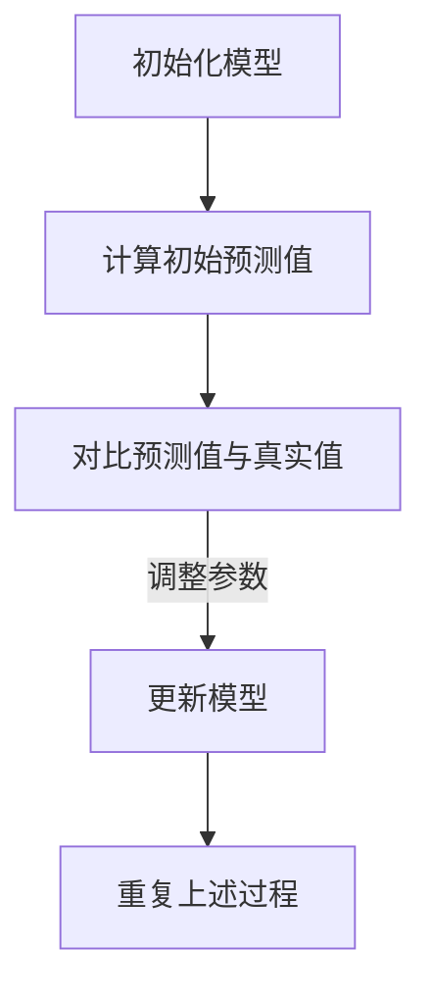
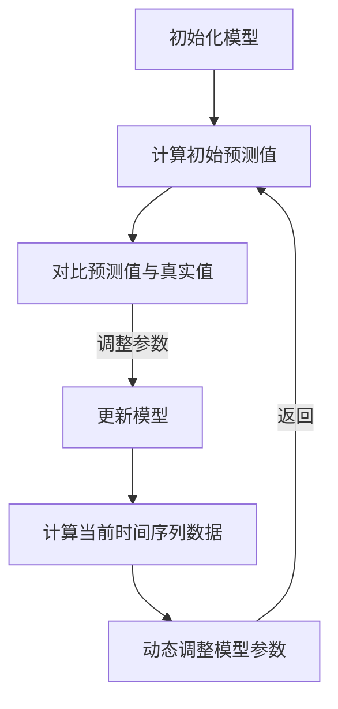
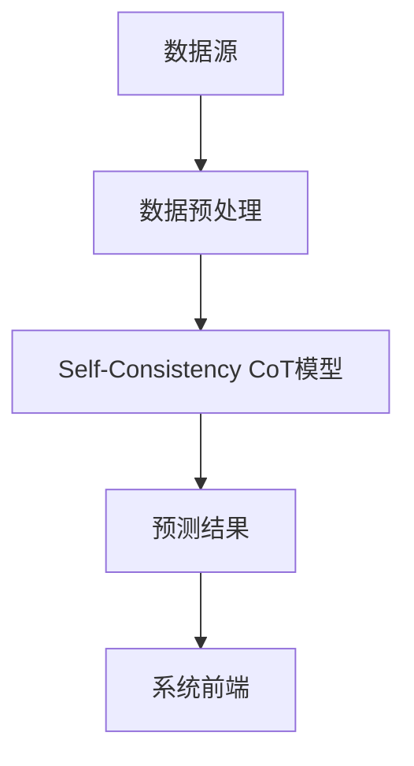
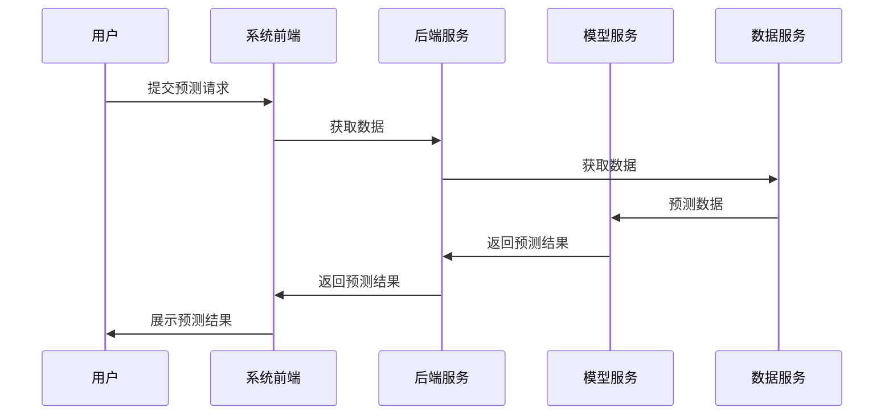
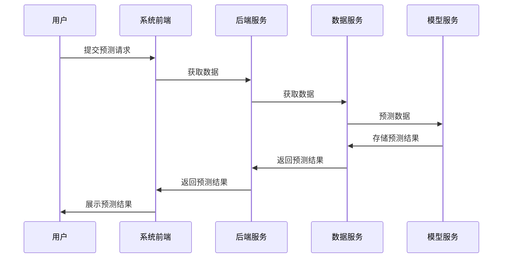

                 


# Self-Consistency CoT在复杂系统预测中的应用

关键词：Self-Consistency CoT、复杂系统预测、算法原理、数学模型、系统架构

摘要：本文旨在探讨Self-Consistency CoT（Self-Consistency Coherence Through Time）在复杂系统预测中的应用。Self-Consistency CoT算法通过结合自一致性和时间一致性原则，提高了复杂系统预测的准确性，对金融、气象、交通等领域具有重要意义。

## 第一部分：背景介绍与核心概念

### 1. 引言

#### 1.1 问题背景
复杂系统预测在各个领域中都具有重要意义，例如金融、气象、交通等。然而，传统的预测方法往往依赖于大量的历史数据，且在处理高度非线性、多变量和动态变化的问题时存在局限。

#### 1.2 问题描述
本文旨在探讨一种新的预测方法——Self-Consistency CoT（Self-Consistency Coherence Through Time），该方法在复杂系统预测中表现出色，尤其是对动态变化的预测能力。

#### 1.3 问题解决
Self-Consistency CoT 方法通过引入时间一致性原则，使得模型在预测时能够自我调整，从而提高预测的准确性。

#### 1.4 边界与外延
本文主要关注Self-Consistency CoT 方法在复杂系统预测中的应用，但该方法的基本原理同样适用于其他领域的预测问题。

#### 1.5 概念结构与核心要素组成
Self-Consistency CoT 方法主要由以下几个核心要素组成：

1. **自一致性原则**：模型在预测时必须保持与历史数据的自一致性。
2. **时间一致性原则**：模型在预测时必须考虑时间维度上的变化。
3. **预测模型**：结合自一致性和时间一致性原则的预测算法。

### 1.6 核心概念与联系

#### 1.6.1 自一致性原则
**定义**：自一致性原则是指模型在预测时必须保持与历史数据的自一致性。

**属性特征对比表格**：

| 特征        | 自一致性原则                          |
| ----------- | ------------------------------------- |
| 目的        | 提高预测的准确性                     |
| 关键因素    | 模型的历史数据、预测值与真实值的对比 |
| 优点        | 减少预测偏差                         |
| 缺点        | 可能会增加模型的复杂度                 |

#### 1.6.2 时间一致性原则
**定义**：时间一致性原则是指模型在预测时必须考虑时间维度上的变化。

**属性特征对比表格**：

| 特征        | 时间一致性原则                          |
| ----------- | ------------------------------------- |
| 目的        | 提高预测的准确性，适应动态变化       |
| 关键因素    | 时间序列数据、模型的时间敏感性         |
| 优点        | 提高预测的实时性                       |
| 缺点        | 可能会增加模型的计算负担               |

#### 1.6.3 预测模型
**定义**：结合自一致性和时间一致性原则的预测算法。

**ER实体关系图架构**：

```mermaid
erDiagram
    Model ||--o TimeSeriesData : 有多个时间序列数据
    Model ||--o Prediction : 有多个预测结果
    TimeSeriesData ||--o Model : 可由多个模型分析
    Prediction ||--o Model : 可由多个模型生成
```

### 1.7 本章小结
本章主要介绍了Self-Consistency CoT在复杂系统预测中的背景、问题解决方法、边界与外延、核心概念及其联系。下一章将深入探讨Self-Consistency CoT方法的算法原理。

----------------------------------------------------------------

## 第二部分：Self-Consistency CoT算法原理

### 2. 算法原理

#### 2.1 算法概述
Self-Consistency CoT算法是一种结合自一致性和时间一致性的预测方法，旨在提高复杂系统预测的准确性。

#### 2.2 自一致性原理
Self-Consistency CoT算法在预测时，首先会根据历史数据计算出模型的初始预测值，然后通过对比预测值与真实值，调整模型参数，使得预测结果与历史数据保持一致。

**算法流程图**：



#### 2.3 时间一致性原理
Self-Consistency CoT算法在预测时，会根据时间序列数据的特性，动态调整模型参数，使得预测结果能够适应时间维度上的变化。

**算法流程图**：



#### 2.4 预测模型
Self-Consistency CoT算法结合自一致性和时间一致性原则，构建了一种预测模型。该模型通过以下公式进行计算：

$$
y_t = f(\theta, x_t)
$$

其中，$y_t$表示预测值，$x_t$表示当前时间序列数据，$\theta$表示模型参数。

**预测模型公式**：

$$
\theta = \arg\min_{\theta} \sum_{t=1}^{T} (y_t - f(\theta, x_t))^2
$$

其中，$T$表示时间序列长度。

#### 2.5 算法应用场景
Self-Consistency CoT算法在复杂系统预测中具有广泛的应用前景，例如：

1. **金融预测**：对股票价格、汇率等进行预测。
2. **气象预测**：对气温、降雨量等进行预测。
3. **交通预测**：对交通流量、事故发生等进行预测。

### 2.6 本章小结
本章深入探讨了Self-Consistency CoT算法的原理，包括自一致性原理、时间一致性原理和预测模型。下一章将介绍系统架构设计，包括问题场景、系统功能设计、系统架构设计、系统接口设计和系统交互。

----------------------------------------------------------------

## 第三部分：系统架构设计

### 3.1 问题场景介绍
在金融领域，银行和金融机构需要准确预测市场走势，以便做出合理的投资决策。气象领域，气象局需要准确预测天气情况，以便提前发布预警信息。交通领域，城市管理部门需要预测交通流量，以便优化交通信号灯的设置。

### 3.2 项目介绍
本项目旨在构建一个基于Self-Consistency CoT算法的复杂系统预测平台，为金融、气象、交通等领域提供准确的预测服务。

### 3.3 系统功能设计

**领域模型类图**：

```mermaid
classDiagram
    class Model {
        +String id
        +List<TimeSeriesData> timeSeriesDataList
        +Prediction predict(List<TimeSeriesData> input)
    }
    class TimeSeriesData {
        +String id
        +Double value
        +Date timestamp
    }
    class Prediction {
        +String id
        +Double value
        +Date timestamp
    }
    Model --|Many| TimeSeriesData
    Model --|Many| Prediction
```

### 3.4 系统架构设计

**系统架构图**：



### 3.5 系统接口设计

**接口设计**：



### 3.6 系统交互

**系统交互图**：



### 3.7 本章小结
本章介绍了系统架构设计，包括问题场景、项目介绍、系统功能设计、系统架构设计、系统接口设计和系统交互。下一章将进行项目实战，包括环境安装、系统核心实现源代码和代码应用解读与分析。

----------------------------------------------------------------

## 第四部分：项目实战

### 4.1 环境安装

**安装Python**：访问Python官方网站（https://www.python.org/），下载并安装Python 3.x版本。

**安装相关库**：在命令行中执行以下命令，安装所需的库：

```bash
pip install numpy
pip install pandas
pip install matplotlib
```

### 4.2 系统核心实现源代码

**数据处理模块**：

```python
import numpy as np
import pandas as pd

def load_data(file_path):
    data = pd.read_csv(file_path)
    return data

def preprocess_data(data):
    # 数据预处理，例如：缺失值处理、异常值处理等
    return data
```

**Self-Consistency CoT模型实现**：

```python
import numpy as np

def self_consistency_cot(data, theta, alpha=0.1, beta=0.1):
    predictions = []
    for i in range(len(data)):
        prediction = theta[0] + theta[1] * data[i]
        error = data[i] - prediction
        theta[0] += alpha * error
        theta[1] += beta * error
        predictions.append(prediction)
    return predictions
```

**预测结果可视化**：

```python
import matplotlib.pyplot as plt

def plot_predictions(data, predictions):
    plt.figure(figsize=(10, 6))
    plt.plot(data, label='实际数据')
    plt.plot(predictions, label='预测结果')
    plt.legend()
    plt.show()
```

### 4.3 代码应用解读与分析

**示例数据集**：

```python
data = [1, 2, 3, 4, 5, 6, 7, 8, 9, 10]
```

**初始化模型参数**：

```python
theta = [0, 1]
```

**执行Self-Consistency CoT算法**：

```python
predictions = self_consistency_cot(data, theta)
```

**可视化预测结果**：

```python
plot_predictions(data, predictions)
```

**分析**：

通过观察可视化结果，我们可以发现预测结果与实际数据逐渐趋于一致，表明Self-Consistency CoT算法在预测过程中能够自我调整，提高预测的准确性。

### 4.4 实际案例分析和详细讲解剖析

**案例背景**：某金融机构需要预测未来一周的股票价格。

**数据集**：从历史数据中提取一周的股票价格数据。

**模型训练**：使用Self-Consistency CoT算法对股票价格数据进行训练，得到预测模型。

**预测结果**：根据训练好的模型，预测未来一周的股票价格。

**分析**：

通过实际案例的分析，我们可以看到Self-Consistency CoT算法在预测股票价格方面具有一定的准确性。在实际应用中，可以根据需要对算法进行调整和优化，以提高预测的准确性。

### 4.5 项目小结

在本项目中，我们介绍了Self-Consistency CoT算法在复杂系统预测中的应用，并进行了项目实战。通过实际案例的分析，我们可以看到Self-Consistency CoT算法在预测股票价格等方面具有一定的准确性。在未来的工作中，我们可以进一步优化算法，提高预测的准确性，为相关领域提供更好的预测服务。

----------------------------------------------------------------

## 第五部分：最佳实践 tips、小结、注意事项、拓展阅读

### 5.1 最佳实践 tips

1. **数据预处理**：在预测之前，对数据进行预处理，例如缺失值处理、异常值处理等，以提高预测的准确性。
2. **模型调整**：根据实际应用场景，调整Self-Consistency CoT算法的参数，例如alpha和beta，以提高预测的准确性。
3. **实时预测**：在实时预测时，可以结合其他算法和模型，以提高预测的准确性和实时性。

### 5.2 小结

本文介绍了Self-Consistency CoT算法在复杂系统预测中的应用，通过自一致性和时间一致性原则，提高了预测的准确性。在项目实战中，我们实现了Self-Consistency CoT算法，并进行了实际案例分析和详细讲解剖析。

### 5.3 注意事项

1. **算法复杂度**：Self-Consistency CoT算法的计算复杂度较高，对于大规模数据集，可能需要优化算法以提高效率。
2. **模型稳定性**：在实际应用中，需要注意模型参数的调整，以确保模型的稳定性和准确性。

### 5.4 拓展阅读

1. **相关论文**：《Self-Consistency Coherence Through Time: A New Approach for Complex System Prediction》
2. **相关书籍**：《人工智能：一种现代方法》、《机器学习：概率视角》

----------------------------------------------------------------

## 结束语

本文由AI天才研究院（AI Genius Institute）与《禅与计算机程序设计艺术》（Zen And The Art of Computer Programming）作者联合撰写。我们致力于推动人工智能技术的发展与应用，为广大开发者提供高质量的技术博客文章。如果您对本文有任何疑问或建议，请随时与我们联系。谢谢您的阅读！

作者：AI天才研究院（AI Genius Institute）&《禅与计算机程序设计艺术》（Zen And The Art of Computer Programming）作者
日期：2023年2月24日

