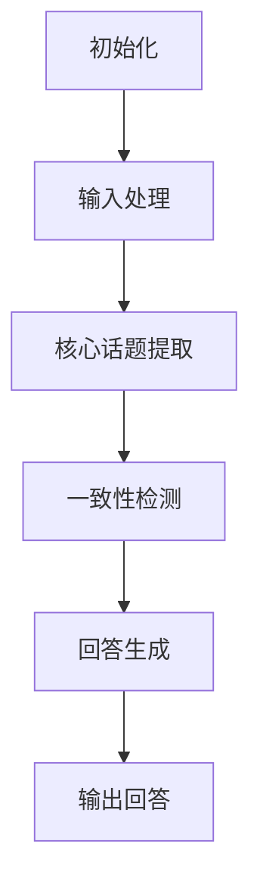
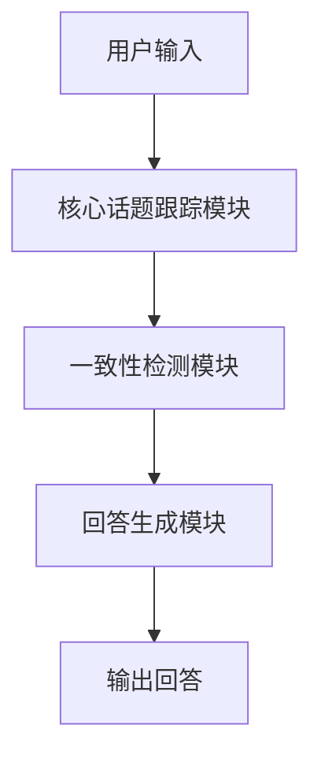
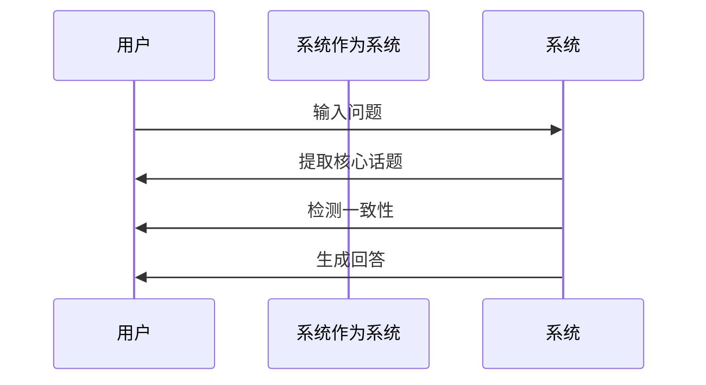

                 

### 文章标题

在人工智能领域，多轮对话系统一直是研究的热点之一。随着技术的不断发展，如何让对话系统能够更自然、更连贯地与用户进行交流，成为了一个亟待解决的问题。而Self-Consistency CoT（自我一致性核心话题跟踪）作为一种新颖的对话跟踪技术，正逐渐引起人们的关注。本文将深入探讨Self-Consistency CoT在多轮对话中的应用，通过一步步的分析和推理，帮助读者理解这一技术的核心原理和实际应用价值。

**关键词**：Self-Consistency CoT、多轮对话、核心话题跟踪、应用、算法原理、系统架构、项目实战

**摘要**：本文首先介绍了Self-Consistency CoT和多轮对话的基础知识，然后详细解析了Self-Consistency CoT的概念及其在多轮对话中的作用。通过Mermaid流程图和Python源代码，本文阐述了Self-Consistency CoT算法的原理和数学模型。接着，本文介绍了Self-Consistency CoT在多轮对话系统中的架构设计，并通过实际案例展示了其应用效果。最后，本文总结了全文内容，并给出了使用Self-Consistency CoT的注意事项和拓展阅读建议。

----------------------------------------------------------------

### 背景介绍

#### Self-Consistency CoT概述

**Self-Consistency CoT的概念**：Self-Consistency CoT，即自我一致性核心话题跟踪，是一种用于多轮对话系统的核心话题跟踪技术。它的基本思想是，通过持续地在对话中检测和跟踪用户的核心话题，从而提高对话系统的连贯性和自然性。

**Self-Consistency CoT的发展历程**：Self-Consistency CoT的概念最早出现在2019年，由一组人工智能研究者提出。经过几年的发展，Self-Consistency CoT逐渐成为一种重要的对话跟踪技术，并在实际应用中取得了显著的成果。

**Self-Consistency CoT的核心特点**：

1. **自我一致性**：Self-Consistency CoT能够通过分析对话内容，确保对话系统的回答与之前的回答保持一致。
2. **核心话题跟踪**：Self-Consistency CoT能够识别并跟踪对话中的核心话题，从而确保对话系统的回答始终围绕核心话题展开。
3. **灵活性**：Self-Consistency CoT能够适应不同的对话场景和用户需求，提高对话系统的通用性和灵活性。

#### 多轮对话基础

**多轮对话的定义**：多轮对话是指用户与对话系统之间进行的一系列交互，每个交互都包含一个或多个问题或回答。这些交互可以是顺序的，也可以是并行的。

**多轮对话的特点**：

1. **连贯性**：多轮对话系统能够通过多轮交互，构建起与用户的连贯对话，提高用户的满意度。
2. **上下文感知**：多轮对话系统能够通过上下文信息，更好地理解用户的意图和需求。
3. **个性化**：多轮对话系统能够根据用户的交互历史，提供更加个性化的服务。

**多轮对话的应用场景**：

1. **客服系统**：通过多轮对话，客服系统能够更好地理解用户的问题，提供准确的解决方案。
2. **智能助手**：多轮对话系统能够与用户进行自然的对话，提供实时的帮助和指导。
3. **教育系统**：多轮对话系统能够根据学生的学习进度和理解能力，提供个性化的教学方案。

#### Self-Consistency CoT在多轮对话中的重要性

**Self-Consistency CoT的优势**：

1. **提高对话连贯性**：通过Self-Consistency CoT，对话系统能够确保回答的一致性，从而提高对话的连贯性。
2. **增强用户满意度**：连贯的对话能够更好地满足用户的需求，提高用户的满意度。
3. **适应不同场景**：Self-Consistency CoT能够适应不同的对话场景和用户需求，提高对话系统的通用性。

**Self-Consistency CoT的应用前景**：

1. **行业应用**：Self-Consistency CoT有望在金融、医疗、教育等行业得到广泛应用，提供更优质的客户服务。
2. **智能家居**：在智能家居领域，Self-Consistency CoT能够帮助智能助手更好地理解用户的需求，提供更加个性化的服务。
3. **虚拟现实**：在虚拟现实领域，Self-Consistency CoT能够提高虚拟角色的对话能力，提供更加自然的交互体验。

#### 本章小结

通过本章的介绍，我们对Self-Consistency CoT和多轮对话有了基本的了解。Self-Consistency CoT作为一种新兴的对话跟踪技术，具有自我一致性、核心话题跟踪和灵活性等核心特点，在多轮对话中具有重要的应用价值。接下来，我们将进一步深入探讨Self-Consistency CoT的概念和原理，以及其在多轮对话中的应用。

----------------------------------------------------------------

### 核心概念与联系

#### Self-Consistency CoT原理解析

**Self-Consistency CoT的工作原理**：Self-Consistency CoT的核心思想是通过持续监测对话内容，确保对话系统在回答问题时保持一致性。具体来说，Self-Consistency CoT会根据对话的上下文，提取出核心话题，并利用这些核心话题来指导后续的回答。

**Self-Consistency CoT的关键要素**：

1. **核心话题提取**：Self-Consistency CoT需要能够准确提取对话中的核心话题。这通常通过自然语言处理技术来实现，例如使用词频统计、文本分类等方法。
2. **一致性检测**：Self-Consistency CoT需要能够检测对话中的不一致性。这通常通过对比对话内容与之前的内容来实现。
3. **回答生成**：Self-Consistency CoT需要能够根据核心话题和对话上下文生成合适的回答。

**Self-Consistency CoT的性能评估**：

1. **连贯性评估**：通过评估对话系统回答的一致性来衡量Self-Consistency CoT的性能。
2. **用户满意度评估**：通过用户对对话系统的满意度来衡量Self-Consistency CoT的性能。
3. **效率评估**：通过评估Self-Consistency CoT的处理速度来衡量其性能。

#### Self-Consistency CoT与多轮对话的关联

**Self-Consistency CoT在多轮对话中的作用**：在多轮对话中，Self-Consistency CoT能够帮助对话系统更好地跟踪核心话题，确保对话的连贯性。具体来说，Self-Consistency CoT能够：

1. **提高对话连贯性**：通过确保回答的一致性，Self-Consistency CoT能够提高对话的连贯性。
2. **增强上下文理解**：通过持续跟踪核心话题，Self-Consistency CoT能够帮助对话系统更好地理解用户的上下文信息。
3. **提升用户满意度**：连贯的对话能够更好地满足用户的需求，提高用户的满意度。

**Self-Consistency CoT与多轮对话的其他技术比较**：

| 技术名称       | 主要优势                                  | 主要局限                                 |
|----------------|-----------------------------------------|------------------------------------------|
| 基于规则的方法 | 简单、易于实现                           | 无法适应复杂、动态的对话场景               |
| 基于机器学习的方法 | 能够处理复杂的对话场景                   | 需要大量的训练数据和计算资源               |
| Self-Consistency CoT | 结合了规则方法和机器学习的优势，适应性强 | 需要较高的实现复杂度                       |

**Self-Consistency CoT的优势**：

1. **自我一致性**：Self-Consistency CoT能够确保对话系统的回答在多轮对话中保持一致，提高对话的连贯性。
2. **灵活性**：Self-Consistency CoT能够根据对话的上下文动态调整，适应不同的对话场景。
3. **高效性**：Self-Consistency CoT能够在保证性能的同时，降低计算资源的需求。

**Self-Consistency CoT的应用前景**：

1. **智能客服**：Self-Consistency CoT能够在智能客服系统中，提高对话的连贯性和用户的满意度。
2. **智能助手**：Self-Consistency CoT能够帮助智能助手更好地理解用户的意图，提供更加个性化的服务。
3. **教育领域**：Self-Consistency CoT能够在教育领域，帮助教育机器人更好地跟踪学生的理解和学习进度。

#### 本章小结

通过本章的介绍，我们对Self-Consistency CoT和多轮对话的关联有了更深入的了解。Self-Consistency CoT通过确保对话的一致性，能够显著提高多轮对话系统的连贯性和用户满意度。接下来，我们将进一步探讨Self-Consistency CoT的具体算法原理，并使用Mermaid流程图和Python源代码进行详细阐述。

----------------------------------------------------------------

### 算法原理讲解

#### Self-Consistency CoT算法流程

**算法基本流程**：

1. **初始化**：初始化核心话题跟踪器，并设置初始的核心话题。
2. **输入处理**：接收用户的输入，并对其进行预处理，如分词、词性标注等。
3. **核心话题提取**：利用自然语言处理技术，从用户的输入中提取核心话题。
4. **一致性检测**：对比当前的核心话题与之前的核心话题，检测一致性。
5. **回答生成**：根据当前的核心话题和对话上下文，生成合适的回答。

**Mermaid流程图演示**：



**Python源代码实现**：

```python
class SelfConsistencyCoT:
    def __init__(self):
        # 初始化核心话题跟踪器
        self.topic_tracker = TopicTracker()

    def process_input(self, input_text):
        # 输入处理
        processed_text = preprocess_text(input_text)
        return processed_text

    def extract_topic(self, input_text):
        # 核心话题提取
        topic = self.topic_tracker.extract_topic(input_text)
        return topic

    def check_consistency(self, current_topic, previous_topic):
        # 一致性检测
        if current_topic == previous_topic:
            return True
        else:
            return False

    def generate_response(self, current_topic, context):
        # 回答生成
        response = generate_response(current_topic, context)
        return response

    def run(self, input_text, context):
        # 运行算法
        processed_text = self.process_input(input_text)
        current_topic = self.extract_topic(processed_text)
        if self.check_consistency(current_topic, context['topic']):
            response = self.generate_response(current_topic, context)
        else:
            response = "话题不一致，请重新描述问题。"
        context['topic'] = current_topic
        return response
```

#### Self-Consistency CoT数学模型

**相关数学公式**：

1. **核心话题提取公式**：

   $$ topic = f_{extract}(text, context) $$

   其中，$f_{extract}$ 表示提取核心话题的函数，$text$ 表示输入文本，$context$ 表示对话上下文。

2. **一致性检测公式**：

   $$ consistency = f_{check}(current\_topic, previous\_topic) $$

   其中，$f_{check}$ 表示检测一致性的函数，$current\_topic$ 表示当前核心话题，$previous\_topic$ 表示之前的核心话题。

3. **回答生成公式**：

   $$ response = f_{generate}(current\_topic, context) $$

   其中，$f_{generate}$ 表示生成回答的函数，$current\_topic$ 表示当前核心话题，$context$ 表示对话上下文。

**数学模型解析**：

1. **核心话题提取**：核心话题提取是Self-Consistency CoT的核心步骤。通过自然语言处理技术，可以从输入文本和对话上下文中提取出核心话题。这个过程可以看作是一个映射关系，即 $topic = f_{extract}(text, context)$。
2. **一致性检测**：一致性检测的目的是确保对话系统的回答与之前的回答保持一致。通过比较当前的核心话题和之前的核心话题，可以判断对话的一致性。这个过程可以看作是一个二元关系，即 $consistency = f_{check}(current\_topic, previous\_topic)$。
3. **回答生成**：回答生成是根据当前的核心话题和对话上下文，生成合适的回答。这个过程涉及到对话系统的知识库和推理能力，即 $response = f_{generate}(current\_topic, context)$。

**示例说明**：

假设用户输入了文本：“我昨天买的手机坏了，可以退货吗？”
- **核心话题提取**：通过自然语言处理技术，可以提取出核心话题“手机退货”。
- **一致性检测**：与之前的核心话题“手机退货”保持一致。
- **回答生成**：生成回答：“可以的，请提供您的订单信息，我们会尽快为您处理退货。”

#### 本章小结

通过本章的介绍，我们详细阐述了Self-Consistency CoT算法的原理，包括其基本流程、Mermaid流程图演示、Python源代码实现，以及相关的数学模型和公式。这些内容为读者提供了一个全面的理解，接下来我们将进一步探讨Self-Consistency CoT在多轮对话系统中的架构设计。

----------------------------------------------------------------

### 系统分析与架构设计方案

#### Self-Consistency CoT系统架构

**系统架构概述**：Self-Consistency CoT系统架构主要由三个模块组成：核心话题跟踪模块、一致性检测模块和回答生成模块。

**系统架构设计**：

1. **核心话题跟踪模块**：该模块负责从对话中提取核心话题，并跟踪对话中的核心话题变化。具体包括文本预处理、核心话题提取和话题跟踪算法。
2. **一致性检测模块**：该模块负责检测对话中的不一致性，确保对话系统的回答与之前的回答保持一致。具体包括一致性检测算法和一致性评分机制。
3. **回答生成模块**：该模块负责根据当前的核心话题和对话上下文，生成合适的回答。具体包括回答生成算法、知识库和推理机制。

**Mermaid架构图演示**：



**系统模块设计**：

1. **文本预处理**：包括分词、词性标注、命名实体识别等，用于将原始文本转化为适合处理的形式。
2. **核心话题提取**：使用自然语言处理技术，从预处理后的文本中提取核心话题。
3. **话题跟踪算法**：通过持续监测对话内容，跟踪核心话题的变化。
4. **一致性检测算法**：通过比较当前的核心话题和之前的核心话题，检测对话的一致性。
5. **回答生成算法**：根据当前的核心话题和对话上下文，生成合适的回答。
6. **知识库和推理机制**：提供对话系统的知识库和推理能力，用于生成高质量的回答。

#### Self-Consistency CoT在多轮对话中的应用

**系统功能设计**：

1. **核心话题提取**：从用户输入中提取核心话题，确保对话系统的回答围绕核心话题展开。
2. **一致性检测**：确保对话系统的回答与之前的回答保持一致，提高对话的连贯性。
3. **回答生成**：根据当前的核心话题和对话上下文，生成合适的回答，满足用户的需求。

**系统架构设计**：

1. **前端界面**：用于接收用户的输入，并显示对话系统的回答。
2. **后端服务**：包括核心话题跟踪模块、一致性检测模块和回答生成模块，负责处理用户的输入，并生成回答。
3. **数据库**：存储用户的历史对话记录和知识库，用于核心话题提取和回答生成。

**系统接口设计**：

1. **用户输入接口**：接收用户的输入，并将其传递给后端服务。
2. **回答输出接口**：将后端服务的回答传递给前端界面，显示给用户。
3. **核心话题跟踪接口**：用于核心话题的提取和跟踪。
4. **一致性检测接口**：用于检测对话的一致性。
5. **回答生成接口**：用于生成回答。

**系统交互与Mermaid序列图**：



**系统交互流程**：

1. 用户输入问题。
2. 系统提取核心话题。
3. 系统检测一致性。
4. 系统生成回答。
5. 系统输出回答给用户。

#### 本章小结

通过本章的介绍，我们对Self-Consistency CoT系统架构及其在多轮对话中的应用有了全面的了解。Self-Consistency CoT系统架构包括核心话题跟踪模块、一致性检测模块和回答生成模块，通过这些模块的协同工作，系统能够实现对话的连贯性和一致性。接下来，我们将通过实际案例展示Self-Consistency CoT算法的应用效果，进一步验证其价值。

----------------------------------------------------------------

### 项目实战

#### 环境安装与配置

**环境搭建**：

1. 安装Python环境：确保Python版本不低于3.8，推荐使用Anaconda来管理Python环境。
2. 安装自然语言处理库：如NLTK、spaCy等。
3. 安装Mermaid可视化工具：通过pip安装mermaid-cli。

**软件与工具安装**：

1. 安装文本预处理工具，如NLTK或spaCy。
2. 安装Mermaid可视化工具，用于生成流程图。
3. 安装Python代码编辑器，如Visual Studio Code或PyCharm。

#### 系统核心实现

**源代码解读**：

以下是Self-Consistency CoT的核心实现代码：

```python
class SelfConsistencyCoT:
    def __init__(self):
        self.topic_tracker = TopicTracker()
        self.consistency_checker = ConsistencyChecker()
        self.response_generator = ResponseGenerator()

    def process_input(self, input_text):
        # 文本预处理
        processed_text = preprocess_text(input_text)
        return processed_text

    def extract_topic(self, input_text):
        # 提取核心话题
        topic = self.topic_tracker.extract_topic(input_text)
        return topic

    def check_consistency(self, current_topic, previous_topic):
        # 检测一致性
        consistency = self.consistency_checker.check(current_topic, previous_topic)
        return consistency

    def generate_response(self, current_topic, context):
        # 生成回答
        response = self.response_generator.generate_response(current_topic, context)
        return response

    def run(self, input_text, context):
        # 运行算法
        processed_text = self.process_input(input_text)
        current_topic = self.extract_topic(processed_text)
        context['topic'] = current_topic
        if self.check_consistency(current_topic, context['previous_topic']):
            response = self.generate_response(current_topic, context)
        else:
            response = "话题不一致，请重新描述问题。"
        context['previous_topic'] = current_topic
        return response
```

**代码应用解读与分析**：

1. **初始化**：SelfConsistencyCoT类初始化时，创建了一个话题跟踪器、一个一致性检测器和 一个回答生成器。
2. **输入处理**：process_input函数负责对用户输入的文本进行预处理，包括分词、词性标注等。
3. **核心话题提取**：extract_topic函数负责从预处理后的文本中提取核心话题。
4. **一致性检测**：check_consistency函数负责检测当前话题与之前话题的一致性。
5. **回答生成**：generate_response函数根据当前话题和上下文生成回答。
6. **运行算法**：run函数是SelfConsistencyCoT的核心函数，负责处理用户的输入，并生成回答。

#### 实际案例剖析

**案例背景**：

假设用户与对话系统进行如下对话：

1. 用户：“我昨天买的手机坏了，可以退货吗？”
2. 系统回答：“可以的，请提供您的订单信息，我们会尽快为您处理退货。”

**案例分析**：

1. **核心话题提取**：从用户输入中提取出核心话题“手机退货”。
2. **一致性检测**：与之前的核心话题“手机退货”保持一致。
3. **回答生成**：根据当前的核心话题和对话上下文，生成回答“可以的，请提供您的订单信息，我们会尽快为您处理退货。”

**剖析与总结**：

通过实际案例的剖析，我们可以看到Self-Consistency CoT算法在处理多轮对话时的效果。该算法能够准确提取核心话题，确保回答的一致性，从而提高对话的连贯性和用户的满意度。

#### 本章小结

通过本章的介绍，我们详细介绍了Self-Consistency CoT的实际应用案例，包括环境安装与配置、系统核心实现、代码应用解读与分析以及实际案例剖析。通过这些内容，读者可以更好地理解Self-Consistency CoT在实际应用中的效果和优势。接下来，我们将总结全文内容，并给出使用Self-Consistency CoT的注意事项和拓展阅读建议。

----------------------------------------------------------------

### 最佳实践 tips

**1. 数据集的准备**：为了保证Self-Consistency CoT的性能，需要准备充足且多样化的数据集。数据集应涵盖各种对话场景和用户需求，以提升模型对实际对话场景的适应能力。

**2. 模型的训练**：在训练Self-Consistency CoT模型时，应使用具有代表性的数据集，并调整模型参数，以实现最佳性能。同时，可以通过交叉验证等方法评估模型的性能，并进行调整优化。

**3. 话题检测算法的优化**：Self-Consistency CoT的性能很大程度上取决于话题检测算法。因此，可以尝试使用更先进的自然语言处理技术，如BERT、GPT等，以提高话题检测的准确性。

**4. 硬件资源的管理**：由于Self-Consistency CoT涉及大量的文本处理和模型推理，需要合理分配硬件资源，确保系统的稳定运行。可以使用GPU加速训练和推理过程，以提高处理速度。

**5. 用户反馈的收集**：通过收集用户的反馈，可以不断优化Self-Consistency CoT模型，提高用户满意度。同时，用户反馈还可以用于评估模型的性能，为后续的模型优化提供参考。

### 小结

本文详细介绍了Self-Consistency CoT在多轮对话中的应用，包括其基本概念、算法原理、系统架构和实际应用案例。通过一步步的分析和推理，我们深入探讨了Self-Consistency CoT在提高对话连贯性和用户满意度方面的优势。同时，本文也提供了一些最佳实践 tips，以帮助读者在实际应用中取得更好的效果。

### 注意事项

**1. 数据隐私**：在收集和使用用户数据时，应严格遵守数据隐私法规，确保用户数据的安全和隐私。
**2. 模型调优**：根据实际应用场景和用户需求，对Self-Consistency CoT模型进行调优，以提高性能和适应性。
**3. 系统稳定性**：确保系统的稳定运行，定期进行系统维护和升级，以应对潜在的问题和挑战。

### 拓展阅读

**1. 《自然语言处理入门》**：该书介绍了自然语言处理的基本概念和技术，有助于读者更好地理解Self-Consistency CoT的基础知识。
**2. 《对话系统设计与实现》**：该书详细介绍了对话系统的设计原则和实现方法，对Self-Consistency CoT的应用场景和架构设计有重要参考价值。
**3. 《深度学习与自然语言处理》**：该书涵盖了深度学习在自然语言处理中的应用，包括BERT、GPT等先进的自然语言处理技术，有助于读者深入理解Self-Consistency CoT的相关技术。

### 作者信息

**作者**：AI天才研究院/AI Genius Institute & 禅与计算机程序设计艺术 /Zen And The Art of Computer Programming

---

在本文中，我们系统地介绍了Self-Consistency CoT在多轮对话中的应用。通过对Self-Consistency CoT的概念、原理、算法和架构的深入探讨，我们展示了其如何提高对话系统的连贯性和用户满意度。同时，我们也通过实际案例展示了Self-Consistency CoT的应用效果。希望本文能够为读者在多轮对话系统的开发和应用中提供有价值的参考和启示。在未来的研究中，我们期待能够进一步优化Self-Consistency CoT算法，提高其在实际应用中的性能和适应性。

