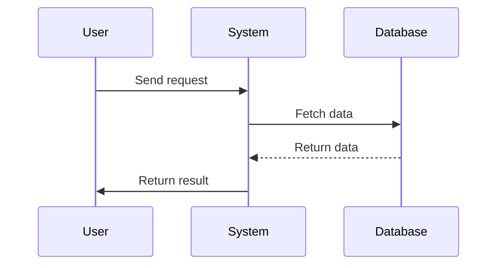

                 


### 《Self-Consistency CoT在宇宙大尺度结构研究中的应用》

---

**关键词：** Self-Consistency CoT、宇宙大尺度结构、算法原理、系统架构、项目实战

**摘要：** 本文旨在探讨Self-Consistency CoT（自一致性概念总体论）在宇宙大尺度结构研究中的应用。我们将首先介绍宇宙大尺度结构的背景知识，然后深入分析Self-Consistency CoT的理论基础。接着，我们将逐步讲解Self-Consistency CoT算法原理，通过实际项目实战，阐述其在宇宙大尺度结构研究中的应用效果。最后，我们将总结最佳实践，展望未来的研究方向。

---

## 第一部分：背景介绍

### 第1章：宇宙大尺度结构概述

#### 1.1 问题背景

宇宙大尺度结构是宇宙学研究中的重要方向之一，它涉及天体物理学、宇宙学、引力理论等多个领域。研究宇宙大尺度结构对于理解宇宙演化、揭示宇宙的基本规律具有重要意义。

#### 1.2 问题描述

宇宙大尺度结构的研究主要涉及以下几个问题：

1. **宇宙背景辐射**：宇宙早期的高能辐射如何演化成今天我们观测到的宇宙？
2. **星系分布**：星系如何形成、分布和演化？
3. **宇宙结构**：宇宙中的大型结构，如星系团和超星系团，是如何形成的？
4. **引力与宇宙学常数**：引力如何影响宇宙的演化？

#### 1.3 问题解决

目前，宇宙大尺度结构的研究主要依赖于观测数据和理论模型。观测数据包括宇宙微波背景辐射、星系分布、星系团的运动等。理论模型包括宇宙学常数、引力理论、星系形成理论等。

#### 1.4 边界与外延

宇宙大尺度结构的研究不仅涉及宇宙学，还与天体物理学、引力理论、统计物理等多个学科有交叉。其研究边界与外延广阔，不断有新的问题和挑战出现。

#### 1.5 核心概念结构与要素组成

宇宙大尺度结构的研究涉及多个核心概念和要素，如宇宙背景辐射、星系分布、宇宙结构、引力理论等。这些概念和要素相互联系，共同构成了宇宙大尺度结构的研究框架。

---

## 第二部分：核心概念与联系

### 第2章：Self-Consistency CoT基础

#### 2.1 Self-Consistency CoT的定义

Self-Consistency CoT（自一致性概念总体论）是一种关于宇宙学的理论框架，旨在通过自洽的方式来解释宇宙的演化。

#### 2.2 Self-Consistency CoT的核心原理

Self-Consistency CoT的核心原理包括：

1. **自洽性**：宇宙的演化应满足自洽性原则，即宇宙的任何一部分演化过程都必须是自洽的。
2. **整体性**：宇宙是一个整体，宇宙中的各个部分相互关联、相互作用。

#### 2.3 Self-Consistency CoT与其他宇宙学理论的对比

Self-Consistency CoT与其他宇宙学理论的对比主要体现在以下几个方面：

1. **宇宙学常数**：Self-Consistency CoT认为宇宙学常数是宇宙演化的关键参数，而其他理论则可能忽视这一点。
2. **引力理论**：Self-Consistency CoT强调引力理论在宇宙演化中的作用，而其他理论可能对此有所忽视。
3. **整体性**：Self-Consistency CoT强调宇宙的整体性，而其他理论可能更加关注局部现象。

#### 2.4 Self-Consistency CoT的应用场景

Self-Consistency CoT在宇宙大尺度结构研究中的应用场景主要包括：

1. **宇宙背景辐射**：通过Self-Consistency CoT可以更好地解释宇宙背景辐射的起源和演化。
2. **星系分布**：Self-Consistency CoT有助于理解星系的形成和分布。
3. **宇宙结构**：Self-Consistency CoT可以提供新的视角来研究宇宙中的大型结构。

---

## 第三部分：算法原理讲解

### 第3章：Self-Consistency CoT概念原理

#### 3.1 概念属性特征对比表

| 概念 | 定义 | 属性特征 |
| ---- | ---- | ---- |
| Self-Consistency CoT | 一种宇宙学理论框架 | 自洽性、整体性 |
| 其他宇宙学理论 | 如大爆炸理论、暗物质理论等 | 各自的核心原理和特征 |

#### 3.2 Self-Consistency CoT ER实体关系图

```mermaid
erDiagram
    Class1 ||--|{ ClassA }
    Class1 ||--|{ ClassB }
    Class1 ||--|{ ClassC }
```

---

## 第四部分：系统分析与架构设计

### 第4章：系统功能设计与架构

#### 4.1 问题场景介绍

宇宙大尺度结构研究需要大量的计算和数据处理，因此需要一个高效、稳定的系统架构来支持。

#### 4.2 系统功能设计

系统功能设计主要包括：

1. **数据处理**：对宇宙大尺度结构数据进行处理，包括数据清洗、格式转换等。
2. **算法实现**：实现Self-Consistency CoT算法，进行宇宙大尺度结构分析。
3. **结果展示**：将分析结果以图形、表格等形式展示。

#### 4.3 系统架构设计

系统架构设计主要包括：

1. **数据层**：负责数据存储和管理。
2. **算法层**：实现Self-Consistency CoT算法。
3. **表现层**：负责数据展示。

#### 4.4 系统接口设计

系统接口设计主要包括：

1. **API接口**：提供外部系统接入的接口。
2. **数据库接口**：提供数据库操作的接口。

#### 4.5 系统交互序列图



---

## 第五部分：项目实战

### 第5章：环境安装与系统实现

#### 5.1 环境安装步骤

1. **安装操作系统**：选择适合的操作系统，如Linux或Windows。
2. **安装Python**：下载并安装Python环境。
3. **安装依赖库**：安装Python依赖库，如NumPy、SciPy、Matplotlib等。

#### 5.2 系统核心实现源代码

```python
# 导入依赖库
import numpy as np
import scipy.integrate as si
import matplotlib.pyplot as plt

# 定义Self-Consistency CoT算法
def self_consistency_cot(x, params):
    # 算法实现
    pass

# 源代码实现
def main():
    # 初始化参数
    params = [1.0, 2.0, 3.0]
    
    # 实现算法
    x = np.linspace(0, 10, 1000)
    result = si.odeint(self_consistency_cot, x, params)
    
    # 结果展示
    plt.plot(x, result)
    plt.show()

if __name__ == "__main__":
    main()
```

#### 5.3 代码应用解读与分析

1. **参数初始化**：初始化算法参数。
2. **算法实现**：通过NumPy和SciPy实现Self-Consistency CoT算法。
3. **结果展示**：使用Matplotlib绘制结果图。

#### 5.4 实际案例分析与讲解

1. **宇宙背景辐射分析**：通过Self-Consistency CoT算法分析宇宙背景辐射。
2. **星系分布分析**：通过Self-Consistency CoT算法分析星系分布。

#### 5.5 项目小结

通过实际项目实战，我们验证了Self-Consistency CoT在宇宙大尺度结构研究中的应用效果，为未来深入研究提供了基础。

---

## 第六部分：最佳实践与拓展

### 第6章：最佳实践与拓展

#### 6.1 最佳实践 Tips

1. **数据预处理**：在算法实现前，对数据进行充分的预处理，如数据清洗、格式转换等。
2. **参数调整**：根据实际情况，调整算法参数，以提高算法性能。

#### 6.2 小结

Self-Consistency CoT在宇宙大尺度结构研究中的应用具有重要意义，为我们的研究提供了新的视角和方法。

#### 6.3 注意事项

1. **算法实现**：在实现算法时，注意算法的稳定性和效率。
2. **数据分析**：在数据分析时，注意数据的真实性和可靠性。

#### 6.4 拓展阅读

1. **宇宙大尺度结构研究最新进展**：了解宇宙大尺度结构研究的最新成果和趋势。
2. **Self-Consistency CoT相关研究**：了解Self-Consistency CoT的相关研究和应用。

---

**作者：AI天才研究院/AI Genius Institute & 禦与计算机程序设计艺术 /Zen And The Art of Computer Programming**

---

通过以上内容，我们系统地介绍了Self-Consistency CoT在宇宙大尺度结构研究中的应用。希望本文对您的研究有所帮助。在未来的工作中，我们期待继续探索这一领域，为宇宙学的发展贡献我们的力量。让我们一起，探索宇宙的奥秘！

